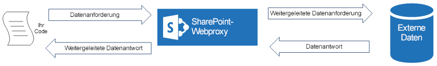
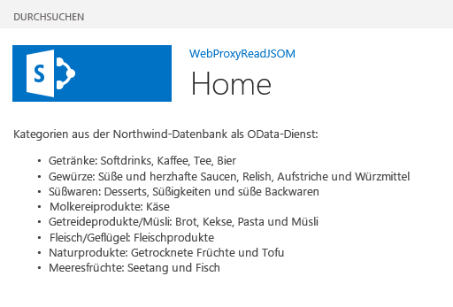

# <a name="query-a-remote-service-using-the-web-proxy-in-sharepoint"></a><span data-ttu-id="0fb96-102">Abfragen eines Remotediensts mithilfe des Webproxys in SharePoint</span><span class="sxs-lookup"><span data-stu-id="0fb96-102">Query a remote service using the web proxy in SharePoint</span></span>
<span data-ttu-id="0fb96-103">In diesem Artikel erfahren Sie, wie von einer in SharePoint gehosteten Seite mithilfe des Webproxys auf Daten in einer Remotedomäne zugegriffen wird.</span><span class="sxs-lookup"><span data-stu-id="0fb96-103">Learn how to access data in a remote domain from a page that is hosted in SharePoint by using the web proxy.</span></span>
 

 <span data-ttu-id="0fb96-p101">**Hinweis** Der Name „Apps für SharePoint“ wird in „SharePoint-Add-Ins“ geändert. Während des Übergangszeitraums wird in der Dokumentation und der Benutzeroberfläche einiger SharePoint-Produkte und Visual Studio-Tools möglicherweise weiterhin der Begriff „Apps für SharePoint“ verwendet. Weitere Informationen finden Sie unter [Neuer Name für Office- und SharePoint-Apps](new-name-for-apps-for-sharepoint.md#bk_newname).</span><span class="sxs-lookup"><span data-stu-id="0fb96-p101">**Note**  The name "apps for SharePoint" is changing to "SharePoint Add-ins". During the transition, the documentation and the UI of some SharePoint products and Visual Studio tools might still use the term "apps for SharePoint". For details, see  [New name for apps for Office and SharePoint](new-name-for-apps-for-sharepoint.md#bk_newname).</span></span>
 

<span data-ttu-id="0fb96-p102">Beim Erstellen von SharePoint-Add-Ins müssen Sie in der Regel Daten aus verschiedenen Quellen einbinden. Aus Sicherheitsgründen gibt es Blockierungsmechanismen, die eine domänenübergreifende Kommunikation verhindern. Wenn Sie den Webproxy verwenden, kann von den Webseiten in Ihrer App auf Daten in Ihrer Remotedomäne und in der SharePoint-Domäne zugegriffen werden.</span><span class="sxs-lookup"><span data-stu-id="0fb96-p102">When you are building SharePoint Add-ins, you usually have to incorporate data from various sources. For security reasons, there are blocking mechanisms that prevent cross-domain communication. When you use the web proxy, the webpages in your add-in can access data in your remote domain and the SharePoint domain.</span></span>
 

<span data-ttu-id="0fb96-p103">Als Entwickler können Sie den Webproxy verwenden, der in Client-APIs wie den JavaScript- und .NET-Clientobjektmodellen verfügbar gemacht wird. Wenn Sie den Webproxy verwenden, senden Sie die ursprüngliche Anforderung an SharePoint. SharePoint fordert die Daten wiederum am angegebenen Endpunkt an und gibt die Antwort zurück an die Seite. Verwenden Sie den Webproxy, wenn die Kommunikation auf der Serverebene stattfinden soll. Weitere Informationen finden Sie unter [Sicherer Datenzugriff und Clientobjektmodelle für SharePoint Add-Ins](secure-data-access-and-client-object-models-for-sharepoint-add-ins.md).</span><span class="sxs-lookup"><span data-stu-id="0fb96-p103">As a developer, you can use the web proxy exposed in client APIs, such as the JavaScript and .NET client object models. When you use the web proxy, you issue the initial request to SharePoint. In turn, SharePoint requests the data to the specified endpoint and forwards the response back to your page. Use the web proxy when you want the communication to occur at the server level. For more information, see  [Secure data access and client object models for SharePoint Add-ins](secure-data-access-and-client-object-models-for-sharepoint-add-ins.md).</span></span>
 


<span data-ttu-id="0fb96-115">**SharePoint-Webproxy als Vermittler zwischen Ihrem Code und der externen Datenquelle**</span><span class="sxs-lookup"><span data-stu-id="0fb96-115">**SharePoint Web Proxy is middle man between your code and external data source**</span></span>

 

 

 

 

 

## <a name="prerequisites-for-using-the-examples-in-this-article"></a><span data-ttu-id="0fb96-117">Voraussetzungen für die Verwendung der Beispiele in diesem Artikel</span><span class="sxs-lookup"><span data-stu-id="0fb96-117">Prerequisites for using the examples in this article</span></span>
<span data-ttu-id="0fb96-118"><a name="SP15Queryremoteservice_Prereq"> </a></span><span class="sxs-lookup"><span data-stu-id="0fb96-118"><a name="SP15Queryremoteservice_Prereq"> </a></span></span>

<span data-ttu-id="0fb96-119">Um die Schritte in diesem Beispiel auszuführen, benötigen Sie Folgendes:</span><span class="sxs-lookup"><span data-stu-id="0fb96-119">To follow the steps in this example, you need the following:</span></span>
 

 

-  [<span data-ttu-id="0fb96-120">Visual Studio 2015 und die neuesten Microsoft Office Developer Tools </span><span class="sxs-lookup"><span data-stu-id="0fb96-120">Visual Studio 2015 and the latest Microsoft Office Developer Tools</span></span>](https://www.visualstudio.com/features/office-tools-vs.aspx)
    
 
- <span data-ttu-id="0fb96-121">Eine SharePoint-Entwicklungsumgebung (Add-In-Isolierung für lokale Szenarios erforderlich)</span><span class="sxs-lookup"><span data-stu-id="0fb96-121">A SharePoint development environment (add-in isolation required for on-premises scenarios)</span></span>
    
 

### <a name="core-concepts-to-know-before-using-the-web-proxy"></a><span data-ttu-id="0fb96-122">Kernkonzepte für die Verwendung des Webproxys</span><span class="sxs-lookup"><span data-stu-id="0fb96-122">Core concepts to know before using the web proxy</span></span>

<span data-ttu-id="0fb96-123">In der folgenden Tabelle werden einige wichtige Artikel aufgelistet, in denen die relevanten Konzepte für ein domänenübergreifendes Szenario für SharePoint-Add-Ins erläutert werden.</span><span class="sxs-lookup"><span data-stu-id="0fb96-123">The following table lists some useful articles that can help you understand the concepts involved in a cross-domain scenario in SharePoint Add-ins.</span></span>
 

 

<span data-ttu-id="0fb96-124">**Tabelle 1. Kernkonzepte für den Webproxy**</span><span class="sxs-lookup"><span data-stu-id="0fb96-124">**Table 1. Core concepts for the web proxy**</span></span>


|<span data-ttu-id="0fb96-125">**Titel des Artikels**</span><span class="sxs-lookup"><span data-stu-id="0fb96-125">**Article title**</span></span>|<span data-ttu-id="0fb96-126">**Beschreibung**</span><span class="sxs-lookup"><span data-stu-id="0fb96-126">**Description**</span></span>|
|:-----|:-----|
| [<span data-ttu-id="0fb96-127">SharePoint-Add-Ins</span><span class="sxs-lookup"><span data-stu-id="0fb96-127">SharePoint Add-ins</span></span>](sharepoint-add-ins.md)|<span data-ttu-id="0fb96-128">Hier finden Sie Informationen über das neue Add-In-Modell in SharePoint, das es Ihnen ermöglicht, Add-Ins als kompakte, einfach zu verwendende Lösungen für Endbenutzer zu erstellen.</span><span class="sxs-lookup"><span data-stu-id="0fb96-128">Learn about the new add-in model in SharePoint that enables you to create add-ins, which are small, easy-to-use solutions for end users.</span></span>|
| [<span data-ttu-id="0fb96-129">Sicherer Datenzugriff und Clientobjektmodelle für SharePoint-Add-Ins</span><span class="sxs-lookup"><span data-stu-id="0fb96-129">Secure data access and client object models for SharePoint Add-ins</span></span>](secure-data-access-and-client-object-models-for-sharepoint-add-ins.md)|<span data-ttu-id="0fb96-130">Erfahren Sie mehr über Datenzugriffsoptionen in SharePoint-Add-Ins. In diesem Artikel finden Sie Anleitungen zu den allgemeinen Entscheidungen, die Sie beim Arbeiten mit Daten in Ihrer App treffen müssen.</span><span class="sxs-lookup"><span data-stu-id="0fb96-130">Learn about data access options in SharePoint Add-ins. This article provides guidance on the high-level alternatives you have to choose from when working with data in your add-in.</span></span>|
| [<span data-ttu-id="0fb96-131">Hostwebs, Add-In-Webs und SharePoint-Komponenten in SharePoint</span><span class="sxs-lookup"><span data-stu-id="0fb96-131">Host webs, add-in webs, and SharePoint components in SharePoint</span></span>](host-webs-add-in-webs-and-sharepoint-components-in-sharepoint.md)|<span data-ttu-id="0fb96-p104">In diesem Artikel erfahren Sie, welche Unterschiede zwischen Hostwebsites und Add-In-Websites bestehen. Sie erfahren zudem, welche SharePoint-Komponenten in eine SharePoint-Add-In aufgenommen werden können, welche Komponenten für die Hostwebsite und welche für die Add-In-Website bereitgestellt werden und wie die Add-In-Website in einer isolierten Domäne bereitgestellt wird.</span><span class="sxs-lookup"><span data-stu-id="0fb96-p104">Learn about the difference between host webs and add-in webs. Find out which SharePoint components can be included in a SharePoint Add-in, which components are deployed to the host web, which components are deployed to the add-in web, and how the add-in web is deployed in an isolated domain.</span></span>|
| [<span data-ttu-id="0fb96-134">Clientseitige domänenübergreifende Sicherheit</span><span class="sxs-lookup"><span data-stu-id="0fb96-134">Client-side Cross-domain Security</span></span>](http://msdn.microsoft.com/en-us/library/cc709423%28v=vs.85%29.aspx)|<span data-ttu-id="0fb96-135">Machen Sie sich mit domänenübergreifende Bedrohungen und Anwendungsfällen sowie Sicherheitsprinzipien für ursprungsübergreifende Anforderungen vertraut, und wägen Sie die Risiken ab, die Entwickler eingehen, wenn sie den domänenübergreifenden Zugriff von im Browser ausgeführten Webanwendungen erweitern.</span><span class="sxs-lookup"><span data-stu-id="0fb96-135">Explore cross-domain threats and use cases, security principles for cross-origin requests, and weigh the risks for developers to enhance cross-domain access from web applications that run in the browser.</span></span>|

## <a name="code-example-access-data-in-a-remote-service-using-the-web-proxy"></a><span data-ttu-id="0fb96-136">Codebeispiel: Zugreifen auf Daten in einem Remotedienst mithilfe des Webproxys</span><span class="sxs-lookup"><span data-stu-id="0fb96-136">Code example: Access data in a remote service using the web proxy</span></span>
<span data-ttu-id="0fb96-137"><a name="SP15Queryremoteservice_Codeexample"> </a></span><span class="sxs-lookup"><span data-stu-id="0fb96-137"><a name="SP15Queryremoteservice_Codeexample"> </a></span></span>

<span data-ttu-id="0fb96-138">Führen Sie die folgenden Schritte aus, um Daten von einem Remotedienst zu lesen:</span><span class="sxs-lookup"><span data-stu-id="0fb96-138">To read data from a remote service, you must do the following:</span></span> 
 

 

1. <span data-ttu-id="0fb96-139">Erstellen Sie ein SharePoint-Add-In-Projekt.</span><span class="sxs-lookup"><span data-stu-id="0fb96-139">Create a SharePoint Add-in project.</span></span>
    
 
2. <span data-ttu-id="0fb96-140">Ändern Sie die Seite **Default.aspx**, um den Webproxy zum Abfragen des Remotediensts zu verwenden.</span><span class="sxs-lookup"><span data-stu-id="0fb96-140">Modify the  **Default.aspx** page to use the web proxy to query the remote service.</span></span>
    
 
3. <span data-ttu-id="0fb96-141">Ändern Sie das App-Manifest so, dass die Kommunikation mit der Remotedomäne zugelassen wird.</span><span class="sxs-lookup"><span data-stu-id="0fb96-141">Modify the add-in manifest to allow communication to the remote domain.</span></span>
    
 
<span data-ttu-id="0fb96-142">In Abbildung 1 ist das Browserfenster mit Daten vom Remotedienst auf einer SharePoint-Webseite dargestellt.</span><span class="sxs-lookup"><span data-stu-id="0fb96-142">Figure 1 shows the browser window with data from the remote service in a SharePoint webpage.</span></span>
 

 

<span data-ttu-id="0fb96-143">**Abbildung 1. SharePoint-Webseite mit Daten vom Remotedienst**</span><span class="sxs-lookup"><span data-stu-id="0fb96-143">**Figure 1. SharePoint webpage with data from the remote service**</span></span>

 

 

 

### <a name="to-create-the-sharepoint-add-in-project"></a><span data-ttu-id="0fb96-145">So erstellen Sie das App für SharePoint-Projekt</span><span class="sxs-lookup"><span data-stu-id="0fb96-145">To create the SharePoint Add-in project</span></span>


1. <span data-ttu-id="0fb96-p105">Öffnen Sie 2015 als Administrator. (Klicken Sie hierzu im Menü **Start** mit der rechten Maustaste auf das Symbol 2015, und wählen Sie **Als Administrator ausführen** aus.)</span><span class="sxs-lookup"><span data-stu-id="0fb96-p105">Open 2015 as administrator. (To do this, right-click the 2015 icon in the  **Start** menu, and choose **Run as administrator**.)</span></span>
    
 
2. <span data-ttu-id="0fb96-148">Erstellen Sie ein neues Projekt unter Verwendung der Vorlage **SharePoint-Add-In**.</span><span class="sxs-lookup"><span data-stu-id="0fb96-148">Create a new project using the  **SharePoint Add-in** template</span></span>
    
    <span data-ttu-id="0fb96-149">Abbildung 2 zeigt den Speicherort der Vorlage **SharePoint-Add-In** in 2015 unter **Vorlagen**, **Visual C#**, **Office/SharePoint**, **Office-Add-Ins**.</span><span class="sxs-lookup"><span data-stu-id="0fb96-149">Figure 2 shows the location of the  **SharePoint Add-in** template in 2015, under **Templates**,  **Visual C#**,  **Office/SharePoint**,  **Office Add-ins**.</span></span>
    

    <span data-ttu-id="0fb96-150">**Abbildung 2. Visual Studio-Vorlage für SharePoint-Add-Ins**</span><span class="sxs-lookup"><span data-stu-id="0fb96-150">**Figure 2. SharePoint Add-in Visual Studio template**</span></span>

 

  
 

 

 
3. <span data-ttu-id="0fb96-152">Geben Sie die URL der SharePoint-Website an, die Sie für das Debugging verwenden möchten.</span><span class="sxs-lookup"><span data-stu-id="0fb96-152">Provide the URL of the SharePoint website that you want to use for debugging.</span></span>
    
 
4. <span data-ttu-id="0fb96-153">Wählen Sie **Von SharePoint gehostet** als Hostingoption für Ihr Add-In aus.</span><span class="sxs-lookup"><span data-stu-id="0fb96-153">Select  **SharePoint-hosted** as the hosting option for your add-in.</span></span>
    
 

### <a name="to-modify-the-defaultaspx-page-to-use-the-web-proxy-by-using-the-javascript-object-model"></a><span data-ttu-id="0fb96-154">So ändern Sie die Seite „Default.aspx“ für die Verwendung des Webproxys mithilfe des JavaScript-Objektmodells</span><span class="sxs-lookup"><span data-stu-id="0fb96-154">To modify the Default.aspx page to use the web proxy by using the JavaScript object model</span></span>


1. <span data-ttu-id="0fb96-155">Doppelklicken Sie im Ordner **Seiten** auf die Datei **Default.aspx**.</span><span class="sxs-lookup"><span data-stu-id="0fb96-155">Double-click the  **Default.aspx** page in the **Pages** folder.</span></span>
    
 
2. <span data-ttu-id="0fb96-p106">Kopieren Sie das folgende Markup, und fügen Sie es in das **PlaceHolderMain**-Inhaltstag der Seite ein. Das Markup führt die folgenden Aufgaben aus:</span><span class="sxs-lookup"><span data-stu-id="0fb96-p106">Copy the following markup and paste it in the  **PlaceHolderMain** content tag of the page. The markup performs the following tasks:</span></span>
    
      - <span data-ttu-id="0fb96-158">Bereitstellen eines Platzhalters für die Remotedaten.</span><span class="sxs-lookup"><span data-stu-id="0fb96-158">Provides a placeholder for the remote data.</span></span>
    
 
  - <span data-ttu-id="0fb96-159">Verweisen auf die SharePoint-JavaScript-Dateien.</span><span class="sxs-lookup"><span data-stu-id="0fb96-159">References the SharePoint JavaScript files.</span></span>
    
 
  - <span data-ttu-id="0fb96-160">Vorbereiten der Anforderung mit einem **WebRequestInfo**-Objekt.</span><span class="sxs-lookup"><span data-stu-id="0fb96-160">Prepares the request with a  **WebRequestInfo** object.</span></span>
    
 
  - <span data-ttu-id="0fb96-161">Vorbereiten der **Accept**-Kopfzeile der Anforderung für das Angeben der Antwort im JavaScript Object Notation (JSON)-Format.</span><span class="sxs-lookup"><span data-stu-id="0fb96-161">Prepares the request  **Accept** header to specify the response in the JavaScript Object Notation (JSON) format.</span></span>
    
 
  - <span data-ttu-id="0fb96-162">Ausgeben eines Aufrufs des Remoteendpunkts.</span><span class="sxs-lookup"><span data-stu-id="0fb96-162">Issues a call to the remote endpoint.</span></span>
    
 
  - <span data-ttu-id="0fb96-163">Behandeln des erfolgreichen Abschlusses durch Rendern der Remotedaten auf der SharePoint-Webseite.</span><span class="sxs-lookup"><span data-stu-id="0fb96-163">Handles successful completion, rendering the remote data in the SharePoint webpage.</span></span>
    
 
  - <span data-ttu-id="0fb96-164">Behandeln eventuell auftretender Fehler durch Rendern der Fehlermeldung auf der SharePoint-Webseite.</span><span class="sxs-lookup"><span data-stu-id="0fb96-164">Handles any errors, rendering the error message in the SharePoint webpage.</span></span>
    
 

```
  Categories from the Northwind database exposed as an OData service: 
    
<!-- Placeholder for the remote content -->
<span id="categories"></span>

<!-- Add references to the JavaScript libraries. -->
<script 
    type="text/javascript" 
    src="../_layouts/15/SP.Runtime.js">
</script>
<script 
    type="text/javascript" 
    src="../_layouts/15/SP.js">
</script>
<script type="text/javascript">
(function () {
    "use strict";

    // Prepare the request to an OData source
    // using the GET verb.
    var context = SP.ClientContext.get_current();
    var request = new SP.WebRequestInfo();
    request.set_url(
        "http://services.odata.org/Northwind/Northwind.svc/Categories"
        );
    request.set_method("GET");

    // We need the response formatted as JSON.
    request.set_headers({ "Accept": "application/json;odata=verbose" });
    var response = SP.WebProxy.invoke(context, request);

    // Let users know that there is some
    // processing going on.
    document.getElementById("categories").innerHTML =
                "<P>Loading categories...</P>";

    // Set the event handlers and invoke the request.
    context.executeQueryAsync(successHandler, errorHandler);

    // Event handler for the success event.
    // Get the totalResults node in the response.
    // Render the value in the placeholder.
    function successHandler() {

        // Check for status code == 200
        // Some other status codes, such as 302 redirect
        // do not trigger the errorHandler. 
        if (response.get_statusCode() == 200) {
            var categories;
            var output;

            // Load the OData source from the response.
            categories = JSON.parse(response.get_body());

            // Extract the CategoryName and Description
            // from each result in the response.
            // Build the output as a list.
            output = "<UL>";
            for (var i = 0; i < categories.d.results.length; i++) {
                var categoryName;
                var description;
                categoryName = categories.d.results[i].CategoryName;
                description = categories.d.results[i].Description;
                output += "<LI>" + categoryName + ":&amp;nbsp;" +
                    description + "</LI>";
            }
            output += "</UL>";

            document.getElementById("categories").innerHTML = output;
        }
        else {
            var errordesc;

            errordesc = "<P>Status code: " +
                response.get_statusCode() + "<br/>";
            errordesc += response.get_body();
            document.getElementById("categories").innerHTML = errordesc;
        }
    }

    // Event handler for the error event.
    // Render the response body in the placeholder.
    // The body includes the error message.
    function errorHandler() {
        document.getElementById("categories").innerHTML =
            response.get_body();
    }
})();
</script>
```


### <a name="optional-to-modify-the-defaultaspx-page-to-use-the-web-proxy-by-using-the-rest-endpoint"></a><span data-ttu-id="0fb96-165">(Optional) So ändern Sie die Seite "Default.aspx" für die Verwendung des Webproxys mithilfe des REST-Endpunkts</span><span class="sxs-lookup"><span data-stu-id="0fb96-165">(Optional) To modify the Default.aspx page to use the web proxy by using the REST endpoint</span></span>


1. <span data-ttu-id="0fb96-166">Doppelklicken Sie im Ordner **Seiten** auf die Datei **Default.aspx**.</span><span class="sxs-lookup"><span data-stu-id="0fb96-166">Double-click the  **Default.aspx** page in the **Pages** folder.</span></span>
    
 
2. <span data-ttu-id="0fb96-p107">Kopieren Sie das folgende Markup, und fügen Sie es in das **PlaceHolderMain**-Inhaltstag der Seite ein. Das Markup führt die folgenden Aufgaben aus:</span><span class="sxs-lookup"><span data-stu-id="0fb96-p107">Copy the following markup and paste it in the  **PlaceHolderMain** content tag of the page. The markup performs the following tasks:</span></span>
    
      - <span data-ttu-id="0fb96-169">Bereitstellen eines Platzhalters für die Remotedaten.</span><span class="sxs-lookup"><span data-stu-id="0fb96-169">Provides a placeholder for the remote data.</span></span>
    
 
  - <span data-ttu-id="0fb96-170">Verweisen auf die jQuery-Bibliothek.</span><span class="sxs-lookup"><span data-stu-id="0fb96-170">References the jQuery library.</span></span>
    
 
  - <span data-ttu-id="0fb96-171">Vorbereiten der Anforderung auf den **SP.WebRequest.Invoke**-Endpunkt.</span><span class="sxs-lookup"><span data-stu-id="0fb96-171">Prepares the request to the  **SP.WebRequest.Invoke** endpoint.</span></span>
    
 
  - <span data-ttu-id="0fb96-p108">Vorbereiten des Textkörpers der Anforderung mit einem **SP.WebrequestInfo**-Objekt. Das Objekt enthält eine **Accept**-Kopfzeile zum Angeben der Antwort im JavaScript Object Notation (JSON)-Format.</span><span class="sxs-lookup"><span data-stu-id="0fb96-p108">Prepares the body of the request with a  **SP.WebrequestInfo** object. The object includes an **Accept** header to specify the response in the JavaScript Object Notation (JSON) format.</span></span>
    
 
  - <span data-ttu-id="0fb96-174">Ausgeben eines Aufrufs des Remoteendpunkts.</span><span class="sxs-lookup"><span data-stu-id="0fb96-174">Issues a call to the remote endpoint.</span></span>
    
 
  - <span data-ttu-id="0fb96-175">Behandeln des erfolgreichen Abschlusses durch Rendern der Remotedaten auf der SharePoint-Webseite.</span><span class="sxs-lookup"><span data-stu-id="0fb96-175">Handles successful completion, rendering the remote data in the SharePoint webpage.</span></span>
    
 
  - <span data-ttu-id="0fb96-176">Behandeln eventuell auftretender Fehler durch Rendern der Fehlermeldung auf der SharePoint-Webseite.</span><span class="sxs-lookup"><span data-stu-id="0fb96-176">Handles any errors, rendering the error message in the SharePoint webpage.</span></span>
    
 

```
  Categories from the Northwind database exposed as an OData service: 
    
<!-- Placeholder for the remote content -->
<span id="categories"></span>

<script 
    type="text/javascript" 
    src="//ajax.aspnetcdn.com/ajax/jQuery/jquery-1.8.0.min.js">
</script>

<script type="text/javascript">
(function () {
    "use strict";

    // The Northwind categories endpoint.
    var url =
        "http://services.odata.org/Northwind/Northwind.svc/Categories";

    // Let users know that there is some
    // processing going on.
    document.getElementById("categories").innerHTML =
                "<P>Loading categories...</P>";

    // Issue a POST request to the SP.WebProxy.Invoke endpoint.
    // The body has the information to issue a GET request
    // to the Northwind service.
    $.ajax({
        url: "../_api/SP.WebProxy.invoke",
        type: "POST",
        data: JSON.stringify(
            {
                "requestInfo": {
                    "__metadata": { "type": "SP.WebRequestInfo" },
                    "Url": url,
                    "Method": "GET",
                    "Headers": {
                        "results": [{
                            "__metadata": { "type": "SP.KeyValue" },
                            "Key": "Accept",
                            "Value": "application/json;odata=verbose",
                            "ValueType": "Edm.String"
                        }]
                    }
                }
            }),
        headers: {
            "Accept": "application/json;odata=verbose",
            "Content-Type": "application/json;odata=verbose",
            "X-RequestDigest": $("#__REQUESTDIGEST").val()
        },
        success: successHandler,
        error: errorHandler
    });

    // Event handler for the success event.
    // Get the totalResults node in the response.
    // Render the value in the placeholder.
    function successHandler(data) {
        // Check for status code == 200
        // Some other status codes, such as 302 redirect,
        // do not trigger the errorHandler. 
        if (data.d.Invoke.StatusCode == 200) {
            var categories;
            var output;

            // Load the OData source from the response.
            categories = JSON.parse(data.d.Invoke.Body);

            // Extract the CategoryName and Description
            // from each result in the response.
            // Build the output as a list
            output = "<UL>";
            for (var i = 0; i < categories.d.results.length; i++) {
                var categoryName;
                var description;
                categoryName = categories.d.results[i].CategoryName;
                description = categories.d.results[i].Description;
                output += "<LI>" + categoryName + ":&amp;nbsp;" +
                    description + "</LI>";
            }
            output += "</UL>";

            document.getElementById("categories").innerHTML = output;
        }
        else {
            var errordesc;

            errordesc = "<P>Status code: " +
                data.d.Invoke.StatusCode + "<br/>";
            errordesc += response.get_body();
            document.getElementById("categories").innerHTML = errordesc;
        }
    }

    // Event handler for the error event.
    // Render the response body in the placeholder.
    // The 2nd argument includes the error message.
    function errorHandler() {
        document.getElementById("categories").innerHTML =
            arguments[2];
    }
})();
</script>

```


### <a name="to-edit-the-add-in-manifest-file"></a><span data-ttu-id="0fb96-177">So bearbeiten Sie die App-Manifestdatei</span><span class="sxs-lookup"><span data-stu-id="0fb96-177">To edit the add-in manifest file</span></span>


1. <span data-ttu-id="0fb96-178">Öffnen Sie im **Projektmappen-Explorer** das Kontextmenü der Datei **AppManifest.xml**, und wählen Sie **Code anzeigen** aus.</span><span class="sxs-lookup"><span data-stu-id="0fb96-178">In  **Solution Explorer**, open the shortcut menu for the  **AppManifest.xml** file, and choose **View code**.</span></span>
    
 
2. <span data-ttu-id="0fb96-179">Kopieren Sie die folgende **RemoteEndPoints**-Definition als untergeordneten Knoten des **App**-Knotens.</span><span class="sxs-lookup"><span data-stu-id="0fb96-179">Copy the following  **RemoteEndPoints** definition as a child of the **App** node.</span></span>
    
```XML
  <RemoteEndpoints>
    <RemoteEndpoint Url=" http://services.odata.org" />
</RemoteEndpoints>
```


    The  **RemoteEndpoint** element is used to specify the remote domain. The web proxy validates that the requests issued to remote domains are declared in the add-in manifest. You can create up to 20 entries in the **RemoteEndpoints** element. Only the authority part is considered; `http://domain:port` and `http://domain:port/website` are considered the same endpoint. You can issue calls to many different endpoints within the same domain with just one **RemoteEndpoint** definition.
    
 

### <a name="to-build-and-run-the-solution"></a><span data-ttu-id="0fb96-180">So erstellen Sie die Lösung und führen sie aus</span><span class="sxs-lookup"><span data-stu-id="0fb96-180">To build and run the solution</span></span>


1. <span data-ttu-id="0fb96-181">Drücken Sie F5.</span><span class="sxs-lookup"><span data-stu-id="0fb96-181">Press the F5 key.</span></span>
    
     <span data-ttu-id="0fb96-182">**Hinweis** Wenn Sie F5 drücken, erstellt Visual Studio die Lösung, stellt das Add-In bereit und öffnet die Berechtigungsseite für das Add-In.</span><span class="sxs-lookup"><span data-stu-id="0fb96-182">**Note**  When you press F5, Visual Studio builds the solution, deploys the add-in, and opens the permissions page for the add-in.</span></span>
2. <span data-ttu-id="0fb96-183">Klicken Sie auf die Schaltfläche **Vertrauen**.</span><span class="sxs-lookup"><span data-stu-id="0fb96-183">Choose the  **Trust It** button.</span></span>
    
 
3. <span data-ttu-id="0fb96-184">Klicken Sie auf der Seite „Websiteinhalte“ auf das App-Symbol.</span><span class="sxs-lookup"><span data-stu-id="0fb96-184">Click the add-in icon in the Site Contents page.</span></span>
    
    <span data-ttu-id="0fb96-185">In Abbildung 3 sind die Remotedaten auf der SharePoint-Webseite dargestellt.</span><span class="sxs-lookup"><span data-stu-id="0fb96-185">Figure 3 shows the remote data in the SharePoint webpage.</span></span>
    

    <span data-ttu-id="0fb96-186">**Abbildung 3. Remotedaten auf der SharePoint-Webseite**</span><span class="sxs-lookup"><span data-stu-id="0fb96-186">**Figure 3. Remote data in the SharePoint webpage**</span></span>

 

  
 

 

 

<span data-ttu-id="0fb96-188">**Tabelle 2: Problembehandlung für die Lösung**</span><span class="sxs-lookup"><span data-stu-id="0fb96-188">**Table 2. Troubleshooting the solution**</span></span>


|<span data-ttu-id="0fb96-189">**Problem**</span><span class="sxs-lookup"><span data-stu-id="0fb96-189">**Problem**</span></span>|<span data-ttu-id="0fb96-190">**Lösung**</span><span class="sxs-lookup"><span data-stu-id="0fb96-190">**Solution**</span></span>|
|:-----|:-----|
|<span data-ttu-id="0fb96-191">Der Browser wird nicht geöffnet, nachdem Sie F5 gedrückt haben.</span><span class="sxs-lookup"><span data-stu-id="0fb96-191">Visual Studio does not open the browser after you press the F5 key.</span></span>|<span data-ttu-id="0fb96-192">Legen Sie das SharePoint-Add-In-Projekt als Startprojekt fest.</span><span class="sxs-lookup"><span data-stu-id="0fb96-192">Set the SharePoint Add-in project as the startup project.</span></span>|
|<span data-ttu-id="0fb96-193">Die Schema-Port-Kombination wird nicht unterstützt.</span><span class="sxs-lookup"><span data-stu-id="0fb96-193">The scheme-port combination is not supported.</span></span>|<span data-ttu-id="0fb96-194">Die Aufrufschema-Port-Kombination muss folgende Kriterien erfüllen:</span><span class="sxs-lookup"><span data-stu-id="0fb96-194">The call schema-port combination must fall within the following criteria:</span></span>|<span data-ttu-id="0fb96-195">**Schema**</span><span class="sxs-lookup"><span data-stu-id="0fb96-195">**Scheme**</span></span>|<span data-ttu-id="0fb96-196">**Port**</span><span class="sxs-lookup"><span data-stu-id="0fb96-196">**Port**</span></span>|
|<span data-ttu-id="0fb96-197">:-----</span><span class="sxs-lookup"><span data-stu-id="0fb96-197">:-----</span></span>|<span data-ttu-id="0fb96-198">:-----</span><span class="sxs-lookup"><span data-stu-id="0fb96-198">:-----</span></span>|
|<span data-ttu-id="0fb96-199">http</span><span class="sxs-lookup"><span data-stu-id="0fb96-199">http</span></span>|<span data-ttu-id="0fb96-200">80</span><span class="sxs-lookup"><span data-stu-id="0fb96-200">80</span></span>|
|<span data-ttu-id="0fb96-201">https</span><span class="sxs-lookup"><span data-stu-id="0fb96-201">https</span></span>|<span data-ttu-id="0fb96-202">443</span><span class="sxs-lookup"><span data-stu-id="0fb96-202">443</span></span>|
|<span data-ttu-id="0fb96-203">http oder https</span><span class="sxs-lookup"><span data-stu-id="0fb96-203">http or https</span></span>|<span data-ttu-id="0fb96-204">7000-10000</span><span class="sxs-lookup"><span data-stu-id="0fb96-204">7000-10000</span></span>|

 <span data-ttu-id="0fb96-p109">**Wichtig** Die ausgehenden Ports unterliegen der Hostfirewallverfügbarkeit. Insbesondere sind in SharePoint Online nur HTTP-Port 80 und HTTPS-Port 443 verfügbar.</span><span class="sxs-lookup"><span data-stu-id="0fb96-p109">**Important**  The outbound ports are subject to host firewall availability. In particular, only http-80 and https-443 are available on SharePoint Online.</span></span>
 

<span data-ttu-id="0fb96-p110">| |Ausnahmefehler  **SP ist nicht definiert**.|Stellen Sie sicher, dass Sie auf die Datei „SP.RequestExecutor.js“ in einem Browserfenster zugreifen können. Wenn Sie den lokalen Server als Entwicklungsumgebung verwenden, müssen Sie die IIS-Loopbackprüfung deaktivieren. Führen Sie den folgenden Befehle von einer Windows PowerShell-Eingabeaufforderung aus.```New-ItemProperty HKLM:\System\CurrentControlSet\Control\Lsa -Name "DisableLoopbackCheck" -value "1" -PropertyType dword``` **Vorsicht** Die Deaktivierung der IIS-Loopbackprüfung wird in einer Produktionsumgebung nicht empfohlen. | |Die Größe der Antwort vom Remote-Endpunkt überschreitet den konfigurierten Grenzwert.|Die Größe der Antwort für Webproxyanforderungen darf 200 KB nicht überschreiten.|</span><span class="sxs-lookup"><span data-stu-id="0fb96-p110">| |Unhandled exception  **SP is undefined**.|Make sure you can access the SP.RequestExecutor.js file in a browser window.If you are using your local server as your development environment, you must disable IIS loopback check. Run the following command from a Windows PowerShell command prompt.```New-ItemProperty HKLM:\System\CurrentControlSet\Control\Lsa -Name "DisableLoopbackCheck" -value "1" -PropertyType dword``` **Caution**  Disabling the IIS loopback check is not recommended in a production environment. | |The size of the response from the remote endpoint exceeds the configured limit.|The response's size of web proxy requests must not be larger than 200 KB.|</span></span>

## <a name="next-steps"></a><span data-ttu-id="0fb96-211">Nächste Schritte</span><span class="sxs-lookup"><span data-stu-id="0fb96-211">Next steps</span></span>
<span data-ttu-id="0fb96-212"><a name="SP15Queryremoteservice_Next"> </a></span><span class="sxs-lookup"><span data-stu-id="0fb96-212"><a name="SP15Queryremoteservice_Next"> </a></span></span>

<span data-ttu-id="0fb96-p111">In diesem Artikel wurde veranschaulicht, wie Daten in einem Remotedienst von einer SharePoint-Webseite aus gelesen werden. Als Nächstes können Sie andere in SharePoint-Add-Ins verfügbare Datenzugriffsoptionen kennen lernen. Weitere Informationen finden Sie in den folgenden Ressourcen:</span><span class="sxs-lookup"><span data-stu-id="0fb96-p111">This article demonstrated how to read data in a remote service from a SharePoint webpage. As a next step, you can learn about other data access options that are available in SharePoint Add-ins. To learn more, see the following:</span></span>
 

 

-  [<span data-ttu-id="0fb96-215">Codebeispiel: Abrufen von Daten von einem Remotedienst mithilfe des Webproxys</span><span class="sxs-lookup"><span data-stu-id="0fb96-215">Code sample: Get data from a remote service using the web proxy</span></span>](http://code.msdn.microsoft.com/SharePoint-Get-data-705bdcd5)
    
 
-  [<span data-ttu-id="0fb96-216">Erstellen einer benutzerdefinierten Proxyseite für die domänenübergreifende Bibliothek in SharePoint</span><span class="sxs-lookup"><span data-stu-id="0fb96-216">Create a custom proxy page for the cross-domain library in SharePoint</span></span>](create-a-custom-proxy-page-for-the-cross-domain-library-in-sharepoint.md)
    
 
-  [<span data-ttu-id="0fb96-217">Zugreifen auf SharePoint-Daten über Add-Ins mithilfe der domänenübergreifenden Bibliothek</span><span class="sxs-lookup"><span data-stu-id="0fb96-217">Access SharePoint data from add-ins using the cross-domain library</span></span>](access-sharepoint-data-from-add-ins-using-the-cross-domain-library.md)
    
 
-  [<span data-ttu-id="0fb96-218">Gewusst wie: Zugreifen auf externe Daten mit REST in SharePoint 2013</span><span class="sxs-lookup"><span data-stu-id="0fb96-218">How to: Access external data with REST in SharePoint</span></span>](http://msdn.microsoft.com/library/0663cc8c-a736-434d-9858-6ce12ce7f748%28Office.15%29.aspx)
    
 

## <a name="additional-resources"></a><span data-ttu-id="0fb96-219">Zusätzliche Ressourcen</span><span class="sxs-lookup"><span data-stu-id="0fb96-219">Additional resources</span></span>
<span data-ttu-id="0fb96-220"><a name="SP15Queryremoteservice_Addresources"> </a></span><span class="sxs-lookup"><span data-stu-id="0fb96-220"><a name="SP15Queryremoteservice_Addresources"> </a></span></span>


-  [<span data-ttu-id="0fb96-221">Einrichten einer lokalen Entwicklungsumgebung für SharePoint-Add-Ins</span><span class="sxs-lookup"><span data-stu-id="0fb96-221">Set up an on-premises development environment for SharePoint Add-ins</span></span>](set-up-an-on-premises-development-environment-for-sharepoint-add-ins.md)
    
 
-  [<span data-ttu-id="0fb96-222">Arbeiten mit externen Daten in SharePoint</span><span class="sxs-lookup"><span data-stu-id="0fb96-222">Work with external data in SharePoint</span></span>](work-with-external-data-in-sharepoint.md)
    
 
-  [<span data-ttu-id="0fb96-223">Sicherer Datenzugriff und Clientobjektmodelle für SharePoint-Add-Ins</span><span class="sxs-lookup"><span data-stu-id="0fb96-223">Secure data access and client object models for SharePoint Add-ins</span></span>](secure-data-access-and-client-object-models-for-sharepoint-add-ins.md)
    
 
-  [<span data-ttu-id="0fb96-224">Autorisierung und Authentifizierung für Add-Ins in SharePoint</span><span class="sxs-lookup"><span data-stu-id="0fb96-224">Authorization and authentication of SharePoint Add-ins</span></span>](authorization-and-authentication-of-sharepoint-add-ins.md)
    
 
-  [<span data-ttu-id="0fb96-225">Verwenden von OData-Abfragevorgängen in SharePoint REST-Anforderungen</span><span class="sxs-lookup"><span data-stu-id="0fb96-225">Use OData query operations in SharePoint REST requests</span></span>](use-odata-query-operations-in-sharepoint-rest-requests.md)
    
 
-  [<span data-ttu-id="0fb96-226">Drei Ansätze, um Entwurfsentscheidungen für SharePoint-Add-Ins zu treffen</span><span class="sxs-lookup"><span data-stu-id="0fb96-226">Three ways to think about design options for SharePoint Add-ins</span></span>](three-ways-to-think-about-design-options-for-sharepoint-add-ins.md)
    
 
-  [<span data-ttu-id="0fb96-227">Kritische Aspekte der Architektur und der Entwicklungslandschaft für SharePoint-Add-Ins</span><span class="sxs-lookup"><span data-stu-id="0fb96-227">Important aspects of the SharePoint Add-in architecture and development landscape</span></span>](important-aspects-of-the-sharepoint-add-in-architecture-and-development-landscap.md)
    
 
-  [<span data-ttu-id="0fb96-228">Datenspeicheroptionen in SharePoint Add-Ins</span><span class="sxs-lookup"><span data-stu-id="0fb96-228">Data storage in SharePoint Add-ins</span></span>](important-aspects-of-the-sharepoint-add-in-architecture-and-development-landscap.md#Data)
    
 
