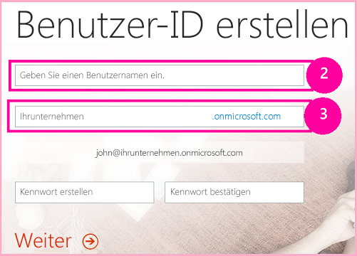
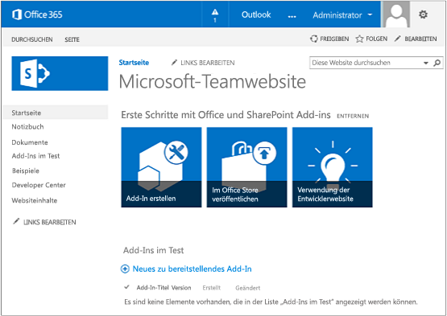

# Einrichten einer Entwicklungsumgebung für SharePoint-Add-Ins in Office 365Set up a development environment for SharePoint Add-ins on Office 365

Bevor Sie die Anleitungen in diesem Artikel umsetzen, sollten Sie sich einen Überblick über Ihre Optionen verschaffen. Lesen Sie dazu den Artikel [Tools und Umgebungen für die Entwicklung von SharePoint-Add-Ins](tools-and-environments-for-developing-sharepoint-add-ins.md).To get an understanding of your options before you carry out any procedures in this article, see [Tools and environments for developing SharePoint Add-ins](tools-and-environments-for-developing-sharepoint-add-ins.md). 

Wenn Sie sich nicht sicher sind, welche Art SharePoint-Add-In Sie erstellen möchten, ist der Artikel [SharePoint Add-ins](sharepoint-add-ins.md) hilfreich.If you are not sure what kinds of SharePoint Add-ins you want to create, see [SharePoint Add-ins](sharepoint-add-ins.md).
 

## Installieren von Visual Studio und Tools auf Ihrem ComputerInstall Visual Studio and tools on your computer

- Falls Sie **Visual Studio 2013** oder höher noch nicht installiert haben: Installieren Sie es mithilfe der Anweisungen unter [Installieren von Visual Studio](https://docs.microsoft.com/de-DE/visualstudio/install/install-visual-studio).If you don't already have  **Visual Studio** 2013 or later installed, install it with the instructions at [Install Visual Studio](https://docs.microsoft.com/de-DE/visualstudio/install/install-visual-studio). We recommend using the  latest version from the Microsoft Download Center. Wir empfehlen die Verwendung der [aktuellen Version aus dem Microsoft Download Center](https://www.visualstudio.com/downloads/download-visual-studio-vs).We recommend using the [latest version from the Microsoft Download Center](https://www.visualstudio.com/downloads/download-visual-studio-vs).

- Visual Studio umfasst die **Microsoft Office Developer Tools für Visual Studio**. Gelegentlich wird jedoch zwischen zwei Updates von Visual Studio eine neue Version der Tools veröffentlicht.Visual Studio includes the  **Microsoft Office Developer Tools for Visual Studio**, but sometimes a version of the tools is released between updates of Visual Studio. Führen Sie das [Installationsprogramm für Office Developer Tools für Visual Studio 2013](http://aka.ms/OfficeDevToolsForVS2013) oder das [Installationsprogramm für Office Developer Tools für Visual Studio 2015](http://aka.ms/OfficeDevToolsForVS2015) aus, um sicherzustellen, dass Sie die aktuelle Version der Tools haben.Visual Studio includes the  Microsoft Office Developer Tools for Visual Studio. Sometimes a version of the tools is released between updates of Visual Studio. To be sure that you have the latest version of the tools, run the [installer for Office Developer Tools for Visual Studio 2013](http://aka.ms/OfficeDevToolsForVS2013), or the  [installer for Office Developer Tools for Visual Studio 2015](http://aka.ms/OfficeDevToolsForVS2015). 

### Ausführliche Protokollierung in Visual StudioVerbose logging in Visual Studio

Gehen Sie wie folgt vor, wenn Sie die ausführliche Protokollierung aktivieren möchten:Follow these steps if you want to turn on verbose logging:

1. Öffnen Sie die Registrierung, und navigieren Sie zu **HKEY_CURRENT_USER\Software\Microsoft\VisualStudio\ _nn.n_\SharePointTools**. Dabei ist _nn.n_ die Version von Visual Studio, beispielsweise 12.0 oder 14.0.Open the registry, and navigate to  **HKEY_CURRENT_USER\Software\Microsoft\VisualStudio\ _nn.n_\SharePointTools**, where _nn.n_ is the version of Visual Studio, such as 12.0 or 14.0.

2. Fügen Sie einen DWORD-Schlüssel mit dem Namen **EnableDiagnostics** hinzu.Add a DWORD key named **EnableDiagnostics**.

3. Geben Sie dem Schlüssel den Wert **1**.Give the key the value **1**.

In zukünftigen Versionen von Visual Studio wird ein anderer Registrierungspfad verwendet werden.The registry path will change in future versions of Visual Studio.

## Registrieren für eine Office 365-EntwicklerwebsiteSign up for an Office 365 Developer Site

> [!NOTE]
> Möglicherweise haben Sie bereits Zugriff auf eine Office 365-Entwicklerwebsite:Note You might already have access to an Office 365 Developer Site: 
> - **Sind Sie MSDN-Abonnent?** Visual Studio Enterprise mit MSDN-Abonnenten erhalten als Bonus ein einjähriges Office 365 Developer-Abonnement. [Lösen Sie Ihren Bonus heute ein.](https://msdn.microsoft.com/subscriptions/manage/default.aspx)**Are you an MSDN subscriber?** Visual Studio Enterprise with MSDN subscribers receive an Office 365 Developer Subscription as a benefit. [Redeem your benefit today.](https://msdn.microsoft.com/subscriptions/manage/default.aspx) 
> - **Besitzen Sie einen der folgenden Office 365-Abonnementpläne?****Do you have one of the following Office 365 subscription plans?** Wenn ja, kann ein Administrator des jeweiligen Office 365-Abonnements über das [Office 365 Admin Center](https://portal.microsoftonline.com/admin/default.aspx) eine Entwicklerwebsite für Sie erstellen.If so, an administrator of the Office 365 subscription can create a Developer Site by using the [Office 365 admin center. For more information, see  Create a developer site on an existing Office 365 subscription](https://portal.microsoftonline.com/admin/default.aspx). Weitere Informationen finden Sie unter [Erstellen einer Entwicklerwebsite in einem vorhandenen Office 365-Abonnement](create-a-developer-site-on-an-existing-office-365-subscription.md).For more information, see  [Create a developer site on an existing Office 365 subscription](create-a-developer-site-on-an-existing-office-365-subscription.md). 
 

Sie haben drei Möglichkeiten, einen Office 365-Plan zu erhalten:There are three ways to get an Office 365 plan.

- Sie können die [kostenlose 30-Tage-Testversion](https://portal.microsoftonline.com/Signup/MainSignUp.aspx?OfferId=6881A1CB-F4EB-4db3-9F18-388898DAF510&amp;DL=DEVELOPERPACK) nutzen, die eine einzige Benutzerlizenz enthält.Start with a  [free 30-day trial](https://portal.microsoftonline.com/Signup/MainSignUp.aspx?OfferId=6881A1CB-F4EB-4db3-9F18-388898DAF510&amp;DL=DEVELOPERPACK) with one user license.

- Sie können ein [Office 365-Entwicklerabonnement](https://portal.microsoftonline.com/Signup/MainSignUp.aspx?OfferId=C69E7747-2566-4897-8CBA-B998ED3BAB88&amp;DL=DEVELOPERPACK) erwerben.Buy an  [Office 365 developer subscription](https://portal.microsoftonline.com/Signup/MainSignUp.aspx?OfferId=C69E7747-2566-4897-8CBA-B998ED3BAB88&amp;DL=DEVELOPERPACK). 

- Sie können sich über das Office 365-Entwicklerprogramm für ein kostenloses Office 365-Entwicklerkonto mit einem Jahr Laufzeit registrieren.Sign up for a free, one-year Office 365 developer account through the Office 365 Developer Program. Weitere Informationen finden Sie [hier](http://dev.office.com/devprogram). Alternativ können Sie direkt das [Registrierungsformular](https://profile.microsoft.com/RegSysProfileCenter/wizardnp.aspx?wizid=14b845d0-938c-45af-b061-f798fbb4d170) ausfüllen.[Get more information](http://dev.office.com/devprogram), or go straight to [the sign-up form](https://profile.microsoft.com/RegSysProfileCenter/wizardnp.aspx?wizid=14b845d0-938c-45af-b061-f798fbb4d170). Nach der Registrierung für das Entwicklerprogramm erhalten Sie eine E-Mail mit einem Link, unter dem Sie sich für ein Entwicklerkonto registrieren können.You'll get an email after you sign up for the developer program with a link to sign up for the developer account. Nachfolgend finden Sie eine Anleitung.Use the following instructions.

> [!TIP]
> Öffnen Sie diese Links in einem anderen Fenster oder auf einer anderen Registerkarte, damit Sie die Anleitung jederzeit einsehen können.Open these links in another window or tab in order to keep the following instructions handy.

1. Die erste Seite des Registrierungsformulars ist selbsterklärend. Geben Sie die geforderten Informationen ein, und klicken Sie anschließend auf **Next**.The first page (not shown) of the signup form is self-explanatory; supply the requested information and then choose  **Next**.
    
2. Geben Sie auf der zweiten Seite (siehe Abbildung 1) eine Benutzer-ID für den Administrator des Abonnements ein.On the second page, shown in Figure 1, specify a user ID for the administrator of the subscription.
    
   *Abbildung 1: Domänenname der Office 365-Entwicklerwebsite**Figure 1. Office 365 Developer Site domain name*

    

3. Erstellen Sie eine Unterdomäne von **.onmicrosoft.com**, zum Beispiel „contoso.onmicrosoft.com“.Create a subdomain of **.onmicrosoft.com**; for example, contoso.onmicrosoft.com. 
    
    Sobald die Registrierung abgeschlossen ist, können Sie sich mit den daraus resultierenden Anmeldeinformationen (im Format *Benutzer-ID@ihredomäne.onmicrosoft.com*) bei Ihrer Office 365-Portalwebsite anmelden und dort Ihr Konto verwalten.After signup, you use the resulting credentials (in the format  *UserID*yourdomain.onmicrosoft.com) to sign in to your Office 365 portal site where you administer your account. Your SharePoint Online Developer Site is set up at your new domain: http:// yourdomain.sharepoint.com. Ihre SharePoint Online-Entwicklerwebsite wird in Ihrer neuen Domäne bereitgestellt: `http://yourdomain.sharepoint.com`.Your SharePoint Online Developer Site is provisioned at your new domain: `http://yourdomain.sharepoint.com`.

4. Klicken Sie auf **Next**, und füllen Sie die letzte Seite des Formulars aus.Select **Next** and fill out the final page of the form. Wenn Sie sich telefonisch einen Bestätigungscode durchgeben lassen möchten, können Sie wahlweise eine Mobiltelefonnummer oder eine Festnetznummer angeben. VoIP-Nummern (Voice over Internet Protocol) werden jedoch *nicht* unterstützt.Choose  Next and fill out the final page of the form. If you choose to provide a telephone number to get a confirmation code, you can provide a mobile or landline number, but *not*  a VoIP (Voice over Internet Protocol) number.

   > [!NOTE]
   > Falls Sie zum Zeitpunkt Ihrer Registrierung für ein Entwicklerkonto noch bei einem anderen Microsoft-Konto angemeldet sind, wird unter Umständen die folgende Meldung angezeigt: „Sorry, that user ID you entered didn‘t work.If you're signed in to another Microsoft account when you try to sign up for a developer account, you might see this message: "Sorry, that user ID you entered didn't work. It looks like it's not valid.It looks like it's not valid. Be sure you enter the user ID that your organization assigned to you.Be sure you enter the user ID that your organization assigned to you. Your user ID usually looks like *someone@example.com* or *someone@example.onmicrosoft.com*.“Your user ID usually looks like *someone@example.com* or *someone@example.onmicrosoft.com*." 
   
   > Sollte diese Meldung angezeigt werden, müssen Sie sich von dem betreffenden Microsoft-Konto abmelden und die Registrierung erneut versuchen.If you see that message, sign out of the Microsoft account you were using and try again. Wird Ihnen die Meldung weiterhin angezeigt: Leeren Sie den Cache Ihres Browsers, oder schalten Sie um auf **InPrivate-Browsen**, und füllen Sie das Formular erneut aus.If you see this message, log out of the Microsoft account you were using and try again. If you still get the message, clear your browser cache or switch to **InPrivate Browsing** and then fill out the form.

   Sobald der Registrierungsprozess abgeschlossen ist, wird in Ihrem Browser die Office 365-Installationsseite geöffnet.After you finish the signup process, your browser opens the Office 365 installation page. Choose the Admin icon to open the admin center page. Klicken Sie auf das Symbol **Admin**, um das Admin Center zu öffnen.Select the **Admin** icon to open the admin center page.

   *Abbildung 2: Office 365 Admin Center-Seite**Figure 2. Office 365 admin center page*

   

5. Warten Sie, bis die Entwicklerwebsite eingerichtet ist. Aktualisieren Sie die Admin Center-Seite in Ihrem Browser, sobald die Bereitstellung abgeschlossen ist.Wait for your Developer Site to finish setting up. After provisioning is complete, refresh the admin center page in your browser.
    
6. Klicken Sie oben links auf der Seite auf **Build Add-ins**, um Ihre Entwicklerwebsite zu öffnen.Select the **Build Add-ins** link in the upper-left corner of the page to open your Developer Site. Nun sollten Sie eine Website sehen, die wie Abbildung 3 aussieht.Then, choose the Build Apps link in the upper left corner of the page to open your off365devsiteshort. You should see a site that looks like the one in Figure 3. Dass die Liste **Add-ins in Testing** auf der Seite angezeigt wird, ist der Beleg dafür, dass die Website auf Basis der Vorlage für SharePoint-Entwicklerwebsites erstellt wurde.The **Add-ins in Testing** list on the page confirms that the website was made with the SharePoint Developer Site template. Falls stattdessen eine normale Teamwebsite angezeigt wird: Warten Sie einige Minuten, und starten Sie dann die Website neu.If you see a regular team site instead, wait a few minutes and launch your site again.
 
7. Notieren Sie sich die URL der Website. Sie benötigen sie, um SharePoint-Add-In-Projekte in Visual Studio zu erstellen.Make a note of the site's URL; it's used when you create SharePoint Add-ins projects in Visual Studio.

   *Abb. 3: Die Startseite Ihrer Entwicklerwebsite mit der Liste der Add-Ins im Test**Figure 3. Your Developer Site home page with the Add-ins in Testing list*

   
 

## Zusätzliche RessourcenAdditional resources

- [SharePoint-Add-InsSharePoint Add-ins](sharepoint-add-ins.md)
- [Erste Schritte beim Erstellen von von einem Anbieter gehosteten SharePoint-Add-InsGet started creating provider-hosted SharePoint Add-ins](get-started-creating-provider-hosted-sharepoint-add-ins.md)
- [Erste Schritte zum Erstellen SharePoint-gehosteter SharePoint-Add-InsGet started creating SharePoint-hosted SharePoint Add-ins](get-started-creating-sharepoint-hosted-sharepoint-add-ins.md) 
- [Visual Studio-DokumentationVisual Studio documentation](https://docs.microsoft.com/de-DE/visualstudio/)
- [Installieren älterer Versionen von Visual StudioInstall earlier versions of Visual Studio](https://msdn.microsoft.com/library/da049020-cfda-40d7-8ff4-7492772b620f.aspx)
    
 
