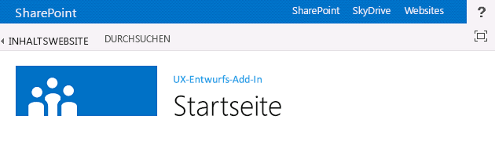
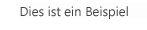

# <a name="sharepoint-add-ins-ux-design-guidelines"></a><span data-ttu-id="83923-103">Designrichtlinien für die Benutzerfreundlichkeit von Add-Ins für SharePoint</span><span class="sxs-lookup"><span data-stu-id="83923-103">SharePoint Add-ins UX design guidelines</span></span>

<span data-ttu-id="83923-p101">Add-Ins sind ein neues Konzept für SharePoint und ermöglichen Endbenutzern, ihren Websites neue Funktionen hinzuzufügen und dabei die Zuverlässigkeit der SharePoint-Site weiterhin zu gewährleisten. Zum Erstellen eines guten Add-Ins gehört nicht nur, interessante Funktionen bereitzustellen (obwohl dies ebenfalls wichtig ist), sondern auch sicherzustellen, dass das Add-In gut aussieht und sich nahtlos in die Website, auf der es installiert wird, einfügt.</span><span class="sxs-lookup"><span data-stu-id="83923-p101">Add-ins are a new concept for SharePoint, empowering end users to add new functionality to their sites while still ensuring reliability for the SharePoint site itself. Creating a good add-in requires not only making great functionality (although that's obviously important), but also ensuring that the add-in looks right and fits seamlessly into the site where it's installed.</span></span>

<span data-ttu-id="83923-106"><a name="UXGuide_AppChrome"> </a></span><span class="sxs-lookup"><span data-stu-id="83923-106"></span></span>
## <a name="choosing-the-chrome-for-your-add-in"></a><span data-ttu-id="83923-107">Wahl des Chrom für Ihr Add-In</span><span class="sxs-lookup"><span data-stu-id="83923-107">Choosing the chrome for your add-in</span></span>

<span data-ttu-id="83923-p102">Beim Erstellen eines Add-Ins müssen Sie als erstes entscheiden, wie ausgeprägt das Branding Ihrer Seiten sein soll und wo diese gehostet werden sollen. Auf der Grundlage dieser Optionen liegt es dann auf der Hand, welche Technologie Sie für den Betrieb Ihres Chrom verwenden:</span><span class="sxs-lookup"><span data-stu-id="83923-p102">The first thing you have to determine when you are building an add-in is how much or how little you want to brand your pages and where you want them to be hosted. Depending on those choices, which technology you use to power your chrome will be relatively obvious:</span></span>

- <span data-ttu-id="83923-110">**In SharePoint gehostete ASPX-Seiten:** Verwenden Sie die Add-In-Vorlage.</span><span class="sxs-lookup"><span data-stu-id="83923-110">**ASPX pages hosted in SharePoint:** Use the add-in template.</span></span>
- <span data-ttu-id="83923-111">**In SharePoint gehostete HTML-Seiten oder beliebige Seiten außerhalb von SharePoint:** Verwenden Sie das Chromsteuerelement.</span><span class="sxs-lookup"><span data-stu-id="83923-111">**HTML pages hosted in SharePoint or any pages outside SharePoint:** Use the chrome control.</span></span>
- <span data-ttu-id="83923-112">**Seiten mit benutzerdefiniertem Branding:** Verwenden Sie ein eigenes Chrom.</span><span class="sxs-lookup"><span data-stu-id="83923-112">**Custom branded pages:** Use your own chrome.</span></span>

<span data-ttu-id="83923-113"><a name="UXGuide_AppTemplate"> </a></span><span class="sxs-lookup"><span data-stu-id="83923-113"></span></span>
### <a name="using-the-add-in-template-for-sharepoint-hosted-pages"></a><span data-ttu-id="83923-114">Verwenden der Add-In-Vorlage für in SharePoint gehostete Seiten</span><span class="sxs-lookup"><span data-stu-id="83923-114">Using the add-in template for SharePoint-hosted pages</span></span>

<span data-ttu-id="83923-p103">Die Add-In-Vorlage kann nur für in SharePoint gehostete ASPX-Seiten verwendet werden. Die Vorlage enthält die **app.master**-Masterseite (die für ein Add-In geeignetes Chrom enthält und auf das Design der Hostwebsite abgestimmt ist), und verbirgt SharePoint-Funktionen, die entweder nicht funktionieren würden oder innerhalb einer Add-In-Web nicht sinnvoll sind. Abbildung 1 zeigt eine in SharePoint gehostete Seite, die die Add-In-Vorlage verwendet.</span><span class="sxs-lookup"><span data-stu-id="83923-p103">The add-in template can be used only for SharePoint-hosted ASPX pages. The template includes the **app.master** master page (which contains chrome appropriate for an add-in and is designed to theme with the host site), and it hides some SharePoint functionality that either wouldn't work or doesn't make sense inside of an add-in web. Figure 1 shows a SharePoint-hosted page that uses the add-in template.</span></span> 

<span data-ttu-id="83923-118">*Abbildung 1. In SharePoint gehostete Seite, die die Add-In-Vorlage verwendet*</span><span class="sxs-lookup"><span data-stu-id="83923-118">*Figure 1. SharePoint-hosted page using the add-in template*</span></span>


 
<span data-ttu-id="83923-120">Die Add-In-Vorlage ist die Standardvorlage in Visual Studio, wenn Sie eine Add-In-Website und Seiten innerhalb dieser Website erstellen.</span><span class="sxs-lookup"><span data-stu-id="83923-120">The add-in template is the default in Visual Studio when you create an add-in web and pages within that web.</span></span>

<span data-ttu-id="83923-121"><a name="UXGuide_ChromeControl"> </a></span><span class="sxs-lookup"><span data-stu-id="83923-121"></span></span>
### <a name="using-the-chrome-control-in-sharepoint-add-ins"></a><span data-ttu-id="83923-122">Verwenden des Client-Chromsteuerelements in SharePoint-Add-Ins</span><span class="sxs-lookup"><span data-stu-id="83923-122">Using the chrome control in SharePoint Add-ins</span></span>

<span data-ttu-id="83923-p104">Wenn Sie keine in SharePoint gehosteten ASPX-Seiten erstellen, Ihr Add-In sich jedoch trotzdem problemlos in die Hostwebsite, von der aus es verwendet wird, einbinden lassen soll, ist das Chromsteuerelement die richtige Wahl. Abbildung 2 zeigt das Chromsteuerelement.</span><span class="sxs-lookup"><span data-stu-id="83923-p104">If you're not building SharePoint-hosted ASPX pages, but you still want your add-in to fit in naturally with the host site that it is used from, the chrome control is the right choice. Figure 2 shows the chrome control.</span></span>

<span data-ttu-id="83923-125">*Abbildung 2. Chromsteuerelement auf einer Webseite*</span><span class="sxs-lookup"><span data-stu-id="83923-125">*Figure 2. Chrome control in a webpage*</span></span>


### <a name="to-use-the-chrome-control"></a><span data-ttu-id="83923-127">So verwenden Sie das Chromsteuerelement</span><span class="sxs-lookup"><span data-stu-id="83923-127">To use the chrome control</span></span>

1. <span data-ttu-id="83923-p105">Fügen Sie der Steuerelementbibliothek einen Verweis hinzu. Hierzu stehen Ihnen zwei Möglichkeiten zur Verfügung:</span><span class="sxs-lookup"><span data-stu-id="83923-p105">Add a reference to the controls library. There are two ways to do this:</span></span>
    
   - <span data-ttu-id="83923-130">Verweisen Sie im Stamm des Layouts-Ordners auf die Bibliothek, wie im folgenden Beispiel dargestellt.</span><span class="sxs-lookup"><span data-stu-id="83923-130">Point to the library at the root of the layouts folder, as shown in the following example.</span></span>
    
      ```
        <script 
          type="text/javascript" 
          src="http://{server URL}/_layouts/15/sp.ui.controls.js">
      </script>
      ```

   - <span data-ttu-id="83923-131">Kopieren Sie die Bibliothek auf Ihre eigene Website und verweisen Sie dort auf sie.</span><span class="sxs-lookup"><span data-stu-id="83923-131">Copy the library to your own website, and reference it from there.</span></span>
    
   > [!CAUTION]
   > <span data-ttu-id="83923-132">Wenn Sie sich für diese Alternative entscheiden, kann Ihr Add-In keine Aktualisierungen des Steuerelements nutzen</span><span class="sxs-lookup"><span data-stu-id="83923-132">If you opt for this alternative your add-in will not benefit from updates to the control.</span></span>

2. <span data-ttu-id="83923-133">Fügen Sie das DOM-Platzhalterelement an der Position ein, an der das Steuerelement gerendert werden soll, wie in diesem Beispiel dargestellt.</span><span class="sxs-lookup"><span data-stu-id="83923-133">Add the placeholder DOM element where the control will be rendered, as shown in this example.</span></span>
    
    ```
      <div id='chromeControlContainer'></div>
    ```

3. <span data-ttu-id="83923-134">Instanziieren Sie das Steuerelement.</span><span class="sxs-lookup"><span data-stu-id="83923-134">Instantiate the control.</span></span>
    
    ```
      function addchromecontrol(){
        var options = {};
        options.siteTitle ="{host site title}";
        options.siteUrl = "{host URL}";
        options.appHelpPageUrl = "{help page URL}";
        options.appIconUrl = "{app icon URL}";
        options.appTitle = "add-in Title";
        nav = new SP.UI.Controls.Navigation("chromeControlContainer", options);
        nav.setVisible(true);
    }
    ```

4. <span data-ttu-id="83923-135">(Optional) Wenn Sie keinen Titelbereich auf Ihrer Seite möchten, können Sie ihn entfernen, indem Sie den folgenden JavaScript-Code ausführen.</span><span class="sxs-lookup"><span data-stu-id="83923-135">(Optional) If you don't want to have the title area on your page, you can remove it by running the following JavaScript code.</span></span>
    
    ```
      nav.setBottomHeaderVisible(false);
    ```

<span data-ttu-id="83923-136">Das Chromsteuerelement bietet zwei optionale Add-In-Symbole: eines in der oberen Navigationsleiste und eines im Titelbereich.</span><span class="sxs-lookup"><span data-stu-id="83923-136">The chrome control provides for two optional add-in icons: one on the top navigation bar and one in the title area.</span></span> <span data-ttu-id="83923-137">Das Add-In-Symbol in der oberen Navigationsleiste umfasst 24 x 24 Pixel (px), das Symbol im Titelbereich hat die gleiche Größe wie SharePoint-Website-Symbole - max. 64 px auf 180 px.</span><span class="sxs-lookup"><span data-stu-id="83923-137">The add-in icon on the top navigation bar is 24 x 24 pixels (px), and the icon in the title area is the same size as SharePoint site icons—up to 64 px high by up to 180 px long.</span></span> <span data-ttu-id="83923-138">Es wird empfohlen, ein auf einem weißen, schwarzen, grauen, hellen und gedeckten Hintergrund getestetes PNG-Bild zu verwenden, da Benutzer und Administratoren das Websitedesign ändern können.</span><span class="sxs-lookup"><span data-stu-id="83923-138">We recommend you use a PNG image that you have tested on white, black, gray, bright, and muted backgrounds because users and admins can change the site theme.</span></span> <span data-ttu-id="83923-139">Weitere Informationen über die Verwendung des Chromsteuerelements finden Sie unter [Verwenden des Client-Chromsteuerelements in Add-Ins für SharePoint](use-the-client-chrome-control-in-sharepoint-add-ins.md).</span><span class="sxs-lookup"><span data-stu-id="83923-139">For more information about using the chrome control, see [Use the client chrome control in SharePoint Add-ins](use-the-client-chrome-control-in-sharepoint-add-ins.md).</span></span>

<span data-ttu-id="83923-140"><a name="UXGuide_CustomUI"> </a></span><span class="sxs-lookup"><span data-stu-id="83923-140"></span></span>
### <a name="creating-a-custom-branded-ui-in-sharepoint-add-ins"></a><span data-ttu-id="83923-141">Erstellen einer benutzerdefinierten Branding-Benutzeroberfläche in SharePoint-Add-Ins</span><span class="sxs-lookup"><span data-stu-id="83923-141">Creating a custom branded UI in SharePoint Add-ins</span></span>

<span data-ttu-id="83923-p107">Wenn Sie Ihr eigenes Branding im Add-In verwenden möchten, anstatt sie am Design der Hostwebsite auszurichten und in die SharePoint-Site einzupassen, in der Ihr Add-In installiert ist, müssen Sie das Chromsteuerelement vollständig neu erstellen. Sie sollten jedoch noch einen Link „Zurück zur Website" in der linken oberen Ecke der Seite (oben rechts bei Sprachen, die von rechts nach links gelesen werden) vorsehen, über den der Benutzer zurück zu der Website gelangen kann, auf der das Add-In installiert ist.</span><span class="sxs-lookup"><span data-stu-id="83923-p107">If, instead of aligning to the host site's theme and fitting into the SharePoint site where your add-in is installed, you want to use your own brand inside your add-in, you will have to build your chrome from scratch. However, you should still have a "back to site" link in the upper-left corner of the page (upper-right in right-to-left [RTL] languages) that redirects the user back to the site where the add-in is installed.</span></span>

<span data-ttu-id="83923-144"><a name="UXGuide_CSS"> </a></span><span class="sxs-lookup"><span data-stu-id="83923-144"></span></span>
## <a name="using-the-host-web-css-in-sharepoint-add-ins"></a><span data-ttu-id="83923-145">Verwenden des Hostweb-CSS in SharePoint-Add-Ins</span><span class="sxs-lookup"><span data-stu-id="83923-145">Using the host web CSS in SharePoint Add-ins</span></span>

<span data-ttu-id="83923-p108">Indem Sie die gleichen Formate wie für die Hostwebsite verwenden, können Sie sicherstellen, dass Ihre Add-Ins mit der SharePoint-Website konsistent bleiben, aus der sie stammen. Die tatsächlichen Formate können sich basierend auf dem Design der Website ändern. Indem Sie jedoch auf die CSS-Datei der Hostwebsite verweisen, können Sie sicher sein, dass Ihr Add-In sich unabhängig von seinem Installationsort einfügt.</span><span class="sxs-lookup"><span data-stu-id="83923-p108">By using the same styles that are used on the host web, you can ensure that your add-ins will remain consistent with the SharePoint site that they came from. The actual styles may change based on the design of the site, but by referencing the CSS file of the host web, you will know that your add-in will fit in no matter where it's installed.</span></span>

<span data-ttu-id="83923-p109">Um die CSS-Formatvorlagen von der Hostwebsite abzurufen, müssen Sie auf ihre CSS-Datei verweisen. Dazu gibt es verschiedene Möglichkeiten.</span><span class="sxs-lookup"><span data-stu-id="83923-p109">To get the CSS styles from the host web, you have to reference its CSS file. You can do this in several different ways.</span></span>

### <a name="to-reference-the-host-webs-css-file"></a><span data-ttu-id="83923-150">So verweisen Sie auf die CSS-Datei der Hostwebsite</span><span class="sxs-lookup"><span data-stu-id="83923-150">To reference the host web's CSS file</span></span>

1. <span data-ttu-id="83923-151">Wenn Sie die Add-In-Vorlage oder das Add-In-Chromsteuerelement verwenden, wird dies automatisch für Sie erledigt.</span><span class="sxs-lookup"><span data-stu-id="83923-151">If you're using the add-in template or add-in chrome control, this is automatically taken care of for you.</span></span>

2. <span data-ttu-id="83923-152">Wenn Sie sich innerhalb der Add-In-Website befinden, können Sie die Steuerelemente **CssRegistration** und **CssLink** verwenden, um auf die CSS-Datei zu verweisen, indem Sie den folgenden Code entweder auf der Masterseite oder der ASPX-Seite einfügen:</span><span class="sxs-lookup"><span data-stu-id="83923-152">If you're inside the add-in web, you can use the **CssRegistration** and **CssLink** controls to reference the CSS file by putting the following code on either your master page or ASPX page:</span></span>
    
    ```HTML
      <SharePoint:CssRegistration runat="server" name="default" />
    <SharePoint:CssLink runat="server />

    ```

3. <span data-ttu-id="83923-153">Sie können ein <link>-Element verwenden, um auf die CSS-Datei zu verweisen, indem Sie eine URL aus der URL der Hostwebsite erstellen, wie in diesem Beispiel dargestellt.</span><span class="sxs-lookup"><span data-stu-id="83923-153">You can use a <link> element to reference the CSS file by building a URL off of the host web's URL, as shown in this example.</span></span>

    ```HTML
      <link rel="stylesheet" href="{host web URL}/_layouts/15/defaultcss.ashx" />
    ```

   <span data-ttu-id="83923-154">Wenn Sie diesen Ansatz verwenden, müssen Sie JavaScript auf der Seite ausführen, um die Web-URL des Hosts aus der Abfragezeichenfolge abzurufen.</span><span class="sxs-lookup"><span data-stu-id="83923-154">If you use this approach, you have to run JavaScript in the page to get the host web's URL off the query string. Then you can insert the host web's URL into the link element before you write the element to the page's DOM.</span></span> <span data-ttu-id="83923-155">Sie können dann die Host-Web-URL in das **Link**-Element einfügen, bevor Sie das Element in das DOM der Seite schreiben.</span><span class="sxs-lookup"><span data-stu-id="83923-155">You can then insert the host web's URL into the **link** element before you write the element to the page's DOM.</span></span>
    
 
<span data-ttu-id="83923-156">Zunächst sollten Sie beim Formatieren des Add-Ins so viel semantischen HTML-Code wie möglich verwenden.</span><span class="sxs-lookup"><span data-stu-id="83923-156">The first thing to do when you are styling your add-in is to use semantic HTML as much as possible.</span></span> <span data-ttu-id="83923-157">Das bedeutet, dass Sie **H1**, **H2**, **H3** usw. für die verschiedenen Überschriften und Eingabe-Tags für Schaltflächen verwenden.</span><span class="sxs-lookup"><span data-stu-id="83923-157">That means using **H1**, **H2**, **H3**, and so on, for the various headings and input tags for buttons.</span></span> <span data-ttu-id="83923-158">Sie sollten auch versuchen, so weit wie möglich SharePoint-Core-Formatvorlagen zu verwenden, sodass Ihr Add-In, wenn sich das Design der Hostseite ändert, diese Änderungen nahtlos und automatisch übernimmt.</span><span class="sxs-lookup"><span data-stu-id="83923-158">You should also try to use SharePoint core styles as much as possible so that when the theme of the host site changes, your add-in picks up those changes seamlessly and automatically.</span></span> <span data-ttu-id="83923-159">In den folgenden Tabellen wird gezeigt, wie Formatvorlagen im Standarddesign verwendet werden.</span><span class="sxs-lookup"><span data-stu-id="83923-159">The following tables show how styles are used in the default theme.</span></span>

<span data-ttu-id="83923-160">**Tabelle 1. Textkörperformatvorlagen**</span><span class="sxs-lookup"><span data-stu-id="83923-160">**Table 1. Body text styles**</span></span>

|<span data-ttu-id="83923-161">**Beispiel**</span><span class="sxs-lookup"><span data-stu-id="83923-161">**Example**</span></span>|<span data-ttu-id="83923-162">**Verwendet für**</span><span class="sxs-lookup"><span data-stu-id="83923-162">**Used for**</span></span>|<span data-ttu-id="83923-163">**Format**</span><span class="sxs-lookup"><span data-stu-id="83923-163">**Style**</span></span>|
|:-----|:-----|:-----|
||<span data-ttu-id="83923-165">Besonders großer Textkörper</span><span class="sxs-lookup"><span data-stu-id="83923-165">Extra large body text</span></span>|<span data-ttu-id="83923-166">.ms-textXLarge</span><span class="sxs-lookup"><span data-stu-id="83923-166">.ms-textXLarge</span></span>|
||<span data-ttu-id="83923-168">Großer Textkörper</span><span class="sxs-lookup"><span data-stu-id="83923-168">Large body text</span></span>|<span data-ttu-id="83923-169">.ms-textLarge</span><span class="sxs-lookup"><span data-stu-id="83923-169">.ms-textLarge</span></span>|
||<span data-ttu-id="83923-171">Normaler Textkörper</span><span class="sxs-lookup"><span data-stu-id="83923-171">Normal body text</span></span>|<span data-ttu-id="83923-172">Wird automatisch geerbt</span><span class="sxs-lookup"><span data-stu-id="83923-172">Inherited automatically</span></span>|
||<span data-ttu-id="83923-174">Kleiner Textkörper</span><span class="sxs-lookup"><span data-stu-id="83923-174">Small body text</span></span>|<span data-ttu-id="83923-175">.ms-textSmall</span><span class="sxs-lookup"><span data-stu-id="83923-175">.ms-textSmall</span></span>|
||<span data-ttu-id="83923-177">Metadatentext</span><span class="sxs-lookup"><span data-stu-id="83923-177">Metadata text</span></span>|<span data-ttu-id="83923-178">.ms-metadata</span><span class="sxs-lookup"><span data-stu-id="83923-178">.ms-metadata</span></span>|

<br/>

<span data-ttu-id="83923-179">**Tabelle 2. Titel- und Überschriftenformatvorlagen**</span><span class="sxs-lookup"><span data-stu-id="83923-179">**Table 2. Title and header styles**</span></span>

|<span data-ttu-id="83923-180">**Beispiel**</span><span class="sxs-lookup"><span data-stu-id="83923-180">**Example**</span></span>|<span data-ttu-id="83923-181">**Verwendet für**</span><span class="sxs-lookup"><span data-stu-id="83923-181">**Used for**</span></span>|<span data-ttu-id="83923-182">**Format**</span><span class="sxs-lookup"><span data-stu-id="83923-182">**Style**</span></span>|
|:-----|:-----|:-----|
||<span data-ttu-id="83923-184">Haupttitel auf der Seite</span><span class="sxs-lookup"><span data-stu-id="83923-184">Main title on the page</span></span>|<span data-ttu-id="83923-185">.ms-core-pageTitle</span><span class="sxs-lookup"><span data-stu-id="83923-185">.ms-core-pageTitle</span></span>|
||<span data-ttu-id="83923-187">Titel für Dialogfelder, Formulare, Blogs und Diskussionsbeiträge</span><span class="sxs-lookup"><span data-stu-id="83923-187">Title for dialog boxes, forms, blogs, and discussion posts.</span></span> <span data-ttu-id="83923-188">Ein alternativer „primärer“ Titel für spezielle Inhaltstypen oder Add-Ins, die die ganze Seite einnehmen und sich von einer regulären Wiki- oder Webparts-Seite unterscheiden sollen.</span><span class="sxs-lookup"><span data-stu-id="83923-188">Title for dialog boxes, forms, blogs, and discussion posts. It's an alternative "primary" title for special content types or add-ins that take up the entire pagethat you want to be different from a regular wiki or Web Parts page.</span></span>|<span data-ttu-id="83923-189">H1</span><span class="sxs-lookup"><span data-stu-id="83923-189">H1</span></span>|
||<span data-ttu-id="83923-p113">Sekundäre Überschrift im Verhältnis zu H1. Zum Beispiel verwendet Communitys H1 Accent für den Titel eines Beitrags und H2 Accent für die beste "Antwort" auf den Beitrag.</span><span class="sxs-lookup"><span data-stu-id="83923-p113">Secondary heading in relation to H1. For example, Communities uses H1 Accent for the title of a post, and H2 Accent for the best "response" to the post.</span></span>|<span data-ttu-id="83923-193">H2</span><span class="sxs-lookup"><span data-stu-id="83923-193">H2</span></span>|
||<span data-ttu-id="83923-195">In der Regel eine Unterüberschrift unter H2.</span><span class="sxs-lookup"><span data-stu-id="83923-195">Generally a subheading under H2.</span></span>|<span data-ttu-id="83923-196">H3</span><span class="sxs-lookup"><span data-stu-id="83923-196">H3</span></span>|
||<span data-ttu-id="83923-198">Unterüberschriften unter H3.</span><span class="sxs-lookup"><span data-stu-id="83923-198">Subheadings under H3.</span></span>|<span data-ttu-id="83923-199">H4</span><span class="sxs-lookup"><span data-stu-id="83923-199">H4</span></span>|
||<span data-ttu-id="83923-201">Titel des Haupt- bzw. primären Webparts auf einer Seite oder für Hauptabschnittsüberschriften.</span><span class="sxs-lookup"><span data-stu-id="83923-201">Title of the main/primary Web Part on a page, or for main section headers.</span></span>|<span data-ttu-id="83923-202">.ms-webpart-titleText</span><span class="sxs-lookup"><span data-stu-id="83923-202">.ms-webpart-titleText</span></span>|
||<span data-ttu-id="83923-204">Titel für Überschriften in Dialogfeldern oder Legenden.</span><span class="sxs-lookup"><span data-stu-id="83923-204">Title for headings within dialog boxes or callouts.</span></span>|<span data-ttu-id="83923-205">.ms-dlg-heading</span><span class="sxs-lookup"><span data-stu-id="83923-205">.ms-dlg-heading</span></span>|

<br/>

<span data-ttu-id="83923-206">**Tabelle 3. Formatvorlagen für die Navigation**</span><span class="sxs-lookup"><span data-stu-id="83923-206">**Table 3. Navigation styles**</span></span>

|<span data-ttu-id="83923-207">**Beispiel**</span><span class="sxs-lookup"><span data-stu-id="83923-207">**Example**</span></span>|<span data-ttu-id="83923-208">**Verwendet für**</span><span class="sxs-lookup"><span data-stu-id="83923-208">**Used for**</span></span>|<span data-ttu-id="83923-209">**Format**</span><span class="sxs-lookup"><span data-stu-id="83923-209">**Style**</span></span>|
|:-----|:-----|:-----|
||<span data-ttu-id="83923-211">Überschrift der linken Navigationsleiste.</span><span class="sxs-lookup"><span data-stu-id="83923-211">Heading of the left navigation bar.</span></span>|<span data-ttu-id="83923-212">.ms-core-listMenu-verticalBox > .ms-core-listMenu-root > li > .ms-core-listMenu-item</span><span class="sxs-lookup"><span data-stu-id="83923-212">.ms-core-listMenu-verticalBox > .ms-core-listMenu-root > li > .ms-core-listMenu-item</span></span>|
||<span data-ttu-id="83923-214">Link in der linken Navigationsleiste.</span><span class="sxs-lookup"><span data-stu-id="83923-214">Link in the left navigation bar.</span></span>|<span data-ttu-id="83923-215">.ms-core-listMenu-verticalBox</span><span class="sxs-lookup"><span data-stu-id="83923-215">.ms-core-listMenu-verticalBox</span></span>|
||<span data-ttu-id="83923-217">Ausgewähltes Element in der linken Navigationsleiste.</span><span class="sxs-lookup"><span data-stu-id="83923-217">Selected item in the left navigation bar.</span></span>|<span data-ttu-id="83923-218">.ms-core-listMenu-verticalBox + .ms-accentText</span><span class="sxs-lookup"><span data-stu-id="83923-218">.ms-core-listMenu-verticalBox + .ms-accentText</span></span>|
||<span data-ttu-id="83923-220">Element in der oberen Navigationsleiste.</span><span class="sxs-lookup"><span data-stu-id="83923-220">Item in the top navigation bar.</span></span>||
||<span data-ttu-id="83923-222">Ausgewähltes Element in der oberen Navigationsleiste.</span><span class="sxs-lookup"><span data-stu-id="83923-222">Selected item in the top navigation bar.</span></span>||

<br/>

<span data-ttu-id="83923-223">**Tabelle 4. Formatvorlagen für Befehle**</span><span class="sxs-lookup"><span data-stu-id="83923-223">**Table 4. Command styles**</span></span>

|<span data-ttu-id="83923-224">**Beispiel**</span><span class="sxs-lookup"><span data-stu-id="83923-224">**Example**</span></span>|<span data-ttu-id="83923-225">**Verwendet für**</span><span class="sxs-lookup"><span data-stu-id="83923-225">**Used for**</span></span>|<span data-ttu-id="83923-226">**Format**</span><span class="sxs-lookup"><span data-stu-id="83923-226">**Style**</span></span>|
|:-----|:-----|:-----|
||<span data-ttu-id="83923-228">Primäre Aktionslinks, die Benutzer wahrscheinlich innerhalb eines bestimmten Containers oder einer Seite ausführen.</span><span class="sxs-lookup"><span data-stu-id="83923-228">Primary action links that you expect the user to take within a given container or page.</span></span> <span data-ttu-id="83923-229">Dies wird z. B. verwendet, um die Befehle unter einem Popup zu formatierten.</span><span class="sxs-lookup"><span data-stu-id="83923-229">For example, this would be used to style the commands underneath a callout.</span></span> <span data-ttu-id="83923-230">Die Farbe für besuchte und nicht besuchte Befehle ist immer gleich.</span><span class="sxs-lookup"><span data-stu-id="83923-230">This will always be the same color for visited and non-visited commands.</span></span>|<span data-ttu-id="83923-231">.ms-commandLink</span><span class="sxs-lookup"><span data-stu-id="83923-231">.ms-commandLink</span></span>|
||<span data-ttu-id="83923-p115">Wird auch zum Formatieren von Aktions-Links verwendet, jedoch für Aktionen, die für den Inhalt sekundär sind. Diese Formatvorlage wird für sekundäre Aktionen verwendet, damit sie nicht die Aufmerksamkeit vom Inhalt ablenken.</span><span class="sxs-lookup"><span data-stu-id="83923-p115">Also used to style action links, but for actions that are secondary to the content. This style is used for these secondary actions, so they don't compete with content for attention.</span></span>|<span data-ttu-id="83923-235">.ms-secondaryCommandLink</span><span class="sxs-lookup"><span data-stu-id="83923-235">.ms-secondaryCommandLink</span></span>|
||<span data-ttu-id="83923-237">Links in der Legende.</span><span class="sxs-lookup"><span data-stu-id="83923-237">Links in the callout.</span></span>|<span data-ttu-id="83923-238">.ms-calloutLink</span><span class="sxs-lookup"><span data-stu-id="83923-238">.ms-calloutLink</span></span>|

<br/>

<span data-ttu-id="83923-239">**Tabelle 5. Formatvorlagen für Modifzierer**</span><span class="sxs-lookup"><span data-stu-id="83923-239">**Table 5. Modifier styles**</span></span>

|<span data-ttu-id="83923-240">**Beispiel**</span><span class="sxs-lookup"><span data-stu-id="83923-240">**Example**</span></span>|<span data-ttu-id="83923-241">**Verwendet für**</span><span class="sxs-lookup"><span data-stu-id="83923-241">**Used for**</span></span>|<span data-ttu-id="83923-242">**Format**</span><span class="sxs-lookup"><span data-stu-id="83923-242">**Style**</span></span>|
|:-----|:-----|:-----|
||<span data-ttu-id="83923-244">Hilfsklasse, die die Akzentfarbe aus dem aktuellen Design für Text bereitstellt.</span><span class="sxs-lookup"><span data-stu-id="83923-244">Helper class that will provide the accent color from the current theme for text.</span></span>|<span data-ttu-id="83923-245">.ms-accentText</span><span class="sxs-lookup"><span data-stu-id="83923-245">.ms-accentText</span></span>|
||<span data-ttu-id="83923-p116">Links im Inhalt sollten vom Hyperlinkformat und -verhalten erben. Das Hyperlinkformat wendet eine Farbe und einen Hover-Effekt an, um anzugeben, dass es sich um einen Link und nicht um normalen Text handelt.</span><span class="sxs-lookup"><span data-stu-id="83923-p116">Links in the content should inherit from default hyperlink styling and behavior. Hyperlink styling applies a color and a hover effect to indicate that it's a link instead of normal text.</span></span>|<span data-ttu-id="83923-249">Durch Verwenden von <a> geerbt.</span><span class="sxs-lookup"><span data-stu-id="83923-249">Inherited from using <a>.</span></span>|
||<span data-ttu-id="83923-251">Fehlermeldungen in Formularen.</span><span class="sxs-lookup"><span data-stu-id="83923-251">Error messages that occur in forms.</span></span>|<span data-ttu-id="83923-252">.ms-error</span><span class="sxs-lookup"><span data-stu-id="83923-252">.ms-error</span></span>|
||<span data-ttu-id="83923-254">Hilfsklasse, die ein schattiertes Grau für Text bereitstellt, der weniger hervorgehoben sein soll wie der normale Textkörper.</span><span class="sxs-lookup"><span data-stu-id="83923-254">Helper class that provides a softened gray for text that should be less emphasized than normal body text.</span></span>|<span data-ttu-id="83923-255">.ms-soften</span><span class="sxs-lookup"><span data-stu-id="83923-255">.ms-soften</span></span>|
||<span data-ttu-id="83923-257">Hilfsklasse, welche die "deaktivierte" Farbe auf Text anwendet, der zur Kennzeichnung von deaktivierten Stati verwendet wird.</span><span class="sxs-lookup"><span data-stu-id="83923-257">Helper class that applies the "disabled" color to text, which is used for denoting disabled states.</span></span>|<span data-ttu-id="83923-258">.ms-disabled</span><span class="sxs-lookup"><span data-stu-id="83923-258">.ms-disabled</span></span>|
||<span data-ttu-id="83923-260">Hilfsklasse, die den Text vollständig in Großbuchstaben umwandelt.</span><span class="sxs-lookup"><span data-stu-id="83923-260">Helper class that transforms the text to all caps.</span></span>|<span data-ttu-id="83923-261">.ms-uppercase</span><span class="sxs-lookup"><span data-stu-id="83923-261">.ms-uppercase</span></span>|
||<span data-ttu-id="83923-263">Hilfsklasse zum Formatieren von Text wie Formulare.</span><span class="sxs-lookup"><span data-stu-id="83923-263">Helper class to style text like forms.</span></span>|<span data-ttu-id="83923-264">.ms-helper</span><span class="sxs-lookup"><span data-stu-id="83923-264">.ms-helper</span></span>|
||<span data-ttu-id="83923-266">Gestrichelte Trennlinie, die verwendet wird, um Abschnitte im Schnellstartbereich und in Menüs zu trennen.</span><span class="sxs-lookup"><span data-stu-id="83923-266">Dashed line divider that is used to divide sections in the Quick Launch and in menus.</span></span>|<span data-ttu-id="83923-267">HR</span><span class="sxs-lookup"><span data-stu-id="83923-267">HR</span></span>|

<br/>

<span data-ttu-id="83923-268">**Tabelle 6. Formatvorlagen für Part-Benutzeroberflächen**</span><span class="sxs-lookup"><span data-stu-id="83923-268">**Table 6. Part user interface styles**</span></span>

|<span data-ttu-id="83923-269">**Beispiel**</span><span class="sxs-lookup"><span data-stu-id="83923-269">**Example**</span></span>|<span data-ttu-id="83923-270">**Verwendet für**</span><span class="sxs-lookup"><span data-stu-id="83923-270">**Used for**</span></span>|<span data-ttu-id="83923-271">**Format**</span><span class="sxs-lookup"><span data-stu-id="83923-271">**Style**</span></span>|
|:-----|:-----|:-----|
||<span data-ttu-id="83923-273">Inline-Haupttext am Anfang eines Parts.</span><span class="sxs-lookup"><span data-stu-id="83923-273">Main inline text at the top of a part.</span></span>|<span data-ttu-id="83923-274">.ms-textXLarge + .ms-soften</span><span class="sxs-lookup"><span data-stu-id="83923-274">.ms-textXLarge + .ms-soften</span></span>|
||<span data-ttu-id="83923-276">Befehle in der obersten Zeile eines Parts; pro Part sollten maximal ein oder zwei enthalten sein.</span><span class="sxs-lookup"><span data-stu-id="83923-276">Commands in the top line of a part; at most there should be only one or two of these per part.</span></span>|<span data-ttu-id="83923-277">.ms-heroCommandLink</span><span class="sxs-lookup"><span data-stu-id="83923-277">.ms-heroCommandLink</span></span>|
||<span data-ttu-id="83923-279">Text, der angezeigt wird, um dem Benutzer einen Anreiz zur Interaktion mit dem Part zu geben, wenn dieser keine Daten enthält.</span><span class="sxs-lookup"><span data-stu-id="83923-279">Text shown to entice the user to interact with the part when it doesn't contain data.</span></span>|<span data-ttu-id="83923-280">.ms-attractMode</span><span class="sxs-lookup"><span data-stu-id="83923-280">.ms-attractMode</span></span>|
||<span data-ttu-id="83923-282">Text, der für den Benutzer angezeigt wird, wenn keine Daten verfügbar sind.</span><span class="sxs-lookup"><span data-stu-id="83923-282">Text shown to the user when there is no data available.</span></span>|<span data-ttu-id="83923-283">.ms-emptyMode</span><span class="sxs-lookup"><span data-stu-id="83923-283">.ms-emptyMode</span></span>|
||<span data-ttu-id="83923-285">Ansicht-Steuerelemente, wie z. B. ein Pivot-Element.</span><span class="sxs-lookup"><span data-stu-id="83923-285">View controls, such as a pivot.</span></span>|<span data-ttu-id="83923-286">.ms-pivot-link</span><span class="sxs-lookup"><span data-stu-id="83923-286">.ms-pivot-link</span></span>|
||<span data-ttu-id="83923-288">Listenelemente, die auch Links sind.</span><span class="sxs-lookup"><span data-stu-id="83923-288">List items that are also links.</span></span>|<span data-ttu-id="83923-289">.ms-listLink</span><span class="sxs-lookup"><span data-stu-id="83923-289">.ms-listLink</span></span>|

<br/>

<span data-ttu-id="83923-290">**Tabelle 7. Hintergrund- und Rahmenformatvorlagen**</span><span class="sxs-lookup"><span data-stu-id="83923-290">**Table 7. Background and border styles**</span></span>

|<span data-ttu-id="83923-291">**Beispiel**</span><span class="sxs-lookup"><span data-stu-id="83923-291">**Example**</span></span>|<span data-ttu-id="83923-292">**Verwendet für**</span><span class="sxs-lookup"><span data-stu-id="83923-292">**Used for**</span></span>|<span data-ttu-id="83923-293">**Format**</span><span class="sxs-lookup"><span data-stu-id="83923-293">**Style**</span></span>|
|:-----|:-----|:-----|
||<span data-ttu-id="83923-295">Zum Formatieren eines Rechtecks, das auf der Seite stark hervorgehoben werden soll.</span><span class="sxs-lookup"><span data-stu-id="83923-295">To style a rectangle that should be heavily emphasized on the page.</span></span>|<span data-ttu-id="83923-296">.ms-emphasis</span><span class="sxs-lookup"><span data-stu-id="83923-296">.ms-emphasis</span></span>|
||<span data-ttu-id="83923-298">Rahmen zum Hervorheben eines Elements.</span><span class="sxs-lookup"><span data-stu-id="83923-298">Border of an emphasized element.</span></span>|<span data-ttu-id="83923-299">.ms-emphasisBorder</span><span class="sxs-lookup"><span data-stu-id="83923-299">.ms-emphasisBorder</span></span>|
||<span data-ttu-id="83923-301">Eine schwächere Hervorhebung eines Elements.</span><span class="sxs-lookup"><span data-stu-id="83923-301">A more subtle emphasis of an element.</span></span>|<span data-ttu-id="83923-302">.ms-subtleEmphasis</span><span class="sxs-lookup"><span data-stu-id="83923-302">.ms-subtleEmphasis</span></span>|
||<span data-ttu-id="83923-304">Befehle in einem Element, mit ms-subtleEmphasis formatiert.</span><span class="sxs-lookup"><span data-stu-id="83923-304">Commands in an element styled with ms-subtleEmphasis.</span></span>|<span data-ttu-id="83923-305">.ms-subtleEmphasisCommand</span><span class="sxs-lookup"><span data-stu-id="83923-305">.ms-subtleEmphasisCommand</span></span>|
||<span data-ttu-id="83923-307">Deaktivierter Befehl in einem Element, mit ms-subtleEmphasis formatiert.</span><span class="sxs-lookup"><span data-stu-id="83923-307">Disabled command in an element styled with ms-subtleEmphasis.</span></span>|<span data-ttu-id="83923-308">.ms-subtleEmphasisCommand-disabled</span><span class="sxs-lookup"><span data-stu-id="83923-308">.ms-subtleEmphasisCommand-disabled</span></span>|
||<span data-ttu-id="83923-310">Seitliche Navigationselemente.</span><span class="sxs-lookup"><span data-stu-id="83923-310">Side navigation elements.</span></span>|<span data-ttu-id="83923-311">.ms-sideNav</span><span class="sxs-lookup"><span data-stu-id="83923-311">.ms-sideNav</span></span>|
||<span data-ttu-id="83923-313">Zum Formatieren des ausgewählten seitlichen Navigationselements.</span><span class="sxs-lookup"><span data-stu-id="83923-313">To style the selected side navigation element.</span></span>|<span data-ttu-id="83923-314">.ms-sideNav-selected</span><span class="sxs-lookup"><span data-stu-id="83923-314">.ms-sideNav-selected</span></span>|
||<span data-ttu-id="83923-316">Zum Hervorheben eines Elements durch einen Rahmen.</span><span class="sxs-lookup"><span data-stu-id="83923-316">To emphasize an element using a border.</span></span>|<span data-ttu-id="83923-317">.ms-lines</span><span class="sxs-lookup"><span data-stu-id="83923-317">.ms-lines</span></span>|
||<span data-ttu-id="83923-319">Zum Hervorheben eines Elements durch einen feinen Rahmen.</span><span class="sxs-lookup"><span data-stu-id="83923-319">To emphasize an element using a subtle border.</span></span>|<span data-ttu-id="83923-320">.ms-subtleLines</span><span class="sxs-lookup"><span data-stu-id="83923-320">.ms-subtleLines</span></span>|
||<span data-ttu-id="83923-322">Zum Hervorheben eines Elements durch einen starken oder farbigen Rahmen.</span><span class="sxs-lookup"><span data-stu-id="83923-322">To emphasize an element using a strong or colored border.</span></span>|<span data-ttu-id="83923-323">.ms-strongLines</span><span class="sxs-lookup"><span data-stu-id="83923-323">.ms-strongLines</span></span>|
||<span data-ttu-id="83923-325">Zum Hervorheben eines deaktivierten Elements durch einen Rahmen.</span><span class="sxs-lookup"><span data-stu-id="83923-325">To emphasize a disabled element using a border.</span></span>|<span data-ttu-id="83923-326">.ms-disabledLines</span><span class="sxs-lookup"><span data-stu-id="83923-326">.ms-disabledLines</span></span>|
||<span data-ttu-id="83923-328">Zum Hervorheben eines Elements durch einen Akzentuierungsrahmen.</span><span class="sxs-lookup"><span data-stu-id="83923-328">To emphasize an element using an accent border.</span></span>|<span data-ttu-id="83923-329">.ms-accentLines</span><span class="sxs-lookup"><span data-stu-id="83923-329">.ms-accentLines</span></span>|
||<span data-ttu-id="83923-331">Zum Begrenzen eines Popupfensters.</span><span class="sxs-lookup"><span data-stu-id="83923-331">To contain pop-up windows.</span></span>|<span data-ttu-id="83923-332">.ms-popupBorder</span><span class="sxs-lookup"><span data-stu-id="83923-332">.ms-popupBorder</span></span>|
||<span data-ttu-id="83923-334">Zum Anwenden einer Überlagerung auf das Hintergrundelement.</span><span class="sxs-lookup"><span data-stu-id="83923-334">To apply an overlay on the background element.</span></span>|<span data-ttu-id="83923-335">.ms-bgOverlay</span><span class="sxs-lookup"><span data-stu-id="83923-335">.ms-bgOverlay</span></span>|
||<span data-ttu-id="83923-337">Um den Hintergrund eines Elements deaktiviert erscheinen zu lassen.</span><span class="sxs-lookup"><span data-stu-id="83923-337">To make the background of an element appear disabled.</span></span>|<span data-ttu-id="83923-338">.ms-bgDisabled</span><span class="sxs-lookup"><span data-stu-id="83923-338">.ms-bgDisabled</span></span>|
||<span data-ttu-id="83923-340">Zum Anwenden der Kopfzeilen-Hintergrundfarbe.</span><span class="sxs-lookup"><span data-stu-id="83923-340">To apply the header background color.</span></span>|<span data-ttu-id="83923-341">.ms-bgHeader</span><span class="sxs-lookup"><span data-stu-id="83923-341">.ms-bgHeader</span></span>|
||<span data-ttu-id="83923-343">Zum Anwenden der Fußzeilen-Hintergrundfarbe.</span><span class="sxs-lookup"><span data-stu-id="83923-343">To apply the footer background color.</span></span>|<span data-ttu-id="83923-344">.ms-bgFooter</span><span class="sxs-lookup"><span data-stu-id="83923-344">.ms-bgFooter</span></span>|
||<span data-ttu-id="83923-p117">Elemente, die farblich hervorgehoben werden sollen, wenn mit dem Mauszeiger darauf gezeigt wird. Das Beispiel zeigt das Element, wenn nicht mit dem Mauszeiger darauf gezeigt wird.</span><span class="sxs-lookup"><span data-stu-id="83923-p117">Elements that should have a highlighted color on hover. The example shows the element when the mouse is not hovering over it.</span></span>|<span data-ttu-id="83923-348">.ms-bgHoverable</span><span class="sxs-lookup"><span data-stu-id="83923-348">.ms-bgHoverable</span></span>|
||<span data-ttu-id="83923-p118">Elemente, die farblich hervorgehoben werden sollen, wenn mit dem Mauszeiger darauf gezeigt wird. Das Beispiel zeigt das Element, wenn mit dem Mauszeiger darauf gezeigt wird.</span><span class="sxs-lookup"><span data-stu-id="83923-p118">Elements that should have a highlighted color on hover. The example shows the element when the mouse is hovering over it.</span></span>|<span data-ttu-id="83923-352">.ms-bgHoverable</span><span class="sxs-lookup"><span data-stu-id="83923-352">.ms-bgHoverable</span></span>|
||<span data-ttu-id="83923-354">Zum Anzeigen der Auswahl eines Elements.</span><span class="sxs-lookup"><span data-stu-id="83923-354">To show selection on an element.</span></span>|<span data-ttu-id="83923-355">.ms-bgSelected</span><span class="sxs-lookup"><span data-stu-id="83923-355">.ms-bgSelected</span></span>|
||<span data-ttu-id="83923-357">Elemente in der obersten Leiste der Seite.</span><span class="sxs-lookup"><span data-stu-id="83923-357">Elements in the top bar of the page.</span></span>|<span data-ttu-id="83923-358">.ms-topBar</span><span class="sxs-lookup"><span data-stu-id="83923-358">.ms-topBar</span></span>|
<span data-ttu-id="83923-359">Weitere Informationen finden Sie unter [Verwenden einer SharePoint-Formatvorlage in SharePoint Add-Ins](use-a-sharepoint-website-s-style-sheet-in-sharepoint-add-ins.md).</span><span class="sxs-lookup"><span data-stu-id="83923-359">For more information, see  [Use a SharePoint website's style sheet in SharePoint Add-ins](use-a-sharepoint-website-s-style-sheet-in-sharepoint-add-ins.md).</span></span>

<span data-ttu-id="83923-360"><a name="UXGuide_Styling"> </a></span><span class="sxs-lookup"><span data-stu-id="83923-360"></span></span>
## <a name="styling-common-items-consistently-in-sharepoint-add-ins"></a><span data-ttu-id="83923-361">Einheitliches Formatieren häufiger Elemente in SharePoint-Add-Ins</span><span class="sxs-lookup"><span data-stu-id="83923-361">Styling common items consistently in SharePoint Add-ins</span></span>

<span data-ttu-id="83923-362">Damit Benutzer sich Fertigkeiten aneignen können, die sowohl in SharePoint als auch in Add-Ins anwendbar sind, sollten Sie gemeinsame Elemente konsistent formatieren.</span><span class="sxs-lookup"><span data-stu-id="83923-362">To help users learn skills that translate between SharePoint and add-ins, you should style several common elements consistently.</span></span>

### <a name="internal-navigation"></a><span data-ttu-id="83923-363">Interne Navigation</span><span class="sxs-lookup"><span data-stu-id="83923-363">Internal navigation</span></span>

<span data-ttu-id="83923-364">Zur Bereitstellung der Navigation innerhalb des Add-Ins gibt es zwei wichtige Muster: **linker Navigationsbereich** und **oberer Navigationsbereich**.</span><span class="sxs-lookup"><span data-stu-id="83923-364">To provide navigation within your add-in, there are two main patterns to follow: **left navigation** and **top navigation**.</span></span> <span data-ttu-id="83923-365">Welche Option Sie verwenden, hängt davon ab, über welche Inhalte Ihr Add-In weiterhin verfügt.</span><span class="sxs-lookup"><span data-stu-id="83923-365">Which option you use depends somewhat on what the content is in the rest of your add-in.</span></span> <span data-ttu-id="83923-366">Im Allgemeinen ist der linke Navigationsbereich die richtige Wahl, insbesondere dann, wenn Sie zwischen verschiedenen Listen wechseln möchten oder der Fokus Ihres Add-Ins auf einer Master/Detail-Anwendung liegt.</span><span class="sxs-lookup"><span data-stu-id="83923-366">In general, left navigation will be the correct choice, particularly if you're switching between different lists, or the focus of your add-in is a master-detail view.</span></span> <span data-ttu-id="83923-367">Wenn Ihre Navigation in erster Linie zwischen unterschiedlichen Ansichten derselben Liste wechselt, können Sie stattdessen den oberen Navigationsbereich wählen.</span><span class="sxs-lookup"><span data-stu-id="83923-367">On the other hand, if your navigation mainly switches between what could be considered different views of the same list, you could choose to use top navigation instead.</span></span>

<span data-ttu-id="83923-p120">Sowohl die Linksnavigation als auch die Topnavigation verfügen über Objektmodelldarstellungen, die korrekt formatiert werden, wenn sie in SharePoint festgelegt werden. Außerhalb von SharePoint-Seiten ist etwas mehr Aufwand erforderlich, um das Markup für die Top- oder die Linksnavigation selbst zu erstellen und dann die entsprechenden CSS-Klasses für die korrekte Formatierung hinzuzufügen.</span><span class="sxs-lookup"><span data-stu-id="83923-p120">Both left navigation and top navigation have object model representations that will be styled correctly when they are set in SharePoint. Outside of SharePoint pages, you'll have to do a bit more work to create the markup for the top or left navigation yourself, and then add the appropriate CSS classes so that it's styled correctly.</span></span>

### <a name="toolbars"></a><span data-ttu-id="83923-370">Symbolleisten</span><span class="sxs-lookup"><span data-stu-id="83923-370">Toolbars</span></span>

<span data-ttu-id="83923-371">In vielen Fällen verfügen Sie über eine geringe Anzahl von Befehlen, die Sie dem Benutzer schnell wiedergeben möchten.</span><span class="sxs-lookup"><span data-stu-id="83923-371">In many cases, you will have a small number of commands that you want to surface quickly to the user.</span></span> <span data-ttu-id="83923-372">Wenn Sie bereits das **Menüband** auf Ihrer Seite verwenden, ist es am besten, diese Befehle an logischen Speicherorten im vorhandenen Menüband hinzuzufügen.</span><span class="sxs-lookup"><span data-stu-id="83923-372">If you are using the **ribbon** on your page already, the best choice is to add those commands to logical locations within the existing ribbon.</span></span> <span data-ttu-id="83923-373">Wenn Ihre Seite noch nicht über ein Menüband verfügt, macht es möglicherweise keinen Sinn, ein Menüband für einige wenige Befehle hinzuzufügen.</span><span class="sxs-lookup"><span data-stu-id="83923-373">However, in the case where you don't already have a ribbon on the page, it probably doesn't make sense to add one for a handful of commands.</span></span> <span data-ttu-id="83923-374">In diesem Fall empfehlen wir, dass Sie eine auf das Element konextbezogene **Symbolleiste** an der Stelle hinzufügen, wo die Befehle ausgeführt werden.</span><span class="sxs-lookup"><span data-stu-id="83923-374">In that case, we recommend that you add a **toolbar** contextual to the item where the commands will apply.</span></span> <span data-ttu-id="83923-375">Sie können Glyphe, formatierten Text mit ms-commandLink oder beides verwenden, um Ihre Befehle auf der Symbolleiste darzustellen, wobei dieselbe Hintergrundfarbe wie für den Rest der Seite verwendet werden sollte.</span><span class="sxs-lookup"><span data-stu-id="83923-375">You should use either glyph, text styled with ms-commandLink, or both, to represent your commands on the toolbar, which should have the same background color as the rest of the page.</span></span>

### <a name="lists"></a><span data-ttu-id="83923-376">Listen</span><span class="sxs-lookup"><span data-stu-id="83923-376">Lists</span></span>

<span data-ttu-id="83923-p122">Listen sind eine gängige Möglichkeit zur Darstellung von Daten für Benutzer. Wenn Ihr Add-In SharePoint-Seiten verwendet, können Sie das Listenansicht-Webpart verwenden, um Daten für Benutzer darzustellen und über die damit verbundenen Formatierungs- und Interaktionsmöglichkeiten zu verfügen. Wenn sich Ihre Seiten jedoch an anderer Stelle befinden oder Sie die Interaktion von Benutzern mit Ihrer Liste stärker steuern möchten, sollten Sie die Listenformatierung in SharePoint imitieren, während Sie Ihre eigenen Rendering- und Interaktionsmöglichkeiten bereitstellen. Nachfolgend sind einige Formatierungsprobleme aufgeführt, die Sie bei der Verwendung von Listen in Ihrem Add-In berücksichtigen sollten:</span><span class="sxs-lookup"><span data-stu-id="83923-p122">Lists are a common way to represent data to users. If your add-in is using SharePoint pages, you could use the List View Web Part to represent the data to users and get the styling and interaction that comes with it. However, if you have your pages elsewhere, or you want more control over the interaction that users have with your list, you should mimic the styling of lists in SharePoint while providing your own rendering and interaction. The following are some style issues to keep in mind when you are using lists in your add-in:</span></span>

- <span data-ttu-id="83923-p123">**Ansichten:** Wenn Sie mehrere Ansichten in einer einzelnen Liste darstellen, sollten Sie am Anfang der Liste ein Pivot-Element verwenden, wie dies bei regulären SharePoint-Listen der Fall ist. Verwenden Sie jedoch niemals Pivot-Elemente für die Darstellung von Master-Detail-Daten.</span><span class="sxs-lookup"><span data-stu-id="83923-p123">**Views:** When representing multiple views on a single list, you should use a pivot at the top of the list, just as regular SharePoint lists do. You should never use pivots as a way of representing master-detail data.</span></span>

- <span data-ttu-id="83923-p124">**Filter:** Wenn Sie einen Filter für eine bestehende Liste oder eine Master-Detail-Anordnung bereitstellen, verwenden Sie eine Randleiste, die bündig mit der linken Seite des Inhaltsbereichs abschließt und eine Breite von mindestens 300 Pixel hat. Kopieren Sie außerdem die SharePoint-Auswahlformatierung, um für den Benutzer anzugeben, welche Filter oder Elemente ausgewählt wurden.</span><span class="sxs-lookup"><span data-stu-id="83923-p124">**Filters:** When providing a filter on an existing list or a master-detail arrangement, you should use a sidebar that is flush with the left side of the content area and that is at least 300-pixels wide. You should also copy the SharePoint selection styling to indicate to the user which filters or items are selected.</span></span>
 
- <span data-ttu-id="83923-385">**Formulare:** Wenn ein Benutzer ein einzelnes Element anzeigt oder bearbeitet, sollten Sie entweder die integrierten SharePoint-Formulare verwenden oder ihre Formatierung imitieren, um eine konsistente Nutzungserfahrung zu vermitteln.</span><span class="sxs-lookup"><span data-stu-id="83923-385">**Forms:** When a user is viewing or editing a single item, you should either use the built-in SharePoint forms or mimic their styling for a consistent experience.</span></span>

### <a name="forms-dialog-boxes-and-callouts"></a><span data-ttu-id="83923-386">Formulare, Dialogfelder und Legenden</span><span class="sxs-lookup"><span data-stu-id="83923-386">Forms, dialog boxes, and callouts</span></span>

<span data-ttu-id="83923-p125">Es gibt drei verschiedene Möglichkeiten, um für Benutzer Informationen über ein Objekt bereitzustellen oder um eine Benutzeroberfläche (UI) für die Benutzereingabe zu bieten: Ganzseitige Formulare, Dialogfelder und Legenden. Welche Option Sie wählen, hängt von der Benutzerintention sowie davon ab, wie viele Informationen angezeigt oder abgefragt werden sollen.</span><span class="sxs-lookup"><span data-stu-id="83923-p125">There are three distinct patterns for providing the user with more information about an object, or for providing a user interface (UI) for user input: full-page forms, dialog boxes, and callouts. Whichever one you use depends on the user intent and how much information will be shown or requested.</span></span>

- <span data-ttu-id="83923-p126">**Ganzseitige Formulare:** Dies ist die beste Option, wenn Benutzer mehrere unterschiedliche Informationen eingeben sollen, oder wenn viele strukturierte Informationen gleichzeitig für sie angezeigt werden sollen. Ganzseitige Formulare sind auch in Szenarien am sinnvollsten, in denen komplexere Interaktionsmodelle erforderlich sind , wie z. B. das Menüband. In diesem Fall verweisen Sie den Benutzer bei Bedarf auf die Formularseite. Stellen Sie sicher, dass Benutzer über eine einfache Möglichkeit zum Speichern oder Verwerfen ihrer Änderungen verfügen, entweder mithilfe von Schaltflächen oder mit dem Menüband. In sehr langen Formularen, in denen Bildläufe durchgeführt werden müssen, empfiehlt es sich, die Optionen **Speichern** und **Abbrechen** sowohl am oberen als auch am unteren Rand des Formulars zu positionieren.</span><span class="sxs-lookup"><span data-stu-id="83923-p126">**Full-page forms:** This is the best choice when you want users to enter several different pieces of information, or you want to show them a lot of structured information at one time. Full-page forms also make the most sense in scenarios where more complex interaction models, such as the ribbon, are required. In this case, you would point the user to the form page when necessary. You should make sure that there is a clear way to save or cancel their changes, by using either buttons or the ribbon. In very long forms that might require scrolling, it's a good idea to place the **Save** and **Cancel** options at both the top and bottom of the form.</span></span>

- <span data-ttu-id="83923-p127">**Dialogfelder:** Dies sind modale Benutzeroberflächen-Container, die in der Regel verwendet werden, um weitere Informationen oder Aktionen auf kontextbezogene Weise anzuzeigen. Sie werden auch für kürzere Formulare oder Benutzereingaben verwendet. In der Regel sollte die in einem Dialogfeld gehostete Benutzeroberfläche einfach und für eine kleinere Rendering-Oberfläche gut geeignet sein. Für längere Formulare oder komplexere Interaktionsmodelle, wie z. B. das Menüband, empfiehlt sich dagegen die Verwendung ganzseitiger Formulare.</span><span class="sxs-lookup"><span data-stu-id="83923-p127">**Dialog boxes:** These are modal UI containers that are typically used to show more information or actions in a contextual manner. They are also used for shorter forms or user input. In general, the UI that is hosted within a dialog box should be simple and well suited for a smaller rendering surface. Longer forms or more complex interaction models, such as the ribbon, are better served by full-page forms instead.</span></span>

- <span data-ttu-id="83923-p128">**Legenden:** Diese geben wichtige kontextbezogene Informationen und Aktionen zu einem bestimmten Element an. Legenden werden in der Regel verwendet, um dem Benutzer in einer kleinen Benutzeroberfläche weitere Informationen oder Aktionen zu einem Element anzugeben. Wenn Bildlaufleisten oder Benutzereingaben erforderlich sind, ist die Legende möglicherweise keine gute Wahl.</span><span class="sxs-lookup"><span data-stu-id="83923-p128">**Callouts:** These provide relevant contextual information and actions around a particular item. Callouts are generally used to show the user more information or actions about an item in a lightweight UI. If scrollbars or user input are necessary, the callout is probably not a good choice.</span></span>

### <a name="animation"></a><span data-ttu-id="83923-401">Animation</span><span class="sxs-lookup"><span data-stu-id="83923-401">Animation</span></span>

<span data-ttu-id="83923-p129">Animation kann zwar zu einer lebendigeren und interessanteren Benutzeroberfläche führen, Sie sollten jedoch eine übermäßige Verwendung in Ihrer Benutzeroberfläche vermeiden. Gut gemachte Animation wird vom Benutzer kaum bewusst wahrgenommen, sondern vermittelt ihm den Eindruck einer schnelleren, leistungsfähigeren Benutzeroberfläche. Sie sollten bei der Anwendung von Animation unbedingt Konzepte wie Bewegung und Trägheit berücksichtigen und eine Benutzeroberfläche bereitstellen, die natürlich und ansprechend wirkt. Es wird nachdrücklich davon abgeraten, übertriebenen Animationen zu verwenden, wie z. B. übermäßiges Prellen oder Federn oder das Umherfliegen von Objekten auf dem Bildschirm bei der kleinsten Benutzeraktion. Objekte sollten generell auf dem direkten Weg zu ihrem Ziel gelangen und beanspruchen häufig nur die ersten oder letzten zehn Prozent der tatsächlichen Änderung durch die Animation, mit der dem Benutzer der Eindruck einer Bewegung vermittelt werden soll.</span><span class="sxs-lookup"><span data-stu-id="83923-p129">Although animation can lead to a more vibrant and engaging experience, you should be careful to not overuse it in your UI. Animation that is done well will be hardly noticeable by the user, but it will give the impression of faster, better-performing UI. When using animation, you should make sure to respect concepts like physics and inertia and provide UI that seems natural and graceful. We strongly recommend against exaggerated animations like excessive bouncing or elasticity, or having objects fly around the screen at the slightest user action. Objects should generally take a direct path to their destination, and often will only need the first or last 10 percent of the actual change to be animated in order to give the user the sense that it has moved.</span></span>

### <a name="tabs-and-pivots"></a><span data-ttu-id="83923-407">Registerkarten und Pivot-Elemente</span><span class="sxs-lookup"><span data-stu-id="83923-407">Tabs and pivots</span></span>

<span data-ttu-id="83923-p130">Das Menüband ist der einzige Ort in SharePoint, an dem Sie Registerkarten verwenden sollten. An jedem anderen Ort in SharePoint sollten Sie mithilfe von Pivot-Elementen das Konzept der Änderung des Inhaltsbereichs ausdrücken.</span><span class="sxs-lookup"><span data-stu-id="83923-p130">In SharePoint, the only place where you should use tabs is on the ribbon. Everywhere else in SharePoint should use pivots to express the concept of changing the content area.</span></span>

<span data-ttu-id="83923-410"><a name="Fabric"> </a></span><span class="sxs-lookup"><span data-stu-id="83923-410"></span></span>
## <a name="office-ui-fabric-with-sharepoint-add-ins-faq"></a><span data-ttu-id="83923-411">Häufig gestellte Fragen zu Office UI Fabric mit SharePoint-Add-Ins</span><span class="sxs-lookup"><span data-stu-id="83923-411">Office UI Fabric with SharePoint Add-ins FAQ</span></span>

<span data-ttu-id="83923-412">Verwenden Sie diese häufig gestellten Fragen, um zu verstehen, wie Sie Office UI Fabric verwenden und Ihre SharePoint-Add-In wie das restliche Office 365 aussehen und sich verhalten lassen.</span><span class="sxs-lookup"><span data-stu-id="83923-412">Use this FAQ to understand how to use Office UI Fabric and make your SharePoint Add-in look and feel like the rest of the Office 365.</span></span>

<span data-ttu-id="83923-413">**1. Was ist Office UI Fabric?**</span><span class="sxs-lookup"><span data-stu-id="83923-413">**1. What is Office UI Fabric?**</span></span>

<span data-ttu-id="83923-414">Bei UI Fabric handelt es sich um ein dynamisches und für Mobilgeräte optimiertes Front-End-Framework zum Erstellen von Weberlebnissen mithilfe der Office-Entwurfssprache.</span><span class="sxs-lookup"><span data-stu-id="83923-414">Office UI Fabric is a responsive, mobile-first, front-end framework that enables you to create web experiences by using the Office Design Language. It is implemented with a set of fonts and with CSS classes that provide UI components, icons, animation, and the official Office color palette. For details, see  Office UI Fabric.</span></span> <span data-ttu-id="83923-415">Sie wird mit einer Gruppe von Schriftarten und CSS-Klassen implementiert, die UI-Komponenten, Symbole, Animationen und die offizielle Office Farbpalette bereitstellt.</span><span class="sxs-lookup"><span data-stu-id="83923-415">Office UI Fabric is a responsive, mobile-first, front-end framework that enables you to create web experiences by using the Office Design Language. It is implemented with a set of fonts and with CSS classes that provide UI components, icons, animation, and the official Office color palette. For details, see  Office UI Fabric.</span></span> <span data-ttu-id="83923-416">Einzelheiten hierzu finden Sie unter [Office UI Fabric](https://github.com/OfficeDev/Office-UI-Fabric).</span><span class="sxs-lookup"><span data-stu-id="83923-416">For details, see [Office UI Fabric](https://github.com/OfficeDev/Office-UI-Fabric).</span></span>

<span data-ttu-id="83923-417">**2. Kann ich Office UI Fabric in meinen SharePoint-Add-Ins verwenden?**</span><span class="sxs-lookup"><span data-stu-id="83923-417">**2. Can I use Office UI Fabric in my SharePoint Add-ins?**</span></span>

<span data-ttu-id="83923-p132">Ja. Ihre Add-In-Seiten können auf dieselbe Weise auf Office UI Fabric-Dateien verweisen, wie auf andere CSS-Frameworks wie Bootstrap verwiesen wird.</span><span class="sxs-lookup"><span data-stu-id="83923-p132">Yes. Your add-in pages can reference the Office UI Fabric files in the same way that other CSS frameworks, like bootstrap, are referenced.</span></span>

<span data-ttu-id="83923-420">**3. Wann sollte ich Office UI Fabric mit SharePoint-Add-Ins verwenden?**</span><span class="sxs-lookup"><span data-stu-id="83923-420">**3. When should I use Office UI Fabric with SharePoint Add-ins?**</span></span>

<span data-ttu-id="83923-p133">Verwenden Sie das Tool, wenn Sie Ihrem Add-In das Aussehen und Verhalten von Office 365 geben möchten. Es ist eine Alternative zur Verwendung der CSS-Datei des SharePoint-Hostwebs.</span><span class="sxs-lookup"><span data-stu-id="83923-p133">Use it when you want your add-in to have the look and feel of Office 365. It is an alternative to using the CSS file of the SharePoint host web.</span></span>

<span data-ttu-id="83923-423">**4. Wie kann Office UI Fabric in SharePoint-Add-Ins verwendet werden?**</span><span class="sxs-lookup"><span data-stu-id="83923-423">**4. How can Office UI Fabric be used in SharePoint Add-ins?**</span></span>

<span data-ttu-id="83923-424">Fügen Sie einfach die Office UI Fabric-Dateien zu Ihrem Entwicklungsprojekt hinzu, und schließen Sie einen Verweis zur fabric.css-Bibliothek in Ihre HTML- oder ASPX-Seite ein.</span><span class="sxs-lookup"><span data-stu-id="83923-424">Just add the Office UI Fabric files to your development project, and include a reference to the fabric.css library to your HTML or ASPX page. For details, see  Getting started.</span></span> <span data-ttu-id="83923-425">Ausführliche Informationen finden Sie unter [Erste Schritte](https://github.com/OfficeDev/Office-UI-Fabric#get-started).</span><span class="sxs-lookup"><span data-stu-id="83923-425">For details, see [TextField and Getting started with Fabric React code sample](https://github.com/OfficeDev/Office-UI-Fabric#get-started).</span></span>

<span data-ttu-id="83923-426">**5. Wie können Office UI Fabric-Komponenten in SharePoint-Add-Ins verwendet werden?**</span><span class="sxs-lookup"><span data-stu-id="83923-426">**5. How can Office UI Fabric Components be used in SharePoint Add-ins?**</span></span>

<span data-ttu-id="83923-427">Fügen Sie einfach einen Verweis auf die fabric.components.css-Bibliothek zu Ihrer HTML- oder ASPX-Seite hinzu.</span><span class="sxs-lookup"><span data-stu-id="83923-427">Just add a reference to the fabric.components.css library to your HTML or ASPX page. For details, see  Getting started.</span></span> <span data-ttu-id="83923-428">Ausführliche Informationen finden Sie unter [Erste Schritte](https://github.com/OfficeDev/Office-UI-Fabric/blob/master/ghdocs/GETTINGSTARTED).</span><span class="sxs-lookup"><span data-stu-id="83923-428">For details, see [TextField and Getting started with Fabric React code sample](https://github.com/OfficeDev/Office-UI-Fabric/blob/master/ghdocs/GETTINGSTARTED).</span></span>

<span data-ttu-id="83923-429">**6. Kann ich Office UI Fabric zusammen mit einer Hostweb-CSS-Datei eines SharePoint-Add-Ins verwenden?**</span><span class="sxs-lookup"><span data-stu-id="83923-429">**6. Can I use Office UI Fabric along with a SharePoint Add-in's host web CSS?**</span></span>

<span data-ttu-id="83923-p136">Derzeit raten wir davon ab, Office UI Fabric mit Hostweb-CSS zu mischen. Damit sollen Konflikte bei Klassennamen und Formatvorlagen vermieden werden.</span><span class="sxs-lookup"><span data-stu-id="83923-p136">Currently, we recommend against mixing Office UI Fabric with host web CSS. This is to prevent class name collisions and style mismatches.</span></span>

<span data-ttu-id="83923-432">**7. Unterstützt Office UI Fabric SharePoint-Designs?**</span><span class="sxs-lookup"><span data-stu-id="83923-432">**7. Does Office UI Fabric support SharePoint themes?**</span></span>

<span data-ttu-id="83923-433">Nein, Office UI Fabric unterstützt keine SharePoint-Designs.</span><span class="sxs-lookup"><span data-stu-id="83923-433">No. Office UI Fabric does not support SharePoint themes. However, applying Office UI Fabric theming will not conflict with SharePoint themes.</span></span> <span data-ttu-id="83923-434">Bei der Anwendung von Office UI Fabric-Designs in SharePoint-Designs treten jedoch keine Konflikte auf.</span><span class="sxs-lookup"><span data-stu-id="83923-434">No. Office UI Fabric does not support SharePoint themes. However, applying Office UI Fabric theming will not conflict with SharePoint themes.</span></span>

<span data-ttu-id="83923-435"><a name="UXGuide_Extending"> </a></span><span class="sxs-lookup"><span data-stu-id="83923-435"></span></span>
## <a name="extending-sharepoint-ui-in-add-ins"></a><span data-ttu-id="83923-436">Erweitern der SharePoint-Benutzeroberfläche in Add-Ins</span><span class="sxs-lookup"><span data-stu-id="83923-436">Extending SharePoint UI in add-ins</span></span>

<span data-ttu-id="83923-p138">In SharePoint kann die bestehende Benutzeroberfläche durch Add-Ins erweitert werden. Dadurch können Sie Ihr Add-In dort bereitstellen, wo Benutzer es benötigen. Sie können die Benutzeroberfläche der Hostwebsite mit den folgenden Methoden erweitern:</span><span class="sxs-lookup"><span data-stu-id="83923-p138">SharePoint allows add-ins to extend some of the existing UI, which enables you to make your add-in available in the places where users might need it. You can extend the host web's UI by using the following methods:</span></span>

- <span data-ttu-id="83923-439">**Add-In-Parts**: Ermöglichen Ihnen, ein **iframe**-Element bereitzustellen, das Inhalt Ihres Add-Ins enthält.</span><span class="sxs-lookup"><span data-stu-id="83923-439">**Add-in parts:** Enable you to surface an **iframe** element to contain content from your add-in.</span></span>

- <span data-ttu-id="83923-p139">**Benutzerdefinierte Aktionen:** Sie können das Menüband oder das Kontextmenü durch benutzerdefinierte Aktionen erweitern. Benutzerdefinierte Aktionen machen Ihr Add-In in Listenelementen oder Dokumenten verfügbar, oder überall dort, wo das Menüband angezeigt wird.</span><span class="sxs-lookup"><span data-stu-id="83923-p139">**Custom actions:** You can extend the ribbon or contextual menu through custom actions. Custom actions make your add-in available on list items or documents, or anywhere else the ribbon is shown.</span></span>

### <a name="adding-add-in-parts-to-the-host-web"></a><span data-ttu-id="83923-442">Hinzufügen von Add-In-Parts zur Hostwebsite</span><span class="sxs-lookup"><span data-stu-id="83923-442">Adding add-in parts to the host web</span></span>

<span data-ttu-id="83923-p140">Parts bieten für Ihr Add-In eine Möglichkeit, Informationen oder einen kleinen Interaktionspunkt in der Hostwebsite, auf der das Add-In installiert ist, anzuzeigen. Endbenutzer können diese Parts in ihre Seiten integrieren, indem Sie das Webpartframework in SharePoint verwenden. Abbildung 3 zeigt das Part Tag-Cloud als Beispiel für ein Part.</span><span class="sxs-lookup"><span data-stu-id="83923-p140">Parts are a way for your add-in to surface some information or a small interaction point in the host web where the add-in is installed. End users can embed those parts in their pages by using the Web Part framework in SharePoint. Figure 3 shows the tag cloud part as an example of a part.</span></span>

<span data-ttu-id="83923-446">*Abbildung 3. Das Part Tag-Cloud*</span><span class="sxs-lookup"><span data-stu-id="83923-446">*Figure 3. Tag cloud part*</span></span>


 
<span data-ttu-id="83923-p141">Der Titel des Parts in Abbildung 3 ist **Tag-Cloud aus Add-In UX Design**. Die Tag-Cloud selbst wird vom Add-In-Inhalt bereitgestellt. Sie ist in einem **iframe**-Element gehostet und von der Hostingseite vollständig isoliert. Da der Add-In-Inhalt die CSS-Datei der Hostwebsite verwendet, fügt sie sich nahtlos in die Hostseite ein.</span><span class="sxs-lookup"><span data-stu-id="83923-p141">In Figure 3, the **Tag Cloud from UX Design add-in** is the title of the part. The tag cloud itself is served from the add-in content, and it is hosted in an **iframe** element and fully isolated from the hosting page. Because the add-in content is using the host web's CSS file, it fits in seamlessly with the host page.</span></span>

<span data-ttu-id="83923-p142">Einige Benutzeroberflächenarten eignen sich gut für die Bereitstellung durch Part-Benutzeroberflächen. Zum Beispiel möchten Sie vielleicht eine Gruppe von Tastenkombinationen in verschiedenen Bereichen Ihres Add-Ins bereitstellen, oder sogar einen einzelnen Startpunkt, den Benutzer in andere Seiten integrieren können. Eine weitere Möglichkeit wäre, einen kleinen Teilsatz der Daten im Add-In oder die neuesten Änderungen beliebiger Elemente anzuzeigen. Vielleicht möchten Sie eine kleine interaktive Zone bereitstellen, die die Durchführung von schnellen Aktionen mit dem Add-In ermöglicht, ohne dass es dazu geöffnet werden muss. Welchen Part-Typ Sie wählen, wird von den Szenarien bestimmt, die Ihr Add-In unterstützt. Bedenken Sie immer, dass nicht für alle Add-Ins Parts erforderlich sind. Stellen Sie Parts nur bereit, wenn sie für die Gesamtwirkung sinnvoll sind.</span><span class="sxs-lookup"><span data-stu-id="83923-p142">Some kinds of UI lend themselves well to being exposed through part UI. For example, you might want to provide a set of shortcuts into different experiences of your add-in, or even a single launch point that users can embed on other pages. Another use might be to show a small subset of the data in the add-in, or show the most recent changes to something. You might want to provide a small interactive zone for performing quick actions with the add-in without having to open it to do so. What type of part you provide will be driven by the scenarios your add-in supports. You should keep in mind that not all add-ins will have parts, you should only provide them if they make sense for the user experience.</span></span>

<span data-ttu-id="83923-457">Die Seite, die Sie innerhalb des Webparts anzeigen, wird in einem **iframe** gehostet, sodass Sie sicherstellen sollten, dass der von Ihnen geschriebene JavaScript-Code darauf abgestimmt ist und auf Elemente wie das Window-Objekt zugreifen kann.</span><span class="sxs-lookup"><span data-stu-id="83923-457">The page you display inside the part will be hosted in an **iframe**, so you should make sure that any JavaScript you write is aware of that and is smart about accessing things like the window object.</span></span> <span data-ttu-id="83923-458">Auch wenn der restliche Teil des Add-Ins stark firmenspezifisch ist, sollten Sie in Betracht ziehen, das Design des Hostwebs für Ihr Webpart zu übernehmen, da es in die Seiten des Hostwebs eingebettet wird und ansonsten seltsam oder unschön aussehen kann.</span><span class="sxs-lookup"><span data-stu-id="83923-458">Even if the rest of your add-in is heavily branded, you should consider adopting the host web's styling for your part, because it will be embedded within the host web's pages and will look jarring and unappealing if it doesn't fit in.</span></span> <span data-ttu-id="83923-459">Wenn Sie das Design des Hostwebs übernehmen möchten, müssen Sie den Link zur standardmäßigen CSS-Datei manuell erstellen.</span><span class="sxs-lookup"><span data-stu-id="83923-459">In order to use the host web's styling, you'll have to build the link to the default CSS file manually.</span></span> <span data-ttu-id="83923-460">Weitere Informationen finden Sie unter [Vorgehensweise: Verweisen auf die CSS-Datei der Hostweb](#UXGuide_CSS) in diesem Artikel.</span><span class="sxs-lookup"><span data-stu-id="83923-460">For more information, see [How to: Reference the host web's CSS file](#UXGuide_CSS) in this article.</span></span> <span data-ttu-id="83923-461">Auf der Seite sollte zudem kein Chrome vorhanden sein, da sie in eine Seite eingebettet wird, die bereits über Chrome verfügt.</span><span class="sxs-lookup"><span data-stu-id="83923-461">There also should not be any chrome on the page, because it will be embedded on a page that already has chrome itself.</span></span>

<span data-ttu-id="83923-p144">Da die Seite in einem **iframe**-Element über verschiedene Domänen hinweg einwandfrei funktionieren soll, müssen Sie sicherstellen, dass Sie nicht "Same-Origin-Only" für X-Frame-Optionen dieser Seite angeben. SharePoint-Seiten geben standardmäßig an, dass sie sich in einem **iframe**-Element innerhalb einer Domäne befinden müssen. Für Seiten, die in SharePoint gehostet werden, müssen Sie daher für die Seiten, die Sie in Parts anzeigen möchten, dieses Verhalten deaktivieren. Dazu fügen Sie an einer beliebigen Stelle auf der Seite das Webpart **AllowFraming** hinzu, wie im folgenden Beispiel dargestellt.</span><span class="sxs-lookup"><span data-stu-id="83923-p144">The page has to work nicely in an **iframe** across different domains, so you'll have to make sure that you do not specify same-origin only for X-Framing-Options of this page. By default, SharePoint pages do specify that they should only be in an **iframe** within the same domain. So for pages that are hosted in SharePoint, you'll have to opt out of that behavior for the pages you want to show in parts by adding the **AllowFraming** Web Part somewhere on the page, as shown in the following example.</span></span>

   ```
   <WebPartPages:AllowFraming ID="AllowFraming1" runat="server" />
   ```

<span data-ttu-id="83923-p145">Da Sie nicht erzwingen können, in welche Domänen Ihre Seiten per iFrame gelangen, sind die von Ihnen in Add-In-Parts gehosteten Seiten anfällig für Sicherheitsangriffe durch Clickjacking, Seiten können sich in einem iFrame auf einer schädlichen Seite befinden, und Benutzer könnten dazu verleitet werden, auf Schaltflächen zu klicken und Aktionen durchzuführen, derer sie sich nicht bewusst sind. Wenn Sie Ihre Seite planen, sollten Sie dies berücksichtigen und sicherstellen, dass Sie auf der Seite für das Part keine Funktion exponieren, die gefährlich wäre, wenn sie auf einer schädlichen Seite angezeigt wird.</span><span class="sxs-lookup"><span data-stu-id="83923-p145">Because you cannot enforce which domains your pages are iframed into, the pages you host in add-in parts are vulnerable to a clickjacking security attack. In clickjacking attacks, pages can be in an iframe on a malicious page, and users could be tricked into choosing buttons to take actions they're not aware of. When designing your page, you should be aware of this and make sure you're not exposing any functionality in the page for the part that would be dangerous if surfaced in a malicious page.</span></span>

<span data-ttu-id="83923-p146">Obwohl Benutzer manuell eine andere Größe für Ihr Part einstellen können, können Sie in der Part-Definition eine bestimmte Größe für das Part festlegen. Außerdem können Sie über **postmessages** anfordern, dass die Größe Ihres Parts dynamisch angepasst wird. Als Standard wird empfohlen, für das Part eine Größe in Schritten von 30 px (z. B. 150 px oder 210 px zu wählen. Wenn dann Parts verschiedener Add-Ins gemischt auf einer Seite vorhanden sind, kann der Benutzer trotzdem den Eindruck vermittelt bekommen, dass jedes dieser Parts speziell für diesen Ort erstellt wurde. Wenn Ihr Part eine Kachel der Erste Schritte-Funktion imitieren soll, muss es eine Höhe und Breite von 150 px haben. Wenn das Part in einer Spalte angezeigt werden soll, um Details zu zeigen, sollte es eine Breite von 300 px haben.</span><span class="sxs-lookup"><span data-stu-id="83923-p146">Although users can manually set a different size on your part, you are able to set a particular size for the part in the part definition. You also have the ability to request that your part is resized dynamically through **postmessages**. By default, we recommend that your part choose sizes in increments of 30px (for example, 150px or 210px) so that when parts from different add-ins are mixed on the same page, the user can still get a sense that each of the parts was built to work in the same space. If your part is meant to mimic a tile from the getting started experience, it should have a height and width of 150px. If the part is meant to display in a side column to show details, it should have a width of 300px.</span></span>

<span data-ttu-id="83923-p147">Wenn Ihr Part dynamischen Inhalt anzeigt, empfiehlt es sich, eine Größenanpassung anzufordern, um das Einbetten von Bildlaufleisten auf einer Seite zu reduzieren. Das folgende Beispiel zeigt, wie Sie **postmessages** verwenden, um die Größe des Parts anzupassen:</span><span class="sxs-lookup"><span data-stu-id="83923-p147">If your part displays dynamic content, it's a good idea to request a resize to reduce having scrollbars embedded within a page. The following example shows you how to use **postmessages** to resize the part:</span></span>


   ```
   window.parent.postMessage('<message senderId={your ID}>resize(120, 300)</message>', {hostweburl});
   ```

<span data-ttu-id="83923-p148">Im obigen Beispiel wird der **senderId**-Wert in der Abfragezeichenfolge der Seite automatisch durch den Add-In-Webpart-Code festgelegt, wenn die Seite gerendert wird. Ihre Seite liest dann einfach den **SenderId**-Wert aus der Abfragezeichenfolge und verwendet ihn beim Anfordern einer Größenanpassung. Sie können die Hostweb-URL aus der Abfragezeichenfolge abrufen, indem Sie in der Definition des Add-In-Webparts die Token **StandardTokens** oder **HostUrl** an das **Src** -Attribut anfügen.</span><span class="sxs-lookup"><span data-stu-id="83923-p148">In the example above, the **senderId** value will be set on the query string of the page automatically by the add-in part code when the page is rendered. Your page would just need to read the **SenderId** value off of the query string and use it when requesting a resize. You can retrieve the host web URL from the query string by appending the **StandardTokens** or **HostUrl** tokens to the **Src** attribute in your add-in part definition.</span></span>

<span data-ttu-id="83923-p149">Um ein Part für die Hostwebsite anzugeben, müssen Sie ein Client-Webpart in der Feature-Datei im Add-In-Paket angeben (nicht die Feature-Datei im WSP-Paket). Sie können ein Part erstellen, das vom Endbenutzer konfigurierbar ist, z. B. durch Angabe einer Postleitzahl. Das folgende Markup spezifiziert ein Add-In-Part, und das Element **Properties** ist optional:</span><span class="sxs-lookup"><span data-stu-id="83923-p149">To specify a part for the host web, you must specify a client Web Part in the feature file in the add-in package (not the feature file in the WSP in the package). You can create a part that could be configurable by the end user, such as by specifying a ZIP or postal code. The following markup specifies an add-in part, and the **Properties** element is optional:</span></span>
 
   ```XML
   <ClientWebPart 
       Name="Sample Add-in Part" 
       DefaultWidth="600" 
       DefaultHeight="300" 
       Title="Sample Add-in Part" 
       Description="This is a sample part with properties.">
       <Content Type="html" Src="~appWebUrl/Pages/Part.aspx?Property1=_prop1_&amp;amp;Property2=_prop2_&amp;amp;Property3=_prop3_&amp;amp;Property4=_prop4_" />
       <Properties>
           <Property 
               Name="prop1" 
               Type="string" 
               WebBrowsable="true" 
               WebDisplayName="First Property" 
               WebDescription="Description 1" 
               WebCategory="Custom Properties" 
               DefaultValue="String Property" 
               RequiresDesignerPermission="true" />
           <Property 
               Name="prop2" 
               Type="boolean" 
               WebBrowsable="true" 
               WebDisplayName="Second Property" 
               WebDescription="Description 2" 
               WebCategory="Custom Properties" 
               DefaultValue="TRUE" 
               RequiresDesignerPermission="true" />
           <Property 
               Name="prop3" 
               Type="int" 
               WebBrowsable="true" 
               WebDisplayName="Third Property" 
               WebDescription="Description 3" 
               WebCategory="Custom Properties" 
               DefaultValue="1" 
               RequiresDesignerPermission="true" />
           <Property 
               Name="prop4" 
               Type="enum" 
               WebBrowsable="true" 
               WebDisplayName="Fourth Property" 
               WebDescription="Description 4" 
               WebCategory="Custom Properties" 
               DefaultValue="one" 
               RequiresDesignerPermission="true" >
               <EnumItems>
                   <EnumItem Value="one" WebDisplayName="One" />
                   <EnumItem Value="two" WebDisplayName="Two" />
                   <EnumItem Value="three" WebDisplayName="Three" />
               </EnumItems>
           </Property>
       </Properties>
   </ClientWebPart>
   ```

<span data-ttu-id="83923-481">In Ihrem **ClientWebPart**-Element können Sie Folgendes angeben:</span><span class="sxs-lookup"><span data-stu-id="83923-481">In your **ClientWebPart** element, you'll want to specify the following things:</span></span>

- <span data-ttu-id="83923-482">**Name:** Ein interner Name, der zum Identifizieren des Add-Ins verwendet wird. Der Name muss eindeutig sein.</span><span class="sxs-lookup"><span data-stu-id="83923-482">**Name:** An internal name that is used to identify the add-in; must be unique.</span></span>
- <span data-ttu-id="83923-p150">**DefaultWidth/DefaultHeight:** Die Standardgröße des Webparts. Bei Bedarf können Sie die Größe der Seite innerhalb des Parts anpassen.</span><span class="sxs-lookup"><span data-stu-id="83923-p150">**DefaultWidth/DefaultHeight:** The default size of the Web Part. If necessary, you can resize the page inside the part.</span></span>
- <span data-ttu-id="83923-485">**Title:** Der Name, der für Endbenutzer angezeigt wird, wenn diese Ihr Part mit dem Feature zum Hinzufügen von Webparts zu einer Seite hinzufügen.</span><span class="sxs-lookup"><span data-stu-id="83923-485">**Title:** The name that is displayed to end users when they add your part to a page through the Web Part adder.</span></span>
- <span data-ttu-id="83923-486">**Description:** Die Beschreibung, die für Endbenutzer angezeigt wird, wenn diese Ihr Part mit dem Feature zum Hinzufügen von Webparts zu einer Seite hinzufügen.</span><span class="sxs-lookup"><span data-stu-id="83923-486">**Description:** The description that is shown to end users when they add your part to a page through the Web Part adder.</span></span>

<span data-ttu-id="83923-p151">Sie können Part-Eigenschaften vom Typ **string**, **enum**, **int** und **Boolean** angeben. Sie können die **toolpart**-Kategorie angeben, in der Ihre Eigenschaften angezeigt werden sollen, indem Sie das Attribut **WebCategory** verwenden. Die Attribute für das **Property**-Element, die Sie angeben müssen, lauten wie folgt:</span><span class="sxs-lookup"><span data-stu-id="83923-p151">You can specify part properties of type **string**, **enum**, **int**, and **Boolean**. You can specify the **toolpart** category that you want your properties to appear in by using the **WebCategory** attribute. The attributes on the **Property** element that you want to specify are as follows:</span></span>

-  <span data-ttu-id="83923-490">**Name:** Der Name, der verwendet wird, um diese Eigenschaft an einen Token in der Abfragezeichenfolge anzupassen, der ersetzt werden soll.</span><span class="sxs-lookup"><span data-stu-id="83923-490">**Name:** The name used to match this property with a token on the query string to replace.</span></span>
-  <span data-ttu-id="83923-491">**WebDisplayName:** Der Name, der im Toolpart verwendet wird.</span><span class="sxs-lookup"><span data-stu-id="83923-491">**WebDisplayName:** The name used in the tool part.</span></span>
-  <span data-ttu-id="83923-492">**WebCategory:** Das Toolpart in dem Toolbereich, dem diese Eigenschaft hinzugefügt werden soll.</span><span class="sxs-lookup"><span data-stu-id="83923-492">**WebCategory:** The tool part in the toolpane to add this property to.</span></span>
-  <span data-ttu-id="83923-p152">**Type:** Der Eingabedatentyp, der vom Benutzer erwartet wird. Der Typ kann **string**, **enum**, **int** oder **Boolean** sein.</span><span class="sxs-lookup"><span data-stu-id="83923-p152">**Type:** The input data type that is expected from the user. Type can be **string**, **enum**, **int**, or **Boolean**.</span></span>
-  <span data-ttu-id="83923-495">**DefaultValue:** Der Standardwert für Ihre Eigenschaft.</span><span class="sxs-lookup"><span data-stu-id="83923-495">**DefaultValue:** The default value for your property.</span></span>

<span data-ttu-id="83923-p153">Wenn das Part der Seite hinzugefügt wird, werden alle Zeichenfolgen in der Abfragezeichenfolge, die mit dem Muster _propertyName_ übereinstimmen, automatisch durch den Wert der Eigenschaft mit diesem Namen in der Webpartinstanz ersetzt, oder dem Standardnamen, wenn der Benutzer ihn nicht festgelegt hat. Anschließend führen Sie Code innerhalb der Seite aus, um die Abfragezeichenfolge zu parsen und die Eigenschaften zu extrahieren, um sie beim Rendering und bei Interaktionen auf Ihrer Seite zu verwenden.</span><span class="sxs-lookup"><span data-stu-id="83923-p153">When the part is added to the page, any strings in the query string that match the pattern _propertyName_ are automatically replaced with the value of the property with that Name on the Web Part instance, or the default value if the user hasn't set it. You would then run code inside the page to parse through the query string and pull out the properties to use them in rendering and interaction on your page.</span></span>

<span data-ttu-id="83923-498">Sie können auch festlegen, dass die Webpart-ID in der Abfragezeichenfolge gesendet wird, indem Sie mit der _wpid_-Zeichenfolge angeben, wo sie in der Abfragezeichenfolge ersetzt werden soll.</span><span class="sxs-lookup"><span data-stu-id="83923-498">You can also choose to have the Web Part ID sent on the query string by using the _wpid_ string to represent where you want it to be replaced on the query string. This can be helpful in differentiating different part instances if you want to be able to store information about user choices or interactions on a per-instance basis. For more information, see  Create add-in parts to install with your SharePoint Add-in.</span></span> <span data-ttu-id="83923-499">Dies kann hilfreich sein, um verschiedene Webpartinstanzen zu unterscheiden, wenn Sie Informationen über die Benutzerauswahl oder -interaktionen auf instanzbezogener Basis speichern möchten.</span><span class="sxs-lookup"><span data-stu-id="83923-499">This can be helpful in differentiating different part instances if you want to be able to store information about user choices or interactions on a per-instance basis.</span></span> <span data-ttu-id="83923-500">Weitere Informationen finden Sie unter [Erstellen von Add-In-Webparts zur Installation mit Ihrem SharePoint-Add-In](create-add-in-parts-to-install-with-your-sharepoint-add-in.md).</span><span class="sxs-lookup"><span data-stu-id="83923-500">For more information, see  [Create add-in parts to install with your SharePoint Add-in](create-add-in-parts-to-install-with-your-sharepoint-add-in.md).</span></span>

### <a name="adding-custom-actions-to-the-host-web"></a><span data-ttu-id="83923-501">Hinzufügen von benutzerdefinierten Aktionen zur Hostwebsite</span><span class="sxs-lookup"><span data-stu-id="83923-501">Adding custom actions to the host web</span></span>

<span data-ttu-id="83923-p155">Wenn Sie über Funktionen verfügen, die sinnvoll im Kontext von Listenelementen oder Dokumenten oder auf bestimmten Menübandregisterkarten in der Hostwebsite angezeigt werden könnten, können Sie sie dem Kontextmenü oder dem Menüband mithilfe von benutzerdefinierten Aktionen hinzufügen. Um benutzerdefinierte Aktionen auf der Hostwebsite anzuzeigen, müssen Sie sie in der gleichen Art von loser Feature-Datei im Add-In-Paket definieren, wie die Datei, die **ClientWebPart**-Definitionen enthält.</span><span class="sxs-lookup"><span data-stu-id="83923-p155">If you have functionality that would make sense to surface in the context of list items or documents, or on particular ribbon tabs in the host web, you can add those to the context menu or the ribbon by using custom actions. To surface custom actions in the host web, you'll need to define them in the same kind of loose feature file in the add-in package as the one that contains **ClientWebPart** definitions.</span></span>

<span data-ttu-id="83923-504">*Abbildung 4. Eine benutzerdefinierte Aktion im Kontextmenü*</span><span class="sxs-lookup"><span data-stu-id="83923-504">*Figure 4. A custom action in the contextual menu*</span></span>


 
<span data-ttu-id="83923-506">Der Code für benutzerdefinierte Aktionen, die in der Hostwebsite angezeigt werden, ist gleich wie in früheren Versionen von SharePoint, jedoch mit folgenden Einschränkungen:</span><span class="sxs-lookup"><span data-stu-id="83923-506">The code for custom actions that are surfaced in the host web is the same as in previous versions of SharePoint, with the following restrictions:</span></span>

- <span data-ttu-id="83923-507">Das **Location**-Attribut muss entweder **CommandUI.Ribbon** oder **EditControlBlock** sein.</span><span class="sxs-lookup"><span data-stu-id="83923-507">The **Location** attribute must be either **CommandUI.Ribbon** or **EditControlBlock**.</span></span>
- <span data-ttu-id="83923-508">**CustomAction** darf kein JavaScript enthalten:</span><span class="sxs-lookup"><span data-stu-id="83923-508">**CustomAction** cannot contain JavaScript:</span></span>
   - <span data-ttu-id="83923-p156">Alle **UrlActions** oder **CommandActions** müssen eine URL sein, zu der navigiert werden kann. Die URL kann zusätzlich zu den App-spezifischen Token mit normalen Token für benutzerdefinierten Aktionen parametrisiert werden.</span><span class="sxs-lookup"><span data-stu-id="83923-p156">Any **UrlActions** or **CommandActions** must be a URL to navigate to. The URL can be parameterized with normal custom actions tokens in addition to the app-specific tokens.</span></span>
   - <span data-ttu-id="83923-511">**EnabledScript** ist bei Menübandanpassungen nicht zulässig.</span><span class="sxs-lookup"><span data-stu-id="83923-511">**EnabledScript** is not allowed in ribbon customizations.</span></span>
    
<span data-ttu-id="83923-p157">Normalerweise wird ein Benutzer bei Auswahl einer benutzerdefinierten Aktion zu der URL navigiert, die Sie mit den Token angegeben haben, die basierend auf der Benutzerauswahl aufgelöst wurden. In einigen Fällen soll der Benutzer jedoch auf der Seite bleiben, z. B. für schnelle Aktionen an einem bestimmten Dokument. Wenn Ihre benutzerdefinierte Aktion ein Dialogfeld öffnen soll anstatt Navigation zu ermöglichen, fügen Sie dem **CustomAction**-Element die folgenden Attribute hinzu.</span><span class="sxs-lookup"><span data-stu-id="83923-p157">Normally when a user chooses a custom action, it will navigate them to the URL you have specified with any tokens resolved based on their selections. However, there are some cases where you might want the user to stay in context on the page, such as for quick actions on a particular document. If you want to have your custom action open a dialog box instead of navigating, you should add the following attributes to the **CustomAction** element.</span></span>

   ```
   HostWebDialog="TRUE"
   HostWebDialogHeight="500" 
   HostWebDialogWidth="500"
   ```

<span data-ttu-id="83923-p158">Das Attribut **HostWebDialogHeight** und das Attribut **HostWebDialogWidth** sind optional. Wenn die Attribute nicht angegeben werden, wird die Standardgröße für ein Dialogfeld in SharePoint verwendet. Sie sollten jedoch generell die Größe Ihres Dialogfelds angeben, damit es passend aussieht und nicht mit Bildlaufleisten für den Benutzerangezeigt wird.</span><span class="sxs-lookup"><span data-stu-id="83923-p158">The **HostWebDialogHeight** attribute and the **HostWebDialogWidth** attribute are optional. If the attributes are not specified, the default size for a dialog box in SharePoint will be used. In general, though, you should specify the size of your dialog box so that it looks right and doesn't use scrollbars when it is displayed to the user.</span></span>

<span data-ttu-id="83923-p159">Das Dialogfeld enthält immer eine Schaltfläche **Schließen** im Dialogfeld-Chrom. Sie können auf Ihrer Seite auch Schaltflächen hinzufügen, die das Dialogfeld schließen und der Ursprungsseite mitteilen, ob sie aktualisiert werden muss. Wenn Sie einen Schritt durchgeführt haben, der sich auf die Ansicht auswirken könnte, die der Benutzer anzeigt (z. B. das Aktualisieren von Eigenschaften in einem Dokument), sollten Sie die Seite aktualisieren. Wenn Sie dagegen keine Aktualisierung vorgenommen haben, sondern nur eine "Abbrechen"-Aktion durchgeführt oder eine Datei an ein Archiv gesendet haben, ohne Eigenschaften zu aktualisieren, können Sie der Seite mitteilen, dass keine Aktualisierung erforderlich ist. Die folgenden Beispiele zeigen, wie Sie POST-Meldungen senden können, um das Dialogfeld zu schließen.</span><span class="sxs-lookup"><span data-stu-id="83923-p159">The dialog box always includes a **Close** button in the dialog box chrome. You can also include buttons on your page that will close the dialog box and tell the originating page whether it needs to refresh. If you've done something that could be reflected in the view the user is looking at (for example: updating properties on a document), you should refresh the page. On the other hand, if you didn't update anything (for example: a "cancel" action or sending a file to an archive without updating any properties), you can tell the page that no refresh is necessary. The following examples show you how to send POST messages to close the dialog box.</span></span>

   ```
   window.parent.postMessage('CloseCustomActionDialogRefresh', '*');
   window.parent.postMessage('CloseCustomActionDialogNoRefresh', '*');
   ```

<span data-ttu-id="83923-523">Je nachdem, ob Sie **CloseCustomActionDialogRefresh** oder **CloseCustomActionDialogNoRefresh** verwenden, wird das Dialogfeld geschlossen und aktualisiert die zugehörige Seite oder nicht.</span><span class="sxs-lookup"><span data-stu-id="83923-523">Depending on whether you use **CloseCustomActionDialogRefresh** or **CloseCustomActionDialogNoRefresh**, the dialog box closes, and it either refreshes the page behind it or it does not.</span></span>

<span data-ttu-id="83923-p160">Sie können dem Menüband der Hostwebsite von Ihrem Add-In aus keine benutzerdefinierte Registerkarte hinzufügen. Sie können nur benutzerdefinierte Gruppen oder einzelne Steuerelemente hinzufügen. Überschreiben Sie keines der standardmäßigen Steuerelemente im SharePoint-Menüband. Ihre Steuerelemente und die SharePoint-Steuerelemente sollten sich nebeneinander befinden.</span><span class="sxs-lookup"><span data-stu-id="83923-p160">You cannot add a custom tab to the ribbon of the host web from your add-in. You can only add custom groups or individual controls. You should not override any of the default SharePoint ribbon controls. You should have your controls exist side-by-side with the SharePoint controls.</span></span>

<span data-ttu-id="83923-528">Wenn Sie miteinander verwandte Steuerelemente besitzen oder Steuerelemente, die Benutzer wahrscheinlich mit der Verwendung Ihres Add-Ins in Zusammenhang bringen, sollten Sie diese in einer eigenen benutzerdefinierten Gruppe anordnen, damit Benutzer sie leichter finden können.</span><span class="sxs-lookup"><span data-stu-id="83923-528">If you have a few controls that are related to each other, or that the user will likely associate with using your add-in, you should group them in their own custom group so that the user is more likely to find them. If, on the other hand, the functionality you're adding is more likely to be something the user considers part of the core experience of their site, you should try to fit that control into a logical spot in the existing ribbon locations. For more information, see  Create custom actions to deploy with SharePoint Add-ins.</span></span> <span data-ttu-id="83923-529">Wenn die von Ihnen hinzugefügte Funktionalität von Benutzern jedoch eher als Teil des Kernerlebnisses der Seite angesehen wird, sollten Sie versuchen, dieses Steuerelement an einer logischen Stelle der auf dem Menüband vorhandenen Speicherorte einzufügen.</span><span class="sxs-lookup"><span data-stu-id="83923-529">If you have a few controls that are related to each other, or that the user will likely associate with using your add-in, you should group them in their own custom group so that the user is more likely to find them. If, on the other hand, the functionality you're adding is more likely to be something the user considers part of the core experience of their site, you should try to fit that control into a logical spot in the existing ribbon locations. For more information, see  Create custom actions to deploy with SharePoint Add-ins.</span></span> <span data-ttu-id="83923-530">Weitere Informationen finden Sie unter [Erstellen benutzerdefinierter Aktionen zur Bereitstellung mit SharePoint-Add-Ins](create-custom-actions-to-deploy-with-sharepoint-add-ins.md).</span><span class="sxs-lookup"><span data-stu-id="83923-530">For more information, see [Create custom actions to deploy with SharePoint Add-ins](create-custom-actions-to-deploy-with-sharepoint-add-ins.md).</span></span>

<span data-ttu-id="83923-531"><a name="UXGuide_Settings"> </a></span><span class="sxs-lookup"><span data-stu-id="83923-531"></span></span>
## <a name="providing-a-settings-page-for-add-in-configuration"></a><span data-ttu-id="83923-532">Bereitstellen einer Einstellungsseite für die Add-In-Konfiguration</span><span class="sxs-lookup"><span data-stu-id="83923-532">Providing a settings page for add-in configuration</span></span>

<span data-ttu-id="83923-p162">In vielen Fällen ist sinnvoll, Ihr Add-In über Konfigurationsinformationen verfügen zu lassen, die der Benutzer ändern kann, und diese Informationen über eine Einstellungsseite bereitzustellen. Idealerweise wählen Sie vernünftige Standardwerte für diese Einstellungen, und Benutzer können dann zur Einstellungsbenutzeroberfläche wechseln, wenn sie diese Standardwerte ändern müssen. In einigen Fällen erfordert das Add-In die Angabe bestimmter Informationen oder die Auswahl von Optionen, ehe es funktioniert. Wenn für Ihr Add-In Informationen erforderlich sind, bevor es funktionieren kann, sollten Sie eine benutzerfreundliche Möglichkeit vorsehen, mit der der Benutzer zur Einstellungsseite geleitet wird, um die Konfiguration zu aktualisieren.</span><span class="sxs-lookup"><span data-stu-id="83923-p162">In many cases, it makes sense for your add-in to have some configuration information that the user can change, and to expose this information through the use of a settings page. Ideally, you can choose reasonable defaults for those settings, and users can choose to go to the settings UI only if they need to modify those defaults. In some cases, the add-in will require certain information or choices to be provided before the add-in can function. When your add-in requires information before it can function, you should provide a user experience that guides the user to the settings page to update the configuration.</span></span>

<span data-ttu-id="83923-537">Falls eine Einstellungsseite vorhanden sein sollte, sollten Sie die dazugehörige URL im Menü oben rechts in der App hinzufügen, damit Benutzer Sie schnell finden können.</span><span class="sxs-lookup"><span data-stu-id="83923-537">You should add the settings page URL to the app's top-right menu if appropriate so that users can find it easily. If your add-in has a getting started experience or other settings, you can add those also. For more information, see  Use the client chrome control in SharePoint Add-ins.</span></span> <span data-ttu-id="83923-538">Wenn Ihr Add-In über eine Anleitung zu den ersten Schritten oder andere Einstellungen verfügt, können Sie diese ebenfalls hinzufügen.</span><span class="sxs-lookup"><span data-stu-id="83923-538">If your add-in has a getting started experience or other settings, you can add those also.</span></span> <span data-ttu-id="83923-539">Weitere Informationen finden Sie unter [Verwenden des Client-Chromsteuerelements in SharePoint-Add-Ins](use-the-client-chrome-control-in-sharepoint-add-ins.md).</span><span class="sxs-lookup"><span data-stu-id="83923-539">For more information, see [Use the client chrome control in SharePoint Add-ins](use-the-client-chrome-control-in-sharepoint-add-ins.md).</span></span>

<span data-ttu-id="83923-p164">Sie sollten auch berücksichtigen, dass der Benutzer, der Ihr Add-In besucht, möglicherweise nicht in der Lage ist, es zu konfigurieren. Auch Ihre Benutzeroberfläche sollte nicht voraussetzen, dass der aktuelle Benutzer die Konfiguration durchführen kann. Ihr Add-In sollte den Benutzer führen und ihm ermöglichen, die richtige Person zu finden, wenn er die Konfiguration nicht selbst vornehmen kann.</span><span class="sxs-lookup"><span data-stu-id="83923-p164">You should also keep in mind that the user who is currently visiting the add-in might not be able to configure it. Your UI should also not assume that the current user is able to complete the configuration. Your add-in should guide the user to find the right person if they cannot configure it.</span></span>

<span data-ttu-id="83923-543"><a name="UXGuide_License"> </a></span><span class="sxs-lookup"><span data-stu-id="83923-543"></span></span>
## <a name="managing-user-licenses-in-add-ins"></a><span data-ttu-id="83923-544">Verwalten von Benutzerlizenzen in Add-Ins</span><span class="sxs-lookup"><span data-stu-id="83923-544">Managing user licenses in add-ins</span></span>

<span data-ttu-id="83923-545">Wenn Ihr Add-In nicht kostenlos ist, sollten Sie ein gutes Gleichgewicht finden zwischen den Features, die im Testmodus bzw. im unlizenzierten Modus verfügbar oder eingeschränkt sind, und der kostenpflichtigen Version.</span><span class="sxs-lookup"><span data-stu-id="83923-545">If your add-in is not free, you should find a good balance between the features that are available or restricted in the trial or unlicensed modes versus the fully paid version.</span></span>

<span data-ttu-id="83923-p165">Wenn Sie eine zeitlich begrenzte Testversion bereitstellen, sollte sie im Testzeitraum gleich wie die kostenpflichtige Version funktionieren. Ermöglichen Sie Benutzern einen realistischen Eindruck davon, was sie bekommen, wenn sie für das Add-In bezahlen. Wenn Sie im Testzeitraum Einschränkungen vorsehen, geben Sie klare Informationen, wie der Benutzer diese aufheben kann, wenn er bezahlt. Bei zeitlich unbegrenzten Testversionen sollten Sie so viele Funktionen freigeben, wie Ihrer Meinung nach erforderlich sind, damit der Benutzer den Wert Ihres Add-Ins gut einschätzen kann. Stellen Sie klar heraus, welche zusätzlichen Vorteile es bringen würde, für das Add-In zu bezahlen.</span><span class="sxs-lookup"><span data-stu-id="83923-p165">If you provide a time-limited trial, the trial version should act just like the paid version during the trial period. Give users a realistic expectation of what they will get when they pay for the add-in. If you choose to restrict anything during the trial period, be very clear about how the user can get more when they pay. For unlimited trials, you should expose as much functionality as you think is needed for the user to get a good sense of the value of your add-in. Make it clear what extra benefits they would get by paying for it.</span></span>

<span data-ttu-id="83923-p166">Wenn Benutzer Ihr Add-In zum ersten Mal sehen, besitzen sie möglicherweise keine Lizenz dafür. Zum Beispiel könnte ein Benutzer Ihr Add-In einer Team-Website hinzufügen, jedoch vergessen, die anderen Benutzer zu lizenzieren. Andere Benutzer der Team-Website würden dann Ihr Add-In ohne Lizenz nutzen, bis der Lizenzmanager die Situation behebt. Stellen Sie sicher, dass Benutzer einen guten Eindruck erhalten, denn dann steigt die Wahrscheinlichkeit, dass eine Lizenz verlangt oder gekauft wird. Es empfiehlt sich, Benutzern grundsätzlich die Anzeige und Navigation der Daten in Ihrem Add-In zu ermöglichen. Stellen Sie heraus, dass eine Lizenz mehr Features bedeutet, weisen Sie jedoch nicht mehr als einmal pro Sitzung darauf hin.</span><span class="sxs-lookup"><span data-stu-id="83923-p166">When people first see your add-in, they may not have a license for it. For example, one user might add your add-in to a team site, but forget to license anyone else. Other users on the team site would be using your add-in without a license until the license manager fixes the situation. You should make sure they get a good impression so they will be more likely to demand or buy a license. It is a good idea to always let users view and navigate through the data in your add-in. Be clear about how having a license will enable more features, but don't remind them more than once per session.</span></span>

<span data-ttu-id="83923-p167">Wenn der Hauptnutzen Ihres Add-Ins im Anzeigen von Daten besteht (und sie diese nicht kostenlos weitergeben möchten), sollten Sie ein begrenztes Subset der Daten verfügbar machen oder die Daten ohne Interaktivität anzeigen. Hindern Sie Benutzer ohne Lizenz nicht daran, Ihr Add-In anzuzeigen. Unlizensierte Benutzer sollten einen Eindruck davon erhalten, welchen Nutzen Ihr Add-In ihnen bringen kann. Dadurch wird die Wahrscheinlichkeit größer, dass sie es kaufen.</span><span class="sxs-lookup"><span data-stu-id="83923-p167">If your app's core value is in displaying data (and you don't want to give that away for free), you should show a limited subset of the data, or show the data without any interactivity. You should not block unlicensed users from viewing your add-in. Unlicensed users should get a taste of what your add-in can do for them so that they are more likely to buy it.</span></span>

### <a name="encouraging-users-to-get-a-license"></a><span data-ttu-id="83923-560">Förderung des Erwerbs von Lizenzen</span><span class="sxs-lookup"><span data-stu-id="83923-560">Encouraging users to get a license</span></span>

<span data-ttu-id="83923-p168">Wenn unlizenzierte Benutzer bzw. Benutzer der Testversion Ihr Add-In verwenden, sollten Sie sie zum Erwerb einer Volllizenz ermutigen:</span><span class="sxs-lookup"><span data-stu-id="83923-p168">In the case where an unlicensed or trial license user is using your add-in, you should encourage them to get a full license. There are two ways to encourage users to get a full license:</span></span>

- <span data-ttu-id="83923-563">Durch eine Statusleiste oben auf der Seite, die den Lizenzstatus angibt.</span><span class="sxs-lookup"><span data-stu-id="83923-563">With a status bar at the top of the page that indicates their license state.</span></span>
- <span data-ttu-id="83923-564">Im Kontext, wenn ein Benutzer versucht, auf Inhalte oder Funktionen zuzugreifen, für die eine Lizenz erforderlich ist.</span><span class="sxs-lookup"><span data-stu-id="83923-564">In context when the user tries to access content or functionality that requires a license.</span></span>

<span data-ttu-id="83923-p169">Achten Sie sorgfältig darauf, zweite Lizenzwarnungen nicht übermäßig einzusetzen. Es ist für den Benutzer eine bessere Erfahrung, wenn Sie die Statusmeldung der obersten Ebene verwenden und alle unlizenzierten Funktionen deaktivieren, und den Benutzer nicht unangenehm überraschen, weil er einen Schritt nicht durchführen kann. In beiden Fällen sollte Ihre Meldung verbindlich und ermutigend sein und nicht unfreundlich. Sehen Sie einen Link zur Storefront-Add-In-Detailseite vor, auf der der Benutzer eine Lizenz erwerben kann.</span><span class="sxs-lookup"><span data-stu-id="83923-p169">You should be very careful about overusing the second case of license warnings. It is a better experience for the user when you use the top-level status message and disable any unlicensed functionality than to let the user be unpleasantly surprised by an inability to do something. In either case, your message should be friendly and encouraging rather than stern. You should give the user a link to the storefront add-in details page for your add-in, where they can get a license.</span></span>

### <a name="licensing-status-bar"></a><span data-ttu-id="83923-569">Statusleiste für die Lizenzierung</span><span class="sxs-lookup"><span data-stu-id="83923-569">Licensing status bar</span></span>

<span data-ttu-id="83923-570">SharePoint verfügt über eine integrierte Statusleiste, die Sie auf SharePoint-Seiten verwenden können, indem Sie die JavaScript-API aufrufen.</span><span class="sxs-lookup"><span data-stu-id="83923-570">SharePoint has a built-in status bar that you can use on SharePoint pages by calling the JavaScript API.</span></span> <span data-ttu-id="83923-571">Sie können auch die Formatierung der integrierten Statusleiste kopieren.</span><span class="sxs-lookup"><span data-stu-id="83923-571">You can also copy the styling of the built-in status bar.</span></span> <span data-ttu-id="83923-572">Sie sollten die gelbe Warnfarbe mit einer an die Situation des Benutzers angepassten Benachrichtigung verwenden, wie zum Beispiel:</span><span class="sxs-lookup"><span data-stu-id="83923-572">You should use the yellow "warning" color, with a message appropriate to the situation the user is in, for example:</span></span>

- <span data-ttu-id="83923-573">Für Benutzer einer **unbegrenzten Testversion**:</span><span class="sxs-lookup"><span data-stu-id="83923-573">For users of an **unlimited trial**:</span></span> 

   <span data-ttu-id="83923-574">„Dies ist eine Testversion von _\<Anwendungsname\>_.</span><span class="sxs-lookup"><span data-stu-id="83923-574">"This is a trial version of _\<app name\>_.</span></span> <span data-ttu-id="83923-575">Hier können Sie die Vollversion erwerben und die _\<kostenpflichtige Funktionalität\>_ freischalten.“</span><span class="sxs-lookup"><span data-stu-id="83923-575">Go here to purchase the full version and unlock  _\<paid functionality\>_."</span></span>

- <span data-ttu-id="83923-576">Für Benutzer einer **nicht abgelaufenen zeitlich begrenzten Testversion**:</span><span class="sxs-lookup"><span data-stu-id="83923-576">For users of an **unexpired time-limited trial**:</span></span> 

   <span data-ttu-id="83923-577">„Es [ist|sind] _\<Zeitraum, in einer lesbaren Metrik, z. B. “3 Tage“, nicht als „73:42:12“ausgedrückt\>_ für die Testversion von _\<Anwendungsname\>_ übrig.</span><span class="sxs-lookup"><span data-stu-id="83923-577">For users of an unexpired time-limited trial: There [is|are]  amount of time, expressed in a human-readable metric like "3 days" not "73:42:12"  left in this trial of  app name . Go here to purchase the full version and ensure you don't miss a moment of full functionality.</span></span> <span data-ttu-id="83923-578">Hier können Sie die Vollversion erwerben, um vom gesamten Funktionsumfang profitieren zu können.“</span><span class="sxs-lookup"><span data-stu-id="83923-578">Go here to purchase the full version and ensure you don't miss a moment of full functionality."</span></span>

- <span data-ttu-id="83923-579">Für Benutzer einer **abgelaufenen zeitlich begrenzten Testversion**:</span><span class="sxs-lookup"><span data-stu-id="83923-579">For users of an **expired time-limited trial**:</span></span> 

   <span data-ttu-id="83923-580">„Leider ist die Zeit der Testversion von _\<Anwendungsname\>_ abgelaufen.</span><span class="sxs-lookup"><span data-stu-id="83923-580">"Unfortunately, there is no more time left in this trial of _\<app name\>_.</span></span> <span data-ttu-id="83923-581">Hier können Sie die Vollversion erwerben und die komplette Funktionalität freischalten.“</span><span class="sxs-lookup"><span data-stu-id="83923-581">Go here to purchase the full version and return to full functionality."</span></span>

- <span data-ttu-id="83923-582">Für Benutzer **ohne Lizenz**:</span><span class="sxs-lookup"><span data-stu-id="83923-582">For users **without any license**:</span></span> 

   <span data-ttu-id="83923-p174">„Leider besitzen Sie keine Lizenz für _\<Anwendungsname\>_. Hier können Sie die Vollversion erwerben und die _\<kostenpflichtige Funktionalität\>_ freischalten.</span><span class="sxs-lookup"><span data-stu-id="83923-p174">For users without any license: Unfortunately, you don't have a license for _\<app name\>_. Go here to purchase the full version and enable  _\<paid functionality\>_.</span></span>

<span data-ttu-id="83923-585"><a name="UXGuide_Other"> </a></span><span class="sxs-lookup"><span data-stu-id="83923-585"></span></span>
## <a name="other-design-considerations-for-sharepoint-add-ins"></a><span data-ttu-id="83923-586">Sonstige Überlegungen zum Design von SharePoint-Add-Ins</span><span class="sxs-lookup"><span data-stu-id="83923-586">Other design considerations for SharePoint Add-ins</span></span>

<span data-ttu-id="83923-587">Zusätzlich zu den bereits behandelten Informationen sollten Sie noch folgende Punkte berücksichtigen, wenn Sie Ihr Add-In für SharePoint erstellen.</span><span class="sxs-lookup"><span data-stu-id="83923-587">In addition to what has already been explored, you should keep these things in mind when you are creating your SharePoint Add-in.</span></span>

### <a name="persisting-necessary-information-in-cookies"></a><span data-ttu-id="83923-588">Speichern von notwendigen Informationen in Cookies</span><span class="sxs-lookup"><span data-stu-id="83923-588">Persisting necessary information in cookies</span></span>

<span data-ttu-id="83923-p175">Ihr Add-In benötigt sehr viele Informationen für die Interaktion mit SharePoint, z. B. die URL der Hostwebsite oder die POST-Meldung mit SharePoint-Anmeldeinformationen. Wenn Informationen in einem Client-Cookie gespeichert werden, muss Ihr Add-In nicht immer wieder diese Informationen erneut von SharePoint anfordern, sodass sich für den Endbenutzer eine angenehmere effizientere Nutzungserfahrung ergibt.</span><span class="sxs-lookup"><span data-stu-id="83923-p175">There will be a lot of information that your add-in will need to be able to interact with SharePoint, such as the URL of the host site or the POST message with SharePoint credentials. Persisting information in a client cookie means that your add-in doesn't have to keep requesting the information from SharePoint, which leads to a smoother, better-performing experience for the end user.</span></span>

### <a name="requesting-a-new-oauth-token"></a><span data-ttu-id="83923-591">Anfordern eines neuen OAuth-Tokens</span><span class="sxs-lookup"><span data-stu-id="83923-591">Requesting a new OAuth token</span></span>

<span data-ttu-id="83923-p176">Wenn Ihr Add-In über keine Anmeldeinformationen verfügt, können Sie ein neues Token anfordern. Leiten Sie dazu den Benutzer mit Ihrer Add-In-ID und der URL, die er aufrufen möchte, zur Umleitungsseite. Die URL muss sich unter der Domäne der Umleitungs-URL befinden, die für die von Ihnen verwendete OAuth-App-ID registriert ist. Die folgende URL bietet ein Beispiel für die Vorgehensweise zum Umleiten Ihrer Add-In-Benutzer. (Platzhalter stehen in Klammern.)</span><span class="sxs-lookup"><span data-stu-id="83923-p176">If your add-in doesn't have credentials, you can request a new one by redirecting the user to the redirect page with your add-in ID and the URL that the user is trying to go to. The URL must be under the domain of the redirect URL that is registered for the OAuth add-in ID that you are using. The following URL is an example of how to redirect your add-in users. (Placeholders are in braces.)</span></span>

   `{hostWebURL}/_layouts/15/appredirect.aspx?client_id={OAuth_app_ID}&amp;redirect_uri={redirectUrl}`
 
### <a name="checking-for-read-only-mode-on-sharepoint-sites"></a><span data-ttu-id="83923-596">Überprüfen des schreibgeschützten Modus auf SharePoint-Websites</span><span class="sxs-lookup"><span data-stu-id="83923-596">Checking for read-only mode on SharePoint sites</span></span>

<span data-ttu-id="83923-p177">Aufgrund von Aktualisierungen oder Wartungsarbeiten an der Website kann sich SharePoint manchmal im schreibgeschützten Modus befinden, wenn der Benutzer auf Ihr Add-In zugreift. Wenn Sie die Bearbeitung von SharePoint-Daten durch den Benutzer zulassen möchten, müssen Sie sicherstellen, dass Sie dem Benutzer keine Änderungen erlauben, die nicht auf den Server zurückgespeichert werden können. Deaktivieren Sie die Bearbeitungsbenutzeroberfläche im schreibgeschützten Modus. Um zu überprüfen, ob sich die Website im schreibgeschützten Modus befindet, können Sie diese API aufrufen:</span><span class="sxs-lookup"><span data-stu-id="83923-p177">Due to upgrades or site maintenance, there might be times when SharePoint is in read-only mode at the moment the user accesses your add-in. If you're going to allow the user to manipulate SharePoint data, you should make sure you don't let the user make changes that can't be saved back to the server. Disable the editing UI when in read-only mode. To check if the site is in read-only mode, you can call this API:</span></span>

   `{hostWebUrl}/_api/site/ReadOnly`

## <a name="additional-resources"></a><span data-ttu-id="83923-601">Zusätzliche Ressourcen</span><span class="sxs-lookup"><span data-stu-id="83923-601">Additional resources</span></span>
<span data-ttu-id="83923-602"><a name="bk_addresources"> </a></span><span class="sxs-lookup"><span data-stu-id="83923-602"><a name="bk_addresources"> </a></span></span>

-  [<span data-ttu-id="83923-603">UX-Design für SharePoint-Add-Ins</span><span class="sxs-lookup"><span data-stu-id="83923-603">UX design for SharePoint Add-ins</span></span>](ux-design-for-sharepoint-add-ins.md)
-  [<span data-ttu-id="83923-604">Erstellen von UX-Komponenten in SharePoint</span><span class="sxs-lookup"><span data-stu-id="83923-604">Create UX components in SharePoint</span></span>](create-ux-components-in-sharepoint.md)
-  [<span data-ttu-id="83923-605">Verwenden des Stylesheets einer SharePoint-Website in SharePoint-Add-Ins</span><span class="sxs-lookup"><span data-stu-id="83923-605">Use a SharePoint website's style sheet in SharePoint Add-ins</span></span>](use-a-sharepoint-website-s-style-sheet-in-sharepoint-add-ins.md)
-  [<span data-ttu-id="83923-606">Verwenden des Client-Chromsteuerelements in SharePoint-Add-Ins</span><span class="sxs-lookup"><span data-stu-id="83923-606">Use the client chrome control in SharePoint Add-ins</span></span>](use-the-client-chrome-control-in-sharepoint-add-ins.md)
-  [<span data-ttu-id="83923-607">Erstellen von Add-In-Webparts zur Installation mit Ihrem SharePoint-Add-In</span><span class="sxs-lookup"><span data-stu-id="83923-607">Create add-in parts to install with your SharePoint Add-in</span></span>](create-add-in-parts-to-install-with-your-sharepoint-add-in.md)
-  [<span data-ttu-id="83923-608">Erstellen benutzerdefinierter Aktionen zur Bereitstellung mit SharePoint-Add-Ins</span><span class="sxs-lookup"><span data-stu-id="83923-608">Create custom actions to deploy with SharePoint Add-ins</span></span>](create-custom-actions-to-deploy-with-sharepoint-add-ins.md)
-  [<span data-ttu-id="83923-609">Anpassen einer Listenansicht in SharePoint-Add-Ins durch clientseitiges Rendering</span><span class="sxs-lookup"><span data-stu-id="83923-609">Customize a list view in SharePoint Add-ins using client-side rendering</span></span>](customize-a-list-view-in-sharepoint-add-ins-using-client-side-rendering.md)
    
 
