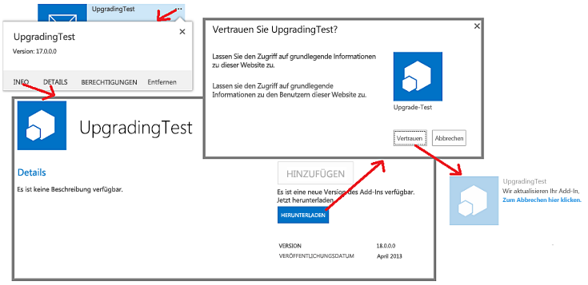

# Aktualisieren von Add-Ins für SharePointUpdate SharePoint Add-ins
Erfahren Sie, wie Sie ein Update für ein SharePoint-Add-In erstellen und bereitstellen.Learn how to create and deploy an update for a SharePoint Add-in.
 

 **Hinweis** Der Name „Apps für SharePoint“ wird in „SharePoint-Add-Ins“ geändert. Während des Übergangszeitraums wird in der Dokumentation und der Benutzeroberfläche einiger SharePoint-Produkte und Visual Studio-Tools möglicherweise weiterhin der Begriff „Apps für SharePoint“ verwendet. Weitere Informationen finden Sie unter [Neuer Name für Office- und SharePoint-Apps](new-name-for-apps-for-sharepoint.md#bk_newname).**Note**  The name "apps for SharePoint" is changing to "SharePoint Add-ins". During the transition, the documentation and the UI of some SharePoint products and Visual Studio tools might still use the term "apps for SharePoint". For details, see  [New name for apps for Office and SharePoint](new-name-for-apps-for-sharepoint.md#bk_newname).
 

Sie können Ihr SharePoint-Add-In mithilfe der in SharePoint integrierten Updateunterstützung aktualisieren. Innerhalb von 24 Stunden, nachdem Sie eine aktualisierte Version des Add-Ins in den Add-In-Katalog eines Unternehmens hochgeladen haben oder das Add-In im Office Store angenommen wurde, wird auf der Seite **Websiteinhalte** jeder Website, auf der das Add-In installiert ist, neben dem Add-In angezeigt, dass ein Update verfügbar ist. Wie Sie in Abbildung 1 sehen können, wird Benutzern ein Link angezeigt, um das Update sofort zu installieren.You can update your SharePoint Add-in by using the updating support built into SharePoint. Within 24 hours after you upload an updated version of the add-in to the organization's add-in catalog or the add-in is accepted at the Office Store, a notification that an update is available appears next to the add-in on  **Site Contents** page of every website where it is installed. As you can see in Figure 1, a link is provided for users to immediately install the update.
 

**Abbildung 1: Updateprozess für SharePoint-Add-Ins****Figure 1. Add-in for SharePoint update process**

 

 

 
Ein Benutzer kann das Update installieren, ohne vorher die frühere Version zu deinstallieren. Die Updateinfrastruktur testet die Updateinstallation und setzt sie zurück, falls Fehler auftreten.A user can install the update without first uninstalling the earlier version. The update infrastructure tests the update installation and rolls it back if there are any errors.
 

    
 **Wichtig** Sie können den *Add-In-Typ* nicht über ein Update des Systems ändern. Sie können beispielsweise nicht ein in SharePoint gehostetes Add-In durch ein Update in ein vom Anbieter gehostetes Add-In ändern. Um den Add-In-Typ zu ändern, müssen Sie [von einem alten Add-In zu einem neuen Add-In migrieren](sharepoint-add-ins-update-process.md#Major). Insbesondere da [das Vorabprogramm für automatisch gehostete Add-Ins beendet wurde](http://blogs.office.com/2014/05/16/update-on-autohosted-apps-preview-program/.md), sollten Sie beachten, dass ein automatisch gehostetes Add-In nicht durch ein Update in ein vom Anbieter gehostetes Add-In geändert werden kann. Sie müssen das Add-In wie in [Konvertieren eines automatisch gehosteten SharePoint-Add-Ins in ein vom Anbieter gehostetes Add-In](convert-an-autohosted-sharepoint-add-in-to-a-provider-hosted-add-in.md) erklärt konvertieren.**Important**  You cannot change the  *add-in type*  using the update system. For example, you cannot change an add-in from SharePoint-hosted to provider-hosted with an update. To make a change of type, you need to [migrate from an old add-in to a new one](sharepoint-add-ins-update-process.md#Major). In particular, since  [the preview program for autohosted add-ins has been closed](http://blogs.office.com/2014/05/16/update-on-autohosted-apps-preview-program/.md), you should be aware that you cannot update an autohosted add-in to a provider-hosted add-in. You have to convert the add-in as explained in  [Convert an autohosted SharePoint Add-in to a provider-hosted add-in](convert-an-autohosted-sharepoint-add-in-to-a-provider-hosted-add-in.md).
 

## Voraussetzungen für das Aktualisieren eines SharePoint-Add-InsPrerequisites for updating a SharePoint Add-in

 

 

- Eine für die Add-In-Isolation konfigurierte SharePoint-Testinstallation. Weitere Informationen zum Einrichten einer Website für Office 365-Entwickler finden Sie unter  [Einrichten einer Entwicklungsumgebung für SharePoint-Add-Ins in Office 365](set-up-a-development-environment-for-sharepoint-add-ins-on-office-365.md).A test SharePoint installation that is configured for add-in isolation. See  [Set up a development environment for SharePoint Add-ins on Office 365](set-up-a-development-environment-for-sharepoint-add-ins-on-office-365.md) for instructions on how to set up an Office 365 Developer Site.
    
 
- Die zum Erstellen einer SharePoint-Add-In verwendeten Tools werden normalerweise auch zum Aktualisieren des Add-Ins verwendet. Die meisten Entwickler verwenden beispielsweise Visual Studio und Microsoft Office-Entwicklertools für Visual Studio zum Erstellen von SharePoint-Add-Ins.Tools that are used in creating a SharePoint Add-in are usually also used in updating it. For example, most developers use Visual Studio and Microsoft Office Developer Tools for Visual Studio to create SharePoint Add-ins.
    
 

### Kernkonzepte für das Aktualisieren eines SharePoint-Add-InsCore concepts to know to update a SharePoint Add-in

 

 

**Tabelle 1. Kernkonzepte für das Aktualisieren eines SharePoint-Add-Ins****Table 1. Core concepts for updating a SharePoint Add-in**

|**Titel des Artikels****Article title**|**Beschreibung****Description**|
|:-----|:-----|
| [Auswählen von Mustern für die Entwicklung und das Hosting Ihres Add-Ins für SharePointChoose patterns for developing and hosting your SharePoint Add-in](choose-patterns-for-developing-and-hosting-your-sharepoint-add-in.md)|Informieren Sie sich über die verschiedenen Typen von SharePoint-Add-Ins. Der Updateprozess variiert je nach Typ.Learn about the different types of SharePoint Add-ins. The updating process varies depending on the type.|
| [Aktualisierungsverfahren für SharePoint-Add-InsSharePoint Add-ins update process](sharepoint-add-ins-update-process.md)|Informieren Sie sich über das Verfahren zum Aktualisieren von SharePoint-Add-Ins.Learn about the process for updating SharePoint Add-ins.|
| [Aktualisieren von FeaturesUpgrading Features](http://msdn.microsoft.com/library/e917f709-6491-4d50-adbe-2ab8f35da990%28Office.15%29.aspx)|Informieren Sie sich über das Aktualisieren von Features (SharePoint 2010 SDK).Learn how to update Features (SharePoint 2010 SDK).|
| [Bereitstellen und Installieren von SharePoint-Add-Ins: Methoden und OptionenDeploying and installing SharePoint Add-ins: methods and options](deploying-and-installing-sharepoint-add-ins-methods-and-options.md)|Informieren Sie sich über die Methoden zum Veröffentlichen, Installieren und Deinstallieren eines SharePoint-Add-Ins.Learn about the methods for publishing, installing, and uninstalling a SharePoint Add-in.|
| [Behandeln von Ereignissen in SharePoint-Add-InsHandle events in SharePoint Add-ins](handle-events-in-sharepoint-add-ins.md)|Informieren Sie sich über Remoteereignisempfänger in SharePoint.Learn about remote event receivers in SharePoint.|

## Wichtige Schritte beim Aktualisieren eines Add-InsMajor steps in updating an add-in

Im Folgenden werden die wichtigsten Schritte beschrieben, die beim Erstellen eines Updates für ein SharePoint-Add-In erforderlich sein können. Jeder Schritt wird in verlinkten Abschnitten oder Artikeln näher erläutert. Nicht alle Schritte sind in jedem Updateprojekt erforderlich. Welche Schritte für Ihr Add-In erforderlich sind, hängt von den Komponenten ab, die sich bereits in Ihrem Add-In befinden, und davon, welche Komponenten Sie hinzufügen. Nur die mit ***** markierten Elemente sind immer erforderlich.The following are the major steps that may be needed when you create an update for a SharePoint Add-in. Each step is discussed in detail in linked sections or articles. Not all the steps are required in every update project. What you must do depends on what components are already in your add-in and what components you are adding. Only the items marked with  ***** are always required.
 

 

- Aktualisieren Sie das Add-In-Manifest.Update the add-in manifest.
    
      -  ***** Erhöhen Sie die **Version**snummer im  [App](http://msdn.microsoft.com/library/d5f30dfe-7500-5f85-0f08-f4f220c0c692%28Office.15%29.aspx)-Element der appmanifest.xml-Datei. (Add-Ins wurden bei der ersten Veröffentlichung des Schemas noch "Apps" genannt) Ändern Sie  *nicht*  die **ProductID**-Nummer.***** Raise the **Version** number in the [App](http://msdn.microsoft.com/library/d5f30dfe-7500-5f85-0f08-f4f220c0c692%28Office.15%29.aspx) element of the appmanifest.xml file. (Add-ins were called "apps" when the schema was first released.) Do *not*  change the **ProductID** number.
    
 
  - Ändern Sie den [AppPermissionRequests](http://msdn.microsoft.com/library/4e617622-78d3-3d23-677d-9957eb1fb107%28Office.15%29.aspx)-Abschnitt der appmanifest.xml-Datei.Change the  [AppPermissionRequests](http://msdn.microsoft.com/library/4e617622-78d3-3d23-677d-9957eb1fb107%28Office.15%29.aspx) section of the appmanifest.xml file.
    
 
  - Ändern Sie den [AppPrerequisites](http://msdn.microsoft.com/library/7622b55f-01a1-2c39-9daa-7cfb1a3c890f%28Office.15%29.aspx)-Abschnitt der appmanifest.xml-Datei.Change the  [AppPrerequisites](http://msdn.microsoft.com/library/7622b55f-01a1-2c39-9daa-7cfb1a3c890f%28Office.15%29.aspx) section of the appmanifest.xml file.
    
 

    Weitere Informationen finden Sie unter [Aktualisieren von Add-In-Version, Berechtigungsanforderungen und Voraussetzungen](#UpdateManifest).For more information, see  [Update the add-in version, permission requests, and prerequisites](#UpdateManifest).
    
 
- Fügen Sie das Markup für Add-In-Web-Komponenten hinzu, oder aktualisieren Sie es. Weitere Informationen finden Sie unter [Aktualisieren von Add-In-Webkomponenten in SharePoint](update-add-in-web-components-in-sharepoint.md).Add or update the markup for add-in web components. For more information, see  [Update add-in web components in SharePoint](update-add-in-web-components-in-sharepoint.md).
    
 
- Fügen Sie das Markup für Hostwebkomponenten hinzu, oder aktualisieren Sie es. Weitere Informationen finden Sie unter [Aktualisieren von Hostwebkomponenten in SharePoint](update-host-web-components-in-sharepoint.md).Add or update the markup for host web components. For more information, see  [Update host web components in SharePoint](update-host-web-components-in-sharepoint.md).
    
 
- Fügen Sie einem  [UpgradedEventEndpoint](http://msdn.microsoft.com/library/09a93d44-d295-47bb-f91c-d243178b0f53%28Office.15%29.aspx) benutzerdefinierte Logik hinzu, und registrieren Sie ihn in der appmanifest.xml-Datei. Weitere Informationen finden Sie unter [Erstellen eines Handlers für das Updateereignis in SharePoint-Add-Ins](create-a-handler-for-the-update-event-in-sharepoint-add-ins.md).Add custom logic to an  [UpgradedEventEndpoint](http://msdn.microsoft.com/library/09a93d44-d295-47bb-f91c-d243178b0f53%28Office.15%29.aspx) and register it in the appmanifest.xml file. For more information, see [Create a handler for the update event in SharePoint Add-ins](create-a-handler-for-the-update-event-in-sharepoint-add-ins.md).
    
 
- Aktualisieren Sie die Remotekomponenten:Update the remote components:
    
      - Aktualisieren Sie bei einem vom Anbieter gehosteten Add-In die Remotekomponenten mithilfe der Techniken, die für den Hostingplattformstapel geeignet sind.For a provider-hosted add-in, update the remote components using the techniques appropriate for the hosting platform stack.
    
 

    Weitere Informationen finden Sie unter [Aktualisieren von Remotekomponenten in SharePoint-Add-Ins](update-remote-components-in-sharepoint-add-ins.md).For more information, see  [Update remote components in SharePoint Add-ins](update-remote-components-in-sharepoint-add-ins.md).
    
 
-  ***** Laden Sie das Add-In-Paket in den Office Store oder den Add-In-Katalog des Unternehmens hoch.***** Upload the add-in package to the Office Store or the organization's add-in catalog.
    
 

## Bewährte Vorgehensweisen für Add-In-UpdatesBest practices for add-in updates

In den folgenden Abschnitten werden Praktiken, die Sie befolgen sollten, und wichtige Punkte erläutert, die Sie bei der Planung eines Updates berücksichtigen sollten.The following sections discuss practices you should follow and important points to consider as you are planning an update.
 

 

### Entscheiden Sie, ob ein Update wirklich erforderlich istDecide whether you really have to update

Bei einem vom Anbieter gehosteten SharePoint-Add-In erfordern Verbesserungen an dem Add-In nicht unbedingt eine Aktualisierung des Add-Ins. Wenn sich alle Änderungen auf Remotekomponenten beziehen und diese Änderungen nicht in SharePoint-Komponenten übernommen werden müssen, können Sie die Remotekomponenten ändern, ohne das Add-In zu aktualisieren. Solange sich die URLs und Verbindungszeichenfolgen, welche die SharePoint-Komponenten für den Zugriff auf die Remotekomponenten verwenden, nicht ändern, funktioniert die SharePoint-Add-In weiterhin. Beispiel: Angenommen, Sie fügen einer Remotewebanwendung eine Schaltfläche hinzu, die eine Spalte aus einer SharePoint-Liste liest, welche die Webanwendung bisher nicht gelesen hat. Wenn die Spalte in der Liste bereits vorhanden ist, müssen Sie in SharePoint keine Änderungen vornehmen. Sie können die überarbeitete Webseite und den überarbeiteten Code dahinter oder JavaScript in die Remotewebanwendung hochladen. Die neue Funktion steht Benutzern sofort zur Verfügung, wenn sie die SharePoint-Add-In starten.For a provider-hosted SharePoint Add-in, improvements to the add-in do not necessarily require updating the add-in. If all the changes are to remote components, and those changes don't have to be reflected in SharePoint components, you can change the remote components without updating the add-in. As long as the URLs and connection strings that the SharePoint components use to access the remote components do not change, the SharePoint Add-in continues to work. For example, suppose that you add a button to a remote web application that reads a column from a SharePoint list that the web application did not previously read. If the column already exists on the list, you do not have to change anything in SharePoint. You can upload the revised webpage, and the revised code behind or JavaScript, to the remote web application. The new functionality is immediately available to users when they start the SharePoint Add-in.
 

 

### Bedenken Sie, dass Aktualisieren für Benutzer optional istRemember that updating is optional for users

Wenn eine neue Version Ihrer SharePoint-Add-In im Office Store oder im Add-In-Katalog des Unternehmens verfügbar ist, wird auf der Seite **Websiteinhalte** auf der Kachel des Add-Ins eine Meldung angezeigt, die Benutzer darüber informiert, dass ein Update verfügbar ist. Es dauert maximal 24 Stunden, bis diese Meldung angezeigt wird. Es gibt aber nichts in der SharePoint-Infrastruktur, das Benutzer zum Aktualisieren zwingt. Änderungen, die Sie an Remotekomponenten vornehmen, dürfen also die älteren Versionen des Add-Ins nicht unbrauchbar machen. In den meisten Fällen gilt, dass Sie Remotekomponenten Elemente *hinzufügen* , aber das Schema, die Verbindungszeichenfolge oder die URL einer bestehenden Komponente nicht löschen, umbenennen, verschieben oder ändern sollten.When a new version of your SharePoint Add-in becomes available in the Office Store or the organization's add-in catalog, a message appears on the add-in's tile on the  **Site Contents** page informing users that an update is available. It takes no more than 24 hours for this message to appear. But nothing in the SharePoint infrastructure forces users to update. So changes that you make to remote components must not break the older versions of the add-in. A general, but not quite universal, rule is that you should *add*  things to remote components, but avoid deleting, renaming, moving, or changing the schema, connection string, or URL of any existing component.
 

 
Wenn eine Remotekomponente die Version der Add-In-Instanz kennen muss, von der sie aufgerufen wird, können Sie diese Informationen von SharePoint übergeben. Sie können die Add-In-Version beispielsweise als Abfrageparameter in der URL der  [Startseite](http://msdn.microsoft.com/library/3092674c-a6c3-9021-3d7e-e716562a4a4f%28Office.15%29.aspx) des Add-Ins hinzufügen.If a remote component needs to know the version of the add-in instance that is calling it, you can pass this information from SharePoint. For example, you can add the add-in version as a query parameter on the  [StartPage](http://msdn.microsoft.com/library/3092674c-a6c3-9021-3d7e-e716562a4a4f%28Office.15%29.aspx) URL of the add-in.
 

 

### Erstellen und Debuggen Sie die neue Version, als ob es ein ganz neues Add-In wäreCreate and debug the new version as if it were a brand new add-in

Sie sollten die Entwicklung und das Debuggen der neuen Version eines Add-Ins vom Debuggen des Update-Markups und der Updatelogik trennen. Deinstallieren Sie dazu die frühere Version des Add-Ins auf Ihrer SharePoint-Entwicklungstestwebsite. Speichern Sie eine Kopie der Add-In-Paketdatei für die frühere Version. Fügen Sie nach Bedarf Komponenten des Add-In hinzu, und ändern Sie diese, und testen und debuggen Sie diese dann mithilfe der Testwebsite, als ob es sich um ein ganz neues Add-In handeln würde, die Sie von Grund auf neu erstellen.You should separate the development and debugging of the new version of the add-in from the debugging of the update markup and logic. To do this, uninstall the earlier version of the add-in from your development test SharePoint site. Save a backup copy of the add-in package file for the earlier version. Add and change components of the add-in as needed, and then test and debug them against the test site as if it is a brand new add-in you are creating from scratch.
 

 

### Testen Sie das Update mit jeder früheren Version des Add-InsTest the update with each earlier version of the add-in

Wenn die neue Version des Add-Ins als ein "neues" Add-In korrekt funktioniert, strukturieren Sie den Code und das Markup so um, dass das Projekt ein Update des alten Add-Ins ist. Erhöhen Sie die Add-In-Versionsnummer z. B. so, wie unter  [Wichtige Schritte beim Aktualisieren eines Add-Ins](#MajorAppUpgradeSteps) angegeben. Weitere Informationen dazu, wie Sie das Projekt in ein Update verwandeln, finden Sie in den untergeordneten Themen dieses Themas.When the new version of the add-in is functioning correctly as a "new" add-in, restructure the code and markup so that the project is an update of the old add-in. For example, increment the add-in version number as indicated in  [Major steps in updating an add-in](#MajorAppUpgradeSteps). For more information about turning the project into an update, see the child topics of this topic.
 

 
Wenn Sie zum Testen Ihres Updates bereit sind, entfernen Sie die neue Version auf der Testwebsite, und stellen Sie die frühere Version erneut bereit, damit Sie die Updatelogik testen können. Wenn Sie mehrere frühere Versionen des Add-Ins bereitgestellt haben, installieren Sie jede frühere Version auf einer anderen Unterwebsite Ihrer Testwebsite. Laden Sie dann die neueste Version des Add-Ins in den Add-In-Katalog Ihrer Testwebsite hoch, und aktualisieren Sie jede Instanz des Add-Ins. Stellen Sie sicher, dass jede Instanz die neueste Add-In-Versionsnummer und die neuste Version aller Komponenten aufweist. Wenn das Add-In ein Add-In-Web enthält, stellen Sie sicher, dass die Add-In-Web-Komponenten mithilfe des Verfahrens in  [Überprüfen der Bereitstellung von Add-In-Web-Komponenten](update-add-in-web-components-in-sharepoint.md#VerifyDeployAppWebComp) bereitgestellt wurden.When you are ready to test your update, retract the new version from the test site and redeploy the earlier version so you can test update logic. If you have shipped multiple previous versions of the add-in, install each earlier version on a different subweb of your test site. Then upload the latest version of the add-in to your test site's add-in catalog and update every instance of the add-in. Verify that each has the latest add-in version number and the latest version of all components. If there is an add-in web in the add-in, verify that the add-in web components have been deployed using the procedure in  [Verify deployment of add-in web components](update-add-in-web-components-in-sharepoint.md#VerifyDeployAppWebComp).
 

 

### Aktualisieren eines Add-Ins, ohne 24 Stunden zu wartenUpdate an add-in without waiting 24 hours

Wenn Sie ein Update für ein Add-In auf Ihrer SharePoint-Testwebsite entwickeln, ist es unpraktisch, zwischen Updates 24 Stunden zu warten. Sie (und Benutzer auf einer SharePoint-Produktionswebsite) können ein Add-In mit diesen Schritten sofort aktualisieren, nachdem sie in den Office Store oder den Add-In-Katalog des Unternehmens hochgeladen wurde:When developing an update for an add-in on your SharePoint test site, it is impractical to wait 24 hours between updates. You (and users on a production SharePoint site) can update an add-in immediately after it is uploaded to the Office Store or the organization's add-in catalog with these steps:
 

 

### So aktualisieren Sie ein Add-In sofortTo immediately update an add-in

1. Nachdem das aktuelle Update zum Add-In-Katalog hochgeladen wurde, öffnen Sie auf der Website, auf der das Add-In installiert wird, die Seite **Websiteinhalte**, und wählen Sie auf der Kachel des Add-Ins die Schaltfläche **...** aus.After the latest update is uploaded to the add-in catalog, open the  **Site Contents** page on the website where the add-in is installed and choose the **...** button on the add-in's tile.
    
 
2. Wählen Sie im daraufhin angezeigten Popup die Registerkarte **Info** aus. Die angezeigte **Info**-Seite enthält einen Hinweis darauf, dass eine neue Version verfügbar ist.On the callout that opens, choose the  **About** tab. On the **About** page that opens, there is a notice that a new version is available.
    
 
3. Wählen Sie die Schaltfläche **Herunterladen** aus. Die Seite **Websiteinhalte** wird erneut geöffnet, und auf der Kachel des Add-Ins wird ein Hinweis angezeigt, dass das Add-In aktualisiert wird.Choose the  **Get It** button. The **Site Contents** page reopens, and there is a notice on the add-in's tile that the add-in is being updated.
    
 
Abbildung 2 illustriert diese Schritte.Figure 2 illustrates these steps.
 

 

**Abbildung 2. Vorgehensweise, um ein SharePoint-Add-In sofort zu aktualisieren****Figure 2. Process of immediately updating a SharePoint Add-in**

 

 

 

    
 **Hinweis** Wenn Sie den Hinweis auf der Kachel des Add-Ins, dass ein Update verfügbar ist, häufiger als alle 24 Stunden anzeigen müssen, können Sie die unter [Aktualisierungsverfahren für einSharePoint-Add-In](sharepoint-add-ins-update-process.md#Minor) beschriebene Methode verwenden, um den Hinweis sofort anzuzeigen.**Note**  If you need to see the "update available" notice on the add-in's tile more frequently than every 24 hours, you can use the method described in  [Update process for a SharePoint Add-in](sharepoint-add-ins-update-process.md#Minor) to make the notice appear immediately.
 

## Aktualisieren von Add-In-Version, Berechtigungsanforderungen und VoraussetzungenUpdate the add-in version, permission requests, and prerequisites

Öffnen Sie das Add-In-Projekt, nachdem Sie eine Sicherungskopie des Visual Studio-Projektordners erstellt haben. Öffnen Sie das Add-In-Manifest, und erhöhen Sie im Manifest-Designer auf der Registerkarte **Allgemein** die Versionsnummer.After making a backup copy of the Visual Studio project folder, open the add-in project. Open add-in manifest and raise the version number on the  **General** tab of the manifest designer.
 

 
Wenn die aktualisierte Version des Add-Ins weitere (oder weniger) Berechtigungen für die Komponenten des Hostwebs benötigt, nehmen Sie nach Bedarf Änderungen  [AppPermissionRequests](http://msdn.microsoft.com/library/4e617622-78d3-3d23-677d-9957eb1fb107%28Office.15%29.aspx) des Add-Ins vor. Verwenden Sie in Visual Studio die Registerkarte **Berechtigungen** des Manifest-Designers. Wenn ein Add-In aktualisiert wird, wird der Benutzer immer zur Gewährung von Berechtigungen aufgefordert, unabhängig davon, ob sich die Berechtigungen im Vergleich zu der vorherigen Version geändert haben. Wenn die neue Version *weniger*  Berechtigungen als die vorherige erfordert, werden die zusätzlichen Berechtigung der vorherigen Version *nicht abgerufen*  . Die einzige Möglichkeit zum Einschränken der Add-In-Berechtigungen ist, dass der Benutzer die Seite *{SharePointDomain}*  `/_layouts/15/appinv.aspx` öffnet, nachdem das Add-In aktualisiert wurde und anschließend das Berechtigungsmarkup manuell einzugeben, dass dem [AppPermissionRequests](http://msdn.microsoft.com/library/4e617622-78d3-3d23-677d-9957eb1fb107%28Office.15%29.aspx)-Schema entspricht.If the updated version of the add-in needs more (or fewer) permissions to components of the host web, make changes as needed to the  [AppPermissionRequests](http://msdn.microsoft.com/library/4e617622-78d3-3d23-677d-9957eb1fb107%28Office.15%29.aspx) section of the add-in. In Visual Studio, use the **Permissions** tab of the manifest designer. When an add-in is updated, the user is always prompted to grant permissions, whether the permissions have changed or not since the previous version. If the new version requests *fewer*  permissions than the preceding version, the additional permissions of the preceding version *are not revoked*  . The only way to restrict the add-in to the permissions that the latest version needs, is for a user to open the page *{SharePointDomain}*  `/_layouts/15/appinv.aspx` after the add-in has been updated, and then manually enter permission markup that conforms to the [AppPermissionRequests](http://msdn.microsoft.com/library/4e617622-78d3-3d23-677d-9957eb1fb107%28Office.15%29.aspx) schema.
 

 
Wenn die aktualisierte Version des Add-Ins Anforderungen hat, die frühere Versionen nicht hatten (oder keine Anforderungen mehr hat, die frühere Versionen hatten), nehmen Sie nach Bedarf Änderungen am Abschnitt  [AppPrerequisites](http://msdn.microsoft.com/library/7622b55f-01a1-2c39-9daa-7cfb1a3c890f%28Office.15%29.aspx) des Add-Ins vor. Verwenden Sie in Visual Studio die Registerkartte **Anforderungen** des Manifest-Designers.If the updated version of the add-in has prerequisites that the earlier versions did not have (or no longer has some prerequisites that earlier versions had), make changes as needed to the  [AppPrerequisites](http://msdn.microsoft.com/library/7622b55f-01a1-2c39-9daa-7cfb1a3c890f%28Office.15%29.aspx) section of the add-in. In Visual Studio, use the **Prerequisites** tab of the manifest designer.
 

 

## Nächste SchritteNext steps

Fahren Sie mit dem nächsten Aufzählungspunkt im Abschnitt [Wichtige Schritte beim Aktualisieren eines Add-Ins](#MajorAppUpgradeSteps) fort, oder wechseln Sie direkt zu einem der folgenden Artikel:Continue with the next bullet in the section  [Major steps in updating an add-in](#MajorAppUpgradeSteps) or go directly to one of the following articles:
 

 

-  [Aktualisieren von Add-In-Webkomponenten in SharePointUpdate add-in web components in SharePoint](update-add-in-web-components-in-sharepoint.md)
    
 
-  [Aktualisieren von Hostwebkomponenten in SharePointUpdate host web components in SharePoint](update-host-web-components-in-sharepoint.md)
    
 
-  [Erstellen eines Handlers für das Updateereignis in SharePoint-Add-InsCreate a handler for the update event in SharePoint Add-ins](create-a-handler-for-the-update-event-in-sharepoint-add-ins.md)
    
 
-  [Aktualisieren von Remotekomponenten in SharePoint-Add-InsUpdate remote components in SharePoint Add-ins](update-remote-components-in-sharepoint-add-ins.md)
    
 

## Zusätzliche RessourcenAdditional resources

-  [Entwickeln von SharePoint-Add-insDevelop SharePoint Add-ins](develop-sharepoint-add-ins.md)
    
 
-  [Aktualisierungsverfahren für SharePoint-Add-InsSharePoint Add-ins update process](sharepoint-add-ins-update-process.md)
    
 

