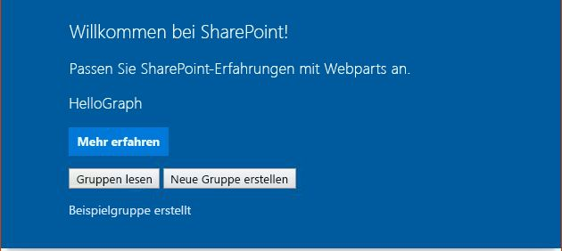

# <a name="use-graphhttpclient-to-call-microsoft-graph"></a><span data-ttu-id="443bc-101">Verwenden von GraphHttpClient zum Aufrufen von Microsoft Graph</span><span class="sxs-lookup"><span data-stu-id="443bc-101">5. Use the access token to call Microsoft Graph</span></span>
> [!IMPORTANT]
><span data-ttu-id="443bc-102">Der **GraphHttpClient** befindet sich derzeit in der Preview-Phase. Änderungen sind vorbehalten.</span><span class="sxs-lookup"><span data-stu-id="443bc-102">The **GraphHttpClient** is currently in preview and is subject to change.</span></span> <span data-ttu-id="443bc-103">Er wird derzeit in Produktionsumgebungen nicht unterstützt.</span><span class="sxs-lookup"><span data-stu-id="443bc-103">They are not currently supported for use in production environments.</span></span>

<span data-ttu-id="443bc-104">Verwenden Sie die **GraphHttpClient**-Klasse zum Aufrufen der Microsoft Graph-REST-API.</span><span class="sxs-lookup"><span data-stu-id="443bc-104">Use the **GraphHttpClient** class to make calls to the Microsoft Graph REST API.</span></span> <span data-ttu-id="443bc-105">Sie können GET-, POST- und PATCH-Anforderungen vornehmen. Verwenden Sie dazu die Methoden **get()**, **post()** und **fetch()**.</span><span class="sxs-lookup"><span data-stu-id="443bc-105">You can make GET, POST, and PATCH requests using the **get()**, **post()**, and **fetch()** methods.</span></span> <span data-ttu-id="443bc-106">Dieser Artikel erläutert, wie Sie ein Webpart erstellen, das **GraphHttpClient** verwendet, Sie können **GraphHttpClient** jedoch in jedem SharePoint-Framework-Clientcode verwenden.</span><span class="sxs-lookup"><span data-stu-id="443bc-106">This article shows how to build a web part that uses **GraphHttpClient**, but you can use **GraphHttpClient** in any SharePoint Framework client code.</span></span>

## <a name="retrieve-office-365-groups-using-a-get-call"></a><span data-ttu-id="443bc-107">Abrufen von Office 365-Gruppen mit einem GET-Aufruf</span><span class="sxs-lookup"><span data-stu-id="443bc-107">Retrieve Office 365 groups using a GET call</span></span>

<span data-ttu-id="443bc-108">Sie können die **get()**-Methode verwenden, um einen REST-Aufruf an Microsoft Graph vorzunehmen.</span><span class="sxs-lookup"><span data-stu-id="443bc-108">You can use the **get()** method to make a REST call to Microsoft Graph.</span></span> <span data-ttu-id="443bc-109">In diesem Beispiel wird gezeigt, wie Sie eine Liste der Office 365-Gruppen abrufen.</span><span class="sxs-lookup"><span data-stu-id="443bc-109">This example shows you how to retrieve a list of Office 365 groups.</span></span> 

### <a name="create-a-new-web-part-project"></a><span data-ttu-id="443bc-110">Erstellen eines neuen Webpart-Projekts</span><span class="sxs-lookup"><span data-stu-id="443bc-110">Create a new web part project</span></span>

1. <span data-ttu-id="443bc-111">Erstellen Sie an einem Speicherort Ihrer Wahl ein neues Projektverzeichnis.</span><span class="sxs-lookup"><span data-stu-id="443bc-111">Create a new project directory in your favorite location.</span></span> 

  ```
  mkdir hellograph-webpart
  ```

2. <span data-ttu-id="443bc-112">Wechseln Sie in das Projektverzeichnis.</span><span class="sxs-lookup"><span data-stu-id="443bc-112">Go to the project directory.</span></span>

  ```
  cd hellograph-webpart
  ```

3. <span data-ttu-id="443bc-113">Führen Sie den Yeoman-SharePoint-Generator aus, um ein neues Webpart zu erstellen.</span><span class="sxs-lookup"><span data-stu-id="443bc-113">Create a new web part by running the Yeoman SharePoint generator:</span></span>

  ```
  yo @microsoft/sharepoint
  ```

4. <span data-ttu-id="443bc-114">Es werden verschiedene Eingabeaufforderungen angezeigt. Gehen Sie wie folgt vor:</span><span class="sxs-lookup"><span data-stu-id="443bc-114">When prompted:</span></span>

  * <span data-ttu-id="443bc-115">Geben Sie als Namen der Lösung **hellograph-webpart** ein.</span><span class="sxs-lookup"><span data-stu-id="443bc-115">Enter a solution name of **hellograph-webpart**.</span></span>
  * <span data-ttu-id="443bc-116">Wählen Sie als Speicherort für die Dateien die Option **Use the current folder** aus.</span><span class="sxs-lookup"><span data-stu-id="443bc-116">Select **Use the current folder** for where to place the files.</span></span>
  * <span data-ttu-id="443bc-117">Geben Sie bei Aufforderung **y** ein, wenn Sie dem Mandantenadministrator erlauben möchten, die Lösung sofort auf allen Websites bereitzustellen, ohne dass eine Featurebereitstellung durchgeführt oder Apps zu Websites hinzugefügt werden.</span><span class="sxs-lookup"><span data-stu-id="443bc-117">Enter **y** when prompted if you want to allow the tenant admin to deploy the solution to all sites immediately, without running any feature deployment or adding apps in sites.</span></span>
  * <span data-ttu-id="443bc-118">Wählen Sie **Webpart** als Typ der zu erstellenden clientseitigen Komponente aus.</span><span class="sxs-lookup"><span data-stu-id="443bc-118">**WebPart** as the type of client-side component to create.</span></span>
  * <span data-ttu-id="443bc-119">Geben Sie **HelloGraph** als Webpartnamen ein.</span><span class="sxs-lookup"><span data-stu-id="443bc-119">Enter **HelloGraph** as your web part name.</span></span>
  * <span data-ttu-id="443bc-120">Geben Sie als Beschreibung des Webparts **Calls the Microsoft Graph Groups API** (Ruft die Microsoft Graph Groups-API) ein.</span><span class="sxs-lookup"><span data-stu-id="443bc-120">Enter **Calls the Microsoft Graph Groups API** as the web part description.</span></span>
  * <span data-ttu-id="443bc-121">Übernehmen Sie die Standardeinstellung **No javaScript web framework** aus, und drücken Sie die **EINGABETASTE**.</span><span class="sxs-lookup"><span data-stu-id="443bc-121">Accept the default **No javascript web framework** as the framework you would like to use and choose **Enter**.</span></span>

  

5. <span data-ttu-id="443bc-123">Der Yeoman Generator erstellt das Webpart.</span><span class="sxs-lookup"><span data-stu-id="443bc-123">The Yeoman generator will build the web part.</span></span> <span data-ttu-id="443bc-124">Öffnen Sie den Projektordner in Ihrem Code-Editor, sobald die Gerüsterstellung abgeschlossen ist.</span><span class="sxs-lookup"><span data-stu-id="443bc-124">When the scaffolding is finished, open your project folder in your code editor.</span></span> <span data-ttu-id="443bc-125">In diesem Artikel wird Visual Studio Code in den Schritten und Screenshots verwendet, Sie können jedoch einen beliebigen Editor verwenden.</span><span class="sxs-lookup"><span data-stu-id="443bc-125">Once the scaffolding completes, open your project folder in your code editor. This article uses Visual Studio Code in the steps and screenshots but you can use any editor you prefer.</span></span>

6. <span data-ttu-id="443bc-126">Führen Sie den Befehl „gulp serve“ aus, und überprüfen Sie, ob er in der lokalen Workbench korrekt ausgeführt wird.</span><span class="sxs-lookup"><span data-stu-id="443bc-126">Run the gulp serve command and confirm that it runs in the local workbench correctly.</span></span>

  ```
  gulp serve
  ```

### <a name="add-a-button-and-placeholder-for-results"></a><span data-ttu-id="443bc-127">Hinzufügen einer Schaltfläche und eines Platzhalters für Ergebnisse</span><span class="sxs-lookup"><span data-stu-id="443bc-127">Add a button and placeholder for results</span></span>
<span data-ttu-id="443bc-128">Im nächsten Schritt müssen Sie den HTML-Code ändern, um eine Schaltfläche zum Abrufen von Office 365-Gruppen bereitzustellen.</span><span class="sxs-lookup"><span data-stu-id="443bc-128">Next, you'll modify the HTML to provide a button to retrieve Office 365 groups.</span></span> <span data-ttu-id="443bc-129">Der HTML-Code benötigt darüber hinaus einen Platzhalter, um die Gruppen anzeigen zu können.</span><span class="sxs-lookup"><span data-stu-id="443bc-129">The HTML also needs a placeholder to display the groups.</span></span>

1. <span data-ttu-id="443bc-130">Öffnen Sie im Code-Editor die Datei **/src/webparts/helloGraph/HelloGraphWebPart.ts** .</span><span class="sxs-lookup"><span data-stu-id="443bc-130">In the code editor, open the **./src/webparts/tasksCalendar/TasksCalendarWebPart.ts** file.</span></span>

2. <span data-ttu-id="443bc-131">Ändern Sie die **render()**-Methode so, dass Sie eine Schaltfläche und ein **div** umfasst, damit der Code die Office 365-Gruppen nach dem Abrufen auflistet.</span><span class="sxs-lookup"><span data-stu-id="443bc-131">Modify the **render()** method so that it contains a button and a **div** where the code will list the Office 365 groups after they are retrieved.</span></span>

  <span data-ttu-id="443bc-132">Ihr Code sollte wie das folgende TypeScript aussehen.</span><span class="sxs-lookup"><span data-stu-id="443bc-132">Your code should look like the following TypeScript.</span></span>

  ```typescript
    public render(): void {
      this.domElement.innerHTML = `
        <div class="${styles.helloGraph}">
        <div class="${styles.container}">
        <div class="ms-Grid-row ms-bgColor-themeDark ms-fontColor-white ${styles.row}">
          <div class="ms-Grid-col ms-u-lg10 ms-u-xl8 ms-u-xlPush2 ms-u-lgPush1">
            <span class="ms-font-xl ms-fontColor-white">Welcome to SharePoint!</span>
            <p class="ms-font-l ms-fontColor-white">Customize SharePoint experiences using Web Parts.</p>
            <p class="ms-font-l ms-fontColor-white">${escape(this.properties.description)}</p>
            <a href="https://aka.ms/spfx" class="${styles.button}">
              <span class="${styles.label}">Learn more</span>
            </a>
            <p>
            <input id="readGroups" type="button" value="Read Groups"/> 
            </p>
            <div id="spTableContainer" ></div>
          </div>
        </div>
      </div>
    </div>`;
    this.domElement.querySelector('#readGroups').addEventListener('click',() => {this._readGroups();});
    }
  ```

  <span data-ttu-id="443bc-133">Sie definieren die **_readGroups()**-Methode später.</span><span class="sxs-lookup"><span data-stu-id="443bc-133">You'll define the **_readGroups()** method later.</span></span>

3. <span data-ttu-id="443bc-134">Definieren Sie eine Schnittstelle für jede Office 365-Gruppe.</span><span class="sxs-lookup"><span data-stu-id="443bc-134">Define an interface to represent each Office 365 group.</span></span> <span data-ttu-id="443bc-135">Fügen Sie den folgenden Code genau vor der **HelloGraphWebPart**-Klasse, jedoch nach den Importen ein.</span><span class="sxs-lookup"><span data-stu-id="443bc-135">Add the following code just before the **HelloGraphWebPart** class but after the imports.</span></span>

  ```typescript
  export interface IOffice365Group {
    // Microsoft Graph has more group properties.
    displayName: string;
    mail: string;
    description: string;
  }
  ```

### <a name="use-the-graphhttpclientget-method-to-retrieve-office-365-groups"></a><span data-ttu-id="443bc-136">Verwenden der GraphHttpClient.get-Methode zum Abrufen von Office 365-Gruppen</span><span class="sxs-lookup"><span data-stu-id="443bc-136">Use the GraphHttpClient.get method to retrieve Office 365 groups</span></span>
<span data-ttu-id="443bc-137">Als Nächstes rufen Sie die **GraphHttpClient.get()**-Methode auf, um einen REST-Aufruf für Microsoft Graph durchzuführen, mit dem eine Liste der Office 365-Gruppen abgerufen wird.</span><span class="sxs-lookup"><span data-stu-id="443bc-137">Next, you'll call the **GraphHttpClient.get()** method to make a REST call to Microsoft Graph to retrieve a list of Office 365 groups.</span></span>

1. <span data-ttu-id="443bc-138">I0mportieren Sie die **GraphHttpClient**-Klasse und verwandte Typen, indem Sie die folgende Importanweisung oben in die Datei **HelloGraphWebPart.ts** einfügen.</span><span class="sxs-lookup"><span data-stu-id="443bc-138">Import the **GraphHttpClient** class and related types by adding the following import statement near the top of the **HelloGraphWebPart.ts** file.</span></span>

  ```typescript
  import { GraphHttpClient, HttpClientResponse, IGraphHttpClientOptions } from '@microsoft/sp-http';
  ```

2. <span data-ttu-id="443bc-139">Erstellen Sie die **_readGroups()**-Methode, indem Sie den folgenden Code zur **HelloGraphWebPart**-Klasse hinzufügen.</span><span class="sxs-lookup"><span data-stu-id="443bc-139">Create the **_readGroups()** method by adding the following code to the **HelloGraphWebPart** class.</span></span>

  ```typescript
  protected _readGroups(){
      // Query for all groups on the tenant using Microsoft Graph.
      this.context.graphHttpClient.get(`v1.0/groups?$orderby=displayName`, GraphHttpClient.configurations.v1).then((response: HttpClientResponse) => {
        if (response.ok) {
          return response.json();
        } else {
          console.warn(response.statusText);
        }
      }).then((result: any) => {
        // Transfer result values to the group variable
        this._renderTable(result.value);
      });
  }
  ```

  <span data-ttu-id="443bc-140">Im vorherigen Code hat die Kontexteigenschaft die GraphHttpClient-Instanz.</span><span class="sxs-lookup"><span data-stu-id="443bc-140">In the previous code, the context property has the GraphHttpClient instance.</span></span> <span data-ttu-id="443bc-141">Wenn Sie die **get()**-Methode aufrufen, erfolgt ein REST-Aufruf an Microsoft Graph, der die angegebene URL übergibt.</span><span class="sxs-lookup"><span data-stu-id="443bc-141">When you call the **get()** method, a REST call is made to Microsoft Graph that passes the specified URL.</span></span> <span data-ttu-id="443bc-142">In diesem Fall ist die URL **v1.0/groups?orderby=displayName**.</span><span class="sxs-lookup"><span data-stu-id="443bc-142">In this case, the URL is **v1.0/groups?orderby=displayName**.</span></span> <span data-ttu-id="443bc-143">Diese gibt eine GET-Anforderung aus, und Microsoft Graph gibt alle Office 365-Gruppen im Mandanten geordnet nach Name zurück.</span><span class="sxs-lookup"><span data-stu-id="443bc-143">This issues a GET request and Microsoft Graph will return all Office 365 groups in the tenant in order by display name.</span></span>

  <span data-ttu-id="443bc-144">Sie können eine beliebige GET-Anforderung ausgeben, indem Sie diese Methode verwenden und die richtigen Werte für die URL eingeben.</span><span class="sxs-lookup"><span data-stu-id="443bc-144">You can issue any GET request by using this technique and entering the correct URL values.</span></span> <span data-ttu-id="443bc-145">Weitere Informationen zum Suchen der URL-Werte finden Sie in der [Dokumentation zu Microsoft Graph](https://developer.microsoft.com/de-DE/graph/docs/concepts/overview).</span><span class="sxs-lookup"><span data-stu-id="443bc-145">To find the URL values, see the [Microsoft Graph documentation](https://developer.microsoft.com/de-DE/graph/docs/concepts/overview).</span></span> <span data-ttu-id="443bc-146">Sie können zum Beispiel die im Thema [GET-Anforderung für Gruppen](https://developer.microsoft.com/de-DE/graph/docs/api-reference/v1.0/api/group_get) aufgeführte URL verwenden, um Gruppen abzurufen.</span><span class="sxs-lookup"><span data-stu-id="443bc-146">For example, you can use URL specified in the [Groups GET request](https://developer.microsoft.com/de-DE/graph/docs/api-reference/v1.0/api/group_get) topic to get groups.</span></span> 

  <span data-ttu-id="443bc-147">Die **get()**-Methode gibt eine **HttpClientResponse** zurück, die Sie verwenden können um zu ermitteln, ob der Aufruf erfolgreich durchgeführt wurde.</span><span class="sxs-lookup"><span data-stu-id="443bc-147">The **get()** method returns an **HttpClientResponse**, which you can use to determine whether the call was successful.</span></span> <span data-ttu-id="443bc-148">Der zurückgegebene JSON-Code befindet sich im **result.value**.</span><span class="sxs-lookup"><span data-stu-id="443bc-148">The returned JSON is in the **result.value**.</span></span> <span data-ttu-id="443bc-149">Da Sie davon ausgehen, dass mehrere Gruppen zurückgegeben werden, übergeben Sie den Wert an eine **_renderTable()**-Methode, die eine Tabelle mit Zeilen für die einzelnen Gruppen erstellt.</span><span class="sxs-lookup"><span data-stu-id="443bc-149">Because you expect multiple groups to be returned, you will pass the value to a **_renderTable()** method, which will build a table of rows for each group.</span></span>

3. <span data-ttu-id="443bc-150">Erstellen Sie eine **_renderTable()**-Methode zum Rendern der zurückgegebenen Gruppen in einer Tabelle, wobei jede Zeile eine Gruppe darstellt.</span><span class="sxs-lookup"><span data-stu-id="443bc-150">Create a **_renderTable()** method to render the returned groups in a table where each row represent a group.</span></span> <span data-ttu-id="443bc-151">Fügen Sie die folgende Methode zur **HelloGraphWebPart**-Klasse hinzu.</span><span class="sxs-lookup"><span data-stu-id="443bc-151">Add the following method to the  **** class.</span></span>

  ```typescript
  protected _renderTable(items: IOffice365Group[]): void {
    let html: string = '';
    if (items.length<=0){
      html=`<p>There are no groups to list...</p>`;
    }
    else {
      html += `
      <table><tr>
        <th>Display Name</th>
        <th>Mail</th>
        <th>Description</th></tr>`;
      items.forEach((item: IOffice365Group) => {
        html += `
          <tr>
              <td>${item.displayName}</td>
              <td>${item.mail}</td>
              <td>${item.description}</td>
          </tr>`;
      });
      html += `</table>`;
    }
    const tableContainer: Element = this.domElement.querySelector('#spTableContainer');
    tableContainer.innerHTML = html;
    return;
  }
  ```

### <a name="run-the-web-part-to-call-microsoft-graph"></a><span data-ttu-id="443bc-152">Ausführen des Webparts zum Aufrufen von Microsoft Graph</span><span class="sxs-lookup"><span data-stu-id="443bc-152">Run the web part to call Microsoft Graph</span></span>
<span data-ttu-id="443bc-153">Der Code muss die **GraphHttpClient**-Anwendung aufrufen, die in SharePoint ausgeführt wird. Sie können die Anwendung nicht in der lokalen Workbench ausführen.</span><span class="sxs-lookup"><span data-stu-id="443bc-153">The code needs to call the **GraphHttpClient** application that runs on SharePoint, so you can't run it on the local workbench.</span></span> <span data-ttu-id="443bc-154">Sie müssen Sie packen und in SharePoint bereitstellen.</span><span class="sxs-lookup"><span data-stu-id="443bc-154">You have to package and deploy it to SharePoint.</span></span>

1. <span data-ttu-id="443bc-155">Verwenden Sie zum Packen der Lösung „gulp“.</span><span class="sxs-lookup"><span data-stu-id="443bc-155">Use gulp to package your solution.</span></span>

  ```
  gulp package-solution
  ```

2. <span data-ttu-id="443bc-156">Stellen Sie die Lösung in Ihrem SharePoint-Mandanten bereit:</span><span class="sxs-lookup"><span data-stu-id="443bc-156">Deploy the solution to your SharePoint tenant:</span></span>
  * <span data-ttu-id="443bc-157">Wechseln Sie zum App-Katalog der Website.</span><span class="sxs-lookup"><span data-stu-id="443bc-157">Go to your site's App Catalog.</span></span>
  * <span data-ttu-id="443bc-158">Laden Sie **helloworld-webpart.sppkg** in den App-Katalog hoch, oder legen Sie es mit Drag & Drop dort ab.</span><span class="sxs-lookup"><span data-stu-id="443bc-158">Upload or drag and drop the **helloworld-webpart.sppkg** to the App Catalog.</span></span>
  * <span data-ttu-id="443bc-159">Wenn Sie aufgefordert werden anzugeben, ob Sie **hellograph-webpart-client-side-solution** vertrauen, wählen Sie **Diese Lösung für alle Websites in der Organisation verfügbar machen** aus, und wählen Sie dann **Bereitstellen**.</span><span class="sxs-lookup"><span data-stu-id="443bc-159">When prompted, if you trust the **hellograph-webpart-client-side-solution**, select **Make this solution available to all sites in the organization**, and choose **Deploy**.</span></span>

3. <span data-ttu-id="443bc-160">Verwenden Sie zum Hosten des Webparts „gulp serve“.</span><span class="sxs-lookup"><span data-stu-id="443bc-160">Use gulp serve to host the web part.</span></span>

  ```
  gulp serve --nobrowser
  ```

4. <span data-ttu-id="443bc-161">Fügen Sie das Webpart einer Webseite hinzu, oder verwenden Sie die SharePoint-Workbench.</span><span class="sxs-lookup"><span data-stu-id="443bc-161">Add the web part to a web page, or use the SharePoint workbench.</span></span>

  <span data-ttu-id="443bc-162">Folgendes solle auf der Seite angezeigt werden:</span><span class="sxs-lookup"><span data-stu-id="443bc-162">You should now see the alert message on your page.</span></span>
  <span data-ttu-id="443bc-163"></span><span class="sxs-lookup"><span data-stu-id="443bc-163"></span></span>

  <span data-ttu-id="443bc-164">Wenn Sie **Gruppen lesen** auswählen, wird eine Liste aller Office 365-Gruppen auf dem Mandanten angezeigt.</span><span class="sxs-lookup"><span data-stu-id="443bc-164">When you choose **Read Groups**, you will see a list of all the Office 365 groups on your tenant.</span></span> <span data-ttu-id="443bc-165">Wenn keine Gruppen aufgelistet sind, wird eine Meldung angezeigt, die angibt, dass keine Gruppen vorhanden sind.</span><span class="sxs-lookup"><span data-stu-id="443bc-165">If no groups are listed, you'll just see a message that indicates that there were no groups.</span></span> <span data-ttu-id="443bc-166">Als Nächstes erstellen Sie eine neue Gruppe.</span><span class="sxs-lookup"><span data-stu-id="443bc-166">You will create a new group next.</span></span>

## <a name="create-a-new-office-365-group-using-a-post-call"></a><span data-ttu-id="443bc-167">Erstellen einer neuen Office 365-Gruppe mit einem POST-Aufruf</span><span class="sxs-lookup"><span data-stu-id="443bc-167">Create a new Office 365 group using a POST call</span></span>

<span data-ttu-id="443bc-168">Sie können POST-Aufrufe an die Microsoft Graph-API ausgeben, indem Sie die **GraphHttpClient.post()**-Methode verwenden.</span><span class="sxs-lookup"><span data-stu-id="443bc-168">You can issue POST calls to the Microsoft Graph API by using the **GraphHttpClient.post()** method.</span></span> <span data-ttu-id="443bc-169">Verwenden Sie die **post()**-Methode zum Erstellen einer neuen Office 365-Gruppe.</span><span class="sxs-lookup"><span data-stu-id="443bc-169">You'll use the **post()** method to create a new Office 365 group.</span></span>


### <a name="add-a-button-and-placeholder-for-results"></a><span data-ttu-id="443bc-170">Hinzufügen einer Schaltfläche und eines Platzhalters für Ergebnisse</span><span class="sxs-lookup"><span data-stu-id="443bc-170">Add a button and placeholder for results</span></span>
<span data-ttu-id="443bc-171">Sie müssen erneut den HTML-Code ändern, um eine Schaltfläche hinzuzufügen, mit der eine neue Gruppe erstellt wird.</span><span class="sxs-lookup"><span data-stu-id="443bc-171">Again, you need to modify the HTML to add a button that will create a new group.</span></span>

1. <span data-ttu-id="443bc-172">Öffnen Sie im Code-Editor die Datei **/src/webparts/helloGraph/HelloGraphWebPart.ts** .</span><span class="sxs-lookup"><span data-stu-id="443bc-172">In the code editor, open the **./src/webparts/tasksCalendar/TasksCalendarWebPart.ts** file.</span></span>

2. <span data-ttu-id="443bc-173">Ändern Sie die **render()**-Methode so, dass sie eine Schaltfläche und ein **div** enthält, um anzugebn, ob die Erstellung erfolgreich war.</span><span class="sxs-lookup"><span data-stu-id="443bc-173">Modify the **render()** method so that it contains a button and a **div** that will indicate whether the creation was successful.</span></span>

  <span data-ttu-id="443bc-174">Ihr Code sollte wie das folgende TypeScript aussehen.</span><span class="sxs-lookup"><span data-stu-id="443bc-174">Your code should look like the following TypeScript.</span></span>

  ```typescript
    public render(): void {
      this.domElement.innerHTML = `
        <div class="${styles.helloGraph}">
        <div class="${styles.container}">
        <div class="ms-Grid-row ms-bgColor-themeDark ms-fontColor-white ${styles.row}">
          <div class="ms-Grid-col ms-u-lg10 ms-u-xl8 ms-u-xlPush2 ms-u-lgPush1">
            <span class="ms-font-xl ms-fontColor-white">Welcome to SharePoint!</span>
            <p class="ms-font-l ms-fontColor-white">Customize SharePoint experiences using Web Parts.</p>
            <p class="ms-font-l ms-fontColor-white">${escape(this.properties.description)}</p>
            <a href="https://aka.ms/spfx" class="${styles.button}">
              <span class="${styles.label}">Learn more</span>
            </a>
            <p>
            <input id="readGroups" type="button" value="Read Groups"/> 
            <input id="createGroup" type="button" value="Create New Group"/>                           
            </p>
            <div id="spCreateGroupResults" ></div>
            <div id="spTableContainer" ></div>
          </div>
        </div>
      </div>
    </div>`;
    this.domElement.querySelector('#createGroup').addEventListener('click',() => {this._createGroup();});
    this.domElement.querySelector('#readGroups').addEventListener('click',() => {this._readGroups();});    
    }
  ```

3. <span data-ttu-id="443bc-175">Fügen Sie die **_createGroup()**-Methode hinzu, um die Microsoft Graph-API aufzurufen und eine neue Gruppe zu erstellen.</span><span class="sxs-lookup"><span data-stu-id="443bc-175">Add the **_createGroup()** method to call the Microsoft Graph API and create a new group.</span></span>

  ```typescript
    protected _createGroup(){
      // Use Microsoft Graph to create a sample group.
      this.context.graphHttpClient.post(`v1.0/groups`,GraphHttpClient.configurations.v1,{
        body: JSON.stringify({"description": "Self help community for library",
        "displayName": "Library Assist",
        "groupTypes": [
          "Unified"
        ],
        "mailEnabled": true,
        "mailNickname": "library",
        "securityEnabled": false
      })
    }).then((response: HttpClientResponse) => {
      const resultContainer: Element = this.domElement.querySelector('#spCreateGroupResults');
        if (response.ok) {
          resultContainer.innerHTML = `<p>Sample group created</p>`;
        } else {
          resultContainer.innerHTML = `<p>Could not create group see console for details</p>`;        
          console.warn(response.status);
        }
      });
    }
  ```

  <span data-ttu-id="443bc-176">Der vorherige Code erstellt eine einfache Gruppe mithilfe des Codebeispiels im Artikel [Gruppe erstellen](https://developer.microsoft.com/de-DE/graph/docs/api-reference/v1.0/api/group_post_groups) von Microsoft Graph.</span><span class="sxs-lookup"><span data-stu-id="443bc-176">The previous code creates a simple group using the code example from the Microsoft Graph [Create group](https://developer.microsoft.com/de-DE/graph/docs/api-reference/v1.0/api/group_post_groups) article.</span></span>

  <span data-ttu-id="443bc-177">Die **post()**-Methode gibt einen POST-REST-API-Aufruf an die URL **v1.0/groups** aus.</span><span class="sxs-lookup"><span data-stu-id="443bc-177">The **post()** issues a POST REST API call to the **v1.0/groups** URL.</span></span> <span data-ttu-id="443bc-178">Der dritte Parameter ist ein **IGraphHttpClientOptions**-Wert, in dem der JSON-Text zum Beschreiben der neuen Gruppe angegeben ist.</span><span class="sxs-lookup"><span data-stu-id="443bc-178">The third parameter is an **IGraphHttpClientOptions** value in which the JSON body is specified to describe the new group.</span></span> <span data-ttu-id="443bc-179">Die **HttpClientResponse** wird verwendet, um zu ermitteln, ob der Aufruf erfolgreich war, und um das entsprechende Ergebnis anzuzeigen.</span><span class="sxs-lookup"><span data-stu-id="443bc-179">The **HttpClientResponse** is used to determine whether the call was successful, and to display an appropriate result.</span></span>

  <span data-ttu-id="443bc-180">Sie können einen POST-Aufruf über die Microsoft Graph-Dokumentation ausgeben, indem Sie dieses Muster verwenden und JSON im Textkörper angeben.</span><span class="sxs-lookup"><span data-stu-id="443bc-180">You can issue a POST call from the Microsoft Graph documentation by using this pattern and specifying the JSON in the body.</span></span>

### <a name="run-the-web-part-to-create-a-new-group"></a><span data-ttu-id="443bc-181">Ausführen des Webparts zum Erstellen einer neuen Gruppe</span><span class="sxs-lookup"><span data-stu-id="443bc-181">Run the web part to create a new group</span></span>

1. <span data-ttu-id="443bc-182">Verwenden Sie zum Packen der Lösung „gulp“.</span><span class="sxs-lookup"><span data-stu-id="443bc-182">Use gulp to package your solution.</span></span>

  ```
  gulp package-solution
  ```

2. <span data-ttu-id="443bc-183">Stellen Sie die Lösung in Ihrem SharePoint-Mandanten bereit:</span><span class="sxs-lookup"><span data-stu-id="443bc-183">Deploy the solution to your SharePoint tenant:</span></span>
  * <span data-ttu-id="443bc-184">Wechseln Sie zum App-Katalog der Website.</span><span class="sxs-lookup"><span data-stu-id="443bc-184">Go to your site's App Catalog.</span></span>
  * <span data-ttu-id="443bc-185">Laden Sie **helloworld-webpart.sppkg** in den App-Katalog hoch, oder legen Sie es mit Drag & Drop dort ab.</span><span class="sxs-lookup"><span data-stu-id="443bc-185">Upload or drag and drop the **helloworld-webpart.sppkg** to the App Catalog.</span></span>
  * <span data-ttu-id="443bc-186">Da Ihre Lösung bereits registriert ist, werden Sie aufgefordert zu bestätigen, ob Sie sie ersetzen möchten.</span><span class="sxs-lookup"><span data-stu-id="443bc-186">Because your solution is already registered, you'll be prompted as to whether you want to replace it.</span></span> <span data-ttu-id="443bc-187">Wählen Sie **Ersetzen**.</span><span class="sxs-lookup"><span data-stu-id="443bc-187">Choose **Replace It**.</span></span>
  * <span data-ttu-id="443bc-188">Wenn Sie aufgefordert werden anzugeben, ob Sie der Lösung vertrauen, wählen Sie **Bereitstellen**.</span><span class="sxs-lookup"><span data-stu-id="443bc-188">When prompted as to whether you trust the solution, choose **Deploy**.</span></span>

3. <span data-ttu-id="443bc-189">Verwenden Sie zum Hosten des Webparts „gulp serve“.</span><span class="sxs-lookup"><span data-stu-id="443bc-189">Use gulp serve to host the web part.</span></span>

  ```
  gulp serve --nobrowser
  ```

4. <span data-ttu-id="443bc-190">Fügen Sie das Webpart einer Webseite hinzu, oder verwenden Sie die SharePoint-Workbench.</span><span class="sxs-lookup"><span data-stu-id="443bc-190">Add the web part to a web page, or use the SharePoint workbench.</span></span>

  <span data-ttu-id="443bc-191">Folgendes solle auf der Seite angezeigt werden:</span><span class="sxs-lookup"><span data-stu-id="443bc-191">You should now see the alert message on your page.</span></span>
  <span data-ttu-id="443bc-192"></span><span class="sxs-lookup"><span data-stu-id="443bc-192"></span></span>

5. <span data-ttu-id="443bc-193">Wenn Sie **Neue Gruppe erstellen** wählen, erstellt der code eine neue Office 365-Gruppe.</span><span class="sxs-lookup"><span data-stu-id="443bc-193">When you choose **Create New Group**, the code will create a new Office 365 group.</span></span> 

  > [!NOTE] 
  ><span data-ttu-id="443bc-194">Wenn Sie versuchen, die gleiche Gruppe erneut zu erstellen, gibt der Code einen Fehler zurück, da die Gruppe bereits vorhanden ist.</span><span class="sxs-lookup"><span data-stu-id="443bc-194">If you try to create the same group again, the code will return an error because the group already exists.</span></span> <span data-ttu-id="443bc-195">Der Fehler wird in der Konsole protokolliert, und Sie können dies im Entwicklermodus des Browsers anzeigen.</span><span class="sxs-lookup"><span data-stu-id="443bc-195">The error is logged to the console, which you can view in the browser's developer mode.</span></span>

## <a name="update-a-group-using-a-patch-call"></a><span data-ttu-id="443bc-196">Aktualisieren einer Gruppe mit einem PATCH-Aufruf</span><span class="sxs-lookup"><span data-stu-id="443bc-196">Update a group using a PATCH call</span></span>

<span data-ttu-id="443bc-197">Das Muster sollte Ihnen nun klar sein.</span><span class="sxs-lookup"><span data-stu-id="443bc-197">By now you should understand the pattern.</span></span> <span data-ttu-id="443bc-198">Wenn Sie eine Microsoft Graph-REST-API aufrufen müssen, verwenden Sie die Methoden **get()** oder **post()** zusammen mit der URL für Ihre Anforderung.</span><span class="sxs-lookup"><span data-stu-id="443bc-198">If you need to call a Microsoft Graph REST API, use the **get()** or **post()** methods along with the URL for your request.</span></span> <span data-ttu-id="443bc-199">Die letzte zu erläuternde Methode ist die **fetch()**-Methode.</span><span class="sxs-lookup"><span data-stu-id="443bc-199">The last method to show is the **fetch()** method.</span></span> <span data-ttu-id="443bc-200">Mit dieser Methode können Sie eine PATCH-Anfoderung an Microsoft Graph ausgeben, um eine Ressource zu aktualisieren.</span><span class="sxs-lookup"><span data-stu-id="443bc-200">This method allows you to issue a PATCH request to Microsoft Graph to update a resource.</span></span>

<span data-ttu-id="443bc-201">Der folgende Code zeigt, wie Sie die **fetch()**-Methode zum Aktualisieren einer vorhandenen Gruppe aufrufen.</span><span class="sxs-lookup"><span data-stu-id="443bc-201">The following code shows how to call the **fetch()** method to update an existing group.</span></span>

```typescript
    this.context.graphHttpClient.fetch(`v1.0/groups/2dfead70-21e4-4f30-bb2b-94b1bbdefdfa`,GraphHttpClient.configurations.v1,{
      method: "PATCH",
      body: JSON.stringify(
        {
          "description": "This is the new description",
          "displayName": "testtest"
        })
  }).then((response: HttpClientResponse) => {
    const resultContainer: Element = this.domElement.querySelector('#spUpdateGroupResults');
      if (response.ok) {
        resultContainer.innerHTML = `<p>Group updated</p>`;
      } else {
        resultContainer.innerHTML = `<p>Could not update group see console for details</p>`;        
        console.warn(response.status);
      }
    });
```

<span data-ttu-id="443bc-202">Die ID der Gruppe wird in der URL angegeben.</span><span class="sxs-lookup"><span data-stu-id="443bc-202">The product ID of the add-in is specified in the add-in manifest.</span></span> <span data-ttu-id="443bc-203">Rufen Sie die ID zuerst mithilfe eines GET-Aufrufs ab.</span><span class="sxs-lookup"><span data-stu-id="443bc-203">Get the ID by using a GET call first.</span></span> <span data-ttu-id="443bc-204">Der **method**-Parameter ist auf **PATCH** festgelegt.</span><span class="sxs-lookup"><span data-stu-id="443bc-204">The **method** parameter is set to **PATCH**.</span></span> <span data-ttu-id="443bc-205">Der Textkörper gibt an, welche Gruppeneigenschaften geändert werden sollen.</span><span class="sxs-lookup"><span data-stu-id="443bc-205">The body specifies which group properties to modify.</span></span>
