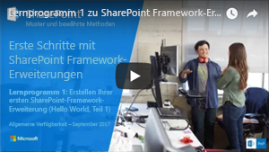

# <a name="build-your-first-sharepoint-framework-extension-hello-world-part-1"></a><span data-ttu-id="cfb32-101">Erstellen Ihrer ersten SharePoint-Framework-Erweiterung (Hello World, Teil 1)</span><span class="sxs-lookup"><span data-stu-id="cfb32-101">Build your first SharePoint Framework Extension (Hello World part 1)</span></span>

<span data-ttu-id="cfb32-p101">SharePoint-Framework (SPFx)-Erweiterungen sind clientseitige Komponenten, die im Kontext einer SharePoint-Seite ausgeführt werden. Sie können Erweiterungen in SharePoint Online bereitstellen und mithilfe aktueller JavaScript-Tools und -Bibliotheken erstellen.</span><span class="sxs-lookup"><span data-stu-id="cfb32-p101">SharePoint Framework (SPFx) Extensions are client-side components that run inside the context of a SharePoint page. You can deploy extensions to SharePoint Online, and you can use modern JavaScript tools and libraries to build them.</span></span>

<span data-ttu-id="cfb32-104">Dieser Artikel beschreibt, wie Sie Ihre erste SharePoint-Framework-Erweiterung „Hello World“ erstellen.</span><span class="sxs-lookup"><span data-stu-id="cfb32-104">This article describes how to create your first Hello World SharePoint Framework Extension.</span></span> <span data-ttu-id="cfb32-105">Sie können die nachfolgend beschriebene Anleitung auch anhand dieses Videos in unserem [YouTube-Kanal „SharePoint Patterns & Practices“](https://www.youtube.com/watch?v=0BeS0HukW24&list=PLR9nK3mnD-OXtWO5AIIr7nCR3sWutACpV) nachvollziehen:</span><span class="sxs-lookup"><span data-stu-id="cfb32-105">You can also follow these steps by watching the video on the [SharePoint PnP YouTube Channel](https://www.youtube.com/watch?v=0BeS0HukW24&list=PLR9nK3mnD-OXtWO5AIIr7nCR3sWutACpV).</span></span> 

<a href="https://www.youtube.com/watch?v=yrFNu6K7iuU">

</a>

## <a name="create-an-extension-project"></a><span data-ttu-id="cfb32-106">Erstellen eines Erweiterungsprojekts</span><span class="sxs-lookup"><span data-stu-id="cfb32-106">Create an extension project</span></span>

1. <span data-ttu-id="cfb32-107">Erstellen Sie an einem Speicherort Ihrer Wahl ein neues Projektverzeichnis:</span><span class="sxs-lookup"><span data-stu-id="cfb32-107">Create a new project directory in your favorite location.</span></span>

    ```
    md app-extension
    ```

2. <span data-ttu-id="cfb32-108">Wechseln Sie in das Projektverzeichnis:</span><span class="sxs-lookup"><span data-stu-id="cfb32-108">Go to the project directory.</span></span>

    ```
    cd app-extension
    ```

3. <span data-ttu-id="cfb32-109">Führen Sie den Yeoman-SharePoint-Generator aus, um eine neue HelloWorld-Erweiterung zu erstellen:</span><span class="sxs-lookup"><span data-stu-id="cfb32-109">Create a new HelloWorld extension by running the Yeoman SharePoint Generator.</span></span>

    ```
    yo @microsoft/sharepoint
    ```

4. <span data-ttu-id="cfb32-110">Es werden verschiedene Eingabeaufforderungen angezeigt. Gehen Sie wie folgt vor:</span><span class="sxs-lookup"><span data-stu-id="cfb32-110">When prompted:</span></span>

    * <span data-ttu-id="cfb32-111">Übernehmen Sie den Standardwert **app-extension** als Lösungsnamen, und drücken Sie die **EINGABETASTE**.</span><span class="sxs-lookup"><span data-stu-id="cfb32-111">Accept the default **app-extension** as your solution name, and press **Enter**.</span></span>
    * <span data-ttu-id="cfb32-112">Wählen Sie **SharePoint Online only (latest)**, und drücken Sie die **EINGABETASTE**.</span><span class="sxs-lookup"><span data-stu-id="cfb32-112">Choose **SharePoint Online only (latest)**, and press **Enter**.</span></span>
    * <span data-ttu-id="cfb32-113">Wählen Sie **Use the current folder** aus, und drücken Sie die **EINGABETASTE**.</span><span class="sxs-lookup"><span data-stu-id="cfb32-113">Choose **Use the current folder**, and press **Enter**.</span></span>
    * <span data-ttu-id="cfb32-114">Wählen Sie **N**, damit die Erweiterung auf jeder Website explizit installiert werden muss, wenn sie verwendet wird.</span><span class="sxs-lookup"><span data-stu-id="cfb32-114">Choose **N** to require the extension to be installed on each site explicitly when it's being used.</span></span> 
    * <span data-ttu-id="cfb32-115">Wählen Sie **Extension** als den zu erstellenden Typ von clientseitiger Komponente aus.</span><span class="sxs-lookup"><span data-stu-id="cfb32-115">Choose **Extension (Preview)** as the client-side component type to be created.</span></span> 
    * <span data-ttu-id="cfb32-116">Wählen Sie **Application Customizer** als den zu erstellenden Erweiterungstyp aus.</span><span class="sxs-lookup"><span data-stu-id="cfb32-116">Choose **Application Customizer (Preview)** as the extension type to be created.</span></span>

5. <span data-ttu-id="cfb32-p103">Über die nächsten Eingabeaufforderungen werden spezifische Informationen zu der Erweiterung abgefragt. Gehen Sie wie folgt vor:</span><span class="sxs-lookup"><span data-stu-id="cfb32-p103">The next set of prompts will ask for specific information about your extension. When prompted:</span></span>

    * <span data-ttu-id="cfb32-119">Übernehmen Sie den Standardwert **HelloWorld** als Namen für Ihre Erweiterung, und drücken Sie die **EINGABETASTE**.</span><span class="sxs-lookup"><span data-stu-id="cfb32-119">Accept the default **HelloWorld** as your extension name, and press **Enter**.</span></span>
    * <span data-ttu-id="cfb32-120">Übernehmen Sie den Standardwert **HelloWorld description** als Beschreibung Ihrer Erweiterung, und drücken Sie die **EINGABETASTE**.</span><span class="sxs-lookup"><span data-stu-id="cfb32-120">Accept the default **HelloWorld description** as your extension description, and press **Enter**.</span></span>

    

    > <span data-ttu-id="cfb32-122">**Hinweis:** Wenn der verwendete Erweiterungsname zu lang ist, können Probleme auftreten.</span><span class="sxs-lookup"><span data-stu-id="cfb32-122">**Note:** If you use a name for the extension that is too long, you might encounter issues.</span></span> <span data-ttu-id="cfb32-123">Mit den bereitgestellten Eingaben wird ein Aliaseintrag für die JSON-Manifestdatei des Application Customizer generiert.</span><span class="sxs-lookup"><span data-stu-id="cfb32-123">The entries provided are used to generate an alias entry for the application customizer manifest json file.</span></span> <span data-ttu-id="cfb32-124">Falls der Alias mehr als 40 Zeichen enthält, wird eine Ausnahme ausgelöst, wenn Sie versuchen, die Erweiterung mit `gulp serve --nobrowser` zu verarbeiten.</span><span class="sxs-lookup"><span data-stu-id="cfb32-124">If the alias is longer than 40 characters, you will get an exception when you try to serve the extension using `gulp serve --nobrowser`.</span></span> <span data-ttu-id="cfb32-125">Sie können dieses Problem beheben, indem Sie den Aliaseintrag später aktualisieren.</span><span class="sxs-lookup"><span data-stu-id="cfb32-125">You can resolve this by updating the alias entry afterward.</span></span>

    <span data-ttu-id="cfb32-p105">An diesem Punkt installiert Yeoman die erforderlichen Abhängigkeiten und erstellt ein Gerüst für die Lösungsdateien sowie die **HelloWorld**-Erweiterung. Das kann einige Minuten dauern.</span><span class="sxs-lookup"><span data-stu-id="cfb32-p105">At this point, Yeoman will install the required dependencies and scaffold the solution files along with the **HelloWorld** extension. This might take a few minutes.</span></span> 

    <span data-ttu-id="cfb32-128">Nach Abschluss der Gerüsterstellung sollte folgende Erfolgsmeldung angezeigt werden:</span><span class="sxs-lookup"><span data-stu-id="cfb32-128">When the scaffold is complete, you should see the following message indicating a successful scaffold:</span></span>

    

    <span data-ttu-id="cfb32-130">Details zur Behebung etwaiger Fehler finden Sie unter [Bekannte Probleme](../../known-issues-and-common-questions.md).</span><span class="sxs-lookup"><span data-stu-id="cfb32-130">For information about troubleshooting any errors, see [Known issues](../../known-issues-and-common-questions.md).</span></span>

6. <span data-ttu-id="cfb32-131">Sobald das Gerüst abgeschlossen ist, sperren Sie die Version der Projektabhängigkeiten, indem Sie den folgenden Befehl ausführen:</span><span class="sxs-lookup"><span data-stu-id="cfb32-131">Once the scaffolding completes, lock down the version of the project dependencies by running the following command:</span></span>

    ```sh
    npm shrinkwrap
    ```

7. <span data-ttu-id="cfb32-132">Geben Sie als Nächstes Folgendes in die Konsole ein, um Visual Studio Code zu starten.</span><span class="sxs-lookup"><span data-stu-id="cfb32-132">Once solution scaffolding is completed, type the following into the console to start Visual Studio Code.</span></span>

    ```
    code .
    ```

    ><span data-ttu-id="cfb32-133">**Hinweis:** Da die clientseitige SharePoint-Lösung auf HTML/TypeScript basiert, können Sie zur Erstellung Ihrer Erweiterung jeden Code-Editor verwenden, der clientseitige Entwicklung unterstützt.</span><span class="sxs-lookup"><span data-stu-id="cfb32-133">**Note:** Because the SharePoint client-side solution is HTML/TypeScript based, you can use any code editor that supports client-side development to build your extension.</span></span>

    <span data-ttu-id="cfb32-p106">Wie Sie sehen, sieht die Standardlösungsstruktur wie die Lösungsstruktur clientseitiger Webparts aus. Hierbei handelt es sich um die grundlegende SharePoint-Framework-Lösungsstruktur, die für alle Lösungstypen vergleichbare Konfigurationsoptionen bereitstellt.</span><span class="sxs-lookup"><span data-stu-id="cfb32-p106">Notice how the default solution structure looks like the solution structure for client-side web parts. This is the basic SharePoint Framework solution structure, with similar configuration options across all solution types.</span></span>

    

8. <span data-ttu-id="cfb32-137">Öffnen Sie **HelloWorldApplicationCustomizer.manifest.json** im Ordner „src\extensions\helloWorld“.</span><span class="sxs-lookup"><span data-stu-id="cfb32-137">Open **HelloWorldApplicationCustomizer.manifest.json** in the src\extensions\helloWorld folder.</span></span>

    <span data-ttu-id="cfb32-p107">In dieser Datei sind der Erweiterungstyp und ein eindeutiger Bezeichner für die Erweiterung definiert. Sie benötigen diese ID später, um die Erweiterung zu debuggen und in SharePoint bereitzustellen.</span><span class="sxs-lookup"><span data-stu-id="cfb32-p107">This file defines your extension type and a unique identifier for your extension. You’ll need this ID later when you debug and deploy your extension to SharePoint.</span></span>

    

## <a name="code-your-application-customizer"></a><span data-ttu-id="cfb32-141">Codieren des Anwendungsanpassers</span><span class="sxs-lookup"><span data-stu-id="cfb32-141">Code your Application Customizer</span></span> 
<span data-ttu-id="cfb32-142">Öffnen Sie die Datei **HelloWorldApplicationCustomizer.ts** im Ordner **src\extensions\helloWorld**.</span><span class="sxs-lookup"><span data-stu-id="cfb32-142">Open the **HelloWorldApplicationCustomizer.ts** file in the **src\extensions\helloWorld** folder.</span></span>

<span data-ttu-id="cfb32-143">Beachten Sie, dass die Basisklasse für den Application Customizer aus dem **sp-application-base**-Paket importiert wird, das den SharePoint-Framework-Code enthält, der für den Application Customizer erforderlich ist.</span><span class="sxs-lookup"><span data-stu-id="cfb32-143">Notice that base class for the Application Customizer is imported from the **sp-application-base** package, which contains SharePoint framework code required by the Application Customizer.</span></span> 


<span data-ttu-id="cfb32-145">Die Logik für den Anwendungsanpasser ist in der **onInit**-Methode enthalten</span><span class="sxs-lookup"><span data-stu-id="cfb32-145">The logic for your Application Customizer is contained in the **onInit** method.</span></span>

- <span data-ttu-id="cfb32-p108">**onInit()** wird aufgerufen, wenn die clientseitige Erweiterung das erste Mal auf der Seite aktiviert wird. Dieses Ereignis tritt auf, nachdem ```this.context``` und ```this.properties``` zugeordnet wurden. Wie bei Webparts gibt ```onInit()``` eine Zusage zurück, die Sie zum Ausführen von asynchronen Vorgängen verwenden können.</span><span class="sxs-lookup"><span data-stu-id="cfb32-p108">**onInit()** is called when the client-side extension is first activated on the page. This event occurs after ```this.context``` and ```this.properties``` are assigned. As with web parts, ```onInit()``` returns a promise that you can use to perform asynchronous operations.</span></span>

><span data-ttu-id="cfb32-p109">**Hinweis:** Der Klassenkonstruktor wird in einer frühen Phase aufgerufen, wenn ```this.context``` und ```this.properties``` noch nicht definiert sind. Benutzerdefinierte Initiierungslogik wird an dieser Stelle nicht unterstützt.</span><span class="sxs-lookup"><span data-stu-id="cfb32-p109">**Note:** The class constructor is called at an early stage, when ```this.context``` and ```this.properties``` are undefined. Custom initiation logic is not supported here.</span></span>

<span data-ttu-id="cfb32-p110">Im Folgenden werden die Inhalte von **onInit()** in der Standardlösung aufgelistet. Die Standardlösung schreibt ein Protokoll in das Dev Dashboard und zeigt dann beim Rendern der Seite eine einfache JavaScript-Warnung an.</span><span class="sxs-lookup"><span data-stu-id="cfb32-p110">The following are the contents of **onInit()** in the default solution. This default solution writes a log to the Dev Dashboard, and then displays a simple JavaScript alert when the page renders.</span></span>


<span data-ttu-id="cfb32-p111">Wenn Ihr Application Customizer die JSON-Eingabe **ClientSideComponentProperties** verwendet, erfolgt die Deserialisierung in das **BaseExtension.properties**-Objekt. Sie können eine Benutzeroberfläche definieren, um dies zu beschreiben. Die Standardvorlage sucht nach einer Eigenschaft mit dem Namen **testMessage**. Wenn diese Eigenschaft bereitgestellt wird, wird sie in einer Warnmeldung ausgegeben.</span><span class="sxs-lookup"><span data-stu-id="cfb32-p111">If your application customizer uses the **ClientSideComponentProperties** JSON input, it will be deserialized into the **BaseExtension.properties** object. You can define an interface to describe it. The default template is looking for a property called **testMessage**. If that property is provided, it outputs it in an alert message.</span></span>

## <a name="debug-your-application-customizer-using-gulp-serve-and-query-string-parameters"></a><span data-ttu-id="cfb32-158">Debuggen Ihres Application Customizer mit „gulp serve“ und Abfragezeichenfolgen-Parametern</span><span class="sxs-lookup"><span data-stu-id="cfb32-158">Debug your Application Customizer using gulp serve and query string parameters</span></span>
<span data-ttu-id="cfb32-159">SharePoint-Framework-Erweiterungen können derzeit nicht mit der lokalen Workbench getestet werden.</span><span class="sxs-lookup"><span data-stu-id="cfb32-159">You cannot current use the local workbench to test SharePoint Framework Extensions.</span></span> <span data-ttu-id="cfb32-160">Sie müssen sie mit einer SharePoint Online-Live-Website testen.</span><span class="sxs-lookup"><span data-stu-id="cfb32-160">You'll need to test them  against a live SharePoint Online site.</span></span> <span data-ttu-id="cfb32-161">Hierzu ist es nicht erforderlich, die Anpassung im App-Katalog bereitzustellen, was das Debugging vereinfacht und beschleunigt.</span><span class="sxs-lookup"><span data-stu-id="cfb32-161">You don't have to deploy your customization to the app catalog to do this, which makes the debugging experience simple and efficient.</span></span> 

<span data-ttu-id="cfb32-162">Zunächst führen Sie den folgenden Befehl aus, um den Code zu kompilieren und die kompilierten Dateien auf Ihrem lokalen Computer zu hosten:</span><span class="sxs-lookup"><span data-stu-id="cfb32-162">First, compile your code and host the compiled files from your local computer by running the following command.</span></span>

```
gulp serve --nobrowser
```

><span data-ttu-id="cfb32-p113">**Hinweis:** Wenn Sie das SPFx-Entwicklerzertifikat noch nicht installiert haben, meldet Workbench, dass das Laden von Skripts von „localhost“ nicht konfiguriert ist. Halten Sie in diesem Fall den aktuell im Konsolenfenster ausgeführten Prozess an, und führen Sie in der Konsole des Projektverzeichnisses den Befehl `gulp trust-dev-cert` aus, um das Entwicklerzertifikat zu installieren; führen Sie dann den Befehl `gulp serve --nobrowser` erneut aus.</span><span class="sxs-lookup"><span data-stu-id="cfb32-p113">**Note:** If you do not have the SPFx developer certificate installed, Workbench will notify you that it is not configured to load scripts from localhost. If this happens, stop the process that is currently running in the console window, run the `gulp trust-dev-cert` command in your project directory console to install the developer certificate, and then run the `gulp serve --nobrowser` command again.</span></span>

<span data-ttu-id="cfb32-165">Sie verwenden die Option ```--nobrowser```, da ein Start der lokalen Workbench nicht nötig ist, weil Erweiterungen nicht lokal gedebuggt werden können.</span><span class="sxs-lookup"><span data-stu-id="cfb32-165">You use the ```--nobrowser``` option because you don't need to launch the local workbench, since you can't debug extensions locally.</span></span>

<span data-ttu-id="cfb32-166">Wenn der Code ohne Fehler kompiliert wurde, verarbeitet er das resultierende Manifest von https://localhost:4321.</span><span class="sxs-lookup"><span data-stu-id="cfb32-166">When the code compiles without errors, it will serve the resulting manifest from http://localhost:4321.</span></span>


<span data-ttu-id="cfb32-168">Zum Testen der Erweiterung wechseln Sie zu einer Seite mit der modernen Listenansicht in Ihrer SharePoint-Umgebung, und fügen Sie die folgenden Abfragezeichenfolgen-Parameter an die URL an:</span><span class="sxs-lookup"><span data-stu-id="cfb32-168">To test your extension, go to a modern list view page in your SharePoint environment and append the following query string parameters to the URL.</span></span> <span data-ttu-id="cfb32-169">Beachten Sie, dass Sie die ID entsprechend Ihrem eigenen Erweiterungsbezeichner aktualisieren müssen.</span><span class="sxs-lookup"><span data-stu-id="cfb32-169">Notice that you will need to update the ID to match your own extension identifier.</span></span> <span data-ttu-id="cfb32-170">Dieser ist in der Datei **HelloWorldApplicationCustomizer.manifest.json** verfügbar.</span><span class="sxs-lookup"><span data-stu-id="cfb32-170">This is available in the **HelloWorldApplicationCustomizer.manifest.json** file.</span></span>

```
?loadSPFX=true&debugManifestsFile=https://localhost:4321/temp/manifests.js&customActions={"e5625e23-5c5a-4007-a335-e6c2c3afa485":{"location":"ClientSideExtension.ApplicationCustomizer","properties":{"testMessage":"Hello as property!"}}}
```

<span data-ttu-id="cfb32-171">Weitere Details zu den URL-Abfrageparametern:</span><span class="sxs-lookup"><span data-stu-id="cfb32-171">More detail about the URL query parameters:</span></span>

* <span data-ttu-id="cfb32-p115">**loadSPFX=true** – Dieser Parameter stellt sicher, dass das SharePoint-Framework auf der Seite geladen wird. Aus Leistungsgründen wird das Framework erst geladen, wenn mindestens eine Erweiterung registriert ist. Da keine Komponenten registriert sind, müssen Sie das Framework explizit laden.</span><span class="sxs-lookup"><span data-stu-id="cfb32-p115">**loadSPFX=true** - Ensures that the SharePoint Framework is loaded on the page. For performance reasons, the framework does not load unless at least one extension is registered. Because no components are registered,you must explicitly load the framework.</span></span>

* <span data-ttu-id="cfb32-p116">**debugManifestsFile** – Dieser Parameter gibt an, dass lokal verarbeitete SPFx-Komponenten geladen werden sollen. Das Ladeprogramm sucht nur an zwei Stellen nach Komponenten: im App-Katalog (nach Komponenten der bereitgestellten Lösung) und auf dem SharePoint-Manifestserver (nach den Systembibliotheken).</span><span class="sxs-lookup"><span data-stu-id="cfb32-p116">**debugManifestsFile** - Specifies that you want to load SPFx components that are locally served. The loader only looks for components in the App Catalog (for your deployed solution) and the SharePoint manifest server (for the system libraries).</span></span>

* <span data-ttu-id="cfb32-p117">**customActions:** – Simuliert eine benutzerdefinierte Aktion. Wenn Sie diese Komponente auf einer Website bereitstellen und registrieren, erstellen Sie dieses **CustomAction**-Objekt und beschreiben die verschiedenen Eigenschaften, die Sie dafür festlegen können.</span><span class="sxs-lookup"><span data-stu-id="cfb32-p117">**customActions** - Simulates a custom action. When you deploy and register this component in a site, you'll create this **CustomAction** object and describe all the different properties you can set on it.</span></span> 
    * <span data-ttu-id="cfb32-179">**Key** – Verwenden Sie die GUID der Erweiterung als Schlüssel, der der benutzerdefinierten Aktion zuzuordnen ist.</span><span class="sxs-lookup"><span data-stu-id="cfb32-179">**Key** - Use the Guid of the extension as the key to associate with the custom action.</span></span> <span data-ttu-id="cfb32-180">Dieser muss dem ID-Wert der Erweiterung entsprechen, der in der JSON-Manifestdatei der Erweiterung zur Verfügung steht.</span><span class="sxs-lookup"><span data-stu-id="cfb32-180">This has to match the ID value of your extension, which is available in the extension manifest.json file.</span></span>
    * <span data-ttu-id="cfb32-p119">**Location** – Der Typ der benutzerdefinierten Aktion. Verwenden Sie „ClientSideExtension.ApplicationCustomizer“ für die Application Customizer-Erweiterung.</span><span class="sxs-lookup"><span data-stu-id="cfb32-p119">**Location** - The type of custom action. Use "ClientSideExtension.ApplicationCustomizer" for the Application Customizer extension.</span></span>
    * <span data-ttu-id="cfb32-p120">**Properties** – Ein optionales JSON-Objekt mit Eigenschaften, die über das Mitglied **this.properties** zur Verfügung stehen. In diesem „HelloWorld“-Beispiel definiert es eine Eigenschaft „testMessage“.</span><span class="sxs-lookup"><span data-stu-id="cfb32-p120">**Properties** - An optional JSON object that contains properties that will be available via the **this.properties** member. In this HelloWorld example, it defined a ‘testMessage’ property.</span></span>


<span data-ttu-id="cfb32-p121">Wechseln Sie zu einer modernen Liste in SharePoint Online. Dies kann eine Liste oder eine Bibliothek sein. Application Customizers werden ebenfalls auf modernen Seiten und auf der Seite „Websiteinhalte“ unterstützt.</span><span class="sxs-lookup"><span data-stu-id="cfb32-p121">Go to a modern list in SharePoint Online. This can be either a list or a library. Application customizers are also supported in modern pages and on the Site Contents page.</span></span> 

<span data-ttu-id="cfb32-p122">Erweitern Sie die URL mit den beschriebenen zusätzlichen Abfrageparametern. Beachten Sie, dass Sie die GUID entsprechend der ID des benutzerdefinierten Application Customizer aktualisieren müssen.</span><span class="sxs-lookup"><span data-stu-id="cfb32-p122">Extend the URL with the additional query parameters described. Notice that you'll need to update the GUID to match the ID of your custom Application Customizer.</span></span> 

<span data-ttu-id="cfb32-190">Die vollständige URL sollte ähnlich wie im folgenden Beispiel aussehen:</span><span class="sxs-lookup"><span data-stu-id="cfb32-190">The full URL should look similar to the following:</span></span>

```
contoso.sharepoint.com/Lists/Contoso/AllItems.aspx?loadSPFX=true&debugManifestsFile=https://localhost:4321/temp/manifests.js&customActions={"e5625e23-5c5a-4007-a335-e6c2c3afa485":{"location":"ClientSideExtension.ApplicationCustomizer","properties":{"testMessage":"Hello as property!"}}}
```

<span data-ttu-id="cfb32-191">Wählen Sie **Load debug scripts**, um weiter Skripts von Ihrem lokalen Host zu laden.</span><span class="sxs-lookup"><span data-stu-id="cfb32-191">Choose **Load debug scripts** to continue loading scripts from your local host.</span></span>


<span data-ttu-id="cfb32-193">Das Dialogmeldung sollte nun auf Ihrer Seite angezeigt werden.</span><span class="sxs-lookup"><span data-stu-id="cfb32-193">You should now see the alert message on your page.</span></span>


<span data-ttu-id="cfb32-195">Dieses Dialogfeld wird von der SharePoint-Framework-Erweiterung ausgelöst.</span><span class="sxs-lookup"><span data-stu-id="cfb32-195">This alert is thrown by your SharePoint Framework Extension.</span></span> <span data-ttu-id="cfb32-196">Da Sie die **testMessage**-Eigenschaft als Teil der Debug-Abfrageparameter bereitgestellt haben, ist diese in der Warnmeldung enthalten.</span><span class="sxs-lookup"><span data-stu-id="cfb32-196">Note that because you provided the **testMessage** property as part of the debug query parameters, it's included in the alert message.</span></span> <span data-ttu-id="cfb32-197">Sie können Ihre Erweiterungsinstanzen basierend auf den Clientkomponenteneigenschaften konfigurieren, die für die Instanz auch im Laufzeitmodus übergeben werden.</span><span class="sxs-lookup"><span data-stu-id="cfb32-197">You can configure your extension instances based on the client component properties, which are passed for the instance also in runtime mode.</span></span>

> <span data-ttu-id="cfb32-p124">**Hinweis:** Wenn Sie Probleme beim Debuggen haben, überprüfen Sie die URL-Abfrageparameter für die Abfrage. Einige Browser codieren die Parameter, und in einigen Fällen wirkt sich dies auf das Verhalten aus.</span><span class="sxs-lookup"><span data-stu-id="cfb32-p124">**Note:** If you have issues with debugging, double-check the URL query parameters used for the query. Some browsers encode the parameters and in some scenarios this affects the behavior.</span></span>

## <a name="next-steps"></a><span data-ttu-id="cfb32-200">Nächste Schritte</span><span class="sxs-lookup"><span data-stu-id="cfb32-200">Next steps</span></span>
<span data-ttu-id="cfb32-p125">Herzlichen Glückwunsch! Ihre erste SharePoint-Framework-Erweiterung läuft. Informationen zum weiteren Ausbau der Erweiterung erfahren Sie unter [Verwenden von Seitenplatzhaltern aus dem Application Customizer (Hello World, Teil 2)](./using-page-placeholder-with-extensions.md). Dort verwenden Sie dasselbe Projekt und nutzen spezifische Inhaltsplatzhalter zum Ändern der Benutzeroberfläche von SharePoint. Beachten Sie, dass der Befehl ```gulp serve``` immer noch im Konsolenfenster ausgeführt wird (oder in Visual Studio Code, falls Sie den Editor verwenden). Sie können ihn einfach weiterlaufen lassen und zum nächsten Artikel wechseln.</span><span class="sxs-lookup"><span data-stu-id="cfb32-p125">Congratulations, you've gotten your first SharePoint Framework Extension running! To continue building out your extension, see [Using page placeholders from Application Customizer (Hello World part 2)](./using-page-placeholder-with-extensions.md). You will use the same project and take advantage of specific content placeholders for modifying the UI of SharePoint. Notice that the ```gulp serve``` command is still running in your console window (or in Visual Studio Code if you are using the editor). You can continue to let it run while you go to the next article.</span></span>
