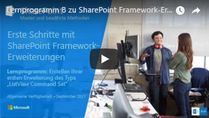
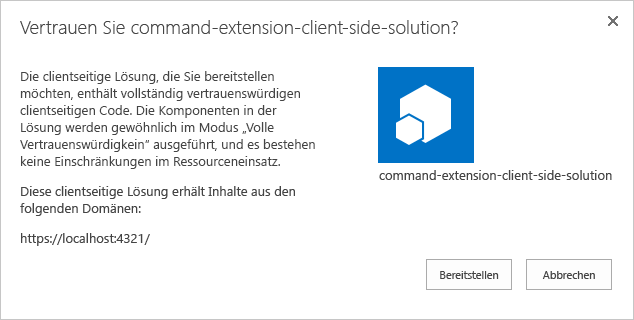
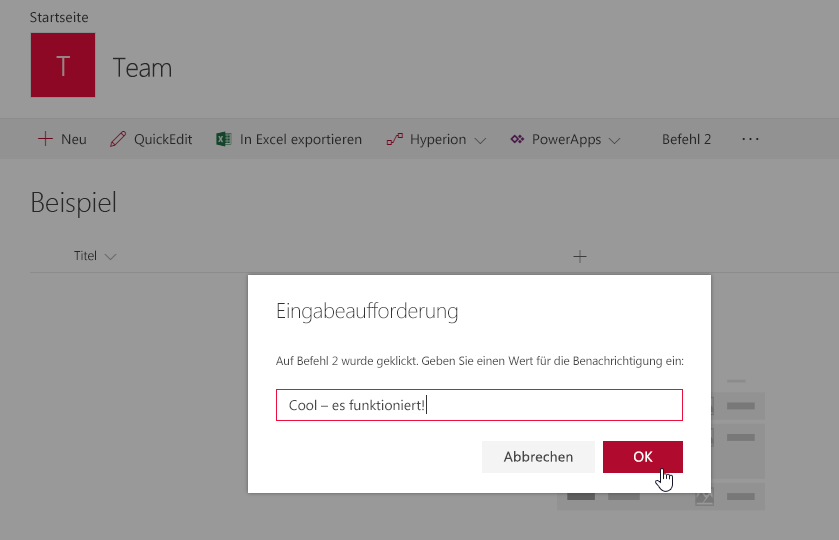

# <a name="build-your-first-listview-command-set-extension"></a><span data-ttu-id="07226-101">Erstellen Ihrer ersten Erweiterung des Typs „ListView Command Set“</span><span class="sxs-lookup"><span data-stu-id="07226-101">Build your first ListView Command Set extension</span></span>

<span data-ttu-id="07226-102">Erweiterungen sind clientseitige Komponenten, die im Kontext einer SharePoint-Website ausgeführt werden.</span><span class="sxs-lookup"><span data-stu-id="07226-102">SharePoint Framework (SPFx) Extensions are client-side components that run inside the context of a SharePoint page.</span></span> <span data-ttu-id="07226-103">Erweiterungen lassen sich auf SharePoint Online bereitstellen und auch mithilfe aktueller JavaScript-Tools und -Bibliotheken erstellen.</span><span class="sxs-lookup"><span data-stu-id="07226-103">Extensions are client-side components that run inside the context of a SharePoint page. Extensions can be deployed to SharePoint Online and you can use modern JavaScript tools and libraries to build them.</span></span>

<span data-ttu-id="07226-104">In diesem Artikel wird beschrieben, wie Sie Ihre erste Erweiterung vom Typ „ListView Command Set“ erstellen.</span><span class="sxs-lookup"><span data-stu-id="07226-104">This article describes how to create your first ListView Command Set Extension.</span></span> <span data-ttu-id="07226-105">Sie können die nachfolgend beschriebene Anleitung auch anhand dieses Videos in unserem [YouTube-Kanal „SharePoint Patterns & Practices“](https://www.youtube.com/watch?v=iW0LQQqAY0Y&list=PLR9nK3mnD-OXtWO5AIIr7nCR3sWutACpV) nachvollziehen:</span><span class="sxs-lookup"><span data-stu-id="07226-105">You can also follow these steps by watching the video on the [SharePoint PnP YouTube Channel](https://www.youtube.com/watch?v=iW0LQQqAY0Y&list=PLR9nK3mnD-OXtWO5AIIr7nCR3sWutACpV).</span></span> 

<a href="https://www.youtube.com/watch?v=JBhgdSgWgdM">

</a>

## <a name="create-an-extension-project"></a><span data-ttu-id="07226-106">Erstellen eines Erweiterungsprojekts</span><span class="sxs-lookup"><span data-stu-id="07226-106">Create an extension project</span></span>

1. <span data-ttu-id="07226-107">Erstellen Sie an einem Speicherort Ihrer Wahl ein neues Projektverzeichnis:</span><span class="sxs-lookup"><span data-stu-id="07226-107">Create a new project directory in your favorite location.</span></span>
    
    ```
    md command-extension
    ```
    
2. <span data-ttu-id="07226-108">Wechseln Sie in das Projektverzeichnis:</span><span class="sxs-lookup"><span data-stu-id="07226-108">Go to the project directory.</span></span>
    
    ```
    cd command-extension
    ```
    
3. <span data-ttu-id="07226-109">Führen Sie den Yeoman-SharePoint-Generator aus, um eine neue HelloWorld-Erweiterung zu erstellen:</span><span class="sxs-lookup"><span data-stu-id="07226-109">Create a new HelloWorld extension by running the Yeoman SharePoint Generator.</span></span>
    
    ```
    yo @microsoft/sharepoint
    ```
    
4. <span data-ttu-id="07226-110">Es werden verschiedene Eingabeaufforderungen angezeigt. Gehen Sie wie folgt vor:</span><span class="sxs-lookup"><span data-stu-id="07226-110">When prompted:</span></span>

    * <span data-ttu-id="07226-111">Übernehmen Sie den Standardwert **command-extension** als Namen der Lösung, und drücken Sie die EINGABETASTE.</span><span class="sxs-lookup"><span data-stu-id="07226-111">Accept the default value of command-extension as your solution name and press Enter.</span></span>
    * <span data-ttu-id="07226-112">Wählen Sie **SharePoint Online only (latest)**, und drücken Sie die EINGABETASTE.</span><span class="sxs-lookup"><span data-stu-id="07226-112">Select **SharePoint Online only (latest)**, and select Enter.</span></span>
    * <span data-ttu-id="07226-113">Wählen Sie **Use the current folder** aus, und drücken Sie die EINGABETASTE.</span><span class="sxs-lookup"><span data-stu-id="07226-113">Choose Use the current folder and press Enter</span></span>
    * <span data-ttu-id="07226-114">Wählen Sie **N**, damit die Erweiterung auf jeder Website explizit installiert werden muss, wenn sie verwendet wird.</span><span class="sxs-lookup"><span data-stu-id="07226-114">Choose **N** to require the extension to be installed on each site explicitly when it's being used.</span></span> 
    * <span data-ttu-id="07226-115">Wählen Sie **Extension** als den zu erstellenden Typ von clientseitiger Komponente aus.</span><span class="sxs-lookup"><span data-stu-id="07226-115">Choose **Extension (Preview)** as the client-side component type to be created.</span></span> 
    * <span data-ttu-id="07226-116">Wählen Sie **ListView Command Set** als den zu erstellenden Typ von Erweiterung aus.</span><span class="sxs-lookup"><span data-stu-id="07226-116">Choose **ListView Command Set (Preview)** as the extension type to be created.</span></span>

5. <span data-ttu-id="07226-117">Über die nächsten Eingabeaufforderungen werden spezifische Informationen zu der Erweiterung abgefragt:</span><span class="sxs-lookup"><span data-stu-id="07226-117">The next set of prompts will ask for specific information about your extension.</span></span>

    * <span data-ttu-id="07226-118">Übernehmen Sie den Standardwert **HelloWorld** als Namen für Ihre Erweiterung, und drücken Sie die EINGABETASTE.</span><span class="sxs-lookup"><span data-stu-id="07226-118">Accept the default value of HelloWorld as your extension name and press Enter.</span></span>
    * <span data-ttu-id="07226-119">Übernehmen Sie den Standardwert **HelloWorld description** als Beschreibung Ihrer Erweiterung, und drücken Sie die EINGABETASTE.</span><span class="sxs-lookup"><span data-stu-id="07226-119">Accept the default value of HelloWorld description as your extension description and press Enter.</span></span>

    

    <span data-ttu-id="07226-121">An diesem Punkt installiert Yeoman die erforderlichen Abhängigkeiten und erstellt ein Gerüst für die Lösungsdateien sowie die **HelloWorld**-Erweiterung.</span><span class="sxs-lookup"><span data-stu-id="07226-121">At this point, Yeoman will install the required dependencies and scaffold the solution files along with the **HelloWorld** extension. This might take a few minutes.</span></span> <span data-ttu-id="07226-122">Das kann einige Minuten dauern.</span><span class="sxs-lookup"><span data-stu-id="07226-122">This might take a few minutes.</span></span>

    <span data-ttu-id="07226-123">Nach Abschluss der Gerüsterstellung sollte folgende Erfolgsmeldung angezeigt werden:</span><span class="sxs-lookup"><span data-stu-id="07226-123">When the scaffold is complete, you should see the following message indicating a successful scaffold:</span></span>

    

    <span data-ttu-id="07226-125">Details zur Behebung etwaiger Fehler finden Sie unter [Bekannte Probleme](../../known-issues-and-common-questions.md).</span><span class="sxs-lookup"><span data-stu-id="07226-125">For information about troubleshooting any errors, see [Known issues](../../known-issues-and-common-questions.md).</span></span>

6. <span data-ttu-id="07226-126">Sobald das Gerüst abgeschlossen ist, sperren Sie die Version der Projektabhängigkeiten, indem Sie den folgenden Befehl ausführen:</span><span class="sxs-lookup"><span data-stu-id="07226-126">Once the scaffolding completes, lock down the version of the project dependencies by running the following command:</span></span>

    ```sh
    npm shrinkwrap
    ```

7. <span data-ttu-id="07226-127">Geben Sie als Nächstes Folgendes in die Konsole ein, um Visual Studio Code zu starten.</span><span class="sxs-lookup"><span data-stu-id="07226-127">Once solution scaffolding is completed, type the following into the console to start Visual Studio Code.</span></span>

    ```
    code .
    ```

    > [!NOTE] 
    > <span data-ttu-id="07226-128">Da die clientseitige SharePoint-Lösung auf HTML/TypeScript basiert, können Sie zur Erstellung Ihrer Erweiterung jeden Code-Editor verwenden, der clientseitige Entwicklung unterstützt.</span><span class="sxs-lookup"><span data-stu-id="07226-128">Note: Because the SharePoint client-side solution is HTML/TypeScript based, you can use any code editor that supports client-side development to build your extension.</span></span>

    <span data-ttu-id="07226-129">Beachten Sie, dass die Standardlösungsstruktur wie die Lösungsstruktur für clientseitige Webparts aussieht.</span><span class="sxs-lookup"><span data-stu-id="07226-129">Notice how the default solution structure looks like the solution structure for client-side web parts.</span></span> <span data-ttu-id="07226-130">Dies ist die grundlegende SharePoint-Framework-Lösungsstruktur mit ähnlichen Konfigurationsoptionen über alle Lösungstypen hinweg.</span><span class="sxs-lookup"><span data-stu-id="07226-130">This is the basic SharePoint Framework solution structure, with similar configuration options across all solution types.</span></span>

    

8. <span data-ttu-id="07226-132">Öffnen Sie die Datei **HelloWorldCommandSet.manifest.json** im Ordner **src\extensions\helloWorld**.</span><span class="sxs-lookup"><span data-stu-id="07226-132">Open **HelloWorldCommandSet.manifest.json** in the **src\extensions\helloWorld** folder.</span></span>

    <span data-ttu-id="07226-133">Diese Datei definiert den Erweiterungstyp und eine eindeutige `id` für die Erweiterung.</span><span class="sxs-lookup"><span data-stu-id="07226-133">This file defines your extension type and a unique identifier for your extension.</span></span> <span data-ttu-id="07226-134">Sie benötigen diese eindeutige ID später beim Debuggen und Bereitstellen der Erweiterung in SharePoint.</span><span class="sxs-lookup"><span data-stu-id="07226-134">This file defines your extension type and a unique identifier “id” for your extension. You’ll need this unique identifier later when debugging and deploying your extension to SharePoint.</span></span>

    <span data-ttu-id="07226-135">Beachten Sie die aktuellen Befehlsdefinitionen in der Manifestdatei.</span><span class="sxs-lookup"><span data-stu-id="07226-135">Note the actual command definitions in the manifest file.</span></span> <span data-ttu-id="07226-136">Es handelt sich hierbei um Schaltflächen, die auf Grundlage des Registrierungsziels verfügbar gemacht werden.</span><span class="sxs-lookup"><span data-stu-id="07226-136">These are the actual buttons that are exposed based on the registration target.</span></span> <span data-ttu-id="07226-137">In der Standardvorlage finden Sie zwei verschiedene Schaltflächen: **Command One** und **Command Two**.</span><span class="sxs-lookup"><span data-stu-id="07226-137">In the default template, you'll find two different buttons: **Command One** and **Command Two**.</span></span>

    

    <span data-ttu-id="07226-p107">Derzeit lassen sich Bilder nur von absoluten Speicherorten in einem CDN korrekt im Manifest referenzieren. Dies wird in zukünftigen Versionen verbessert werden.</span><span class="sxs-lookup"><span data-stu-id="07226-p107">Currently, images are not properly referenced unless you are referring to them from absolute locations in a CDN within your manifest. This will be improved in future releases.</span></span>

## <a name="code-your-listview-command-set"></a><span data-ttu-id="07226-141">Programmieren Ihrer Erweiterung des Typs „ListView Command Set“</span><span class="sxs-lookup"><span data-stu-id="07226-141">Coding your ListView Command Set</span></span> 

<span data-ttu-id="07226-142">Öffnen Sie die Datei **HelloWorldCommandSet.ts** im Ordner **src\extensions\helloWorld**.</span><span class="sxs-lookup"><span data-stu-id="07226-142">Open the **HelloWorldCommandSet.ts** file in the **src\extensions\helloWorld** folder.</span></span>

<span data-ttu-id="07226-143">Wie Sie sehen, wird die Basisklasse Ihrer Erweiterung des Typs „ListView Command Set“ aus dem Paket **sp-listview-extensibility** importiert. Es enthält SharePoint-Framework-Code, der von „ListView Command Set“ benötigt wird.</span><span class="sxs-lookup"><span data-stu-id="07226-143">Notice that the base class for the ListView Command Set is imported from the **sp-listview-extensibility** package, which contains SharePoint framework code required by the ListView Command Set.</span></span>

```ts
import { override } from '@microsoft/decorators';
import { Log } from '@microsoft/sp-core-library';
import {
  BaseListViewCommandSet,
  Command,
  IListViewCommandSetListViewUpdatedParameters,
  IListViewCommandSetExecuteEventParameters
} from '@microsoft/sp-listview-extensibility';
import { Dialog } from '@microsoft/sp-dialog';
```

<span data-ttu-id="07226-144">Das Verhalten Ihrer benutzerdefinierten Schaltflächen wird in den Methoden **onListViewUpdated()** und **OnExecute()** definiert.</span><span class="sxs-lookup"><span data-stu-id="07226-144">The behavior for your custom buttons is contained in the **onListViewUpdated()** and **OnExecute()** methods.</span></span>

<span data-ttu-id="07226-145">Das **onListViewUpdated()**-Ereignis tritt für jeden Befehl separat auf (z. B. ein Menüelement), wenn eine Änderung an ListView vorgenommen wurde und die Benutzeroberfläche erneut gerendert werden muss.</span><span class="sxs-lookup"><span data-stu-id="07226-145">The **onListViewUpdated()** event occurs separately for each command (for example, a menu item) whenever a change happens in the ListView, and the UI needs to be re-rendered.</span></span> <span data-ttu-id="07226-146">Der `event`-Funktionsparameter gibt Informationen über den angezeigten Befehl an.</span><span class="sxs-lookup"><span data-stu-id="07226-146">The `event` function parameter represents information about the command being rendered.</span></span> <span data-ttu-id="07226-147">Der Handler kann mithilfe dieser Informationen den Titel oder die Sichtbarkeit anpassen, beispielsweise wenn ein Befehl nur angezeigt werden soll, wenn eine bestimmte Anzahl von Elementen in der Listenansicht ausgewählt ist.</span><span class="sxs-lookup"><span data-stu-id="07226-147">The onRefreshCommand() event occurs separately for each command (e.g. menu item), whenever the application attempts to display it in the UI. The  function parameter represents information about the command being rendered. The handler can use this information to customize the title or adjust the visibility. For example, if a command should only be shown when a certain number of items are selected in the list view. Here's the default implementation:</span></span> <span data-ttu-id="07226-148">Dies ist die Standardimplementierung.</span><span class="sxs-lookup"><span data-stu-id="07226-148">String. This is the default.</span></span>

<span data-ttu-id="07226-149">Wenn Sie die `tryGetCommand`-Methode verwenden, erhalten Sie ein Command-Objekt, das den auf der Benutzeroberfläche angezeigten Befehl angibt.</span><span class="sxs-lookup"><span data-stu-id="07226-149">When using the method `tryGetCommand`, you’ll get a Command object, which is a representation of the command that shows in the UI.</span></span> <span data-ttu-id="07226-150">Sie können die zugehörigen Werte wie `title`, oder `visible` ändern, um das Benutzeroberflächenelement zu ändern.</span><span class="sxs-lookup"><span data-stu-id="07226-150">You can modify its values, such as `title`, or `visible`, to modify the UI element.</span></span> <span data-ttu-id="07226-151">SPFx verwendet diese Informationen, wenn die Befehle neu gerendert werden müssen.</span><span class="sxs-lookup"><span data-stu-id="07226-151">SPFx uses this information when re-rendering the commands.</span></span> <span data-ttu-id="07226-152">Diese Objekte speichern den Status des letzten Renderings. Wenn ein Befehl zum Beispiel auf `visible = false` festgelegt wurde, wird er erst eingeblendet, wenn er wieder auf `visible = true` festgelegt wurde.</span><span class="sxs-lookup"><span data-stu-id="07226-152">These objects keep the state from the last render, so if a command is set to `visible = false`, it will remain invisible until it is set back to `visible = true`.</span></span>

```ts
  @override
  public onListViewUpdated(event: IListViewCommandSetListViewUpdatedParameters): void {
    const compareOneCommand: Command = this.tryGetCommand('COMMAND_1');
    if (compareOneCommand) {
      // This command should be hidden unless exactly one row is selected.
      compareOneCommand.visible = event.selectedRows.length === 1;
    }
  }
```

<span data-ttu-id="07226-153">Die **OnExecute()**-Methode definiert die Aktion beim Ausführen eines Befehls (wenn z. B. das Menüelement ausgewählt ist).</span><span class="sxs-lookup"><span data-stu-id="07226-153">The **OnExecute()** method defines what happens when a command is executed (for example, the menu item is selected).</span></span> <span data-ttu-id="07226-154">In der Standardimplementierung werden je nach ausgewählter Schaltfläche unterschiedliche Meldungen angezeigt.</span><span class="sxs-lookup"><span data-stu-id="07226-154">In the default implementation, different messages are shown based on which button was selected.</span></span> 


```ts
  @override
  public onExecute(event: IListViewCommandSetExecuteEventParameters): void {
    switch (event.itemId) {
      case 'COMMAND_1':
        Dialog.alert(`${this.properties.sampleTextOne}`);
        break;
      case 'COMMAND_2':
        Dialog.alert(`${this.properties.sampleTextTwo}`);
        break;
      default:
        throw new Error('Unknown command');
    }
  }
```


## <a name="debug-your-listview-command-set-using-gulp-serve-and-query-string-parameters"></a><span data-ttu-id="07226-155">Debuggen Ihrer Erweiterung des Typs „ListView Command Set“ mit gulp serve und Abfragezeichenfolgeparametern</span><span class="sxs-lookup"><span data-stu-id="07226-155">Debugging your ListView Command Set using gulp serve and query string parameters</span></span>

<span data-ttu-id="07226-156">SharePoint-Framework-Erweiterungen können derzeit nicht mit der lokalen Workbench getestet werden.</span><span class="sxs-lookup"><span data-stu-id="07226-156">You cannot current use the local workbench to test SharePoint Framework Extensions.</span></span> <span data-ttu-id="07226-157">Sie müssen sie direkt mit einer SharePoint Online-Live-Website testen und bereitstellen.</span><span class="sxs-lookup"><span data-stu-id="07226-157">You'll need to test them  against a live SharePoint Online site.</span></span> <span data-ttu-id="07226-158">Hierzu ist es nicht erforderlich, die Anpassung im App-Katalog bereitzustellen, was das Debugging vereinfacht und beschleunigt.</span><span class="sxs-lookup"><span data-stu-id="07226-158">You don't have to deploy your customization to the app catalog to do this, which makes the debugging experience simple and efficient.</span></span> 

1. <span data-ttu-id="07226-159">Zunächst führen Sie den folgenden Befehl aus, um den Code zu kompilieren und die Dateien auf Ihrem lokalen Computer zu hosten:</span><span class="sxs-lookup"><span data-stu-id="07226-159">First, compile your code and host the compiled files from the local machine by running this command:</span></span>

    ```
    gulp serve --nobrowser
    ```

    <span data-ttu-id="07226-160">Sie verwenden die Option `--nobrowser`, da ein Start der lokalen Workbench nicht nötig ist, weil Erweiterungen nicht lokal gedebuggt werden können.</span><span class="sxs-lookup"><span data-stu-id="07226-160">You use the `--nobrowser` option because you don't need to launch the local workbench, since you can't debug extensions locally.</span></span>

    <span data-ttu-id="07226-161">Wenn der Code ohne Fehler kompiliert wurde, verarbeitet er das resultierende Manifest von https://localhost:4321.</span><span class="sxs-lookup"><span data-stu-id="07226-161">When the code compiles without errors, it will serve the resulting manifest from http://localhost:4321.</span></span>

2. <span data-ttu-id="07226-162">Navigieren Sie auf Ihrer SharePoint Online-Website zu einer beliebigen SharePoint-Liste, indem Sie die moderne Oberfläche verwenden.</span><span class="sxs-lookup"><span data-stu-id="07226-162">Navigate to any SharePoint list in your SharePoint Online site using the modern experience.</span></span>
    
    <span data-ttu-id="07226-163">Da unsere Erweiterung des Typs „ListView Command Set“ auf Localhost gehostet wird und aktuell ausgeführt wird, können wir den Code mithilfe spezifischer Debugabfrageparameter in der Listenansicht ausführen.</span><span class="sxs-lookup"><span data-stu-id="07226-163">Since our ListView Command Set is hosted from localhost and is running, we can use specific debug query parameters to execute the code in the list view.</span></span>
    
3. <span data-ttu-id="07226-164">Hängen Sie die folgenden Abfragezeichenfolgenparameter an die URL an.</span><span class="sxs-lookup"><span data-stu-id="07226-164">Choose the CustomActionTarget page. Append the following query string parameters to the URL:</span></span> <span data-ttu-id="07226-165">Dabei müssen Sie die GUID durch die ID Ihrer Erweiterung des Typs „ListView Command Set“ aus der Datei **HelloWorldCommandSet.manifest.json** ersetzen.</span><span class="sxs-lookup"><span data-stu-id="07226-165">Append the following query string parameters to the URL. Notice that you will need to update the GUID to match the ID of your list view command set extension available in the **HelloWorldCommandSet.manifest.json** file:</span></span> <span data-ttu-id="07226-166">Weitere Informationen finden Sie unter [Weitere Details zu den URL-Abfrageparametern](#more-details-about-the-url-query-parameters).</span><span class="sxs-lookup"><span data-stu-id="07226-166">For more information, see [More details about the URL query parameters](#more-details-about-the-url-query-parameters).</span></span>
    
    ```
    ?loadSpfx=true&debugManifestsFile=https://localhost:4321/temp/manifests.js&customActions={"a8047e2f-30d5-40fc-b880-b2890c7c16d6":{"location":"ClientSideExtension.ListViewCommandSet.CommandBar","properties":{"sampleTextOne":"One item is selected in the list.","sampleTextTwo":"This command is always visible."}}}
    ```

    <span data-ttu-id="07226-167">Die vollständige URL sollte in etwa wie folgt aussehen, abhängig von der URL Ihres Mandanten und der Position der Liste.</span><span class="sxs-lookup"><span data-stu-id="07226-167">The full URL should look similar to the following, depending on your tenant URL and the location of the list.</span></span>

    ```
    contoso.sharepoint.com/Lists/Orders/AllItems.aspx?loadSpfx=true&debugManifestsFile=https://localhost:4321/temp/manifests.js&customActions={"a8047e2f-30d5-40fc-b880-b2890c7c16d6":{"location":"ClientSideExtension.ListViewCommandSet.CommandBar","properties":{"sampleTextOne":"One item is selected in the list.","sampleTextTwo":"This command is always visible."}}}
    ```

4. <span data-ttu-id="07226-168">Klicken Sie bei Aufforderung auf **Debugskripts laden**, um das Laden der Debugmanifeste zu akzeptieren.</span><span class="sxs-lookup"><span data-stu-id="07226-168">Accept the loading of Debug Manifests, by clicking **Load debug scripts** when prompted.</span></span>
    
    
    
5. <span data-ttu-id="07226-170">Beachten Sie die neue Schaltfläche **Command Two**, die auf der Symbolleiste zur Verfügung steht.</span><span class="sxs-lookup"><span data-stu-id="07226-170">Notice the new **Command Two** button available in the toolbar.</span></span> <span data-ttu-id="07226-171">Wählen Sie diese Schaltfläche, um den als Eigenschaft für die `sampleTextTwo`-Eigenschaft bereitgestellten Text anzuzeigen.</span><span class="sxs-lookup"><span data-stu-id="07226-171">Select that button to see the text provided as property for the `sampleTextTwo` property.</span></span>

    

6. <span data-ttu-id="07226-173">Die Schaltfläche **Command One** wird basierend auf dem Code erst dann angezeigt, wenn eine Ziele in der Dokumentbibliothek ausgewählt ist.</span><span class="sxs-lookup"><span data-stu-id="07226-173">The **Command One** button is not visible based on the code, until one row is selected in the document library.</span></span> <span data-ttu-id="07226-174">Erstellen Sie ein Dokument oder laden Sie es in die Bibliothek hoch, und stellen Sie sicher, dass die zweite Schaltfläche angezeigt wird.</span><span class="sxs-lookup"><span data-stu-id="07226-174">Upload or create a document to the library and confirm that the second button is visible.</span></span>

    

7. <span data-ttu-id="07226-176">Wählen Sie **Command Two** aus, um zu sehen, wie die Dialogfeldsteuerung funktioniert, die in der Standardausgabe aus dem Lösungsgerüst verwendet wird, wenn „ListView Command Set“ als Erweiterungstyp ausgewählt ist.</span><span class="sxs-lookup"><span data-stu-id="07226-176">Select **Command Two** to see how the dialog control works, which is used in the default output from the solution scaffolding when the ListView Command Set is selected as the extension type.</span></span> 

    


### <a name="more-details-about-the-url-query-parameters"></a><span data-ttu-id="07226-178">Weitere Details zu den URL-Abfrageparametern</span><span class="sxs-lookup"><span data-stu-id="07226-178">More detail about the URL query parameters:</span></span>

- <span data-ttu-id="07226-179">**loadSPFX=true** dient zum Sicherstellen, dass das SharePoint-Framework auf der Seite geladen wird.</span><span class="sxs-lookup"><span data-stu-id="07226-179">**loadSPFX=true** - Ensures that the SharePoint Framework is loaded on the page.</span></span> <span data-ttu-id="07226-180">Aus Leistungsgründen wird das Framework erst geladen, wenn mindestens eine Erweiterung registriert wurde.</span><span class="sxs-lookup"><span data-stu-id="07226-180">For performance reasons, the framework does not load unless at least one extension is registered.</span></span> <span data-ttu-id="07226-181">Da keine Komponenten registriert sind, müssen Sie das Framework explizit laden.</span><span class="sxs-lookup"><span data-stu-id="07226-181">Because no components are registered,you must explicitly load the framework.</span></span>
- <span data-ttu-id="07226-182">**debugManifestsFile** gibt an, dass lokal verarbeitete SPFx-Komponenten geladen werden sollen.</span><span class="sxs-lookup"><span data-stu-id="07226-182">**debugManifestsFile** - Specifies that you want to load SPFx components that are locally served.</span></span> <span data-ttu-id="07226-183">Das Ladeprogramm sucht nur an zwei Stellen nach Komponenten: im App-Katalog (nach Komponenten der bereitgestellten Lösung) und auf dem SharePoint-Manifestserver (nach den Systembibliotheken).</span><span class="sxs-lookup"><span data-stu-id="07226-183">The loader only looks for components in the App Catalog (for your deployed solution) and the SharePoint manifest server (for the system libraries).</span></span>
- <span data-ttu-id="07226-184">**customActions** simuliert eine benutzerdefinierte Aktion.</span><span class="sxs-lookup"><span data-stu-id="07226-184">**customActions** - Simulates a custom action.</span></span> <span data-ttu-id="07226-185">Sie können zahlreiche Eigenschaften für dieses `CustomAction`-Objekt festlegen, die sich auf die Darstellung und den Ort der Schaltfläche auswirken. Diese werden zu einem späteren Zeitpunkt erläutert.</span><span class="sxs-lookup"><span data-stu-id="07226-185">customActions:  this URL query parameter simulates a custom action. There are many properties you can set on this CustomAction`CustomAction` object that affect the look, feel, and location of your button; we’ll cover them all later.</span></span>
    - <span data-ttu-id="07226-186">**Key**: die GUID der Erweiterung</span><span class="sxs-lookup"><span data-stu-id="07226-186">**Key:** guid of the extension</span></span>
    - <span data-ttu-id="07226-187">**Location:**: Ort, wo die Befehle angezeigt werden sollen.</span><span class="sxs-lookup"><span data-stu-id="07226-187">**Location**: Where the commands are displayed.</span></span> <span data-ttu-id="07226-188">Die folgenden Werte sind möglich:</span><span class="sxs-lookup"><span data-stu-id="07226-188">The following are the possible values:</span></span>
        - <span data-ttu-id="07226-189">**ClientSideExtension.ListViewCommandSet.ContextMenu:** im Kontextmenü der Elemente</span><span class="sxs-lookup"><span data-stu-id="07226-189">**ClientSideExtension.ListViewCommandSet.ContextMenu:**  The context menu of the item(s)</span></span>
        - <span data-ttu-id="07226-190">**ClientSideExtension.ListViewCommandSet.CommandBar:** im oberen Befehlssatzmenü in einer Liste oder Bibliothek</span><span class="sxs-lookup"><span data-stu-id="07226-190">**ClientSideExtension.ListViewCommandSet.CommandBar:** The top command set menu in a list or library</span></span>
        - <span data-ttu-id="07226-191">**ClientSideExtension.ListViewCommandSet:** sowohl im Kontextmenü als auch auf der Befehlsleiste (entspricht SPUserCustomAction.Location="CommandUI.Ribbon")</span><span class="sxs-lookup"><span data-stu-id="07226-191">**ClientSideExtension.ListViewCommandSet:** Both the context menu and the command bar (Corresponds to SPUserCustomAction.Location="CommandUI.Ribbon")</span></span>
    - <span data-ttu-id="07226-192">**Properties:**: ein optionales JSON-Objekt mit Eigenschaften, die über den Member `this.properties` verfügbar gemacht werden.</span><span class="sxs-lookup"><span data-stu-id="07226-192">**Properties:** an optional JSON object containing properties that will be available via the `this.properties` member.</span></span>

<br/>

## <a name="enhance-the-listview-command-set-rendering"></a><span data-ttu-id="07226-193">Erweitern der Darstellung von Erweiterungen des Typs „ListView Command Set“</span><span class="sxs-lookup"><span data-stu-id="07226-193">Enhancing the ListView Command Set rendering</span></span>

<span data-ttu-id="07226-194">Für die Standardlösung nutzen wir eine neue Dialogfeld-API, mit der Sie über Ihren Code ganz einfach modale Dialogfelder anzeigen lassen können.</span><span class="sxs-lookup"><span data-stu-id="07226-194">We'll take advantage of a new Dialog API, which can be used to show modal dialogs easily from your code.</span></span> <span data-ttu-id="07226-195">In den folgenden Schritten wird nun die Standardoberfläche leicht geändert, um Anwendungsfälle der Dialogfeld-API zu demonstrieren.</span><span class="sxs-lookup"><span data-stu-id="07226-195">In the following steps, we'll slightly modify the default experience to demonstrate Dialog API use cases.</span></span>

1. <span data-ttu-id="07226-196">Wechseln Sie wieder zur Konsole, und führen Sie den folgenden Befehl aus, um die Dialogfeld-API in die Lösung einzuschließen.</span><span class="sxs-lookup"><span data-stu-id="07226-196">Return to the console and execute the following command to include the dialog API in our solution.</span></span>

2. <span data-ttu-id="07226-197">Wechseln Sie wieder zu Visual Studio Code (oder Ihrem bevorzugten Editor).</span><span class="sxs-lookup"><span data-stu-id="07226-197">Return to Visual Studio Code (or your preferred editor).</span></span>

3. <span data-ttu-id="07226-198">Öffnen Sie die Datei **HelloWorldCommandSet.ts** im Ordner **src\extensions\helloWorld**.</span><span class="sxs-lookup"><span data-stu-id="07226-198">Open **HelloWorldCommandSet.ts** from the **src\extensions\helloWorld** folder.</span></span>

4. <span data-ttu-id="07226-199">Fügen Sie hinter den bereits vorhandenen Importanweisungen die folgende Importanweisung für den Import der Klasse `Dialog` aus `@microsoft/sp-dialog` ein.</span><span class="sxs-lookup"><span data-stu-id="07226-199">Add the following import statement for the `Dialog` class from `@microsoft/sp-dialog` after the existing import statements.</span></span> 

5. <span data-ttu-id="07226-200">Aktualisieren Sie die Methode **onExecute** wie folgt:</span><span class="sxs-lookup"><span data-stu-id="07226-200">Update the **onExecute** method as follows</span></span>
    
    ```ts
      @override
      public onExecute(event: IListViewCommandSetExecuteEventParameters): void {
        switch (event.commandId) {
          case 'COMMAND_1':
            Dialog.alert(`Clicked ${strings.Command1}`);
            break;
          case 'COMMAND_2':
            Dialog.prompt(`Clicked ${strings.Command2}. Enter something to alert:`).then((value: string) => {
              Dialog.alert(value);
            });
            break;
          default:
            throw new Error('Unknown command');
        }
      }
    ``` 
    
6. <span data-ttu-id="07226-201">Stellen Sie in dem Konsolenfenster sicher, dass keine Ausnahmen vorhanden sind.</span><span class="sxs-lookup"><span data-stu-id="07226-201">In your console window, ensure that you do not have any exceptions.</span></span> <span data-ttu-id="07226-202">Wenn die Lösung nicht in localhost ausgeführt wird, führen Sie den folgenden Befehl aus:</span><span class="sxs-lookup"><span data-stu-id="07226-202">Switch back to your console window and ensure that you do not have any exceptions. If you do not already have the solution running in localhost, execute the following command:</span></span>

    ```
    gulp serve --nobrowser
    ```

7. <span data-ttu-id="07226-203">Verwenden Sie in der Listenansicht dieselben Abfrageparameter wie zuvor, nun mit der ID des Bezeichners Ihrer Erweiterung aus der Datei **HelloWorldCommandSet.manifest.json**.</span><span class="sxs-lookup"><span data-stu-id="07226-203">Return to the list view and use the same query parameters used previously with the Id matching your extension identifier available in the **HelloWorldCommandSet.manifest.json** file.</span></span>

8. <span data-ttu-id="07226-204">Klicken Sie bei Aufforderung auf **Debugskripts laden**, um das Laden der Debugmanifeste zu akzeptieren.</span><span class="sxs-lookup"><span data-stu-id="07226-204">Accept the loading of Debug Manifests, by clicking **Load debug scripts** when prompted.</span></span>

    

    <span data-ttu-id="07226-206">Auf der Symbolleiste werden weiterhin dieselben Schaltflächen angezeigt, sie verhalten sich nun jedoch anders, wenn sie einzeln ausgewählt werden.</span><span class="sxs-lookup"><span data-stu-id="07226-206">We still have the same buttons in the toolbar, but you'll notice they behave differently if you click them one-by-one. Now we are using the new dialog API, which can be easily used with your solutions even for complex scenarios.</span></span> <span data-ttu-id="07226-207">Wir verwenden jetzt die neue Dialogfeld-API, die sogar für komplexe Szenarien problemlos verwendet werden kann.</span><span class="sxs-lookup"><span data-stu-id="07226-207">We still have the same buttons in the toolbar, but you'll notice they behave differently if you click them one-by-one. Now we are using the new dialog API, which can be easily used with your solutions even for complex scenarios.</span></span> 

    


## <a name="add-a-listview-command-set-to-a-solution-package-for-deployment"></a><span data-ttu-id="07226-209">Hinzufügen einer Erweiterung des Typs „ListView Command Set“ zu einem Lösungspaket zwecks Bereitstellung</span><span class="sxs-lookup"><span data-stu-id="07226-209">Adding a ListView Command Set to a solution package for deployment</span></span>

1. <span data-ttu-id="07226-210">Wechseln Sie wieder zu Ihrer Lösung in Visual Studio Code (oder Ihrem bevorzugten Editor).</span><span class="sxs-lookup"><span data-stu-id="07226-210">Return to your solution in Visual Studio Code (or to your preferred editor).</span></span>

2. <span data-ttu-id="07226-211">Erweitern Sie im Stammverzeichnis der Lösung den Ordner **sharepoint** und den Unterordner **assets**, um die vorhandene Datei **elements.xml** anzuzeigen.</span><span class="sxs-lookup"><span data-stu-id="07226-211">Extend the **sharepoint** folder and **assets** subfolder in the root of the solution to see the existing **elements.xml** file.</span></span> 
    
    
    
### <a name="review-the-elementsxml-file"></a><span data-ttu-id="07226-213">Prüfen der Datei „elements.xml“</span><span class="sxs-lookup"><span data-stu-id="07226-213">Modify the elements.xml file</span></span> 

<span data-ttu-id="07226-214">Öffnen Sie im Ordner **sharepoint\assets** die Datei mit dem Namen **elements.xml**.</span><span class="sxs-lookup"><span data-stu-id="07226-214">Open the **elements.xml** file inside the **sharepoint\assets** folder.</span></span>

<span data-ttu-id="07226-215">Beachte Sie die folgende XML-Struktur in **elements.xml**.</span><span class="sxs-lookup"><span data-stu-id="07226-215">Note the following XML structure in **elements.xml**.</span></span> <span data-ttu-id="07226-216">Für die Eigenschaft **ClientSideComponentId** wurde die eindeutige ID Ihrer Erweiterung vom Typ „ListView Command Set“ aus der Datei **HelloWorldCommandSet.manifest.json** im Ordner **src\extensions\helloWorld** automatisch angegeben.</span><span class="sxs-lookup"><span data-stu-id="07226-216">The **ClientSideComponentId** property has been automatically updated to the unique ID of your ListView Command Set available in the **HelloWorldCommandSet.manifest.json** file in the **src\extensions\helloWorld** folder.</span></span>

<span data-ttu-id="07226-217">Beachten Sie, dass wir einen bestimmten Location-Wert von `ClientSideExtension.ListViewCommandSet.CommandBar` verwenden, um die Erweiterung als „ListView Command Set“ zu definieren und anzugeben, dass sie in der Befehlsleiste angezeigt werden soll.</span><span class="sxs-lookup"><span data-stu-id="07226-217">Notice that we use a specific location value of `ClientSideExtension.ListViewCommandSet.CommandBar` to define that this is a ListView Command Set and it should be displayed in the command bar. We also define the  as 100 and the  as List to associate this custom action automatically with generic lists.</span></span> <span data-ttu-id="07226-218">Wir definieren auch `RegistrationId` als **100** und `RegistrationType` als **Liste**, um diese benutzerdefinierte Aktion automatisch generischen Listen zuzuordnen.</span><span class="sxs-lookup"><span data-stu-id="07226-218">We also define the `RegistrationId` as **100** and the `RegistrationType` as **List** to associate this custom action automatically with generic lists.</span></span> <span data-ttu-id="07226-219">`ClientSideComponentProperties` kann verwendet werden, um instanzspezifische Konfigurationen bereitzustellen.</span><span class="sxs-lookup"><span data-stu-id="07226-219">`ClientSideComponentProperties` can be used to provide instance specific configurations.</span></span> <span data-ttu-id="07226-220">In diesem Fall verwenden wir die Standardeigenschaften *sampleTextOne* und *sampleTextTwo*.</span><span class="sxs-lookup"><span data-stu-id="07226-220">In this case we are using default properties called *sampleTextOne* and *sampleTextTwo*.</span></span>

```xml
<?xml version="1.0" encoding="utf-8"?>
<Elements xmlns="http://schemas.microsoft.com/sharepoint/">

    <CustomAction 
        Title="SPFxListViewCommandSet"
        RegistrationId="100"
        RegistrationType="List"
        Location="ClientSideExtension.ListViewCommandSet.CommandBar"
        ClientSideComponentId="5fc73e12-8085-4a4b-8743-f6d02ffe1240"
        ClientSideComponentProperties="{&quot;sampleTextOne&quot;:&quot;One item is selected in the list.&quot;, &quot;sampleTextTwo&quot;:&quot;This command is always visible.&quot;}">

    </CustomAction>

</Elements>
```

<span data-ttu-id="07226-221">Für eine Erweiterung des Typs „ListView Command Set“ können Sie folgende Positionswerte angeben:</span><span class="sxs-lookup"><span data-stu-id="07226-221">Possible location values which can be used with a ListView Command Set:</span></span>

* <span data-ttu-id="07226-222">`ClientSideExtension.ListViewCommandSet.CommandBar`: auf der Symbolleiste der Liste oder Bibliothek</span><span class="sxs-lookup"><span data-stu-id="07226-222">`ClientSideExtension.ListViewCommandSet.CommandBar` - Toolbar of the list or library</span></span>
* <span data-ttu-id="07226-223">`ClientSideExtension.ListViewCommandSet.ContextMenu`: im Kontextmenü von Listen- oder Bibliothekselementen</span><span class="sxs-lookup"><span data-stu-id="07226-223">`ClientSideExtension.ListViewCommandSet.ContextMenu` - Context menu for list or library items</span></span>
* <span data-ttu-id="07226-224">`ClientSideExtension.ListViewCommandSet`: Registrierung von Befehlen sowohl auf der Symbolleiste als auch im Kontextmenü</span><span class="sxs-lookup"><span data-stu-id="07226-224">`ClientSideExtension.ListViewCommandSet` - Register commands to both the toolbar and to the context menu</span></span>

### <a name="ensure-that-definitions-are-taken-into-account-within-the-build-pipeline"></a><span data-ttu-id="07226-225">Gewährleisten der Berücksichtigung von Definitionen in der Buildpipeline</span><span class="sxs-lookup"><span data-stu-id="07226-225">Ensure that definitions are taken into account within the build pipeline</span></span>

<span data-ttu-id="07226-p124">Öffnen Sie die Datei **package-solution.json** im Ordner **config**. Die Datei **package-solution.json** enthält die Paketmetadaten, definiert wie folgt:</span><span class="sxs-lookup"><span data-stu-id="07226-p124">Open **package-solution.json** from the **config** folder. The **package-solution.json** file defines the package metadata as shown in the following code:</span></span>

```json
{
  "$schema": "https://dev.office.com/json-schemas/spfx-build/package-solution.schema.json",
  "solution": {
    "name": "command-extension-client-side-solution",
    "id": "690ae189-a4fc-4b98-8f28-d4ec17448b7a",
    "version": "1.0.0.0",
    "features": [
      {
        "title": "Application Extension - Deployment of custom action.",
        "description": "Deploys a custom action with ClientSideComponentId association",
        "id": "e91d5532-3519-4b50-b55e-b142fc74cd8a",
        "version": "1.0.0.0",
        "assets": {
          "elementManifests": [
            "elements.xml"
          ]
        }
      }
    ]
  },
  "paths": {
    "zippedPackage": "solution/command-extension.sppkg"
  }
}
```

<span data-ttu-id="07226-228">Um sicherzustellen, dass die Datei **element.xml** beim Packen der Lösung berücksichtigt wird, hat das Standardgerüst die benötigte Konfiguration hinzugefügt, um eine Framework-Featuredefinition für das Lösungspaket zu definieren.</span><span class="sxs-lookup"><span data-stu-id="07226-228">To ensure that the **element.xml** file is taken into account while the solution is being packaged, default scaffolding added needed configuration to define a feature framework feature definition for the solution package.</span></span>

## <a name="deploy-the-extension-to-sharepoint-online-and-host-javascript-from-local-host"></a><span data-ttu-id="07226-229">Bereitstellen der Erweiterung in SharePoint Online und Hosten des JavaScript-Codes über Localhost</span><span class="sxs-lookup"><span data-stu-id="07226-229">Deploy the Extension to SharePoint Online and host JavaScript from local host</span></span>

<span data-ttu-id="07226-230">Nun können Sie die Lösung auf einer SharePoint-Website bereitstellen und das Objekt `CustomAction` automatisch auf Website-Ebene verknüpfen.</span><span class="sxs-lookup"><span data-stu-id="07226-230">Now you are ready to deploy the solution to a SharePoint site and to have the `CustomAction` automatically associated on the site level.</span></span>

1. <span data-ttu-id="07226-231">Geben Sie im Konsolenfenster den folgenden Befehl ein, um die clientseitige Lösung, die die Erweiterung enthält, zu verpacken und so die Grundstruktur für die Paketerstellung zu erstellen:</span><span class="sxs-lookup"><span data-stu-id="07226-231">In the console window, enter the following command to package your client-side solution that contains the extension, so that we get the basic structure ready for packaging:</span></span>
    
    ```
    gulp bundle
    ```
    
2. <span data-ttu-id="07226-232">Führen Sie den folgenden Befehl aus, um das Lösungspaket zu erstellen:</span><span class="sxs-lookup"><span data-stu-id="07226-232">Next, execute the following command so that the solution package is created:</span></span>
    
    ```
    gulp package-solution
    ```
    
    <span data-ttu-id="07226-233">Der Befehl erstellt das Paket im Ordner **sharepoint/solution**:</span><span class="sxs-lookup"><span data-stu-id="07226-233">The command will create the package in the **sharepoint/solution** folder:</span></span>
    
    ```
    command-extension.sppkg
    ```
    
3. <span data-ttu-id="07226-234">Als Nächstes müssen Sie das Paket, das generiert wurde, im App-Katalog bereitstellen.</span><span class="sxs-lookup"><span data-stu-id="07226-234">Next you need to deploy the package that was generated to the App Catalog.</span></span> <span data-ttu-id="07226-235">Wechseln Sie dazu zum **App-Katalog** Ihres Mandanten, und öffnen Sie die Bibliothek **Apps für SharePoint**.</span><span class="sxs-lookup"><span data-stu-id="07226-235">Go to your tenant's **App Catalog** and open the **Apps for SharePoint** library.</span></span>

4. <span data-ttu-id="07226-236">Laden Sie das Paket `command-extension.sppkg`, das sich im Ordner **sharepoint/solution** befindet, in den App-Katalog hoch, oder platzieren Sie es dort per Drag & Drop.</span><span class="sxs-lookup"><span data-stu-id="07226-236">Upload or drag-and-drop the `command-extension.sppkg` located in the **sharepoint/solution** folder to the App Catalog.</span></span> <span data-ttu-id="07226-237">In SharePoint wird ein Dialogfeld angezeigt, und Sie werden aufgefordert, der clientseitigen Lösung zu vertrauen.</span><span class="sxs-lookup"><span data-stu-id="07226-237">SharePoint displays a dialog and asks you to trust the client-side solution.</span></span>

    <span data-ttu-id="07226-238">Da wir die Host-URLs der Lösung für diese Bereitstellung nicht aktualisiert haben, verweist die URL immer noch auf https://localhost:4321.</span><span class="sxs-lookup"><span data-stu-id="07226-238">Notice that we did not update the URLs for hosting the solution for this deployment, so the URL is still pointing to https://localhost:4321. Click the Deploy button.</span></span> 
    
5. <span data-ttu-id="07226-239">Klicken Sie auf die Schaltfläche **Bereitstellen**.</span><span class="sxs-lookup"><span data-stu-id="07226-239">Select the **Deploy** button.</span></span>

    

6. <span data-ttu-id="07226-241">Stellen Sie in der Konsole sicher, dass die Lösung ausgeführt wird.</span><span class="sxs-lookup"><span data-stu-id="07226-241">In your console, ensure that the solution is running.</span></span> <span data-ttu-id="07226-242">Wenn sie nicht ausgeführt wird, führen Sie den folgenden Befehl im Lösungsordner aus:</span><span class="sxs-lookup"><span data-stu-id="07226-242">Move back to your console and ensure that the solution is running. If it's not running, execute the following command in the solution folder:</span></span>

    ```
    gulp serve --nobrowser
    ```

7. <span data-ttu-id="07226-p128">Wechseln Sie zu der Website, auf der Sie die Bereitstellung der SharePoint-Ressource testen möchten. Dies könnte eine Websitesammlung im Mandanten sein, auf dem Sie dieses Lösungspaket bereitgestellt haben.</span><span class="sxs-lookup"><span data-stu-id="07226-p128">Go to the site where you want to test SharePoint asset provisioning. This could be any site collection in the tenant where you deployed this solution package.</span></span>

8. <span data-ttu-id="07226-245">Klicken Sie auf der oberen Navigationsleiste rechts auf das Zahnradsymbol und anschließend auf **App hinzufügen**, um Ihre Apps-Seite aufzurufen.</span><span class="sxs-lookup"><span data-stu-id="07226-245">Choose the gears icon on the top navigation bar on the right and choose **Add an app** to go to your Apps page.</span></span>

9. <span data-ttu-id="07226-246">Geben Sie in das **Suchfeld** die Zeichenfolge **extension** ein, und drücken Sie die EINGABETASTE, um Ihre Apps zu filtern.</span><span class="sxs-lookup"><span data-stu-id="07226-246">In the Search box, enter 'extension' and press Enter to filter your apps.</span></span>

    

10. <span data-ttu-id="07226-248">Wählen Sie die App **command-extension-client-side-solution**, um die Lösung auf der Website zu installieren.</span><span class="sxs-lookup"><span data-stu-id="07226-248">Select the **command-extension-client-side-solution** app to install the solution on the site.</span></span> <span data-ttu-id="07226-249">Wenn die Installation abgeschlossen ist, aktualisieren Sie die Seite, indem Sie **F5** drücken.</span><span class="sxs-lookup"><span data-stu-id="07226-249">When the installation is complete, refresh the page by selecting **F5**.</span></span>

11. <span data-ttu-id="07226-250">Klicken Sie nach der Installation der Anwendung auf der Symbolleiste auf der Seite **Websiteinhalte** auf **Neu**, und wählen Sie die Option **Liste** aus.</span><span class="sxs-lookup"><span data-stu-id="07226-250">When the application has been successfully installed, Click **New** from the toolbar on the **Site Contents** page and choose **List**</span></span>

    

12. <span data-ttu-id="07226-252">Geben Sie als Namen **Sample** ein, und klicken Sie auf **Erstellen**.</span><span class="sxs-lookup"><span data-stu-id="07226-252">Provide the name as **Sample** and click **Create**.</span></span>

    <span data-ttu-id="07226-253">**Command One** und **Command Two** werden nun gemäß den Anpassungen in der Erweiterung des Typs „ListView Command Set“ auf der Symbolleiste gerendert.</span><span class="sxs-lookup"><span data-stu-id="07226-253">Notice how **Command One** and **Command Two** are being rendered in the toolbar based on your ListView Command Set customizations.</span></span> 

    

> [!NOTE]
> <span data-ttu-id="07226-255">Wenn Sie einen Fehler in der Dokumentation oder im SharePoint-Framework finden, melden Sie ihn an das SharePoint Engineering unter Verwendung der [Fehlerliste im sp-dev-docs-Repository]((https://github.com/SharePoint/sp-dev-docs/issues)).</span><span class="sxs-lookup"><span data-stu-id="07226-255">If you find an issue in the documentation or in the SharePoint Framework, please report that to SharePoint engineering using the [issue list at sp-dev-docs repository]((https://github.com/SharePoint/sp-dev-docs/issues)).</span></span> <span data-ttu-id="07226-256">Vielen Dank im Voraus für Ihr Feedback.</span><span class="sxs-lookup"><span data-stu-id="07226-256">Thanks for your input advance.</span></span>