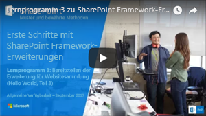
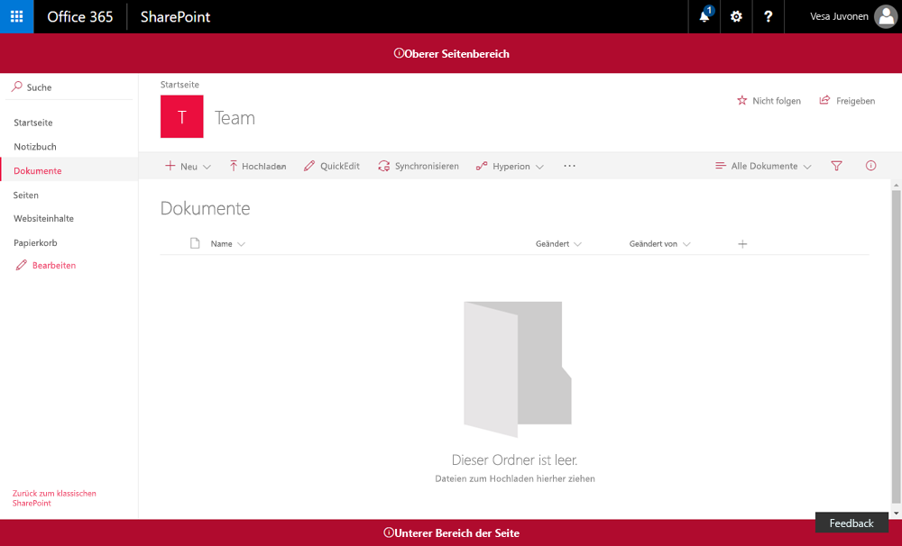

# <a name="deploy-your-extension-to-sharepoint-hello-world-part-3"></a><span data-ttu-id="bdd29-101">Bereitstellen Ihrer Erweiterung in SharePoint (Hello World, Teil 3)</span><span class="sxs-lookup"><span data-stu-id="bdd29-101">Deploy your extension to SharePoint (Hello world part 3)</span></span>

<span data-ttu-id="bdd29-102">In diesem Artikel wird die Bereitstellung des Application Customizers von SharePoint-Framework in SharePoint und seine Funktionsweise auf modernen SharePoint-Seiten erläutert.</span><span class="sxs-lookup"><span data-stu-id="bdd29-102">This article describes how to deploy your SharePoint Framework Application Customizer to SharePoint and see it working on modern SharePoint pages.</span></span> <span data-ttu-id="bdd29-103">In diesem Artikel wird weiterhin die Hello World-Erweiterung aus dem vorherigen Artikel [Verwenden von Seitenplatzhaltern aus dem Application Customizer (Hello World, Teil 2)](./using-page-placeholder-with-extensions.md) verwendet.</span><span class="sxs-lookup"><span data-stu-id="bdd29-103">This article continues with the Hello World extension built in the previous article [Use page placeholders from Application Customizer (Hello World part 2)](./using-page-placeholder-with-extensions.md).</span></span>

<span data-ttu-id="bdd29-104">Stellen Sie sicher, dass Sie die Verfahren in den folgenden Artikeln abgeschlossen haben, bevor Sie beginnen:</span><span class="sxs-lookup"><span data-stu-id="bdd29-104">Be sure you have completed the procedures in the following articles before you begin:</span></span>

* [<span data-ttu-id="bdd29-105">Erstellen Ihrer ersten SharePoint-Framework-Erweiterung (Hello World, Teil 1)</span><span class="sxs-lookup"><span data-stu-id="bdd29-105">Build your first SharePoint Framework Extension (Hello World part 1)</span></span>](./build-a-hello-world-extension.md)
* [<span data-ttu-id="bdd29-106">Verwenden von Seitenplatzhaltern aus dem Application Customizer (Hello World, Teil 2)</span><span class="sxs-lookup"><span data-stu-id="bdd29-106">Use page placeholders from Application Customizer (Hello World part 2)</span></span>](./using-page-placeholder-with-extensions.md)

<span data-ttu-id="bdd29-107">Sie können die nachfolgend beschriebene Anleitung auch anhand dieses Videos in unserem [YouTube-Kanal „SharePoint Patterns & Practices“](https://www.youtube.com/watch?v=P_yWI0WVQIg&list=PLR9nK3mnD-OXtWO5AIIr7nCR3sWutACpV) nachvollziehen:</span><span class="sxs-lookup"><span data-stu-id="bdd29-107">You can also follow these steps by watching the video on the [SharePoint PnP YouTube Channel](https://www.youtube.com/watch?v=P_yWI0WVQIg&list=PLR9nK3mnD-OXtWO5AIIr7nCR3sWutACpV).</span></span> 

<a href="https://www.youtube.com/watch?v=DzHdVxLA3Pc">

</a>

## <a name="package-the-hello-world-application-customizer"></a><span data-ttu-id="bdd29-108">Packen des Hello World Application Customizers</span><span class="sxs-lookup"><span data-stu-id="bdd29-108">Package the Hello World Application Customizer</span></span>
<span data-ttu-id="bdd29-109">Wechseln Sie im Konsolenfenster zum Projektverzeichnis der Erweiterung, die Sie unter [Erstellen Ihrer ersten SharePoint-Framework-Erweiterung (Hello World, Teil 1)](./build-a-hello-world-extension.md) erstellt haben.</span><span class="sxs-lookup"><span data-stu-id="bdd29-109">In the console window, go to the extension project directory created in [Build your first SharePoint Framework Extension (Hello World part 1)](./build-a-hello-world-extension.md)</span></span>

```
cd app-extension
```
<span data-ttu-id="bdd29-110">Wenn gulp serve noch ausgeführt wird, beenden Sie die Ausführung, indem Sie STRG + C drücken.</span><span class="sxs-lookup"><span data-stu-id="bdd29-110">If gulp serve is still running, stop it from running by pressing .</span></span>

<span data-ttu-id="bdd29-111">Im Gegensatz zum **Debug**-Modus müssen Sie für die Verwendung einer Erweiterung auf modernen serverseitigen SharePoint-Seiten die Erweiterung bei SharePoint im Bereich `Site collection`, `Site` oder `List` bereitstellen und registrieren.</span><span class="sxs-lookup"><span data-stu-id="bdd29-111">Unlike in **Debug** mode, in order to use an extension on modern SharePoint server-side pages, you need to deploy and register the extension with SharePoint in either `Site collection`, `Site`, or `List` scope. The scope defines where and how the Application Customizer will be active. In this particular scenario, we'll register the Application Customizer using the  scope.</span></span> <span data-ttu-id="bdd29-112">Der Bereich definiert, wo und wie Application Customizer aktiv sein soll.</span><span class="sxs-lookup"><span data-stu-id="bdd29-112">The scope defines where and how the Application Customizer will be active.</span></span> <span data-ttu-id="bdd29-113">In diesem Szenario wird der Application Customizer unter Verwendung des Bereichs `Site collection` registriert.</span><span class="sxs-lookup"><span data-stu-id="bdd29-113">In this particular scenario, we'll register the Application Customizer by using the `Site collection` scope.</span></span> 

<span data-ttu-id="bdd29-114">Vor dem Packen der Lösung wird der Code hinzugefügt, mit dem die Erweiterungsaktivierung auf der Website automatisiert wird, sobald die Lösung auf der Website installiert ist.</span><span class="sxs-lookup"><span data-stu-id="bdd29-114">Before we package our solution, we want to include the code needed to automate the extension activation within the site whenever the solution is installed on the site.</span></span> <span data-ttu-id="bdd29-115">In diesem Fall verwenden wir Feature-Framework-Elemente für die direkte Ausführung dieser Aktionen in dem Lösungspaket, Sie können jedoch auch den Application Customizer einer SharePoint-Website zuordnen, indem Sie REST oder CSOM im Rahmen der Websitebereitstellung verwenden.</span><span class="sxs-lookup"><span data-stu-id="bdd29-115">Before we package our solution, we want to include the code needed to automate the extension activation within the site, whenever the solution is installed on the site. In this case, we'll use feature framework elements to perform these actions directly in the solution package, but you could also associate the application customizer to a SharePoint site using REST or CSOM as part of the site provisioning, for example.</span></span>

1. <span data-ttu-id="bdd29-116">Installieren Sie das Lösungspaket auf der Website, auf der es installiert sein soll, damit das Erweiterungsmanifest für die Ausführung freigegeben wird.</span><span class="sxs-lookup"><span data-stu-id="bdd29-116">Install the solution package to the site where it should be installed, so that the extension manifest is being white listed for execution</span></span>

2. <span data-ttu-id="bdd29-117">Ordnen Sie den Application Customizer dem geplanten Bereich zu.</span><span class="sxs-lookup"><span data-stu-id="bdd29-117">Associate the Application Customizer to the planned scope.</span></span> <span data-ttu-id="bdd29-118">Sie können dies programmgesteuert (CSOM/REST) oder mit dem Feature-Framework innerhalb des SharePoint-Framework-Lösungspakets tun.</span><span class="sxs-lookup"><span data-stu-id="bdd29-118">Associate the Application Customizer to the planned scope. This can be performed programmatically (CSOM/REST) or by using the feature framework inside of the SharePoint Framework solution package. You'll need to associate the following properties in the  object at the site collection, site or list level.</span></span> <span data-ttu-id="bdd29-119">Sie müssen die folgenden Eigenschaften im `UserCustomAction`-Objekt auf der Websitesammlungs-, Website- oder Listenebene zuweisen.</span><span class="sxs-lookup"><span data-stu-id="bdd29-119">You'll need to associate the following properties in the `UserCustomAction` object at the site collection, site, or list level.</span></span>
    * <span data-ttu-id="bdd29-120">**ClientSiteComponentId:** Dies ist der Bezeichner (GUID) für den Field Customizer, der im App-Katalog installiert wurde.</span><span class="sxs-lookup"><span data-stu-id="bdd29-120">**ClientSideComponentId:** This is the identifier (GUID) of the Field Customizer, which has been installed in the app catalog.</span></span> 
    * <span data-ttu-id="bdd29-121">**ClientSideComponentProperties:** Dies ist ein optionaler Parameter, der zum Bereitstellen von Eigenschaften für die Field Customizer-Instanz verwendet werden kann.</span><span class="sxs-lookup"><span data-stu-id="bdd29-121">**ClientSideComponentProperties:** This is an optional parameter, which can be used to provide properties for the Field Customizer instance.</span></span>
   
   <span data-ttu-id="bdd29-122">Beachten Sie, dass Sie die Anforderung zum Hinzufügen einer Lösung mit Ihrer Erweiterung zu der Website mithilfe der `skipFeatureDeployment`-Einstellung in **package-solution.json** steuern können.</span><span class="sxs-lookup"><span data-stu-id="bdd29-122">Note that you can control the requirement to add a solution containing your extension to the site by using the `skipFeatureDeployment` setting in **package-solution.json**.</span></span> <span data-ttu-id="bdd29-123">Auch wenn Sie die Installation der Lösung auf der Website nicht voraussetzen, müssen Sie **ClientSideComponentId** bestimmten Objekten zuweisen, damit die Erweiterung angezeigt wird.</span><span class="sxs-lookup"><span data-stu-id="bdd29-123">Notice, you can control the requirement to add a solution containing your extension to the site by using  setting in package-solution.json. Event though you would not require solution to be installed on the site, you'd need to associate **ClientSideComponentId** to specific objects for the extension to be visible.</span></span> 
   
<span data-ttu-id="bdd29-124">In den folgenden Schritten wird die `CustomAction`-Definition geprüft, die automatisch für die Lösung als Teil der Gerüsterstellung erstellt wurde, damit die Lösung auf einer Website aktiviert wird, sobald sie installiert wurde.</span><span class="sxs-lookup"><span data-stu-id="bdd29-124">In the following steps, we'll review the `CustomAction` definition, which was automatically created for the solution as part of the scaffolding for enabling the solution on a site when it's being installed.</span></span> 
   
1. <span data-ttu-id="bdd29-125">Wechseln Sie wieder zu Ihrem Lösungspaket in Visual Studio Code (oder Ihrem bevorzugten Editor).</span><span class="sxs-lookup"><span data-stu-id="bdd29-125">Return to your solution package in Visual Studio Code (or to your preferred editor).</span></span>

2. <span data-ttu-id="bdd29-126">Erweitern Sie im Stammverzeichnis der Lösung den Ordner **sharepoint** und den Unterordner **assets**, um die vorhandene Datei **elements.xml** anzuzeigen.</span><span class="sxs-lookup"><span data-stu-id="bdd29-126">Extend the **sharepoint** folder and **assets** subfolder in the root of the solution to see the existing **elements.xml** file.</span></span> 

   

<br/>

### <a name="review-the-existing-elementsxml-file-for-sharepoint-definitions"></a><span data-ttu-id="bdd29-128">Überprüfen der vorhandenen Datei „elements.xml“ auf SharePoint-Definitionen</span><span class="sxs-lookup"><span data-stu-id="bdd29-128">Review the existing elements.xml file for SharePoint definitions</span></span>

<span data-ttu-id="bdd29-129">Überprüfen Sie die vorhandene XML-Struktur in der Datei **elements.xml**.</span><span class="sxs-lookup"><span data-stu-id="bdd29-129">Review the existing xml structure in the **elements.xml** file.</span></span> <span data-ttu-id="bdd29-130">Beachten Sie, dass die Eigenschaft **ClientSideComponentId** anhand der eindeutigen ID des Application Customizer aus der Datei **HelloWorldFieldCustomizer.manifest.json** im Ordner **src\extensions\helloWorld** automatisch aktualisiert wurde.</span><span class="sxs-lookup"><span data-stu-id="bdd29-130">Note that the **ClientSideComponentId** property has been automatically updated based on the unique ID of your Application Customizer available in the **HelloWorldApplicationCustomizer.manifest.json** file in the **src\extensions\helloWorld** folder.</span></span>

<span data-ttu-id="bdd29-131">**ClientSideComponentProperties** wurde auch mithilfe der standardmäßigen Struktur und JSON-Eigenschaften für diese Instanz der Erweiterung automatisch festgelegt.</span><span class="sxs-lookup"><span data-stu-id="bdd29-131">**ClientSideComponentProperties** has also been automatically set with the default structure and JSON properties for this extension instance.</span></span> <span data-ttu-id="bdd29-132">Beachten Sie auch die Escapezeichen im JSON mit, damit es ordnungsgemäß in einem XML-Attribut festgelegt werden kann.</span><span class="sxs-lookup"><span data-stu-id="bdd29-132">We also set the ClientSideComponentProperties and pass JSON properties for this extension instance. Notice how the JSON is escaped so that we can set it properly within an XML attribute.</span></span> 

<span data-ttu-id="bdd29-133">Die Konfiguration verwendet die Position von `ClientSideExtension.ApplicationCustomizer`, um zu definieren, dass es sich dabei um einen Application Customizer handelt.</span><span class="sxs-lookup"><span data-stu-id="bdd29-133">The configuration uses the specific location of `ClientSideExtension.ApplicationCustomizer` to define that this is an Application Customizer.</span></span> <span data-ttu-id="bdd29-134">Da diese Datei standardmäßig **elements.xml** einem Feature mit dem Bereich *Web* zugeordnet wird, wird diese `CustomAction` automatisch der `Web.UserCustomAction`-Sammlung auf der Website hinzugefügt, auf der die Lösung installiert wurde.</span><span class="sxs-lookup"><span data-stu-id="bdd29-134">Notice also that we use the specific location of  to define that this is an Application Customizer. Since by default this elements.xml will be associated to a Web scoped feature, this  will be automatically added to the  collection in the site where the solution is being installed.</span></span>

<span data-ttu-id="bdd29-135">Um sicherzustellen, dass die Konfiguration mit den Aktualisierungen im Application Customizer übereinstimmen, aktualisieren Sie **ClientSideComponentProperties** wie in der folgenden XML-Struktur dargestellt.</span><span class="sxs-lookup"><span data-stu-id="bdd29-135">To ensure that the configuration matches updates performed in the Application Customizer, update the **ClientSideComponentProperties** as in the following xml structure.</span></span> <span data-ttu-id="bdd29-136">Sie sollten nicht die gesamte Struktur kopieren, da es sonst zu einer Nichtübereinstimmung mit Ihrer **ClientSideComponentId** kommt.</span><span class="sxs-lookup"><span data-stu-id="bdd29-136">Note that you should not copy the whole structure because it would cause a mismatch with your **ClientSideComponentId**.</span></span>


```xml
<?xml version="1.0" encoding="utf-8"?>
<Elements xmlns="http://schemas.microsoft.com/sharepoint/">

    <CustomAction 
        Title="SPFxApplicationCustomizer"
        Location="ClientSideExtension.ApplicationCustomizer"
        ClientSideComponentId="46606aa6-5dd8-4792-b017-1555ec0a43a4"
        ClientSideComponentProperties="{&quot;Top&quot;:&quot;Top area of the page&quot;,&quot;Bottom&quot;:&quot;Bottom area in the page&quot;}">

    </CustomAction>

</Elements>
```

<br/>

### <a name="ensure-that-definitions-are-taken-into-account-within-the-build-pipeline"></a><span data-ttu-id="bdd29-137">Gewährleisten der Berücksichtigung von Definitionen in der Buildpipeline</span><span class="sxs-lookup"><span data-stu-id="bdd29-137">Ensure that definitions are taken into account within the build pipeline</span></span>

<span data-ttu-id="bdd29-p110">Öffnen Sie die Datei **package-solution.json** im Ordner **config**. Die Datei **package-solution.json** enthält die Paketmetadaten, definiert wie folgt:</span><span class="sxs-lookup"><span data-stu-id="bdd29-p110">Open **package-solution.json** from the **config** folder. The **package-solution.json** file defines the package metadata as shown in the following code:</span></span>

```json

{
  "$schema": "https://dev.office.com/json-schemas/spfx-build/package-solution.schema.json",
  "solution": {
    "name": "app-extension-client-side-solution",
    "id": "98a9fe4f-175c-48c1-adee-63fb927faa70",
    "version": "1.0.0.0",
    "features": [
      {
        "title": "Application Extension - Deployment of custom action.",
        "description": "Deploys a custom action with ClientSideComponentId association",
        "id": "4678966b-de68-445f-a74e-e553a7b937ab",
        "version": "1.0.0.0",
        "assets": {
          "elementManifests": [
            "elements.xml"
          ]
        }
      }
    ]
  },
  "paths": {
    "zippedPackage": "solution/app-extension.sppkg"
  }
}


```

<br/>

<span data-ttu-id="bdd29-140">Um sicherzustellen, dass die Datei **element.xml** beim Packen der Lösung berücksichtigt wird, fügt das Standardgerüst die benötigte Konfiguration hinzu, um eine Framework-Featuredefinition für das Lösungspaket zu definieren.</span><span class="sxs-lookup"><span data-stu-id="bdd29-140">To ensure that the **element.xml** file is taken into account while the solution is being packaged, default scaffolding adds needed configuration to define a feature framework feature definition for the solution package.</span></span>

## <a name="deploy-the-extension-to-sharepoint-online-and-host-javascript-from-local-host"></a><span data-ttu-id="bdd29-141">Bereitstellen der Erweiterung in SharePoint Online und Hosten des JavaScript-Codes über Localhost</span><span class="sxs-lookup"><span data-stu-id="bdd29-141">Deploy the extension to SharePoint Online and host JavaScript from local host</span></span>

<span data-ttu-id="bdd29-142">Nun können Sie die Lösung auf einer SharePoint-Website bereitstellen und das Objekt `CustomAction` automatisch auf Website-Ebene verknüpfen.</span><span class="sxs-lookup"><span data-stu-id="bdd29-142">Now you are ready to deploy the solution to a SharePoint site and to have the `CustomAction` automatically associated on the site level.</span></span>

1. <span data-ttu-id="bdd29-143">Geben Sie im Konsolenfenster den folgenden Befehl ein, um die clientseitige Lösung, die die Erweiterung enthält, zu verpacken und so die Grundstruktur für die Paketerstellung zu erstellen:</span><span class="sxs-lookup"><span data-stu-id="bdd29-143">In the console window, enter the following command to package your client-side solution that contains the extension, so that we get the basic structure ready for packaging:</span></span>

   ```
   gulp bundle
   ```

2. <span data-ttu-id="bdd29-144">Führen Sie den folgenden Befehl aus, um das Lösungspaket zu erstellen:</span><span class="sxs-lookup"><span data-stu-id="bdd29-144">Next, execute the following command so that the solution package is created:</span></span>

   ```
   gulp package-solution
   ```

   <span data-ttu-id="bdd29-145">Der Befehl erstellt das Paket im Ordner **sharepoint/solution**:</span><span class="sxs-lookup"><span data-stu-id="bdd29-145">The command will create the package in the **sharepoint/solution** folder:</span></span>

   ```
   app-extension.sppkg
   ```

3. <span data-ttu-id="bdd29-146">Als Nächstes müssen Sie das Paket, das generiert wurde, im App-Katalog bereitstellen.</span><span class="sxs-lookup"><span data-stu-id="bdd29-146">Next you need to deploy the package that was generated to the App Catalog.</span></span> <span data-ttu-id="bdd29-147">Wechseln Sie dazu zum **App-Katalog** Ihres Mandanten, und öffnen Sie die Bibliothek **Apps für SharePoint**.</span><span class="sxs-lookup"><span data-stu-id="bdd29-147">Go to your tenant's **App Catalog** and open the **Apps for SharePoint** library.</span></span>

4. <span data-ttu-id="bdd29-148">Laden Sie das Paket `app-extension.sppkg`, das sich im Ordner **sharepoint/solution** befindet, in den App-Katalog hoch, oder platzieren Sie es dort per Drag & Drop.</span><span class="sxs-lookup"><span data-stu-id="bdd29-148">Upload or drag and drop the `app-extension.sppkg` located in the **sharepoint/solution** folder to the App Catalog. SharePoint will display a dialog and ask you to trust the client-side solution.</span></span> <span data-ttu-id="bdd29-149">In SharePoint wird ein Dialogfeld angezeigt, und Sie werden aufgefordert, der clientseitigen Lösung zu vertrauen.</span><span class="sxs-lookup"><span data-stu-id="bdd29-149">SharePoint displays a dialog and asks you to trust the client-side solution.</span></span>

   <span data-ttu-id="bdd29-150">Da wir die Host-URLs der Lösung für diese Bereitstellung nicht aktualisiert haben, verweist die URL immer noch auf `https://localhost:4321`.</span><span class="sxs-lookup"><span data-stu-id="bdd29-150">Notice that we did not update the URLs for hosting the solution for this deployment, so the URL is still pointing to `https://localhost:4321`. Click the Deploy button.</span></span> 
   
5. <span data-ttu-id="bdd29-151">Klicken Sie auf die Schaltfläche **Bereitstellen**.</span><span class="sxs-lookup"><span data-stu-id="bdd29-151">Select the **Deploy** button.</span></span>

   

6. <span data-ttu-id="bdd29-p113">Wechseln Sie wieder zur Konsole, und vergewissern Sie sich, dass die Lösung ausgeführt wird. Sollte Sie nicht ausgeführt werden, führen Sie den folgenden Befehl im Lösungsordner aus:</span><span class="sxs-lookup"><span data-stu-id="bdd29-p113">Move back to your console and ensure that the solution is running. If it's not running, execute the following command in the solution folder:</span></span>
   
   ```
   gulp serve --nobrowser
   ```
   
7. <span data-ttu-id="bdd29-p114">Wechseln Sie zu der Website, auf der Sie die Bereitstellung der SharePoint-Ressource testen möchten. Dies könnte eine Websitesammlung im Mandanten sein, auf dem Sie dieses Lösungspaket bereitgestellt haben.</span><span class="sxs-lookup"><span data-stu-id="bdd29-p114">Go to the site where you want to test SharePoint asset provisioning. This could be any site collection in the tenant where you deployed this solution package.</span></span>

8. <span data-ttu-id="bdd29-157">Klicken Sie auf der oberen Navigationsleiste rechts auf das Zahnradsymbol und anschließend auf **App hinzufügen**, um Ihre Seite „Apps“ aufzurufen.</span><span class="sxs-lookup"><span data-stu-id="bdd29-157">Chose the gear icon on the top navigation bar on the right and choose **Add an app** to go to your Apps page.</span></span>

9. <span data-ttu-id="bdd29-158">Geben Sie in das **Suchfeld** die Zeichenfolge **app** ein, und drücken Sie die EINGABETASTE, um Ihre Apps zu filtern.</span><span class="sxs-lookup"><span data-stu-id="bdd29-158">In the Search box, enter 'app' and press Enter to filter your apps.</span></span>

   

10. <span data-ttu-id="bdd29-160">Wählen Sie die App **app-extension-client-side-solution**, um die Lösung auf der Website zu installieren.</span><span class="sxs-lookup"><span data-stu-id="bdd29-160">Select the **app-extension-client-side-solution** app to install the solution on the site.</span></span> <span data-ttu-id="bdd29-161">Wenn die Installation abgeschlossen ist, aktualisieren Sie die Seite, indem Sie **F5** drücken.</span><span class="sxs-lookup"><span data-stu-id="bdd29-161">When the installation is completed, refresh the page by selecting **F5**.</span></span>

<span data-ttu-id="bdd29-162">Wenn die Anwendung erfolgreich installiert wurde, werden die Kopf- und Fußzeile genau so gerendert wie mit den Debugging-Abfrageparametern.</span><span class="sxs-lookup"><span data-stu-id="bdd29-162">When the application has been successfully installed, you can see the header and footer being rendered just like with the debug query parameters.</span></span>



## <a name="next-steps"></a><span data-ttu-id="bdd29-164">Nächste Schritte</span><span class="sxs-lookup"><span data-stu-id="bdd29-164">Next steps</span></span>

<span data-ttu-id="bdd29-165">Glückwunsch! Sie haben eine Erweiterung für eine moderne SharePoint-Seite aus dem App-Katalog bereitgestellt.</span><span class="sxs-lookup"><span data-stu-id="bdd29-165">Congratulations, you have deployed an extension to a modern SharePoint page from the app catalog!</span></span> <span data-ttu-id="bdd29-166">Sie können mit der Entwicklung der Hello World-Erweiterung im nächsten Thema [Hostingerweiterung aus Office 365 CDN (Hello World, Teil 4)](./hosting-extension-from-office365-cdn.md) fortfahren, in dem Sie erfahren, wie Sie die Erweiterungsobjekte aus einem CDN anstelle von Localhost bereitstellen und laden.</span><span class="sxs-lookup"><span data-stu-id="bdd29-166">Congratulations, you have deployed an extension to a modern SharePoint page from the app catalog! You can continue building out your Hello World extension in the next topic, [Hosting extension from Office 365 CDN (Hello world part 4)](./hosting-extension-from-office365-cdn.md), where you will learn how to deploy and load the extension assets from a CDN instead of localhost.</span></span>

> [!NOTE]
> <span data-ttu-id="bdd29-167">Wenn Sie einen Fehler in der Dokumentation oder im SharePoint-Framework finden, melden Sie ihn an das SharePoint Engineering unter Verwendung der [Fehlerliste im sp-dev-docs-Repository](https://github.com/SharePoint/sp-dev-docs/issues).</span><span class="sxs-lookup"><span data-stu-id="bdd29-167">If you find an issue in the documentation or in the SharePoint Framework, please report that to SharePoint engineering using the [issue list at sp-dev-docs repository](https://github.com/SharePoint/sp-dev-docs/issues).</span></span> <span data-ttu-id="bdd29-168">Vielen Dank im Voraus für Ihr Feedback.</span><span class="sxs-lookup"><span data-stu-id="bdd29-168">Thanks for your input advance.</span></span>