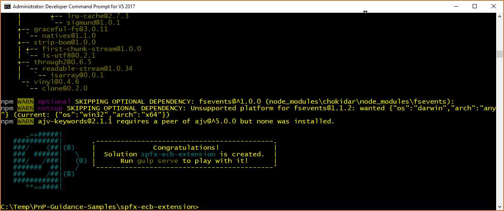

# <a name="migrating-from-edit-control-block-ecb-menu-item-to-sharepoint-framework-extensions"></a><span data-ttu-id="c6b11-101">Migrieren vom Edit Control Block-Menüelement (ECB) zu SharePoint-Framework-Erweiterungen</span><span class="sxs-lookup"><span data-stu-id="c6b11-101">Migrating from Edit Control Block (ECB) menu item to SharePoint Framework Extensions</span></span>

<span data-ttu-id="c6b11-102">In den letzten Jahren haben die meisten Unternehmenslösungen, die auf Office 365 und SharePoint Online aufbauen, die Funktion _CustomAction_ des SharePoint-Feature-Framework genutzt, um die Benutzeroberfläche von Seiten zu erweitern.</span><span class="sxs-lookup"><span data-stu-id="c6b11-102">During the last few years, most of the enterprise solutions built on top of Office 365 and SharePoint Online leveraged the site _CustomAction_ capability of the SharePoint Feature Framework to extend the UI of pages.</span></span> <span data-ttu-id="c6b11-103">Heute stehen die meisten dieser Anpassungsmöglichkeiten in der „modernen“ Benutzeroberfläche von SharePoint Online jedoch nicht mehr zur Verfügung.</span><span class="sxs-lookup"><span data-stu-id="c6b11-103">However nowdays, within the new "modern" UI of SharePoint Online, most of those customizations are no more available.</span></span> <span data-ttu-id="c6b11-104">Mit den neuen SharePoint-Framework-Erweiterungen können Sie jedoch fast die gleichen Funktionen auch in der modernen Benutzeroberfläche bereitstellen.</span><span class="sxs-lookup"><span data-stu-id="c6b11-104">Luckily, with the new SharePoint Framework Extensions you can provide similar functionality in the "modern" UI.</span></span> <span data-ttu-id="c6b11-105">In diesem Lernprogramm erfahren Sie, wie Sie von den älteren „klassischen“ Anpassungen zu dem neuen Modell migrieren, das auf SharePoint-Framework-Erweiterungen basiert.</span><span class="sxs-lookup"><span data-stu-id="c6b11-105">In this tutorial you will learn how to migrate from old "classic" customizations to the new model based on SharePoint Framework Extensions.</span></span>

> [!IMPORTANT]
> <span data-ttu-id="c6b11-106">Das bedeutet nicht das Ende der Unterstützung für die klassische Benutzeroberfläche, es stehen weiterhin sowohl die klassische als auch die moderne Oberfläche zur Verfügung.</span><span class="sxs-lookup"><span data-stu-id="c6b11-106">We're not deprecating the "classic" experience - both "classic" and "modern" will coexist.</span></span>

<span data-ttu-id="c6b11-107">_**Gilt für: **SharePoint Online_</span><span class="sxs-lookup"><span data-stu-id="c6b11-107">_**Applies to:** SharePoint Online_</span></span>

## <a name="understanding-sharepoint-framework-extensions"></a><span data-ttu-id="c6b11-108">Grundlegendes zu SharePoint-Framework-Erweiterungen</span><span class="sxs-lookup"><span data-stu-id="c6b11-108">Understanding SharePoint Framework Extensions</span></span>
<span data-ttu-id="c6b11-109"><a name="spfxExtensions"> </a> Bei der Entwicklung von SharePoint-Framework-Erweiterungen sind folgende Optionen verfügbar:</span><span class="sxs-lookup"><span data-stu-id="c6b11-109"><a name="spfxExtensions"> </a> First of all, let's introduce the available options when developing SharePoint Framework Extensions:</span></span>

* <span data-ttu-id="c6b11-110">**Application Customizer**: Erweiterung der systemeigenen modernen Benutzeroberfläche von SharePoint Online, indem benutzerdefinierte Elemente und clienseitiger Code den vordefinierten Platzhaltern der modernen Seiten hinzugefügt werden.</span><span class="sxs-lookup"><span data-stu-id="c6b11-110">**Application Customizer**: extend the native "modern" UI of SharePoint Online by adding custom HTML elements and client-side code to pre-defined placeholders of "modern" pages.</span></span> <span data-ttu-id="c6b11-111">Zu der Zeit, zu der dieser Artikel verfasst wurde, waren die verfügbaren Platzhalter die Kopf- und Fußzeile jeder modernen Seite.</span><span class="sxs-lookup"><span data-stu-id="c6b11-111">At the time of this writing, the available placeholders are the header and the footer of every "modern" page.</span></span>
* <span data-ttu-id="c6b11-112">**Command Set**: Benutzerdefinierte ECB-Menüelemente oder benutzerdefinierte Schaltflächen können der Befehlsleiste einer Listenansicht für eine Liste oder Bibliothek hinzugefügt werden.</span><span class="sxs-lookup"><span data-stu-id="c6b11-112">**Command Set**: allow to add custom ECB menu items or custom buttons to the command bar of a list view for a list or a library.</span></span> <span data-ttu-id="c6b11-113">Sie können diesen Befehlen eine JavaScript (TypeScript)-Aktion zuordnen.</span><span class="sxs-lookup"><span data-stu-id="c6b11-113">You can associate any JavaScript (TypeScript) action to these commands.</span></span>
* <span data-ttu-id="c6b11-114">**Field Customizer**: Anpassung der Darstellung eines Felds in einer Listenansicht mit benutzerdefinierten HTML-Elementen und clientseitigem Code.</span><span class="sxs-lookup"><span data-stu-id="c6b11-114">**Field Customizer**: customize the rendering of a field in a list view using custom HTML elements and client-side code.</span></span>

<span data-ttu-id="c6b11-115">Wie bereits aus der obigen Beschreibung hervorgeht, ist die „Command Set“-Erweiterung die nützlichste in diesem Kontext.</span><span class="sxs-lookup"><span data-stu-id="c6b11-115">As you can argue from the above descriptions, the most useful one in our context is the "Command Set" extension.</span></span>

> [!NOTE]
> <span data-ttu-id="c6b11-116">Weitere Informationen zum Erstellen von SharePoint-Framework-Erweiterungen finden Sie im Artikel [Übersicht über SharePoint-Framework-Erweiterungen](https://docs.microsoft.com/de-DE/sharepoint/dev/spfx/extensions/overview-extensions).</span><span class="sxs-lookup"><span data-stu-id="c6b11-116">For further details about how to build SharePoint Framework Extensions you can read the article ["Overview of SharePoint Framework Extensions"](https://docs.microsoft.com/de-DE/sharepoint/dev/spfx/extensions/overview-extensions).</span></span>

## <a name="migrating-a-ecb-to-an-spfx-command-set"></a><span data-ttu-id="c6b11-117">Migrieren eines ECB zu einem Command Set von SPFx</span><span class="sxs-lookup"><span data-stu-id="c6b11-117">Migrating a ECB to an SPFx Command Set</span></span>
<span data-ttu-id="c6b11-118"><a name="FromECBtoCommandSet"> </a> Angenommen Sie verfügen über eine _CustomAction_ in SharePoint Online, damit für Dokumente in einer Bibliothek ein benutzerdefiniertes ECB-Menü verfügbar ist.</span><span class="sxs-lookup"><span data-stu-id="c6b11-118"><a name="FromECBtoCommandSet"> </a> Assume that you have a _CustomAction_ in SharePoint Online, in order to have a custom ECB menu item for documents in a library.</span></span> <span data-ttu-id="c6b11-119">Die Funktion des ECB-Menüelements besteht darin, eine benutzerdefinierte Seite zu öffnen, auf der die Listen-ID und die Listenelement-ID des aktuell ausgewählten Elements in der Abfragezeichenfolge der Zielseite bereitgestellt wird.</span><span class="sxs-lookup"><span data-stu-id="c6b11-119">The scope of the ECB menu item is to open a custom page, providing the list ID and the list item ID of the currently selected item in the querystring of the target page.</span></span>
<span data-ttu-id="c6b11-120">Im folgenden Codeausschnitt ist der XML-Code enthalten, der _CustomAction_ mithilfe des SharePoint-Feature-Frameworks definiert.</span><span class="sxs-lookup"><span data-stu-id="c6b11-120">In the following code snippet you can see the XML code defining that _CustomAction_ using the SharePoint Feature Framework.</span></span>

```XML
<?xml version="1.0" encoding="utf-8"?>
<Elements xmlns="http://schemas.microsoft.com/sharepoint/">
  <CustomAction Id="OpenDetailsPageWithItemReference"
                Title="Show Details"
                Description="Opens a new page with further details about the currently selected item"
                Sequence="1001"
                RegistrationType="List"
                RegistrationId="101"                
                Location="EditControlBlock">
    <UrlAction Url="ShowDetails.aspx?ID={ItemId}&amp;List={ListId}" />
  </CustomAction>
</Elements>
```

<span data-ttu-id="c6b11-121">Wie Sie sehen können, definiert die Funktionselementdatei ein Element des Typs _CustomAction_, um ein neues Element am Ort von _EditControlBlock_ (d. h. ECB) für ein beliebiges Dokument in einer beliebigen Bibliothek hinzuzufügen (_ RegistrationType_ ist _List_ und _RegistrationId_ ist _101_).</span><span class="sxs-lookup"><span data-stu-id="c6b11-121">As you can see, the feature elements file defines an element of type _CustomAction_ to add a new item in the _EditControlBlock_ location (i.e. ECB) for any document in any library (_RegistrationType_ is _List_ and _RegistrationId_ is _101_).</span></span>

<span data-ttu-id="c6b11-122">In der folgenden Abbildung sehen Sie die Ausgabe der vorherigen benutzerdefinierten Aktion in der Listenansicht einer Bibliothek.</span><span class="sxs-lookup"><span data-stu-id="c6b11-122">In the following figure you can see the output of the previous custom action, within the list view of a library.</span></span>


<span data-ttu-id="c6b11-124">Beachten Sie, dass das benutzerdefinierte ECB-Element des SharePoint-Feature-Framework auch in einer „modernen“ Liste funktioniert.</span><span class="sxs-lookup"><span data-stu-id="c6b11-124">Notice that the SharePoint Feature Framework ECB custom item works in a "modern" list, too.</span></span> <span data-ttu-id="c6b11-125">Tatsächlich funktioniert eine benutzerdefinierte Listenaktion auch in „modernen“ Listen, solange Sie keinen JavaScript-Code verwenden.</span><span class="sxs-lookup"><span data-stu-id="c6b11-125">In fact, as long as you don't use JavaScript code, a list custom action still works in "modern" lists, too.</span></span>

<span data-ttu-id="c6b11-126">Um die oben aufgeführte Lösung in das SharePoint-Framework zu migrieren, müssen Sie die folgenden Schritte ausführen.</span><span class="sxs-lookup"><span data-stu-id="c6b11-126">In order to migrate the above solution to the SharePoint Framework, you will have to accomplish the following steps.</span></span>

### <a name="create-a-new-sharepoint-framework-solution"></a><span data-ttu-id="c6b11-127">Erstellen einer neuen SharePoint-Framework-Lösung</span><span class="sxs-lookup"><span data-stu-id="c6b11-127">Create a new SharePoint Framework solution by running Yeoman SharePoint Generator:</span></span>
<span data-ttu-id="c6b11-128"><a name="CreateCommandSet"> </a> Nachdem Sie die Entwicklungsumgebung für SharePoint-Framework-Lösungen entsprechend den Anweisungen im Dokument [Einrichten Ihrer SharePoint-Entwicklungsumgebung für clientseitige Webparts](https://docs.microsoft.com/de-DE/sharepoint/dev/spfx/set-up-your-development-environment) eingerichtet haben, können Sie mit dem Erstellen einer SharePoint-Framework-Erweiterung beginnen.</span><span class="sxs-lookup"><span data-stu-id="c6b11-128"><a name="CreateCommandSet"> </a> Once you have prepared you development environment to develop SharePoint Framework solutions, by following the instructions provided in the document ["Set up your SharePoint client-side web part development environment"](https://docs.microsoft.com/de-DE/sharepoint/dev/spfx/set-up-your-development-environment), you can start creating a SharePoint Framework extension.</span></span>

1. <span data-ttu-id="c6b11-129">Öffnen Sie ein beliebiges Befehlszeilentool (PowerShell, CMD.EXE, Cmder usw.), erstellen Sie einen neuen Ordner für die Lösung (mit dem Namen _spfx-ecb-extension_), und erstellen Sie eine neue SharePoint-Framework-Lösung, indem Sie den Yeoman-Generator mit dem folgenden Befehl ausführen:</span><span class="sxs-lookup"><span data-stu-id="c6b11-129">Open the command line tool of your choice (PowerShell, CMD.EXE, Cmder, etc.), create a new folder for the solution (call it _spfx-ecb-extension_), and create a new SharePoint Framework solution by running the Yeoman generator with the following command:</span></span>

```
yo @microsoft/sharepoint
```

<span data-ttu-id="c6b11-130">Geben Sie bei Aufforderung durch das Tool Folgendes an:</span><span class="sxs-lookup"><span data-stu-id="c6b11-130">When prompted by the tool, provide the following answers:</span></span>
* <span data-ttu-id="c6b11-131">Bestätigen Sie den Standardnamen (_spfx-ecb-extension_) für Ihre Lösung, und drücken Sie die EINGABETASTE.</span><span class="sxs-lookup"><span data-stu-id="c6b11-131">Accept the default app-extension as your solution name, and press Enter.</span></span>
* <span data-ttu-id="c6b11-132">Wählen Sie „SharePoint Online only (latest)“, und drücken Sie die EINGABETASTE.</span><span class="sxs-lookup"><span data-stu-id="c6b11-132">Choose SharePoint Online only (latest), and press Enter.</span></span>
* <span data-ttu-id="c6b11-133">Wählen Sie „Use the current folder“ aus, und drücken Sie die EINGABETASTE.</span><span class="sxs-lookup"><span data-stu-id="c6b11-133">Choose Use the current folder, and press Enter.</span></span>
* <span data-ttu-id="c6b11-134">Wählen Sie „N“, damit die Erweiterung auf jeder Website explizit installiert werden muss, wenn sie verwendet wird.</span><span class="sxs-lookup"><span data-stu-id="c6b11-134">Choose N to require the extension to be installed on each site explicitly when it's being used.</span></span>
* <span data-ttu-id="c6b11-135">Wählen Sie „Extension“ als den zu erstellenden Typ von clientseitiger Komponente aus.</span><span class="sxs-lookup"><span data-stu-id="c6b11-135">Choose Extension (Preview) as the client-side component type to be created.</span></span>
* <span data-ttu-id="c6b11-136">Wählen Sie _ListView Command Set_ als den zu erstellenden Typ von Erweiterung aus.</span><span class="sxs-lookup"><span data-stu-id="c6b11-136">Choose _ListView Command Set (Preview)_ as the extension type to be created.</span></span>
* <span data-ttu-id="c6b11-137">Geben Sie „CustomECB“ als Namen für Ihr Command Set an.</span><span class="sxs-lookup"><span data-stu-id="c6b11-137">Provide "CustomECB" as the name for your Command Set.</span></span>


<span data-ttu-id="c6b11-139">An diesem Punkt installiert Yeoman die erforderlichen Abhängigkeiten und erstellt ein Gerüst für die Lösungsdateien und Ordner sowie die _CustomFooter_-Erweiterung.</span><span class="sxs-lookup"><span data-stu-id="c6b11-139">At this point, Yeoman will install the required dependencies and scaffold the solution files along with the _HelloWorld_ extension. This might take a few minutes.</span></span> <span data-ttu-id="c6b11-140">Das kann einige Minuten dauern.</span><span class="sxs-lookup"><span data-stu-id="c6b11-140">This might take a few minutes.</span></span>

<span data-ttu-id="c6b11-141">Nach Abschluss der Gerüsterstellung sollte folgende Erfolgsmeldung angezeigt werden:</span><span class="sxs-lookup"><span data-stu-id="c6b11-141">When the scaffold is complete, you should see the following message indicating a successful scaffold:</span></span>



2. <span data-ttu-id="c6b11-143">Führen Sie den folgenden Befehl aus, um die Version der Projektabhängigkeiten zu sperren:</span><span class="sxs-lookup"><span data-stu-id="c6b11-143">To lock down the version of the project dependencies, run the following command:</span></span>

```
npm shrinkwrap
```

3. <span data-ttu-id="c6b11-144">Starten Sie jetzt Visual Studio Code (oder einen anderen Code-Editor), und beginnen Sie mit der Entwicklung der Lösung.</span><span class="sxs-lookup"><span data-stu-id="c6b11-144">Now start Visual Studio Code (or whatever else is the code editor of your choice) and start developing the solution.</span></span> <span data-ttu-id="c6b11-145">Zum Starten von Visual Studio Code können Sie die folgende Anweisung ausführen.</span><span class="sxs-lookup"><span data-stu-id="c6b11-145">To start Visual Studio Code, you can execute the following statement.</span></span>

```
code .
```

### <a name="define-the-new-ecb-item"></a><span data-ttu-id="c6b11-146">Definieren des neuen ECB-Elements</span><span class="sxs-lookup"><span data-stu-id="c6b11-146">Define the new ECB item</span></span>
<span data-ttu-id="c6b11-147"><a name="DefineCommandSetECB"> </a> Um das gleiche Verhalten des ECB-Menüelements zu reproduzieren, das mit dem SharePoint-Feature-Framework erstellt wurde, müssen Sie einfach die gleiche Logik mit clientseitigem Code innerhalb der neuen SharePoint-Framework-Lösung implementieren.</span><span class="sxs-lookup"><span data-stu-id="c6b11-147"><a name="DefineCommandSetECB"> </a> In order to reproduce the same behavior of the ECB menu item built using the SharePoint Feature Framework, you simply need to implement the same logic using client-side code, within the new SharePoint Framework solution.</span></span> <span data-ttu-id="c6b11-148">Gehen Sie hierzu wie folgt vor:</span><span class="sxs-lookup"><span data-stu-id="c6b11-148">To accomplish this task, complete the following steps.</span></span>

1. <span data-ttu-id="c6b11-149">Öffnen Sie zunächst die Datei _CustomEcbCommandSet.manifest.json_ im Ordner _src/extensions/customEcb_.</span><span class="sxs-lookup"><span data-stu-id="c6b11-149">First of all, open the file _CustomEcbCommandSet.manifest.json_ under the _src/extensions/customEcb_ folder.</span></span> <span data-ttu-id="c6b11-150">Kopieren Sie den Wert der Eigenschaft _id_, und bewahren Sie ihn an einem sicheren Ort auf, da Sie ihn später benötigen.</span><span class="sxs-lookup"><span data-stu-id="c6b11-150">Copy the value of the _id_ property and store it in a safe place, because you will need it later.</span></span>

2. <span data-ttu-id="c6b11-151">Bearbeiten Sie in derselben Datei das Array von _items_ im unteren Bereich der Datei, um einen einzelnen Befehl für das Command Set zu definieren.</span><span class="sxs-lookup"><span data-stu-id="c6b11-151">Within the same file edit the array of _"items"_ in the lower part of the file, in order to define a single command for the Command Set.</span></span> <span data-ttu-id="c6b11-152">Rufen Sie den Befehl _ShowDetails_ auf, und geben Sie einen Titel sowie einen Befehlstyp ein.</span><span class="sxs-lookup"><span data-stu-id="c6b11-152">Call the command _"ShowDetails"_, provide a Title, and a command type.</span></span> <span data-ttu-id="c6b11-153">Im folgenden Screenshot sehen Sie, wie die Manifestdatei aussehen soll.</span><span class="sxs-lookup"><span data-stu-id="c6b11-153">In the following screenshot you can see how the manifest file should look like.</span></span>


3. <span data-ttu-id="c6b11-155">Öffnen Sie jetzt die Datei _CustomEcbCommandSet.ts_, die sich in demselben Ordner wie zuvor befindet, und bearbeiten Sie den Inhalt entsprechend dem folgenden Codeauszug.</span><span class="sxs-lookup"><span data-stu-id="c6b11-155">Now, open the _CustomEcbCommandSet.ts_ file, still under the same folder as before and edit the content accordingly to the following code excerpt.</span></span>

``` TypeScript
import { Guid } from '@microsoft/sp-core-library';
import { override } from '@microsoft/decorators';
import {
  BaseListViewCommandSet,
  Command,
  IListViewCommandSetListViewUpdatedParameters,
  IListViewCommandSetExecuteEventParameters
} from '@microsoft/sp-listview-extensibility';
import { Dialog } from '@microsoft/sp-dialog';

import * as strings from 'CustomEcbCommandSetStrings';

export interface ICustomEcbCommandSetProperties {
  targetUrl: string;
}

export default class CustomEcbCommandSet extends BaseListViewCommandSet<ICustomEcbCommandSetProperties> {

  @override
  public onInit(): Promise<void> {
    return Promise.resolve();
  }

  @override
  public onListViewUpdated(event: IListViewCommandSetListViewUpdatedParameters): void {
    const compareOneCommand: Command = this.tryGetCommand('ShowDetails');
    if (compareOneCommand) {
      // This command should be hidden unless exactly one row is selected.
      compareOneCommand.visible = event.selectedRows.length === 1;
    }
  }

  @override
  public onExecute(event: IListViewCommandSetExecuteEventParameters): void {
    switch (event.itemId) {
      case 'ShowDetails':

        const itemId: number = event.selectedRows[0].getValueByName("ID");
        const listId: Guid = this.context.pageContext.list.id;

        window.location.replace(`${this.properties.targetUrl}?ID=${itemId}&List=${listId}`);

        break;
      default:
        throw new Error('Unknown command');
    }
  }
}
```

<span data-ttu-id="c6b11-156">Beachten Sie die _import_-Anweisung ganz am Anfang der Datei, die den _Guid_-Typ referenziert und die ID der aktuellen Liste beinhaltet.</span><span class="sxs-lookup"><span data-stu-id="c6b11-156">Notice the _import_ statement at the very beginning of the file, in order to reference the _Guid_ type, which will be used to hold the ID of the current list.</span></span> <span data-ttu-id="c6b11-157">Darüber hinaus deklariert die Schnittstelle _ICustomEcbCommandSetProperties_ eine einzelne Eigenschaft mit der Bezeichnung _targetUrl_, die verwendet werden kann, um die URL der Zielseite anzugeben, die beim Klicken auf das ECB-Menüelement geöffnet werden soll.</span><span class="sxs-lookup"><span data-stu-id="c6b11-157">Moreover, the interface _ICustomEcbCommandSetProperties_ declares a single property called _targetUrl_ that can be used to provide the URL of the target page to open when clicking on the ECB menu item.</span></span>
<span data-ttu-id="c6b11-158">Darüber hinaus behandelt die Überschreibung der _onExecute_-Methode die Ausführung der benutzerdefinierten Aktion.</span><span class="sxs-lookup"><span data-stu-id="c6b11-158">Furthermore, the override of the _onExecute_ method handles the execution of the custom action.</span></span> <span data-ttu-id="c6b11-159">Beachten Sie den Codeauszug, der die ID des aktuell ausgewählten Elements aus dem _event_-Argument sowie die ID der Quellliste aus dem _PageContext_-Objekt abruft.</span><span class="sxs-lookup"><span data-stu-id="c6b11-159">Notice the code excerpt that reads the ID of the currently selected item, from the _event_ argument, and the ID of the source list from the the _pageContext_ object.</span></span>
<span data-ttu-id="c6b11-160">Beachten Sie schließlich auch die Überschreiben der _OnListViewUpdated_-Methode, die standardmäßig den Befehl _ShowDetails_ nur dann aktivierte, wenn ein einzelnes Element ausgewählt wird.</span><span class="sxs-lookup"><span data-stu-id="c6b11-160">Lastly, notice the override of the _onListViewUpdated_ method, which by default enabled the _'ShowDetails'_ command only if a single item is selected.</span></span>

<span data-ttu-id="c6b11-161">Die Umleitung an die Ziel-URL erfolgt durch die Verwendung von klassischem JavaScript-Code und der Funktion _window.location.replace_.</span><span class="sxs-lookup"><span data-stu-id="c6b11-161">The redirection to the target URL is handled by using classic JavaScript code and using the _window.location.replace_ function.</span></span> <span data-ttu-id="c6b11-162">Sie können natürlich jede Art von TypeScript-Code in die _OnExecute_-Methode schreiben.</span><span class="sxs-lookup"><span data-stu-id="c6b11-162">Of course, you can write whatever kind of TypeScript code you like inside the _onExecute_ method.</span></span> <span data-ttu-id="c6b11-163">Um hier nur ein Beispiel zu nennen, können Sie das Dialog-Framework des SharePoint-Frameworks verwenden, um ein neues Dialogfeld zu öffnen und mit den Endbenutzern zu interagieren.</span><span class="sxs-lookup"><span data-stu-id="c6b11-163">Just for the sake of making an example, you can leverage the SharePoint Framework Dialog Framework to open a new dialog window and to interact with the end users.</span></span>

> [!NOTE]
> <span data-ttu-id="c6b11-164">Weitere Informationen zum Dialog-Framework von SharePoint-Framework finden Sie im Dokument [Verwenden von benutzerdefinierten Dialogfeldern mit SharePoint Framework Extensions](https://docs.microsoft.com/de-DE/sharepoint/dev/spfx/extensions/guidance/using-custom-dialogs-with-spfx).</span><span class="sxs-lookup"><span data-stu-id="c6b11-164">For further details about the SharePoint Framework Dialog Framework you can read the document [Use custom dialog boxes with SharePoint Framework Extensions](https://docs.microsoft.com/de-DE/sharepoint/dev/spfx/extensions/guidance/using-custom-dialogs-with-spfx).</span></span>

<span data-ttu-id="c6b11-165">Die folgende Abbildung zeigt die resultierende Ausgabe.</span><span class="sxs-lookup"><span data-stu-id="c6b11-165">In the following figure you can see the resulting output.</span></span>


### <a name="test-the-solution-in-debug-mode"></a><span data-ttu-id="c6b11-167">Testen der Lösung im Debugmodus</span><span class="sxs-lookup"><span data-stu-id="c6b11-167">Test and run the console application in debug mode.</span></span>
<span data-ttu-id="c6b11-168"><a name="DebugCommandSet"> </a> Sie können die Lösung jetzt im Debugmodus testen.</span><span class="sxs-lookup"><span data-stu-id="c6b11-168"><a name="DebugCommandSet"> </a> You are now ready to test your solution in debug mode.</span></span> 

1. <span data-ttu-id="c6b11-169">Kehren Sie zum Konsolenfenster zurück, und führen Sie den folgenden Befehl aus:</span><span class="sxs-lookup"><span data-stu-id="c6b11-169">Return to the console and run the following command:</span></span>

```
gulp serve --nobrowser
```

<span data-ttu-id="c6b11-170">Der oben angegebene Befehl erstellt die Lösung und führt den lokalen Node.js-Server aus, um sie zu hosten.</span><span class="sxs-lookup"><span data-stu-id="c6b11-170">The above command will build the solution and run the local Node.js server to host it.</span></span>

2. <span data-ttu-id="c6b11-171">Öffnen Sie jetzt Ihren bevorzugten Browser, und wechseln Sie zu einer „modernen“ Bibliothek einer beliebigen „modernen“ Teamwebsite.</span><span class="sxs-lookup"><span data-stu-id="c6b11-171">Now open your favorite browser and go to a "modern" library of any "modern" team site.</span></span> <span data-ttu-id="c6b11-172">Hängen Sie jetzt die folgenden Abfragezeichenfolgeparameter an die _AllItems.aspx_-Seiten-URL an.</span><span class="sxs-lookup"><span data-stu-id="c6b11-172">Now, append the following querystring parameters to the _AllItems.aspx_ page URL.</span></span>

```
?loadSpfx=true&debugManifestsFile=https://localhost:4321/temp/manifests.js&customActions={"6c5b8ee9-43ba-4cdf-a106-04857c8307be":{"location":"ClientSideExtension.ListViewCommandSet.ContextMenu","properties":{"targetUrl":"ShowDetail.aspx"}}}
```

<span data-ttu-id="c6b11-173">In der oben aufgeführten Abfragezeichenfolge müssen Sie die GUID durch den _id_-Wert aus der Datei _CustomEcbCommandSet.manifest.json_ ersetzen, den Sie gespeichert und aufbewahrt haben.</span><span class="sxs-lookup"><span data-stu-id="c6b11-173">In the above querystring, you will have to replace the GUID with the _id_ value you saved from the _CustomEcbCommandSet.manifest.json_ file.</span></span> <span data-ttu-id="c6b11-174">Es ist außerdem eine _location_-Eigenschaft vorhanden, die den Wert von _ClientSideExtension.ListViewCommandSet.ContextMenu_ annimmt. Dieser weist SPFx an, das Command Set als ein ECB-Menüelement zu rendern.</span><span class="sxs-lookup"><span data-stu-id="c6b11-174">Moreover, there is a _location_ property which assumes the value of _ClientSideExtension.ListViewCommandSet.ContextMenu_, which instructs SPFx to render the Command Set as an ECB menu item.</span></span> <span data-ttu-id="c6b11-175">Nachfolgend sind alle für die _location_-Eigenschaft verfügbaren Optionen aufgeführt:</span><span class="sxs-lookup"><span data-stu-id="c6b11-175">Here are all the available options for the _location_ property:</span></span>
* <span data-ttu-id="c6b11-176">**ClientSideExtension.ListViewCommandSet.ContextMenu:** im Kontextmenü der Elemente</span><span class="sxs-lookup"><span data-stu-id="c6b11-176">**ClientSideExtension.ListViewCommandSet.ContextMenu:**  The context menu of the item(s)</span></span>
* <span data-ttu-id="c6b11-177">**ClientSideExtension.ListViewCommandSet.CommandBar:** im oberen Befehlssatzmenü in einer Liste oder Bibliothek</span><span class="sxs-lookup"><span data-stu-id="c6b11-177">**ClientSideExtension.ListViewCommandSet.CommandBar:** The top command set menu in a list or library</span></span>
* <span data-ttu-id="c6b11-178">**ClientSideExtension.ListViewCommandSet:** sowohl im Kontextmenü als auch auf der Befehlsleiste (entspricht SPUserCustomAction.Location="CommandUI.Ribbon")</span><span class="sxs-lookup"><span data-stu-id="c6b11-178">**ClientSideExtension.ListViewCommandSet:** Both the context menu and the command bar (Corresponds to SPUserCustomAction.Location="CommandUI.Ribbon")</span></span>

<span data-ttu-id="c6b11-179">Schließlich befindet sich in der Abfragezeichenfolge auch noch die Eigenschaft _properties_, die die JSON-Serialisierung eines Objekts vom Typ _ICustomEcbCommandSetProperties_ darstellt. Dies ist der Typ der benutzerdefinierten Eigenschaften, die das benutzerdefinierte Command Set zum Rendern anfordert.</span><span class="sxs-lookup"><span data-stu-id="c6b11-179">Lastly, still in the querystring there is a property called _properties_, which represents the JSON serialization of an object of type _ICustomEcbCommandSetProperties_ that is the type of the custom properties requested by the custom Command Set for rendering.</span></span>

<span data-ttu-id="c6b11-180">Beachten Sie, dass beim Ausführen der Seitenanforderung eine Warnmeldung angezeigt wird, ob Sie Debugskripts zulassen möchten. Sie müssen aus Sicherheitsgründen bestätigen, dass Code von localhost ausgeführt werden darf.</span><span class="sxs-lookup"><span data-stu-id="c6b11-180">Notice that, when executing the page request, you will be prompted with a warning message box with title "Allow debug scripts?", which asks your consent to run code from localhost, for security reasons.</span></span> <span data-ttu-id="c6b11-181">Wenn Sie lokal debuggen und testen möchten, müssen Sie das Laden von Debugskripts zulassen.</span><span class="sxs-lookup"><span data-stu-id="c6b11-181">Of course, if you want to locally debug and test the solution, you will have to allow to "Load debug scripts".</span></span>

### <a name="package-and-host-the-solution"></a><span data-ttu-id="c6b11-182">Packen und Hosten der Lösung</span><span class="sxs-lookup"><span data-stu-id="c6b11-182">Package and host the solution</span></span>
<span data-ttu-id="c6b11-183"><a name="PackageAndHostCommandSet"> </a> Wenn Sie mit dem Ergebnis zufrieden sind, können Sie die Lösung nun packen und in der eigentlichen Hostinginfrastruktur hosten.</span><span class="sxs-lookup"><span data-stu-id="c6b11-183"><a name="PackageAndHostCommandSet"> </a> If you are happy with the result, you are now ready to package the solution and host it in a real hosting infrastructure.</span></span>
<span data-ttu-id="c6b11-184">Bevor Sie das Bundle und das Paket erstellen, müssen Sie eine XML-Feature Frameworkdatei deklarieren, um die Erweiterung bereitzustellen.</span><span class="sxs-lookup"><span data-stu-id="c6b11-184">Before building the bundle and the package, you need to declare an XML feature framework file to provision the extension.</span></span>

#### <a name="review-feature-framework-elements"></a><span data-ttu-id="c6b11-185">Überprüfen von Feature-Framework-Elementen</span><span class="sxs-lookup"><span data-stu-id="c6b11-185">Review feature framework elements</span></span>
<span data-ttu-id="c6b11-186">Öffnen Sie im Code-Editor den Unterordner _/sharepoint/assets_ der Lösung, und bearbeiten Sie die Datei _elements.xml_.</span><span class="sxs-lookup"><span data-stu-id="c6b11-186">Within the code editor, open the _/sharepoint/assets_ sub-folder of the solution folder and edit the _elements.xml_ file.</span></span>
<span data-ttu-id="c6b11-187">Der folgende Codeauszug gibt an, wie die Datei aussehen sollte.</span><span class="sxs-lookup"><span data-stu-id="c6b11-187">In the following code excerpt you can see how the file should look like.</span></span>

```XML
<?xml version="1.0" encoding="utf-8"?>
<Elements xmlns="http://schemas.microsoft.com/sharepoint/">
    <CustomAction
        Title="CustomEcb"
        RegistrationId="101"
        RegistrationType="List"
        Location="ClientSideExtension.ListViewCommandSet.ContextMenu"
        ClientSideComponentId="6c5b8ee9-43ba-4cdf-a106-04857c8307be"
        ClientSideComponentProperties="{&quot;targetUrl&quot;:&quot;ShowDetails.aspx&quot;}">
    </CustomAction>
</Elements>
```

<span data-ttu-id="c6b11-188">Wie Sie sehen, ähnelt sie der SharePoint-Feature-Framework-Datei des „klassischen“ Modells. Sie verwendet jedoch das Attribut _ClientSideComponentId_, um die _id_ der benutzerdefinierten Erweiterung zu referenzieren, sowie das Attribut _ClientSideComponentProperties_, um die benutzerdefinierten Konfigurationseigenschaften zu konfigurieren, die für die Erweiterung erforderlich sind.</span><span class="sxs-lookup"><span data-stu-id="c6b11-188">As you can see, it reminds the SharePoint Feature Framework file that we saw in the "classic" model, but it uses the _ClientSideComponentId_ attribute to reference the _id_ of the custom extension, and the _ClientSideComponentProperties_ attribute, to configure the custom configuration properties required by the extension.</span></span>

<span data-ttu-id="c6b11-189">Öffnen Sie nun die Datei _package-solution.json_ im Ordner _/config_ der Lösung.</span><span class="sxs-lookup"><span data-stu-id="c6b11-189">Now, open the _package-solution.json_ file under the _/config_ folder of the solution.</span></span> <span data-ttu-id="c6b11-190">Sie können sehen, dass sich in der Datei ein Verweis auf die _elements.xml_-Datei befindet, und zwar im Abschnitt _assets_.</span><span class="sxs-lookup"><span data-stu-id="c6b11-190">Within the file you can see that there is a reference to the _elements.xml_ file, within the _assets_ section.</span></span>

```JSON
{
  "$schema": "https://dev.office.com/json-schemas/spfx-build/package-solution.schema.json",
  "solution": {
    "name": "spfx-ecb-extension-client-side-solution",
    "id": "b8ff6fdf-16e9-4434-9fdb-eac6c5f948ee",
    "version": "1.0.2.0",
    "features": [
      {
        "title": "Custom ECB Menu Item.",
        "description": "Deploys a custom ECB menu item sample extension",
        "id": "f30a744c-6f30-4ccc-a428-125a290b5233",
        "version": "1.0.0.0",
        "assets": {
          "elementManifests": [
            "elements.xml"
          ]
        }
      }
    ]
  },
  "paths": {
    "zippedPackage": "solution/spfx-ecb-extension.sppkg"
  }
}
```

#### <a name="enable-the-cdn-in-your-office-365-tenant"></a><span data-ttu-id="c6b11-191">Aktivieren des CDN im Office 365-Mandanten</span><span class="sxs-lookup"><span data-stu-id="c6b11-191">Enable CDN in your Office 365 tenant</span></span>
<span data-ttu-id="c6b11-192">Sie müssen die Erweiterung nun in einer Hostingumgebung hosten.</span><span class="sxs-lookup"><span data-stu-id="c6b11-192">Now you need to host the extension in a hosting environment.</span></span> <span data-ttu-id="c6b11-193">Office 365 CDN ist die einfachste Möglichkeit, SharePoint-Framework-Lösungen direkt von Ihrem Mandanten aus zu hosten und dabei weiterhin die Vorteile des CDN (Content Delivery Network) zum schnelleren Laden der Objekte zu nutzen.</span><span class="sxs-lookup"><span data-stu-id="c6b11-193">Office 365 CDN is the easiest way to host SharePoint Framework solutions directly from your tenant while still taking advantage of the Content Delivery Network (CDN) service for faster load times of your assets.</span></span>

1. <span data-ttu-id="c6b11-194">Laden Sie die [SharePoint Online-Verwaltungsshell](https://www.microsoft.com/en-us/download/details.aspx?id=35588) herunter, um sicherzustellen, dass Sie die neueste Version verwenden.</span><span class="sxs-lookup"><span data-stu-id="c6b11-194">Download the [SharePoint Online Management Shell](https://www.microsoft.com/en-us/download/details.aspx?id=35588) to ensure that you have the latest version.</span></span>

2. <span data-ttu-id="c6b11-195">Verbinden Sie sich über PowerShell mit Ihrem SharePoint Online-Mandanten:</span><span class="sxs-lookup"><span data-stu-id="c6b11-195">Connect to your SharePoint Online tenant through PowerShell:</span></span>
    
    ```
    Connect-SPOService -Url https://[tenant]-admin.sharepoint.com
    ```
    
3. <span data-ttu-id="c6b11-196">Führen Sie nacheinander die folgenden Befehle aus, um den aktuellen Status der auf Mandantenebene festgelegten Einstellungen für öffentliche CDNs abzurufen:</span><span class="sxs-lookup"><span data-stu-id="c6b11-196">Get the current status of public CDN settings from the tenant level by executing the following commands one-by-one.</span></span> 
    
    ```
    Get-SPOTenantCdnEnabled -CdnType Public
    Get-SPOTenantCdnOrigins -CdnType Public
    Get-SPOTenantCdnPolicies -CdnType Public
    ```
    
4. <span data-ttu-id="c6b11-197">Aktivieren Sie öffentliche CDNs im Mandanten:</span><span class="sxs-lookup"><span data-stu-id="c6b11-197">Enable public CDN in the tenant</span></span>
    
    ```
    Set-SPOTenantCdnEnabled -CdnType Public
    ```
    
    <span data-ttu-id="c6b11-198">Jetzt sind öffentliche CDNs im Mandanten aktiviert, mit der Standardkonfiguration für zulässige Dateitypen.</span><span class="sxs-lookup"><span data-stu-id="c6b11-198">Public CDN has now been enabled in the tenant by using the default file type configuration allowed.</span></span> <span data-ttu-id="c6b11-199">Dies bedeutet, dass die folgenden Dateitypen unterstützt werden: CSS, EOT, GIF, ICO, JPEG, JPG, JS, MAP, PNG, SVG, TTF und WOFF.</span><span class="sxs-lookup"><span data-stu-id="c6b11-199">Now public CDN has been enabled in the tenant using the default file type configuration allowed. This means that the following file type extensions are supported: "CSS,EOT,GIF,ICO,JPEG,JPG,JS,MAP,PNG,SVG,TTF,WOFF".</span></span>

5. <span data-ttu-id="c6b11-p121">Öffnen Sie einen Browser, und navigieren Sie zu der Websitesammlung, in der Sie Ihre CDN-Bibliothek hosten möchten. Das kann jede beliebige Websitesammlung in Ihrem Mandanten sein. In diesem Tutorial erstellen Sie eine spezifische Bibliothek, die als Ihre CDN-Bibliothek fungiert. Sie können aber auch einen spezifischen Ordner in einer beliebigen bereits vorhandenen Dokumentbibliothek als CDN-Endpunkt nutzen.</span><span class="sxs-lookup"><span data-stu-id="c6b11-p121">Open up a browser and move to a site collection where you'd like to host your CDN library. This could be any site collection in your tenant. In this tutorial, we will create a specific library to act as your CDN library, but you can also use a specific folder in any existing document library as the CDN endpoint.</span></span>

6. <span data-ttu-id="c6b11-203">Erstellen Sie in Ihrer Websitesammlung eine neue Dokumentbibliothek namens _CDN_, und fügen Sie ihr einen Ordner namens _customecb_ hinzu.</span><span class="sxs-lookup"><span data-stu-id="c6b11-203">Create a new document library on your site collection called _CDN_ and add a folder named _helloworld_ to it.</span></span>
    
7. <span data-ttu-id="c6b11-204">Fügen Sie in der PowerShell-Konsole einen neuen CDN-Ursprung hinzu.</span><span class="sxs-lookup"><span data-stu-id="c6b11-204">In the PowerShell console, add a new CDN origin.</span></span> <span data-ttu-id="c6b11-205">In diesem Fall legen Sie als Ursprung `*/cdn` fest; auf diese Weise fungieren alle relativen Ordner mit dem Namen _cdn_ als ein CDN-Ursprung.</span><span class="sxs-lookup"><span data-stu-id="c6b11-205">Move back to the PowerShell console and add a new CDN origin. In this case, we are setting the origin as `*/cdn`, which means that any relative folder with the name of _cdn_ will act as a CDN origin.</span></span>
    
    ```
    Add-SPOTenantCdnOrigin -CdnType Public -OriginUrl */cdn
    ```
    
8. <span data-ttu-id="c6b11-206">Führen Sie den folgenden Befehl aus, um eine Liste aller CDN-Ursprünge von Ihrem Mandanten abzurufen:</span><span class="sxs-lookup"><span data-stu-id="c6b11-206">Execute the following command to get the list of CDN origins from your tenant</span></span>
    
    ```
    Get-SPOTenantCdnOrigins -CdnType Public
    ```
    
<span data-ttu-id="c6b11-207">Sie sehen, dass der neu hinzugefügte Ursprung als gültiger CDN-Ursprung aufgeführt ist.</span><span class="sxs-lookup"><span data-stu-id="c6b11-207">Note that your newly added origin is listed as a valid CDN origin.</span></span> <span data-ttu-id="c6b11-208">Die endgültige Konfiguration des Ursprungs dauert ca. 15 Minuten. Während Sie warten, können Sie mit dem Bereitstellen der Erweiterung fortfahren, die anschließend im Ursprung gehostet wird.</span><span class="sxs-lookup"><span data-stu-id="c6b11-208">Final configuration of the origin takes approximately 15 minutes, so we can continue provisioning the extension, which will be hosted from the origin after deployment is completed.</span></span> 


<span data-ttu-id="c6b11-210">Sobald der Ursprung nicht mehr mit `(configuration pending)` gekennzeichnet ist, kann er in Ihrem Mandanten verwendet werden.</span><span class="sxs-lookup"><span data-stu-id="c6b11-210">When origin is listed without the (configuration pending)`(configuration pending)` text, it is ready to be used in your tenant. This is the indication of an on-going configuration between SharePoint Online and CDN system.</span></span> <span data-ttu-id="c6b11-211">Dieser Text weist auf laufende Konfigurationsaktivitäten zwischen SharePoint Online und dem CDN-System hin.</span><span class="sxs-lookup"><span data-stu-id="c6b11-211">This indicates an on-going configuration between SharePoint Online and the CDN system.</span></span> 

#### <a name="update-the-solution-settings-and-publish-it-on-the-cdn"></a><span data-ttu-id="c6b11-212">Aktualisieren der Lösungseinstellungen und Veröffentlichen im CDN</span><span class="sxs-lookup"><span data-stu-id="c6b11-212">Update the solution settings and publish it on the CDN</span></span>
<span data-ttu-id="c6b11-213">Sie müssen die Lösung jetzt aktualisieren, damit Sie das gerade erstellte CDN als Hostingumgebung verwenden können. Sie müssen das Lösungsbundle im CDN veröffentlichen.</span><span class="sxs-lookup"><span data-stu-id="c6b11-213">Now, you need to update the solution in order to use the just created CDN as the hosting enviroment and you will need to publish the solution bundle to the CDN.</span></span> <span data-ttu-id="c6b11-214">Gehen Sie hierzu wie nachfolgend beschrieben vor.</span><span class="sxs-lookup"><span data-stu-id="c6b11-214">To accomplish this task, just follow the upcoming steps.</span></span>

1. <span data-ttu-id="c6b11-215">Kehren Sie zu der zuvor erstellten Lösung zurück, um die erforderliche URL-Updates auszuführen.</span><span class="sxs-lookup"><span data-stu-id="c6b11-215">Return to the previously created solution to perform the needed URL updates.</span></span>
    
2. <span data-ttu-id="c6b11-216">Aktualisieren Sie die Datei _write-manifests.json_ (im Ordner _config_) wie unten dargestellt, damit sie auf Ihren CDN-Endpunkt verweist.</span><span class="sxs-lookup"><span data-stu-id="c6b11-216">Update the _write-manifests.json_ file (under the _config_ folder) as follows to point to your CDN endpoint.</span></span> <span data-ttu-id="c6b11-217">Verwenden Sie `publiccdn.sharepointonline.com` als Präfix, und erweitern Sie dann die URL um den tatsächlichen Pfad Ihres Mandanten.</span><span class="sxs-lookup"><span data-stu-id="c6b11-217">You will need to use the publiccdn.sharepointonline.com as the prefix and then extend the URL with the actual path of your tenant</span></span> <span data-ttu-id="c6b11-218">Die CDN-URL hat folgendes Format:</span><span class="sxs-lookup"><span data-stu-id="c6b11-218">Format of the CDN URL is as follows</span></span>
    
    ```
    https://publiccdn.sharepointonline.com/[tenant host name]/sites/[site]/[library]/[folder]
    ```
    
    

3. <span data-ttu-id="c6b11-220">Speichern Sie Ihre Änderungen.</span><span class="sxs-lookup"><span data-stu-id="c6b11-220">Save your changes.</span></span>

4. <span data-ttu-id="c6b11-221">Führen Sie die folgende Aufgabe aus, um Ihre Lösung in einem Bundle zu verpacken.</span><span class="sxs-lookup"><span data-stu-id="c6b11-221">Execute the following tasks to bundle your solution</span></span> <span data-ttu-id="c6b11-222">Es wird ein Releasebuild Ihres Projekts ausgeführt, unter Verwendung der in der Datei _write-manifests.json_ angegebenen CDN-URL.</span><span class="sxs-lookup"><span data-stu-id="c6b11-222">This executes a release build of your project using the CDN URL specified in the _write-manifests.json_ file.</span></span> <span data-ttu-id="c6b11-223">Die Ausgabe dieses Befehls finden Sie im Ordner _./temp/deploy_.</span><span class="sxs-lookup"><span data-stu-id="c6b11-223">The output of this command is located in the _./temp/deploy_ folder.</span></span> <span data-ttu-id="c6b11-224">Dies sind die Dateien, die Sie in den SharePoint-Ordner hochladen müssen, der als CDN-Endpunkt fungiert.</span><span class="sxs-lookup"><span data-stu-id="c6b11-224">These are the files that you need to upload to the SharePoint folder acting as your CDN endpoint.</span></span> 
    
    ```
    gulp bundle --ship
    ```
    
5. <span data-ttu-id="c6b11-225">Führen Sie die folgende Aufgabe aus, um Ihre Lösung zu packen.</span><span class="sxs-lookup"><span data-stu-id="c6b11-225">Execute the following task to package your solution</span></span> <span data-ttu-id="c6b11-226">Dieser Befehl erstellt ein Paket namens _spfx-ecb-extension.sppkg_ im Ordner _sharepoint/solution_ und bereitet außerdem die Ressourcen im Ordner _temp/deploy_ für die Bereitstellung im CDN vor.</span><span class="sxs-lookup"><span data-stu-id="c6b11-226">This command will create an _app-extension.sppkg_ package in the _sharepoint/solution_ folder and also prepare the assets in the _temp/deploy_ folder to be deployed to the CDN.</span></span>
    
    ```
    gulp package-solution --ship
    ```
    
6. <span data-ttu-id="c6b11-227">Laden Sie das neu erstellte Paket mit ihrer clientseitigen Lösung in den App-Katalog in Ihrem Mandanten hoch. Alternativ können Sie es auch per Drag-and-Drop verschieben. Klicken Sie auf die Schaltfläche _Bereitstellen_.</span><span class="sxs-lookup"><span data-stu-id="c6b11-227">Upload or drag & drop the newly created client-side solution package to the app catalog in your tenant. Click the _Deploy_ button.</span></span>

    

7. <span data-ttu-id="c6b11-229">Laden Sie die Dateien im Ordner _temp/deploy_ in den Ordner _CDN/customfooter_ hoch, den Sie zuvor erstellt haben. Sie können die Dateien auch mit Drag-and-Drop verschieben.</span><span class="sxs-lookup"><span data-stu-id="c6b11-229">Upload or drag & drop the files in the _temp/deploy_ folder to the _CDN/helloworld_ folder created earlier.</span></span>

### <a name="install-and-run-the-solution"></a><span data-ttu-id="c6b11-230">Installieren und Ausführen der Lösung</span><span class="sxs-lookup"><span data-stu-id="c6b11-230">Build and run the solution</span></span>
<span data-ttu-id="c6b11-231"><a name="InstallCommandSet"> </a> Sie können die Lösung jetzt auf jeder modernen Zielwebsite installieren.</span><span class="sxs-lookup"><span data-stu-id="c6b11-231"><a name="InstallCommandSet"> </a> You can now install the solution on any target "modern" site.</span></span>

1. <span data-ttu-id="c6b11-232">Öffnen Sie den Browser, und navigieren Sie zu der gewünschten modernen Zielwebsite.</span><span class="sxs-lookup"><span data-stu-id="c6b11-232">Open the browser and navigate to any target "modern" site.</span></span>

2. <span data-ttu-id="c6b11-233">Navigieren Sie zur Seite _Websiteinhalte_, und wählen Sie _App_, um eine neue App hinzuzufügen.</span><span class="sxs-lookup"><span data-stu-id="c6b11-233">Go to the _"Site Contents"_ page and select to add a new _App_.</span></span>

3. <span data-ttu-id="c6b11-234">Wählen Sie zum Installieren einer neuen App _Aus Ihrer Organisation_, um die im _AppCatalog_ verfügbaren Lösungen zu durchsuchen.</span><span class="sxs-lookup"><span data-stu-id="c6b11-234">Select to install a new app _"From Your Organization"_ to browse the solutions available in the _AppCatalog_.</span></span>

4. <span data-ttu-id="c6b11-235">Wählen Sie die Lösung mit dem Namen _spfx-ecb-extension-client-side-solution_, und installieren Sie sie auf der Zielwebsite.</span><span class="sxs-lookup"><span data-stu-id="c6b11-235">Select the solution called _"spfx-ecb-extension-client-side-solution"_ and istall it on the target site.</span></span>

    

5. <span data-ttu-id="c6b11-237">Nachdem die Installation der Anwendung abgeschlossen ist, öffnen Sie die _Documents_-Bibliothek der Website, und sehen Sie sich das funktionsfähige ECB-Menüelement an, indem Sie ein einzelnes Dokument auswählen.</span><span class="sxs-lookup"><span data-stu-id="c6b11-237">Once the application installation will be completed, open the _"Documents"_ library of the site and see the custom ECB menu item in action by selecting a single document.</span></span>

<span data-ttu-id="c6b11-238">Sie können nun Ihr neues benutzerdefiniertes ECB-Menüelement nutzen, das Sie mit den SharePoint-Framework-Erweiterungen erstellt haben.</span><span class="sxs-lookup"><span data-stu-id="c6b11-238">Enjoy your new custom ECB menu item built using the SharePoint Framework extensions!</span></span>
