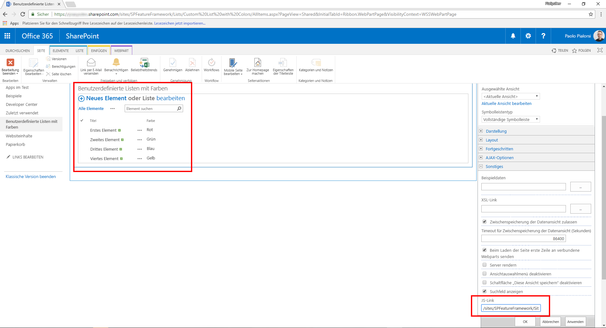
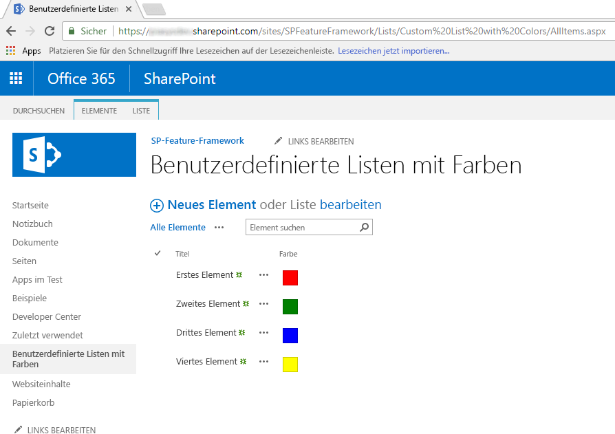
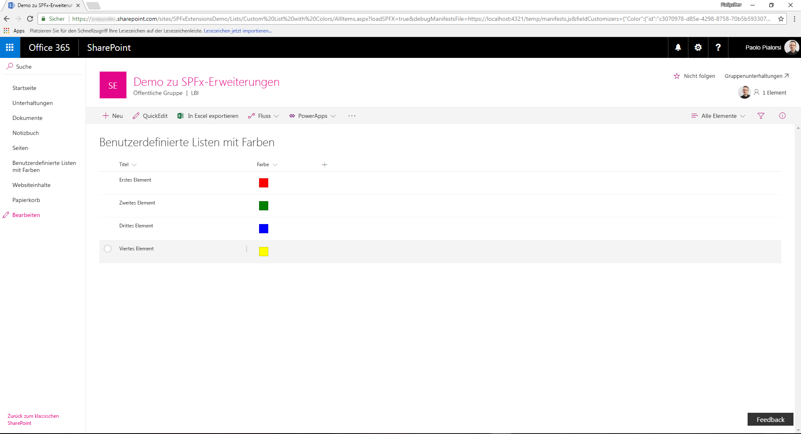
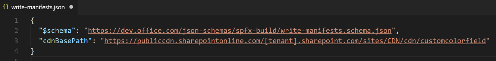
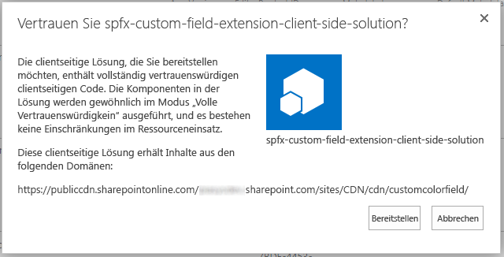
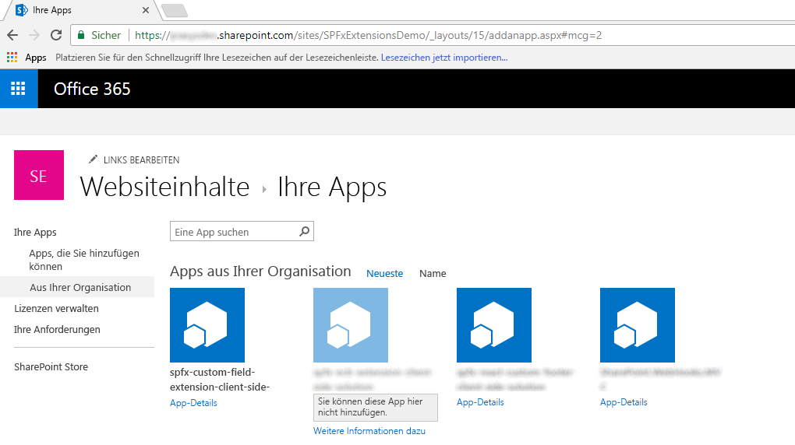
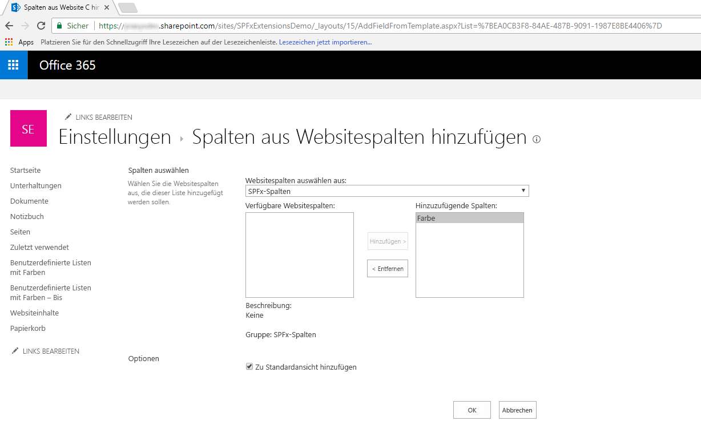
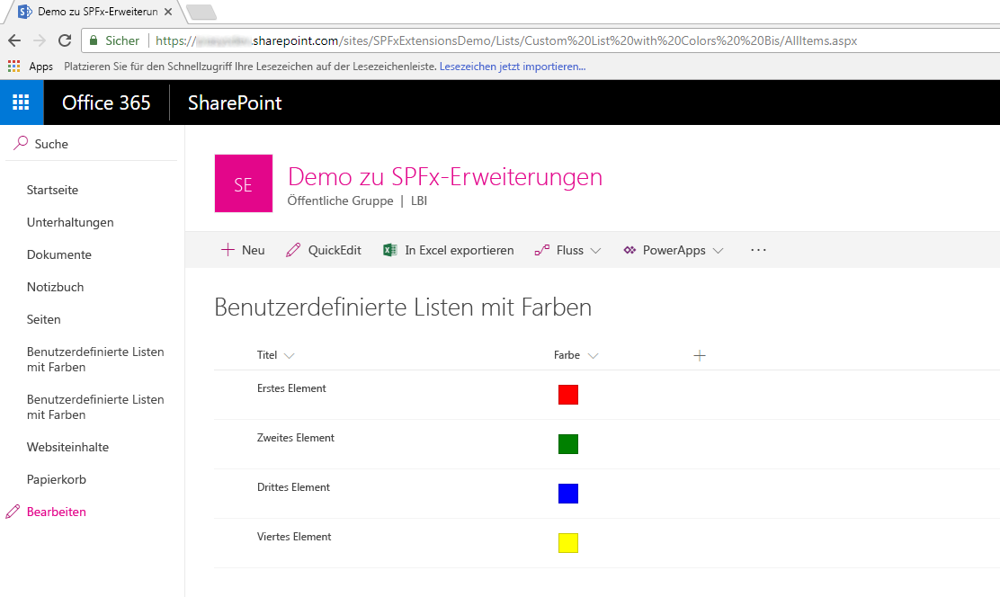

# <a name="migrating-from-jslink-to-sharepoint-framework-extensions"></a><span data-ttu-id="e1b9a-101">Migrieren von JSLink zu SharePoint-Framework-Erweiterungen</span><span class="sxs-lookup"><span data-stu-id="e1b9a-101">Migrating from JSLink to SharePoint Framework Extensions</span></span>

<span data-ttu-id="e1b9a-102">Seit der Microsoft SharePoint-Version 2013 nutzen die meisten Unternehmenslösungen, die auf Office 365 und SharePoint Online aufbauen, die _JSLink_-Eigenschaft von Feldern und Listenansichten, um das Rendern von Feldern anzupassen.</span><span class="sxs-lookup"><span data-stu-id="e1b9a-102">Since Microsoft SharePoint version 2013, most of the enterprise solutions built on top of Office 365 and SharePoint Online leveraged the _JSLink_ property of fields and list views to customize the rendering of fields.</span></span> <span data-ttu-id="e1b9a-103">Heute stehen die meisten dieser Anpassungsmöglichkeiten in der „modernen“ Benutzeroberfläche von SharePoint Online jedoch nicht mehr zur Verfügung.</span><span class="sxs-lookup"><span data-stu-id="e1b9a-103">However nowdays, within the new "modern" UI of SharePoint Online, most of those customizations are no more available.</span></span> <span data-ttu-id="e1b9a-104">Mit den neuen SharePoint-Framework-Erweiterungen können Sie fast die gleichen Funktionen auf der modernen Benutzeroberfläche bereitstellen.</span><span class="sxs-lookup"><span data-stu-id="e1b9a-104">Luckily, with the new SharePoint Framework Extensions you can now provide almost the same functionality in the "modern" UI.</span></span> <span data-ttu-id="e1b9a-105">In diesem Lernprogramm erfahren Sie, wie Sie die alten, klassischen Anpassungen zu dem neuen Modell basierend auf SharePoint-Framework-Erweiterungen migrieren können.</span><span class="sxs-lookup"><span data-stu-id="e1b9a-105">In this tutorial you will learn how to migrate from old "classic" customizations to the new model based on SharePoint Framework Extensions.</span></span>

> [!IMPORTANT]
> <span data-ttu-id="e1b9a-106">Das bedeutet nicht das Ende der Unterstützung für die klassische Benutzeroberfläche, es stehen weiterhin sowohl die klassische als auch die moderne Oberfläche zur Verfügung.</span><span class="sxs-lookup"><span data-stu-id="e1b9a-106">We're not deprecating the "classic" experience - both "classic" and "modern" will coexist.</span></span>

<span data-ttu-id="e1b9a-107">_**Gilt für: **SharePoint Online_</span><span class="sxs-lookup"><span data-stu-id="e1b9a-107">_**Applies to:** SharePoint Online_</span></span>

## <a name="understanding-sharepoint-framework-extensions"></a><span data-ttu-id="e1b9a-108">Grundlegendes zu SharePoint-Framework-Erweiterungen</span><span class="sxs-lookup"><span data-stu-id="e1b9a-108">Understanding SharePoint Framework Extensions</span></span>
<span data-ttu-id="e1b9a-109"><a name="spfxExtensions"> </a> Bei der Entwicklung von SharePoint-Framework-Erweiterungen sind folgende Optionen verfügbar:</span><span class="sxs-lookup"><span data-stu-id="e1b9a-109"><a name="spfxExtensions"> </a> First of all, let's introduce the available options when developing SharePoint Framework Extensions:</span></span>

* <span data-ttu-id="e1b9a-110">**Application Customizer**: Erweiterung der nativen modernen Benutzeroberfläche von SharePoint Online, indem benutzerdefinierte Elemente und clientseitiger Code den vordefinierten Platzhaltern der modernen Seiten hinzugefügt werden.</span><span class="sxs-lookup"><span data-stu-id="e1b9a-110">**Application Customizer**: extend the native "modern" UI of SharePoint Online by adding custom HTML elements and client-side code to pre-defined placeholders of "modern" pages.</span></span> <span data-ttu-id="e1b9a-111">Zu der Zeit, zu der dieser Artikel verfasst wurde, waren die verfügbaren Platzhalter die Kopf- und Fußzeile jeder modernen Seite.</span><span class="sxs-lookup"><span data-stu-id="e1b9a-111">At the time of this writing, the available placeholders are the header and the footer of every "modern" page.</span></span>
* <span data-ttu-id="e1b9a-112">**Command Set**: Benutzerdefinierte ECB-Menüelemente oder benutzerdefinierte Schaltflächen können der Befehlsleiste einer Listenansicht für eine Liste oder Bibliothek hinzugefügt werden.</span><span class="sxs-lookup"><span data-stu-id="e1b9a-112">**Command Set**: allow to add custom ECB menu items or custom buttons to the command bar of a list view for a list or a library.</span></span> <span data-ttu-id="e1b9a-113">Sie können diesen Befehlen eine JavaScript (TypeScript)-Aktion zuordnen.</span><span class="sxs-lookup"><span data-stu-id="e1b9a-113">You can associate any JavaScript (TypeScript) action to these commands.</span></span>
* <span data-ttu-id="e1b9a-114">**Field Customizer**: Anpassung der Darstellung eines Felds in einer Listenansicht mit benutzerdefinierten HTML-Elementen und clientseitigem Code.</span><span class="sxs-lookup"><span data-stu-id="e1b9a-114">**Field Customizer**: customize the rendering of a field in a list view using custom HTML elements and client-side code.</span></span>

<span data-ttu-id="e1b9a-115">Wie bereits aus der obigen Beschreibung hervorgeht, ist die „Field Customizer“-Erweiterung die nützlichste in diesem Kontext.</span><span class="sxs-lookup"><span data-stu-id="e1b9a-115">As you can argue from the above descriptions, the most useful one in our context is the "Field Customizer" extension.</span></span>

> [!NOTE]
> <span data-ttu-id="e1b9a-116">Weitere Informationen zum Erstellen von SharePoint-Framework-Erweiterungen finden Sie im Artikel [Übersicht über SharePoint-Framework-Erweiterungen](https://docs.microsoft.com/de-DE/sharepoint/dev/spfx/extensions/overview-extensions).</span><span class="sxs-lookup"><span data-stu-id="e1b9a-116">For further details about how to build SharePoint Framework Extensions you can read the article ["Overview of SharePoint Framework Extensions"](https://docs.microsoft.com/de-DE/sharepoint/dev/spfx/extensions/overview-extensions).</span></span>

## <a name="migrating-a-jslink-to-an-spfx-field-customizer"></a><span data-ttu-id="e1b9a-117">Migrieren von JSLink zum Field Customizer von SPFx</span><span class="sxs-lookup"><span data-stu-id="e1b9a-117">Migrating a JSLink to an SPFx Field Customizer</span></span>
<span data-ttu-id="e1b9a-118"><a name="FromJSLinktoFieldCustomizer"> </a> Nehmen Sie an, dass Sie sich in SharePoint Online befinden und Sie über eine benutzerdefinierte Liste mit einem angepassten Feld mit der Bezeichnung „Color“ verfügen, das den Typ _Choice_ hat und die folgenden Werte übernehmen kann: _Red_, _Green_, _Blue_, _Yellow_.</span><span class="sxs-lookup"><span data-stu-id="e1b9a-118"><a name="FromJSLinktoFieldCustomizer"> </a> Assume that you are in SharePoint Online, and you have a custom list with a custom field called "Color", which is of type _Choice_ and which can assume the following values: _Red_, _Green_, _Blue_, _Yellow_.</span></span> <span data-ttu-id="e1b9a-119">Nehmen Sie dann an, dass Sie einen benutzerdefinierten Wert für die _JSLink_-Eigenschaft des Webparts haben, das die Listenansicht der benutzerdefinierten Liste rendert.</span><span class="sxs-lookup"><span data-stu-id="e1b9a-119">Then, assume that you have custom value for the _JSLink_ property of the list view rendering web part of the custom list.</span></span> <span data-ttu-id="e1b9a-120">Im folgenden Codeausschnitt sehen Sie den JavaScript-Code, der von der _JSLink_-Eigenschaft (_customColorRendering.js_) referenziert wird.</span><span class="sxs-lookup"><span data-stu-id="e1b9a-120">In the following code snippet you can see the JavaScript code referenced by the _JSLink_ property (_customColorRendering.js_).</span></span>

```JavaScript
// Define a namespace for the custom rendering code
var customJSLinkRendering = customJSLinkRendering || {}; 

// Define a function that declare the custom rendering rules for the target list view
customJSLinkRendering.CustomizeFieldRendering = function () {  

    // Define a custom object to configure the rendering template overrides
    var customRenderingOverride = {};
    customRenderingOverride.Templates = {};
    customRenderingOverride.Templates.Fields = 
    { 
        // Declare the custom rendering function for the 'View' of field 'Color'
        'Color': 
        { 
            'View': customJSLinkRendering.RenderColorField 
        } 
    }; 

    // Register the custom rendering template
    SPClientTemplates.TemplateManager.RegisterTemplateOverrides(customRenderingOverride); 
}; 

// Declare the custom rendering function for the 'View' of field 'Color'
customJSLinkRendering.RenderColorField = function (context)  
{ 
    var colorField = context.CurrentItem.Color; 

    // Declare a local variable to hold the output color
    var color = '';

    // Evaluate the values of the 'Color' field and render it accordingly
    switch (colorField)
    {
        case 'Red':
            color = 'red';
            break;
        case 'Green':
            color = 'green';
            break;
        case 'Blue':
            color = 'blue';
            break;
        case 'Yellow':
            color = 'yellow';
            break;
        default:
            color = 'white';
            break;
    }

    // Render the output for the 'Color' field
    return "<div style='float: left; width: 20px; height: 20px; margin: 5px; border: 1px solid rgba(0,0,0,.2);background:" + color + "' />"; 
}; 

// Invoke the custom rendering function
customJSLinkRendering.CustomizeFieldRendering();
```

<span data-ttu-id="e1b9a-121">Im folgenden Screenshot sehen Sie darüber hinaus, wie JSLink im Listenansicht-Webpart konfiguriert ist.</span><span class="sxs-lookup"><span data-stu-id="e1b9a-121">Moreover, in the following screenshot you can see how the JSLink is configured in the list view web part.</span></span>



<span data-ttu-id="e1b9a-123">Wenn Sie die JavaScript-Datei in die Bibliothek _Site Assets_ hochgeladen haben, kann der Wert für die _JSLink_-Eigenschaft _~site/SiteAssets/customColorRendering.js_ lauten.</span><span class="sxs-lookup"><span data-stu-id="e1b9a-123">If you uploaded the JavaScript file into the _"Site Assets"_ library, the value for the _JSLink_ property can be _"~site/SiteAssets/customColorRendering.js"_.</span></span>
<span data-ttu-id="e1b9a-124">Hier sehen Sie, aus Gründen der Vollständigkeit, wie das benutzerdefinierte Rendern der Liste funktioniert.</span><span class="sxs-lookup"><span data-stu-id="e1b9a-124">And here, for the sake of completeness, you can see how the custom rendering of the list works.</span></span>



<span data-ttu-id="e1b9a-126">Wie Sie sehen können, rendern die Felder „Color“ auf der Elementebene ein farbiges Feld mit der ausgewählten Farbe.</span><span class="sxs-lookup"><span data-stu-id="e1b9a-126">As you can see "Color" fields render a colored box filled with the color selected at the item level.</span></span>

> [!NOTE]
> <span data-ttu-id="e1b9a-127">Um diese Art von Lösung für eine „klassische“ Website bereitstellen zu können, können Sie letztendlich eine PnP-Bereitstellungsvorlage verwenden, die sowohl die Liste mit dem benutzerdefinierten Feld als auch gleichzeitig die JSLink-Eigenschaft bereitstellen kann.</span><span class="sxs-lookup"><span data-stu-id="e1b9a-127">In order to provision this kind of solution in a "classic" site you can eventually use a PnP Provisioning Template, which can provision both the list with the custom field, and the JSLink at once.</span></span>

<span data-ttu-id="e1b9a-128">Um die oben aufgeführte Lösung in das SharePoint-Framework zu migrieren, müssen Sie die folgenden Schritte ausführen.</span><span class="sxs-lookup"><span data-stu-id="e1b9a-128">In order to migrate the above solution to the SharePoint Framework, you will have to accomplish the following steps.</span></span>

### <a name="create-a-new-sharepoint-framework-solution"></a><span data-ttu-id="e1b9a-129">Erstellen einer neuen SharePoint-Framework-Lösung</span><span class="sxs-lookup"><span data-stu-id="e1b9a-129">Create a new SharePoint Framework solution by running Yeoman SharePoint Generator:</span></span>
<span data-ttu-id="e1b9a-130"><a name="CreateFieldCustomizer"> </a> Nachdem Sie die Entwicklungsumgebung für SharePoint-Framework-Lösungen entsprechend den Anweisungen im Dokument [Einrichten Ihrer SharePoint-Entwicklungsumgebung für clientseitige Webparts](https://docs.microsoft.com/de-DE/sharepoint/dev/spfx/set-up-your-development-environment) eingerichtet haben, können Sie mit dem Erstellen einer SharePoint-Framework-Erweiterung beginnen.</span><span class="sxs-lookup"><span data-stu-id="e1b9a-130"><a name="CreateFieldCustomizer"> </a> Once you have prepared you development environment to develop SharePoint Framework solutions, by following the instructions provided in the document ["Set up your SharePoint client-side web part development environment"](https://docs.microsoft.com/de-DE/sharepoint/dev/spfx/set-up-your-development-environment), you can start creating a SharePoint Framework extension.</span></span>

1. <span data-ttu-id="e1b9a-131">Öffnen Sie ein beliebiges Befehlszeilentool (PowerShell, CMD.EXE, Cmder usw.), erstellen Sie einen neuen Ordner für die Lösung (mit dem Namen _spfx-custom-field-extension_), und erstellen Sie eine neue SharePoint-Framework-Lösung, indem Sie den Yeoman-Generator mit dem folgenden Befehl ausführen:</span><span class="sxs-lookup"><span data-stu-id="e1b9a-131">Open the command line tool of your choice (PowerShell, CMD.EXE, Cmder, etc.), create a new folder for the solution (call it _spfx-custom-field-extension_), and create a new SharePoint Framework solution by running the Yeoman generator with the following command:</span></span>

```
yo @microsoft/sharepoint
```

<span data-ttu-id="e1b9a-132">Geben Sie bei Aufforderung durch das Tool Folgendes an:</span><span class="sxs-lookup"><span data-stu-id="e1b9a-132">When prompted by the tool, provide the following answers:</span></span>
* <span data-ttu-id="e1b9a-133">Bestätigen Sie den Standardnamen (_spfx-custom-field-extension_) für Ihre Lösung, und drücken Sie die EINGABETASTE.</span><span class="sxs-lookup"><span data-stu-id="e1b9a-133">Accept the default app-extension as your solution name, and press Enter.</span></span>
* <span data-ttu-id="e1b9a-134">Wählen Sie „SharePoint Online only (latest)“, und drücken Sie die EINGABETASTE.</span><span class="sxs-lookup"><span data-stu-id="e1b9a-134">Choose SharePoint Online only (latest), and press Enter.</span></span>
* <span data-ttu-id="e1b9a-135">Wählen Sie „Use the current folder“ aus, und drücken Sie die EINGABETASTE.</span><span class="sxs-lookup"><span data-stu-id="e1b9a-135">Choose Use the current folder, and press Enter.</span></span>
* <span data-ttu-id="e1b9a-136">Wählen Sie „N“, damit die Erweiterung auf jeder Website explizit installiert werden muss, wenn sie verwendet wird.</span><span class="sxs-lookup"><span data-stu-id="e1b9a-136">Choose N to require the extension to be installed on each site explicitly when it's being used.</span></span>
* <span data-ttu-id="e1b9a-137">Wählen Sie „Extension“ als den zu erstellenden Typ von clientseitiger Komponente aus.</span><span class="sxs-lookup"><span data-stu-id="e1b9a-137">Choose Extension (Preview) as the client-side component type to be created.</span></span>
* <span data-ttu-id="e1b9a-138">Wählen Sie _Field Customizer_ als den zu erstellenden Erweiterungstyp aus.</span><span class="sxs-lookup"><span data-stu-id="e1b9a-138">Choose _Application Customizer (Preview)_ as the extension type to be created.</span></span>
* <span data-ttu-id="e1b9a-139">Geben Sie "CustomColorField" als Namen für Ihr benutzerdefiniertes Feld an.</span><span class="sxs-lookup"><span data-stu-id="e1b9a-139">Provide "CustomColorField" as the name for your Field Customizer.</span></span>
* <span data-ttu-id="e1b9a-140">Wählen Sie aus, dass kein bestimmtes JavaScript-Framework verwendet werden soll, indem Sie die Option _Kein JavaScript-Framework_ aktivieren.</span><span class="sxs-lookup"><span data-stu-id="e1b9a-140">Select to not use any specific JavaScript framework by selecting the _"No JavaScript framework"_ option.</span></span>


<span data-ttu-id="e1b9a-142">An diesem Punkt installiert Yeoman die erforderlichen Abhängigkeiten und erstellt ein Gerüst für die Lösungsdateien und Ordner sowie die _CustomColorField_-Erweiterung.</span><span class="sxs-lookup"><span data-stu-id="e1b9a-142">At this point, Yeoman will install the required dependencies and scaffold the solution files along with the _HelloWorld_ extension. This might take a few minutes.</span></span> <span data-ttu-id="e1b9a-143">Dies kann einige Minuten dauern.</span><span class="sxs-lookup"><span data-stu-id="e1b9a-143">This might take a few minutes.</span></span>

<span data-ttu-id="e1b9a-144">Nach Abschluss der Gerüsterstellung sollte folgende Erfolgsmeldung angezeigt werden:</span><span class="sxs-lookup"><span data-stu-id="e1b9a-144">When the scaffold is complete, you should see the following message indicating a successful scaffold:</span></span>


2. <span data-ttu-id="e1b9a-146">Führen Sie den folgenden Befehl aus, um die Version der Projektabhängigkeiten zu sperren:</span><span class="sxs-lookup"><span data-stu-id="e1b9a-146">To lock down the version of the project dependencies, run the following command:</span></span>

```
npm shrinkwrap
```

3. <span data-ttu-id="e1b9a-147">Starten Sie jetzt Visual Studio Code (oder einen anderen Code-Editor), und beginnen Sie mit der Entwicklung der Lösung.</span><span class="sxs-lookup"><span data-stu-id="e1b9a-147">Now start Visual Studio Code (or whatever else is the code editor of your choice) and start developing the solution.</span></span> <span data-ttu-id="e1b9a-148">Zum Starten von Visual Studio Code können Sie die folgende Anweisung ausführen.</span><span class="sxs-lookup"><span data-stu-id="e1b9a-148">To start Visual Studio Code, you can execute the following statement.</span></span>

```
code .
```

### <a name="define-the-new-field-customizer-with-javascript"></a><span data-ttu-id="e1b9a-149">Definieren des neuen Field Customizer mit JavaScript</span><span class="sxs-lookup"><span data-stu-id="e1b9a-149">Define the new Field Customizer with JavaScript</span></span>
<span data-ttu-id="e1b9a-150"><a name="DefineFieldCustomizerWithJavaScript"> </a>Um das gleiche Verhalten beim Rendern des benutzerdefinierten _JSLink_-Felds zu reproduzieren, müssen Sie einfach die gleiche Logik mit clientseitigem Code innerhalb der neuen SharePoint-Framework-Lösung implementieren.</span><span class="sxs-lookup"><span data-stu-id="e1b9a-150"><a name="DefineFieldCustomizerWithJavaScript"> </a> In order to reproduce the same behavior of the _JSLink_ custom field rendering, you simply need to implement the same logic using client-side code, within the new SharePoint Framework solution.</span></span> <span data-ttu-id="e1b9a-151">Gehen Sie hierzu wie folgt vor:</span><span class="sxs-lookup"><span data-stu-id="e1b9a-151">To accomplish this task, complete the following steps.</span></span>

1. <span data-ttu-id="e1b9a-152">Öffnen Sie zunächst die Datei _CustomColorFieldFieldCustomizer.manifest.json_ im Ordner _src/extensions/customColorField_.</span><span class="sxs-lookup"><span data-stu-id="e1b9a-152">First of all, open the file _CustomColorFieldFieldCustomizer.manifest.json_ under the _src/extensions/customColorField_ folder.</span></span> <span data-ttu-id="e1b9a-153">Kopieren Sie den Wert der Eigenschaft _id_, und bewahren Sie ihn an einem sicheren Ort auf, da Sie ihn später benötigen.</span><span class="sxs-lookup"><span data-stu-id="e1b9a-153">Copy the value of the _id_ property and store it in a safe place, because you will need it later.</span></span>

2. <span data-ttu-id="e1b9a-154">Öffnen Sie jetzt die Datei _CustomColorFieldFieldCustomizer.ts_, die sich in demselben Ordner wie zuvor befindet, und bearbeiten Sie den Inhalt entsprechend dem folgenden Codeauszug.</span><span class="sxs-lookup"><span data-stu-id="e1b9a-154">Now, open the _CustomColorFieldFieldCustomizer.ts_ file, still under the same folder as before and edit the content accordingly to the following code excerpt.</span></span>

``` TypeScript
import { Log } from '@microsoft/sp-core-library';
import { override } from '@microsoft/decorators';
import {
  BaseFieldCustomizer,
  IFieldCustomizerCellEventParameters
} from '@microsoft/sp-listview-extensibility';

import * as strings from 'CustomColorFieldFieldCustomizerStrings';
import styles from './CustomColorFieldFieldCustomizer.module.scss';

/**
 * If your field customizer uses the ClientSideComponentProperties JSON input,
 * it will be deserialized into the BaseExtension.properties object.
 * You can define an interface to describe it.
 */
export interface ICustomColorFieldFieldCustomizerProperties {
  // This is an example; replace with your own property
  sampleText?: string;
}

const LOG_SOURCE: string = 'CustomColorFieldFieldCustomizer';

export default class CustomColorFieldFieldCustomizer
  extends BaseFieldCustomizer<ICustomColorFieldFieldCustomizerProperties> {

  @override
  public onInit(): Promise<void> {
    // Add your custom initialization to this method.  The framework will wait
    // for the returned promise to resolve before firing any BaseFieldCustomizer events.
    Log.info(LOG_SOURCE, 'Activated CustomColorFieldFieldCustomizer with properties:');
    Log.info(LOG_SOURCE, JSON.stringify(this.properties, undefined, 2));
    Log.info(LOG_SOURCE, `The following string should be equal: "CustomColorFieldFieldCustomizer" and "${strings.Title}"`);
    return Promise.resolve();
  }

  @override
  public onRenderCell(event: IFieldCustomizerCellEventParameters): void {

    var colorField = event.fieldValue; 
    
    // Declare a local variable to hold the output color
    var color = '';

    // Evaluate the values of the 'Color' field and render it accordingly
    switch (colorField)
    {
        case 'Red':
            color = 'red';
            break;
        case 'Green':
            color = 'green';
            break;
        case 'Blue':
            color = 'blue';
            break;
        case 'Yellow':
            color = 'yellow';
            break;
        default:
            color = 'white';
            break;
    }
    
    // Render the output for the 'Color' field
    event.domElement.innerHTML = "<div style='float: left; width: 20px; height: 20px; margin: 5px; border: 1px solid rgba(0,0,0,.2);background:" + color + "' />"; 
  }

  @override
  public onDisposeCell(event: IFieldCustomizerCellEventParameters): void {
    // This method should be used to free any resources that were allocated during rendering.
    // For example, if your onRenderCell() called ReactDOM.render(), then you should
    // call ReactDOM.unmountComponentAtNode() here.
    super.onDisposeCell(event);
  }
}
```

<span data-ttu-id="e1b9a-155">Wie Sie sehen können, ist der Inhalt der Methode _onRenderCell_ fast identisch mit der vorherigen _RenderColorField_-Methode in der _JSLink_-Implementierung.</span><span class="sxs-lookup"><span data-stu-id="e1b9a-155">As you can see, the content of method _onRenderCell_ is almost the same of the previous _RenderColorField_ method in the _JSLink_ implementation.</span></span>
<span data-ttu-id="e1b9a-156">Die einzigen Unterschiede sind:</span><span class="sxs-lookup"><span data-stu-id="e1b9a-156">The only differences are:</span></span>
- <span data-ttu-id="e1b9a-157">Um den aktuellen Feldwert abzurufen, müssen Sie die _event.fieldValue_-Eigenschaft des Eingabearguments der _onRenderCell_-Methode lesen.</span><span class="sxs-lookup"><span data-stu-id="e1b9a-157">To retrieve the current field value you need to read the _event.fieldValue_ property of the input argument of the _onRenderCell_ method.</span></span>
- <span data-ttu-id="e1b9a-158">Um den benutzerdefinierten HTML-Code zum Rendern des Felds zurückzugeben, müssen Sie der _innerHTML_-Eigenschaft des _event.domElement_-Objekts einen Wert zuweisen, der den Ausgabe-HTML-Container des Feldrenderings darstellt.</span><span class="sxs-lookup"><span data-stu-id="e1b9a-158">To return the custom HTML code to render the field, you need to assign a value to the _innerHTML_ property of the _event.domElement_ object, which represents the output HTML container of the field rendering.</span></span>

<span data-ttu-id="e1b9a-159">Abgesehen von diesen geringfügigen Änderungen können Sie fast den gesamten JavaScript-Code wie zuvor verwenden.</span><span class="sxs-lookup"><span data-stu-id="e1b9a-159">Aside from these small changes, you can reuse almost the same JavaScript code as before.</span></span>

<span data-ttu-id="e1b9a-160">Die folgende Abbildung zeigt die resultierende Ausgabe.</span><span class="sxs-lookup"><span data-stu-id="e1b9a-160">In the following figure you can see the resulting output.</span></span>



### <a name="test-the-solution-in-debug-mode"></a><span data-ttu-id="e1b9a-162">Testen der Lösung im Debugmodus</span><span class="sxs-lookup"><span data-stu-id="e1b9a-162">Test and run the console application in debug mode.</span></span>
<span data-ttu-id="e1b9a-163"><a name="DebugFieldCustomizer"> </a> Sie können die Lösung jetzt im Debugmodus testen.</span><span class="sxs-lookup"><span data-stu-id="e1b9a-163"><a name="DebugFieldCustomizer"> </a> You are now ready to test your solution in debug mode.</span></span> 

1. <span data-ttu-id="e1b9a-164">Kehren Sie zum Konsolenfenster zurück, und führen Sie den folgenden Befehl aus:</span><span class="sxs-lookup"><span data-stu-id="e1b9a-164">Return to the console and run the following command:</span></span>

```
gulp serve --nobrowser
```

<span data-ttu-id="e1b9a-165">Der oben angegebene Befehl erstellt die Lösung und führt den lokalen Node.js-Server aus, um sie zu hosten.</span><span class="sxs-lookup"><span data-stu-id="e1b9a-165">The above command will build the solution and run the local Node.js server to host it.</span></span>

2. <span data-ttu-id="e1b9a-166">Öffnen Sie nun Ihren bevorzugten Browser, und wechseln Sie zu einer „modernen“ Liste, die über ein benutzerdefiniertes Feld mit dem Namen _Color_ verfügt, und geben Sie _Choice_ mit den gleichen Werten wie zuvor ein (Red, Green, Blue, Yellow).</span><span class="sxs-lookup"><span data-stu-id="e1b9a-166">Now open your favorite browser and go to a "modern" list, which has a custom field with name _"Color"_ and type _Choice_ with the same value options as before (Red, Green, Blue, Yellow).</span></span> <span data-ttu-id="e1b9a-167">Sie können letztendlich die Liste verwenden, die Sie in der „klassischen“ Website erstellt haben, und sie einfach in der „modernen“ Benutzerumgebung anzeigen.</span><span class="sxs-lookup"><span data-stu-id="e1b9a-167">You can eventually use the list you created in the "classic" site, just viewing it with the new "modern" experience.</span></span> <span data-ttu-id="e1b9a-168">Hängen Sie jetzt die folgenden Abfragezeichenfolgeparameter an die _AllItems.aspx_-Seiten-URL an.</span><span class="sxs-lookup"><span data-stu-id="e1b9a-168">Now, append the following querystring parameters to the _AllItems.aspx_ page URL.</span></span>

```
?loadSPFX=true&debugManifestsFile=https://localhost:4321/temp/manifests.js&fieldCustomizers={"Color":{"id":"c3070978-d85e-4298-8758-70b5b5933076"}}
```

<span data-ttu-id="e1b9a-169">In der oben aufgeführten Abfragezeichenfolge müssen Sie die GUID durch den _id_-Wert aus der Datei _CustomColorFieldFieldCustomizer.manifest.json_ ersetzen, den Sie zuvor gespeichert oder notiert haben. Der _Color_-Objektname bezieht sich auf das anzupassende Feld.</span><span class="sxs-lookup"><span data-stu-id="e1b9a-169">In the above querystring, you will have to replace the GUID with the _id_ value you saved from the _CustomColorFieldFieldCustomizer.manifest.json_ file, and the _"Color"_ object name refers to the name of the field to customize.</span></span> <span data-ttu-id="e1b9a-170">Wenn Sie möchten, können Sie auch ein benutzerdefiniertes Konfigurationsobjekt, das im JSON-Format serialisiert ist, als einen zusätzlichen Parameter für die Field Customizer-Konstruktion bereitstellen.</span><span class="sxs-lookup"><span data-stu-id="e1b9a-170">If you like, you can also provide a custom configuration object, serialized in JSON format, as an additional parameter for the field customizer construction.</span></span>

<span data-ttu-id="e1b9a-171">Beachten Sie, dass beim Ausführen der Seitenanforderung ein Warnmeldungsfeld „Debugskripts zulassen?“ angezeigt wird, in dem Sie aus Sicherheitsgründen nach der Zustimmung für die Ausführung des Codes von Localhost gefragt werden.</span><span class="sxs-lookup"><span data-stu-id="e1b9a-171">Notice that, when executing the page request, you will be prompted with a warning message box with title "Allow debug scripts?", which asks your consent to run code from localhost, for security reasons.</span></span> <span data-ttu-id="e1b9a-172">Wenn Sie lokal debuggen und testen möchten, müssen Sie das Laden von Debugskripts zulassen.</span><span class="sxs-lookup"><span data-stu-id="e1b9a-172">Of course, if you want to locally debug and test the solution, you will have to allow to "Load debug scripts".</span></span>

### <a name="define-the-new-field-customizer-with-typescript"></a><span data-ttu-id="e1b9a-173">Definieren des neuen Field Customizer mit TypeScript</span><span class="sxs-lookup"><span data-stu-id="e1b9a-173">Define the new Field Customizer with TypeScript</span></span>
<span data-ttu-id="e1b9a-174"><a name="DefineFieldCustomizerWithTypeScript"> </a> Sie können nun den JavaScript-Code durch TypeScript ersetzen, um die Vorteile von TypeScript optimal nutzen zu können.</span><span class="sxs-lookup"><span data-stu-id="e1b9a-174"><a name="DefineFieldCustomizerWithTypeScript"> </a> You are now ready to replace the JavaScript code with TypeScript, in order to benefit of the fully typed approach of TypeScript.</span></span>

1. <span data-ttu-id="e1b9a-175">Öffnen Sie die Datei _CustomColorFieldFieldCustomizer.module.scss_ im Ordner _src/extensions/customColorField_.</span><span class="sxs-lookup"><span data-stu-id="e1b9a-175">Open the file _CustomColorFieldFieldCustomizer.module.scss_ under the _src/extensions/customColorField_ folder.</span></span> <span data-ttu-id="e1b9a-176">Diese Datei, eine Sassy CSS, stellt den Stil der Benutzeroberfläche für den Field Customizer dar.</span><span class="sxs-lookup"><span data-stu-id="e1b9a-176">This file, which is a Sassy CSS, represents the UI style for the field customizer.</span></span> <span data-ttu-id="e1b9a-177">Ersetzen Sie den Inhalt der SCSS-Datei durch den folgenden:</span><span class="sxs-lookup"><span data-stu-id="e1b9a-177">Replace the contents of the file with the following code.</span></span>

``` SCSS
.CustomColorField {
  .cell {
    float: left;
    width: 20px; 
    height: 20px; 
    margin: 5px; 
    border: 1px solid rgba(0,0,0,.2);
  }

  .cellRed {
    background: red;
  }

  .cellGreen {
    background: green;
  }

  .cellBlue {
    background: blue;
  }

  .cellYellow {
    background: yellow;
  }

  .cellWhite {
    background: white;
  }
}
```

2. <span data-ttu-id="e1b9a-178">Ersetzen Sie die Implementierung der _onRenderCell_-Methode durch den folgenden Codeausschnitt.</span><span class="sxs-lookup"><span data-stu-id="e1b9a-178">Replace the default implementation of the _Validate_ method in the file with the following code.</span></span>

``` TypeScript
@override
public onRenderCell(event: IFieldCustomizerCellEventParameters): void {

// Read the current field value
let colorField: String = event.fieldValue; 

// Add the main style to the field container element
event.domElement.classList.add(styles.CustomColorField);

// Get a reference to the output HTML
let fieldHtml: HTMLDivElement = event.domElement.firstChild as HTMLDivElement;

// Add the standard style
fieldHtml.classList.add(styles.cell);

// Add the colored style
switch(colorField)
{
    case "Red":
    fieldHtml.classList.add(styles.cellRed);
    break;
    case "Green":
    fieldHtml.classList.add(styles.cellGreen);
    break;
    case "Blue":
    fieldHtml.classList.add(styles.cellBlue);
    break;
    case "Yellow":
    fieldHtml.classList.add(styles.cellYellow);
    break;
    default:
    fieldHtml.classList.add(styles.cellWhite);
    break;
}
}
```

<span data-ttu-id="e1b9a-179">Beachten Sie, dass die neue Methodenimplementierung einen vollständig typisierten Ansatz verwendet und die CSS-Klasse _cell_ dem untergeordneten _DIV_-Element des aktuellen Feldelements zusammen mit einer anderen CSS-Klasse zuweist, um die Zielfarbe von _DIV_ basierend auf dem derzeit ausgewählten Feldwert zu definieren.</span><span class="sxs-lookup"><span data-stu-id="e1b9a-179">Notice that the new method implementation uses a fully typed approach, and assigns the _"cell"_ CSS class to the _DIV_ element child of the current field element, together with another custom CSS class to define the target color of the _DIV_ based on the currently selected value for the field.</span></span>

3. <span data-ttu-id="e1b9a-180">Führen Sie den Field Customizer noch einmal im Debugmodus aus, und sehen Sie sich das Ergebnis an.</span><span class="sxs-lookup"><span data-stu-id="e1b9a-180">Run one more time in debug mode the field customizer and see the result.</span></span>

### <a name="package-and-host-the-solution"></a><span data-ttu-id="e1b9a-181">Packen und Hosten der Lösung</span><span class="sxs-lookup"><span data-stu-id="e1b9a-181">Package and host the solution</span></span>
<span data-ttu-id="e1b9a-182"><a name="PackageAndHostCommandSet"> </a> Wenn Sie mit dem Ergebnis zufrieden sind, können Sie die Lösung nun packen und in der eigentlichen Hostinginfrastruktur hosten.</span><span class="sxs-lookup"><span data-stu-id="e1b9a-182"><a name="PackageAndHostCommandSet"> </a> If you are happy with the result, you are now ready to package the solution and host it in a real hosting infrastructure.</span></span>
<span data-ttu-id="e1b9a-183">Bevor Sie das Bundle und das Paket erstellen, müssen Sie eine XML-Feature Frameworkdatei deklarieren, um die Erweiterung bereitzustellen.</span><span class="sxs-lookup"><span data-stu-id="e1b9a-183">Before building the bundle and the package, you need to declare an XML feature framework file to provision the extension.</span></span>

#### <a name="review-feature-framework-elements"></a><span data-ttu-id="e1b9a-184">Überprüfen von Feature-Framework-Elementen</span><span class="sxs-lookup"><span data-stu-id="e1b9a-184">Review feature framework elements</span></span>
<span data-ttu-id="e1b9a-185">Öffnen Sie im Code-Editor den Unterordner _/sharepoint/assets_ der Lösung, und bearbeiten Sie die Datei _elements.xml_.</span><span class="sxs-lookup"><span data-stu-id="e1b9a-185">Within the code editor, open the _/sharepoint/assets_ sub-folder of the solution folder and edit the _elements.xml_ file.</span></span>
<span data-ttu-id="e1b9a-186">Der folgende Codeauszug gibt an, wie die Datei aussehen sollte.</span><span class="sxs-lookup"><span data-stu-id="e1b9a-186">In the following code excerpt you can see how the file should look like.</span></span>

```XML
<?xml version="1.0" encoding="utf-8"?>
<Elements xmlns="http://schemas.microsoft.com/sharepoint/">
    <Field ID="{40475661-efaf-447a-a220-c992b20ec1c3}"
            Name="SPFxColor"
            DisplayName="Color"
            Title="Color"
            Type="Choice"
            Required="FALSE"
            Group="SPFx Columns"
            ClientSideComponentId="c3070978-d85e-4298-8758-70b5b5933076">
    </Field>
</Elements>
```

<span data-ttu-id="e1b9a-187">Wie Sie sehen, ähnelt sie der SharePoint-Feature-Framework-Datei. Sie definiert ein benutzerdefiniertes _Field_-Element mit dem Feldtyp _Choice_, der das _ClientSideComponentId_-Attribut zum Veweisen auf die _id_ des Field Customizer verwendet. Es könnte auch ein _ClientSideComponentProperties_-Attribut vorhanden sein, um die für die Erweiterung erforderlichen benutzerdefinierten Konfigurationseigenschaften zu konfigurieren.</span><span class="sxs-lookup"><span data-stu-id="e1b9a-187">As you can see, it reminds a SharePoint Feature Framework file, it defines a custom _Field_ element with a field type _Choice_, which uses the _ClientSideComponentId_ attribute to reference the _id_ of the field customizer, and there could be a _ClientSideComponentProperties_ attribute, to configure the custom configuration properties required by the extension.</span></span>

<span data-ttu-id="e1b9a-188">Öffnen Sie jetzt die Datei _package-solution.json_ im Lösungsordner _/config_.</span><span class="sxs-lookup"><span data-stu-id="e1b9a-188">Now, open the _package-solution.json_ file under the _/config_ folder of the solution.</span></span> <span data-ttu-id="e1b9a-189">In der Datei können Sie sehen, dass ein Verweis auf die _elements.xml_ im Abschnitt _assets_ vorhanden ist.</span><span class="sxs-lookup"><span data-stu-id="e1b9a-189">Within the file you can see that there is a reference to the _elements.xml_ file, within the _assets_ section.</span></span>

```JSON
{
  "$schema": "https://dev.office.com/json-schemas/spfx-build/package-solution.schema.json",
  "solution": {
    "name": "spfx-custom-field-extension-client-side-solution",
    "id": "ab0fbbf8-01ba-4633-8498-46cfd5652619",
    "version": "1.0.0.0",
    "features": [
      {
        "title": "Application Extension - Deployment of custom action.",
        "description": "Deploys a custom action with ClientSideComponentId association",
        "id": "090dc976-878d-44fe-8f8e-ac603d094aa1",
        "version": "1.0.0.0",
        "assets": {
          "elementManifests": [
            "elements.xml"
          ]
        }
      }
    ]
  },
  "paths": {
    "zippedPackage": "solution/spfx-custom-field-extension.sppkg"
  }
}
```

#### <a name="enable-the-cdn-in-your-office-365-tenant"></a><span data-ttu-id="e1b9a-190">Aktivieren des CDN im Office 365-Mandanten</span><span class="sxs-lookup"><span data-stu-id="e1b9a-190">Enable CDN in your Office 365 tenant</span></span>
<span data-ttu-id="e1b9a-191">Sie müssen die Erweiterung nun in einer Hostingumgebung hosten.</span><span class="sxs-lookup"><span data-stu-id="e1b9a-191">Now you need to host the extension in a hosting environment.</span></span> <span data-ttu-id="e1b9a-192">Office 365 CDN ist die einfachste Möglichkeit, SharePoint-Framework-Lösungen direkt von Ihrem Mandanten aus zu hosten und dabei weiterhin die Vorteile des CDN (Content Delivery Network) zum schnelleren Laden der Objekte zu nutzen.</span><span class="sxs-lookup"><span data-stu-id="e1b9a-192">Office 365 CDN is the easiest way to host SharePoint Framework solutions directly from your tenant while still taking advantage of the Content Delivery Network (CDN) service for faster load times of your assets.</span></span>

1. <span data-ttu-id="e1b9a-193">Laden Sie die [SharePoint Online-Verwaltungsshell](https://www.microsoft.com/en-us/download/details.aspx?id=35588) herunter, um sicherzustellen, dass Sie die neueste Version verwenden.</span><span class="sxs-lookup"><span data-stu-id="e1b9a-193">Download the [SharePoint Online Management Shell](https://www.microsoft.com/en-us/download/details.aspx?id=35588) to ensure that you have the latest version.</span></span>

2. <span data-ttu-id="e1b9a-194">Verbinden Sie sich über PowerShell mit Ihrem SharePoint Online-Mandanten:</span><span class="sxs-lookup"><span data-stu-id="e1b9a-194">Connect to your SharePoint Online tenant through PowerShell:</span></span>
    
    ```
    Connect-SPOService -Url https://[tenant]-admin.sharepoint.com
    ```
    
3. <span data-ttu-id="e1b9a-195">Führen Sie nacheinander die folgenden Befehle aus, um den aktuellen Status der auf Mandantenebene festgelegten Einstellungen für öffentliche CDNs abzurufen:</span><span class="sxs-lookup"><span data-stu-id="e1b9a-195">Get the current status of public CDN settings from the tenant level by executing the following commands one-by-one.</span></span> 
    
    ```
    Get-SPOTenantCdnEnabled -CdnType Public
    Get-SPOTenantCdnOrigins -CdnType Public
    Get-SPOTenantCdnPolicies -CdnType Public
    ```
    
4. <span data-ttu-id="e1b9a-196">Aktivieren Sie öffentliche CDNs im Mandanten:</span><span class="sxs-lookup"><span data-stu-id="e1b9a-196">Enable public CDN in the tenant</span></span>
    
    ```
    Set-SPOTenantCdnEnabled -CdnType Public
    ```
    
    <span data-ttu-id="e1b9a-197">Jetzt sind öffentliche CDNs im Mandanten aktiviert, mit der Standardkonfiguration für zulässige Dateitypen.</span><span class="sxs-lookup"><span data-stu-id="e1b9a-197">Public CDN has now been enabled in the tenant by using the default file type configuration allowed.</span></span> <span data-ttu-id="e1b9a-198">Dies bedeutet, dass die folgenden Dateitypen unterstützt werden: CSS, EOT, GIF, ICO, JPEG, JPG, JS, MAP, PNG, SVG, TTF und WOFF.</span><span class="sxs-lookup"><span data-stu-id="e1b9a-198">Now public CDN has been enabled in the tenant using the default file type configuration allowed. This means that the following file type extensions are supported: "CSS,EOT,GIF,ICO,JPEG,JPG,JS,MAP,PNG,SVG,TTF,WOFF".</span></span>

5. <span data-ttu-id="e1b9a-p120">Öffnen Sie einen Browser, und navigieren Sie zu der Websitesammlung, in der Sie Ihre CDN-Bibliothek hosten möchten. Das kann jede beliebige Websitesammlung in Ihrem Mandanten sein. In diesem Tutorial erstellen Sie eine spezifische Bibliothek, die als Ihre CDN-Bibliothek fungiert. Sie können aber auch einen spezifischen Ordner in einer beliebigen bereits vorhandenen Dokumentbibliothek als CDN-Endpunkt nutzen.</span><span class="sxs-lookup"><span data-stu-id="e1b9a-p120">Open up a browser and move to a site collection where you'd like to host your CDN library. This could be any site collection in your tenant. In this tutorial, we will create a specific library to act as your CDN library, but you can also use a specific folder in any existing document library as the CDN endpoint.</span></span>

6. <span data-ttu-id="e1b9a-202">Erstellen Sie in Ihrer Websitesammlung eine neue Dokumentbibliothek namens _CDN_, und fügen Sie ihr einen Ordner namens _customcolorfield_ hinzu.</span><span class="sxs-lookup"><span data-stu-id="e1b9a-202">Create a new document library on your site collection called _CDN_ and add a folder named _helloworld_ to it.</span></span>
    
7. <span data-ttu-id="e1b9a-203">Fügen Sie in der PowerShell-Konsole einen neuen CDN-Ursprung hinzu.</span><span class="sxs-lookup"><span data-stu-id="e1b9a-203">In the PowerShell console, add a new CDN origin.</span></span> <span data-ttu-id="e1b9a-204">In diesem Fall legen Sie als Ursprung `*/cdn` fest; auf diese Weise fungieren alle relativen Ordner mit dem Namen _cdn_ als ein CDN-Ursprung.</span><span class="sxs-lookup"><span data-stu-id="e1b9a-204">Move back to the PowerShell console and add a new CDN origin. In this case, we are setting the origin as `*/cdn`, which means that any relative folder with the name of _cdn_ will act as a CDN origin.</span></span>
    
    ```
    Add-SPOTenantCdnOrigin -CdnType Public -OriginUrl */cdn
    ```
    
8. <span data-ttu-id="e1b9a-205">Führen Sie den folgenden Befehl aus, um eine Liste aller CDN-Ursprünge von Ihrem Mandanten abzurufen:</span><span class="sxs-lookup"><span data-stu-id="e1b9a-205">Execute the following command to get the list of CDN origins from your tenant</span></span>
    
    ```
    Get-SPOTenantCdnOrigins -CdnType Public
    ```
    
<span data-ttu-id="e1b9a-206">Sie sehen, dass der neu hinzugefügte Ursprung als gültiger CDN-Ursprung aufgeführt ist.</span><span class="sxs-lookup"><span data-stu-id="e1b9a-206">Note that your newly added origin is listed as a valid CDN origin.</span></span> <span data-ttu-id="e1b9a-207">Die endgültige Konfiguration des Ursprungs dauert ca. 15 Minuten. Während Sie warten, können Sie mit dem Bereitstellen der Erweiterung fortfahren, die anschließend im Ursprung gehostet wird.</span><span class="sxs-lookup"><span data-stu-id="e1b9a-207">Final configuration of the origin takes approximately 15 minutes, so we can continue provisioning the extension, which will be hosted from the origin after deployment is completed.</span></span> 


<span data-ttu-id="e1b9a-209">Sobald der Ursprung nicht mehr mit `(configuration pending)` gekennzeichnet ist, kann er in Ihrem Mandanten verwendet werden.</span><span class="sxs-lookup"><span data-stu-id="e1b9a-209">When origin is listed without the (configuration pending)`(configuration pending)` text, it is ready to be used in your tenant. This is the indication of an on-going configuration between SharePoint Online and CDN system.</span></span> <span data-ttu-id="e1b9a-210">Dieser Text weist auf laufende Konfigurationsaktivitäten zwischen SharePoint Online und dem CDN-System hin.</span><span class="sxs-lookup"><span data-stu-id="e1b9a-210">This indicates an on-going configuration between SharePoint Online and the CDN system.</span></span> 

#### <a name="update-the-solution-settings-and-publish-it-on-the-cdn"></a><span data-ttu-id="e1b9a-211">Aktualisieren der Lösungseinstellungen und Veröffentlichen im CDN</span><span class="sxs-lookup"><span data-stu-id="e1b9a-211">Update the solution settings and publish it on the CDN</span></span>
<span data-ttu-id="e1b9a-212">Sie müssen die Lösung jetzt aktualisieren, damit Sie das gerade erstellte CDN als Hostingumgebung verwenden können. Sie müssen das Lösungsbundle im CDN veröffentlichen.</span><span class="sxs-lookup"><span data-stu-id="e1b9a-212">Now, you need to update the solution in order to use the just created CDN as the hosting enviroment and you will need to publish the solution bundle to the CDN.</span></span> <span data-ttu-id="e1b9a-213">Gehen Sie hierzu wie nachfolgend beschrieben vor.</span><span class="sxs-lookup"><span data-stu-id="e1b9a-213">To accomplish this task, just follow the upcoming steps.</span></span>

1. <span data-ttu-id="e1b9a-214">Kehren Sie zu der zuvor erstellten Lösung zurück, um die erforderliche URL-Updates auszuführen.</span><span class="sxs-lookup"><span data-stu-id="e1b9a-214">Return to the previously created solution to perform the needed URL updates.</span></span>
    
2. <span data-ttu-id="e1b9a-215">Aktualisieren Sie die Datei _write-manifests.json_ (im Ordner _config_) wie unten dargestellt, damit sie auf Ihren CDN-Endpunkt verweist.</span><span class="sxs-lookup"><span data-stu-id="e1b9a-215">Update the _write-manifests.json_ file (under the _config_ folder) as follows to point to your CDN endpoint.</span></span> <span data-ttu-id="e1b9a-216">Verwenden Sie `publiccdn.sharepointonline.com` als Präfix, und erweitern Sie dann die URL um den tatsächlichen Pfad Ihres Mandanten.</span><span class="sxs-lookup"><span data-stu-id="e1b9a-216">You will need to use the publiccdn.sharepointonline.com as the prefix and then extend the URL with the actual path of your tenant</span></span> <span data-ttu-id="e1b9a-217">Die CDN-URL hat folgendes Format:</span><span class="sxs-lookup"><span data-stu-id="e1b9a-217">Format of the CDN URL is as follows</span></span>
    
    ```
    https://publiccdn.sharepointonline.com/[tenant host name]/sites/[site]/[library]/[folder]
    ```
    
    

3. <span data-ttu-id="e1b9a-219">Speichern Sie Ihre Änderungen.</span><span class="sxs-lookup"><span data-stu-id="e1b9a-219">Save your changes.</span></span>

4. <span data-ttu-id="e1b9a-220">Führen Sie die folgende Aufgabe aus, um Ihre Lösung in einem Bundle zu verpacken.</span><span class="sxs-lookup"><span data-stu-id="e1b9a-220">Execute the following tasks to bundle your solution</span></span> <span data-ttu-id="e1b9a-221">Es wird ein Releasebuild Ihres Projekts ausgeführt, unter Verwendung der in der Datei _write-manifests.json_ angegebenen CDN-URL.</span><span class="sxs-lookup"><span data-stu-id="e1b9a-221">This executes a release build of your project using the CDN URL specified in the _write-manifests.json_ file.</span></span> <span data-ttu-id="e1b9a-222">Die Ausgabe dieses Befehls finden Sie im Ordner _./temp/deploy_.</span><span class="sxs-lookup"><span data-stu-id="e1b9a-222">The output of this command is located in the _./temp/deploy_ folder.</span></span> <span data-ttu-id="e1b9a-223">Dies sind die Dateien, die Sie in den SharePoint-Ordner hochladen müssen, der als CDN-Endpunkt fungiert.</span><span class="sxs-lookup"><span data-stu-id="e1b9a-223">These are the files that you need to upload to the SharePoint folder acting as your CDN endpoint.</span></span> 
    
    ```
    gulp bundle --ship
    ```
    
5. <span data-ttu-id="e1b9a-224">Führen Sie die folgende Aufgaben aus, um Ihre Lösung zu packen.</span><span class="sxs-lookup"><span data-stu-id="e1b9a-224">Execute the following task to package your solution</span></span> <span data-ttu-id="e1b9a-225">Dieser Befehl erstellt ein Paket namens _spfx-custom-field-extension.sppkg_ im Ordner _sharepoint/solution_ und bereitet außerdem die Ressourcen im Ordner _temp/deploy_ für die Bereitstellung im CDN vor.</span><span class="sxs-lookup"><span data-stu-id="e1b9a-225">This command will create an _app-extension.sppkg_ package in the _sharepoint/solution_ folder and also prepare the assets in the _temp/deploy_ folder to be deployed to the CDN.</span></span>
    
    ```
    gulp package-solution --ship
    ```
    
6. <span data-ttu-id="e1b9a-226">Laden Sie das neu erstellte Paket mit ihrer clientseitigen Lösung in den App-Katalog in Ihrem Mandanten hoch. Alternativ können Sie es auch per Drag-and-Drop verschieben. Klicken Sie auf die Schaltfläche _Bereitstellen_.</span><span class="sxs-lookup"><span data-stu-id="e1b9a-226">Upload or drag & drop the newly created client-side solution package to the app catalog in your tenant. Click the _Deploy_ button.</span></span>

    

7. <span data-ttu-id="e1b9a-228">Laden Sie die Dateien im Ordner _temp/deploy_ in den Ordner _CDN/customcolorfield_ hoch, den Sie zuvor erstellt haben. Sie können die Dateien auch mit Drag-and-Drop verschieben.</span><span class="sxs-lookup"><span data-stu-id="e1b9a-228">Upload or drag & drop the files in the _temp/deploy_ folder to the _CDN/helloworld_ folder created earlier.</span></span>

### <a name="install-and-run-the-solution"></a><span data-ttu-id="e1b9a-229">Installieren und Ausführen der Lösung</span><span class="sxs-lookup"><span data-stu-id="e1b9a-229">Build and run the solution</span></span>
<span data-ttu-id="e1b9a-230"><a name="InstallFieldCustomizer"> </a> Sie können die Lösung jetzt auf jeder modernen Zielwebsite installieren.</span><span class="sxs-lookup"><span data-stu-id="e1b9a-230"><a name="InstallFieldCustomizer"> </a> You can now install the solution on any target "modern" site.</span></span>

1. <span data-ttu-id="e1b9a-231">Öffnen Sie den Browser, und navigieren Sie zu der gewünschten modernen Zielwebsite.</span><span class="sxs-lookup"><span data-stu-id="e1b9a-231">Open the browser and navigate to any target "modern" site.</span></span>

2. <span data-ttu-id="e1b9a-232">Navigieren Sie zur Seite _Websiteinhalte_, und wählen Sie _App_, um eine neue App hinzuzufügen.</span><span class="sxs-lookup"><span data-stu-id="e1b9a-232">Go to the _"Site Contents"_ page and select to add a new _App_.</span></span>

3. <span data-ttu-id="e1b9a-233">Wählen Sie zum Installieren einer neuen App _Aus Ihrer Organisation_, um die im _AppCatalog_ verfügbaren Lösungen zu durchsuchen.</span><span class="sxs-lookup"><span data-stu-id="e1b9a-233">Select to install a new app _"From Your Organization"_ to browse the solutions available in the _AppCatalog_.</span></span>

4. <span data-ttu-id="e1b9a-234">Wählen Sie die Lösung mit dem Namen _spfx-custom-field-extension-client-side-solution_, und installieren Sie sie auf der Zielwebsite.</span><span class="sxs-lookup"><span data-stu-id="e1b9a-234">Select the solution called _"spfx-custom-field-extension-client-side-solution"_ and istall it on the target site.</span></span>

    

5. <span data-ttu-id="e1b9a-236">Sobald die Anwendung installiert wurde, erstellen Sie eine neue benutzerdefinierte Liste, bearbeiten Sie die Listeneinstellungen, und fügen Sie eine neue Spalte aus den bereits vorhandenen Websitespalten hinzu.</span><span class="sxs-lookup"><span data-stu-id="e1b9a-236">Once the application installation will be completed, create a new custom list, edit the list settings, and add a new column from already existing site columns.</span></span> <span data-ttu-id="e1b9a-237">Wählen Sie die Spaltengruppe _SPFx Columns_, und fügen Sie das Feld _Color_ hinzu.</span><span class="sxs-lookup"><span data-stu-id="e1b9a-237">Select the group of columns called _"SPFx Columns"_ and add the _"Color"_ field.</span></span>



6. <span data-ttu-id="e1b9a-239">Bearbeiten Sie das gerade hinzugefügte Feld, und konfigurieren Sie einige Farbwerte (z. B. Red, Green, Blue, Yellow). Speichern Sie die Feldeinstellungen anschließend.</span><span class="sxs-lookup"><span data-stu-id="e1b9a-239">Edit the just added field and configure some color values (like: Red, Green, Blue, Yellow) and save the field settings.</span></span>

7. <span data-ttu-id="e1b9a-240">Fügen Sie der Liste einige Elemente hinzu, und sehen Sie sich die Ausgabe in der Listenansicht an.</span><span class="sxs-lookup"><span data-stu-id="e1b9a-240">Add some items to the list and see the output in the list view.</span></span> <span data-ttu-id="e1b9a-241">Sie sollte in etwa wie im folgenden Screenshot aussehen.</span><span class="sxs-lookup"><span data-stu-id="e1b9a-241">It should look like the one in the following screenshot.</span></span>



<span data-ttu-id="e1b9a-243">Sie können nun den Field Customizer nutzen, den Sie mit den SharePoint-Framework-Erweiterungen erstellt haben.</span><span class="sxs-lookup"><span data-stu-id="e1b9a-243">Enjoy your new Field Customizer built using the SharePoint Framework extensions!</span></span>
