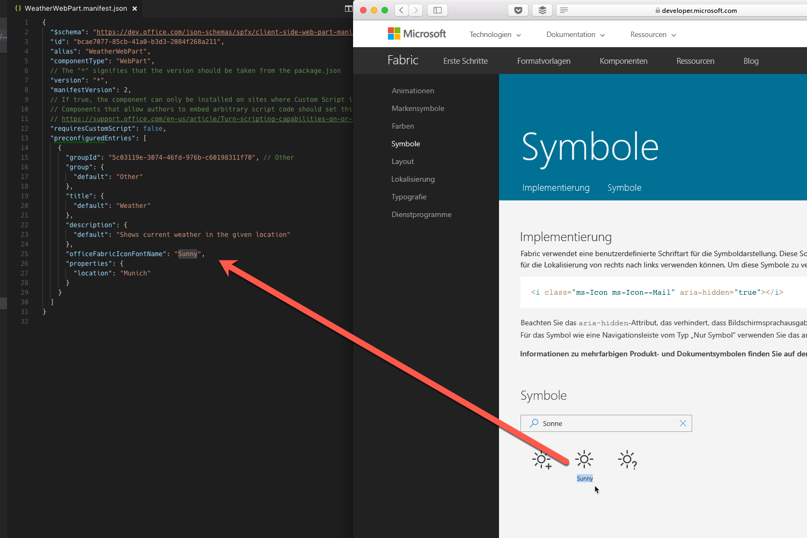
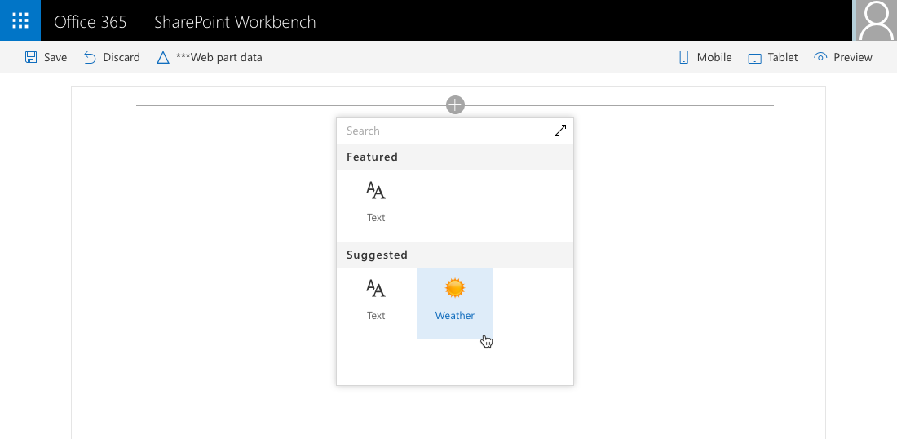

# <a name="configure-web-part-icon"></a><span data-ttu-id="e3ad2-102">Konfigurieren des Webpartsymbols</span><span class="sxs-lookup"><span data-stu-id="e3ad2-102">Configure web part.</span></span>

<span data-ttu-id="e3ad2-103">Die Verwendung eines Symbols, das den Zweck Ihres Webparts darstellt, erleichtert Benutzern die Suche nach Ihrem Webpart unter allen in der Toolbox verfügbaren Webparts.</span><span class="sxs-lookup"><span data-stu-id="e3ad2-103">Selecting an icon that illustrates the purpose of your web part, makes it easier for users to find your web part among other all web parts available in the toolbox.</span></span> <span data-ttu-id="e3ad2-104">In diesem Artikel werden die verschiedenen Optionen erläutert, die beim Konfigurieren des Symbols für Ihre Webparts zur Verfügung stehen.</span><span class="sxs-lookup"><span data-stu-id="e3ad2-104">This article explains the different options available to you to configure the icon for your web parts.</span></span>

## <a name="preconfiguring-web-parts"></a><span data-ttu-id="e3ad2-105">Vorkonfigurieren von Webparts</span><span class="sxs-lookup"><span data-stu-id="e3ad2-105">Preconfiguring web parts</span></span>

<span data-ttu-id="e3ad2-106">Das Webpartsymbol wird in dem Webpartmanifest im Rahmen der vorkonfigurierten Einträge definiert.</span><span class="sxs-lookup"><span data-stu-id="e3ad2-106">Web part icon is defined in the web part manifest as a part of preconfigured entries.</span></span> <span data-ttu-id="e3ad2-107">Wenn Sie über ein Mehrfunktionswebpart verfügen, dass für verschiedene Anforderungen konfiguriert werden kann, kann jede Konfiguration ein anderes Symbol aufweisen, das den Zweck angibt.</span><span class="sxs-lookup"><span data-stu-id="e3ad2-107">If you have a multipurpose web part, that can be configured to meet different needs, each configuration can have a different icon indicating its purpose.</span></span> <span data-ttu-id="e3ad2-108">Ein repräsentatives Symbol erleichtert Benutzern die Suche nach dem gewünschten Webpart.</span><span class="sxs-lookup"><span data-stu-id="e3ad2-108">Using a representative icon helps users find the web part they are looking for.</span></span> <span data-ttu-id="e3ad2-109">Weitere Informationen zum Vorkonfigurieren von Webparts finden Sie in dem [Leitfaden zum Vorkonfigurieren von Webparts](../guidance/simplify-adding-web-parts-with-preconfigured-entries.md).</span><span class="sxs-lookup"><span data-stu-id="e3ad2-109">For more information about preconfiguring your web parts see the [guidance on preconfiguring web parts](../guidance/simplify-adding-web-parts-with-preconfigured-entries.md).</span></span>

## <a name="configuring-web-part-icon"></a><span data-ttu-id="e3ad2-110">Konfigurieren des Webpartsymbols</span><span class="sxs-lookup"><span data-stu-id="e3ad2-110">Configuring web part icon</span></span>

<span data-ttu-id="e3ad2-111">SharePoint-Framework bietet eine Reihe von Möglichkeiten zum Definieren des Symbols für das Webpart.</span><span class="sxs-lookup"><span data-stu-id="e3ad2-111">SharePoint Framework offers you a number of ways to define the icon for your web part.</span></span>

### <a name="using-office-ui-fabric-icon-font"></a><span data-ttu-id="e3ad2-112">Verwenden von Office UI Fabric-Symbolschriftarten</span><span class="sxs-lookup"><span data-stu-id="e3ad2-112">Using Office UI Fabric icon font</span></span>

<span data-ttu-id="e3ad2-113">Eine Möglichkeit, das Symbol für das Webpart zu definieren, ist die **officeFabricIconFontName**-Eigenschaft.</span><span class="sxs-lookup"><span data-stu-id="e3ad2-113">One way to define the icon for your web part is by using the **officeFabricIconFontName** property.</span></span> <span data-ttu-id="e3ad2-114">Mit dieser Eigenschaft können Sie eines der im Rahmen von Office UI Fabric verfügbaren Symbole auswählen.</span><span class="sxs-lookup"><span data-stu-id="e3ad2-114">This property allows you to choose one of the icons offered as a part of Office UI Fabric.</span></span>

> <span data-ttu-id="e3ad2-115">Eine Liste der verfügbaren Symbole in Office UI Fabric finden Sie unter [https://developer.microsoft.com/de-de/fabric#/styles/icons](https://developer.microsoft.com/de-DE/fabric#/styles/icons).</span><span class="sxs-lookup"><span data-stu-id="e3ad2-115">You can find the list of available Office UI Fabric icons at [https://developer.microsoft.com/de-DE/fabric#/styles/icons](https://developer.microsoft.com/de-DE/fabric#/styles/icons).</span></span>

<span data-ttu-id="e3ad2-116">Um ein bestimmtes Symbol zu verwenden, müssen Sie auf der Übersichtsseite mit Office UI Fabric-Symbolen seinen Namen kopieren und diesen als Wert in die **officeFabricIconFontName**-Eigenschaft im Manifest des Webparts einfügen.</span><span class="sxs-lookup"><span data-stu-id="e3ad2-116">To use the specific icon, from the Office UI Fabric icons overview page, copy its name, and paste as the value of the **officeFabricIconFontName** property in the manifest of your web part.</span></span>



```json
{
  "$schema": "https://dev.office.com/json-schemas/spfx/client-side-web-part-manifest.schema.json",
  "id": "bcae7077-85cb-41a0-b3d3-2084f268a211",
  "alias": "WeatherWebPart",
  "componentType": "WebPart",
  // The "*" signifies that the version should be taken from the package.json
  "version": "*",
  "manifestVersion": 2,
  // If true, the component can only be installed on sites where Custom Script is allowed.
  // Components that allow authors to embed arbitrary script code should set this to true.
  // https://support.office.com/en-us/article/Turn-scripting-capabilities-on-or-off-1f2c515f-5d7e-448a-9fd7-835da935584f
  "requiresCustomScript": false,
  "preconfiguredEntries": [
    {
      "groupId": "5c03119e-3074-46fd-976b-c60198311f70", // Other
      "group": {
        "default": "Other"
      },
      "title": {
        "default": "Weather"
      },
      "description": {
        "default": "Shows current weather in the given location"
      },
      "officeFabricIconFontName": "Sunny",
      "properties": {
        "location": "Munich"
      }
    }
  ]
}
```

<span data-ttu-id="e3ad2-118">Beim Hinzufügen des Webparts zur Seite wird das ausgewählte Symbol in der Toolbox angezeigt.</span><span class="sxs-lookup"><span data-stu-id="e3ad2-118">When adding your web part to the page, the selected icon will be displayed in the toolbox.</span></span>


<span data-ttu-id="e3ad2-120">Der große Vorteil dieses Ansatzes ist, dass Sie keine Symbolbilddatei mit den Webpartressourcen bereitstellen müssen.</span><span class="sxs-lookup"><span data-stu-id="e3ad2-120">The big benefit of this approach is, that you don't need to deploy the icon image file along with your web part assets.</span></span> <span data-ttu-id="e3ad2-121">Darüber hinaus wird das Symbol auf Computern mit anderen DPI- und Barrierefreiheitseinstellungen ohne Qualitätsverlust automatisch angepasst.</span><span class="sxs-lookup"><span data-stu-id="e3ad2-121">Additionally, on computers using different DPI or other accessibility settings, the icon will automatically adapt to these settings without losing quality.</span></span>

### <a name="using-an-external-icon-image"></a><span data-ttu-id="e3ad2-122">Verwenden eines externen Symbolbilds</span><span class="sxs-lookup"><span data-stu-id="e3ad2-122">Using an external icon image</span></span>

<span data-ttu-id="e3ad2-123">Obwohl Office UI Fabric zahlreiche Bilder bietet, möchten Sie möglicherweise beim Erstellen von Webparts ein für Ihre Organisation spezifisches Symbol verwenden, um Ihre Webparts deutlich von anderen, in der Toolbox verfügbaren Webparts von Erst- und Drittanbietern abzugrenzen.</span><span class="sxs-lookup"><span data-stu-id="e3ad2-123">Although Office UI Fabric offers many images, when building web parts, you might want to use something specific to your organization to clearly separate your web parts from other first and third party web parts visible in the toolbox.</span></span>

<span data-ttu-id="e3ad2-124">Neben Office UI Fabric-Symbolen können im SharePoint-Framework auch Bilder verwendet werden.</span><span class="sxs-lookup"><span data-stu-id="e3ad2-124">Next to using Office UI Fabric icons, SharePoint Framework also allows you to use images.</span></span> <span data-ttu-id="e3ad2-125">Um ein Bild als Webpartsymbol zu verwenden, müssen Sie die zugehörige eine absolute URL in der **iconImageUrl**-Eigenschaft im Manifest des Webparts angeben.</span><span class="sxs-lookup"><span data-stu-id="e3ad2-125">To use an image as a web part icon, specify its absolute URL in the **iconImageUrl** property in the web part manifest.</span></span>

```json
{
  "$schema": "https://dev.office.com/json-schemas/spfx/client-side-web-part-manifest.schema.json",
  "id": "bcae7077-85cb-41a0-b3d3-2084f268a211",
  "alias": "WeatherWebPart",
  "componentType": "WebPart",
  // The "*" signifies that the version should be taken from the package.json
  "version": "*",
  "manifestVersion": 2,
  // If true, the component can only be installed on sites where Custom Script is allowed.
  // Components that allow authors to embed arbitrary script code should set this to true.
  // https://support.office.com/en-us/article/Turn-scripting-capabilities-on-or-off-1f2c515f-5d7e-448a-9fd7-835da935584f
  "requiresCustomScript": false,
  "preconfiguredEntries": [
    {
      "groupId": "5c03119e-3074-46fd-976b-c60198311f70", // Other
      "group": {
        "default": "Other"
      },
      "title": {
        "default": "Weather"
      },
      "description": {
        "default": "Shows current weather in the given location"
      },
      "iconImageUrl": "https://assets.contoso.com/weather.png",
      "properties": {
        "location": "Munich"
      }
    }
  ]
}
```

<span data-ttu-id="e3ad2-126">Das in der Toolbox angezeigte Webpartsymbolbild verfügt über eine Größe von 40x28 Pixel.</span><span class="sxs-lookup"><span data-stu-id="e3ad2-126">The web part icon image displayed in the toolbox is 40x28px.</span></span> <span data-ttu-id="e3ad2-127">Wenn das Bild größer ist, wird seine Größe proportional entsprechend dieser Größe angepasst.</span><span class="sxs-lookup"><span data-stu-id="e3ad2-127">If your image is bigger, it will be sized proportionally to match these dimensions.</span></span>



<span data-ttu-id="e3ad2-129">Während Sie mit benutzerdefinierten Bildern von mehr Flexibilität bei der Wahl eines Symbols für Ihr Webpart profitieren, müssen Sie diese zusammen mit anderen Webpartressourcen bereitzustellen.</span><span class="sxs-lookup"><span data-stu-id="e3ad2-129">While using custom images gives you more flexibility to choose an icon for your web part, it requires you to deploy them along with your other web part assets.</span></span> <span data-ttu-id="e3ad2-130">Darüber hinaus kann es zum Qualitätsverlust kommen, wenn das Bild mit höheren DPI-Werten oder bestimmten Barrierefreiheitseinstellungen angezeigt wird.</span><span class="sxs-lookup"><span data-stu-id="e3ad2-130">Additionally, your image might lose quality when displayed in higher DPI or specific accessibility settings.</span></span> <span data-ttu-id="e3ad2-131">Um Qualitätsverlust zu vermeiden, können Sie Vektor-basierte SVG-Bilder verwenden, die auch von SharePoint-Framework unterstützt werden.</span><span class="sxs-lookup"><span data-stu-id="e3ad2-131">To avoid quality loss, you can use vector-based SVG images which are also supported by the SharePoint Framework.</span></span>

### <a name="using-a-base64-encoded-image"></a><span data-ttu-id="e3ad2-132">Verwenden eines base64-codierten Bilds</span><span class="sxs-lookup"><span data-stu-id="e3ad2-132">Using a base64 encoded image</span></span>

<span data-ttu-id="e3ad2-133">Wenn Sie ein benutzerdefiniertes Bild verwenden, statt eine absolute URL zu der mit anderen Webpartressourcen gehosteten Bilddatei anzugeben, können Sie ein base64-codiertes Bild und die base64-Zeichenfolge anstelle der URL verwenden.</span><span class="sxs-lookup"><span data-stu-id="e3ad2-133">When using a custom image, rather than specifying an absolute URL to the image file hosted together with other web part assets, you can have your image base64 encoded and use the base64 string instead of the URL.</span></span>

> <span data-ttu-id="e3ad2-134">Im Internet sind zahlreiche Dienste verfügbar, die Sie für die base64-Codierung von Bildern verwenden können, zum Beispiel [https://www.base64-image.de](https://www.base64-image.de).</span><span class="sxs-lookup"><span data-stu-id="e3ad2-134">There are a number of services available on the Internet that you can use to base64 encode your image, such as [https://www.base64-image.de](https://www.base64-image.de).</span></span>

<span data-ttu-id="e3ad2-135">Kopieren Sie nach dem Codieren des Bilds die base64-Zeichenfolge, und verwenden Sie sie als Wert für die **iconImageUrl**-Eigenschaft im Manifest des Webparts.</span><span class="sxs-lookup"><span data-stu-id="e3ad2-135">After encoding the image, copy the base64 string and use it as the value for the **iconImageUrl** property in the web part manifest.</span></span>

```json
{
  "$schema": "https://dev.office.com/json-schemas/spfx/client-side-web-part-manifest.schema.json",
  "id": "bcae7077-85cb-41a0-b3d3-2084f268a211",
  "alias": "WeatherWebPart",
  "componentType": "WebPart",
  // The "*" signifies that the version should be taken from the package.json
  "version": "*",
  "manifestVersion": 2,
  // If true, the component can only be installed on sites where Custom Script is allowed.
  // Components that allow authors to embed arbitrary script code should set this to true.
  // https://support.office.com/en-us/article/Turn-scripting-capabilities-on-or-off-1f2c515f-5d7e-448a-9fd7-835da935584f
  "requiresCustomScript": false,
  "preconfiguredEntries": [
    {
      "groupId": "5c03119e-3074-46fd-976b-c60198311f70", // Other
      "group": {
        "default": "Other"
      },
      "title": {
        "default": "Weather"
      },
      "description": {
        "default": "Shows current weather in the given location"
      },
      "iconImageUrl": "data:image/svg+xml;base64,PD94bWwgdmVyc2lvbj0iMS4wIiBlbmNvZGluZz0iVVRGLTgiPz4KPHN2ZyB3aWR0aD0iMTAyMiIgaGVpZ2h0PSI5NzgiIHhtbG5zPSJodHRwOi8vd3d3LnczLm9yZy8yMDAwL3N2ZyIgeG1sbnM6c3ZnPSJodHRwOi8vd3d3LnczLm9yZy8yMDAwL3N2ZyI+CiA8Zz4KICA8dGl0bGU+TGF5ZXIgMTwvdGl...",
      "properties": {
        "location": "Munich"
      }
    }
  ]
}
```


<span data-ttu-id="e3ad2-137">Base64-Codierung kann sowohl für BItmapbilder, zum Beispiel PNG, sowie für Vektor-basierte SVG-Bilder verwendet werden.</span><span class="sxs-lookup"><span data-stu-id="e3ad2-137">Base64 encoding works both for bitmap images such as PNG as well as vector SVG images.</span></span> <span data-ttu-id="e3ad2-138">Der große Vorteil der base64-Codierung von Bildern ist, dass Sie das Webpartsymbolbild nicht separat bereitstellen müssen.</span><span class="sxs-lookup"><span data-stu-id="e3ad2-138">The big benefit of using base64 encoded images is, that you don't need to deploy the web part icon image separately.</span></span>

## <a name="additional-considerations"></a><span data-ttu-id="e3ad2-139">Zusätzliche Überlegungen</span><span class="sxs-lookup"><span data-stu-id="e3ad2-139">Additional considerations</span></span>

<span data-ttu-id="e3ad2-140">Jedes Webpart muss über ein Symbol verfügen.</span><span class="sxs-lookup"><span data-stu-id="e3ad2-140">Each web part must have an icon.</span></span> <span data-ttu-id="e3ad2-141">Wenn Sie das Webpartsymbol mit beiden **officeFabricIconFontName**- und den **iconImageUrl**-Eigenschaften angeben, wird das in der **officeFabricIconFontName**-Eigenschaft angegebene Symbol verwendet.</span><span class="sxs-lookup"><span data-stu-id="e3ad2-141">If you specify the web part icon using both the **officeFabricIconFontName** and the **iconImageUrl** properties, the icon specified in the **officeFabricIconFontName** will be used.</span></span> <span data-ttu-id="e3ad2-142">Wenn Sie kein Office UI Fabric-Symbol verwenden möchten, müssen Sie eine URL in der **iconImageUrl**-Eigenschaft angeben.</span><span class="sxs-lookup"><span data-stu-id="e3ad2-142">If you choose not to use an Office UI Fabric icon, then you have to specify a URL in the **iconImageUrl** property.</span></span>