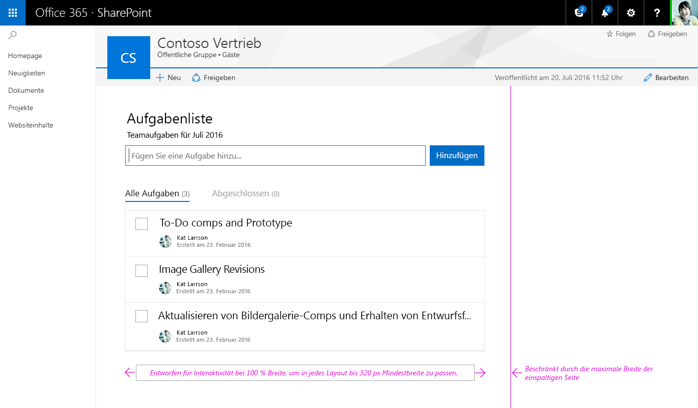
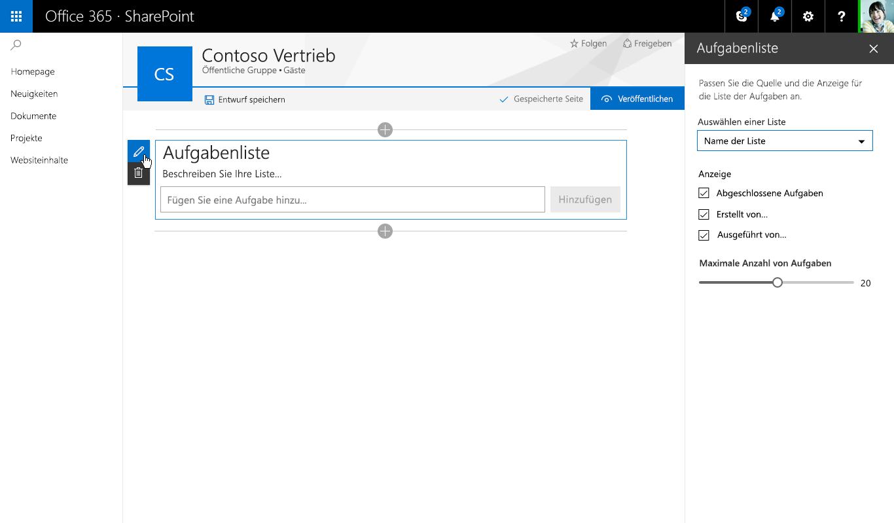
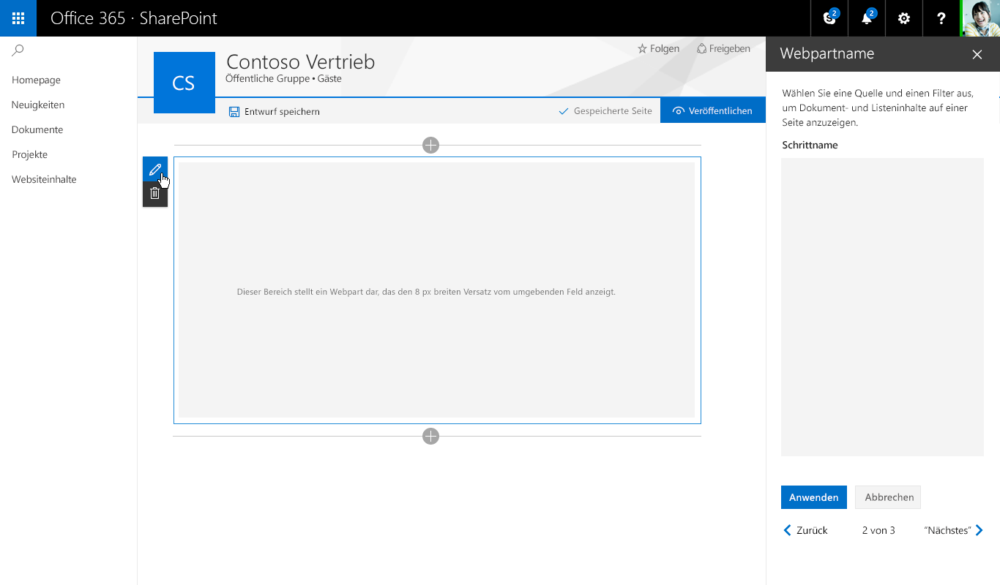
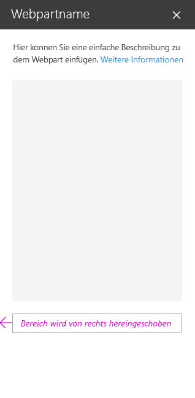
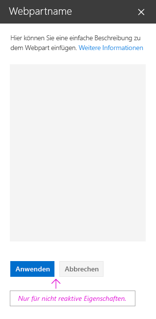

# Entwurfsüberlegungen für clientseitige SharePoint-WebpartsDesign considerations for SharePoint client-side web parts

Um mit der Entwicklung von Webparts zu beginnen, sollten Sie sich mit [Office UI Fabric](http://dev.office.com/fabric) vertraut machen. Alle Formatvorlagen aus [Fabric Core](https://github.com/OfficeDev/office-ui-fabric-core) – einschließlich Symbolen, Typografie, Farben, Animationen und des dynamischen Rasters – werden standardmäßig geladen und stehen dem Webpart zur Verfügung. Importieren Sie keine Kopie der Fabric für Ihr Webpart, das dies einen Konflikt mit der globalen Kopie verursachen könnte. Diese Klassen bieten eine Grundlage für die Darstellung Ihres Webparts, die Sie jederzeit ändern können, wenn für die Marke Ihres Unternehmens andere Ausführungen erforderlich sind.To get started designing web parts, you will want to be familiar with [Office UI Fabric](http://dev.office.com/fabric). All of the styles from [Fabric Core](https://github.com/OfficeDev/office-ui-fabric-core) – including icons, typography, color usage, animation, and the responsive grid – are loaded by default and available to your web part. Do not import a copy of Fabric for your web part, as this may conflict with the global copy. These classes provide a foundation to your web part's styling, which you can always depart from if you require different visuals to match your company's brand.

## React-Komponenten der Office UI FabricOffice UI Fabric React Components

Neben der Office UI Fabric können Sie React-Komponenten der Office UI Fabric verwenden, um Webparts zu erstellen. Bei Fabric React handelt es sich um eine dynamische Sammlung von Mobilitätskomponenten, die Ihnen das Erstellen von Weboberflächen mithilfe der Office-Entwurfssprache erleichtern.Along with Office UI Fabric, you can use Office UI Fabric React components to build your web parts. Fabric React is a responsive, mobile-first collection of  components designed to make it quick and simple for you to create web experiences using the Office Design Language.

Im folgenden Aufgabenlistenbeispiel werden Fabric-Komponenten im Eigenschaftenbereich verwendet, mit dem der Seitenautor ein Webpart konfigurieren kann.The following To Do list example uses Fabric components in the property pane that lets the page author configure a web part.

Eine vollständige Liste der Office UI Fabric-Stile, -Typografie, -Farben, -Symbole und Animationen finden Sie unter [Office UI Fabric-Formatvorlagen](http://dev.office.com/fabric/styles).You can find a complete list of the Office UI Fabric styles, typography, color, icons, and animations at [Office UI Fabric styles](http://dev.office.com/fabric/styles).

## Dynamisches VerhaltenResponsive behavior

Seiten in der neuen SharePoint-Erstellungsumgebung verwenden das dynamische Raster von Office UI Fabric, um sicherzustellen, dass jede Seite ansprechend aussieht.Pages in the new SharePoint authoring experience use the Office UI Fabric responsive grid to help ensure that each page will look great. 

### Maximale BreiteMax width

Es wird empfohlen, dass alle Webparts eine maximale Breite von 100 %, verwenden um sicherzustellen, dass sie auf jeder Seite dynamisch umbrechen und ordnungsgemäß funktionieren. Die Seiten- und Spaltenbreite wird von der Seitenvorlage definiert, kann aber vom Autor geändert werden. Wenn im Webpart ein maximaler Pixelwert festgelegt wird, könnte es unerwartete Ergebnisse sowohl im Hinblick auf die Funktionalität als auch auf das Layout geben, wenn die Seite mit unterschiedlichen Breiten angezeigt wird.We recommend that all web parts use a 100% maximum width to ensure that they will re-flow and function properly on any page. The page and column widths are defined by the page template but can be modified by the author. If a max pixel value is set in the web part, there could be unexpected results in both functionality and layout when the page is seen at different widths.

### Minimale BreiteMin width

Alle Webparts sollten so gestaltet werden, dass sie dynamisch umbrechen, wenn die Seiten-/Spaltenbreite bis zu einer minimalen Breite von 320 px abnimmt.All web parts should be designed to reflow as the page/column width gets smaller down to a min width of 320 px.

## Webparts im Modus „Veröffentlicht“ und Webparts im Bearbeitungsmodus - VergleichWeb part published mode vs edit mode

Die neue SharePoint-Erstellungsumgebung weist zwei Modi auf:The new SharePoint page authoring experience has two modes:

* **Modus „Veröffentlicht“** In diesem Modus kann Ihr Team oder Ihre Zielgruppe den Inhalt anzeigen und mit Webparts interagieren.**Published mode** which allows your team or audience to view content and interact with web parts.
* **Bearbeitungsmodus** In diesem Modus können Seitenautoren Webparts hinzufügen und konfigurieren, um einer Seite Inhalte hinzuzufügen.**Edit mode** which allows page author(s) to add and configure web parts to add content to a page.

### BearbeitungsmodusEdit mode

#### Hinweis zum Hinzufügen und ToolboxAdd hint and Toolbox

Der Hinweis zum Hinzufügen besteht aus einer horizontalen Linie mit einem Pluszeichen, die angezeigt wird, wenn ein Webpart ausgewählt wird, und wenn darauf gezeigt wird, um anzugeben, wo Seitenautoren neue Webparts zu ihrer Seite hinzufügen können. Die Toolbox wird geöffnet, wenn ein Benutzer auf das Pluszeichen tippt/klickt. Die Toolbox enthält alle Webparts, die einer Seite hinzugefügt werden können.The add hint is a horizontal line with a plus icon that is visible when a web part is selected and on hover to indicate where page authors can add new web parts to their page. The toolbox opens when a user clicks/taps the plus icon. The toolbox contains all the web parts that can be added to a page.

#### SymbolleisteToolbar

Eine vertikale Symbolleiste und das umgebende Feld sind Teil des Frameworks für jedes Webpart und werden von der Seite bereitgestellt. Jedes Webpart weist in der Symbolleiste eine Bearbeitungs- und Löschaktion auf.A vertical toolbar and bounding box is part of the framework for every web part and provided by the page. Each web part has an edit and delete action in the toolbar.

#### Kontextbezogene BearbeitungenContextual edits

Für Webparts sollte eine WYSIWYG-Oberfläche entwickelt werden, damit Informationen eingetragen oder Inhalte hinzugefügt werden können, die dem Benutzer bei der Veröffentlichung angezeigt werden. Die Eingabe dieses Inhalts sollte auf der Seite erfolgen, damit der Benutzer versteht, wie der Inhalt für den Betrachter angezeigt wird. Titel und Beschreibungen sollten beispielsweise dort ausgefüllt werden, wo der Text angezeigt wird, oder neue Aufgaben sollten im Kontext der Seite hinzugefügt und geändert werden.A WYSIWYG experience should be designed for web parts to fill in information or add content that will be displayed to the user when published. Entering this content should be done in page so the user understands how the viewer will see the content. For example, titles and descriptions should be filled out where the text displays or new tasks should be added and modified in context of the page.

#### Bearbeitungen auf ElementebeneItem-level edits

Die Benutzeroberfläche kann sich innerhalb des Webparts ändern. Text wird zum Beispiel in ein Textfeld umgewandelt, damit Links eingetragen werden können, oder beim Anzeigen von UI zur Neuanordnung von Elementen oder zum Überprüfen von Aufgaben in einem Webpart.UI can change within the web part; for example, turning text into a text field to fill out links or when displaying UI to reorder items or to check of tasks in a web part

## EigenschaftenbereicheProperty panes

Eigenschaftenbereiche werden über das Aktionssymbol zum Bearbeiten auf der Symbolleiste aufgerufen. Bereiche sollten in erster Linie Konfigurationseinstellungen enthalten, die Features aktivieren/deaktivieren, die entweder auf der Seite angezeigt werden oder die einen Aufruf eines Diensts vornehmen, um Inhalte anzuzeigen.Property panes are invoked via the edit action icon on the toolbar. Panes should primarily contain configuration settings that enable/disable features that either show on page or that make a call to a service to display content.

Es gibt drei Arten von Eigenschaftenbereichen, mit denen Sie Webparts entwerfen und entwickeln können, die den Anforderungen Ihres Unternehmens oder Ihrer Kunden entsprechen.There are three types of property panes to enable you to design and develop web parts that fit your business or customer needs.

### Einzelner BereichSingle pane

Ein einzelner Bereich wird für einfache Webparts verwendet, bei denen nur eine kleine Anzahl von Eigenschaften konfiguriert werden kann.A single pane is used for simple web parts that only have a small number of properties to configure.

### Accordion-BereichAccordion pane

Ein Accordion-Bereich wird für eine Gruppe bzw. Gruppen von Eigenschaften mit vielen Optionen verwendet und dann, wenn die Gruppen zu einer langen Bildlaufleiste mit Optionen führen würden. Angenommen, Sie haben drei Gruppen mit dem Namen „Eigenschaften“, „Darstellung“ und „Layout“, von denen jede über zehn Komponenten verfügt.A accordion pane is used for containing a group or groups of properties with many options and where the groups would result in a long scrolling list of options. For example, you might have three groups named Properties, Appearance, and Layout, each with ten components.

#### Accordion - Eine geöffnete GruppeAccordion - One group open

#### Accordion - Zwei geöffnete Gruppen mit BildlaufAccordion- Two groups open and scrolled

### Schritte/Seiten von EigenschaftenbereichenProperty pane steps/pages

Der Bereich „Schritte“ wird zum Gruppieren von Eigenschaften in mehreren Schritten oder Seiten verwendet, wenn das Webpart in einer linearen Reihenfolge konfiguriert werden muss oder wenn die beim ersten Schritt getroffene Auswahl Auswirkungen auf Optionen hat, die im zweiten Schritt angezeigt werden.A steps pane is used for grouping properties in multiple steps or pages when you need the web part to be configured in a linear order or when choices made on the first step affect options that display on the second step.

**Schritt 1 von 3**
**Step 1 of 3**

**Schritt 2 von 3**
**Step 2 of 3**

**Schritt 3 von 3**
**Step 3 of 3**

## Dynamisch Webparts und nicht dynamische Webparts - VergleichReactive vs non-reactive web parts

Dynamische Webparts werden so entwickelt, dass sie vollständig clientseitige Webparts sind. Das bedeutet, dass jede Komponente, die im Eigenschaftenbereich konfiguriert wird, die Änderung, die innerhalb des Webparts auf der Seite vorgenommen wird, widerspiegelt. Wenn Sie im Aufgabenlisten-Webparts die Option „Abgeschlossene Aufgaben“ deaktivieren, wird diese Ansicht im Webpart ausgeblendet.Reactive web parts are designed to be full client-side web parts, which mean that each component that is configured in the properties pane will reflect as the change is made within the web part on the page. For the To-Do List web part, unchecking “Completed Tasks” will hide this view in the web part.

Nicht dynamische Webparts sind nicht vollständig clientseitig, und in der Regel muss mindestens eine Eigenschaft einen Aufruf ausführen, um Daten auf einem Server festzulegen/abzurufen oder zu speichern. In diesem Fall sollten Sie die Schaltflächen „Übernehmen“ und „Abbrechen“ am unteren Rand des Eigenschaftenbereich aktivieren.Non-reactive web parts are not fully client side and generally one or more properties need to make a call to set/pull or store data on a server. In this case, you should enable the Apply and Cancel buttons at the bottom of the properties pane.

## Erstellen des Aufgabenlisten-EigenschaftenbereichsConstructing the To-Do List property pane

Das Beispiel der Aufgabenliste verwendet den einzelnen Eigenschaftenbereich, und es handelt sich um ein dynamisches Webpart. Nachfolgend ist eine React-Komponente von Fabric und das daraus resultierende Design dargestellt.The To-Do List example uses the single pane and is a reactive web part. The following shows each Fabric React component and the resulting design.

Hinzufügen einer Beschreibung für die AufgabenlisteAdding a description for To-Do List 

Dropdown – Zum Auswählen von Aufgaben aus einer vorhandenen Liste Drop down – to select tasks from an existing list 

Kontrollkästchen – Ermöglicht Autoren das Ein-oder Ausblenden von verschiedenen Ansichten Checkbox– to allow authors to show or hide different views 

Schieberegler – Zum Festlegen der Anzahl sichtbarer AufgabenSlider – to set the number of tasks visible 

Nach dem Auswählen einer Liste aus dem Dropdown wird das Webpart angezeigt und gibt die Anzahl von Elementen an, die auf der Seite geladen werden After selecting a list from the drop down the web part shows and indicator of items loading onto the page 

Wenn die neuen Aufgaben geladen werden, werden Sie mithilfe von Animationsstilen aus Office UI Fabric eingeblendet When the new tasks are loaded the fade into view using animation styles from Office UI Fabric 
