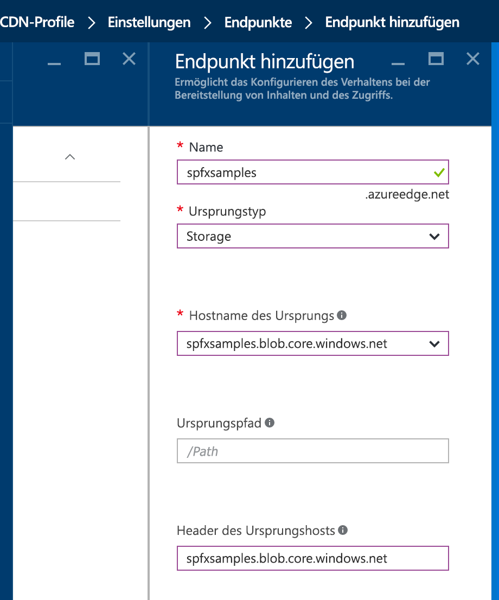
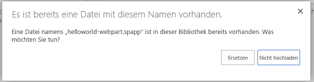

# <a name="deploy-your-sharepoint-client-side-web-part-to-a-cdn"></a><span data-ttu-id="6e116-102">Bereitstellen Ihres clientseitigen SharePoint-Webparts in einem CDN</span><span class="sxs-lookup"><span data-stu-id="6e116-102">Deploy your SharePoint client-side web part to a CDN</span></span>

<span data-ttu-id="6e116-103">In diesem Artikel stellen Sie die **HelloWorld**-Ressourcen auf einem Remote-CDN und nicht mithilfe der lokalen Umgebung bereit.</span><span class="sxs-lookup"><span data-stu-id="6e116-103">In this article, you will deploy the **HelloWorld** assets to a remote CDN instead of using the local environment.</span></span> <span data-ttu-id="6e116-104">Sie verwenden ein Azure-Speicherkonto, das in ein CDN integriert ist, um Ihre Ressourcen bereitzustellen.</span><span class="sxs-lookup"><span data-stu-id="6e116-104">You'll use an Azure Storage account integrated with a CDN to deploy your assets.</span></span> <span data-ttu-id="6e116-105">Die Buildtools von SharePoint Framework bieten eine sofort nutzbare Unterstützung für die Bereitstellung auf einem Azure-Speicherkonto. Sie können die Dateien jedoch auch manuell an einen CDN-Anbieter Ihrer Wahl oder nach SharePoint hochladen.</span><span class="sxs-lookup"><span data-stu-id="6e116-105">In this article, you will deploy the HelloWorld assets to a remote CDN instead of using the local environment. You'll use an Azure Storage account integrated with a CDN to deploy your assets. SharePoint Framework build tools provide out-of-the-box support for deploying to an Azure Storage account; however, you can also manually upload the files to your favorite CDN provider or to SharePoint.</span></span>

<span data-ttu-id="6e116-106">Sie können die nachfolgend beschriebene Anleitung auch anhand dieses Videos in unserem [YouTube-Kanal „SharePoint Patterns & Practices“](https://www.youtube.com/watch?v=FDGatKnjNeM&list=PLR9nK3mnD-OXvSWvS2zglCzz4iplhVrKq) nachvollziehen:</span><span class="sxs-lookup"><span data-stu-id="6e116-106">You can also follow these steps by watching the video on the [SharePoint PnP YouTube Channel](https://www.youtube.com/watch?v=FDGatKnjNeM&list=PLR9nK3mnD-OXvSWvS2zglCzz4iplhVrKq).</span></span> 

<a href="https://www.youtube.com/watch?v=FDGatKnjNeM&list=PLR9nK3mnD-OXvSWvS2zglCzz4iplhVrKq">

</a>

> [!NOTE]
> <span data-ttu-id="6e116-107">Es gibt mehrere unterschiedliche Hostingoptionen für Webpart-Objekte.</span><span class="sxs-lookup"><span data-stu-id="6e116-107">There are multiple different hosting options for your web part assets.</span></span> <span data-ttu-id="6e116-108">In diesem Lernprogramm steht die Option „Azure CDN“ im Vordergrund, Sie können jedoch auch das [Office 365 CDN](./hosting-webpart-from-office-365-cdn.md) verwenden oder einfach Ihre Objekt aus der SharePoint-Bibliothek aus dem Mandanten hosten.</span><span class="sxs-lookup"><span data-stu-id="6e116-108">This tutorial concentrates on showing the Azure CDN option, but you could also use the [Office 365 CDN](./hosting-webpart-from-office-365-cdn.md) or simply host your assets from SharePoint library from your tenant.</span></span> <span data-ttu-id="6e116-109">Im letzteren Fall würden Sie nicht von den CDN-Leistungssteigerungen profitieren, im Hinblick auf die Funktionalität wäre dies jedoch möglich.</span><span class="sxs-lookup"><span data-stu-id="6e116-109">In the latter case, you would not benefit from the CDN performance improvements, but that would also work from the functionality perspective.</span></span> <span data-ttu-id="6e116-110">Technisch gesehen wäre jeder Ort zum Hosten der Objekte für Endbenutzer denkbar, auf den Endbenutzer über HTTP zugreifen können.</span><span class="sxs-lookup"><span data-stu-id="6e116-110">Any location which end users can access using HTTP would be technically suitable for hosting the assets for end users.</span></span>

## <a name="prerequisites"></a><span data-ttu-id="6e116-111">Voraussetzungen</span><span class="sxs-lookup"><span data-stu-id="6e116-111">Prerequisites</span></span>

<span data-ttu-id="6e116-112">Führen Sie die folgenden Schritte aus, bevor Sie starten:</span><span class="sxs-lookup"><span data-stu-id="6e116-112">Make sure that you have completed the following tasks before you begin:</span></span>

* [<span data-ttu-id="6e116-113">Erstellen des ersten clientseitigen Webparts</span><span class="sxs-lookup"><span data-stu-id="6e116-113">Build your first client-side web part</span></span>](./build-a-hello-world-web-part.md)
* [<span data-ttu-id="6e116-114">Verbinden des clientseitigen Webparts mit SharePoint</span><span class="sxs-lookup"><span data-stu-id="6e116-114">Connect your client-side web part to SharePoint</span></span>](./connect-to-sharepoint.md)
* [<span data-ttu-id="6e116-115">Bereitstellen des clientseitigen SharePoint-Webparts auf einer klassischen SharePoint-Seite</span><span class="sxs-lookup"><span data-stu-id="6e116-115">Deploy your client-side web part to a classic SharePoint page</span></span>](./serve-your-web-part-in-a-sharepoint-page.md)

## <a name="configure-azure-storage-account"></a><span data-ttu-id="6e116-116">Konfigurieren eines Azure-Speicherkontos</span><span class="sxs-lookup"><span data-stu-id="6e116-116">Configure Azure storage account</span></span>

<span data-ttu-id="6e116-117">Konfigurieren Sie ein Azure-Speicherkonto, und integrieren Sie es in das CDN.</span><span class="sxs-lookup"><span data-stu-id="6e116-117">Configure an Azure storage account and integrate it with the CDN.</span></span>

<span data-ttu-id="6e116-118">Sie können die Anweisungen im Artikel [Integrieren eines Speicherkontos in CDN](https://azure.microsoft.com/de-DE/documentation/articles/cdn-create-a-storage-account-with-cdn/) zusammen mit den detaillierten Schritten in diesem Artikel verwenden, um ein Azure -Speicherkonto zu erstellen und dieses in das CDN zu integrieren.</span><span class="sxs-lookup"><span data-stu-id="6e116-118">You can follow the instructions in the article [Integrate a Storage Account with CDN](https://azure.microsoft.com/de-DE/documentation/articles/cdn-create-a-storage-account-with-cdn/) along with the detailed steps in this article to create an Azure storage account and integrate it with the CDN. You will need the following information.</span></span> <span data-ttu-id="6e116-119">Sie benötigen die folgenden Informationen:</span><span class="sxs-lookup"><span data-stu-id="6e116-119">You will need the following information.</span></span>

### <a name="storage-account-name"></a><span data-ttu-id="6e116-120">Speicherkontoname</span><span class="sxs-lookup"><span data-stu-id="6e116-120">Storage account name</span></span>

<span data-ttu-id="6e116-121">Dies ist der Name, den Sie zum Erstellen des Speicherkontos verwendet haben, wie in [Schritt 1: Erstellen eines Speicherkontos](https://azure.microsoft.com/de-DE/documentation/articles/cdn-create-a-storage-account-with-cdn/#step-1-create-a-storage-account) beschrieben.</span><span class="sxs-lookup"><span data-stu-id="6e116-121">This is the name you used to create your storage account, as described in [Step 1: Create a storage account](https://azure.microsoft.com/de-DE/documentation/articles/cdn-create-a-storage-account-with-cdn/#step-1-create-a-storage-account).</span></span>

<span data-ttu-id="6e116-122">Im folgenden Screenshot ist **spfxsamples** der Name des Speicherkontos.</span><span class="sxs-lookup"><span data-stu-id="6e116-122">For example, in the following screenshot, **spfxsamples** is the storage account name.</span></span>


<span data-ttu-id="6e116-124">Auf diese Weise wird der neue Speicherkontoendpunkt **spfxsamples.blob.core.windows.net** erstellt.</span><span class="sxs-lookup"><span data-stu-id="6e116-124">This will create a new storage account endpoint **spfxsamples.blob.core.windows.net**.</span></span> 

> [!NOTE]
> <span data-ttu-id="6e116-125">Sie müssen einen eindeutigen Speichernamen für Ihr SharePoint-Framework-Projekt erstellen.</span><span class="sxs-lookup"><span data-stu-id="6e116-125">Note: You will need to create a unique storage name for your SharePoint Framework project.</span></span>


### <a name="blob-container-name"></a><span data-ttu-id="6e116-126">Name des BLOB-Containers</span><span class="sxs-lookup"><span data-stu-id="6e116-126">BLOB container name</span></span>

<span data-ttu-id="6e116-p104">Erstellen Sie einen neuen Blob-Dienstcontainer. Dieser ist im Dashboard des Speicherkontos verfügbar.</span><span class="sxs-lookup"><span data-stu-id="6e116-p104">Create a new Blob service container. This will be available in your storage account dashboard.</span></span>

<span data-ttu-id="6e116-129">Wählen Sie **+ Container** aus, und erstellen Sie einen neuen Container mit den folgenden Angaben:</span><span class="sxs-lookup"><span data-stu-id="6e116-129">Select the **+ Container** and create a new container with the following:</span></span>

* <span data-ttu-id="6e116-130">Name: **helloworld-webpart**</span><span class="sxs-lookup"><span data-stu-id="6e116-130">Name: **helloworld-webpart**</span></span>
* <span data-ttu-id="6e116-131">Zugriffstyp: Container</span><span class="sxs-lookup"><span data-stu-id="6e116-131">Access type: Container</span></span>


### <a name="storage-account-access-key"></a><span data-ttu-id="6e116-133">Tastenkombination für Speicherkonto</span><span class="sxs-lookup"><span data-stu-id="6e116-133">Storage account access key</span></span>

<span data-ttu-id="6e116-134">Wählen Sie im Dashboard des Speicherkontos die Option **Tastenkombination** im Dashboard aus, und kopieren Sie eine der Tastenkombinationen.</span><span class="sxs-lookup"><span data-stu-id="6e116-134">In the storage account dashboard, choose **Access Key** in the dashboard and copy one of the access keys.</span></span>


### <a name="cdn-profile-and-endpoint"></a><span data-ttu-id="6e116-136">CDN-Profil und Endpunkt</span><span class="sxs-lookup"><span data-stu-id="6e116-136">CDN profile and endpoint</span></span>

<span data-ttu-id="6e116-137">Erstellen Sie ein neues CDN-Profil, und weisen Sie den CDN-Endpunkt diesem BLOB-Container zu.</span><span class="sxs-lookup"><span data-stu-id="6e116-137">Create a new CDN profile and associate the CDN endpoint with this BLOB container.</span></span>

<span data-ttu-id="6e116-138">Erstellen Sie ein neues CDN-Profil, wie unter [Schritt 2: Erstellen eines neuen CDN-Profils](https://azure.microsoft.com/de-DE/documentation/articles/cdn-create-a-storage-account-with-cdn/#step-2-create-a-new-cdn-profile) beschrieben.</span><span class="sxs-lookup"><span data-stu-id="6e116-138">Create a new CDN profile as described in [Step 2: Create a new CDN profile](https://azure.microsoft.com/de-DE/documentation/articles/cdn-create-a-storage-account-with-cdn/#step-2-create-a-new-cdn-profile).</span></span>

<span data-ttu-id="6e116-139">Im folgenden Screenshot ist **spfxwebparts** der Name des CDN-Profils.</span><span class="sxs-lookup"><span data-stu-id="6e116-139">For example, in the following screenshot, **spfxwebparts** is the CDN profile name.</span></span>


<span data-ttu-id="6e116-141">Erstellen Sie einen CND-Endpunkt, wie unter [Schritt 3: Erstellen eines neuen CDN-Endpunkts](https://azure.microsoft.com/de-DE/documentation/articles/cdn-create-a-storage-account-with-cdn/#step-3-create-a-new-cdn-endpoint) beschrieben.</span><span class="sxs-lookup"><span data-stu-id="6e116-141">Create a CDN endpoint as described in [Step 3: Create a new CDN endpoint](https://azure.microsoft.com/de-DE/documentation/articles/cdn-create-a-storage-account-with-cdn/#step-3-create-a-new-cdn-endpoint).</span></span>

<span data-ttu-id="6e116-142">Im folgenden Screenshot ist **spfxsamples** beispielsweise der Endpunktname **Speicher** ist der Ursprungstyp, und **spfxsamples.blob.core.windows.net** ist das Speicherkonto.</span><span class="sxs-lookup"><span data-stu-id="6e116-142">For example, in the following screenshot, **spfxsamples** is the endpoint name, **Storage** is the origin type, and **spfxsamples.blob.core.windows.net** is the storage account.</span></span>



<span data-ttu-id="6e116-144">Der CDN-Endpunkt wird mit folgender URL erstellt: http://spfxsamples.azureedge.net</span><span class="sxs-lookup"><span data-stu-id="6e116-144">The CDN endpoint will be created with the following URL: http://spfxsamples.azureedge.net</span></span>

<span data-ttu-id="6e116-145">Da Sie den CDN-Endpunkt dem Speicherkonto zugewiesen haben, können Sie auch unter der folgenden URL auf den BLOB-Container zugreifen:http://spfxsamples.azureedge.net/helloworld-webpart/</span><span class="sxs-lookup"><span data-stu-id="6e116-145">Because you associated the CDN endpoint with your storage account, you can also access the BLOB container at the following URL:http://spfxsamples.azureedge.net/helloworld-webpart/</span></span>

<span data-ttu-id="6e116-146">Beachten Sie jedoch, dass Sie die Dateien noch nicht bereitgestellt haben.</span><span class="sxs-lookup"><span data-stu-id="6e116-146">Note, however that you have not yet deployed the files.</span></span>

## <a name="project-directory"></a><span data-ttu-id="6e116-147">Projektverzeichnis:</span><span class="sxs-lookup"><span data-stu-id="6e116-147">Project directory</span></span>

<span data-ttu-id="6e116-148">Wechseln Sie zur Konsole, und stellen Sie sicher, dass Sie sich noch in dem Projektverzeichnis befinden, das Sie zum Einrichten des Webpart-Projekts verwendet haben.</span><span class="sxs-lookup"><span data-stu-id="6e116-148">Switch to console and make sure you are still in the project directory you used to set up your web part project.</span></span>

<span data-ttu-id="6e116-149">Beenden Sie die Aufgabe **gulp serve**, indem Sie **STRG + C** auswählen, und wechseln Sie zu Ihrem Projektverzeichnis:</span><span class="sxs-lookup"><span data-stu-id="6e116-149">End the **gulp serve** task by choosing **Ctrl+C** and go to your project directory:</span></span>

```
cd helloworld-webpart
```

## <a name="configure-azure-storage-account-details"></a><span data-ttu-id="6e116-150">Konfigurieren der Details eines Azure-Speicherkontos</span><span class="sxs-lookup"><span data-stu-id="6e116-150">Configure Azure Storage account details</span></span>

<span data-ttu-id="6e116-151">Wechseln Sie zu Visual Studio Code, und gehen Sie dann zu Ihrem **HelloWorld**-Webpart-Projekt.</span><span class="sxs-lookup"><span data-stu-id="6e116-151">Switch to Visual Studio Code and go to your **HelloWorld** web part project.</span></span>

<span data-ttu-id="6e116-152">Öffnen Sie **deploy-azure-storage.json** im Ordner **config**.</span><span class="sxs-lookup"><span data-stu-id="6e116-152">Open **deploy-azure-storage.json** in the **config** folder.</span></span>

<span data-ttu-id="6e116-153">Das ist die Datei, die die Details zu Ihrem Speicherkonto enthält.</span><span class="sxs-lookup"><span data-stu-id="6e116-153">This is the file that contains your Azure Storage account details.</span></span>

```json
{
  "workingDir": "./temp/deploy/",
  "account": "<!-- STORAGE ACCOUNT NAME -->",
  "container": "helloworld-webpart",
  "accessKey": "<!-- ACCESS KEY -->"
}
```

<span data-ttu-id="6e116-154">Ersetzen Sie **Konto**, **Container** und **accessKey** jeweils mit dem Speicherkontonamen, dem BLOB-Container und der Tastenkombination für das Speicherkonto.</span><span class="sxs-lookup"><span data-stu-id="6e116-154">Replace the **account**, **container**, **accessKey** with your storage account name, BLOB container and storage account access key respectively.</span></span>

<span data-ttu-id="6e116-155">**workingDir** ist das Verzeichnis, in dem sich die Webpartressourcen befinden.</span><span class="sxs-lookup"><span data-stu-id="6e116-155">**workingDir** is the directory where the web part assets will be located.</span></span>

<span data-ttu-id="6e116-156">In diesem Beispiel sieht diese Datei mit dem zuvor erstellten Speicherkonto wie folgt aus:</span><span class="sxs-lookup"><span data-stu-id="6e116-156">In this example, with the storage account created earlier, this file will look like:</span></span>

```json
{
  "workingDir": "./temp/deploy/",
  "account": "spfxsamples",
  "container": "helloworld-webpart",
  "accessKey": "q1UsGWocj+CnlLuv9ZpriOCj46ikgBvDBCaQ0FfE8+qKVbDTVSbRGj41avlG73rynbvKizZpIKK9XpnpA=="
}
```

<span data-ttu-id="6e116-157">Speichern Sie die Datei.</span><span class="sxs-lookup"><span data-stu-id="6e116-157">Save the file.</span></span>

## <a name="configuring-web-part-to-load-from-cdn"></a><span data-ttu-id="6e116-158">Konfigurieren von Webparts, die aus dem CDN geladen werden</span><span class="sxs-lookup"><span data-stu-id="6e116-158">Configuring web part to load from CDN</span></span>

<span data-ttu-id="6e116-159">Damit das Webpart aus Ihrem CDN geladen wird, müssen Sie ihm den CDN-Pfad mitteilen.</span><span class="sxs-lookup"><span data-stu-id="6e116-159">In order for the web part to load from your CDN, you will need to tell it your CDN path.</span></span>

<span data-ttu-id="6e116-160">Wechseln Sie zu Visual Studio Code, und öffnen Sie **write-manifests.json** aus dem Ordner **config**.</span><span class="sxs-lookup"><span data-stu-id="6e116-160">Switch to Visual Studio Code and open the **write-manifests.json** from the **config** folder.</span></span>

<span data-ttu-id="6e116-161">Geben Sie den Pfad der CDN-Basis für die **cdnBasePath**-Eigenschaft ein.</span><span class="sxs-lookup"><span data-stu-id="6e116-161">Enter your CDN base path for the **cdnBasePath** property.</span></span>

```json
{
  "cdnBasePath": "<!-- PATH TO CDN -->"
}
```

<span data-ttu-id="6e116-162">In diesem Beispiel sieht diese Datei mit dem zuvor erstellten CDN-Profil wie folgt aus:</span><span class="sxs-lookup"><span data-stu-id="6e116-162">In this example, with the CDN profile created earlier, this file will look like:</span></span>

```json
{
  "cdnBasePath": "https://spfxsamples.azureedge.net/helloworld-webpart/"
}
```

> [!NOTE]
> <span data-ttu-id="6e116-163">Der CDN-Basispfad ist der CDN-Endpunkt mit dem BLOB-Container.</span><span class="sxs-lookup"><span data-stu-id="6e116-163">Note: The CDN base path is the CDN endpoint with the BLOB container.</span></span>

<span data-ttu-id="6e116-164">Speichern Sie die Datei.</span><span class="sxs-lookup"><span data-stu-id="6e116-164">Save the file.</span></span>


## <a name="prepare-web-part-assets-to-deploy"></a><span data-ttu-id="6e116-165">Vorbereiten der bereitzustellenden Webpartressourcen</span><span class="sxs-lookup"><span data-stu-id="6e116-165">Prepare web part assets to deploy</span></span>

<span data-ttu-id="6e116-166">Bevor Sie die Ressourcen in das CDN hochladen, müssen Sie sie erstellen.</span><span class="sxs-lookup"><span data-stu-id="6e116-166">Before uploading the assets to CDN, you need to build them.</span></span>

<span data-ttu-id="6e116-167">Wechseln Sie zur Konsole, und führen Sie die folgenden `gulp`-Aufgabe aus:</span><span class="sxs-lookup"><span data-stu-id="6e116-167">Switch to the console and execute the following `gulp` task:</span></span>

```
gulp --ship
```

<span data-ttu-id="6e116-168">Dadurch werden die minimierten Ressourcen erstellt, die zum Hochladen an den CDN-Anbieter erforderlich sind.</span><span class="sxs-lookup"><span data-stu-id="6e116-168">This will build the minified assets required to upload to the CDN provider.</span></span> <span data-ttu-id="6e116-169">In `--ship` ist das Buildtool zum Erstellen für die Verteilung dargestellt.</span><span class="sxs-lookup"><span data-stu-id="6e116-169">The `--ship` indicates the build tool to build for distribution.</span></span> <span data-ttu-id="6e116-170">Beachten Sie außerdem die Ausgabe der Buildtools, die angibt, dass das Build-Ziel SHIP ist.</span><span class="sxs-lookup"><span data-stu-id="6e116-170">This will build the minified assets required to upload to the CDN provider. The  indicates the build tool to build for distribution. You should also notice the output of the build tools indicate the Build Target is SHIP.</span></span>

```
Build target: SHIP
[21:23:01] Using gulpfile ~/apps/helloworld-webpart/gulpfile.js
[21:23:01] Starting gulp
[21:23:01] Starting 'default'...
```

<span data-ttu-id="6e116-171">Die minimierten Ressourcen befinden sich im `temp\deploy`-Verzeichnis.</span><span class="sxs-lookup"><span data-stu-id="6e116-171">The minified assets can be found under the `temp\deploy` directory.</span></span>

## <a name="deploy-assets-to-azure-storage"></a><span data-ttu-id="6e116-172">Bereitstellen von Ressourcen für Azure Storage</span><span class="sxs-lookup"><span data-stu-id="6e116-172">Deploy assets to Azure Storage</span></span>

<span data-ttu-id="6e116-173">Wechseln Sie zur Konsole des **HelloWorld**-Projektverzeichnisses.</span><span class="sxs-lookup"><span data-stu-id="6e116-173">Switch to the console of the **HelloWorld** project directory.</span></span>

<span data-ttu-id="6e116-174">Geben Sie die gulp-Aufgabe an, um die Ressourcen in Ihrem Speicherkonto bereitzustellen:</span><span class="sxs-lookup"><span data-stu-id="6e116-174">Enter the gulp task to deploy the assets to your storage account:</span></span>

```
gulp deploy-azure-storage
```

<span data-ttu-id="6e116-175">Dadurch wird das Webpartbundle zusammen mit anderen Ressourcen wie JavaScript- und CSS-Dateien im CDN bereitgestellt.</span><span class="sxs-lookup"><span data-stu-id="6e116-175">This will deploy the web part bundle along with other assets like JavaScript and CSS files to the CDN.</span></span>

## <a name="deploy-the-updated-package"></a><span data-ttu-id="6e116-176">Bereitstellen des aktualisierten Pakets</span><span class="sxs-lookup"><span data-stu-id="6e116-176">Deploy the updated package</span></span>

### <a name="package-the-solution"></a><span data-ttu-id="6e116-177">Verpacken der Lösung</span><span class="sxs-lookup"><span data-stu-id="6e116-177">Package the solution</span></span>

<span data-ttu-id="6e116-178">Da Sie das Webpartbundle geändert haben, müssen Sie das Paket erneut im App-Katalog bereitstellen.</span><span class="sxs-lookup"><span data-stu-id="6e116-178">Because you changed the web part bundle, you will need to re-deploy the package to the App Catalog. You used --ship to generate minified assets for distribution.</span></span> <span data-ttu-id="6e116-179">Sie haben **--ship** verwendet, um minimierte Ressourcen für die Verteilung zu generieren.</span><span class="sxs-lookup"><span data-stu-id="6e116-179">You used **--ship** to generate minified assets for distribution.</span></span>

<span data-ttu-id="6e116-180">Wechseln Sie zur Konsole des **HelloWorld**-Projektverzeichnisses.</span><span class="sxs-lookup"><span data-stu-id="6e116-180">Switch to the console of the **HelloWorld** project directory.</span></span>

<span data-ttu-id="6e116-181">Geben Sie die gulp-Aufgabe zum Verpacken der clientseitigen Lösung an, dieses Mal mit gesetztem `--ship`-Flag.</span><span class="sxs-lookup"><span data-stu-id="6e116-181">Enter the gulp task to package the client-side solution, this time with the `--ship` flag set. This forces the task to pick up the CDN base path configured in the previous step:</span></span> <span data-ttu-id="6e116-182">Dadurch wird die Aufgabe gezwungen, den im vorherigen Schritt konfigurierten CDN-Basispfad aufzugreifen:</span><span class="sxs-lookup"><span data-stu-id="6e116-182">Enter the gulp task to package the client-side solution, this time with the  flag set. This forces the task to pick up the CDN base path configured in the previous step:</span></span>

```
gulp package-solution --ship
```

<span data-ttu-id="6e116-183">Dadurch wird das aktualisierte clientseitige Lösungspaket im Ordner **sharepoint\solution** erstellt.</span><span class="sxs-lookup"><span data-stu-id="6e116-183">This will create the updated client-side solution package in the **sharepoint\solution** folder.</span></span>

### <a name="upload-to-your-app-catalog"></a><span data-ttu-id="6e116-184">Hochladen in den App-Katalog</span><span class="sxs-lookup"><span data-stu-id="6e116-184">Upload to your App Catalog</span></span>

<span data-ttu-id="6e116-185">Laden Sie das clientseitige Lösungspaket in den App-Catalog hoch, oder verwenden Sie Drag & Drop.</span><span class="sxs-lookup"><span data-stu-id="6e116-185">Upload or drag & drop the client-side solution package to the App Catalog.</span></span>

<span data-ttu-id="6e116-186">Da Sie das Paket bereits bereitgestellt haben, werden Sie gefragt, ob das vorhandene Paket ersetzt werden soll.</span><span class="sxs-lookup"><span data-stu-id="6e116-186">Because you already  deployed the package, you will be prompted as to whether to replace the existing package.</span></span>



<span data-ttu-id="6e116-188">Wählen Sie **Ersetzen**.</span><span class="sxs-lookup"><span data-stu-id="6e116-188">Choose **Replace It**.</span></span>

<span data-ttu-id="6e116-189">Der App-Katalog verfügt nun über das neueste clientseitige Lösungspaket, in das das Webpartbundle aus dem CDN geladen wird.</span><span class="sxs-lookup"><span data-stu-id="6e116-189">The App Catalog will now have the latest client-side solution package where the web part bundle is loaded from the CDN.</span></span>

<span data-ttu-id="6e116-190">Dadurch werden alle Instanzen des **HelloWorld**-Webparts in SharePoint so aktualisiert, dass nun die Ressourcen aus CDN abgerufen werden.</span><span class="sxs-lookup"><span data-stu-id="6e116-190">This will update all the instances of your **HelloWorld** web part in SharePoint to now fetch the resources from CDN.</span></span>

## <a name="test-the-helloworld-web-part"></a><span data-ttu-id="6e116-191">Testen des HelloWorld-Webparts</span><span class="sxs-lookup"><span data-stu-id="6e116-191">Test the HelloWorld web part</span></span>

### <a name="classic-sharepoint-page"></a><span data-ttu-id="6e116-192">Klassische SharePoint-Seite</span><span class="sxs-lookup"><span data-stu-id="6e116-192">Classic SharePoint Page</span></span>

<span data-ttu-id="6e116-193">Wechseln Sie zu der **HelloWorld**-Webpartseite, die Sie erstellt haben.</span><span class="sxs-lookup"><span data-stu-id="6e116-193">Go to the **HelloWorld** web part page you created.</span></span> <span data-ttu-id="6e116-194">Das **HelloWorld**-Webpart lädt nun das Webpartbundle und andere Ressourcen aus dem CDN.</span><span class="sxs-lookup"><span data-stu-id="6e116-194">Go to the HelloWorld web part page you created. Your **HelloWorld** web part will now load the web part bundle and other assets from CDN.</span></span>

<span data-ttu-id="6e116-195">Beachten Sie, dass **gulp serve** nicht mehr ausgeführt wird und dass deshalb nichts von **localhost** kommt.</span><span class="sxs-lookup"><span data-stu-id="6e116-195">Notice that you are no longer running **gulp serve**, and therefore nothing is served from **localhost**.</span></span>

## <a name="deploying-to-other-cdns"></a><span data-ttu-id="6e116-196">Bereitstellen auf anderen CDNs</span><span class="sxs-lookup"><span data-stu-id="6e116-196">Deploying to other CDNs</span></span>

<span data-ttu-id="6e116-197">Um die Ressourcen auf Ihrem bevorzugten CDN-Anbieter bereitzustellen, können Sie die Dateien aus dem Ordner **tmp\deploy** kopieren.</span><span class="sxs-lookup"><span data-stu-id="6e116-197">In order to deploy the assets to your favorite CDN provider, you can copy the files from **temp\deploy** folder. To generate assets for distribution you will run the following gulp command as we did before with the --ship parameter:</span></span> <span data-ttu-id="6e116-198">Zum Generieren der Ressourcen für die Verteilung führen Sie den folgenden gulp-Befehl so aus wie zuvor den **--ship**-Parameter:</span><span class="sxs-lookup"><span data-stu-id="6e116-198">In order to deploy the assets to your favorite CDN provider, you can copy the files from temp\deploy folder. To generate assets for distribution you will run the following gulp command as we did before with the **--ship** parameter:</span></span>

```
gulp --ship
```

<span data-ttu-id="6e116-199">Solange Sie die **cdnBasePath**-Eigenschaft entsprechend aktualisieren, werden Ihre Dateien ordnungsgemäß geladen.</span><span class="sxs-lookup"><span data-stu-id="6e116-199">As long as you are updating the **cdnBasePath** accordingly, your files are being properly loaded.</span></span>

## <a name="next-steps"></a><span data-ttu-id="6e116-200">Nächste Schritte</span><span class="sxs-lookup"><span data-stu-id="6e116-200">Next steps</span></span>

<span data-ttu-id="6e116-201">Sie können jQuery und jQueryUI laden und ein jQuery Accordion-Webpart erstellen.</span><span class="sxs-lookup"><span data-stu-id="6e116-201">You can load jQuery, jQuery UI and build a jQuery Accordion web part. To continue, see Add jQueryUI Accordion to your client-side web part.</span></span> <span data-ttu-id="6e116-202">Lesen Sie die Informationen unter [Hinzufügen von jQueryUI Accordion zu Ihrem clientseitigen Webpart](./add-jqueryui-accordion-to-web-part.md), um fortzufahren.</span><span class="sxs-lookup"><span data-stu-id="6e116-202">You can load jQuery, jQuery UI and build a jQuery Accordion web part. To continue, see [Add jQueryUI Accordion to your client-side web part](./add-jqueryui-accordion-to-web-part.md).</span></span>
