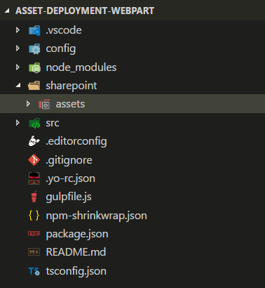
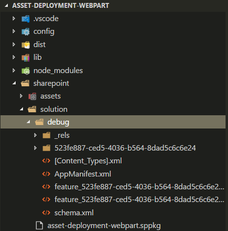
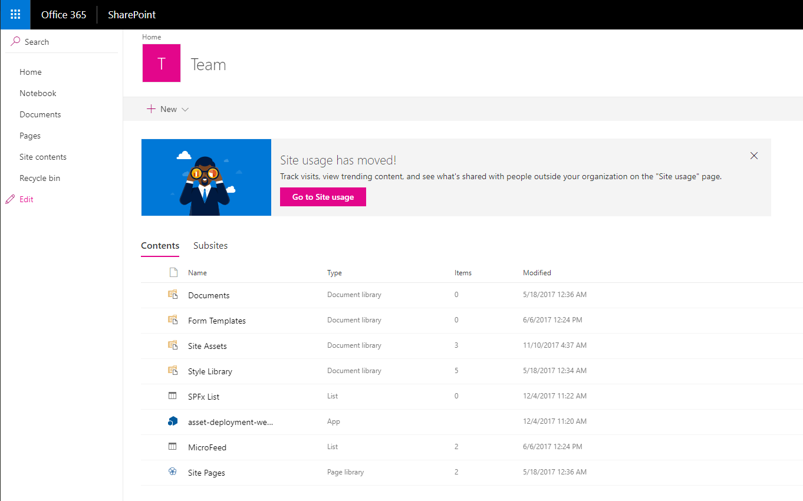
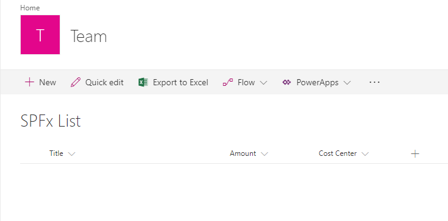
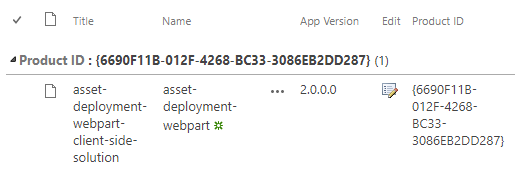
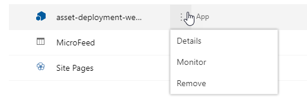
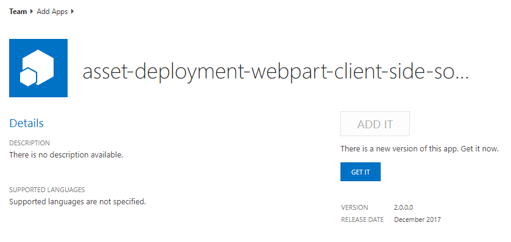
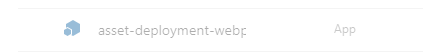
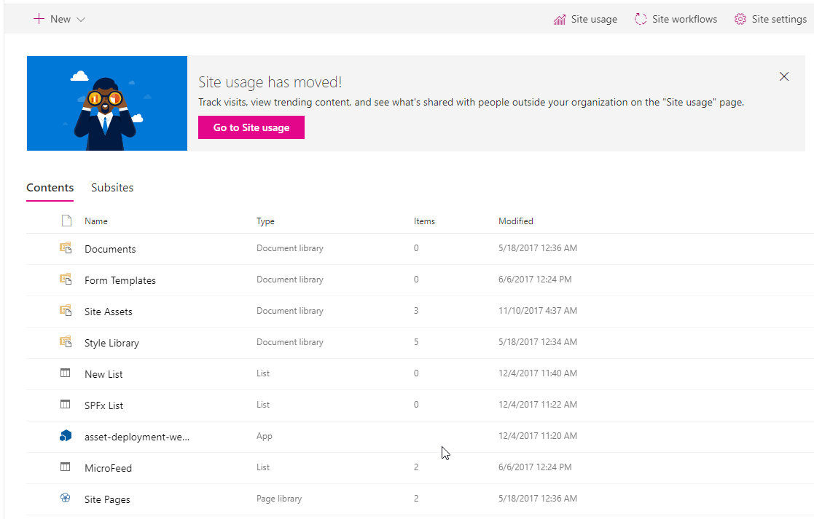

# <a name="provisioning-sharepoint-assets-from-your-sharepoint-client-side-web-part"></a><span data-ttu-id="ed028-102">Bereitstellen von SharePoint-Ressourcen aus Ihrem clientseitigen SharePoint-Webpart</span><span class="sxs-lookup"><span data-stu-id="ed028-102">Provisioning SharePoint assets from your SharePoint client-side web part</span></span>

<span data-ttu-id="ed028-p101">In diesem Artikel wird beschrieben, wie SharePoint-Ressourcen als Teil der SharePoint Framework-Lösung bereitgestellt werden. Diese Ressourcen werden auf SharePoint-Websites bereitgestellt, wenn die Lösung darauf installiert wird. Der Artikel behandelt auch die erforderlichen Schritte zur Einführung möglicher Updates als Teil von neuen Versionen des Pakets. Dieses Verfahren ist identisch mit dem Add-in-Update.</span><span class="sxs-lookup"><span data-stu-id="ed028-p101">This article describes how to provision SharePoint assets as part of the SharePoint Framework solution. These assets are deployed to SharePoint sites when the solution is installed on it. Article also covers needed steps for introducing possible updates as part of new versions of the package. This process is exactly the same as for add-in update.</span></span>

## <a name="prerequisites"></a><span data-ttu-id="ed028-107">Voraussetzungen</span><span class="sxs-lookup"><span data-stu-id="ed028-107">Prerequisites</span></span>
<span data-ttu-id="ed028-108">Führen Sie die folgenden Schritte aus, bevor Sie sich mit dem grundlegenden Fluss des Erstellens eines benutzerdefinierten, clientseitigen Webparts vertraut machen:</span><span class="sxs-lookup"><span data-stu-id="ed028-108">Complete the following steps before you start to understand the basic flow of creating a custom client-side web part:</span></span>

* [<span data-ttu-id="ed028-109">Erstellen des ersten Webparts</span><span class="sxs-lookup"><span data-stu-id="ed028-109">Build your first web part</span></span>](build-a-hello-world-web-part.md)
* [<span data-ttu-id="ed028-110">Verbinden mit SharePoint</span><span class="sxs-lookup"><span data-stu-id="ed028-110">Connect to SharePoint</span></span>](connect-to-sharepoint.md) 

## <a name="resources"></a><span data-ttu-id="ed028-111">Ressourcen</span><span class="sxs-lookup"><span data-stu-id="ed028-111">Resources</span></span>
<span data-ttu-id="ed028-112">In den folgenden Ressourcen finden Sie weitere Informationen zu den in diesem Lernprogramm behandelten Themen.</span><span class="sxs-lookup"><span data-stu-id="ed028-112">See following resources for additional details around the covered topics in this tutorial.</span></span>

* [<span data-ttu-id="ed028-113">Bereitstellen von SharePoint-Elementen mit Ihrem Lösungspaket</span><span class="sxs-lookup"><span data-stu-id="ed028-113">Provision SharePoint assets with your solution package</span></span>](../../toolchain/provision-sharepoint-assets.md)
* [<span data-ttu-id="ed028-114">Beispiellösung - Bereitstellen von SharePoint-Ressourcen als Teil des SPFx-Pakets</span><span class="sxs-lookup"><span data-stu-id="ed028-114">Sample solution - Deployment of SharePoint assets as part of SPFx package</span></span>](https://github.com/SharePoint/sp-dev-fx-webparts/tree/master/samples/react-feature-framework)

## <a name="create-a-new-web-part-project"></a><span data-ttu-id="ed028-115">Erstellen eines neuen Webpart-Projekts</span><span class="sxs-lookup"><span data-stu-id="ed028-115">Create a new web part project</span></span>

<span data-ttu-id="ed028-116">Erstellen Sie an einem Speicherort Ihrer Wahl ein neues Projektverzeichnis:</span><span class="sxs-lookup"><span data-stu-id="ed028-116">Create a new project directory in your favorite location:</span></span>

```
md asset-deployment-webpart
```

<span data-ttu-id="ed028-117">Wechseln Sie in das Projektverzeichnis:</span><span class="sxs-lookup"><span data-stu-id="ed028-117">Go to the project directory:</span></span>

```
cd asset-deployment-webpart
```
    
<span data-ttu-id="ed028-118">Führen Sie den Yeoman-SharePoint-Generator aus, um eine neue clientseitige Webpartlösung zu erstellen:</span><span class="sxs-lookup"><span data-stu-id="ed028-118">Create a new client-side web part solution by running the Yeoman SharePoint Generator:</span></span>

```
yo @microsoft/sharepoint
```

<span data-ttu-id="ed028-119">Es werden verschiedene Eingabeaufforderungen angezeigt. Gehen Sie wie folgt vor:</span><span class="sxs-lookup"><span data-stu-id="ed028-119">When prompted:</span></span>

* <span data-ttu-id="ed028-120">Akzeptieren Sie den Standardnamen **asset-deployment-webpart** als Lösungsnamen, und drücken Sie die **EINGABETASTE**.</span><span class="sxs-lookup"><span data-stu-id="ed028-120">Accept the default **asset-deployment-webpart** as your solution name and choose **Enter**.</span></span>
* <span data-ttu-id="ed028-121">Wählen Sie **Aktuellen Ordner verwenden** als Speicherort für die Dateien aus.</span><span class="sxs-lookup"><span data-stu-id="ed028-121">Select **Use the current folder** as the location for the files.</span></span>

<span data-ttu-id="ed028-122">Über die nächsten Eingabeaufforderungen werden spezifische Informationen zum Webpart abgefragt:</span><span class="sxs-lookup"><span data-stu-id="ed028-122">The next set of prompts will ask for specific information about your web part:</span></span>

* <span data-ttu-id="ed028-123">Akzeptieren Sie die Standardeinstellung **No javascript web framework** als Framework, und drücken Sie die **EINGABETASTE**, um fortzufahren.</span><span class="sxs-lookup"><span data-stu-id="ed028-123">Accept the default **No JavaScipt web framework** option for the framework and choose **Enter** to continue.</span></span>
* <span data-ttu-id="ed028-124">Geben Sie **AssetDeployment** als Webpartnamen ein, und drücken Sie die **EINGABETASTE**.</span><span class="sxs-lookup"><span data-stu-id="ed028-124">Type **AssetDeployment** for the web part name and choose **Enter**.</span></span>
* <span data-ttu-id="ed028-125">Geben Sie**AssetDeployment-Webpart** als Beschreibung des Webparts ein, und drücken Sie die **EINGABETASTE**.</span><span class="sxs-lookup"><span data-stu-id="ed028-125">Enter **AssetDeployment Web Part** as the description of the web part and choose **Enter**.</span></span> 

<span data-ttu-id="ed028-p102">An diesem Punkt installiert Yeoman die erforderlichen Abhängigkeiten und erstellt ein Gerüst für die Lösungsdateien. Das kann einige Minuten dauern. Yeoman erstellt ein Gerüst für das Projekt, um auch das **AssetDeployment**-Webpart einzuschließen.</span><span class="sxs-lookup"><span data-stu-id="ed028-p102">At this point, Yeoman will install the required dependencies and scaffold the solution files. This might take a few minutes. Yeoman will scaffold the project to include your **AssetDeployment** web part as well.</span></span>

<span data-ttu-id="ed028-129">Sobald das Gerüst abgeschlossen ist, sperren Sie die Version der Projektabhängigkeiten, indem Sie den folgenden Befehl ausführen:</span><span class="sxs-lookup"><span data-stu-id="ed028-129">Once the scaffolding completes, lock down the version of the project dependencies by running the following command:</span></span>

```sh
npm shrinkwrap
```

<span data-ttu-id="ed028-130">Geben Sie Folgendes ein, um das Webpart-Projekt in Visual Studio Code zu öffnen:</span><span class="sxs-lookup"><span data-stu-id="ed028-130">In the console, type the following to open the web part project in Visual Studio Code:</span></span>

```
code .
```

## <a name="create-folder-structure-for-your-sharepoint-assets"></a><span data-ttu-id="ed028-131">Erstellen der Ordnerstruktur für Ihre SharePoint-Ressourcen</span><span class="sxs-lookup"><span data-stu-id="ed028-131">Create folder structure for your SharePoint assets</span></span>

<span data-ttu-id="ed028-132">Wir müssen zuerst einen **Ressourcen**ordner erstellen, in dem die gesamten Featureframeworkressourcen platziert werden, die zum Bereitstellen von SharePoint-Strukturen verwendet werden, wenn das Paket installiert wird.</span><span class="sxs-lookup"><span data-stu-id="ed028-132">We'll first need to create an **assets** folder where we will place all feature framework assets used to provision SharePoint structures when package is installed.</span></span>

* <span data-ttu-id="ed028-133">Erstellen eines Ordners mit dem Namen **Sharepoint** auf der Stammebene der Lösung</span><span class="sxs-lookup"><span data-stu-id="ed028-133">Create folder called **sharepoint** to the root of the solution</span></span>
* <span data-ttu-id="ed028-134">Erstellen eines Ordners mit dem Namen **Ressourcen** als Unterordner für den soeben erstellten **Sharepoint**-Ordner</span><span class="sxs-lookup"><span data-stu-id="ed028-134">Create folder called **assets** as a sub folder for the just created **sharepoint** folder</span></span>

<span data-ttu-id="ed028-135">Die Lösungsstruktur sollte wie im folgenden Bild aussehen.</span><span class="sxs-lookup"><span data-stu-id="ed028-135">Your solution structure should be looking like in the following picture</span></span>



## <a name="create-feature-framework-files-for-initial-deployment"></a><span data-ttu-id="ed028-137">Erstellen von Featureframeworkdateien für die anfängliche Bereitstellung</span><span class="sxs-lookup"><span data-stu-id="ed028-137">Create feature framework files for initial deployment</span></span>
<span data-ttu-id="ed028-p103">Um SharePoint-Ressourcen auf Websites mit Featureframeworkelementen bereitstellen zu können, müssen wir die erforderlichen XML-Dateien für den Ressourcenordner erstellen. Unterstützte Elemente für die SharePoint Framework-Lösungspakete sind wie folgt:</span><span class="sxs-lookup"><span data-stu-id="ed028-p103">To be able to provision SharePoint assets to sites with feature framework elements, we'll need to create needed xml files to the asset folder. Supported elements for the SharePoint Framework solution packages are following:</span></span>

* <span data-ttu-id="ed028-140">Felder/Websitespalten</span><span class="sxs-lookup"><span data-stu-id="ed028-140">Fields / Site columns</span></span>
* <span data-ttu-id="ed028-141">Inhaltstypen</span><span class="sxs-lookup"><span data-stu-id="ed028-141">Content Types</span></span>
* <span data-ttu-id="ed028-142">Listeninstanzen</span><span class="sxs-lookup"><span data-stu-id="ed028-142">List instances</span></span>
* <span data-ttu-id="ed028-143">Listeninstanzen mit benutzerdefiniertem Schema</span><span class="sxs-lookup"><span data-stu-id="ed028-143">List instances with custom schema</span></span>

<span data-ttu-id="ed028-144">In den folgenden Schritten wird die erforderliche Struktur definiert, die bereitgestellt werden soll.</span><span class="sxs-lookup"><span data-stu-id="ed028-144">In following steps, we'll define the needed structure to be provisioned.</span></span>

### <a name="add-elementxml-file-for-sharepoint-definitions"></a><span data-ttu-id="ed028-145">Hinzufügen der Datei „element.xml“ für SharePoint-Definitionen</span><span class="sxs-lookup"><span data-stu-id="ed028-145">Add element.xml file for SharePoint definitions</span></span>
<span data-ttu-id="ed028-146">Erstellen Sie eine neue Datei innerhalb des Ordners **Sharepoint\Ressourcen** mit dem Namen **elements.xml**.</span><span class="sxs-lookup"><span data-stu-id="ed028-146">Create a new file inside the **sharepoint\assets** folder named as **elements.xml**</span></span>

<span data-ttu-id="ed028-147">Kopieren Sie die folgende XML-Struktur in **elements.xml**.</span><span class="sxs-lookup"><span data-stu-id="ed028-147">Copy the following xml structure into **elements.xml**.</span></span>

```xml
<?xml version="1.0" encoding="utf-8"?>
<Elements xmlns="http://schemas.microsoft.com/sharepoint/">

    <Field ID="{060E50AC-E9C1-4D3C-B1F9-DE0BCAC300F6}"
            Name="SPFxAmount"
            DisplayName="Amount"
            Type="Currency"
            Decimals="2"
            Min="0"
            Required="FALSE"
            Group="SPFx Columns" />

    <Field ID="{943E7530-5E2B-4C02-8259-CCD93A9ECB18}"
            Name="SPFxCostCenter"
            DisplayName="Cost Center"
            Type="Choice"
            Required="FALSE"
            Group="SPFx Columns">
        <CHOICES>
        <CHOICE>Administration</CHOICE>
        <CHOICE>Information</CHOICE>
        <CHOICE>Facilities</CHOICE>
        <CHOICE>Operations</CHOICE>
        <CHOICE>Sales</CHOICE>
        <CHOICE>Marketing</CHOICE>
        </CHOICES>
    </Field>

    <ContentType ID="0x010042D0C1C200A14B6887742B6344675C8B" 
            Name="Cost Center" 
            Group="SPFx Content Types" 
            Description="Sample content types from web part solution">
        <FieldRefs>
            <FieldRef ID="{060E50AC-E9C1-4D3C-B1F9-DE0BCAC300F6}" /> 
            <FieldRef ID="{943E7530-5E2B-4C02-8259-CCD93A9ECB18}" />
        </FieldRefs>
    </ContentType> 

    <ListInstance 
            CustomSchema="schema.xml"
            FeatureId="00bfea71-de22-43b2-a848-c05709900100"
            Title="SPFx List" 
            Description="SPFx List"
            TemplateType="100"
            Url="Lists/SPFxList">
    </ListInstance>

</Elements>
```

<span data-ttu-id="ed028-148">Beachten Sie zu der eingefügten XML-Struktur Folgendes:</span><span class="sxs-lookup"><span data-stu-id="ed028-148">Things to note about the pasted xml structure:</span></span>
* <span data-ttu-id="ed028-149">Wir stellen zwei Felder, den Inhaltstyp und eine Listeninstanz mit benutzerdefiniertem Schema auf der Website bereit.</span><span class="sxs-lookup"><span data-stu-id="ed028-149">We are provisioning two fields, content type and a list instance with custom schema to the site</span></span>
* <span data-ttu-id="ed028-150">Definitionen verwenden das Standardschema für das Featureframework, das SharePoint-Entwickler gut kennen.</span><span class="sxs-lookup"><span data-stu-id="ed028-150">Definitions are using standard Feature Framework schema, which is well known for SharePoint developers</span></span>
* <span data-ttu-id="ed028-151">Auf benutzerdefinierte Felder wird in dem eingeführten Inhaltstyp verwiesen.</span><span class="sxs-lookup"><span data-stu-id="ed028-151">Custom fields are being referenced in the introduced content type</span></span>
* <span data-ttu-id="ed028-p104">Wir verwenden das **CustomSchema**-Attribut im **ListInstance**-Element, um die Bereitstellungszeit der schema.xml-Datei für die Liste zu definieren. Auf diese Weise basiert die Liste immer noch auf der einsatzbereiten Listenvorlage (die normale benutzerdefinierte Liste „100“ in diesem Fall), es kann jedoch während der anfänglichen Bereitstellung eine alternative Bereitstellungsdefinition definiert werden.</span><span class="sxs-lookup"><span data-stu-id="ed028-p104">We use **CustomSchema** attribute in the **ListInstance** element to define provisioning time schema.xml file for the list. This way list is still based on out-of-the-box list template (Normal custom list '100' in this case), but we can define alternative provisioning definition during initial provisioning.</span></span>

> <span data-ttu-id="ed028-154">Weitere Einzelheiten zu den verwendeten Schemastrukturen finden sie in der [Featureframeworkdokumentation](https://msdn.microsoft.com/en-us/library/office/ms460318(v=office.14).aspx) auf MSDN.</span><span class="sxs-lookup"><span data-stu-id="ed028-154">More details on the used schema structures can be found from [Feature Framework documentation](https://msdn.microsoft.com/en-us/library/office/ms460318(v=office.14).aspx) at MSDN.</span></span>

### <a name="add-schemaxml-file-for-defining-list-structure"></a><span data-ttu-id="ed028-155">Hinzufügen der Datei „schema.xml“ zum Definieren der Listenstruktur</span><span class="sxs-lookup"><span data-stu-id="ed028-155">Add schema.xml file for defining list structure</span></span>
<span data-ttu-id="ed028-156">Im vorherigen Schritt haben wir auf die Datei **schema.xml** im **CustomSchema**-Attribut des **ListInstance**-Elements verwiesen, dies muss also in das Paket eingeschlossen werden.</span><span class="sxs-lookup"><span data-stu-id="ed028-156">In previous step, we referenced **schema.xml** file in the **CustomSchema** attribute of the **ListInstance** element, so we'll need to include that in our package.</span></span> 

<span data-ttu-id="ed028-157">Erstellen Sie eine neue Datei innerhalb des Ordners **SharePoint\Ressourcen** mit dem Namen **schema.xml**.</span><span class="sxs-lookup"><span data-stu-id="ed028-157">Create a new file inside the **sharepoint\assets** folder named as **schema.xml**</span></span>

<span data-ttu-id="ed028-158">Kopieren Sie die folgende XML-Struktur in **schema.xml**.</span><span class="sxs-lookup"><span data-stu-id="ed028-158">Copy the following xml structure into **schema.xml**.</span></span>

```xml
<List xmlns:ows="Microsoft SharePoint" Title="Basic List" EnableContentTypes="TRUE" FolderCreation="FALSE" Direction="$Resources:Direction;" Url="Lists/Basic List" BaseType="0" xmlns="http://schemas.microsoft.com/sharepoint/">
  <MetaData>
    <ContentTypes>
      <ContentTypeRef ID="0x010042D0C1C200A14B6887742B6344675C8B" />
    </ContentTypes>
    <Fields></Fields>
    <Views>
      <View BaseViewID="1" Type="HTML" WebPartZoneID="Main" DisplayName="$Resources:core,objectiv_schema_mwsidcamlidC24;" DefaultView="TRUE" MobileView="TRUE" MobileDefaultView="TRUE" SetupPath="pages\viewpage.aspx" ImageUrl="/_layouts/images/generic.png" Url="AllItems.aspx">
        <XslLink Default="TRUE">main.xsl</XslLink>
        <JSLink>clienttemplates.js</JSLink>
        <RowLimit Paged="TRUE">30</RowLimit>
        <Toolbar Type="Standard" />
        <ViewFields>
          <FieldRef Name="LinkTitle"></FieldRef>
          <FieldRef Name="SPFxAmount"></FieldRef>
          <FieldRef Name="SPFxCostCenter"></FieldRef>
        </ViewFields>
        <Query>
          <OrderBy>
            <FieldRef Name="ID" />
          </OrderBy>
        </Query>
      </View>
    </Views>
    <Forms>
      <Form Type="DisplayForm" Url="DispForm.aspx" SetupPath="pages\form.aspx" WebPartZoneID="Main" />
      <Form Type="EditForm" Url="EditForm.aspx" SetupPath="pages\form.aspx" WebPartZoneID="Main" />
      <Form Type="NewForm" Url="NewForm.aspx" SetupPath="pages\form.aspx" WebPartZoneID="Main" />
    </Forms>
  </MetaData>
</List>
```

<span data-ttu-id="ed028-159">Beachten Sie in der enthaltenen XML-Struktur Folgendes:</span><span class="sxs-lookup"><span data-stu-id="ed028-159">Things to note in the included xml structure:</span></span>
* <span data-ttu-id="ed028-160">Auf den benutzerdefinierten Inhaltstyp, der unter Verwendung der Datei **elements.xml** bereitgestellt wird, wird im **ContentTypeRef**-Element verwiesen.</span><span class="sxs-lookup"><span data-stu-id="ed028-160">Custom content type deployed using **elements.xml** file is referenced in the **ContentTypeRef** element</span></span>
* <span data-ttu-id="ed028-161">Auf benutzerdefinierte Felder mit dem Namen **SPFxAmount** und **SPFxCostCenter**wird im **FieldRef**-Element verwiesen.</span><span class="sxs-lookup"><span data-stu-id="ed028-161">Custom fields called **SPFxAmount** and **SPFxCostCenter** are being referenced in the **FieldRef** element</span></span>

> <span data-ttu-id="ed028-162">Weitere Einzelheiten zu den verwendeten Schemastrukturen finden Sie im Artikel [Grundlegendes zu Schema.xml-Dateien](https://msdn.microsoft.com/en-us/library/office/ms459356(v=office.14).aspx) auf MSDN.</span><span class="sxs-lookup"><span data-stu-id="ed028-162">More details on the used schema structures can be found from [Understanding Schema.xml Files](https://msdn.microsoft.com/en-us/library/office/ms459356(v=office.14).aspx) article at MSDN.</span></span>

## <a name="ensure-that-definitions-are-taken-into-use-in-build-pipeline"></a><span data-ttu-id="ed028-163">Sicherstellen, dass Definitionen in der Buildpipeline verwendet werden</span><span class="sxs-lookup"><span data-stu-id="ed028-163">Ensure that definitions are taken into use in build pipeline</span></span>
<span data-ttu-id="ed028-p105">Nun haben wir die erforderlichen Strukturen für das Bereitstellen von SharePoint-Ressourcen automatisch aus der Lösung erstellt, wenn diese bereitgestellt wird. Der nächste Schritt besteht darin, sicherzustellen, dass diese XML-Dateien als Teil der Lösungsdatei verpackt werden.</span><span class="sxs-lookup"><span data-stu-id="ed028-p105">Now we have created the needed structures for provisioning SharePoint assets automatically from the solution when it's deployed. Next step is to ensure that we package these xml files as part of the solution file.</span></span>

<span data-ttu-id="ed028-p106">Öffnen Sie **package-solution.json** im Ordner „config“. Die Datei **package-solution.json** definiert die Paketmetadaten, wie im folgenden Code dargestellt:</span><span class="sxs-lookup"><span data-stu-id="ed028-p106">Open **package-solution.json** from the config folder. The **package-solution.json** file defines the package metadata as shown in the following code:</span></span>

```json
{
  "solution": {
    "name": "asset-deployment-webpart-client-side-solution",
    "id": "31086065-dbdb-493f-b02e-7b7f97f45bd9",
    "version": "1.0.0.0"
  },
  "paths": {
    "zippedPackage": "solution/asset-deployment-webpart.sppkg"
  }
}
```

<span data-ttu-id="ed028-p107">Um sicherzustellen, dass unsere neu hinzugefügten Featureframeworkdateien beim Verpacken der Lösung berücksichtigt werden, müssen wir eine Featureframework-Featuredefinition für das Lösungspaket einschließen. Wir werden eine JSON-Definition für erforderliche Features innerhalb der Lösungsstruktur einschließen, wie im folgenden Code dargestellt.</span><span class="sxs-lookup"><span data-stu-id="ed028-p107">To ensure that our newly added Feature Framework files are taken into account while solution is being packaged, we'll need to include a Feature Framework feature definition for the solution package. Let's include a JSON definition for needed feature inside of the solution structure as demonstrated in below code.</span></span>

```json
{
  "solution": {
    "name": "asset-deployment-webpart-client-side-solution",
    "id": "31086065-dbdb-493f-b02e-7b7f97f45bd9",
    "version": "1.0.0.0",
    "features": [{
      "title": "asset-deployment-webpart-client-side-solution",
      "description": "asset-deployment-webpart-client-side-solution",
      "id": "523fe887-ced5-4036-b564-8dad5c6c6e24",
      "version": "1.0.0.0",
      "assets": {        
        "elementManifests": [
          "elements.xml"
        ],
        "elementFiles":[
          "schema.xml"
        ]
      }
    }]
  },
  "paths": {
    "zippedPackage": "solution/asset-deployment-webpart.sppkg"
  }
}

```

<span data-ttu-id="ed028-170">Beachten Sie bei den hinzugefügten JSON-Definitionen Folgendes:</span><span class="sxs-lookup"><span data-stu-id="ed028-170">Things to note in the added json definitions:</span></span>
* <span data-ttu-id="ed028-171">Technisch gesehen können mehrere Features in dem Paket vorhanden sein, da es sich bei **Features** um eine Sammlung handelt. Dies wird aber nicht empfohlen.</span><span class="sxs-lookup"><span data-stu-id="ed028-171">You can technically have multiple features in the package since **features** is a collection, which is not however recommended</span></span>
* <span data-ttu-id="ed028-172">Auf **elements.xml** wird unter „elementManifests“ verwiesen, sodass es für die tatsächliche Feature-XML-Struktur ordnungsgemäß als Elementmanifestdatei verpackt wird.</span><span class="sxs-lookup"><span data-stu-id="ed028-172">**elements.xml** is referenced under elementManifests, so that it's packaged properly for the actual feature xml structure as element manifest file</span></span>
* <span data-ttu-id="ed028-p108">In der Definition können mehrere element.xml-Dateien vorhanden sein, und diese würden in der Reihenfolge ausgeführt, in der sie in der JSON-Definition erwähnt werden. Im Allgemeinen sollten Sie die Verwendung mehrerer „element.xml“-Dateien vermeiden, da dadurch eine unnötige Komplexität entsteht. Sie können alle erforderlichen Ressourcen in einer einzigen „element.xml“-Datei definieren.</span><span class="sxs-lookup"><span data-stu-id="ed028-p108">You can have multiple element.xml files in the definition and they would be executed in the order they are mentioned in the JSON definition. Typically, you should avoid usage of multiple element.xml since it adds unnecessary complexity. You can define all needed assets in single element.xml file</span></span>

## <a name="deploy-and-test-asset-provisioning"></a><span data-ttu-id="ed028-176">Bereitstellen und Testen der Bereitstellung von Ressourcen</span><span class="sxs-lookup"><span data-stu-id="ed028-176">Deploy and test asset provisioning</span></span>
<span data-ttu-id="ed028-p109">Jetzt sind Sie bereit, die Lösung in SharePoint bereitzustellen. Da wir in diesem Fall Ressourcen direkt auf SharePoint-Websites bereitstellen, wenn die Lösung installiert wird, können Sie die Funktion in der lokalen oder Online-Workbench nicht testen.</span><span class="sxs-lookup"><span data-stu-id="ed028-p109">Now you are ready to deploy the solution to SharePoint. Since in this case we are provisioning assets directly to the SharePoint sites when the solution is installed, you cannot test the capability in local or in online workbench.</span></span>

<span data-ttu-id="ed028-179">Geben Sie im Konsolenfenster den folgenden Befehl ein, um Ihre clientseitige Lösung, die das Webpart enthält, zu verpacken, damit die grundlegende Struktur für das Verpacken vorbereitet wird:</span><span class="sxs-lookup"><span data-stu-id="ed028-179">In the console window, enter the following command to package your client-side solution that contains the web part, so that we get the basic structure ready for packaging:</span></span>

```
gulp bundle
```
<span data-ttu-id="ed028-180">Führen Sie als Nächstes den folgenden Befehl aus, damit das Lösungspaket erstellt wird:</span><span class="sxs-lookup"><span data-stu-id="ed028-180">Next execute following command, so that the solution package is created:</span></span>

```
gulp package-solution
```
<span data-ttu-id="ed028-181">Der Befehl erstellt das Paket im `sharepoint/solution`-Ordner:</span><span class="sxs-lookup"><span data-stu-id="ed028-181">The command will create the package in the `sharepoint/solution` folder:</span></span>

```
asset-deployment-webpart.sppkg
```
<span data-ttu-id="ed028-p110">Vor dem Testen des Pakets in SharePoint sehen wir uns schnell die Standardstrukturen an, die für das Paket um die definierten Featureframeworkelemente herum erstellt wurden. Wechseln Sie zurück zu Visual Studio Code, und erweitern Sie den Ordner `sharepoint/solution/debug`, der die raw.xml-Strukturen enthält, die in das tatsächliche **sppkg**-Paket eingeschlossen werden sollen.</span><span class="sxs-lookup"><span data-stu-id="ed028-p110">Before testing the package in the SharePoint, let's quickly have a look on the default structures created for the package around the defined feature framework elements. Move back to Visual Studio Code side and expand `sharepoint/solution/debug` folder, which contains the raw xml structures to be included in the actual **sppkg** package.</span></span>



<span data-ttu-id="ed028-185">Als Nächstes müssen Sie das Paket, das generiert wurde, im App-Katalog bereitstellen.</span><span class="sxs-lookup"><span data-stu-id="ed028-185">Next you need to deploy the package that was generated to the App Catalog.</span></span>

<span data-ttu-id="ed028-186">Wechseln Sie zum App-Katalog der Website.</span><span class="sxs-lookup"><span data-stu-id="ed028-186">Go to your site's App Catalog.</span></span>

<span data-ttu-id="ed028-p111">Laden Sie das Paket „asset-deployment-webpart.sppkg“, das sich im Ordner `sharepoint/solution` befindet, in den App-Katalog hoch, oder platzieren Sie es dort per Drag & Drop. In SharePoint wird ein Dialogfeld angezeigt, und Sie werden aufgefordert, der clientseitigen Lösung, die bereitgestellt werden soll, zu vertrauen.</span><span class="sxs-lookup"><span data-stu-id="ed028-p111">Upload or drag and drop the asset-deployment-webpart.sppkg located in the `sharepoint/solution` folder  to the App Catalog. SharePoint will display a dialog and ask you to trust the client-side solution to deploy.</span></span>


> <span data-ttu-id="ed028-p112">Hinweis:  SharePoint überprüft das veröffentlichte Paket, wenn es bereitgestellt wird, und Sie sehen nur das Dialogfeld für die Vertrauensstellung, wenn das Paket bereitgestellt werden kann. Sie können auch den Status dieser Überprüfung in der Spalte „Gültiges App-Paket“ im App-Katalog anzeigen.</span><span class="sxs-lookup"><span data-stu-id="ed028-p112">Note. SharePoint validates the published package when it's deployed and you only see the trust dialog, if package is valid for deployment. You can also see the status around this validation from the 'Valid App Package' column in the app catalog.</span></span>

<span data-ttu-id="ed028-p113">Wechseln Sie zu der Website, auf der Sie die Bereitstellung der SharePoint-Ressource testen möchten. Dies könnte eine Websitesammlung im Mandanten sein, auf dem Sie dieses Lösungspaket bereitgestellt haben.</span><span class="sxs-lookup"><span data-stu-id="ed028-p113">Go to the site where you want to test SharePoint asset provisioning. This could be any site collection in the tenant where you deployed this solution package.</span></span> 

<span data-ttu-id="ed028-195">Wählen Sie das Zahnräder-Symbol in der oberen Navigationsleiste auf der rechten Seite und dann **Eine App hinzufügen** aus, um zu Ihrer Apps-Seite zu wechseln.</span><span class="sxs-lookup"><span data-stu-id="ed028-195">Chose the gears icon on the top nav bar on the right and choose **Add an app** to go to your Apps page.</span></span>

<span data-ttu-id="ed028-196">Geben Sie in das Feld **Suchen** die Zeichenfolge **Bereitstellung** ein, und drücken Sie die **Eingabetaste**, um Ihre Apps zu filtern.</span><span class="sxs-lookup"><span data-stu-id="ed028-196">In the **Search** box, enter **deployment** and choose **Enter** to filter your apps.</span></span> 


<span data-ttu-id="ed028-p114">Wählen Sie die App **asset-deployment-webpart-client-side-solution** aus, um die App auf der Website zu installieren. Wenn die Installation abgeschlossen ist, aktualisieren Sie die Seite, indem Sie **F5** drücken.</span><span class="sxs-lookup"><span data-stu-id="ed028-p114">Choose the **asset-deployment-webpart-client-side-solution** app to install the app on the site. When installation is completed, refresh the page by pressing **F5**.</span></span>



<span data-ttu-id="ed028-201">Beachten Sie, dass die benutzerdefinierte **SPFx-Liste** ebenfalls auf der Website als Teil der Lösungspaketbereitstellung bereitgestellt wurde.</span><span class="sxs-lookup"><span data-stu-id="ed028-201">Notice how the custom **SPFx List** has been also provisioned to site as part of the solution package deployment.</span></span>

<span data-ttu-id="ed028-202">Klicken Sie auf **SPFx-Liste**, um zu der Liste zu wechseln.</span><span class="sxs-lookup"><span data-stu-id="ed028-202">Click **SPFx List** to move to the list</span></span>



<span data-ttu-id="ed028-204">Beachten Sie, dass die benutzerdefinierten Felder **Betrag** und **Kostenstelle** automatisch in der Standardansicht der Liste angezeigt werden.</span><span class="sxs-lookup"><span data-stu-id="ed028-204">Notice how the custom fields **Amount** and **Cost Center** are visible automatically in the default view of the list.</span></span> 

## <a name="define-upgrade-actions-for-new-version"></a><span data-ttu-id="ed028-205">Definieren von Upgradeaktionen für die neue Version</span><span class="sxs-lookup"><span data-stu-id="ed028-205">Define upgrade actions for new version</span></span>
<span data-ttu-id="ed028-p115">Immer dann, wenn Sie eine neue Version Ihrer SharePoint Framework-Lösung erstellen, gibt es möglicherweise erforderliche Änderungen an den bereitgestellten SharePoint-Ressourcen. Sie können die Unterstützung der Upgradeaktion für das Featureframework nutzen, wenn eine neue Version des Pakets bereitgestellt wird.</span><span class="sxs-lookup"><span data-stu-id="ed028-p115">Whenever you build a new version of your SharePoint Framework solution, you might have some required changes on the provisioned SharePoint assets. You can take advantage of the Feature Framework upgrade action support when a new version of the package is being deployed.</span></span> 

<span data-ttu-id="ed028-208">SharePoint Framework-Lösungen unterstützen die folgenden Upgradeaktionsdefinitionen für das Featureframework:</span><span class="sxs-lookup"><span data-stu-id="ed028-208">SharePoint Framework solutions do support following Feature Framework upgrade action definitions</span></span>
* <span data-ttu-id="ed028-209">ApplyElementManifest</span><span class="sxs-lookup"><span data-stu-id="ed028-209">ApplyElementManifest</span></span>
* <span data-ttu-id="ed028-210">AddContentTypeField</span><span class="sxs-lookup"><span data-stu-id="ed028-210">AddContentTypeField</span></span>

> <span data-ttu-id="ed028-211">Weitere Informationen zu den Upgradeaktionsdefinitionen für das Featureframework finden Sie im Artikel [Aktualisierungsverfahren für Add-Ins für SharePoint](https://msdn.microsoft.com/de-DE/library/office/fp179904.aspx) auf MSDN.</span><span class="sxs-lookup"><span data-stu-id="ed028-211">You can read more details around the Feature Framework upgrade action definitions from [SharePoint add-ins update process](https://msdn.microsoft.com/de-DE/library/office/fp179904.aspx) article at MSDN.</span></span>

### <a name="add-new-elementxml-file-for-the-new-version"></a><span data-ttu-id="ed028-212">Hinzufügen einer neuen „element.xml“-Datei für die neue Version</span><span class="sxs-lookup"><span data-stu-id="ed028-212">Add new element.xml file for the new version</span></span>
<span data-ttu-id="ed028-213">Wechseln Sie zurück zu Ihrer Lösung in Visual Studio Code.</span><span class="sxs-lookup"><span data-stu-id="ed028-213">Move back to your solution in the Visual Studio code.</span></span>

<span data-ttu-id="ed028-214">Erstellen Sie eine neue Datei innerhalb des Ordners **Sharepoint\Ressourcen** mit dem Namen **elements-v2.xml**.</span><span class="sxs-lookup"><span data-stu-id="ed028-214">Create a new file inside the **sharepoint\assets** folder named as **elements-v2.xml**</span></span>

<span data-ttu-id="ed028-215">Kopieren Sie die folgende XML-Struktur in die Datei **elements-v2.xml**, in der eine neue SharePoint-Liste definiert wird, die mit dem Titel **Neue Liste** bereitgestellt werden soll.</span><span class="sxs-lookup"><span data-stu-id="ed028-215">Copy the following xml structure into **elements-v2.xml**, which defines a new SharePoint list to be provisioned with a title of **New List**.</span></span>

```xml
<?xml version="1.0" encoding="utf-8"?>
<Elements xmlns="http://schemas.microsoft.com/sharepoint/">

    <ListInstance 
            FeatureId="00bfea71-de22-43b2-a848-c05709900100"
            Title="New List" 
            Description="New list provisioned from v2"
            TemplateType="100"
            Url="Lists/NewList">
    </ListInstance>

</Elements>
```
<span data-ttu-id="ed028-216">Außerdem wird eine Definition für die tatsächlichen Upgradeaktionen für das Featureframework benötigten, erstellen Sie daher eine neue Datei innerhalb des Ordners **Sharepoint\Ressourcen** mit dem Namen **upgrade-actions-v2.xml**</span><span class="sxs-lookup"><span data-stu-id="ed028-216">We also need a definition for actual Feature Framework upgrade actions, so create a new file inside the **sharepoint\assets** folder named as **upgrade-actions-v2.xml**</span></span>

<span data-ttu-id="ed028-p116">Kopieren Sie die folgende XML-Struktur in **upgrade-actions-v2.xml**. Beachten Sie, dass der Feature-GUID-Verweis in dem Pfad auf den automatisch erstellten Ordner unter dem Ordner `sharepoint/solution/debug` verweist und basierend auf Ihrer Lösung aktualisiert werden muss. Diese GUID stimmt auch mit der GUID des Features überein, die wir in der Datei **package-solution.json** definiert haben.</span><span class="sxs-lookup"><span data-stu-id="ed028-p116">Copy the following xml structure into **upgrade-actions-v2.xml**. Notice that the feature guid reference in the path refers to the automatically created folder under  `sharepoint/solution/debug` folder and has to be updated based on your solution. This guid is also matching on the guid of the feature, which we defined in the **package-solution.json** file.</span></span>

```xml
<ApplyElementManifests>
      <ElementManifest Location="523fe887-ced5-4036-b564-8dad5c6c6e24\elements-v2.xml" />
</ApplyElementManifests>

```

### <a name="deploy-new-version-to-sharepoint"></a><span data-ttu-id="ed028-220">Bereitstellen der neuen Version in SharePoint</span><span class="sxs-lookup"><span data-stu-id="ed028-220">Deploy new version to SharePoint</span></span>

<span data-ttu-id="ed028-221">Als Nächstes müssen wir sowohl die Lösungsversion als auch die Featureversion aktualisieren, die für die Bereitstellung der Ressource verantwortlich ist.</span><span class="sxs-lookup"><span data-stu-id="ed028-221">Next we'll need to update both solution version and the feature version responsible of the asset provisioning.</span></span> 

> <span data-ttu-id="ed028-p117">Die Lösungsversion gibt für SharePoint an, dass eine neue Version der SharePoint Framework-Lösung zur Verfügung steht. Durch eine Erhöhung der Featureversion wird sichergestellt, dass die Upgradeaktionen entsprechend ausgeführt werden, wenn das Lösungspaket auf den vorhandenen Websites aktualisiert wird.</span><span class="sxs-lookup"><span data-stu-id="ed028-p117">Solution version will indicate for the SharePoint that there's a new version of the SharePoint Framework solution available. Feature version increase will ensure that the upgrade actions will be executed accordingly when the solution package is upgraded in the existing site(s).</span></span>

<span data-ttu-id="ed028-p118">Öffnen Sie **package-solution.json** im Ordner „config“, und aktualisieren Sie die Versionswerte sowohl für die Lösung als auch für das Feature auf „2.0.0.0“. Außerdem müssen **elements-v2.xml** im Abschnitt „elementManifest“ und das „upgradeActions“-Element in einen Zeiger auf die soeben erstelle **upgrade-actions-v2.xml**-Datei eingeschlossen werden.</span><span class="sxs-lookup"><span data-stu-id="ed028-p118">Open **package-solution.json** from the config folder and update version values for both solution and feature to "2.0.0.0". We will also need to include **elements-v2.xml** under the elementManifest section and also to include upgradeActions element with a pointer to just created **upgrade-actions-v2.xml** file.</span></span> 

<span data-ttu-id="ed028-p119">Nachfolgend sehen Sie eine vollständige **package-solution.json**-Datei mit den erforderlichen Änderungen. Beachten Sie, dass die Bezeichner für Ihre Lösung etwas anders aussehen könnten, konzentrieren Sie sich daher nur auf das Hinzufügen der fehlenden Teile.</span><span class="sxs-lookup"><span data-stu-id="ed028-p119">Here's a complete **package-solution.json** file with needed changes. Notice that identifiers for your solution could be slightly different, so concentrate on adding only the missing pieces.</span></span>

```json
{
  "solution": {
    "name": "asset-deployment-webpart-client-side-solution",
    "id": "31086065-dbdb-493f-b02e-7b7f97f45bd9",
    "version": "2.0.0.0",
    "features": [{
        "title": "asset-deployment-webpart-client-side-solution",
        "description": "asset-deployment-webpart-client-side-solution",
        "id": "523fe887-ced5-4036-b564-8dad5c6c6e24",
        "version": "2.0.0.0",
        "assets": {
          "elementManifests": [
            "elements.xml",
            "elements-v2.xml"
          ],
          "elementFiles": [
            "schema.xml"
          ],
          "upgradeActions":[
            "upgrade-actions-v2.xml"
        ]
        }
      }]
  },
  "paths": {
    "zippedPackage": "solution/asset-deployment-webpart.sppkg"
  }
}
```
> <span data-ttu-id="ed028-p120">Beachten Sie, dass auch das **elements-v2.xml**-Element unter dem Abschnitt „elementManifest“ eingeschlossen wurde. Dadurch wird sichergestellt, dass das Endergebnis bei Installation dieses Pakets auf einer bereinigten Website als Version 2.0 mit den aktualisierten Paketen übereinstimmt.</span><span class="sxs-lookup"><span data-stu-id="ed028-p120">Notice that we also included the **elements-v2.xml** under the elementManifest section. This will ensure that when you install this package to a clean site as a version 2.0, end result will match with the upgraded packages.</span></span>

<span data-ttu-id="ed028-230">Geben Sie im Konsolenfenster den folgenden Befehl ein, um Ihre clientseitige Lösung, die das Webpart enthält, erneut zu verpacken, damit die grundlegende Struktur für das Verpacken vorbereitet wird:</span><span class="sxs-lookup"><span data-stu-id="ed028-230">In the console window, enter the following command to re-package your client-side solution that contains the web part, so that we get the basic structure ready for packaging:</span></span>

```
gulp bundle
```
<span data-ttu-id="ed028-231">Führen Sie als Nächstes den folgenden Befehl aus, damit das Lösungspaket erstellt wird:</span><span class="sxs-lookup"><span data-stu-id="ed028-231">Next execute following command, so that the solution package is created:</span></span>

```
gulp package-solution
```
<span data-ttu-id="ed028-p121">Der Befehl erstellt eine neue Version des Lösungspakets im Ordner `sharepoint/solution`. Beachten Sie, dass Sie am Ordner `sharepoint/solution/debug` leicht erkennen können, dass die aktualisierten XML-Dateien im Lösungspaket enthalten sind.</span><span class="sxs-lookup"><span data-stu-id="ed028-p121">The command will create new version of the solution package to the `sharepoint/solution` folder. Notice that you can easily confirm from `sharepoint/solution/debug` folder that updated xml files are included in the solution package</span></span>

<span data-ttu-id="ed028-234">Als Nächstes müssen Sie die neue Version, die generiert wurde, im App-Katalog bereitstellen.</span><span class="sxs-lookup"><span data-stu-id="ed028-234">Next you need to deploy the new version that was generated to the App Catalog.</span></span>

<span data-ttu-id="ed028-235">Wechseln Sie zum App-Katalog des Mandanten.</span><span class="sxs-lookup"><span data-stu-id="ed028-235">Go to your tenant's App Catalog.</span></span>

<span data-ttu-id="ed028-p122">Laden Sie das Paket „asset-deployment-webpart.sppkg“, das sich im Ordner `sharepoint/solution` befindet, in den App-Katalog hoch, oder platzieren Sie es dort per Drag & Drop. Sie werden von SharePoint aufgefordert, zu bestätigen, dass die vorhandene Version überschrieben werden soll.</span><span class="sxs-lookup"><span data-stu-id="ed028-p122">Upload or drag and drop the asset-deployment-webpart.sppkg located in the `sharepoint/solution` folder  to the App Catalog. SharePoint will request you to confirm overriding the existing version.</span></span>


<span data-ttu-id="ed028-239">Klicken Sie auf **Ersetzen**, um eine Aktualisierung auf die neueste Version im App-Katalog durchzuführen.</span><span class="sxs-lookup"><span data-stu-id="ed028-239">Click **Replace It** to updated latest version to App catalog.</span></span>

<span data-ttu-id="ed028-240">Beachten Sie, dass die Spalte „App-Version“ für die **asset-deployment-webpart-client-side-solution** nun auf „2.0.0.0“ aktualisiert wurde.</span><span class="sxs-lookup"><span data-stu-id="ed028-240">Notice that the App Version column for the **asset-deployment-webpart-client-side-solution** is now updated to be "2.0.0.0".</span></span>



### <a name="update-existing-instance-in-the-site"></a><span data-ttu-id="ed028-242">Aktualisieren der vorhandenen Instanz auf der Website</span><span class="sxs-lookup"><span data-stu-id="ed028-242">Update existing instance in the site</span></span>
<span data-ttu-id="ed028-243">Da das Paket nun im App-Katalog aktualisiert wurde, können wir zur tatsächlichen SharePoint-Inhaltswebsite wechseln und das Upgrade für die vorhandene Instanz durchführen.</span><span class="sxs-lookup"><span data-stu-id="ed028-243">Now that the package has been updated in the App Catalog, we can move to the actual SharePoint content site and perform the upgrade for the existing instance.</span></span>

<span data-ttu-id="ed028-244">Wechseln zu der Website, auf der Sie die erste Version der SharePoint Framework-Lösung bereitgestellt haben</span><span class="sxs-lookup"><span data-stu-id="ed028-244">Move to site where you deployed first version of the SharePoint Framework solution</span></span>

<span data-ttu-id="ed028-245">Wählen Sie aus dem Kontextmenü der Lösung **asset-deployment-webpart-client-side-solution** die Option **Info** aus.</span><span class="sxs-lookup"><span data-stu-id="ed028-245">Chose **About** from the context menu of the **asset-deployment-webpart-client-side-solution** solution</span></span>



<span data-ttu-id="ed028-p123">Dadurch werden die aktuellen Details zu der installierten SharePoint Framework-Lösung vorgestellt. Auf dieser Seite wird nun auch der Text *Es gibt eine neue Version dieser App. Jetzt herunterladen* angezeigt, um anzugeben, dass eine neue Version verfügbar ist.</span><span class="sxs-lookup"><span data-stu-id="ed028-p123">This will present the current details around installed SharePoint Framework solution. This page also now shows a text as '*There is a new version of this app. Get it now*' to indicate that there's a new version available.</span></span>



<span data-ttu-id="ed028-250">Klicken Sie auf die Schaltfläche **HERUNTERLADEN**, um den Updateprozess für das Paket zu starten.</span><span class="sxs-lookup"><span data-stu-id="ed028-250">Click **GET IT** button to start update process for the package.</span></span>



<span data-ttu-id="ed028-252">Das Update kann eine Weile dauern, wenn der Add-In-Status jedoch wieder zu „normal“ wechselt, können Sie auf **F5** klicken, um die Seite mit den Websiteinhalten zu aktualisieren, um zu bestätigen, dass die neue Liste erfolgreich als Teil des Updateprozesses bereitgestellt wurde.</span><span class="sxs-lookup"><span data-stu-id="ed028-252">Update can take a while, but when the add-in status is moved to normal again, you can click **F5** to refresh the site contents page to confirm that new list has been successfully provisioned as part of the update process.</span></span>



<span data-ttu-id="ed028-p124">Wir haben jetzt diese Instanz erfolgreich auf die neueste Version aktualisiert. Diese Option des Featureframeworks für die SharePoint-Ressourcenbereitstellung ist nahezu identisch wie beim SharePoint-Add-In-Modell. Der wichtigste Unterschied besteht jedoch darin, dass die Ressourcen direkt auf der normalen SharePoint-Website bereitgestellt werden, da es das Konzept „App-/Add-In-Web“ bei SharePoint Framework-Lösungen nicht gibt.</span><span class="sxs-lookup"><span data-stu-id="ed028-p124">Now we have successfully upgrade this instance to the latest version. This Feature Framework option for SharePoint asset provisioning is pretty much the same as it is for the SharePoint add-in model. Key difference however is that the assets are being provisioned directly to normal SharePoint site, since there's no concept called app / add-in web with SharePoint Framework solutions.</span></span> 
