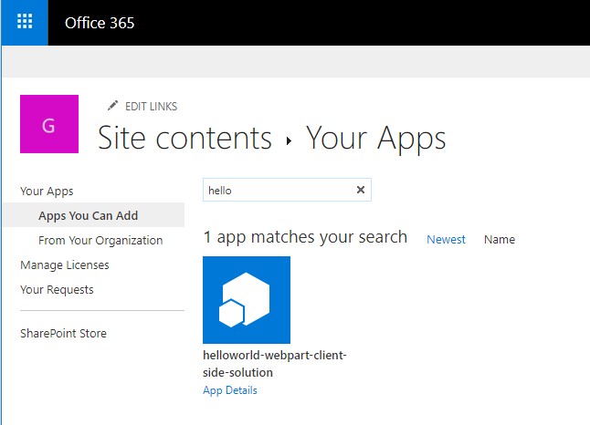
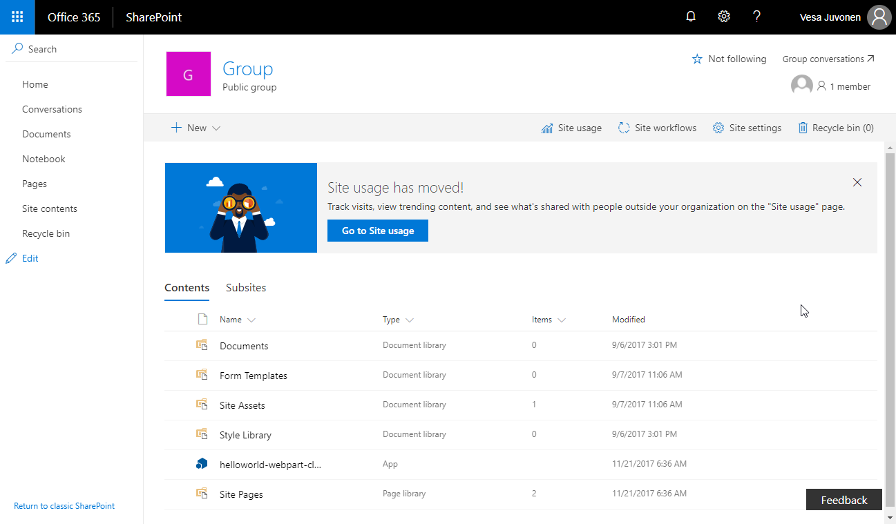
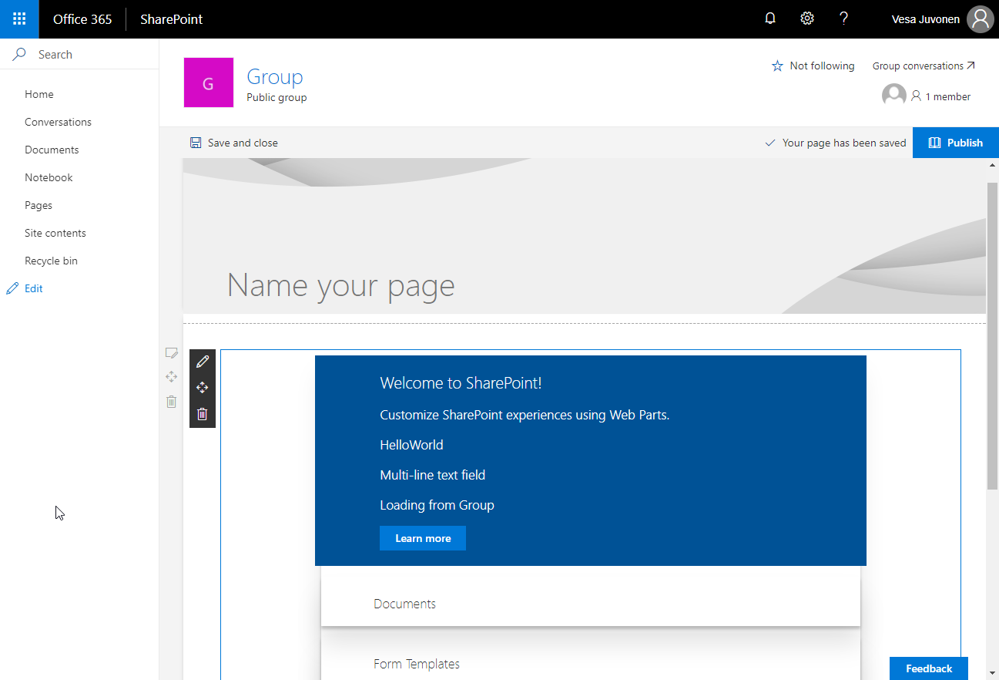
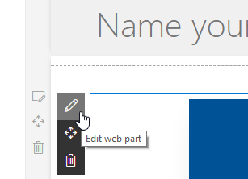

# <a name="deploy-your-client-side-web-part-to-a-sharepoint-page-hello-world-part-3"></a><span data-ttu-id="6e588-102">Bereitstellen des clientseitigen SharePoint-Webparts auf einer SharePoint-Seite („Hello World“ Teil 3)</span><span class="sxs-lookup"><span data-stu-id="6e588-102">Deploy your client-side web part to a SharePoint page (Hello world part 3)</span></span>

<span data-ttu-id="6e588-103">In diesem Artikel erfahren Sie, wie Sie den clientseitigen Webpart in SharePoint bereitstellen und wie es auf einer klassischen serverseitigen SharePoint-Seite ausgeführt wird.</span><span class="sxs-lookup"><span data-stu-id="6e588-103">In this article you will learn how to deploy your client-side web part to SharePoint and see it working on a modern SharePoint server-side page. This article continues with the hello world web part built in the previous article Connect your client-side web part to SharePoint.</span></span> <span data-ttu-id="6e588-104">In diesem Artikel wird weiterhin der „Hello World“-Webpart verwendet, der im vorherigen Artikel [Verbinden des clientseitigen Webparts mit SharePoint](./connect-to-sharepoint.md) erstellt wurde.</span><span class="sxs-lookup"><span data-stu-id="6e588-104">In this article you will learn how to deploy your client-side web part to SharePoint and see it working on a modern SharePoint server-side page. This article continues with the hello world web part built in the previous article [Connect your client-side web part to SharePoint](./connect-to-sharepoint.md).</span></span>

<span data-ttu-id="6e588-105">Achten Sie darauf, dass Sie die Verfahren in den folgenden Artikeln abgeschlossen haben, bevor Sie beginnen:</span><span class="sxs-lookup"><span data-stu-id="6e588-105">Be sure you have completed the procedures in the following articles before you start:</span></span>

* [<span data-ttu-id="6e588-106">Erstellen des ersten clientseitigen SharePoint-Webparts</span><span class="sxs-lookup"><span data-stu-id="6e588-106">Build your first SharePoint client-side web part</span></span>](./build-a-hello-world-web-part.md)
* [<span data-ttu-id="6e588-107">Verbinden des clientseitigen Webparts mit SharePoint</span><span class="sxs-lookup"><span data-stu-id="6e588-107">Connect your client-side web part to SharePoint</span></span>](./connect-to-sharepoint.md)

<span data-ttu-id="6e588-108">Sie können die nachfolgend beschriebene Anleitung auch anhand dieses Videos in unserem [YouTube-Kanal „SharePoint Patterns & Practices“](https://www.youtube.com/watch?v=asmQIfgaKSw&list=PLR9nK3mnD-OXvSWvS2zglCzz4iplhVrKq) nachvollziehen:</span><span class="sxs-lookup"><span data-stu-id="6e588-108">You can also follow these steps by watching the video on the [SharePoint PnP YouTube Channel](https://www.youtube.com/watch?v=asmQIfgaKSw&list=PLR9nK3mnD-OXvSWvS2zglCzz4iplhVrKq).</span></span> 

<a href="https://www.youtube.com/watch?v=asmQIfgaKSw&list=PLR9nK3mnD-OXvSWvS2zglCzz4iplhVrKq">

</a>


## <a name="package-the-helloworld-web-part"></a><span data-ttu-id="6e588-109">Packen des HelloWorld-Webparts</span><span class="sxs-lookup"><span data-stu-id="6e588-109">Package the HelloWorld web part</span></span>

<span data-ttu-id="6e588-110">Wechseln Sie im Konsolenfenster zum Webpart-Projektverzeichnis, das in [Erstellen des ersten clientseitigen SharePoint-Webparts](./build-a-hello-world-web-part.md) erstellt wurde.</span><span class="sxs-lookup"><span data-stu-id="6e588-110">In the console window, go to the web part project directory created in [Build your first SharePoint client-side web part](./build-a-hello-world-web-part.md).</span></span>

```
cd helloworld-webpart
```

<span data-ttu-id="6e588-111">Wenn `gulp serve` noch ausgeführt wird, halten Sie es durch Auswahl von `Ctrl+C` an.</span><span class="sxs-lookup"><span data-stu-id="6e588-111">If `gulp serve` is still running, stop it from running by choosing `Ctrl+C`</span></span>

<span data-ttu-id="6e588-p102">Im Gegensatz zur Workbench müssen Sie für die Verwendung von clientseitigen Webparts auf modernen serverseitigen SharePoint-Seiten den Webpart mit SharePoint bereitstellen und registrieren. Zuerst müssen Sie den Webpart packen.</span><span class="sxs-lookup"><span data-stu-id="6e588-p102">Unlike in the workbench, in order to use client-side web parts on modern SharePoint server-side pages, you need to deploy and register the web part with SharePoint. First you need to package the web part.</span></span>

<span data-ttu-id="6e588-114">Öffnen Sie das **HelloWorldWebPart**-Webpart-Projekt in Visual Studio Code oder in Ihrer bevorzugten IDE.</span><span class="sxs-lookup"><span data-stu-id="6e588-114">Open the **HelloWorldWebPart** web part project in Visual Studio Code, or your preferred IDE.</span></span>

<span data-ttu-id="6e588-115">Öffnen Sie **package-solution.json** im Ordner **config**.</span><span class="sxs-lookup"><span data-stu-id="6e588-115">Open **package-solution.json** from the **config** folder.</span></span>

<span data-ttu-id="6e588-116">Die Datei **package-solution.json** definiert die Paketmetadaten, wie im folgenden Code dargestellt:</span><span class="sxs-lookup"><span data-stu-id="6e588-116">The **package-solution.json** file defines the package metadata as shown in the following code:</span></span>

```json
{
  "$schema": "https://dev.office.com/json-schemas/spfx-build/package-solution.schema.json",
  "solution": {
    "name": "helloworld-webpart-client-side-solution",
    "id": "4432f33b-5845-4ca0-827e-a8ae68c7b945",
    "version": "1.0.0.0"
  },
  "paths": {
    "zippedPackage": "solution/helloworld-webpart.sppkg"
  }
}

```

<span data-ttu-id="6e588-117">Geben Sie im Konsolenfenster den folgenden Befehl ein, um Ihre clientseitige Lösung zu packen, die das Webpart enthält:</span><span class="sxs-lookup"><span data-stu-id="6e588-117">In the console window, enter the following command to package your client-side solution that contains the web part:</span></span>

```
gulp package-solution
```

<span data-ttu-id="6e588-118">Der Befehl erstellt das Paket im `sharepoint/solution`-Ordner:</span><span class="sxs-lookup"><span data-stu-id="6e588-118">The command will create the package in the `sharepoint/solution` folder:</span></span>

```
helloworld-webpart.sppkg
```

### <a name="package-contents"></a><span data-ttu-id="6e588-119">Paketinhalt</span><span class="sxs-lookup"><span data-stu-id="6e588-119">Package contents</span></span>

<span data-ttu-id="6e588-p103">Das Paket verwendet SharePoint Feature zum Packen des Webparts. Standardmäßig erstellt der Gulp-Vorgang Folgendes:</span><span class="sxs-lookup"><span data-stu-id="6e588-p103">The package uses SharePoint Feature to package your web part. By default, the gulp task creates the following:</span></span>

* <span data-ttu-id="6e588-122">Ein Feature für das Webpart.</span><span class="sxs-lookup"><span data-stu-id="6e588-122">A feature for your web part.</span></span>

<span data-ttu-id="6e588-123">Sie können die unformatierten Paketinhalte im Ordner **sharepoint/debug** anzeigen.</span><span class="sxs-lookup"><span data-stu-id="6e588-123">You can view the raw package contents in the **sharepoint/debug** folder.</span></span> 

<span data-ttu-id="6e588-124">Die Inhalte werden dann in eine **.sppkg**-Datei gepackt.</span><span class="sxs-lookup"><span data-stu-id="6e588-124">The contents are then packaged into an **.sppkg** file.</span></span> <span data-ttu-id="6e588-125">Das Paketformat ähnelt einem SharePoint-Add-Ins-Paket und verwendet Microsoft Open Packaging Conventions, um Ihre Lösung zu packen.</span><span class="sxs-lookup"><span data-stu-id="6e588-125">The contents are then packaged into an .sppkg file. The package format is very similar to a SharePoint add-ins package and uses Microsoft Open Packaging Conventions to package your solution.</span></span> 

<span data-ttu-id="6e588-p105">Die JavaScript-Dateien, CSS und andere Elemente werden nicht gepackt, und Sie müssen sie an einem externen Speicherort, z. B. ein CDN, bereitstellen. Um das Webpart während der Entwicklung zu testen, können Sie alle Elemente von Ihrem lokalen Computer laden.</span><span class="sxs-lookup"><span data-stu-id="6e588-p105">The JavaScript files, CSS and other assets are not packaged and you will have to deploy them to an external location such as a CDN. In order to test the web part during development, you can load all the assets from your local computer.</span></span> 

## <a name="deploy-the-helloworld-package-to-app-catalog"></a><span data-ttu-id="6e588-128">Bereitstellen der HelloWorld-Pakets im App-Katalog</span><span class="sxs-lookup"><span data-stu-id="6e588-128">Deploy the HelloWorld package to app catalog</span></span>

<span data-ttu-id="6e588-129">Als Nächstes müssen Sie das Paket, das generiert wurde, im App-Katalog bereitstellen.</span><span class="sxs-lookup"><span data-stu-id="6e588-129">Next you need to deploy the package that was generated to the App Catalog.</span></span>

<span data-ttu-id="6e588-130">Wechseln Sie zum App-Katalog der Website.</span><span class="sxs-lookup"><span data-stu-id="6e588-130">Go to your site's App Catalog.</span></span>

<span data-ttu-id="6e588-131">Laden Sie **helloworld-webpart.sppkg** in den App-Katalog hoch oder legen Sie es durch Drag & Drop dort ab.</span><span class="sxs-lookup"><span data-stu-id="6e588-131">Upload or drag and drop the **helloworld-webpart.sppkg** to the App Catalog.</span></span>

 

<span data-ttu-id="6e588-p106">Dadurch wird das clientseitige Lösungspaket bereitgestellt. Da es sich um eine vollständig vertrauenswürdige clientseitige Lösung handelt, zeigt SharePoint ein Dialogfeld an und fordert Sie auf, der bereitzustellenden clientseitigen Lösung zu vertrauen.</span><span class="sxs-lookup"><span data-stu-id="6e588-p106">This will deploy the client-side solution package. Since this is a full trust client-side solution, SharePoint will display a dialog and ask you to trust the client-side solution to deploy.</span></span>

 
    
<span data-ttu-id="6e588-136">Wählen Sie **Bereitstellen** aus.</span><span class="sxs-lookup"><span data-stu-id="6e588-136">Choose **Deploy**</span></span>

## <a name="install-the-client-side-solution-on-your-site"></a><span data-ttu-id="6e588-137">Installieren der clientseitigen Lösung auf Ihrer Website</span><span class="sxs-lookup"><span data-stu-id="6e588-137">Install the client-side solution on your site</span></span>

<span data-ttu-id="6e588-138">Wechseln Sie zu Ihrer Entwicklerwebsitesammlung.</span><span class="sxs-lookup"><span data-stu-id="6e588-138">Go to your developer site collection.</span></span>

<span data-ttu-id="6e588-139">Wählen Sie das Zahnräder-Symbol in der oberen Navigationsleiste auf der rechten Seite und dann **Eine App hinzufügen** aus, um zu Ihrer Apps-Seite zu wechseln.</span><span class="sxs-lookup"><span data-stu-id="6e588-139">Choose the gears icon on the top nav bar on the right and choose **Add an app** to go to your Apps page.</span></span>

<span data-ttu-id="6e588-140">Geben Sie in das Feld **Suchen** die Zeichenfolge **helloworld** ein, und drücken Sie die **Eingabetaste**, um Ihre Apps zu filtern.</span><span class="sxs-lookup"><span data-stu-id="6e588-140">In the **Search** box, enter **helloworld** and choose **Enter** to filter your apps.</span></span>
    

    
<span data-ttu-id="6e588-142">Wählen Sie die App **helloworld-webpart-client-side-solution** aus, um die App auf der Website zu installieren.</span><span class="sxs-lookup"><span data-stu-id="6e588-142">Choose the **helloworld-webpart-client-side-solution** app to install the app on the site.</span></span>
    
 

<span data-ttu-id="6e588-144">Die clientseitige Lösung und das Webpart werden Ihrer Entwicklerwebsite installiert.</span><span class="sxs-lookup"><span data-stu-id="6e588-144">The client-side solution and the web part are installed on your developer site.</span></span>

<span data-ttu-id="6e588-145">Auf der Seite **Websiteinhalte** wird der Installationsstatus der clientseitigen Lösung angezeigt.</span><span class="sxs-lookup"><span data-stu-id="6e588-145">The **Site Contents** page will show you the installation status of your client-side solution. Make sure the installation is complete before going to the next step.</span></span> <span data-ttu-id="6e588-146">Stellen Sie sicher, dass die Installation abgeschlossen ist, bevor Sie mit dem nächsten Schritt fortfahren.</span><span class="sxs-lookup"><span data-stu-id="6e588-146">The Site Contents page will show you the installation status of your client-side solution. Make sure the installation is complete before going to the next step.</span></span>

## <a name="preview-the-web-part-in-a-sharepoint-page"></a><span data-ttu-id="6e588-147">Anzeigen einer Vorschau des Webparts auf einer SharePoint-Seite</span><span class="sxs-lookup"><span data-stu-id="6e588-147">Preview the web part in a SharePoint page</span></span>

<span data-ttu-id="6e588-p108">Da Sie die clientseitige Lösung jetzt bereitgestellt und installiert haben, fügen Sie den Webpart zu einer SharePoint-Seite hinzu. Denken Sie daran, dass Ressourcen wie JavaScript und CSS auf dem lokalen Computer zur Verfügung stehen.</span><span class="sxs-lookup"><span data-stu-id="6e588-p108">Now that you have deployed and installed the client-side solution, add the web part to a SharePoint page. Remember that resources such as JavaScripts, and CSS, are available from the local computer.</span></span>

<span data-ttu-id="6e588-150">Öffnen Sie **<your-webpart-guid>.manifest.json** im Ordner **\dist**.</span><span class="sxs-lookup"><span data-stu-id="6e588-150">Open the **<your-webpart-guid>.manifest.json** from the **\dist** folder.</span></span>
    
<span data-ttu-id="6e588-151">Beachten Sie, dass die **internalModuleBaseUrls**-Eigenschaft im **loaderConfig**-Eintrag immer noch auf Ihren lokalen Computer verweist:</span><span class="sxs-lookup"><span data-stu-id="6e588-151">Notice that the **internalModuleBaseUrls** property in the **loaderConfig** entry still refers to your local computer:</span></span>

```json
"internalModuleBaseUrls": [
    "https://`your-local-machine-name`:4321/"
]
```

<span data-ttu-id="6e588-152">Führen Sie vor dem Hinzufügen des Webparts zu einer serverseitigen SharePoint-Seite den lokalen Server aus.</span><span class="sxs-lookup"><span data-stu-id="6e588-152">Before adding the web part to a SharePoint server-side page, run the local server.</span></span>
    
<span data-ttu-id="6e588-153">Führen Sie im Konsolenfenster mit dem Projektverzeichnis **helloworld-webpart** den Gulp-Vorgang aus, um den Serverbetrieb von Localhost zu starten:</span><span class="sxs-lookup"><span data-stu-id="6e588-153">In the console window that has the **helloworld-webpart** project directory, run the gulp task to start serving from localhost:</span></span>
    
```
gulp serve --nobrowser
```

> [!NOTE]
> <span data-ttu-id="6e588-154">`--nobrowser` startet die SharePoint Workbench nicht automatisch.</span><span class="sxs-lookup"><span data-stu-id="6e588-154">Note:`--nobrowser` will not automatically launch the SharePoint Workbench.</span></span>

## <a name="add-the-helloworld-web-part-to-modern-page"></a><span data-ttu-id="6e588-155">Hinzufügen des HelloWorld-Webparts zur modernen Seite</span><span class="sxs-lookup"><span data-stu-id="6e588-155">Add the HelloWorld web part to modern page</span></span>

<span data-ttu-id="6e588-156">Wechseln Sie im Browser zu Ihrer Websitesammlung.</span><span class="sxs-lookup"><span data-stu-id="6e588-156">In your browser go to your site collection.</span></span>
    
<span data-ttu-id="6e588-157">Wählen Sie das Zahnräder-Symbol in der oberen Navigationsleiste auf der rechten Seite und dann **Seite hinzufügen** aus.</span><span class="sxs-lookup"><span data-stu-id="6e588-157">Choose the gears icon in the top nav bar on the right and choose **Add a page**.</span></span>
    
<span data-ttu-id="6e588-158">Öffnen Sie die Webpart-Auswahl, und wählen Sie Ihren **HelloWorld**-Webpart.</span><span class="sxs-lookup"><span data-stu-id="6e588-158">Open web part picker and chose your **HelloWorld** web part.</span></span>
        
<span data-ttu-id="6e588-p109">Die Webpart-Objekte werden aus der lokalen Umgebung geladen. Um die Skripts zu laden, die auf Ihrem lokalen Computer gehostet werden, müssen Sie es dem Browser ermöglichen, unsichere Skripts zu laden. Stellen Sie je nach verwendetem Browser sicher, dass Sie das Laden unsicherer Skripts für diese Sitzung aktivieren.</span><span class="sxs-lookup"><span data-stu-id="6e588-p109">The web part assets will be loaded from the local environment. In order to load the scripts hosted on your local computer, you need to enable the browser to load unsafe scripts. Depending on the browser you are using, make sure you enable loading unsafe scripts for this session.</span></span>
    
<span data-ttu-id="6e588-162">Sie sollten den **HelloWorld**-Webpart sehen, den Sie im vorherigen Artikel erstellt haben und der Listen von der aktuellen Website abruft.</span><span class="sxs-lookup"><span data-stu-id="6e588-162">You should see the **HelloWorld** web part you built in the previous article that retrieves lists from the current site.</span></span> 



## <a name="edit-web-part-properties"></a><span data-ttu-id="6e588-164">Bearbeiten von Webparteigenschaften</span><span class="sxs-lookup"><span data-stu-id="6e588-164">Edit web part properties</span></span>

<span data-ttu-id="6e588-165">Klicken Sie auf das Symbol **Element konfigurieren** (Stift) im Webpart, um den Eigenschaftenbereich für den Webpart zu öffnen.</span><span class="sxs-lookup"><span data-stu-id="6e588-165">Click the **Configure element** icon (pen) in the web part to open the property pane for the web part.</span></span>



<span data-ttu-id="6e588-167">Dies ist derselbe Eigenschaftenbereich, den Sie in der Workbench erstellt und als Vorschau angezeigt haben.</span><span class="sxs-lookup"><span data-stu-id="6e588-167">This is the same property pane you built and previewed in the workbench.</span></span>
    
<span data-ttu-id="6e588-168">Bearbeiten Sie die **Description**-Eigenschaft, und geben Sie **Clientseitige Webparts sind großartig!** ein.</span><span class="sxs-lookup"><span data-stu-id="6e588-168">Edit the **Description** property and enter **Client-side web parts are awesome!**</span></span>
    


<span data-ttu-id="6e588-170">Beachten Sie, dass immer noch die gleichen Verhalten vorhanden sind, wie z. B. ein reaktiver Bereich, in dem der Webpart während der Eingabe aktualisiert wird.</span><span class="sxs-lookup"><span data-stu-id="6e588-170">Notice that you still have the same behaviors such as a reactive pane where the web part is updated as you type.</span></span>
    
<span data-ttu-id="6e588-171">Wählen Sie das **x**-Symbol aus, um den clientseitigen Eigenschaftenbereich zu schließen.</span><span class="sxs-lookup"><span data-stu-id="6e588-171">Choose the **x** icon to close the client-side property pane.</span></span>
        
<span data-ttu-id="6e588-172">Wählen Sie in der Symbolleiste **peichern und schließen**, um die Seite zu speichern.</span><span class="sxs-lookup"><span data-stu-id="6e588-172">In the toolbar, choose **Save and close** to save the page.</span></span>

## <a name="next-steps"></a><span data-ttu-id="6e588-173">Nächste Schritte</span><span class="sxs-lookup"><span data-stu-id="6e588-173">Next steps</span></span>

<span data-ttu-id="6e588-174">Ausgezeichnet.</span><span class="sxs-lookup"><span data-stu-id="6e588-174">Congratulations</span></span> <span data-ttu-id="6e588-175">Sie haben einen clientseitigen Webpart auf einer modernen SharePoint-Seite bereitgestellt.</span><span class="sxs-lookup"><span data-stu-id="6e588-175">You have deployed a client-side web part to a modern SharePoint page.</span></span> <span data-ttu-id="6e588-176">Im nächsten Thema [Bereitstellen Ihrer clientseitigen Webpartquelle für einen CDN](./deploy-web-part-to-cdn.md) können Sie mit der Weiterentwicklung des „Hello World“-Webparts fortfahren. Dort erhalten Sie Informationen zum Bereitstellen und Laden der Webpart-Objekte von einem CDN anstelle von Localhost.</span><span class="sxs-lookup"><span data-stu-id="6e588-176">Congratulations! You have deployed a client-side web part to a modern SharePoint page. You can continue building out your Hello World web part in the next topic, [Deploy your client-side web part source to a CDN](./deploy-web-part-to-cdn.md), where you will learn how to deploy and load the web part assets from a CDN instead of localhost.</span></span>
