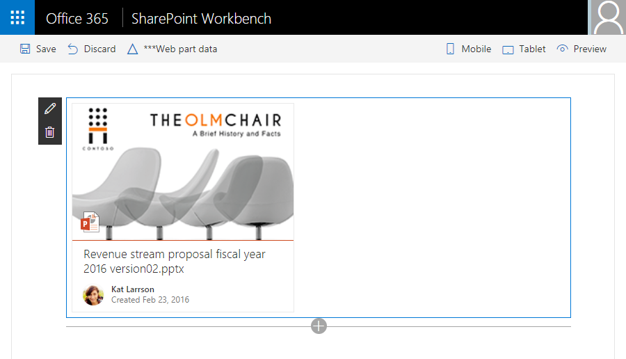

# <a name="use-office-ui-fabric-react-components-in-your-sharepoint-client-side-web-part"></a><span data-ttu-id="c11f0-102">Verwenden von Office UI Fabric React-Komponenten in clientseitigen SharePoint-Webparts</span><span class="sxs-lookup"><span data-stu-id="c11f0-102">Use Office UI Fabric React components in your SharePoint client-side web part</span></span>

<span data-ttu-id="c11f0-p101">In diesem Artikel wird die Erstellung eines einfachen Webparts beschrieben, das die DocumentCard-Komponente von [Office UI Fabric React](https://github.com/OfficeDev/office-ui-fabric-react) verwendet. Office UI Fabric React ist das Front-End-Framework zur Erstellung von Oberflächen für Office und Office 365. Fabric React umfasst eine Sammlung stabiler, dynamischer und für die Darstellung auf Mobilgeräten optimierter Komponenten zur unkomplizierten Erstellung von Weboberflächen mithilfe der Office-Entwurfssprache.</span><span class="sxs-lookup"><span data-stu-id="c11f0-p101">This article describes how to build a simple web part that uses the DocumentCard component of [Office UI Fabric React](https://github.com/OfficeDev/office-ui-fabric-react). Office UI Fabric React is the front-end framework for building experiences for Office and Office 365. Fabric React includes a robust collection of responsive, mobile-first components that make it easy for you to create web experiences using the Office Design Language.</span></span>

<span data-ttu-id="c11f0-106">Die folgende Abbildung zeigt eine DocumentCard-Komponente, die mit Office UI Fabric React erstellt wurde:</span><span class="sxs-lookup"><span data-stu-id="c11f0-106">The following image shows a DocumentCard component created with Office UI Fabric React.</span></span>



<span data-ttu-id="c11f0-108">Sie können die nachfolgend beschriebene Anleitung auch anhand dieses Videos in unserem [YouTube-Kanal „SharePoint Patterns & Practices“](https://www.youtube.com/watch?v=1N6kNvLxyg4&list=PLR9nK3mnD-OXvSWvS2zglCzz4iplhVrKq) nachvollziehen:</span><span class="sxs-lookup"><span data-stu-id="c11f0-108">You can also follow these steps by watching the video on the [SharePoint PnP YouTube Channel](https://www.youtube.com/watch?v=1N6kNvLxyg4&list=PLR9nK3mnD-OXvSWvS2zglCzz4iplhVrKq).</span></span> 

<a href="https://www.youtube.com/watch?v=1N6kNvLxyg4&list=PLR9nK3mnD-OXvSWvS2zglCzz4iplhVrKq">

</a>


## <a name="creating-a-new-web-part-project"></a><span data-ttu-id="c11f0-109">Erstellen eines neuen Webpartprojekts</span><span class="sxs-lookup"><span data-stu-id="c11f0-109">Creating a new Web Part project</span></span>

<span data-ttu-id="c11f0-p102">Stellen Sie sicher, dass Sie die aktuelle Version von X verwenden. Führen Sie `yo` aus, und befolgen Sie die Anweisungen, um ein Projektgerüst zu erstellen.</span><span class="sxs-lookup"><span data-stu-id="c11f0-p102">Make sure you're using the latest version of . Run `yo` and follow the prompts to create a skeleton project,.</span></span>

<span data-ttu-id="c11f0-112">Erstellen Sie an einem Speicherort Ihrer Wahl ein neues Projektverzeichnis:</span><span class="sxs-lookup"><span data-stu-id="c11f0-112">Create a new project directory in your favorite location:</span></span>

```
md documentcardexample-webpart
```
    
<span data-ttu-id="c11f0-113">Wechseln Sie in das Projektverzeichnis:</span><span class="sxs-lookup"><span data-stu-id="c11f0-113">Go to the project directory:</span></span>

```
cd documentcardexample-webpart
```

<span data-ttu-id="c11f0-114">Stellen Sie sicher, dass die aktuelle Version von `@microsoft/generator-sharepoint` installiert ist, und führen Sie den Yeoman-SharePoint-Generator aus, um ein neues Webpart zu erstellen:</span><span class="sxs-lookup"><span data-stu-id="c11f0-114">Make sure you have the latest version of `@microsoft/generator-sharepoint` installed and create a new web part by running the Yeoman SharePoint generator:</span></span>

```
yo @microsoft/sharepoint
```
    
<span data-ttu-id="c11f0-115">Es werden verschiedene Eingabeaufforderungen angezeigt. Gehen Sie wie folgt vor:</span><span class="sxs-lookup"><span data-stu-id="c11f0-115">When prompted:</span></span>

* <span data-ttu-id="c11f0-116">Übernehmen Sie den Standardnamen **documentcardexample-webpart** als Lösungsnamen, und drücken Sie die **EINGABETASTE**.</span><span class="sxs-lookup"><span data-stu-id="c11f0-116">Accept the default **documentcardexample-webpart** as your solution name and choose **Enter**.</span></span>
* <span data-ttu-id="c11f0-117">Wählen Sie **SharePoint Online only (latest)**, und drücken Sie die **EINGABETASTE**.</span><span class="sxs-lookup"><span data-stu-id="c11f0-117">Choose **SharePoint Online only (latest)**, and press **Enter**.</span></span>
* <span data-ttu-id="c11f0-118">Wählen Sie als Speicherort für die Dateien die Option **Use the current folder** aus.</span><span class="sxs-lookup"><span data-stu-id="c11f0-118">Select **Use the current folder** for where to place the files.</span></span>
* <span data-ttu-id="c11f0-119">Wählen Sie **N**, damit die Erweiterung auf jeder Website explizit installiert werden muss, wenn sie verwendet wird.</span><span class="sxs-lookup"><span data-stu-id="c11f0-119">Choose **N** to require the extension to be installed on each site explicitly when it's being used.</span></span> 
* <span data-ttu-id="c11f0-120">Wählen Sie **Webpart** als den zu erstellenden Typ von clientseitiger Komponente aus.</span><span class="sxs-lookup"><span data-stu-id="c11f0-120">Choose **Webpart** as the client-side component type to be created.</span></span> 

<span data-ttu-id="c11f0-121">Über die nächsten Eingabeaufforderungen werden spezifische Informationen zum Webpart abgefragt:</span><span class="sxs-lookup"><span data-stu-id="c11f0-121">The next set of prompts will ask for specific information about your web part:</span></span>

* <span data-ttu-id="c11f0-122">Verwenden Sie **DocumentCardExample** als Namen des Webparts, und drücken Sie die **EINGABETASTE**.</span><span class="sxs-lookup"><span data-stu-id="c11f0-122">Use **DocumentCardExample** for your web part name and choose **Enter**.</span></span>
* <span data-ttu-id="c11f0-123">Akzeptieren Sie den Standardnamen **DocumentCardExample - Beschreibung**, und drücken Sie die **EINGABETASTE**.</span><span class="sxs-lookup"><span data-stu-id="c11f0-123">Accept the default **DocumentCardExample description** and choose **Enter**.</span></span>
* <span data-ttu-id="c11f0-124">Wählen Sie **React** als Framework aus, und drücken Sie die**EINGABETASTE**.</span><span class="sxs-lookup"><span data-stu-id="c11f0-124">Select **React** as the framework and choose **Enter**.</span></span>

<span data-ttu-id="c11f0-p103">An diesem Punkt installiert Yeoman die erforderlichen Abhängigkeiten und erstellt ein Gerüst für die Lösungsdateien. Das kann einige Minuten dauern. Yeoman erstellt ein Gerüst für das Projekt, um auch das DocumentCardExample-Webpart einzuschließen.</span><span class="sxs-lookup"><span data-stu-id="c11f0-p103">At this point, Yeoman will install the required dependencies and scaffold the solution files. This might take a few minutes. Yeoman will scaffold the project to include your DocumentCardExample web part as well.</span></span>

<span data-ttu-id="c11f0-128">Sobald das Gerüst abgeschlossen ist, sperren Sie die Version der Projektabhängigkeiten, indem Sie den folgenden Befehl ausführen:</span><span class="sxs-lookup"><span data-stu-id="c11f0-128">Once the scaffolding completes, lock down the version of the project dependencies by running the following command:</span></span>

```sh
npm shrinkwrap
```

<span data-ttu-id="c11f0-129">Geben Sie Folgendes ein, um das Webpart-Projekt in Visual Studio Code zu öffnen:</span><span class="sxs-lookup"><span data-stu-id="c11f0-129">In the console, type the following to open the web part project in Visual Studio Code:</span></span>

```
code .
```
    
<span data-ttu-id="c11f0-130">Sie haben nun ein Webpartprojekt mit dem React-Framework erstellt.</span><span class="sxs-lookup"><span data-stu-id="c11f0-130">You now have a web part project with the React framework.</span></span>

<span data-ttu-id="c11f0-131">Öffnen Sie **DocumentCardExampleWebPart.ts** im Ordner **src\webparts\documentCardExample**.</span><span class="sxs-lookup"><span data-stu-id="c11f0-131">Open **DocumentCardExampleWebPart.ts** from the **src\webparts\documentCardExample** folder.</span></span> 

<span data-ttu-id="c11f0-132">Wie Sie sehen können, erstellt die`render`-Methode ein React-Element und rendert es im Webpart-DOM.</span><span class="sxs-lookup"><span data-stu-id="c11f0-132">As you can see, the `render` method creates a react element and renders it in the web part DOM.</span></span>

```ts
  public render(): void {
    const element: React.ReactElement<IDocumentCardExampleProps > = React.createElement(
      DocumentCardExample,
      {
        description: this.properties.description
      }
    );
```
    
<span data-ttu-id="c11f0-133">Öffnen Sie **DocumentCardExample.tsx** im Ordner **src\webparts\documentCardExample\components**.</span><span class="sxs-lookup"><span data-stu-id="c11f0-133">Open **DocumentCardExample.tsx** from the **src\webparts\documentCardExample\components** folder.</span></span> 
    
<span data-ttu-id="c11f0-134">Dies ist die wichtigste React-Komponente, die Yeoman zu Ihrem Projekt hinzugefügt hat, das im Webpart-DOM gerendert wird.</span><span class="sxs-lookup"><span data-stu-id="c11f0-134">This is the main react component that Yeoman added to your project that renders in the web part DOM.</span></span>

```ts
export default class DocumentCardExample extends React.Component<IDocumentCardExampleProps, {}> {
  public render(): React.ReactElement<IDocumentCardExampleProps> {
    return (
      <div className={ styles.documentCardExample }>
        <div className={ styles.container }>
          <div className={ styles.row }>
            <div className={ styles.column }>
              <span className={ styles.title }>Welcome to SharePoint!</span>
              <p className={ styles.subTitle }>Customize SharePoint experiences using Web Parts.</p>
              <p className={ styles.description }>{escape(this.props.description)}</p>
              <a href="https://aka.ms/spfx" className={ styles.button }>
                <span className={ styles.label }>Learn more</span>
              </a>
            </div>
          </div>
        </div>
      </div>
    );
  }
}

```

### <a name="add-an-office-ui-fabric-component"></a><span data-ttu-id="c11f0-135">Hinzufügen einer Office UI Fabric-Komponente</span><span class="sxs-lookup"><span data-stu-id="c11f0-135">Add an Office UI Fabric component</span></span>

<span data-ttu-id="c11f0-p104">Die *neuen modernen Benutzeroberflächen* in SharePoint verwenden die Office UI Fabric sowie Office UI Fabric React als standardmäßiges Front-End-Framework zur Erstellung neuer Benutzeroberflächen. SharePoint Framework enthält daher bei Auslieferung eine Standardversion der Office UI Fabric sowie eine Standardversion von Fabric React, die jeweils der in SharePoint verfügbaren Version entsprechen. Dadurch wird sichergestellt, dass das Webpart, das Sie erstellen, bei der Bereitstellung in SharePoint die richtige Version der Fabric-Formatvorlagen und -Komponenten verwendet.</span><span class="sxs-lookup"><span data-stu-id="c11f0-p104">The *new modern experiences* in SharePoint use Office UI Fabric and Office UI Fabric React as the default front-end framework for building the new experiences. As a result, SharePoint Framework ships with a default version of Office UI Fabric and Fabric React which matches the version available in SharePoint. This ensures the web part you are building uses the right version of the Fabric styles and components when deployed to SharePoint.</span></span> 

<span data-ttu-id="c11f0-p105">Da wir bei der Erstellung der Lösung React als Framework ausgewählt haben, hat der Generator auch die richtige Version von Office UI Fabric React installiert. Sie können die Fabric-Komponenten ohne weiteren Aufwand direkt in Ihre React-Komponenten importieren.</span><span class="sxs-lookup"><span data-stu-id="c11f0-p105">Since we chose React as our framework when creating the solution, the generator installed the right version of Office UI Fabric React as well. You can directly import the Fabric components in your react components without any additional work.</span></span> 

> [!NOTE]
> <span data-ttu-id="c11f0-141">Bei der Erstveröffentlichung von SharePoint-Framework empfehlen wir, jeweils die Office-UI-Fabric- und Fabric React-Version zu verwenden, die mit dem Generator ausgeliefert wird.</span><span class="sxs-lookup"><span data-stu-id="c11f0-141">With the initial release of the SharePoint Framework, it is recommended to use the Office UI Fabric and Fabric React that ships with the generator.</span></span> <span data-ttu-id="c11f0-142">Von einer separaten Aktualisierung der Office-UI-Fabric- und Fabric React-Pakete raten wir ab. Sie könnte zu Konflikten mit der jeweils bereits in SharePoint verfügbaren Version führen. In einem solchen Fall würde Ihr Webpart möglicherweise nicht wie erwartet arbeiten.</span><span class="sxs-lookup"><span data-stu-id="c11f0-142">Note: During the SharePoint Framework preview, it is recommended to use the Office UI Fabric and Fabric React that ships with the generator. It is not recommended to update the Office UI Fabric and Fabric React packages independently as it might conflict with the already available version in SharePoint and as a result your web part may fail to function as expected.</span></span>

<span data-ttu-id="c11f0-143">Öffnen Sie **DocumentCardExample.tsx** im Ordner **src\webparts\documentCardExample\components**.</span><span class="sxs-lookup"><span data-stu-id="c11f0-143">Open **DocumentCardExample.tsx** from the **src\webparts\documentCardExample\components** folder.</span></span> 

<span data-ttu-id="c11f0-144">Fügen Sie die folgende `import`-Anweisung am Anfang der Datei hinzu, um React-Komponenten der Fabric zu importieren, die verwendet werden sollen.</span><span class="sxs-lookup"><span data-stu-id="c11f0-144">Add the following `import` statement to to the top of the file to import fabric react components that we want to use.</span></span>

```ts
import {
    DocumentCard,
    DocumentCardPreview,
    DocumentCardTitle,
    DocumentCardActivity,
    IDocumentCardPreviewProps
} from 'office-ui-fabric-react/lib/DocumentCard';
```

<span data-ttu-id="c11f0-145">Löschen Sie die aktuelle `render`-Methode, und fügen Sie die folgende aktualisierte `render`-Methode hinzu:</span><span class="sxs-lookup"><span data-stu-id="c11f0-145">Delete the current `render` method and add the following updated `render` method:</span></span>

```ts
  public render(): JSX.Element {
    const previewProps: IDocumentCardPreviewProps = {
      previewImages: [
        {
          previewImageSrc: String(require('./document-preview.png')),
          iconSrc: String(require('./icon-ppt.png')),
          width: 318,
          height: 196,
          accentColor: '#ce4b1f'
        }
      ],
    };

    return (
      <DocumentCard onClickHref='http://bing.com'>
        <DocumentCardPreview { ...previewProps } />
        <DocumentCardTitle title='Revenue stream proposal fiscal year 2016 version02.pptx' />
        <DocumentCardActivity
          activity='Created Feb 23, 2016'
          people={
            [
              { name: 'Kat Larrson', profileImageSrc: String(require('./avatar-kat.png')) }
            ]
          }
        />
      </DocumentCard>
    );
  }
```
<span data-ttu-id="c11f0-146">Speichern Sie die Datei.</span><span class="sxs-lookup"><span data-stu-id="c11f0-146">Save the file.</span></span>

<span data-ttu-id="c11f0-147">In diesem Code enthält die DocumentCard-Komponente einige zusätzliche Abschnitte:</span><span class="sxs-lookup"><span data-stu-id="c11f0-147">In this code, the DocumentCard component includes some extra sections:</span></span>

* <span data-ttu-id="c11f0-148">DocumentCardPreview</span><span class="sxs-lookup"><span data-stu-id="c11f0-148">DocumentCardPreview</span></span>
* <span data-ttu-id="c11f0-149">DocumentCardTitle</span><span class="sxs-lookup"><span data-stu-id="c11f0-149">DocumentCardTitle</span></span>
* <span data-ttu-id="c11f0-150">DocumentCardActivity</span><span class="sxs-lookup"><span data-stu-id="c11f0-150">DocumentCardActivity</span></span>

<span data-ttu-id="c11f0-151">Die Eigenschaft `previewProps` enthält einige Eigenschaften von DocumentCardPreview.</span><span class="sxs-lookup"><span data-stu-id="c11f0-151">The `previewProps` property includes some properties of the DocumentCardPreview.</span></span>

<span data-ttu-id="c11f0-p107">Wie Sie sehen, wird hier ein relativer Pfad mit einer Anweisung des Typs `require` verwendet, um Bilder zu laden. Derzeit sind einige kleinere Konfigurationsanpassungen in der Datei „gulpfile.js“ nötig, damit diese Bilder korrekt von webpack verarbeitet werden.</span><span class="sxs-lookup"><span data-stu-id="c11f0-p107">Notice the use of relative path with a `require` statement to load images. Currently, you need to perform small configuration in the gulpfile.js to enable these images to get processed properly by webpack.</span></span>
    
<span data-ttu-id="c11f0-154">Öffnen Sie die Datei **gulpfile.js** im Ordner **root**.</span><span class="sxs-lookup"><span data-stu-id="c11f0-154">Open **gulpfile.js** from the **root** folder.</span></span> 
    
<span data-ttu-id="c11f0-155">Fügen Sie den folgenden Code direkt über der Codezeile `build.initialize(gulp);` ein:</span><span class="sxs-lookup"><span data-stu-id="c11f0-155">Add the following code just above the `build.initialize(gulp);` code line.</span></span>
    
```js
build.configureWebpack.mergeConfig({  
    additionalConfiguration: (generatedConfiguration) => {
        if (build.getConfig().production) {
            var basePath = build.writeManifests.taskConfig.cdnBasePath;
            if (!basePath.endsWith('/')) {
                basePath += '/';
            }
            generatedConfiguration.output.publicPath = basePath;
        }
        else {
            generatedConfiguration.output.publicPath = "/dist/";
        }
        return generatedConfiguration;
    }
});
```
    
<span data-ttu-id="c11f0-156">Speichern Sie die Datei.</span><span class="sxs-lookup"><span data-stu-id="c11f0-156">Save the file.</span></span>

<span data-ttu-id="c11f0-157">Die vollständige Datei **gulpfile.js** sollte wie folgt aussehen:</span><span class="sxs-lookup"><span data-stu-id="c11f0-157">Your full **gulpfile.js** file should look as follows.</span></span>

```js
'use strict';

const gulp = require('gulp');
const build = require('@microsoft/sp-build-web');

build.configureWebpack.mergeConfig({  
    additionalConfiguration: (generatedConfiguration) => {
        if (build.getConfig().production) {
            var basePath = build.writeManifests.taskConfig.cdnBasePath;
            if (!basePath.endsWith('/')) {
                basePath += '/';
            }
            generatedConfiguration.output.publicPath = basePath;
        }
        else {
            generatedConfiguration.output.publicPath = "/dist/";
        }
        return generatedConfiguration;
    }
});

build.initialize(gulp);

```

### <a name="copy-the-image-assets"></a><span data-ttu-id="c11f0-158">Kopieren der Bildobjekte</span><span class="sxs-lookup"><span data-stu-id="c11f0-158">Copy the image assets</span></span>

<span data-ttu-id="c11f0-159">Kopieren Sie die folgenden Bilder in den Ordner **src\webparts\documentCardExample\components**:</span><span class="sxs-lookup"><span data-stu-id="c11f0-159">Copy the following images to your **src\webparts\documentCardExample\components** folder:</span></span>

* [<span data-ttu-id="c11f0-160">avatar-kat.png</span><span class="sxs-lookup"><span data-stu-id="c11f0-160">avatar-kat.png</span></span>](https://github.com/SharePoint/sp-dev-docs/blob/master/assets/avatar-kat.png)
* [<span data-ttu-id="c11f0-161">icon-ppt.png</span><span class="sxs-lookup"><span data-stu-id="c11f0-161">icon-ppt.png</span></span>](https://github.com/SharePoint/sp-dev-docs/tree/master/assets/icon-ppt.png)
* [<span data-ttu-id="c11f0-162">document-preview.png</span><span class="sxs-lookup"><span data-stu-id="c11f0-162">document-preview.png</span></span>](https://github.com/SharePoint/sp-dev-docs/tree/master/assets/document-preview.png)

### <a name="preview-the-web-part-in-workbench"></a><span data-ttu-id="c11f0-163">Anzeigen der Webpart-Vorschau in der Workbench</span><span class="sxs-lookup"><span data-stu-id="c11f0-163">Preview the web part in workbench</span></span>

<span data-ttu-id="c11f0-164">Geben Sie in der Konsole Folgendes ein, um das Webpart in der Workbench der Vorschau anzuzeigen:</span><span class="sxs-lookup"><span data-stu-id="c11f0-164">In the console, type the following to preview your web part in workbench:</span></span>
    
```
gulp serve
```
    
<span data-ttu-id="c11f0-165">Wählen Sie in der Toolbox Ihr `DocumentCardExample`-Webpart aus, das hinzugefügt werden soll:</span><span class="sxs-lookup"><span data-stu-id="c11f0-165">In the toolbox, select your `DocumentCardExample` web part to add:</span></span>
    

