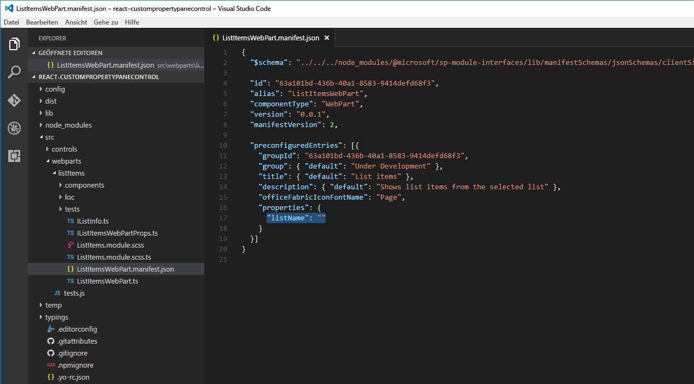
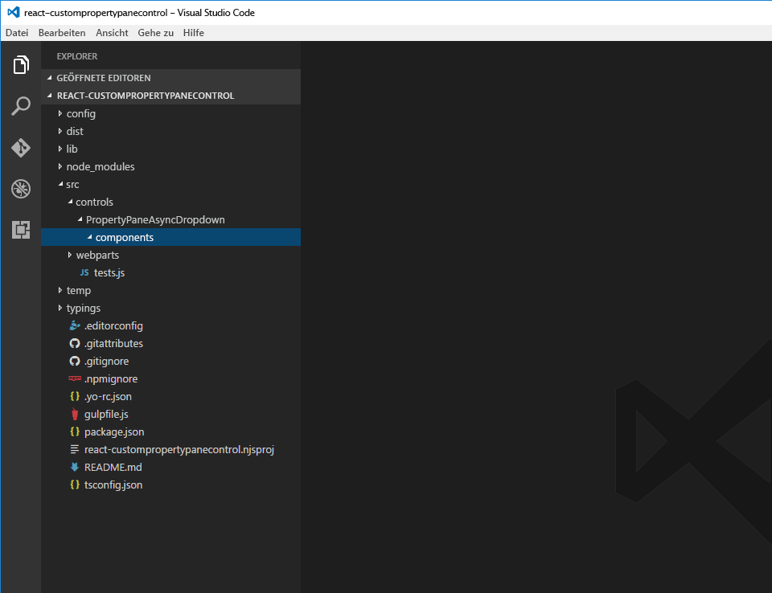

# <a name="build-custom-controls-for-the-property-pane"></a><span data-ttu-id="ca83a-102">Erstellen benutzerdefinierter Steuerelemente für den Eigenschaftenbereich</span><span class="sxs-lookup"><span data-stu-id="ca83a-102">Build custom controls for the property pane</span></span>

<span data-ttu-id="ca83a-p101">Das SharePoint Framework enthält eine Reihe von Standardsteuerelementen für den Eigenschaftenbereich. Doch manchmal benötigen Sie zusätzliche Funktionen, die über die grundlegenden Steuerelemente hinausgehen. Möglicherweise benötigen Sie asynchrone Updates für die Daten in einem Steuerelement oder eine bestimmte Benutzeroberfläche. Erstellen Sie ein benutzerdefiniertes Steuerelement für den Eigenschaftenbereich, um die benötigten Funktionen zu erhalten.</span><span class="sxs-lookup"><span data-stu-id="ca83a-p101">The SharePoint Framework contains a set of standard controls for the property pane. But sometimes you need additional functionality beyond the basic controls. You might need asynchronous updates to the data on a control, or a specific user interface. Build a custom control for the property pane to get the functionality you need.</span></span>

<span data-ttu-id="ca83a-p102">In diesem Artikel erfahren Sie, wie Sie ein benutzerdefiniertes Steuerelement für den Eigenschaftenbereich erstellen. Sie erstellen ein benutzerdefiniertes Dropdown-Steuerelement, das seine Daten asynchron aus einem externen Dienst lädt, ohne die Benutzeroberfläche des Webparts zu blockieren.</span><span class="sxs-lookup"><span data-stu-id="ca83a-p102">In this article you will learn how to build a custom control for the property pane. You will build a custom dropdown control that loads its data asynchronously from an external service without blocking the user interface of the web part.</span></span>


<span data-ttu-id="ca83a-110">Der Quellcode des Webparts, mit dem wir arbeiten, steht auf GitHub zur Verfügung, unter [https://github.com/SharePoint/sp-dev-fx-webparts/tree/master/samples/react-custompropertypanecontrols](https://github.com/SharePoint/sp-dev-fx-webparts/tree/master/samples/react-custompropertypanecontrols).</span><span class="sxs-lookup"><span data-stu-id="ca83a-110">The source of the working web part is available on GitHub at [https://github.com/SharePoint/sp-dev-fx-webparts/tree/master/samples/react-custompropertypanecontrols](https://github.com/SharePoint/sp-dev-fx-webparts/tree/master/samples/react-custompropertypanecontrols).</span></span>

> <span data-ttu-id="ca83a-111">**Hinweis:** Bevor Sie die Schritte in diesem Artikel durchführen, müssen Sie [eine Entwicklungsumgebung einrichten](../../set-up-your-development-environment.md), in der Sie SharePoint Framework-Lösungen erstellen können.</span><span class="sxs-lookup"><span data-stu-id="ca83a-111">**Note:** Before following the steps in this article, be sure to [set up your development environment](../../set-up-your-development-environment.md) for building SharePoint Framework solutions.</span></span>

## <a name="create-new-project"></a><span data-ttu-id="ca83a-112">Erstellen eines neuen Projekts</span><span class="sxs-lookup"><span data-stu-id="ca83a-112">Create new project</span></span>

<span data-ttu-id="ca83a-113">Erstellen Sie zunächst einen neuen Ordner für Ihr Projekt.</span><span class="sxs-lookup"><span data-stu-id="ca83a-113">Start by creating a new folder for your project.</span></span>

```sh
md react-custompropertypanecontrol
```

<span data-ttu-id="ca83a-114">Wechseln Sie zum Projektordner.</span><span class="sxs-lookup"><span data-stu-id="ca83a-114">Go to the project folder.</span></span>

```sh
cd react-custompropertypanecontrol
```

<span data-ttu-id="ca83a-115">Führen Sie im Projektordner den SharePoint Framework-Yeoman-Generator aus, um ein Gerüst für ein neues SharePoint Framework-Projekt zu erstellen.</span><span class="sxs-lookup"><span data-stu-id="ca83a-115">In the project folder run the SharePoint Framework Yeoman generator to scaffold a new SharePoint Framework project.</span></span>

```sh
yo @microsoft/sharepoint
```

<span data-ttu-id="ca83a-116">Geben Sie die folgenden Werte ein, wenn Sie dazu aufgefordert werden:</span><span class="sxs-lookup"><span data-stu-id="ca83a-116">When prompted, enter the following values:</span></span>

- <span data-ttu-id="ca83a-117">**react-custompropertypanecontrol** als Lösungsname</span><span class="sxs-lookup"><span data-stu-id="ca83a-117">**react-custompropertypanecontrol** as your solution name</span></span>
- <span data-ttu-id="ca83a-118">**Aktuellen Ordner verwenden** als Speicherort für die Dateien</span><span class="sxs-lookup"><span data-stu-id="ca83a-118">**Use the current folder** for the location to place the files</span></span>
- <span data-ttu-id="ca83a-119">**Listenelemente** als Namen des Webparts</span><span class="sxs-lookup"><span data-stu-id="ca83a-119">**List items** as your web part name</span></span>
- <span data-ttu-id="ca83a-120">**Zeigt Listenelemente aus der ausgewählten Liste an** als Beschreibung Ihres Webparts</span><span class="sxs-lookup"><span data-stu-id="ca83a-120">**Shows list items from the selected list** as your web part description</span></span>
- <span data-ttu-id="ca83a-121">**React** als Eintrittspunkt für die Webpart-Erstellung</span><span class="sxs-lookup"><span data-stu-id="ca83a-121">**React** as the starting point to build the web part</span></span>


<span data-ttu-id="ca83a-123">Sobald das Gerüst abgeschlossen ist, sperren Sie die Version der Projektabhängigkeiten, indem Sie den folgenden Befehl ausführen:</span><span class="sxs-lookup"><span data-stu-id="ca83a-123">Once the scaffolding completes, lock down the version of the project dependencies by running the following command:</span></span>

```sh
npm shrinkwrap
```

<span data-ttu-id="ca83a-124">Öffnen Sie dann den Projektordner im Code-Editor.</span><span class="sxs-lookup"><span data-stu-id="ca83a-124">Next, open your project folder in your code editor.</span></span> <span data-ttu-id="ca83a-125">In diesem Artikel wird Visual Studio Code in den Schritten und Screenshots verwendet, Sie können jedoch einen beliebigen Editor verwenden.</span><span class="sxs-lookup"><span data-stu-id="ca83a-125">Once the scaffolding completes, open your project folder in your code editor. This article uses Visual Studio Code in the steps and screenshots but you can use any editor you prefer.</span></span>


## <a name="define-web-part-property-for-storing-the-selected-list"></a><span data-ttu-id="ca83a-127">Definieren der Webparteigenschaft zum Speichern der ausgewählten Liste</span><span class="sxs-lookup"><span data-stu-id="ca83a-127">Define web part property for storing the selected list</span></span>

<span data-ttu-id="ca83a-p104">In dem Webpart, das Sie erstellen, werden Listenelemente aus der ausgewählten SharePoint-Liste erstellt. Benutzer können eine Liste in den Webparteigenschaften auswählen. Erstellen Sie zum Speichern der ausgewählten Liste eine neue Webparteigenschaft namens **listName**.</span><span class="sxs-lookup"><span data-stu-id="ca83a-p104">The Web part you are building will show list items from the selected SharePoint list. Users will be able to select a list in the web part properties. To store the selected list create a new web part property named **listName**.</span></span>

<span data-ttu-id="ca83a-p105">Öffnen Sie im Code-Editor die Datei **src/webparts/listItems/ListItemsWebPartManifest.json** Ersetzen Sie die standardmäßige **description**-Eigenschaft durch eine neue Eigenschaft mit dem Namen `listName`.</span><span class="sxs-lookup"><span data-stu-id="ca83a-p105">In the code editor open the **src/webparts/listItems/ListItemsWebPartManifest.json** file. Replace the default **description** property with a new property named `listName`.</span></span>



<span data-ttu-id="ca83a-134">Öffnen Sie als Nächstes die Datei **src/webparts/listItems/IListItemsWebPartProps.ts**, und ersetzen Sie ihren Inhalt durch Folgendes:</span><span class="sxs-lookup"><span data-stu-id="ca83a-134">Next, open the **src/webparts/listItems/IListItemsWebPartProps.ts** file and replace its contents with:</span></span>

```ts
export interface IListItemsWebPartProps {
  listName: string;
}
```

<span data-ttu-id="ca83a-135">Ändern Sie in der Datei **src/webparts/listItems/ListItemsWebPart.ts** die **render**-Methode in:</span><span class="sxs-lookup"><span data-stu-id="ca83a-135">In the **src/webparts/listItems/ListItemsWebPart.ts** file, change the **render** method to:</span></span>

```ts
export default class ListItemsWebPart extends BaseClientSideWebPart<IListItemsWebPartProps> {
  // ...
  public render(): void {
    const element: React.ReactElement<IListItemsProps> = React.createElement(ListItems, {
      listName: this.properties.listName
    });

    ReactDom.render(element, this.domElement);
  }
  // ...
}
```

<span data-ttu-id="ca83a-136">Aktualisieren Sie die **getPropertyPaneConfiguration**-Methode in:</span><span class="sxs-lookup"><span data-stu-id="ca83a-136">Update the **getPropertyPaneConfiguration** method to:</span></span>

```ts
export default class ListItemsWebPart extends BaseClientSideWebPart<IListItemsWebPartProps> {
  // ...
  protected getPropertyPaneConfiguration(): IPropertyPaneConfiguration {
    return {
      pages: [
        {
          header: {
            description: strings.PropertyPaneDescription
          },
          groups: [
            {
              groupName: strings.BasicGroupName,
              groupFields: [
                PropertyPaneTextField('listName', {
                  label: strings.ListFieldLabel
                })
              ]
            }
          ]
        }
      ]
    };
  }
  // ...
}
```

<span data-ttu-id="ca83a-137">Ändern Sie in der Datei **src/webparts/listItems/loc/mystrings.d.ts** die **IListItemsWebPartStrings**-Schnittstelle in Folgendes:</span><span class="sxs-lookup"><span data-stu-id="ca83a-137">In the **src/webparts/listItems/loc/mystrings.d.ts** file change the **IListItemsWebPartStrings** interface to:</span></span>

```ts
declare interface IListItemsWebPartStrings {
  PropertyPaneDescription: string;
  BasicGroupName: string;
  ListFieldLabel: string;
}
```

<span data-ttu-id="ca83a-138">Fügen Sie in der Datei **src/webparts/listItems/loc/en-us.js** die fehlende Definition für die Zeichenfolge **ListFieldLabel** hinzu.</span><span class="sxs-lookup"><span data-stu-id="ca83a-138">In the **src/webparts/listItems/loc/en-us.js** file add the missing definition for the **ListFieldLabel** string.</span></span>

```js
define([], function() {
  return {
    "PropertyPaneDescription": "Description",
    "BasicGroupName": "Group Name",
    "ListFieldLabel": "List"
  }
});
```

<span data-ttu-id="ca83a-139">Ändern Sie in der Datei **src/webparts/listItems/ListItemsWebPart.ts** den Inhalt der **render**-Methode in:</span><span class="sxs-lookup"><span data-stu-id="ca83a-139">In the **src/webparts/listItems/components/ListItems.tsx** file change the contents of the **render** method to:</span></span>

```tsx
export default class ListItems extends React.Component<IListItemsProps, {}> {
  public render(): React.ReactElement<IListItemsProps> {
    return (
      <div className={styles.listItems}>
        <div className={styles.container}>
          <div className={`ms-Grid-row ms-bgColor-themeDark ms-fontColor-white ${styles.row}`}>
            <div className="ms-Grid-col ms-lg10 ms-xl8 ms-xlPush2 ms-lgPush1">
              <span className="ms-font-xl ms-fontColor-white">Welcome to SharePoint!</span>
              <p className="ms-font-l ms-fontColor-white">Customize SharePoint experiences using Web Parts.</p>
              <p className="ms-font-l ms-fontColor-white">{escape(this.props.listName)}</p>
              <a href="https://aka.ms/spfx" className={styles.button}>
                <span className={styles.label}>Learn more</span>
              </a>
            </div>
          </div>
        </div>
      </div>
    );
  }
}
```

<span data-ttu-id="ca83a-140">Öffnen Sie als Nächstes die Datei  **src/webparts/listItems/components/IListItemsProps.ts**, und ersetzen Sie ihren Inhalt durch Folgendes:</span><span class="sxs-lookup"><span data-stu-id="ca83a-140">Next, open the **src/webparts/listItems/components/IListItemsProps.ts** file and replace its contents with:</span></span>

```ts
export interface IListItemsProps {
  listName: string;
}
```

<span data-ttu-id="ca83a-141">Führen Sie den folgenden Befehl aus, um sicherzustellen, dass das Projekt ausgeführt wird:</span><span class="sxs-lookup"><span data-stu-id="ca83a-141">Run the following command to verify that the project is running:</span></span>

```sh
gulp serve
```

<span data-ttu-id="ca83a-p106">Fügen Sie im Webbrowser das **Listenelement**-Webpart zum Zeichenbereich hinzu, und öffnen Sie die Eigenschaften. Überprüfen Sie, dass der für die **List**-Eigenschaft festgelegte Wert im Webparttext angezeigt wird.</span><span class="sxs-lookup"><span data-stu-id="ca83a-p106">In the web browser, add the **List items** web part to the canvas and open its properties. Verify that the value set for the **List** property is displayed in the web part body.</span></span>


## <a name="create-asynchronous-dropdown-property-pane-control"></a><span data-ttu-id="ca83a-145">Erstellen eines asynchronen Steuerelements für den Dropdown-Eigenschaftenbereich</span><span class="sxs-lookup"><span data-stu-id="ca83a-145">Create asynchronous dropdown property pane control</span></span>

<span data-ttu-id="ca83a-p107">Das SharePoint Framework bietet Ihnen ein standardmäßiges Dropdown-Steuerelement, mit dem Benutzer einen bestimmten Wert auswählen können. Das Dropdown-Steuerelement wurde so konzipiert, dass all seine Werte vorab bekannt sein müssen. Wenn die Werte dynamisch geladen werden sollen oder Sie die Werte asynchron aus einem externen Dienst laden und nicht das ganze Webpart blockieren möchten, besteht eine Möglichkeit darin, ein Dropdown-Steuerelement zu erstellen.</span><span class="sxs-lookup"><span data-stu-id="ca83a-p107">The SharePoint Framework offers you a standard dropdown control that allows users to select a specific value. The dropdown control is built in a way that requires all its values to be known upfront. If you want to load the values dynamically or you're loading values asynchronously from an external service and you don't want to block the whole web part, building a custom dropdown control is a viable option.</span></span>

<span data-ttu-id="ca83a-149">Wenn Sie ein benutzerdefiniertes Eigenschaftenbereichssteuerelement erstellen, das React im SharePoint Framework verwendet, besteht das Steuerelement aus einer Klasse, die das Steuerelement bei dem Webpart registriert, und einer React-Komponente, die das Dropdown rendert und seine Daten verwaltet.</span><span class="sxs-lookup"><span data-stu-id="ca83a-149">When creating a custom property pane control that uses React in the SharePoint Framework, the control consists of a class that registers the control with the web part, and a React component that renders the dropdown and manages its data.</span></span>

> <span data-ttu-id="ca83a-p108">**Hinweis:** Ab Drop 6 des SharePoint Frameworks gibt es einen Fehler in der React-Dropdownkomponente der Office UI Fabric, der dazu führt, dass das in diesem Artikel erstellte Steuerelement nicht ordnungsgemäß funktioniert. Eine temporäre Problemumgehung besteht darin, die Datei **node_modules/@microsoft/office-ui-fabric-react-bundle/dist/office-ui-fabric-react.bundle.js** zu bearbeiten und die Zeile **12027** von:</span><span class="sxs-lookup"><span data-stu-id="ca83a-p108">**Note:** In drop 6 of the SharePoint Framework there is a bug in the Office UI Fabric React Dropdown component that causes the control built in this article to work incorrectly. A temporary workaround is to edit the **node_modules/@microsoft/office-ui-fabric-react-bundle/dist/office-ui-fabric-react.bundle.js** file and change line **12027** from:</span></span>
> 
> ```js
> isDisabled: this.props.isDisabled !== undefined ? this.props.isDisabled : this.props.disabled
> ```
>
> <span data-ttu-id="ca83a-152">in:</span><span class="sxs-lookup"><span data-stu-id="ca83a-152">to:</span></span>
> 
> ```js
> isDisabled: newProps.isDisabled !== undefined ? newProps.isDisabled : newProps.disabled
> ```

### <a name="add-asynchronous-dropdown-property-pane-control-react-component"></a><span data-ttu-id="ca83a-153">Hinzufügen eines asynchronen Steuerelements für den Dropdown-Eigenschaftenbereich einer React-Komponente</span><span class="sxs-lookup"><span data-stu-id="ca83a-153">Add asynchronous dropdown property pane control React component</span></span>

#### <a name="create-components-folder"></a><span data-ttu-id="ca83a-154">Erstellen eines Komponentenordners</span><span class="sxs-lookup"><span data-stu-id="ca83a-154">Create components folder</span></span>

<span data-ttu-id="ca83a-155">Erstellen Sie im Ordner **src** eine Hierarchie aus drei neuen Ordnern, damit Ihre Ordnerstruktur als **src/controls/PropertyPaneAsyncDropdown/components** angezeigt wird.</span><span class="sxs-lookup"><span data-stu-id="ca83a-155">In the project **src** folder, create a hierarchy of three new folders so that your folder structure appears as **src/controls/PropertyPaneAsyncDropdown/components**.</span></span>



#### <a name="define-asynchronous-dropdown-react-component-properties"></a><span data-ttu-id="ca83a-157">Definieren von Eigenschaften asynchroner Dropdown-React-Komponenten</span><span class="sxs-lookup"><span data-stu-id="ca83a-157">Define asynchronous dropdown React component properties</span></span>

<span data-ttu-id="ca83a-158">Erstellen Sie im Ordner **src/controls/PropertyPaneAsyncDropdown/components** eine neue Datei mit dem Namen **IAsyncDropdownProps.ts**, und geben Sie den folgenden Code ein:</span><span class="sxs-lookup"><span data-stu-id="ca83a-158">In the **src/controls/PropertyPaneAsyncDropdown/components** folder create a new file named **IAsyncDropdownProps.ts** and enter the following code:</span></span>

```ts
import { IDropdownOption } from 'office-ui-fabric-react/lib/components/Dropdown';

export interface IAsyncDropdownProps {
  label: string;
  loadOptions: () => Promise<IDropdownOption[]>;
  onChanged: (option: IDropdownOption, index?: number) => void;
  selectedKey: string | number;
  disabled: boolean;
  stateKey: string;
}
```

<span data-ttu-id="ca83a-p109">Die **IAsyncDropdownProps**-Klasse definiert Eigenschaften, die für die React-Komponente festgelegt werden können, die vom benutzerdefinierten Eigenschaftenbereichssteuerelement verwendet werden. Die **label**-Eigenschaft gibt die Bezeichnung für das Dropdown-Steuerelement an. Die der **loadOptions**-Stellvertretung zugeordnete Funktion wird vom Steuerelement aufgerufen, um die verfügbaren Optionen zu laden. Die der **onChanged**-Stellvertretung zugeordnete Funktion wird aufgerufen, nachdem der Benutzer eine Option in der Dropdownliste ausgewählt hat. Die **selectedKey**-Eigenschaft gibt den ausgewählten Wert an, der eine Zeichenfolge oder eine Zahl sein kann. Die **disabled**-Eigenschaft gibt an, ob das Dropdown-Steuerelement deaktiviert ist oder nicht. Die **stateKey**-Eigenschaft wird verwendet, um zu erzwingen, dass die React-Komponente erneut gerendert wird.</span><span class="sxs-lookup"><span data-stu-id="ca83a-p109">The **IAsyncDropdownProps** class defines properties that can be set on the React component used by the custom property pane control. The **label** property specifies the label for the dropdown control. The function associated with the **loadOptions** delegate is called by the control to load the available options. The function associated with the **onChanged** delegate is called after the user selected an option in the dropdown. The **selectedKey** property specifies the selected value which can be a string or a number. The **disabled** property specifies if the dropdown control is disabled or not. The **stateKey** property is used to force the React component to re-render.</span></span>

#### <a name="define-asynchronous-dropdown-react-component-interface"></a><span data-ttu-id="ca83a-166">Definieren der asynchronen Dropdown-React-Komponentenschnittstelle</span><span class="sxs-lookup"><span data-stu-id="ca83a-166">Define asynchronous dropdown React component interface</span></span>

<span data-ttu-id="ca83a-167">Erstellen Sie im Ordner **src/controls/PropertyPaneAsyncDropdown/components** eine neue Datei mit dem Namen **IAsyncDropdownState.ts**, und geben Sie den folgenden Code ein:</span><span class="sxs-lookup"><span data-stu-id="ca83a-167">In the **src/controls/PropertyPaneAsyncDropdown/components** folder create new file named **IAsyncDropdownState.ts** and enter the following code:</span></span>

```ts
import { IDropdownOption } from 'office-ui-fabric-react/lib/components/Dropdown';

export interface IAsyncDropdownState {
  loading: boolean;
  options: IDropdownOption[];
  error: string;
}
```

<span data-ttu-id="ca83a-p110">Die **IAsyncDropdownState**-Schnittstelle beschreibt den Status der React-Komponente. Die **loading**-Eigenschaft bestimmt, ob die Komponente ihre Optionen in dem bestimmten Moment lädt. Die **options**-Eigenschaft enthält alle verfügbare Optionen. Wenn ein Fehler aufgetreten ist, wird dieser der **error**-Eigenschaft zugewiesen, von wo aus er dem Benutzer mitgeteilt wird.</span><span class="sxs-lookup"><span data-stu-id="ca83a-p110">The **IAsyncDropdownState** interface describes the state of the React component. The **loading** property determines if the component is loading its options at the given moment. The **options** property contains all available options. If an error occurred it will be assigned to the **error** property from where it will be communicated to the user.</span></span>

#### <a name="define-the-asynchronous-dropdown-react-component"></a><span data-ttu-id="ca83a-172">Definieren der asynchronen Dropdown-React-Komponente</span><span class="sxs-lookup"><span data-stu-id="ca83a-172">Define the asynchronous dropdown React component</span></span>

<span data-ttu-id="ca83a-173">Erstellen Sie im Ordner **src/controls/PropertyPaneAsyncDropdown/components** eine neue Datei mit dem Namen **AsyncDropdown.tsx**, und geben Sie den folgenden Code ein:</span><span class="sxs-lookup"><span data-stu-id="ca83a-173">In the **src/controls/PropertyPaneAsyncDropdown/components** folder create a new file named **AsyncDropdown.tsx** and enter the following code:</span></span>

```tsx
import * as React from 'react';
import { Dropdown, IDropdownOption } from 'office-ui-fabric-react/lib/components/Dropdown';
import { Spinner } from 'office-ui-fabric-react/lib/components/Spinner';
import { IAsyncDropdownProps } from './IAsyncDropdownProps';
import { IAsyncDropdownState } from './IAsyncDropdownState';

export default class AsyncDropdown extends React.Component<IAsyncDropdownProps, IAsyncDropdownState> {
  private selectedKey: React.ReactText;

  constructor(props: IAsyncDropdownProps, state: IAsyncDropdownState) {
    super(props);
    this.selectedKey = props.selectedKey;

    this.state = {
      loading: false,
      options: undefined,
      error: undefined
    };
  }

  public componentDidMount(): void {
    this.loadOptions();
  }

  public componentDidUpdate(prevProps: IAsyncDropdownProps, prevState: IAsyncDropdownState): void {
    if (this.props.disabled !== prevProps.disabled ||
      this.props.stateKey !== prevProps.stateKey) {
      this.loadOptions();
    }
  }

  private loadOptions(): void {
    this.setState({
      loading: true,
      error: undefined,
      options: undefined
    });

    this.props.loadOptions()
      .then((options: IDropdownOption[]): void => {
        this.setState({
          loading: false,
          error: undefined,
          options: options
        });
      }, (error: any): void => {
        this.setState((prevState: IAsyncDropdownState, props: IAsyncDropdownProps): IAsyncDropdownState => {
          prevState.loading = false;
          prevState.error = error;
          return prevState;
        });
      });
  }

  public render(): JSX.Element {
    const loading: JSX.Element = this.state.loading ? <div><Spinner label={'Loading options...'} /></div> : <div />;
    const error: JSX.Element = this.state.error !== undefined ? <div className={'ms-TextField-errorMessage ms-u-slideDownIn20'}>Error while loading items: {this.state.error}</div> : <div />;

    return (
      <div>
        <Dropdown label={this.props.label}
          disabled={this.props.disabled || this.state.loading || this.state.error !== undefined}
          onChanged={this.onChanged.bind(this)}
          selectedKey={this.selectedKey}
          options={this.state.options} />
        {loading}
        {error}
      </div>
    );
  }

  private onChanged(option: IDropdownOption, index?: number): void {
    this.selectedKey = option.key;
    // reset previously selected options
    const options: IDropdownOption[] = this.state.options;
    options.forEach((o: IDropdownOption): void => {
      if (o.key !== option.key) {
        o.selected = false;
      }
    });
    this.setState((prevState: IAsyncDropdownState, props: IAsyncDropdownProps): IAsyncDropdownState => {
      prevState.options = options;
      return prevState;
    });
    if (this.props.onChanged) {
      this.props.onChanged(option, index);
    }
  }
}
```

<span data-ttu-id="ca83a-p111">Die **AsyncDropdown**-Klasse stellt die React-Komponente dar, die zum Rendern des asynchronen Dropdown-Eigenschaftenbereichssteuerelements verwendet wird. Wenn die Komponente das erste Mal geladen wird, ändert sich die **componentDidMount**-Methode bzw. ihre  **disabled**- oder **stateKey**-Eigenschaft, und die verfügbaren Optionen werden durch Aufrufen der **loadOptions**-Methode geladen, die über die Eigenschaften übergeben wird. Nachdem die Optionen geladen wurden, wird der Status der Komponente aktualisiert, und die verfügbaren Optionen werden angezeigt. Die Dropdownliste selbst wird mithilfe der [React-Dropdownkomponente der Office UI Fabric](http://dev.office.com/fabric#/components/dropdown) gerendert. Wenn die Komponente die verfügbaren Optionen lädt, wird ein Drehfeld mithilfe der [React-Drehfeldkomponente der Office UI Fabric](http://dev.office.com/fabric#/components/spinner) angezeigt.</span><span class="sxs-lookup"><span data-stu-id="ca83a-p111">The **AsyncDropdown** class represents the React component used to render the asynchronous dropdown property pane control. When the component first loads, the **componentDidMount** method, or its **disabled** or **stateKey** properties will change, and it will load the available options by calling the **loadOptions** method passed through the properties. Once the options are loaded the component updates its state showing the available options. The dropdown itself is rendered using the [Office UI Fabric React dropdown component](http://dev.office.com/fabric#/components/dropdown). When the component is loading the available options it displays a spinner using the [Office UI Fabric React spinner component](http://dev.office.com/fabric#/components/spinner).</span></span>

### <a name="add-asynchronous-dropdown-property-pane-control"></a><span data-ttu-id="ca83a-179">Hinzufügen eines asynchronen Steuerelements für den Dropdown-Eigenschaftenbereich</span><span class="sxs-lookup"><span data-stu-id="ca83a-179">Add asynchronous dropdown property pane control</span></span>

<span data-ttu-id="ca83a-p112">Der nächste Schritt besteht darin, das benutzerdefinierte Eigenschaftenbereichssteuerelement zu definieren. Dieses Steuerelement wird beim Definieren von Eigenschaften im Eigenschaftenbereich innerhalb des Webparts verwendet und wird mithilfe der zuvor definierten React-Komponente gerendert.</span><span class="sxs-lookup"><span data-stu-id="ca83a-p112">The next step is to define the custom property pane control. This control is used inside the web part when defining properties in the property pane and renders using the previously defined React component.</span></span>

#### <a name="define-asynchronous-dropdown-property-pane-control-properties"></a><span data-ttu-id="ca83a-182">Definieren der Eigenschaften eines asynchronen Eigenschaftenbereichsteuerelements</span><span class="sxs-lookup"><span data-stu-id="ca83a-182">Define asynchronous dropdown property pane control properties</span></span>

<span data-ttu-id="ca83a-p113">Ein benutzerdefiniertes Eigenschaftenbereichsteuerelement weist zwei Eigenschaftssätze auf. Der erste Satz von Eigenschaften wird öffentlich verfügbar gemacht und wird zum Definieren der Webparteigenschaft innerhalb des Webparts verwendet. Diese Eigenschaften sind komponentenspezifische Eigenschaften, z. B. die Bezeichnung, die neben dem Steuerelement angezeigt wird, minimale und maximale Werte für ein Drehfeld oder verfügbare Optionen für eine Dropdownliste. Wenn Sie ein benutzerdefiniertes Eigenschaftenbereichssteuerelement definieren, muss der Typ, der diese Eigenschaften beschreibt, als **TProperties**-Typ übergeben werden, wenn die **IPropertyPaneField<TProperties> **-Schnittstelle implementiert wird.</span><span class="sxs-lookup"><span data-stu-id="ca83a-p113">A custom property pane control has two sets of properties. The first set of properties are exposed publicly and are used to define the web part property inside the web part. These properties are component-specific properties, such as the label displayed next to the control, minimum and maximum values for a spinner, or available options for a dropdown. When defining a custom property pane control, the type describing these properties must be passed as the **TProperties** type when implementing the **IPropertyPaneField<TProperties>** interface.</span></span>

<span data-ttu-id="ca83a-p114">Bei dem zweiten Satz von Eigenschaften handelt es sich um private Eigenschaften, die intern innerhalb des benutzerdefinierten Eigenschaftenbereichssteuerelements verwendet werden. Diese Eigenschaften müssen den SharePoint Framework-APIs entsprechen, damit das benutzerdefinierte Steuerelement korrekt gerendert wird. Diese Eigenschaften müssen die **IPropertyPaneCustomFieldProps**-Schnittstelle aus dem **@microsoft/sp-webpart-base**-Paket implementieren.</span><span class="sxs-lookup"><span data-stu-id="ca83a-p114">The second set of properties are private properties used internally inside the custom property pane control. These properties have to adhere to the SharePoint Framework APIs for the custom control to render correctly. These properties must implement the **IPropertyPaneCustomFieldProps** interface from the **@microsoft/sp-webpart-base** package.</span></span>

##### <a name="define-the-public-properties-for-the-asynchronous-dropdown-property-pane-control"></a><span data-ttu-id="ca83a-190">Definieren der öffentlichen Eigenschaften für das asynchrone Dropdown-Eigenschaftenbereichsteuerelement </span><span class="sxs-lookup"><span data-stu-id="ca83a-190">Define the public properties for the asynchronous dropdown property pane control</span></span>

<span data-ttu-id="ca83a-191">Erstellen Sie im Ordner **src/controls/PropertyPaneAsyncDropdown/components** eine neue Datei mit dem Namen **IPropertyPaneAsyncDropdownProps.ts**, und geben Sie den folgenden Code ein:</span><span class="sxs-lookup"><span data-stu-id="ca83a-191">In the **src/controls/PropertyPaneAsyncDropdown** folder create a new file named **IPropertyPaneAsyncDropdownProps.ts** and enter the following code:</span></span>

```ts
import { IDropdownOption } from 'office-ui-fabric-react/lib/components/Dropdown';

export interface IPropertyPaneAsyncDropdownProps {
  label: string;
  loadOptions: () => Promise<IDropdownOption[]>;
  onPropertyChange: (propertyPath: string, newValue: any) => void;
  selectedKey: string | number;
  disabled?: boolean;
}
```

<span data-ttu-id="ca83a-p115">Die **label**-Eigenschaft definiert die Bezeichnung, die neben der Dropdownliste angezeigt wird. Die **loadOptions**-Stellvertretung definiert die Methode, die zum Laden der verfügbaren Dropdownoptionen aufgerufen wird. Die **onPropertyChange**-Stellvertretung definiert eine Methode, die aufgerufen wird, wenn der Benutzer einen Wert in der Dropdownliste auswählt. Die **selectedKey**-Eigenschaft gibt den ausgewählten Dropdownwert zurück. Die **disabled**-Eigenschaft gibt an, ob das Steuerelement deaktiviert ist oder nicht.</span><span class="sxs-lookup"><span data-stu-id="ca83a-p115">The **label** property defines the label displayed next to the dropdown. The **loadOptions** delegate defines the method that is called to load the available dropdown options. The **onPropertyChange** delegate defines a method that is called when the user selects a value in the dropdown. The **selectedKey** property returns the selected dropdown value. The **disabled** property specifies whether the control is disabled or not.</span></span>

##### <a name="define-the-internal-properties-for-the-asynchronous-dropdown-property-pane-control"></a><span data-ttu-id="ca83a-197">Definieren der internen Eigenschaften für das asynchrone Dropdown-Eigenschaftenbereichsteuerelement </span><span class="sxs-lookup"><span data-stu-id="ca83a-197">Define the internal properties for the asynchronous dropdown property pane control</span></span>

<span data-ttu-id="ca83a-198">Erstellen Sie im Ordner **src/controls/PropertyPaneAsyncDropdown** eine neue Datei mit dem Namen **IPropertyPaneAsyncDropdownInternalProps.ts**, und geben Sie den folgenden Code ein:</span><span class="sxs-lookup"><span data-stu-id="ca83a-198">In the **src/controls/PropertyPaneAsyncDropdown** folder create a new file named **IPropertyPaneAsyncDropdownInternalProps.ts** and enter the following code:</span></span>

```ts
import { IPropertyPaneCustomFieldProps } from '@microsoft/sp-webpart-base';
import { IPropertyPaneAsyncDropdownProps } from './IPropertyPaneAsyncDropdownProps';

export interface IPropertyPaneAsyncDropdownInternalProps extends IPropertyPaneAsyncDropdownProps, IPropertyPaneCustomFieldProps {
}
```

<span data-ttu-id="ca83a-199">Die **IPropertyPaneAsyncDropdownInternalProps**-Schnittstelle definiert zwar keine neuen Eigenschaften, sie kombiniert aber die Eigenschaften aus der zuvor definierten **IPropertyPaneAsyncDropdownProps**-Schnittstelle und der standardmäßigen **IPropertyPaneCustomFieldProps**-Schnittstelle von SharePoint Framework, die erforderlich ist, damit ein benutzerdefiniertes Steuerelement korrekt ausgeführt wird.</span><span class="sxs-lookup"><span data-stu-id="ca83a-199">While the **IPropertyPaneAsyncDropdownInternalProps** interface doesn't define any new properties, it combines the properties from the previously defined **IPropertyPaneAsyncDropdownProps** interface and the standard SharePoint Framework **IPropertyPaneCustomFieldProps** interface which is required for a custom control to run correctly.</span></span>

#### <a name="define-the-asynchronous-dropdown-property-pane-control"></a><span data-ttu-id="ca83a-200">Definieren des asynchronen Steuerelements für den Dropdown-Eigenschaftenbereich</span><span class="sxs-lookup"><span data-stu-id="ca83a-200">Define the asynchronous dropdown property pane control</span></span>

<span data-ttu-id="ca83a-201">Erstellen Sie im Ordner **src/controls/PropertyPaneAsyncDropdown** eine neue Datei mit dem Namen **PropertyPaneAsyncDropdown.ts**, und geben Sie den folgenden Code ein:</span><span class="sxs-lookup"><span data-stu-id="ca83a-201">In the **src/controls/PropertyPaneAsyncDropdown** folder create a new file named **PropertyPaneAsyncDropdown.ts** and enter the following code:</span></span>

```ts
import * as React from 'react';
import * as ReactDom from 'react-dom';
import {
  IPropertyPaneField,
  PropertyPaneFieldType
} from '@microsoft/sp-webpart-base';
import { IDropdownOption } from 'office-ui-fabric-react/lib/components/Dropdown';
import { IPropertyPaneAsyncDropdownProps } from './IPropertyPaneAsyncDropdownProps';
import { IPropertyPaneAsyncDropdownInternalProps } from './IPropertyPaneAsyncDropdownInternalProps';
import AsyncDropdown from './components/AsyncDropdown';
import { IAsyncDropdownProps } from './components/IAsyncDropdownProps';

export class PropertyPaneAsyncDropdown implements IPropertyPaneField<IPropertyPaneAsyncDropdownProps> {
  public type: PropertyPaneFieldType = PropertyPaneFieldType.Custom;
  public targetProperty: string;
  public properties: IPropertyPaneAsyncDropdownInternalProps;
  private elem: HTMLElement;

  constructor(targetProperty: string, properties: IPropertyPaneAsyncDropdownProps) {
    this.targetProperty = targetProperty;
    this.properties = {
      key: properties.label,
      label: properties.label,
      loadOptions: properties.loadOptions,
      onPropertyChange: properties.onPropertyChange,
      selectedKey: properties.selectedKey,
      disabled: properties.disabled,
      onRender: this.onRender.bind(this)
    };
  }

  public render(): void {
    if (!this.elem) {
      return;
    }

    this.onRender(this.elem);
  }

  private onRender(elem: HTMLElement): void {
    if (!this.elem) {
      this.elem = elem;
    }

    const element: React.ReactElement<IAsyncDropdownProps> = React.createElement(AsyncDropdown, {
      label: this.properties.label,
      loadOptions: this.properties.loadOptions,
      onChanged: this.onChanged.bind(this),
      selectedKey: this.properties.selectedKey,
      disabled: this.properties.disabled,
      // required to allow the component to be re-rendered by calling this.render() externally
      stateKey: new Date().toString()
    });
    ReactDom.render(element, elem);
  }

  private onChanged(option: IDropdownOption, index?: number): void {
    this.properties.onPropertyChange(this.targetProperty, option.key);
  }
}
```

<span data-ttu-id="ca83a-p116">Die **PropertyPaneAsyncDropdown**-Klasse implementiert die standardmäßige **IPropertyPaneField**-Schnittstelle von SharePoint Framework mithilfe der **IPropertyPaneAsyncDropdownProps**-Schnittstelle als Vertrag für die öffentlichen Eigenschaften, die innerhalb des Webparts festgelegt werden können. Die Klasse enthält die folgenden drei öffentlichen Eigenschaften, die von der **IPropertyPaneField**-Schnittstelle definiert werden:</span><span class="sxs-lookup"><span data-stu-id="ca83a-p116">The **PropertyPaneAsyncDropdown** class implements the standard SharePoint Framework **IPropertyPaneField** interface using the **IPropertyPaneAsyncDropdownProps** interface as a contract for its public properties that can be set from inside the web part. The class contains the following three public properties defined by the **IPropertyPaneField** interface:</span></span>

- <span data-ttu-id="ca83a-204">**type**: Muss auf **PropertyPaneFieldType.Custom** für ein benutzerdefiniertes Eigenschaftenbereichssteuerelement festgelegt sein.</span><span class="sxs-lookup"><span data-stu-id="ca83a-204">**type**: Must be set to **PropertyPaneFieldType.Custom** for a custom property pane control.</span></span>
- <span data-ttu-id="ca83a-205">**targetProperty**: Wird zum Angeben des Namens der Webparteigenschaft verwendet, die mit dem Steuerelement verwendet werden soll.</span><span class="sxs-lookup"><span data-stu-id="ca83a-205">**targetProperty**: Used to specify the name of the web part property to be used with the control.</span></span>
- <span data-ttu-id="ca83a-206">**properties**: Wird zum Definieren von steuerelementspezifischen Eigenschaften verwendet.</span><span class="sxs-lookup"><span data-stu-id="ca83a-206">**properties**: Used to define control-specific properties.</span></span>

<span data-ttu-id="ca83a-p117">Beachten Sie, dass die **properties**-Eigenschaften den internen Typ **IPropertyPaneAsyncDropdownInternalProps** und nicht die öffentliche **IPropertyPaneAsyncDropdownProps**-Schnittstelle aufweist, die von der Klasse implementiert wird. Dies ist Absicht, damit die **properties**-Eigenschaft die **onRender**-Methode definieren kann, die für das SharePoint Framework erforderlich ist. Wenn die **onRender**-Methode Teil der öffentlichen **IPropertyPaneAsyncDropdownProps**-Schnittstelle war, müssten Sie bei Verwendung des asynchronen Dropdownsteuerelement im Webpart war, müssten Sie dieser einen Wert innerhalb des Webparts zuweisen, was nicht erstrebenswert ist.</span><span class="sxs-lookup"><span data-stu-id="ca83a-p117">Notice how the **properties** property is of the internal **IPropertyPaneAsyncDropdownInternalProps** type rather than the public **IPropertyPaneAsyncDropdownProps** interface implemented by the class. This is on purpose so that the **properties** property can define the **onRender** method required by the SharePoint Framework. If the **onRender** method was a part of the public **IPropertyPaneAsyncDropdownProps** interface then, when using the asynchronous dropdown control in the web part, you would be required to assign a value to it inside the web part, which isn't desirable.</span></span>

<span data-ttu-id="ca83a-p118">Die **PropertyPaneAsyncDropdown**-Klasse definiert eine öffentliche **render**-Methode, die zum Aktualisieren des Steuerelements verwendet werden kann. Dies ist in Situationen hilfreich, wenn Sie zum Beispiel über verkettete Dropdowns verfügen, in denen der in einem Dropdown festgelegte Wert die im anderen Dropdown verfügbaren Optionen bestimmt. Durch Aufrufen der **render**-Methode nach dem Auswählen eines Elements können die verfügbaren Optionen vom abhängigen Dropdown geladen werden. Hierfür muss React erkennen, dass sich das Steuerelement geändert hat. Dies erfolgt durch Festlegen des Werts von **stateKey** auf das aktuelle Datum. Mithilfe dieses Tricks wird bei jedem Aufruf der **onRender**-Methode die Komponente nicht nur erneut gerendert, sondern es werden auch ihre verfügbaren Optionen aktualisiert.</span><span class="sxs-lookup"><span data-stu-id="ca83a-p118">The **PropertyPaneAsyncDropdown** class defines a public **render** method which can be used to repaint the control. This is useful in situations such as when you have cascading dropdowns where the value set in one determines the options available in another. By calling the **render** method after selecting an item, you can have the dependent dropdown load available options. For this to work you have to make React detect that the control has changed. This is done by setting the value of the **stateKey** to the current date. Using this trick, every time the **onRender** method is called, the component will not only be re-rendered but it will also update its available options.</span></span>

## <a name="use-the-asynchronous-dropdown-property-pane-control-in-the-web-part"></a><span data-ttu-id="ca83a-216">Verwenden des asynchronen Steuerelements für den Dropdown-Eigenschaftenbereich im Webpart</span><span class="sxs-lookup"><span data-stu-id="ca83a-216">Use the asynchronous dropdown property pane control in the web part</span></span>

<span data-ttu-id="ca83a-217">Wenn das asynchrone Dropdown-Eigenschaftenbereichssteuerelement bereit ist, besteht der nächste Schritt darin, dieses innerhalb des Webparts zu verwenden, damit Benutzer eine Liste auswählen können.</span><span class="sxs-lookup"><span data-stu-id="ca83a-217">With the asynchronous dropdown property pane control ready, the next step is to use it inside the web part allowing users to select a list.</span></span>

### <a name="add-list-info-interface"></a><span data-ttu-id="ca83a-218">Hinzufügen einer listinfo-Schnittstelle</span><span class="sxs-lookup"><span data-stu-id="ca83a-218">Add list info interface</span></span>

<span data-ttu-id="ca83a-p119">Um Informationen zu verfügbaren Listen auf konsistente Art und Weise zu übergeben, definieren Sie eine Schnittstelle, die Informationen zu einer Liste darstellt. Erstellen Sie im Ordner **src/Webparts/ListItems** eine neue Datei mit dem Namen **IListInfo.ts** , und geben Sie den folgenden Code ein:</span><span class="sxs-lookup"><span data-stu-id="ca83a-p119">To pass information about available lists around in a consistent manner, define an interface that will represent information about a list. In the **src/webparts/listItems** folder create a new file named **IListInfo.ts** and enter the following code:</span></span>

```ts
export interface IListInfo {
  Id: string;
  Title: string;
}
```

### <a name="use-the-asynchronous-dropdown-property-pane-control-to-render-the-listname-web-part-property"></a><span data-ttu-id="ca83a-221">Verwenden des asynchronen Steuerelements für den Dropdown-Eigenschaftenbereich zum Rendern der listName-Webparteigenschaft</span><span class="sxs-lookup"><span data-stu-id="ca83a-221">Use the asynchronous dropdown property pane control to render the listName web part property</span></span>

#### <a name="reference-required-types"></a><span data-ttu-id="ca83a-222">Erforderliche Verweistypen</span><span class="sxs-lookup"><span data-stu-id="ca83a-222">Reference required types</span></span>

<span data-ttu-id="ca83a-223">Importieren Sie oberen Teil der **src/webparts/listItems/ListItemsWebPart.ts**-Datei die zuvor erstellte **PropertyPaneAsyncDropdown**-Klasse, indem Sie Folgendes hinzufügen:</span><span class="sxs-lookup"><span data-stu-id="ca83a-223">In the top section of the **src/webparts/listItems/ListItemsWebPart.ts** file import the previously created **PropertyPaneAsyncDropdown** class by adding:</span></span>

```ts
import { PropertyPaneAsyncDropdown } from '../../controls/PropertyPaneAsyncDropdown/PropertyPaneAsyncDropdown';
```

<span data-ttu-id="ca83a-224">Fügen Sie dann nach dem Code einen Verweis auf die **IDropdownOption**-Schnittstelle und zwei Hilfsfunktionen hinzu, die für die Arbeit mit Webparteigenschaften erforderlich sind.</span><span class="sxs-lookup"><span data-stu-id="ca83a-224">Then after that code, add a reference to the **IDropdownOption** interface and two helpers functions required to work with web part properties.</span></span>

```ts
import { IDropdownOption } from 'office-ui-fabric-react/lib/components/Dropdown';
import { update, get } from '@microsoft/sp-lodash-subset';
```


#### <a name="add-method-to-load-available-lists"></a><span data-ttu-id="ca83a-226">Hinzufügen einer Methode zum Laden von verfügbaren Listen</span><span class="sxs-lookup"><span data-stu-id="ca83a-226">Add method to load available lists</span></span>

<span data-ttu-id="ca83a-p120">Fügen Sie in der **ListItemsWebPart**-Klasse eine Methode zum Laden der verfügbaren Listen hinzu. In diesem Artikel verwenden Sie simulierte Daten, Sie können aber auch die SharePoint-REST-API aufrufen, um die Liste verfügbarer Listen aus dem aktuellen Web abzurufen. Um Ladeoptionen aus einem externen Dienst zu simulieren, verwendet die Methode eine Verzögerung von zwei Sekunden.</span><span class="sxs-lookup"><span data-stu-id="ca83a-p120">In the **ListItemsWebPart** class add a method to load available lists. In this article you will use mock data but you could also call the SharePoint REST API to retrieve the list of available lists from the current web. To simulate loading options from an external service the method uses a two second delay.</span></span>

```ts
export default class ListItemsWebPart extends BaseClientSideWebPart<IListItemsWebPartProps> {
  // ...
  private loadLists(): Promise<IDropdownOption[]> {
    return new Promise<IDropdownOption[]>((resolve: (options: IDropdownOption[]) => void, reject: (error: any) => void) => {
      setTimeout(() => {
        resolve([{
          key: 'sharedDocuments',
          text: 'Shared Documents'
        },
          {
            key: 'myDocuments',
            text: 'My Documents'
          }]);
      }, 2000);
    });
  }
}
```

#### <a name="add-method-to-handle-the-change-of-the-value-in-the-dropdown"></a><span data-ttu-id="ca83a-230">Hinzufügen einer Methode zum Behandeln der Änderung der Werts in der Dropdownliste</span><span class="sxs-lookup"><span data-stu-id="ca83a-230">Add method to handle the change of the value in the dropdown</span></span>

<span data-ttu-id="ca83a-231">Fügen Sie in der **ListItemsWebPart**-Klasse eine neue Methode mit dem Namen**onListChange** hinzu.</span><span class="sxs-lookup"><span data-stu-id="ca83a-231">In the **ListItemsWebPart** class add a new method named **onListChange**.</span></span>

```ts
export default class ListItemsWebPart extends BaseClientSideWebPart<IListItemsWebPartProps> {
  // ...
  private onListChange(propertyPath: string, newValue: any): void {
    const oldValue: any = get(this.properties, propertyPath);
    // store new value in web part properties
    update(this.properties, propertyPath, (): any => { return newValue; });
    // refresh web part
    this.render();
  }
}
```

<span data-ttu-id="ca83a-232">Nach dem Auswählen einer Liste im Listendropdown sollte der ausgewählte Wert in Webparteigenschaften beibehalten werden, und das Webpart sollte erneut gerendert werden, um die ausgewählte Eigenschaft widerzuspiegeln.</span><span class="sxs-lookup"><span data-stu-id="ca83a-232">After selecting a list in the list dropdown, the selected value should be persisted in web part properties and the web part should be re-rendered to reflect the selected property.</span></span>

#### <a name="render-the-list-web-part-property-using-the-asynchronous-dropdown-property-pane-control"></a><span data-ttu-id="ca83a-233">Rendern der list-Webparteigenschaft mithilfe des asynchronen Steuerelements für den Dropdown-Eigenschaftenbereich</span><span class="sxs-lookup"><span data-stu-id="ca83a-233">Render the list web part property using the asynchronous dropdown property pane control</span></span>

<span data-ttu-id="ca83a-234">Ändern Sie in der **ListItemsWebPart**-Klasse die **getPropertyPaneConfiguration**-Methode, um das asynchrone Steuerelement für den Dropdown-Eigenschaftenbereich zum Rendern der **listName**-Webparteigenschaft zu verwenden.</span><span class="sxs-lookup"><span data-stu-id="ca83a-234">In the **ListItemsWebPart** class change the **getPropertyPaneConfiguration** method to use the asynchronous dropdown property pane control to render the **listName** web part property.</span></span>

```ts
export default class ListItemsWebPart extends BaseClientSideWebPart<IListItemsWebPartProps> {
  // ...
  protected getPropertyPaneConfiguration(): IPropertyPaneConfiguration {
    return {
      pages: [
        {
          header: {
            description: strings.PropertyPaneDescription
          },
          groups: [
            {
              groupName: strings.BasicGroupName,
              groupFields: [
                new PropertyPaneAsyncDropdown('listName', {
                  label: strings.ListFieldLabel,
                  loadOptions: this.loadLists.bind(this),
                  onPropertyChange: this.onListChange.bind(this),
                  selectedKey: this.properties.listName
                })
              ]
            }
          ]
        }
      ]
    };
  }
  // ...
}
```

<span data-ttu-id="ca83a-p121">An diesem Punkt sollten Sie in der Lage sein, eine Liste mithilfe des neu erstellten asynchronen Steuerelements für den Dropdown-Eigenschaftenbereich auszuwählen. Um zu bestätigen, dass das Steuerelement wie erwartet funktioniert, öffnen Sie die Befehlszeile und führen Folgendes aus:</span><span class="sxs-lookup"><span data-stu-id="ca83a-p121">At this point you should be able to select a list using the newly created asynchronous dropdown property pane control. To verify that the control is working as expected, open the command-line and run:</span></span>

```sh
gulp serve
```


## <a name="implement-cascading-dropdowns-using-the-asynchronous-dropdown-property-pane-control"></a><span data-ttu-id="ca83a-239">Implementieren verketteter Dropdownmenüs mithilfe des asynchronen Steuerelements für den Dropdown-Eigenschaftenbereich</span><span class="sxs-lookup"><span data-stu-id="ca83a-239">Implement cascading dropdowns using the asynchronous dropdown property pane control</span></span>

<span data-ttu-id="ca83a-p122">Beim Erstellen von SharePoint Framework-Webparts müssen Sie möglicherweise eine Konfiguration implementieren, bei der verfügbare Optionen von einer anderen zuvor ausgewählten Option abhängig sind. Ein typisches Beispiel besteht darin, Benutzer zuerst eine Liste und dann ein Listenelement aus dieser Liste auswählen zu lassen. Die Liste der verfügbaren Element wäre von der ausgewählten Liste abhängig. Hier erfahren Sie, wie ein solches Szenario mithilfe des in vorherigen Schritten implementierten asynchronen Steuerelements für den Dropdown-Eigenschaftenbereich implementiert wird.</span><span class="sxs-lookup"><span data-stu-id="ca83a-p122">When building SharePoint Framework web parts you might need to implement a configuration where the available options depend on another option chosen previously. A common example is to first let users choose a list and from that list select a list item. The list of available items would depend on the selected list. Here is how to implement such scenario using the asynchronous dropdown property pane control implemented in previous steps.</span></span>

### <a name="add-item-web-part-property"></a><span data-ttu-id="ca83a-244">Hinzufügen der item-Webparteigenschaft</span><span class="sxs-lookup"><span data-stu-id="ca83a-244">Add item web part property</span></span>

<span data-ttu-id="ca83a-p123">Öffnen Sie im Code-Editor die Datei **src/webparts/listItems/ListItemsWebPart.manifest.json**. Fügen Sie im Abschnitt **properties** eine neue Eigenschaft mit dem Namen **item** hinzu, damit diese wie folgt angezeigt wird:</span><span class="sxs-lookup"><span data-stu-id="ca83a-p123">In the code editor open the **src/webparts/listItems/ListItemsWebPart.manifest.json** file. To the **properties** section add a new property named **item** so that it appears as follows:</span></span>

```ts
// ...
"properties": {
   "listName": "",
   "item": ""
}
// ...
```


<span data-ttu-id="ca83a-248">Ändern Sie den Code in der Datei **src/webparts/listItems/IListItemsWebPartProps.ts** in Folgendes:</span><span class="sxs-lookup"><span data-stu-id="ca83a-248">Change the code in the **src/webparts/listItems/IListItemsWebPartProps.ts** file to:</span></span>

```ts
export interface IListItemsWebPartProps {
  listName: string;
  item: string;
}
```

<span data-ttu-id="ca83a-249">Ändern Sie den Inhalt der Datei **src/webparts/listItems/components/IListItemsProps.ts** in Folgendes:</span><span class="sxs-lookup"><span data-stu-id="ca83a-249">Change the contents of the **src/webparts/listItems/components/IListItemsProps.ts** file to:</span></span>

```ts
export interface IListItemsProps {
  listName: string;
  item: string;
}
```

<span data-ttu-id="ca83a-250">Ändern Sie in der Datei **src/webparts/listItems/ListItemsWebPart.ts** den Code der **render**-Methode in:</span><span class="sxs-lookup"><span data-stu-id="ca83a-250">In the **src/webparts/listItems/ListItemsWebPart.ts** file, change the code of the **render** method to:</span></span>

```ts
export default class ListItemsWebPart extends BaseClientSideWebPart<IListItemsWebPartProps> {
  // ...
  public render(): void {
    const element: React.ReactElement<IListItemsProps> = React.createElement(ListItems, {
      listName: this.properties.listName,
      item: this.properties.item
    });

    ReactDom.render(element, this.domElement);
  }
  // ...
}
```

<span data-ttu-id="ca83a-251">Ändern Sie in der Datei **src/webparts/listItems/loc/mystrings.d.ts** die **IListItemsWebPartStrings**-Schnittstelle in Folgendes:</span><span class="sxs-lookup"><span data-stu-id="ca83a-251">In the **src/webparts/listItems/loc/mystrings.d.ts** file change the **IListItemsWebPartStrings** interface to</span></span>

```ts
declare interface IListItemsWebPartStrings {
  PropertyPaneDescription: string;
  BasicGroupName: string;
  ListFieldLabel: string;
  ItemFieldLabel: string;
}
```

<span data-ttu-id="ca83a-252">Fügen Sie in der Datei **src/webparts/listItems/loc/en-us.js** die fehlende Definition für die Zeichenfolge **ItemFieldLabel** hinzu.</span><span class="sxs-lookup"><span data-stu-id="ca83a-252">In the **src/webparts/listItems/loc/en-us.js** file add the missing definition for the **ItemFieldLabel** string.</span></span>

```js
define([], function() {
  return {
    "PropertyPaneDescription": "Description",
    "BasicGroupName": "Group Name",
    "ListFieldLabel": "List",
    "ItemFieldLabel": "Item"
  }
});
```

### <a name="render-the-value-of-the-item-web-part-property"></a><span data-ttu-id="ca83a-253">Rendern des Werts der item-Webparteigenschaft</span><span class="sxs-lookup"><span data-stu-id="ca83a-253">Render the value of the item web part property</span></span>

<span data-ttu-id="ca83a-254">Ändern Sie in der Datei **src/webparts/listItems/components/ListItems.tsx** die **render**-Methode in:</span><span class="sxs-lookup"><span data-stu-id="ca83a-254">In the **src/webparts/listItems/components/ListItems.tsx** file change the **render** method to:</span></span>

```tsx
export default class ListItems extends React.Component<IListItemsProps, {}> {
  public render(): React.ReactElement<IListItemsProps> {
    return (
      <div className={styles.listItems}>
        <div className={styles.container}>
          <div className={`ms-Grid-row ms-bgColor-themeDark ms-fontColor-white ${styles.row}`}>
            <div className="ms-Grid-col ms-lg10 ms-xl8 ms-xlPush2 ms-lgPush1">
              <span className="ms-font-xl ms-fontColor-white">Welcome to SharePoint!</span>
              <p className="ms-font-l ms-fontColor-white">Customize SharePoint experiences using Web Parts.</p>
              <p className="ms-font-l ms-fontColor-white">{escape(this.props.listName)}</p>
              <p className="ms-font-l ms-fontColor-white">{escape(this.props.item)}</p>
              <a href="https://aka.ms/spfx" className={styles.button}>
                <span className={styles.label}>Learn more</span>
              </a>
            </div>
          </div>
        </div>
      </div>
    );
  }
}
```

### <a name="add-method-to-load-list-items"></a><span data-ttu-id="ca83a-255">Hinzufügen einer Methode zum Laden von Listenelementen</span><span class="sxs-lookup"><span data-stu-id="ca83a-255">Add method to load list items</span></span>

<span data-ttu-id="ca83a-p124">Fügen Sie in der Datei **src/webparts/listItems/ListItemsWebPart.ts** in der **ListItemsWebPart**-Klasse eine neue Methode zum Laden der verfügbaren Listenelemente aus der ausgewählten Liste hinzu. Wie auch bei der Methode zum Laden der verfügbaren Listen verwenden Sie auch hier simulierte Daten.</span><span class="sxs-lookup"><span data-stu-id="ca83a-p124">In the **src/webparts/listItems/ListItemsWebPart.ts** file, in the **ListItemsWebPart** class add a new method to load available list items from the selected list. Like the method for loading available lists, you will use mock data.</span></span>

```ts
export default class ListItemsWebPart extends BaseClientSideWebPart<IListItemsWebPartProps> {
  // ...
  private loadItems(): Promise<IDropdownOption[]> {
    if (!this.properties.listName) {
      // resolve to empty options since no list has been selected
      return Promise.resolve();
    }

    const wp: ListItemsWebPart = this;

    return new Promise<IDropdownOption[]>((resolve: (options: IDropdownOption[]) => void, reject: (error: any) => void) => {
      setTimeout(() => {
        const items = {
          sharedDocuments: [
            {
              key: 'spfx_presentation.pptx',
              text: 'SPFx for the masses'
            },
            {
              key: 'hello-world.spapp',
              text: 'hello-world.spapp'
            }
          ],
          myDocuments: [
            {
              key: 'isaiah_cv.docx',
              text: 'Isaiah CV'
            },
            {
              key: 'isaiah_expenses.xlsx',
              text: 'Isaiah Expenses'
            }
          ]
        };
        resolve(items[wp.properties.listName]);
      }, 2000);
    });
  }
}
```

<span data-ttu-id="ca83a-p125">In Abhängigkeit von der zuvor ausgewählten Liste gibt die **loadItems**-Methode simulierte Listenelemente zurück. Wenn keine Liste ausgewählt wurde, löst die Methode die Zusage ohne Daten.</span><span class="sxs-lookup"><span data-stu-id="ca83a-p125">Depending on the previously selected list, the **loadItems** method returns mock list items. When no list has been selected, the method resolves the promise without any data.</span></span>

### <a name="add-method-to-handle-the-selection-of-an-item"></a><span data-ttu-id="ca83a-260">Hinzufügen einer Methode zum Behandeln der Auswahl eines Elements</span><span class="sxs-lookup"><span data-stu-id="ca83a-260">Add method to handle the selection of an item</span></span>

<span data-ttu-id="ca83a-261">Fügen Sie in der **ListItemsWebPart**-Klasse eine neue Methode mit dem Namen**onListItemChange** hinzu.</span><span class="sxs-lookup"><span data-stu-id="ca83a-261">In the **ListItemsWebPart** class add a new method named **onListItemChange**.</span></span>

```ts
export default class ListItemsWebPart extends BaseClientSideWebPart<IListItemsWebPartProps> {
  // ...
  private onListItemChange(propertyPath: string, newValue: any): void {
    const oldValue: any = get(this.properties, propertyPath);
    // store new value in web part properties
    update(this.properties, propertyPath, (): any => { return newValue; });
    // refresh web part
    this.render();
  }
}
```

<span data-ttu-id="ca83a-262">Nach Auswahl eines Elements in der Element-Dropdownliste sollte das Webpart den neuen Wert in den Webparteigenschaften speichern und das Webpart erneut rendern, um die Änderungen in der Benutzeroberfläche widerzuspiegeln.</span><span class="sxs-lookup"><span data-stu-id="ca83a-262">After selecting an item in the items dropdown, the web part should store the new value in web part properties and re-render the web part to reflect the changes in the user interface.</span></span>

### <a name="render-the-item-web-part-property-in-the-property-pane"></a><span data-ttu-id="ca83a-263">Rendern der item-Webparteigenschaft im Eigenschaftenbereich</span><span class="sxs-lookup"><span data-stu-id="ca83a-263">Render the item web part property in the property pane</span></span>

<span data-ttu-id="ca83a-264">Fügen Sie in der **ListItemsWebPart**-Klasse eine neue Klasseneigenschaft mit dem Namen **itemsDropdown** hinzu.</span><span class="sxs-lookup"><span data-stu-id="ca83a-264">In the **ListItemsWebPart** class, add a new class property named **itemsDropdown**.</span></span>

```ts
export default class ListItemsWebPart extends BaseClientSideWebPart<IListItemsWebPartProps> {
  private itemsDropDown: PropertyPaneAsyncDropdown;
  // ...
}
```

<span data-ttu-id="ca83a-265">Ändern Sie als Nächstes den Code der Methode  **getPropertyPaneConfiguration** in:</span><span class="sxs-lookup"><span data-stu-id="ca83a-265">Next change the code of the **getPropertyPaneConfiguration** method to:</span></span>

```ts
export default class ListItemsWebPart extends BaseClientSideWebPart<IListItemsWebPartProps> {
  // ...
  protected getPropertyPaneConfiguration(): IPropertyPaneConfiguration {
    // reference to item dropdown needed later after selecting a list
    this.itemsDropDown = new PropertyPaneAsyncDropdown('item', {
      label: strings.ItemFieldLabel,
      loadOptions: this.loadItems.bind(this),
      onPropertyChange: this.onListItemChange.bind(this),
      selectedKey: this.properties.item,
      // should be disabled if no list has been selected
      disabled: !this.properties.listName
    });

    return {
      pages: [
        {
          header: {
            description: strings.PropertyPaneDescription
          },
          groups: [
            {
              groupName: strings.BasicGroupName,
              groupFields: [
                new PropertyPaneAsyncDropdown('listName', {
                  label: strings.ListFieldLabel,
                  loadOptions: this.loadLists.bind(this),
                  onPropertyChange: this.onListChange.bind(this),
                  selectedKey: this.properties.listName
                }),
                this.itemsDropDown
              ]
            }
          ]
        }
      ]
    };
  }
  // ...
}
```

<span data-ttu-id="ca83a-p126">Das Dropdownmenü für die item-Eigenschaft wird ähnlich wie die Dropdownliste für die listName-Eigenschaft initialisiert. Der einzige Unterschied besteht darin, dass eine Instanz des Steuerelements einer Klassenvariablen zugewiesen werden muss, da nach dem Auswählen einer Liste die Element-Dropdownliste aktualisiert werden muss.</span><span class="sxs-lookup"><span data-stu-id="ca83a-p126">The dropdown for the item property is initialized similarly to the dropdown for the listName property. The only difference is that because after selecting a list the items dropdown has to be refreshed, an instance of the control has to be assigned to the class variable.</span></span>

### <a name="load-items-for-the-selected-list"></a><span data-ttu-id="ca83a-268">Laden von Elementen für die ausgewählte Liste</span><span class="sxs-lookup"><span data-stu-id="ca83a-268">Load items for the selected list</span></span>

<span data-ttu-id="ca83a-p127">Wenn zu Beginn keine Liste ausgewählt ist, ist die Element-Dropdownliste deaktiviert und wird aktiviert, wenn der Benutzer eine Liste auswählt. Nachdem eine Liste ausgewählt wurde, werden aus dieser Liste auch Elemente geladen. Um diese Logik zu implementieren, erweitern Sie die zuvor definierte **onListChange**-Methode folgendermaßen:</span><span class="sxs-lookup"><span data-stu-id="ca83a-p127">Initially when no list is selected, the items dropdown is disabled and becomes enabled after the user selects a list. After selecting a list the items dropdown also loads list items from that list. To implement this logic extend the previously defined **onListChange** method to:</span></span>

```ts
export default class ListItemsWebPart extends BaseClientSideWebPart<IListItemsWebPartProps> {
  // ...
  private onListChange(propertyPath: string, newValue: any): void {
    const oldValue: any = get(this.properties, propertyPath);
    // store new value in web part properties
    update(this.properties, propertyPath, (): any => { return newValue; });
    // reset selected item
    this.properties.item = undefined;
    // store new value in web part properties
    update(this.properties, 'item', (): any => { return this.properties.item; });
    // refresh web part
    this.render();
    // reset selected values in item dropdown
    this.itemsDropDown.properties.selectedKey = this.properties.item;
    // allow to load items
    this.itemsDropDown.properties.disabled = false;
    // load items and re-render items dropdown
    this.itemsDropDown.render();
  }
  // ...
}
```

<span data-ttu-id="ca83a-p128">Nach dem Auswählen einer Liste wird das ausgewählte Element zurückgesetzt, in den Webparteigenschaften beibehalten und in der Element-Dropdownliste zurückgesetzt. Die Dropdownliste zum Auswählen eines Elements wird aktiviert, und die Dropdownliste wird aktiviert, um ihre Optionen zu laden.</span><span class="sxs-lookup"><span data-stu-id="ca83a-p128">After selecting a list, the selected item is reset, persisted in web part properties, and reset in the items dropdown. The dropdown for selecting an item becomes enabled, and the dropdown is refreshed in order to load its options.</span></span>

<span data-ttu-id="ca83a-274">Führen Sie in der Befehlszeile Folgendes aus, um zu überprüfen, dass alles wie erwartet funktioniert:</span><span class="sxs-lookup"><span data-stu-id="ca83a-274">To verify that everything is working as expected in the command-line run:</span></span>

```sh
gulp serve
```

<span data-ttu-id="ca83a-275">Nachdem Sie das Webpart das erste Mal zu der Seite hinzugefügt und seinen Eigenschaftenbereich geöffnet haben, sollten Sie beide Dropdownlisten deaktiviert und beim Laden ihrer Optionen sehen.</span><span class="sxs-lookup"><span data-stu-id="ca83a-275">After adding the web part to the page for the first time and opening its property pane, you should see both dropdowns disabled and loading their options.</span></span>


<span data-ttu-id="ca83a-p129">Nachdem die Optionen geladen wurden, wird die Dropdownliste aktiviert. Da noch keine Liste ausgewählt wurde, bleibt die Dropdownliste deaktiviert.</span><span class="sxs-lookup"><span data-stu-id="ca83a-p129">After the options have been loaded, the list dropdown becomes enabled. Because no list has been selected yet, the item dropdown remains disabled.</span></span>


<span data-ttu-id="ca83a-281">Nach dem Auswählen einer Liste in der Dropdownliste werden die in dieser Liste verfügbaren Elemente geladen.</span><span class="sxs-lookup"><span data-stu-id="ca83a-281">After selecting a list in the list dropdown the item dropdown will load items available in that list.</span></span>


<span data-ttu-id="ca83a-283">Nachdem die verfügbaren Elemente geladen wurden, wird die Element-Dropdownliste aktiviert.</span><span class="sxs-lookup"><span data-stu-id="ca83a-283">After the available items have been loaded, the item dropdown becomes enabled.</span></span>


<span data-ttu-id="ca83a-285">Nach dem Auswählen eines Elements in der Element-Dropdownliste wird das Webpart aktualisiert und zeigt das ausgewählte Element im Text an.</span><span class="sxs-lookup"><span data-stu-id="ca83a-285">After selecting an item in the item dropdown the web part is refreshed showing the selected item in its body.</span></span>


