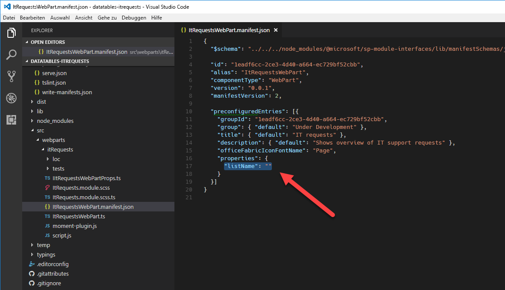

# <a name="migrate-jquery-and-datatables-solution-built-using-script-editor-web-part-to-sharepoint-framework"></a><span data-ttu-id="c7f9f-102">Migrieren von jQuery- und DataTables-Lösungen, die mit Script Editor-Webpart erstellt wurden, in SharePoint Framework</span><span class="sxs-lookup"><span data-stu-id="c7f9f-102">Migrate jQuery and DataTables solution built using Script Editor Web Part to SharePoint Framework</span></span>

<span data-ttu-id="c7f9f-p101">Eines der am häufigsten verwendeten jQuery-Plug-Ins ist [DataTables](https://datatables.net/). Mit DataTables können Sie problemlos leistungsstarke Übersichten über die Daten erstellen, die aus SharePoint und externen APIs stammen. In diesem Artikel wird erläutert, wie Sie eine SharePoint-Anpassung mithilfe von DataTables, die mit dem Script Editor-Webpart erstellt wurden, in das SharePoint-Framework migrieren.</span><span class="sxs-lookup"><span data-stu-id="c7f9f-p101">One of the frequently used jQuery plugins is [DataTables](https://datatables.net/). With DataTables you can easily build powerful data overviews of data coming both from SharePoint and external APIs. This article illustrates how you would migrate a SharePoint customization using DataTables built with the Script Editor Web Part to the SharePoint Framework.</span></span>

## <a name="list-of-it-requests-built-using-the-script-editor-web-part"></a><span data-ttu-id="c7f9f-106">Liste der IT-Anfragen, die mit dem Script Editor-Webpart erstellt wurde</span><span class="sxs-lookup"><span data-stu-id="c7f9f-106">List of IT requests built using the Script Editor Web Part</span></span>

<span data-ttu-id="c7f9f-107">Um das Verfahren der Migration einer SharePoint-Anpassung in das SharePoint-Framework mithilfe von DataTables zu veranschaulichen, verwenden Sie die folgende Lösung, die einen Überblick über die IT-Supportanfragen zeigt, die aus einer SharePoint-Liste abgerufen wurden.</span><span class="sxs-lookup"><span data-stu-id="c7f9f-107">To illustrate the process of migrating a SharePoint customization using DataTables to the SharePoint Framework you will use the following solution that shows an overview of IT support requests retrieved from a SharePoint list.</span></span>


<span data-ttu-id="c7f9f-p102">Die Lösung wird anhand des standardmäßigen Script Editor-Webparts von SharePoint erstellt. Nachfolgend ist der in der Anpassung verwendete Code aufgeführt.</span><span class="sxs-lookup"><span data-stu-id="c7f9f-p102">The solution is built using the standard SharePoint Script Editor Web Part. Following is the code used by the customization.</span></span>

```html
<script src="https://code.jquery.com/jquery-1.12.4.js"></script>
<script src="https://cdn.datatables.net/1.10.15/js/jquery.dataTables.js"></script>
<script src="https://momentjs.com/downloads/moment.min.js"></script>
<link rel="stylesheet" type="text/css" href="https://cdn.datatables.net/1.10.15/css/jquery.dataTables.min.css" />
<table id="requests" class="display" cellspacing="0" width="100%">
    <thead>
        <tr>
            <th>ID</th>
            <th>Business unit</th>
            <th>Category</th>
            <th>Status</th>
            <th>Due date</th>
            <th>Assigned to</th>
        </tr>
    </thead>
</table>
<script>
// UMD
(function(factory) {
    "use strict";

    if (typeof define === 'function' && define.amd) {
        // AMD
        define(['jquery'], function ($) {
            return factory( $, window, document );
        });
    }
    else if (typeof exports === 'object') {
        // CommonJS
        module.exports = function (root, $) {
            if (!root) {
                root = window;
            }

            if (!$) {
                $ = typeof window !== 'undefined' ?
                    require('jquery') :
                    require('jquery')( root );
            }

            return factory($, root, root.document);
        };
    }
    else {
        // Browser
        factory(jQuery, window, document);
    }
}
(function($, window, document) {
    $.fn.dataTable.render.moment = function (from, to, locale) {
        // Argument shifting
        if (arguments.length === 1) {
            locale = 'en';
            to = from;
            from = 'YYYY-MM-DD';
        }
        else if (arguments.length === 2) {
            locale = 'en';
        }

        return function (d, type, row) {
            var m = window.moment(d, from, locale, true);

            // Order and type get a number value from Moment, everything else
            // sees the rendered value
            return m.format(type === 'sort' || type === 'type' ? 'x' : to);
        };
    };
}));
</script>
<script>
$(document).ready(function() {
    $('#requests').DataTable({
        'ajax': {
        'url': "../_api/web/lists/getbytitle('IT Requests')/items?$select=ID,BusinessUnit,Category,Status,DueDate,AssignedTo/Title&$expand=AssignedTo/Title",
        'headers': { 'Accept': 'application/json;odata=nometadata' },
        'dataSrc': function(data) {
            return data.value.map(function(item) {
                return [
                    item.ID,
                    item.BusinessUnit,
                    item.Category,
                    item.Status,
                    new Date(item.DueDate),
                    item.AssignedTo.Title
                ];
            });
        }
    },
    columnDefs: [{
        targets: 4,
        render: $.fn.dataTable.render.moment('YYYY/MM/DD')
    }]
    });
});
</script>
```

<span data-ttu-id="c7f9f-p103">Die Anpassung lädt zunächst die von ihr verwendeten Bibliotheken: jQuery, DataTables und Moment.js (Zeilen 1 bis 4). Als Nächstes gibt sie die Struktur der Tabelle an, die zum Darstellen der Daten verwendet wird (Zeilen 5 bis 16). Nach dem Erstellen der Tabelle umschließt sie Moment.js in einem DataTables-Plug-In, damit die in der Tabelle aufgeführten Datumsangaben formatiert werden können (erster Skriptblock in den Zeilen 17 bis 70). Schließlich verwendet die Anpassung DataTables zum Laden und Darstellen der Liste von IT-Supportanfragen. Die Daten werden mit AJAX aus einer SharePoint-Liste geladen (Zeilen 71 bis 96).</span><span class="sxs-lookup"><span data-stu-id="c7f9f-p103">First, the customization loads the libraries it uses: jQuery, DataTables and Moment.js (lines 1-4). Next, it specifies the structure of the table used to present the data (lines 5-16). After creating the table, it wraps Moment.js into a DataTables plugin so that dates displayed in the table can be formatted (first script block on lines 17-70). Finally, the customization uses DataTables to load and present the list of IT support requests. The data is loaded using AJAX from a SharePoint list (lines 71-96).</span></span>

<span data-ttu-id="c7f9f-116">Durch die Verwendung von DataTables erhalten Endbenutzer eine leistungsfähige Lösung, mit der sie die Ergebnisse auf einfache Weise filtern, sortieren und darin blättern können, ohne dass weitere Entwicklungsschritte erforderlich sind.</span><span class="sxs-lookup"><span data-stu-id="c7f9f-116">Thanks to using DataTables, end-users get a powerful solution where they can easily filter, sort and page through the results without any additional development effort.</span></span>


## <a name="migrate-the-it-requests-overview-solution-from-the-script-editor-web-part-to-the-sharepoint-framework"></a><span data-ttu-id="c7f9f-118">Migrieren der Übersichtslösung für IT-Anfragen vom Script Editor-Webpart in das SharePoint-Framework</span><span class="sxs-lookup"><span data-stu-id="c7f9f-118">Migrate the IT requests overview solution from the Script Editor Web Part to the SharePoint Framework</span></span>

> [!NOTE] 
> <span data-ttu-id="c7f9f-119">Bevor Sie die Schritte in diesem Artikel durchführen, müssen Sie [eine Entwicklungsumgebung einrichten](../../set-up-your-development-environment.md), in der Sie SharePoint-Framework-Lösungen erstellen können.</span><span class="sxs-lookup"><span data-stu-id="c7f9f-119">[Note:](../../set-up-your-development-environment.md) Before following the steps in this article, be sure to set up your development environment for building SharePoint Framework solutions.</span></span>

<span data-ttu-id="c7f9f-p104">Das Umwandeln dieser Anpassung in das SharePoint-Framework bietet eine Reihe von Vorteilen, wie z. B. eine benutzerfreundlichere Konfiguration und die zentrale Verwaltung der Lösung. Es folgt eine Schritt-für-Schritt-Beschreibung dazu, wie Sie die Lösung in das SharePoint-Framework migrieren können. Sie migrieren die Lösung zunächst in das SharePoint-Framework, wobei so wenige Änderungen am ursprünglichen Code wie möglich vorgenommen werden. Später transformieren Sie den Code der Lösung in TypeScript, um die Sicherheitsfeatures nutzen zu können, die es während der Entwicklung bietet.</span><span class="sxs-lookup"><span data-stu-id="c7f9f-p104">Transforming this customization to the SharePoint Framework offers a number of benefits such as more user-friendly configuration and centralized management of the solution. Following is a step-by-step description of how you would migrate the solution to the SharePoint Framework. First, you will migrate the solution to the SharePoint Framework with as few changes to the original code as possible. Later, you will transform the solution's code to TypeScript to benefit of its development-time type safety features.</span></span>

> <span data-ttu-id="c7f9f-124">Der Quellcode des Projekts in den verschiedenen Phasen der Migration steht unter [https://github.com/SharePoint/sp-dev-fx-webparts/tree/master/tutorials/tutorial-migrate-datatables](https://github.com/SharePoint/sp-dev-fx-webparts/tree/master/tutorials/tutorial-migrate-datatables) zur Verfügung.</span><span class="sxs-lookup"><span data-stu-id="c7f9f-124">The source code of the project in the different stages of migration is available at [https://github.com/SharePoint/sp-dev-fx-webparts/tree/master/tutorials/tutorial-migrate-datatables](https://github.com/SharePoint/sp-dev-fx-webparts/tree/master/tutorials/tutorial-migrate-datatables).</span></span>

### <a name="create-new-sharepoint-framework-project"></a><span data-ttu-id="c7f9f-125">Erstellen eines neuen SharePoint Framework-Projekts</span><span class="sxs-lookup"><span data-stu-id="c7f9f-125">Create new SharePoint Framework project</span></span>

<span data-ttu-id="c7f9f-126">Erstellen Sie zunächst einen neuen Ordner für Ihr Projekt:</span><span class="sxs-lookup"><span data-stu-id="c7f9f-126">Start by creating a new folder for your project</span></span>

```sh
md datatables-itrequests
```

<span data-ttu-id="c7f9f-127">Navigieren Sie zum Projektordner:</span><span class="sxs-lookup"><span data-stu-id="c7f9f-127">Navigate to the project folder:</span></span>

```sh
cd datatables-itrequests
```

<span data-ttu-id="c7f9f-128">Führen Sie im Projektordner den SharePoint Framework-Yeoman-Generator aus, um ein Gerüst für ein neues SharePoint Framework-Projekt zu erstellen:</span><span class="sxs-lookup"><span data-stu-id="c7f9f-128">In the project folder run the SharePoint Framework Yeoman generator to scaffold a new SharePoint Framework project:</span></span>

```sh
yo @microsoft/sharepoint
```

<span data-ttu-id="c7f9f-129">Es werden mehrere Eingabeaufforderungen angezeigt. Definieren Sie die Werte jeweils wie folgt:</span><span class="sxs-lookup"><span data-stu-id="c7f9f-129">When prompted, define values as follows:</span></span>
- <span data-ttu-id="c7f9f-130">**datatables-itrequests** als Name der Lösung</span><span class="sxs-lookup"><span data-stu-id="c7f9f-130">**datatables-itrequests** as your solution name</span></span>
- <span data-ttu-id="c7f9f-131">**Aktuellen Ordner verwenden** als Speicherort für die Dateien</span><span class="sxs-lookup"><span data-stu-id="c7f9f-131">**Use the current folder** for the location to place the files</span></span>
- <span data-ttu-id="c7f9f-132">**No javaScript web framework** als Eintrittspunkt für die Webpart-Erstellung</span><span class="sxs-lookup"><span data-stu-id="c7f9f-132">**No javaScript web framework** as the starting point to build the web part</span></span>
- <span data-ttu-id="c7f9f-133">**IT-Anfragen** als Name des Webparts</span><span class="sxs-lookup"><span data-stu-id="c7f9f-133">**IT requests** as your web part name</span></span>
- <span data-ttu-id="c7f9f-134">**Übersicht über die IT-Supportanfragen** als Beschreibung für das Webpart</span><span class="sxs-lookup"><span data-stu-id="c7f9f-134">**Shows overview of IT support requests** as your web part description</span></span>


<span data-ttu-id="c7f9f-136">Sobald das Gerüst abgeschlossen ist, sperren Sie die Version der Projektabhängigkeiten, indem Sie den folgenden Befehl ausführen:</span><span class="sxs-lookup"><span data-stu-id="c7f9f-136">Once the scaffolding completes, lock down the version of the project dependencies by running the following command:</span></span>

```sh
npm shrinkwrap
```

<span data-ttu-id="c7f9f-137">Öffnen Sie dann den Projektordner im Code-Editor.</span><span class="sxs-lookup"><span data-stu-id="c7f9f-137">Next, open your project folder in your code editor.</span></span> <span data-ttu-id="c7f9f-138">In diesem Tutorial verwenden Sie Visual Studio Code.</span><span class="sxs-lookup"><span data-stu-id="c7f9f-138">In this tutorial, you will use Visual Studio Code.</span></span>


### <a name="load-javascript-libraries"></a><span data-ttu-id="c7f9f-140">Laden von JavaScript-Bibliotheken</span><span class="sxs-lookup"><span data-stu-id="c7f9f-140">Load JavaScript libraries</span></span>

<span data-ttu-id="c7f9f-p106">Ähnlich wie bei der ursprünglichen Lösung, die mit dem Script Editor-Webpart erstellt wurde, müssen Sie zunächst die JavaScript-Bibliotheken laden, die von der Lösung benötigt werden. In SharePoint-Framework umfasst dies in der Regel zwei Schritte: die Angabe der URL, über die die Bibliothek geladen werden soll, und ein Verweis auf die Bibliothek im Code.</span><span class="sxs-lookup"><span data-stu-id="c7f9f-p106">Similarly to the original solution built using the Script Editor Web Part, first you need to load the JavaScript libraries required by the solution. In SharePoint Framework this usually consists of two steps: specifying the URL from which the library should be loaded, and referencing the library in the code.</span></span>

<span data-ttu-id="c7f9f-p107">Beginnen Sie, indem Sie die URLs angeben, über die die Bibliotheken geladen werden sollen. Öffnen Sie im Code-Editor die Datei **./config/config.json**, und ändern Sie den Abschnitt **externals** wie folgt:</span><span class="sxs-lookup"><span data-stu-id="c7f9f-p107">Start, with specifying the URLs from which libraries should be loaded. In the code editor, open the **./config/config.json** file and change the **externals** section to:</span></span>

```json
{
  "externals": {
    "jquery": "https://code.jquery.com/jquery-1.12.4.min.js",
    "datatables.net": "https://cdn.datatables.net/1.10.15/js/jquery.dataTables.min.js",
    "moment": "https://momentjs.com/downloads/moment.min.js"
  }
}
```

<span data-ttu-id="c7f9f-145">Öffnen Sie als Nächstes die Datei **./src/webparts/itRequests/ItRequestsWebPart.ts**, und fügen Sie nach der letzten **import**-Anweisung Folgendes hinzu:</span><span class="sxs-lookup"><span data-stu-id="c7f9f-145">Next, open the **./src/webparts/itRequests/ItRequestsWebPart.ts** file, and after the last **import** statement add:</span></span>

```ts
import 'jquery';
import 'datatables.net';
import 'moment';
```

### <a name="define-data-table"></a><span data-ttu-id="c7f9f-146">Definieren einer Datentabelle</span><span class="sxs-lookup"><span data-stu-id="c7f9f-146">Define data table</span></span>

<span data-ttu-id="c7f9f-p108">Genau wie bei der ursprünglichen Lösung müssen Sie im nächsten Schritt die Struktur der Tabelle definieren, die zum Anzeigen der Daten verwendet wird. Öffnen Sie im Code-Editor die Datei **./src/webparts/itRequests/ItRequestsWebPart.ts**, und ändern Sie die **render**-Methode in:</span><span class="sxs-lookup"><span data-stu-id="c7f9f-p108">Just as in the original solution, the next step is to define the structure of the table used to display the data. In the code editor, open the **./src/webparts/itRequests/ItRequestsWebPart.ts** file and change the **render** method to:</span></span>

```ts
export default class ItRequestsWebPart extends BaseClientSideWebPart<IItRequestsWebPartProps> {
  public render(): void {
    this.domElement.innerHTML = `
      <link rel="stylesheet" type="text/css" href="https://cdn.datatables.net/1.10.15/css/jquery.dataTables.min.css" />
      <table id="requests" class="display ${styles.helloWorld}" cellspacing="0" width="100%">
        <thead>
            <tr>
                <th>ID</th>
                <th>Business unit</th>
                <th>Category</th>
                <th>Status</th>
                <th>Due date</th>
                <th>Assigned to</th>
            </tr>
        </thead>
      </table>`;
  }
  // ...
}
```

### <a name="register-momentjs-plugin-for-datatables"></a><span data-ttu-id="c7f9f-149">Registrieren des Moment.js-Plug-Ins für DataTables</span><span class="sxs-lookup"><span data-stu-id="c7f9f-149">Register Moment.js plugin for DataTables</span></span>

<span data-ttu-id="c7f9f-p109">Im nächsten Schritt definieren Sie das Moment.js-Plug-In für DataTables so, dass die Datumsangaben in der Tabelle formatiert werden können. Erstellen Sie im Ordner **./src/webparts/itRequests** eine neue Datei namens **moment-plugin.js**, und fügen Sie den folgenden Code ein:</span><span class="sxs-lookup"><span data-stu-id="c7f9f-p109">The next step is to define the Moment.js plugin for DataTables so that dates in the table can be formatted. In the **./src/webparts/itRequests** folder, create a new file named **moment-plugin.js** and paste the following code:</span></span>

```js
// UMD
(function (factory) {
    "use strict";

    if (typeof define === 'function' && define.amd) {
        // AMD
        define(['jquery'], function ($) {
            return factory($, window, document);
        });
    }
    else if (typeof exports === 'object') {
        // CommonJS
        module.exports = function (root, $) {
            if (!root) {
                root = window;
            }

            if (!$) {
                $ = typeof window !== 'undefined' ?
                    require('jquery') :
                    require('jquery')(root);
            }

            return factory($, root, root.document);
        };
    }
    else {
        // Browser
        factory(jQuery, window, document);
    }
}

(function ($, window, document) {
    $.fn.dataTable.render.moment = function (from, to, locale) {
        // Argument shifting
        if (arguments.length === 1) {
            locale = 'en';
            to = from;
            from = 'YYYY-MM-DD';
        }
        else if (arguments.length === 2) {
            locale = 'en';
        }

        return function (d, type, row) {
            var moment = require('moment');
            var m = moment(d, from, locale, true);

            // Order and type get a number value from Moment, everything else
            // sees the rendered value
            return m.format(type === 'sort' || type === 'type' ? 'x' : to);
        };
    };
}));
```

<span data-ttu-id="c7f9f-p110">Damit das Webpart das Plug-In lädt, muss es die neu erstellte Datei **moment-plugin.js** referenzieren. Öffnen Sie im Code-Editor die Datei **./src/webparts/itRequests/ItRequestsWebPart.ts**, und fügen Sie nach der letzten **import**-Anweisung Folgendes ein:</span><span class="sxs-lookup"><span data-stu-id="c7f9f-p110">For the web part to load the plugin, it has to reference the newly created **moment-plugin.js** file. In the code editor, open the **./src/webparts/itRequests/ItRequestsWebPart.ts** file and after the last **import** statement add:</span></span>

```ts
import './moment-plugin';
```

> [!NOTE] 
> <span data-ttu-id="c7f9f-p111">Sie müssen beim Referenzieren von anderen Dateien die Erweiterung **js** nicht einbeziehen. Das SharePoint-Framework löst die Erweiterung automatisch auf.</span><span class="sxs-lookup"><span data-stu-id="c7f9f-p111">**Note:** you don't need to include the .js extension when referencing other files. SharePoint Framework will automatically resolve the extension for you.</span></span>

### <a name="initiate-datatables-and-load-data"></a><span data-ttu-id="c7f9f-156">Initiieren von DataTables und laden der Daten</span><span class="sxs-lookup"><span data-stu-id="c7f9f-156">Initiate DataTables and load data</span></span>

<span data-ttu-id="c7f9f-p112">Der letzte Schritt besteht darin, den Code einzubeziehen, der die Datentabelle initiiert und die Daten aus SharePoint lädt. Erstellen Sie im Ordner **./src/webparts/itRequests** eine neue Datei namens **script.js**, und fügen Sie den folgenden Code ein:</span><span class="sxs-lookup"><span data-stu-id="c7f9f-p112">The last step is to include the code that initiates the data table and loads the data from SharePoint. In the **./src/webparts/itRequests** folder, create a new file named **script.js** and paste the following code:</span></span>

```js
$(document).ready(function () {
    $('#requests').DataTable({
        'ajax': {
            'url': "../../_api/web/lists/getbytitle('IT Requests')/items?$select=ID,BusinessUnit,Category,Status,DueDate,AssignedTo/Title&$expand=AssignedTo/Title",
            'headers': { 'Accept': 'application/json;odata=nometadata' },
            'dataSrc': function (data) {
                return data.value.map(function (item) {
                    return [
                        item.ID,
                        item.BusinessUnit,
                        item.Category,
                        item.Status,
                        new Date(item.DueDate),
                        item.AssignedTo.Title
                    ];
                });
            }
        },
        columnDefs: [{
            targets: 4,
            render: $.fn.dataTable.render.moment('YYYY/MM/DD')
        }]
    });
});
```

<span data-ttu-id="c7f9f-159">Um diese Datei im Webpart zu referenzieren, öffnen Sie im Code-Editor die Datei **./src/webparts/itRequests/ItRequestsWebPart.ts**, und ändern Sie die **render**-Methode in:</span><span class="sxs-lookup"><span data-stu-id="c7f9f-159">In order to reference this file in the web part, in the code editor, open the **./src/webparts/itRequests/ItRequestsWebPart.ts** file and change the **render** method to:</span></span>

```ts
export default class ItRequestsWebPart extends BaseClientSideWebPart<IItRequestsWebPartProps> {
  public render(): void {
    this.domElement.innerHTML = `
      <link rel="stylesheet" type="text/css" href="https://cdn.datatables.net/1.10.15/css/jquery.dataTables.min.css" />
      <table id="requests" class="display ${styles.helloWorld}" cellspacing="0" width="100%">
        <thead>
            <tr>
                <th>ID</th>
                <th>Business unit</th>
                <th>Category</th>
                <th>Status</th>
                <th>Due date</th>
                <th>Assigned to</th>
            </tr>
        </thead>
      </table>`;

      require('./script');
  }
  // ...
}
```

<span data-ttu-id="c7f9f-160">Überprüfen Sie, ob das Webpart wie erwartet funktioniert, indem Sie in der Befehlszeile Folgendes ausführen:</span><span class="sxs-lookup"><span data-stu-id="c7f9f-160">Verify, that the web part is working as expected by in the command line executing:</span></span>

```sh
gulp serve --nobrowser
```

<span data-ttu-id="c7f9f-p113">Da das Webpart die Daten aus SharePoint lädt, müssen Sie das Webpart mit der gehosteten SharePoint Framework-Arbeitsfläche testen. Navigieren Sie zu **https://yourtenant.sharepoint.com/_layouts/workbench.aspx**, und fügen Sie das Webpart zum Canvas hinzu. Die IT-Anfragen sollten nun mit dem jQuery-Plug-In von DataTables angezeigt werden.</span><span class="sxs-lookup"><span data-stu-id="c7f9f-p113">Because the web part loads its data from SharePoint, you have to test the web part using the hosted SharePoint Framework workbench. Navigate to **https://yourtenant.sharepoint.com/_layouts/workbench.aspx** and add the web part to the canvas. You should now see the IT requests displayed using the DataTables jQuery plugin.</span></span>


## <a name="add-support-for-configuring-the-web-part-through-web-part-properties"></a><span data-ttu-id="c7f9f-165">Hinzufügen von Unterstützung zum Konfigurieren des Webparts über Webpart-Eigenschaften</span><span class="sxs-lookup"><span data-stu-id="c7f9f-165">Add support for configuring the web part through web part properties</span></span>

<span data-ttu-id="c7f9f-p114">In den vorherigen Schritten haben Sie die IT-Anfragenlösung aus dem Script Editor-Webpart in das SharePoint-Framework migriert. Obwohl die Lösung bereits wie erwartet funktioniert, nutzt sie keine der Vorteile des SharePoint-Framework. Der Name der Liste, aus der die IT-Anfragen geladen werden, isst im Code enthalten, und der Code selbst ist einfaches JavaScript, das schwerer umgestaltet werden kann als TypeScript. Die folgenden Schritte veranschaulichen, wie Sie die vorhandene Lösung erweitern können, um Benutzern zu ermöglichen, den Namen der Liste anzugeben, aus der Daten geladen werden sollen. Später wandeln Sie den Code in TypeScript um, um seine Typsicherheitfeatures nutzen zu können.</span><span class="sxs-lookup"><span data-stu-id="c7f9f-p114">In the previous steps you migrated the IT requests solutions from Script Editor Web Part to the SharePoint Framework. While the solution already works as expected, it doesn't use any of the SharePoint Framework benefits. The name of the list from which IT requests are loaded is included in the code and the code itself is plain JavaScript which is harder to refactor than TypeScript. The following steps illustrate how to extend the existing solution to allow users to specify the name of the list to load the data from. Later, you will transform the code to TypeScript to benefit of its type safety features.</span></span>

### <a name="define-web-part-property-for-storing-the-name-of-the-list"></a><span data-ttu-id="c7f9f-171">Definieren der Webparteigenschaft zum Speichern des Listennamens</span><span class="sxs-lookup"><span data-stu-id="c7f9f-171">Define web part property for storing the name of the list</span></span>

<span data-ttu-id="c7f9f-p115">Beginnen Sie mit der Definition einer Webparteigenschaft, um den Namen der Liste zu speichern, aus der IT-Anfragen geladen werden sollen. Öffnen Sie im Code-Editor die Datei **./src/webparts/itRequests/ItRequestsWebPart.manifest.json**, benennen Sie die standardmäßige **description**-Eigenschaft in **listName** um, und löschen Sie den Wert.</span><span class="sxs-lookup"><span data-stu-id="c7f9f-p115">Start with defining a web part property to store the name of the list from which IT requests should be loaded. In the code editor, open the **./src/webparts/itRequests/ItRequestsWebPart.manifest.json** file and rename the default **description** property to **listName** and clear its value.</span></span>



<span data-ttu-id="c7f9f-p116">Aktualisieren Sie als Nächstes die Oberfläche der Webparteigenschaften, um die Änderungen im Manifest zu übernehmen. Öffnen Sie im Code-Editor die Datei **./src/webparts/itRequests/IItRequestsWebPartProps.ts**, und ändern Sie den Inhalt in:</span><span class="sxs-lookup"><span data-stu-id="c7f9f-p116">Next, update the web part properties interface to reflect the changes in the manifest. In the code editor, open the **./src/webparts/itRequests/IItRequestsWebPartProps.ts** file and change its contents to:</span></span>

```ts
export interface IItRequestsWebPartProps {
  listName: string;
}
```

<span data-ttu-id="c7f9f-p117">Aktualisieren Sie dann die Anzeigebeschriftungen für die Eigenschaft **listName**. Öffnen Sie die Datei **./src/webparts/itRequests/loc/mystrings.d.ts**, und ändern Sie den Inhalt in:</span><span class="sxs-lookup"><span data-stu-id="c7f9f-p117">Then, update the display labels for the **listName** property. Open the **./src/webparts/itRequests/loc/mystrings.d.ts** file and change its contents to:</span></span>

```ts
declare interface IItRequestsStrings {
  PropertyPaneDescription: string;
  BasicGroupName: string;
  ListNameFieldLabel: string;
}

declare module 'itRequestsStrings' {
  const strings: IItRequestsStrings;
  export = strings;
}
```

<span data-ttu-id="c7f9f-179">Öffnen Sie als Nächstes die Datei **./src/webparts/itRequests/loc/en-us.js**, und ändern Sie den Inhalt in:</span><span class="sxs-lookup"><span data-stu-id="c7f9f-179">Next, open the **./src/webparts/itRequests/loc/en-us.js** file and change its contents to:</span></span>

```js
define([], function() {
  return {
    "PropertyPaneDescription": "IT Requests settings",
    "BasicGroupName": "Data",
    "ListNameFieldLabel": "List name"
  }
});
```

<span data-ttu-id="c7f9f-p118">Aktualisieren Sie zum Schluss das Webpart, damit es die neu definierte Eigenschaft verwendet. Öffnen Sie im Code-Editor die Datei **./src/webparts/itRequests/ItRequestsWebPart.ts**, und ändern Sie die **getPropertyPaneConfiguration**-Methode in:</span><span class="sxs-lookup"><span data-stu-id="c7f9f-p118">Finally, update the web part to use the newly defined property. In the code editor, open the **./src/webparts/itRequests/ItRequestsWebPart.ts** file and change the **getPropertyPaneConfiguration** method to:</span></span>

```ts
export default class ItRequestsWebPart extends BaseClientSideWebPart<IItRequestsWebPartProps> {
  // ...
  protected getPropertyPaneConfiguration(): IPropertyPaneConfiguration {
    return {
      pages: [
        {
          header: {
            description: strings.PropertyPaneDescription
          },
          groups: [
            {
              groupName: strings.BasicGroupName,
              groupFields: [
                PropertyPaneTextField('listName', {
                  label: strings.ListNameFieldLabel
                })
              ]
            }
          ]
        }
      ]
    };
  }

  protected get disableReactivePropertyChanges(): boolean {
    return true;
  }
}
```

<span data-ttu-id="c7f9f-182">Um zu verhindern, dass das Webpart neu geladen wird, wenn Benutzer den Namen der Liste eingeben, haben Sie das Webpart darüber hinaus so konfiguriert, dass es den nicht reaktiven Eigenschaftenbereich verwendet, indem Sie die **disableReactivePropertyChanges**-Methode hinzugefügt und den Rückgabewert auf **true** festgelegt haben.</span><span class="sxs-lookup"><span data-stu-id="c7f9f-182">To prevent the web part from reloading as users type the name of the list, you've also configured the web part to use the non-reactive property pane by adding the **disableReactivePropertyChanges** method and settings its return value to **true**.</span></span>

### <a name="use-the-configured-name-of-the-list-to-load-the-data-from"></a><span data-ttu-id="c7f9f-183">Verwenden des Namens der konfigurierten Liste, aus der Daten geladen werden</span><span class="sxs-lookup"><span data-stu-id="c7f9f-183">Use the configured name of the list to load the data from</span></span>

<span data-ttu-id="c7f9f-p119">Anfangs war der Name der Liste, aus der die Daten geladen werden sollen, in die REST-Abfrage eingebettet. Nun, da Benutzer diesen Namen konfigurieren können, sollte der konfigurierte Wert in die REST-Abfrage eingefügt werden, bevor die Daten geladen werden. Die einfachste Möglichkeit, dies zu tun, besteht darin, den Inhalt der Datei **script.js** in die Haupt-Webpartdatei zu verschieben.</span><span class="sxs-lookup"><span data-stu-id="c7f9f-p119">Initially, the name of the list from which the data should be loaded was embedded in the REST query. Now that users can configure this name, the configured value should be injected into the REST query before loading the data. The easiest way to do that, is by moving the contents of the **script.js** file to the main web part file.</span></span>

<span data-ttu-id="c7f9f-187">Öffnen Sie im Code-Editor die Datei **./src/webparts/itRequests/ItRequestsWebPart.ts**, und ändern Sie die **render**-Methode in:</span><span class="sxs-lookup"><span data-stu-id="c7f9f-187">In the code editor, open the **./src/webparts/itRequests/ItRequestsWebPart.ts** file and change the **render** method to:</span></span>

```ts
var $: any = (window as any).$;

export default class ItRequestsWebPart extends BaseClientSideWebPart<IItRequestsWebPartProps> {
  public render(): void {
    this.domElement.innerHTML = `
      <link rel="stylesheet" type="text/css" href="https://cdn.datatables.net/1.10.15/css/jquery.dataTables.min.css" />
      <table class="display ${styles.helloWorld}" cellspacing="0" width="100%">
        <thead>
            <tr>
                <th>ID</th>
                <th>Business unit</th>
                <th>Category</th>
                <th>Status</th>
                <th>Due date</th>
                <th>Assigned to</th>
            </tr>
        </thead>
      </table>`;

    $(document).ready(() => {
      $('table', this.domElement).DataTable({
        'ajax': {
          'url': `../../_api/web/lists/getbytitle('${escape(this.properties.listName)}')/items?$select=ID,BusinessUnit,Category,Status,DueDate,AssignedTo/Title&$expand=AssignedTo/Title`,
          'headers': { 'Accept': 'application/json;odata=nometadata' },
          'dataSrc': function (data) {
            return data.value.map(function (item) {
              return [
                item.ID,
                item.BusinessUnit,
                item.Category,
                item.Status,
                new Date(item.DueDate),
                item.AssignedTo.Title
              ];
            });
          }
        },
        columnDefs: [{
          targets: 4,
          render: $.fn.dataTable.render.moment('YYYY/MM/DD')
        }]
      });
    });
  }

  // ...
}
```

<span data-ttu-id="c7f9f-p120">Anstatt den Code aus der Datei **script.js** zu referenzieren, ist der gesamte Inhalt Teil der **render**-Methode des Webparts. In der REST-Abfrage können Sie nun in Zeile 40 den festen Namen der Liste durch den Wert der Eigenschaft **listName** ersetzen, der den Namen der Liste wie vom Benutzer konfiguriert enthält. Vor der Verwendung des Werts wird dieser mit der **escape**-Funktion von lodash auskommentiert, um eine Skripteinschleusung zu verhindern.</span><span class="sxs-lookup"><span data-stu-id="c7f9f-p120">Instead of referencing the code from the **script.js** file, all of its contents are a part of the web part's **render** method. In the REST query, in line 40, you can now replace the fixed name of the list with the value of the **listName** property which holds the name of the list as configured by the user. Before using the value, it's being escaped using the lodash's **escape** function to disallow script injection.</span></span>

<span data-ttu-id="c7f9f-p121">Zu diesem Zeitpunkt ist immer noch der größte Teil des Codes in einfachem JavaScript geschrieben. Um Buildprobleme mit der **$** jQuery-Variablen zu vermeiden, mussten Sie diese als Typ**any** in Zeile 18 definieren. Wenn Sie den Code später in TypeScript transformieren, ersetzen Sie dies durch eine geeignete Typdefinition.</span><span class="sxs-lookup"><span data-stu-id="c7f9f-p121">At this point, the bulk of the code is still written using plain JavaScript. To avoid build issues with the **$** jQuery variable, you had to define it as **any** type in line 18. Later, when transforming the code to TypeScript you will replace it with a proper type definition.</span></span>

<span data-ttu-id="c7f9f-194">Da Sie den Inhalt der Datei **script.js** gerade in die Haupt-Webpartdatei verschoben haben, ist **script.js** nicht mehr erforderlich, und Sie können die Datei aus dem Projekt löschen.</span><span class="sxs-lookup"><span data-stu-id="c7f9f-194">As you have just moved the contents of the **script.js** file into the main web part file, the **script.js** is no longer necessary and you can delete it from the project.</span></span>

<span data-ttu-id="c7f9f-195">Um zu überprüfen, ob das Webpart wie erwartet funktioniert, führen Sie Folgendes in der Befehlszeile aus:</span><span class="sxs-lookup"><span data-stu-id="c7f9f-195">To verify that the web part is working as expected, run in the command line:</span></span>

```sh
gulp serve --nobrowser
```

<span data-ttu-id="c7f9f-p122">Navigieren Sie zu der gehosteten Workbench, und fügen Sie das Webpart zum Canvas hinzu. Öffnen Sie den Eigenschaftenbereich des Webparts, geben Sie den Namen der Liste mit IT-Anfragen an, und klicken Sie auf die Schaltfläche **Übernehmen**, um die Änderungen zu bestätigen. Sie sollten nun die im Webpart angezeigten IT-Anfragen sehen.</span><span class="sxs-lookup"><span data-stu-id="c7f9f-p122">Navigate to the hosted workbench and add the web part to the canvas. Open the web part property pane, specify the name of the list with IT requests and click the **Apply** button to confirm the changes. You should now see IT requests displayed in the web part.</span></span>


## <a name="transform-the-plain-javascript-code-to-typescript"></a><span data-ttu-id="c7f9f-200">Transformieren des einfachen JavaScript-Codes in TypeScript</span><span class="sxs-lookup"><span data-stu-id="c7f9f-200">Transform the plain JavaScript code to TypeScript</span></span>

<span data-ttu-id="c7f9f-p123">Die Verwendung von TypeScript anstatt von JavaScript bietet eine Reihe von Vorteilen. TypeScript ist nicht nur einfacher zu verwalten und umzugestalten, sondern ermöglicht auch, Fehler früher abzufangen. Die nachfolgenden Schritte beschreiben, wie Sie den ursprünglichen JavaScript-Code in TypeScript transformieren.</span><span class="sxs-lookup"><span data-stu-id="c7f9f-p123">Using TypeScript over plain JavaScript offers a number of benefits. Not only is TypeScript easier to maintain and refactor but it also allows you to catch errors earlier. Following steps describe how you would transform the original JavaScript code to TypeScript.</span></span>

### <a name="add-type-definitions-for-used-libraries"></a><span data-ttu-id="c7f9f-204">Hinzufügen von Typdefinitionen für verwendete Bibliotheken</span><span class="sxs-lookup"><span data-stu-id="c7f9f-204">Add type definitions for used libraries</span></span>

<span data-ttu-id="c7f9f-p124">Um ordnungsgemäß zu funktionieren, erfordert TypeScript Typdefinitionen für die verschiedenen Bibliotheken, die im Projekt verwendet werden. Typdefinitionen werden häufig als npm-Pakete im @types-Namespace bereitgestellt.</span><span class="sxs-lookup"><span data-stu-id="c7f9f-p124">To function properly, TypeScript requires type definitions for the different libraries used in the project. Type definitions are often distributed as npm packages in the @types namespace.</span></span>

<span data-ttu-id="c7f9f-207">Beginnen Sie, indem Sie die Typdefinitionen für jQuery und DataTables installieren, indem Sie in der Befehlszeile Folgendes ausführen:</span><span class="sxs-lookup"><span data-stu-id="c7f9f-207">Start by installing type definitions for jQuery and DataTables by executing in the command line:</span></span>

```sh
npm install --save-dev @types/jquery @types/jquery.datatables
```

<span data-ttu-id="c7f9f-p125">Typdefinitionen für Moment.js werden zusammen mit dem Moment.js-Paket bereitgestellt. Obwohl Sie Moment.js über eine URL laden, müssen das Moment.js-Paket trotzdem noch im Projekt installieren, um ihre Eingaben verwenden zu können.</span><span class="sxs-lookup"><span data-stu-id="c7f9f-p125">Type definitions for Moment.js are distributed together with the Moment.js package. Even though, you're loading Moment.js from a URL, in order to use its typings, you still need to install the Moment.js package in the project.</span></span>

<span data-ttu-id="c7f9f-210">Installieren Sie das Moment.js-Paket, indem Sie in der Befehlszeile Folgendes ausführen:</span><span class="sxs-lookup"><span data-stu-id="c7f9f-210">Install the Moment.js package by executing in the command line:</span></span>

```sh
npm install --save moment
```

### <a name="update-package-references"></a><span data-ttu-id="c7f9f-211">Aktualisieren von Paketverweisen</span><span class="sxs-lookup"><span data-stu-id="c7f9f-211">Update package references</span></span>

<span data-ttu-id="c7f9f-p126">Um Typen der installierten Typdefinitionen verwenden zu können, müssen Sie die Verweismethode auf die Bibliotheken ändern. Öffnen Sie im Code-Editor die Datei **./src/webparts/itRequests/ItRequestsWebPart.ts**, und ändern Sie die `import 'jquery';`-Anweisung in:</span><span class="sxs-lookup"><span data-stu-id="c7f9f-p126">In order to use types from the installed type definitions, you have to change how you reference libraries. In the code editor, open the **./src/webparts/itRequests/ItRequestsWebPart.ts** file and change `import 'jquery';` statement to:</span></span>

```ts
import * as $ from 'jquery';
```

<span data-ttu-id="c7f9f-214">Da Sie **$** als jQuery definiert haben, können Sie nun die lokale Definition von **$** entfernen, die Sie zuvor hinzugefügt hatten:</span><span class="sxs-lookup"><span data-stu-id="c7f9f-214">Having defined **$** as jQuery you can now remove the local definition of **$** that you've added previously:</span></span>

```ts
var $: any = (window as any).$;
```

<span data-ttu-id="c7f9f-p127">Da DataTables ein jQuery-Plug-In ist, das sich selbst an jQuery anfügt, können Sie die Typdefinition nicht direkt laden. Stattdessen müssen Sie sie zur Liste der global geladenen Typen hinzufügen. Öffnen Sie im Code-Editor die Datei **./tsconfig.json**, und fügen Sie zum Array **types** **jquery.datatables** hinzu:</span><span class="sxs-lookup"><span data-stu-id="c7f9f-p127">Because DataTables is a jQuery plugin that attaches itself to jQuery you cannot load its type definition directly. Instead, you have to add it to the list of types loaded globally. In the code editor, open the **./tsconfig.json** file and to the **types** array add **jquery.datatables**:</span></span>

```json
{
  "compilerOptions": {
    "target": "es5",
    "forceConsistentCasingInFileNames": true,
    "module": "commonjs",
    "jsx": "react",
    "declaration": true,
    "sourceMap": true,
    "types": [
      "es6-promise",
      "es6-collections",
      "jquery.datatables",
      "webpack-env"
    ]
  }
}
```

### <a name="update-main-web-part-files-to-typescript"></a><span data-ttu-id="c7f9f-218">Aktualisieren der Haupt-Webpartdatei in TypeScript</span><span class="sxs-lookup"><span data-stu-id="c7f9f-218">Update main web part files to TypeScript</span></span>

<span data-ttu-id="c7f9f-219">Da jetzt die Typdefinitionen für alle im Projekt installierten Bibliotheken vorhanden sind, können Sie beginnen mit dem Transformieren des einfachen JavaScript-Codes in TypeScript beginnen.</span><span class="sxs-lookup"><span data-stu-id="c7f9f-219">Now that you have type definitions for all libraries installed in the project, you can start transforming the plain JavaScript code to TypeScript.</span></span>

<span data-ttu-id="c7f9f-p128">Beginnen Sie mit der Definition einer Oberfläche für die IT-Anfrageinformationen, die Sie aus der SharePoint-Liste abrufen. Öffnen Sie im Code-Editor die Datei **./src/webparts/itRequests/ItRequestsWebPart.ts**, und fügen Sie direkt oberhalb der Webpartklasse den folgende Codeausschnitt ein:</span><span class="sxs-lookup"><span data-stu-id="c7f9f-p128">Start, with defining an interface for the IT request information that you retrieve from the SharePoint list. In the code editor, open the **./src/webparts/itRequests/ItRequestsWebPart.ts** file and just above the web part class, add the following code snippet:</span></span>

```ts
interface IRequestItem {
  ID: number;
  BusinessUnit: string;
  Category: string;
  Status: string;
  DueDate: string;
  AssignedTo: { Title: string; };
}
```

<span data-ttu-id="c7f9f-222">Ändern Sie im nächsten Schritt die **render**-Methode in:</span><span class="sxs-lookup"><span data-stu-id="c7f9f-222">Next, in the web part class, change the **render** method to:</span></span>

```ts
export default class ItRequestsWebPart extends BaseClientSideWebPart<IItRequestsWebPartProps> {
  public render(): void {
    this.domElement.innerHTML = `
      <link rel="stylesheet" type="text/css" href="https://cdn.datatables.net/1.10.15/css/jquery.dataTables.min.css" />
      <table class="display ${styles.helloWorld}" cellspacing="0" width="100%">
        <thead>
            <tr>
                <th>ID</th>
                <th>Business unit</th>
                <th>Category</th>
                <th>Status</th>
                <th>Due date</th>
                <th>Assigned to</th>
            </tr>
        </thead>
      </table>`;

    $('table', this.domElement).DataTable({
      'ajax': {
        'url': `../../_api/web/lists/getbytitle('${escape(this.properties.listName)}')/items?$select=ID,BusinessUnit,Category,Status,DueDate,AssignedTo/Title&$expand=AssignedTo/Title`,
        'headers': { 'Accept': 'application/json;odata=nometadata' },
        'dataSrc': (data: { value: IRequestItem[] }): any[][] => {
          return data.value.map((item: IRequestItem): any[] => {
            return [
              item.ID,
              item.BusinessUnit,
              item.Category,
              item.Status,
              new Date(item.DueDate),
              item.AssignedTo.Title
            ];
          });
        }
      },
      columnDefs: [{
        targets: 4,
        render: $.fn.dataTable.render.moment('YYYY/MM/DD')
      }]
    });
  }

  // ...
}
```

<span data-ttu-id="c7f9f-p129">Beachten Sie, wie nun die AJAX-Anforderung zum Abrufen der Daten aus der SharePoint-Liste eingegeben wird und Sie dabei unterstützt sicherzustellen, dass Sie sich beim Übergeben der Eigenschaften in ein Array an DataTables auf die richtigen Eigenschaften beziehen. Die Datenstruktur, mit der DataTables eine Tabellenzeile darstellt, ist ein Array von gemischten Typen; daher wurde es der Einfachheit halber als **any[]**. Die Verwendung des Typs **any** in diesem Kontext ist nicht schlecht, da die in der Eigenschaft **dataSrc** zurückgegebenen Daten intern von DataTables verwendet werden.</span><span class="sxs-lookup"><span data-stu-id="c7f9f-p129">Notice, how the AJAX request, to retrieve the data from the SharePoint list, is now typed and helps you ensure you're referring to correct properties when passing them into an array to DataTables. The data structure used by DataTables to represent a row in the table, is an array of mixed types so for simplicity it was defined as **any[]**. Using the **any** type in this context is not bad, because the data returned inside the **dataSrc** property is used internally by DataTables.</span></span>

<span data-ttu-id="c7f9f-p130">Beim Aktualisieren der **render**-Methode haben Sie darüber hinaus zwei weitere Änderungen vorgenommen. Sie haben erstens das **id**-Attribut aus der Tabelle entfernt. Dies ermöglicht Ihnen, mehrere Instanzen des gleichen Webparts auf der Seite zu platzieren. Außerdem haben Sie den Verweise auf die Funktion `$(document).ready()` entfernt, die nicht notwendig ist, da das DOM des Elements, in dem die Datentabelle gerendert wird, vor dem Initialisierungscode von DataTables festgelegt wird.</span><span class="sxs-lookup"><span data-stu-id="c7f9f-p130">As you're updating the **render** method, you have also added two more changes. First, you removed the **id** attribute from the table. This allows you to place multiple instances of the same web part on the page. Also, you removed the reference to the `$(document).ready()` function which isn't necessary as the DOM of the element, where the data table is rendered, is set before the DataTables initiation code.</span></span>

### <a name="update-the-momentjs-datatables-plugin-to-typescript"></a><span data-ttu-id="c7f9f-230">Aktualisieren des Moment.js-DataTables-Plug-Ins in TypeScript</span><span class="sxs-lookup"><span data-stu-id="c7f9f-230">Update the Moment.js DataTables plugin to TypeScript</span></span>

<span data-ttu-id="c7f9f-p131">Der letzte Teil der Lösung, der in TypeScript umgewandelt werden muss, ist das Moment.js-DataTable-Plug-In. Benennen Sie zunächst die Datei **./src/webparts/itRequests/moment-plugin.js** in **./src/webparts/itRequests/moment-plugin.ts** um, damit sie vom TypeScript-Compiler verarbeitet wird. Öffnen Sie als Nächstes die Datei **moment-plugin.ts** im Code-Editor, und ersetzen Sie den Inhalt mit:</span><span class="sxs-lookup"><span data-stu-id="c7f9f-p131">The last piece of the solution that needs to be transformed to TypeScript is the Moment.js DataTables plugin. First, rename the **./src/webparts/itRequests/moment-plugin.js** file to **./src/webparts/itRequests/moment-plugin.ts** so that it will be processed by the TypeScript compiler. Next, open the **moment-plugin.ts** file in the code editor, and replace its contents with:</span></span>

```ts
import * as $ from 'jquery';
import * as moment from 'moment';

/* tslint:disable:no-function-expression */
$.fn.dataTable.render.moment = function (from: string, to: string, locale: string): (d: any, type: string, row: any) => string {
/* tslint:enable */
    // Argument shifting
    if (arguments.length === 1) {
        locale = 'en';
        to = from;
        from = 'YYYY-MM-DD';
    }
    else if (arguments.length === 2) {
        locale = 'en';
    }

    return (d: any, type: string, row: any): string => {
        let m: moment.Moment = moment(d, from, locale, true);

        // Order and type get a number value from Moment, everything else
        // sees the rendered value
        return m.format(type === 'sort' || type === 'type' ? 'x' : to);
    };
};
```

<span data-ttu-id="c7f9f-p132">Sie beginnen mit dem Laden von Verweisen auf jQuery und Moment.js, um TypeScript darüber zu informieren, worauf sich die entsprechenden Variablen beziehen. Als Nächstes definieren Sie die Plug-In-Funktion. In TypeScript verwenden Sie in der Regel die Pfeilnotation für Funktionen (`=>`). In diesem Fall jedoch, da Sie Zugriff auf die **arguments**-Eigenschaft benötigen, müssen Sie die reguläre Funktionsdefinition verwenden. Um zu verhindern, dass tslint Warnungen wegen der nicht verwendeten Pfeilnotation ausgibt, können Sie die Regel **no-function-expression** um die Funktionsdefinition explizit deaktivieren.</span><span class="sxs-lookup"><span data-stu-id="c7f9f-p132">You start with loading references to jQuery and Moment.js to let TypeScript know what the corresponding variables refer to. Next, you define the plugin function. Usually in TypeScript you use the arrow notation for functions (`=>`). In this case however, because you need the access to the **arguments** property, you have to use the regular function definition. To prevent tslint from reporting warning about not using the arrow notation, you can explicitly disable the **no-function-expression** rule around the function definition.</span></span>

<span data-ttu-id="c7f9f-239">Führen Sie in der Befehlszeile Folgendes aus, um zu überprüfen, dass alles wie erwartet funktioniert:</span><span class="sxs-lookup"><span data-stu-id="c7f9f-239">To confirm that everything is working as expected, in the command line execute:</span></span>

```sh
gulp serve --nobrowser
```

<span data-ttu-id="c7f9f-p133">Navigieren Sie zu der gehosteten Workbench, und fügen Sie das Webpart zum Canvas hinzu. Obwohl sich visuell nichts geändert hat, verwendet die neue Codebasis TypeScript und seine Typdefinitionen, um Sie bei der Verwaltung der Lösung zu unterstützen.</span><span class="sxs-lookup"><span data-stu-id="c7f9f-p133">Navigate to the hosted workbench and add the web part to the canvas. Although visually nothing has changed, the new code base uses TypeScript and its type definitions to help you maintain the solution.</span></span>
