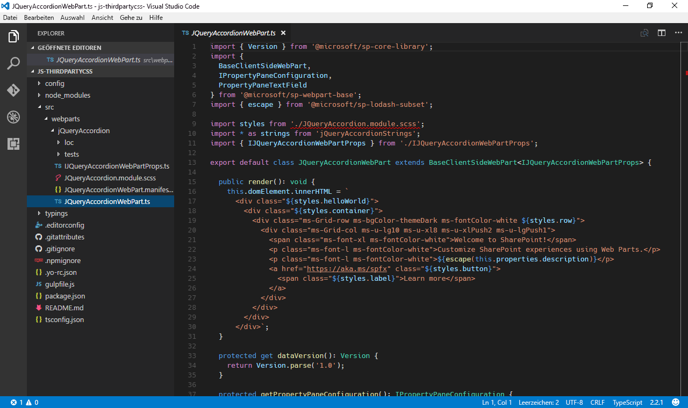
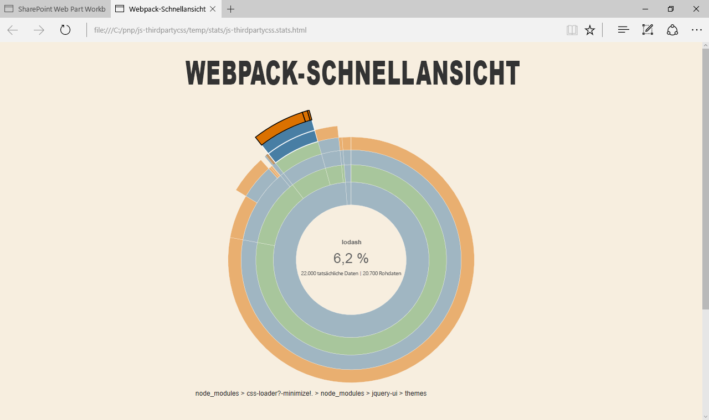

# <a name="reference-third-party-css-styles-in-sharepoint-framework-web-parts"></a><span data-ttu-id="0968a-102">Verweisen auf CSS-Formatvorlagen von Drittanbietern in SharePoint Framework-Webparts</span><span class="sxs-lookup"><span data-stu-id="0968a-102">Reference third-party CSS styles in SharePoint Framework web parts</span></span>

<span data-ttu-id="0968a-p101">Es gibt viele Bibliotheken von Drittanbietern, die Sie nutzen können, um vielfältige clientseitige SharePoint Framework-Webparts zu erstellen. Neben Skripts können diese Bibliotheken häufig zusätzliche Ressourcen wie Stylesheets enthalten. In diesem Artikel werden zwei verschiedene Ansätze zum Einschließen von CSS-Formatvorlagen von Drittanbietern in Webparts gezeigt und wie sich jeder Ansatz auf das resultierende Webpart-Bundle auswirkt. Bei dem in diesem Artikel erläuterten Beispiel werden zum Anzeigen eines Accordion jQuery und jQuery UI verwendet.</span><span class="sxs-lookup"><span data-stu-id="0968a-p101">There are many third-party libraries that you can leverage to build rich SharePoint Framework client-side web parts. In addition to scripts, these libraries often contain additional assets such as stylesheets. This article shows two different approaches to include third-party CSS styles in web parts and how each approach affects the resulting web part bundle. The example web part discussed in this article uses jQuery and jQuery UI to display an accordion.</span></span>


> <span data-ttu-id="0968a-108">**Hinweis:** Bevor Sie die Schritte in diesem Artikel ausführen, müssen Sie [die Entwicklungsumgebung für Ihr clientseitiges SharePoint-Webpart einrichten](../../set-up-your-development-environment.md).</span><span class="sxs-lookup"><span data-stu-id="0968a-108">**Note:** Before following the steps in this article, be sure to [set up your SharePoint client-side web part development environment](../../set-up-your-development-environment.md).</span></span>

## <a name="prepare-the-project"></a><span data-ttu-id="0968a-109">Vorbereiten des Projekts</span><span class="sxs-lookup"><span data-stu-id="0968a-109">Prepare the project</span></span>

### <a name="create-a-new-project"></a><span data-ttu-id="0968a-110">Erstellen eines neuen Projekts</span><span class="sxs-lookup"><span data-stu-id="0968a-110">Create a new project</span></span>

<span data-ttu-id="0968a-111">Erstellen Sie zunächst einen neuen Ordner für Ihr Projekt.</span><span class="sxs-lookup"><span data-stu-id="0968a-111">Start by creating a new folder for your project.</span></span>

```sh
md js-thirdpartycss
```

<span data-ttu-id="0968a-112">Wechseln Sie zum Projektordner.</span><span class="sxs-lookup"><span data-stu-id="0968a-112">Go to the project folder.</span></span>

```sh
cd js-thirdpartycss
```

<span data-ttu-id="0968a-113">Führen Sie im Projektordner den SharePoint Framework-Yeoman-Generator aus, um ein Gerüst für ein neues SharePoint Framework-Projekt zu erstellen.</span><span class="sxs-lookup"><span data-stu-id="0968a-113">In the project folder run the SharePoint Framework Yeoman generator to scaffold a new SharePoint Framework project.</span></span>

```sh
yo @microsoft/sharepoint
```

<span data-ttu-id="0968a-114">Geben Sie die folgenden Werte ein, wenn Sie dazu aufgefordert werden:</span><span class="sxs-lookup"><span data-stu-id="0968a-114">When prompted, enter the following values:</span></span>

- <span data-ttu-id="0968a-115">**js-thirdpartycss** als Lösungsnamen</span><span class="sxs-lookup"><span data-stu-id="0968a-115">**js-thirdpartycss** as your solution name</span></span>
- <span data-ttu-id="0968a-116">**Use the current folder** als Speicherort für die Dateien</span><span class="sxs-lookup"><span data-stu-id="0968a-116">**Use the current folder** for the location to place the files</span></span>
- <span data-ttu-id="0968a-117">**No javaScript web framework** als Eintrittspunkt für die Webparterstellung</span><span class="sxs-lookup"><span data-stu-id="0968a-117">**no javaScript web framework** as the starting point to build the web part</span></span>
- <span data-ttu-id="0968a-118">**jQuery accordion** als Webpartname</span><span class="sxs-lookup"><span data-stu-id="0968a-118">**jQuery accordion** as your web part name</span></span>
- <span data-ttu-id="0968a-119">**Shows jQuery accordion** als Webpartbeschreibung</span><span class="sxs-lookup"><span data-stu-id="0968a-119">**Shows jQuery accordion** as your web part description</span></span>


<span data-ttu-id="0968a-121">Sobald das Gerüst abgeschlossen ist, sperren Sie die Version der Projektabhängigkeiten, indem Sie den folgenden Befehl ausführen:</span><span class="sxs-lookup"><span data-stu-id="0968a-121">Once the scaffolding completes, lock down the version of the project dependencies by running the following command:</span></span>

```sh
npm shrinkwrap
```

<span data-ttu-id="0968a-122">Öffnen Sie dann den Projektordner im Code-Editor.</span><span class="sxs-lookup"><span data-stu-id="0968a-122">Next, open your project folder in your code editor.</span></span> <span data-ttu-id="0968a-123">In diesem Artikel wird Visual Studio Code in den Schritten und Screenshots verwendet, Sie können jedoch einen beliebigen Editor verwenden.</span><span class="sxs-lookup"><span data-stu-id="0968a-123">Once the scaffolding completes, open your project folder in your code editor. This article uses Visual Studio Code in the steps and screenshots but you can use any editor you prefer.</span></span>



### <a name="add-test-content"></a><span data-ttu-id="0968a-125">Hinzufügen von Testinhalt</span><span class="sxs-lookup"><span data-stu-id="0968a-125">Add test content</span></span>

<span data-ttu-id="0968a-p103">Öffnen Sie im Code-Editor die Datei **./src/webparts/jQueryAccordion/JQueryAccordionWebPart.ts**. Ändern Sie die **render**-Methode in Folgendes:</span><span class="sxs-lookup"><span data-stu-id="0968a-p103">In the code editor open the **./src/webparts/jQueryAccordion/JQueryAccordionWebPart.ts** file. Change the **render** method to:</span></span>

```ts
export default class JQueryAccordionWebPart extends BaseClientSideWebPart<IJQueryAccordionWebPartProps> {
  // ...
  public render(): void {
    this.domElement.innerHTML = `
      <div>
        <div class="accordion">
          <h3>Information</h3>
          <div>
            <p>
            The Volcanoes, crags, and caves park is a scenic destination for
            many visitors each year. To ensure everyone has a good
            experience and to preserve the natural beauty, access is
            restricted based on a permit system.
            </p>
            <p>
            Activities include viewing active volcanoes, skiing on mountains,
            walking across lava fields, and caving (spelunking) in caves
            left behind by the lava.
            </p>
          </div>
          <h3>Snow permit</h3>
          <div>
            <p>
            The Northern region has snow in the mountains during winter.
            Purchase a snow permit for access to approved ski areas.
            </p>
          </div>
          <h3>Hiking permit</h3>
          <div>
            <p>
            The entire region has hiking trails for your enjoyment.
            Purchase a hiking permit for access to approved trails.
            </p>
          </div>
          <h3>Volcano access</h3>
          <div>
            <p>
            The volcanic region is beautiful but also dangerous. Each
            area may have restrictions based on wind and volcanic
            conditions. There are three type of permits based on activity.
            </p>
            <ul>
              <li>Volcano drive car pass</li>
              <li>Lava field access permit</li>
              <li>Caving permit</li>
            </ul>
          </div>
        </div>
      </div>`;

      ($('.accordion', this.domElement) as any).accordion();
  }
  // ...
}
```

<span data-ttu-id="0968a-p104">Wenn Sie das Projekt jetzt erstellen, wird eine Fehlermeldung angezeigt, die besagt, dass ** $ ** nicht definiert ist. Dies liegt daran, dass das Projekt auf jQuery verweist, ohne es vorher zu laden. Es gibt zwei Vorgehensweisen zum Laden der Bibliotheken. Keiner der beiden Ansätze hat Auswirkungen darauf, wie Sie die Skripts im Code verwenden.</span><span class="sxs-lookup"><span data-stu-id="0968a-p104">If you build the project now, you get an error stating that **$** is undefined. This is because the project refers to jQuery without loading it first. There are two approaches to loading the libraries. Neither approach impacts how you use the scripts in code.</span></span>

## <a name="approach-1-include-third-party-libraries-in-the-bundle"></a><span data-ttu-id="0968a-132">1. Ansatz: Einschließen von Drittanbieterbibliotheken in das Bundle</span><span class="sxs-lookup"><span data-stu-id="0968a-132">Approach 1: Include third-party libraries in the bundle</span></span>

<span data-ttu-id="0968a-p105">Die einfachste Möglichkeit zum Verweisen auf eine Drittanbieterbibliothek in SharePoint Framework-Projekten besteht darin, dies in das generierte Bundle einzuschließen. Die Bibliothek wird als Paket installiert; im Projekt wird darauf verwiesen. Wenn Sie das Projekt bündeln, nimmt Webpack den Verweis zu der Bibliothek auf und schließt ihn in das generierte Bundle ein.</span><span class="sxs-lookup"><span data-stu-id="0968a-p105">The easiest way to reference a third-party library in SharePoint Framework projects is to include it in the generated bundle. The library is installed as a package and referenced in the project. When bundling the project, Webpack will pick up the reference to the library and include it in the generated bundle.</span></span>

### <a name="install-libraries"></a><span data-ttu-id="0968a-136">Installieren von Bibliotheken</span><span class="sxs-lookup"><span data-stu-id="0968a-136">Install libraries</span></span>

<span data-ttu-id="0968a-137">Installieren Sie jQuery und jQuery UI, indem Sie den folgenden Befehl ausführen:</span><span class="sxs-lookup"><span data-stu-id="0968a-137">Install jQuery and jQuery UI by running the following command:</span></span>

```sh
npm install jquery jquery-ui --save
```

<span data-ttu-id="0968a-138">Da Sie Ihr Webpart in TypeScript erstellen, benötigen Sie auch TypeScript-Typisierungen für jQuery, die Sie durch Ausführen des folgenden Befehls installieren können:</span><span class="sxs-lookup"><span data-stu-id="0968a-138">Because you are building your web part in TypeScript you also need TypeScript typings for jQuery that you can install by running the following command:</span></span>

```sh
npm install @types/jquery --save
```

### <a name="reference-libraries-in-the-web-part"></a><span data-ttu-id="0968a-139">Verweisen auf Bibliotheken im Webpart</span><span class="sxs-lookup"><span data-stu-id="0968a-139">Reference libraries in the web part</span></span>

<span data-ttu-id="0968a-p106">Nach dem Installieren von Bibliotheken besteht der nächste Schritt darin, im Projekt auf diese zu verweisen. Öffnen Sie im Code-Editor die Datei **./src/webparts/jQueryAccordion/JQueryAccordionWebPart.ts**. Fügen Sie in oberen Abschnit direkt unterhalb der letzten **import**-Anweisung Verweise auf jQuery und jQuery UI hinzu.</span><span class="sxs-lookup"><span data-stu-id="0968a-p106">After installing libraries, the next step is to reference them in the project. In the code editor open the **./src/webparts/jQueryAccordion/JQueryAccordionWebPart.ts** file. In its top section, just below the last **import** statement, add references to jQuery and jQuery UI.</span></span>

```ts
import * as $ from 'jquery';
require('../../../node_modules/jquery-ui/ui/widgets/accordion');
```

<span data-ttu-id="0968a-p107">Da Sie die TypeScript-Typisierungen für das jQuery-Paket installiert haben, können Sie mithilfe einer **import**-Anweisung darauf verweisen. Das jQuery UI-Paket wird jedoch anders erstellt. Im Gegensatz dazu, wie viele Module strukturiert sind, gibt es keinen Haupteintrittspunkt mit einem Verweis auf alle Komponenten, die Sie verwenden können. Stattdessen verweisen Sie direkt auf die speziellen Komponenten, die Sie verwenden möchten. Der Einstiegspunkt dieser Komponente enthält alle Verweise auf Abhängigkeiten, die für die ordnungsgemäße Funktion erforderlich sind.</span><span class="sxs-lookup"><span data-stu-id="0968a-p107">Because you installed the TypeScript typings for the jQuery package, you can reference it using an **import** statement. However, the jQuery UI package is built differently. Unlike how many modules are structured, there is no main entry point with a reference to all components that you can use. Instead you refer directly to the specific component that you want to use. The entry point of that component contains all references to dependencies that it needs to work correctly.</span></span>

<span data-ttu-id="0968a-148">Stellen Sie sicher, dass das Projekt erstellt wird, indem Sie den folgenden Befehl ausführen:</span><span class="sxs-lookup"><span data-stu-id="0968a-148">Confirm that the project is building by running the following command:</span></span>

```sh
gulp serve
```

<span data-ttu-id="0968a-149">Nach dem Hinzufügen des Webparts zum Zeichenbereich sollten Sie das Accordion in Aktion sehen.</span><span class="sxs-lookup"><span data-stu-id="0968a-149">After adding the web part to the canvas you should see the accordion working.</span></span>


<span data-ttu-id="0968a-p108">An diesem Punkt haben Sie nur auf die jQuery UI-Skripts verwiesen, was erklärt, warum das Accordion keine Formatvorlagen aufweist. Als Nächstes fügen Sie die fehlenden CSS-Formatvorlagen hinzu, um das Accordion mit Formatvorlagen zu versehen.</span><span class="sxs-lookup"><span data-stu-id="0968a-p108">At this point you have referenced only the jQuery UI scripts which explains why the accordion is not styled. Next you will add the missing CSS stylesheets to brand the accordion.</span></span>

### <a name="reference-third-party-css-stylesheets-in-the-web-part"></a><span data-ttu-id="0968a-153">Verweisen auf Drittanbieter-CSS-Formatvorlagen im Webpart</span><span class="sxs-lookup"><span data-stu-id="0968a-153">Reference third-party CSS stylesheets in the web part</span></span>

<span data-ttu-id="0968a-p109">Das Hinzufügen von Verweisen auf CSS-Formatvorlagen von Drittanbietern, die Teil der in dem Projekt installierten Pakete sind, ist genauso einfach wie das Hinzufügen von Verweisen zu den Paketen selbst. Das SharePoint Framework bietet eine standardmäßige Unterstütztung für das Laden von CSS-Dateien über Webpack.</span><span class="sxs-lookup"><span data-stu-id="0968a-p109">Adding references to third-party CSS stylesheets that are a part of packages installed in the project is as simple as adding references to the packages themselves. The SharePoint Framework offers standard support for loading CSS files through Webpack.</span></span>

<span data-ttu-id="0968a-p110">Öffnen Sie im Code-Editor die Datei **./src/webparts/jQueryAccordion/JQueryAccordionWebPart.ts**. Fügen Sie direkt unterhalb der letzten **require**-Anweisung Verweise auf CSS-Dateien von jQuery UI-Accordion hinzu.</span><span class="sxs-lookup"><span data-stu-id="0968a-p110">In the code editor open the **./src/webparts/jQueryAccordion/JQueryAccordionWebPart.ts** file. Just below the last **require** statement, add references to jQuery UI accordion CSS files.</span></span>

```ts
require('../../../node_modules/jquery-ui/themes/base/core.css');
require('../../../node_modules/jquery-ui/themes/base/accordion.css');
require('../../../node_modules/jquery-ui/themes/base/theme.css');
```

<span data-ttu-id="0968a-p111">Das Verweisen auf CSS-Dateien, die Teil eines Pakets im Projekt sind, ist dem Hinzufügen von Verweisen auf JavaScript-Dateien ähnlich. Sie müssen lediglich den relativen Pfad zu der CSS-Datei angeben, die geladen werden sollen, einschließlich der **CSS**-Erweiterung. Beim Bündeln des Projekts verarbeitet Webpack diese Verweise und schließt die Dateien in das generierte Webpart-Bundle ein.</span><span class="sxs-lookup"><span data-stu-id="0968a-p111">Referencing CSS files that are part of a package in the project is similar to adding references to JavaScript files. All you need to do is specify the relative path to the CSS file that you want to load including the **.css** extension. When bundling the project, Webpack will process these references and include the files in the generated web part bundle.</span></span>

<span data-ttu-id="0968a-161">Stellen Sie sicher, dass das Projekt erstellt wird, indem Sie den folgenden Befehl ausführen:</span><span class="sxs-lookup"><span data-stu-id="0968a-161">Confirm that the project is building by running the following command:</span></span>

```sh
gulp serve
```

<span data-ttu-id="0968a-162">Das Accordion sollte korrekt angezeigt und mithilfe des standardmäßigen jQuery UI-Designs mit einem Branding versehen werden.</span><span class="sxs-lookup"><span data-stu-id="0968a-162">The accordion should be displayed correctly and branded using the standard jQuery UI theme.</span></span>


### <a name="analyze-the-contents-of-the-generated-web-part-bundle"></a><span data-ttu-id="0968a-164">Analysieren der Inhalte des generierten Webpart-Bundles</span><span class="sxs-lookup"><span data-stu-id="0968a-164">Analyze the contents of the generated web part bundle</span></span>

<span data-ttu-id="0968a-p112">Die einfachste Möglichkeit zum Verwenden von Drittanbieterbibliotheken und deren Ressourcen besteht darin, diese in das generierte Webpart-Bundle einzuschließen. Bei diesem Ansatz löst Webpack automatisch alle Abhängigkeiten zwischen den unterschiedlichen Bibliotheken auf, und es wird sichergestellt, dass alle Skripts in der korrekten Reihenfolge geladen werden. Der Nachteil dieses Ansatzes ist, dass alle Ressourcen, auf die verwiesen wird, bei jedem Webpart separat geladen werden. Wenn Sie also mehrere Webparts in Ihrem Projekt haben, die alle jQuery UI verwenden, lädt jedes Webpart seine eigene Kopie von jQuery UI, wodurch die Seite verlangsamt wird.</span><span class="sxs-lookup"><span data-stu-id="0968a-p112">The easiest way to use third-party libraries and their resources is by including them in the generated web part bundle. In this approach Webpack will automatically resolve all dependencies between the different libraries and will ensure that all scripts are loaded in the correct order. The downside of this approach is that all referenced resources are loaded separately with every web part. So if you have multiple web parts in your project, all using jQuery UI, each web part will load its own copy of jQuery UI and slow down the page.</span></span>

<span data-ttu-id="0968a-p113">Um den Einfluss der Bibliotheken auf die Größe des generierten Webpart-Bundles zu sehen, öffnen Sie nach dem Bündeln des Projekts die Datei **./temp/stats/js-thirdpartycss.stats.html** in einem Webbrowser. Bewegen Sie den Mauszeiger über das Diagramm. Sie werden sehen, dass die CSS-Dateien von jQuery UI, auf die von dem Webpart verwiesen wird, über 6 % der gesamten Webpart-Bundle-Größe ausmachen.</span><span class="sxs-lookup"><span data-stu-id="0968a-p113">To see the impact of the libraries on the size of the generated web part bundle, after bundling the project open the **./temp/stats/js-thirdpartycss.stats.html** file in the web browser. Move your mouse over the chart and you will see, for example, that the jQuery UI CSS files referenced by the web part make up over 6% of the total web part bundle size.</span></span>



<span data-ttu-id="0968a-p114">Wie im Haftungsausschluss unterhalb des Diagramms erwähnt, sind die Größen nur ein Anhaltspunkt, der die Größe der Debugversion des Bundles angibt. Die endgültige Produktversion des Bundles wäre erheblich kleiner. Es ist dennoch hilfreich, sich klarzumachen, aus welchen unterschiedlichen Teilen das Webpart-Bundle besteht und welche Größe diese im Vergleich zu anderen Elementen in dem Bundle aufweisen.</span><span class="sxs-lookup"><span data-stu-id="0968a-p114">As mentioned in the disclaimer below the chart, the sizes are indicative and reflect the size of the debug version of the bundle. The release version of the bundle would be significantly smaller. Still it's good to realize which different pieces compose the web part bundle and what's their relative size compared to other elements in the bundle.</span></span>

## <a name="approach-2-load-third-party-libraries-from-a-url"></a><span data-ttu-id="0968a-175">2. Ansatz: Laden von Drittanbieterbibliotheken von einer URL</span><span class="sxs-lookup"><span data-stu-id="0968a-175">Approach 2: Load third-party libraries from a URL</span></span>

<span data-ttu-id="0968a-p115">Eine andere Möglichkeit zum Verweisen auf Drittanbieterbibliotheken im SharePoint Framework besteht darin, von einer URL aus auf diese als öffentlicher CDN oder privat verwalteter Speicherort zu verweisen. Der größte Vorteil ist, dass beim Laden einer häufig verwendeten Bibliothek von einem öffentlichen Speicherort die Möglichkeit besteht, dass Benutzer diese spezielle Bibliothek möglicherweise schon auf ihren Computer heruntergeladen haben. In diesem Fall verwendet das SharePoint Framework die zwischengespeicherte Bibliothek erneut, sodass das Webpart schneller geladen wird.</span><span class="sxs-lookup"><span data-stu-id="0968a-p115">Another way to reference third-party libraries in the SharePoint Framework is by referencing them from a URL such as a public CDN or a privately managed location. The biggest benefit is that if you're loading a frequently used library from a public location, there is a chance that users might already have that particular library downloaded on their computer. In that case the SharePoint Framework will reuse the cached library loading your web part faster.</span></span>

<span data-ttu-id="0968a-p116">Auch wenn Sie kein öffentliches CDN zum Laden von Bibliotheken von einem zentralen Speicherort verwenden können, ist dies aus leistungstechnischer Sicht eine bewährte Option. Das Zeigen auf eine URL ermöglicht Benutzern, das Skript nur einmal herunterzuladen und es im gesamten Portal wiederzuverwenden, wodurch das Laden von Seiten erheblich beschleunigt und die Benutzerfreundlichkeit verbessert wird.</span><span class="sxs-lookup"><span data-stu-id="0968a-p116">Even if you cannot use a public CDN to load libraries from a central location it is a good practice from the performance point of view. Pointing to a URL allows your users to download the script only once and reuse it across the whole portal, significantly speeding up loading pages and improving the user experience.</span></span>

<span data-ttu-id="0968a-p117">Bedenken Sie beim Laden von Drittanbieterbibliotheken von öffentlichen URLs, dass die Verwendung dieser Bibliotheken mit einem Risiko einhergeht. Da Sie nicht den Hostingspeicherort eines bestimmten Skripts verwalten, können Sie sich über dessen Inhalt nicht sicher sein. Skripts, die vom SharePoint Framework geladen werden, werden unter dem Kontext des aktuellen Benutzers ausgeführt und können alle Aktionen ausführen, für die der Benutzer die entsprechende Berechtigung hat.  Außerdem funktioniert das Webpart nicht, wenn der Hostingspeicherort offline ist.</span><span class="sxs-lookup"><span data-stu-id="0968a-p117">When loading third-party libraries from public URLs keep in mind that there is a risk involved in using those libraries. Since you don't manage the hosting location of any particular script you can't be sure of its contents. Scripts loaded by the SharePoint Framework run under the context of the current user and are allowed to do whatever that user can do. Also, if the hosting location is offline, your web part won't work.</span></span>

### <a name="install-typings-for-libraries"></a><span data-ttu-id="0968a-185">Installieren von Typisierungen für Bibliotheken</span><span class="sxs-lookup"><span data-stu-id="0968a-185">Install typings for libraries</span></span>

<span data-ttu-id="0968a-p118">Wenn Sie von einer URL aus auf Drittanbieterbibliotheken verweisen, müssen Sie diese nicht als Pakete in Ihrem Projekt installieren. Sie müssen die entsprechenden TypeScript-Typisierungen installieren, wenn Sie während der Entwicklung von dem Vorteil der Typsicherheit profitieren möchten.</span><span class="sxs-lookup"><span data-stu-id="0968a-p118">When you reference third-party libraries from a URL, you don't need to install them as packages in your project. You do have to install their TypeScript typings if you want the benefit of type safety checks during development.</span></span>

<span data-ttu-id="0968a-188">Angenommen, Sie beginnen mit einem leeren Projekt, das Sie wie zuvor in diesem Artikel beschrieben erstellt haben: Installieren Sie TypeScript-Typisierungen für jQuery, indem Sie den folgenden Befehl ausführen:</span><span class="sxs-lookup"><span data-stu-id="0968a-188">Assuming you start with an empty project created as described previously in this article, install TypeScript typings for jQuery by running the following command:</span></span>

```sh
npm install @types/jquery --save
```

### <a name="specify-urls-of-libraries"></a><span data-ttu-id="0968a-189">Angeben der URLs von Bibliotheken</span><span class="sxs-lookup"><span data-stu-id="0968a-189">Specify URLs of libraries</span></span>

<span data-ttu-id="0968a-p119">Um Drittanbieterbibliotheken von einer URL zu laden, müssen Sie die URL angeben, an dem diese sich in der Konfiguration Ihres Projekts befinden. Öffnen Sie im Code-Editor die Datei **./config/config.json**. Fügen Sie im Abschnitt **externals** den folgenden JSON-Code hinzu:</span><span class="sxs-lookup"><span data-stu-id="0968a-p119">To load third-party libraries from a URL, you have to specify the URL where they are located in the configuration of your project. In the code editor open the **./config/config.json** file. In the **externals** section add the following JSON:</span></span>

```json
{
  //...
  "externals": {
    //...
    "jquery": "https://code.jquery.com/jquery-3.1.1.min.js",
    "jquery-ui": "https://code.jquery.com/ui/1.12.1/jquery-ui.min.js"
    //...
  }
  //...
}
```

### <a name="reference-libraries-from-the-url-in-the-web-part"></a><span data-ttu-id="0968a-193">Verweisen auf Bibliotheken von der URL im Webpart</span><span class="sxs-lookup"><span data-stu-id="0968a-193">Reference libraries from the URL in the web part</span></span>

<span data-ttu-id="0968a-p120">Nachdem Sie die URL angegeben haben, die das SharePoint Framework zum Laden von jQuery und jQuery UI verwenden soll, müssen Sie im Projekt auf diese verweisen. Öffnen Sie im Code-Editor die Datei **./src/webparts/jQueryAccordion/JQueryAccordionWebPart.ts**. Fügen Sie im oberen Abschnitt direkt unterhalb der letzten **import**-Anweisung de folgenden Verweise auf jQuery und jQuery UI hinzu.</span><span class="sxs-lookup"><span data-stu-id="0968a-p120">Having specified the URL that the SharePoint Framework should use to load jQuery and jQuery UI, the next step is to reference them in the project. In the code editor open the **./src/webparts/jQueryAccordion/JQueryAccordionWebPart.ts** file. In its top section, just below the last **import** statement, add the following references to jQuery and jQuery UI:</span></span>

```ts
import * as $ from 'jquery';
require('jquery-ui');
```

<span data-ttu-id="0968a-p121">Das Verweise auf die Bibliotheken von der URL aus ähnelt dem Verweisen auf beide Bibliotheken, als diese als Pakete in Ihrem Projekt installiert waren. Da die TypeScript-Typisierungen für jQuery installiert sind, kann mithilfe einer **import**-Anweisung darauf verwiesen werden. Für jQuery UI müssen Sie nur das Skript auf der Seite laden.</span><span class="sxs-lookup"><span data-stu-id="0968a-p121">Compared to how you were referencing both libraries when they were installed as packages in your project, referencing them from the URL is very similar. Because jQuery has its TypeScript typings installed it can be referenced using an **import** statement. For jQuery UI all you want is to load the script on the page.</span></span>

<span data-ttu-id="0968a-p122">Da Sie **jquery** und **jquery-ui** in der Projektkonfiguration als externe Ressourcen registriert haben, verwendet das SharePoint Framework beim Verweisen auf eine dieser Bibliotheken die angegebenen URLs, um diese zur Laufzeit zu laden. Beim Bündeln des Projekts werden diese Ressourcen als extern markiert und daher aus dem Bundle ausgeschlossen.</span><span class="sxs-lookup"><span data-stu-id="0968a-p122">Because you registered **jquery** and **jquery-ui** in the project configuration as external resources, when you reference any of these libraries, the SharePoint Framework will use the specified URLs to load them at runtime. When bundling the project, these resources will be marked as externals and will therefore be excluded from the bundle.</span></span>

<span data-ttu-id="0968a-202">Ein Unterschied, der zu bedenken ist, besteht darin, dass Sie bisher jQuery UI angegeben haben, um das Accordion aus dem jQuery UI-Paket zu laden. Nun verweisen Sie jedoch von dem CDN, das alle jQuery UI-Komponenten enthält, auf jQuery.</span><span class="sxs-lookup"><span data-stu-id="0968a-202">One difference to keep in mind is that previously you specified to load the accordion from the jQuery UI package, but now you're referring to jQuery UI from the CDN which contains all jQuery UI components.</span></span>

<span data-ttu-id="0968a-203">Stellen Sie sicher, dass das Projekt erstellt wird, indem Sie den folgenden Befehl ausführen:</span><span class="sxs-lookup"><span data-stu-id="0968a-203">Confirm that the project is building by running the following command:</span></span>

```sh
gulp serve
```

<span data-ttu-id="0968a-204">Nach dem Hinzufügen des Webparts zum Zeichenbereich sollten Sie das Accordion in Aktion sehen.</span><span class="sxs-lookup"><span data-stu-id="0968a-204">After adding the web part to the canvas you should see the accordion working.</span></span>


<span data-ttu-id="0968a-p123">Öffnen Sie in Ihrem Webbrowser die Entwicklertools, wechseln Sie zu der Registerkarte, auf der die Netzwerkanfragen angezeigt werden, und laden Sie die Seite erneut. Sie werden sehen, dass sowohl jQuery als auch jQuery UI aus dem CDN geladen werden.</span><span class="sxs-lookup"><span data-stu-id="0968a-p123">In your web browser, open the developer tools, switch to the tab showing the network requests, and reload the page. You should see how both jQuery and jQuery UI are loaded from the CDN.</span></span>


<span data-ttu-id="0968a-p124">An diesem Punkt haben Sie nur auf die jQuery UI-Skripts verwiesen, was erklärt, warum das Accordion keine Formatvorlagen aufweist. Als Nächstes fügen Sie die fehlenden CSS-Formatvorlagen hinzu, um das Accordion mit Formatvorlagen zu versehen.</span><span class="sxs-lookup"><span data-stu-id="0968a-p124">At this point you have referenced only the jQuery UI scripts which explains why the accordion is not styled. Next you will add the missing CSS stylesheets to brand the accordion.</span></span>

### <a name="reference-third-party-css-stylesheets-from-url-in-the-web-part"></a><span data-ttu-id="0968a-211">Verweisen auf CSS-Formatvorlagen von Drittanbietern von der URL im Webpart</span><span class="sxs-lookup"><span data-stu-id="0968a-211">Reference third-party CSS stylesheets from URL in the web part</span></span>

<span data-ttu-id="0968a-p125">Das Hinzufügen von Verweisen auf CSS-Formatvorlagen von Drittanbietern von einer URL unterscheidet sich vom Verweisen auf Ressourcen von Projektpaketen. In der Projektkonfiguration in der Datei **config.json** können Sie zwar externe Ressourcen angeben, dies gilt aber nur für Skripts. Um auf CSS-Formatvorlagen von einer URL aus zu verweisen, müssen Sie stattdessen den **SPComponentLoader** verwenden.</span><span class="sxs-lookup"><span data-stu-id="0968a-p125">Adding references to third-party CSS stylesheets from a URL is different than referencing resources from project packages. While the project configuration in the **config.json** file allows you to specify external resources, it applies only to scripts. To reference CSS stylesheets from a URL you have to use the **SPComponentLoader** instead.</span></span>

#### <a name="load-css-from-the-url-using-the-spcomponentloader"></a><span data-ttu-id="0968a-215">Laden von CSS von der URL mithilfe von SPComponentLoader</span><span class="sxs-lookup"><span data-stu-id="0968a-215">Load CSS from the URL using the SPComponentLoader</span></span>

<span data-ttu-id="0968a-p126">Öffnen Sie im Code-Editor die Datei **./src/webparts/jQueryAccordion/JQueryAccordionWebPart.ts**. Fügen Sie im oberen Bereich der Datei direkt nach der letzten**import**-Anweisung den folgenden Code hinzu:</span><span class="sxs-lookup"><span data-stu-id="0968a-p126">In the code editor open the **./src/webparts/jQueryAccordion/JQueryAccordionWebPart.ts** file. In the top section of the file, just after the last **import** statement, add the following code:</span></span>

```ts
import { SPComponentLoader } from '@microsoft/sp-loader';
```

<span data-ttu-id="0968a-218">Überschreiben Sie die Methode onInit() in derselben Datei wie folgt:</span><span class="sxs-lookup"><span data-stu-id="0968a-218">In the same file override the onInit() method as follows:</span></span>

```ts
export default class JQueryAccordionWebPart extends BaseClientSideWebPart<IJQueryAccordionWebPartProps> {
  protected onInit(): Promise<void> {
    SPComponentLoader.loadCss('https://code.jquery.com/ui/1.12.1/themes/base/jquery-ui.min.css');
    return super.onInit();
  }

  // ...
}
```

<span data-ttu-id="0968a-p127">Wenn das Webpart auf der Seite instanziiert wird, wird die jQuery UI-CSS von der angegebenen URL geladen. Diese CSS-Formatvorlage ist die kombinierte und optimierte Version der jQuery UI-CSS, die die grundlegenden Formatvorlagen, Designs und Stile für alle Komponenten enthält.</span><span class="sxs-lookup"><span data-stu-id="0968a-p127">When the web part is instantiated on the page, it will load the jQuery UI CSS from the specified URL. This CSS stylesheet is the combined and optimized version of the jQuery UI CSS that contains the basic styles, theme, and styling for all components.</span></span>

<span data-ttu-id="0968a-221">Stellen Sie sicher, dass das Projekt erstellt wird, indem Sie den folgenden Befehl ausführen:</span><span class="sxs-lookup"><span data-stu-id="0968a-221">Confirm that the project is building by running the following command:</span></span>

```sh
gulp serve
```

<span data-ttu-id="0968a-222">Das Accordion sollte korrekt angezeigt und mithilfe des standardmäßigen jQuery UI-Designs mit einem Branding versehen werden.</span><span class="sxs-lookup"><span data-stu-id="0968a-222">The accordion should be displayed correctly and branded using the standard jQuery UI Theme.</span></span>


### <a name="analyze-the-contents-of-the-generated-web-part-bundle-loading-resources-from-url"></a><span data-ttu-id="0968a-224">Analysieren der Inhalte des generierten Webpart-Bundles, das Ressourcen von der URL lädt</span><span class="sxs-lookup"><span data-stu-id="0968a-224">Analyze the contents of the generated web part bundle loading resources from URL</span></span>

<span data-ttu-id="0968a-p128">Öffnen Sie nach dem Erstellen des Projekts in einem Webbrowser die Datei **./temp/stats/js-thirdpartycss.stats.html**. Beachten Sie, dass das Bundle insgesamt wesentlich kleiner ist (7 KB verglichen mit über 300 KB, wenn jQuery und jQuery UI in das Bundle eingeschlossen werden) und dass jQuery und jQuery UI nicht in dem Diagramm aufgeführt sind, weil sie zur Laufzeit geladen werden.</span><span class="sxs-lookup"><span data-stu-id="0968a-p128">After building the project in the web browser open the **./temp/stats/js-thirdpartycss.stats.html** file. Notice how the overall bundle is significantly smaller (7KB compared to over 300KB when including jQuery and jQuery UI in the bundle) and how jQuery and jQuery UI are not listed in the chart since they are loaded at runtime.</span></span>
