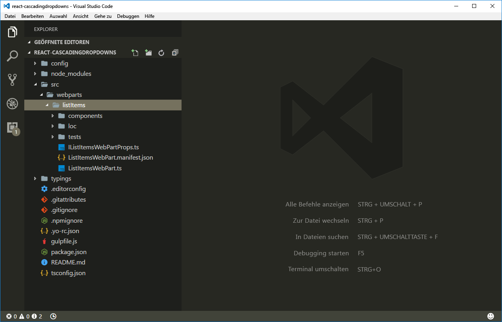

# <a name="use-cascading-dropdowns-in-web-part-properties"></a><span data-ttu-id="c8e1a-102">Verwenden von kaskadierenden Dropdowns in Webparteigenschaften</span><span class="sxs-lookup"><span data-stu-id="c8e1a-102">Use cascading dropdowns in web part properties</span></span>

<span data-ttu-id="c8e1a-p101">Beim Entwerfen des Eigenschaftenbereichs für Ihre clientseitigen SharePoint-Webparts gibt es vielleicht eine Webparteigenschaft, deren Optionen basierend auf dem in einer anderen Eigenschaft ausgewählten Wert angezeigt werden. Dieses Szenario tritt in der Regel bei der Implementierung von kaskadierenden Dropdownsteuerelementen auf. In diesem Artikel erfahren Sie, wie kaskadierende Dropdownsteuerelemente im Webpart-Eigenschaftenbereich erstellt werden, ohne ein benutzerdefiniertes Steuerelement für den Eigenschaftenbereich zu entwickeln.</span><span class="sxs-lookup"><span data-stu-id="c8e1a-p101">When designing the property pane for your SharePoint client-side web parts, you may have one web part property that displays its options based on the  value selected in another property. This scenario typically occurs when implementing cascading dropdown controls. In this article, you will learn how to create cascading dropdown controls in the web part property pane without developing a custom property pane control.</span></span>


<span data-ttu-id="c8e1a-107">Der Quellcode des Webparts, mit dem wir arbeiten, steht auf GitHub zur Verfügung, unter [https://github.com/SharePoint/sp-dev-fx-webparts/tree/master/samples/react-custompropertypanecontrols](https://github.com/SharePoint/sp-dev-fx-webparts/tree/master/samples/react-custompropertypanecontrols).</span><span class="sxs-lookup"><span data-stu-id="c8e1a-107">The source of the working web part is available on GitHub at [https://github.com/SharePoint/sp-dev-fx-webparts/tree/master/samples/react-custompropertypanecontrols](https://github.com/SharePoint/sp-dev-fx-webparts/tree/master/samples/react-custompropertypanecontrols).</span></span>

> <span data-ttu-id="c8e1a-108">**Hinweis:** Bevor Sie die Schritte in diesem Artikel ausführen, müssen Sie [die Entwicklungsumgebung für Ihr clientseitiges SharePoint-Webpart einrichten](../../set-up-your-development-environment.md).</span><span class="sxs-lookup"><span data-stu-id="c8e1a-108">**Note:** Before following the steps in this article, be sure to [set up your SharePoint client-side web part development environment](../../set-up-your-development-environment.md).</span></span>

## <a name="create-new-project"></a><span data-ttu-id="c8e1a-109">Erstellen eines neuen Projekts</span><span class="sxs-lookup"><span data-stu-id="c8e1a-109">Create new project</span></span>

<span data-ttu-id="c8e1a-110">Erstellen Sie zunächst einen neuen Ordner für Ihr Projekt.</span><span class="sxs-lookup"><span data-stu-id="c8e1a-110">Start by creating a new folder for your project.</span></span>

```sh
md react-cascadingdropdowns
```

<span data-ttu-id="c8e1a-111">Wechseln Sie zum Projektordner.</span><span class="sxs-lookup"><span data-stu-id="c8e1a-111">Go to the project folder.</span></span>

```sh
cd react-cascadingdropdowns
```

<span data-ttu-id="c8e1a-112">Führen Sie im Projektordner den SharePoint Framework-Yeoman-Generator aus, um ein Gerüst für ein neues SharePoint Framework-Projekt zu erstellen.</span><span class="sxs-lookup"><span data-stu-id="c8e1a-112">In the project folder run the SharePoint Framework Yeoman generator to scaffold a new SharePoint Framework project.</span></span>

```sh
yo @microsoft/sharepoint
```

<span data-ttu-id="c8e1a-113">Geben Sie die folgenden Werte ein, wenn Sie dazu aufgefordert werden:</span><span class="sxs-lookup"><span data-stu-id="c8e1a-113">When prompted, enter the following values:</span></span>

- <span data-ttu-id="c8e1a-114">**react-cascadingdropdowns** als Lösungsname</span><span class="sxs-lookup"><span data-stu-id="c8e1a-114">**react-cascadingdropdowns** as your solution name</span></span>
- <span data-ttu-id="c8e1a-115">**Aktuellen Ordner verwenden** als Speicherort für die Dateien</span><span class="sxs-lookup"><span data-stu-id="c8e1a-115">**Use the current folder** for the location to place the files</span></span>
- <span data-ttu-id="c8e1a-116">**React** als Eintrittspunkt für die Webpart-Erstellung</span><span class="sxs-lookup"><span data-stu-id="c8e1a-116">**React** as the starting point to build the web part</span></span>
- <span data-ttu-id="c8e1a-117">**Listenelemente** als Namen des Webparts</span><span class="sxs-lookup"><span data-stu-id="c8e1a-117">**List items** as your web part name</span></span>
- <span data-ttu-id="c8e1a-118">**Zeigt Listenelemente aus der ausgewählten Liste an** als Beschreibung Ihres Webparts</span><span class="sxs-lookup"><span data-stu-id="c8e1a-118">**Shows list items from the selected list** as your web part description</span></span>


<span data-ttu-id="c8e1a-120">Sobald das Gerüst abgeschlossen ist, sperren Sie die Version der Projektabhängigkeiten, indem Sie den folgenden Befehl ausführen:</span><span class="sxs-lookup"><span data-stu-id="c8e1a-120">Once the scaffolding completes, lock down the version of the project dependencies by running the following command:</span></span>

```sh
npm shrinkwrap
```

<span data-ttu-id="c8e1a-121">Öffnen Sie dann den Projektordner im Code-Editor.</span><span class="sxs-lookup"><span data-stu-id="c8e1a-121">Next, open your project folder in your code editor.</span></span> <span data-ttu-id="c8e1a-122">In diesem Artikel wird Visual Studio Code in den Schritten und Screenshots verwendet, Sie können jedoch einen beliebigen Editor verwenden.</span><span class="sxs-lookup"><span data-stu-id="c8e1a-122">Once the scaffolding completes, open your project folder in your code editor. This article uses Visual Studio Code in the steps and screenshots but you can use any editor you prefer.</span></span>



## <a name="define-a-web-part-property-to-store-the-selected-list"></a><span data-ttu-id="c8e1a-124">Definieren einer Webparteigenschaft zum Speichern der ausgewählten Liste</span><span class="sxs-lookup"><span data-stu-id="c8e1a-124">Define a web part property to store the selected list</span></span>

<span data-ttu-id="c8e1a-p103">Sie erstellen ein Webpart, in dem Listenelemente aus einer ausgewählten SharePoint-Liste angezeigt werden. Benutzer können eine Liste im Webpart-Eigenschaftenbereich auswählen. Erstellen Sie zum Speichern der ausgewählten Liste eine neue Webparteigenschaft namens **listName**.</span><span class="sxs-lookup"><span data-stu-id="c8e1a-p103">You will build a web part that displays list items from a selected SharePoint list. Users will be able to select a list in the web part property pane. To store the selected list create a new web part property named **listName**.</span></span>

<span data-ttu-id="c8e1a-p104">Öffnen Sie im Code-Editor die Datei **src/webparts/listItems/ListItemsWebPartManifest.json** Ersetzen Sie die standardmäßige **description**-Eigenschaft durch eine neue Eigenschaft mit dem Namen `listName`.</span><span class="sxs-lookup"><span data-stu-id="c8e1a-p104">In the code editor, open the **src/webparts/listItems/ListItemsWebPartManifest.json** file. Replace the default **description** property with a new property named `listName`.</span></span>


<span data-ttu-id="c8e1a-131">Öffnen Sie als Nächstes die Datei **src/webparts/listItems/IListItemsWebPartProps.ts**, und ersetzen Sie ihren Inhalt durch Folgendes:</span><span class="sxs-lookup"><span data-stu-id="c8e1a-131">Next, open the **src/webparts/listItems/IListItemsWebPartProps.ts** file, and replace its contents with:</span></span>

```ts
export interface IListItemsWebPartProps {
  listName: string;
}
```

<span data-ttu-id="c8e1a-132">Ändern Sie in der Datei **src/webparts/listItems/ListItemsWebPart.ts** die **render**-Methode in:</span><span class="sxs-lookup"><span data-stu-id="c8e1a-132">In the **src/webparts/listItems/ListItemsWebPart.ts** file, change the **render** method to:</span></span>

```ts
export default class ListItemsWebPart extends BaseClientSideWebPart<IListItemsWebPartProps> {
  // ...
  public render(): void {
    const element: React.ReactElement<IListItemsProps> = React.createElement(ListItems, {
      listName: this.properties.listName
    });

    ReactDom.render(element, this.domElement);
  }
  // ...
}
```

<span data-ttu-id="c8e1a-133">Aktualisieren Sie den **propertyPaneSettings**-Getter auf Folgendes:</span><span class="sxs-lookup"><span data-stu-id="c8e1a-133">Update the **propertyPaneSettings** getter to:</span></span>

```ts
export default class ListItemsWebPart extends BaseClientSideWebPart<IListItemsWebPartProps> {
  // ...
  protected getPropertyPaneConfiguration(): IPropertyPaneConfiguration {
    return {
      pages: [
        {
          header: {
            description: strings.PropertyPaneDescription
          },
          groups: [
            {
              groupName: strings.BasicGroupName,
              groupFields: [
                PropertyPaneTextField('listName', {
                  label: strings.ListNameFieldLabel
                })
              ]
            }
          ]
        }
      ]
    };
  }
  // ...
}
```

<span data-ttu-id="c8e1a-134">Ändern Sie in der Datei **src/webparts/listItems/loc/mystrings.d.ts** die **IListItemsStrings**-Schnittstelle in Folgendes:</span><span class="sxs-lookup"><span data-stu-id="c8e1a-134">In the **src/webparts/listItems/loc/mystrings.d.ts** file, change the **IListItemsStrings** interface to:</span></span>

```ts
declare interface IListItemsStrings {
  PropertyPaneDescription: string;
  BasicGroupName: string;
  ListNameFieldLabel: string;
}
```

<span data-ttu-id="c8e1a-135">Fügen Sie in der Datei **src/webparts/listItems/loc/en-us.js** die fehlende Definition für die Zeichenfolge **ListNameFieldLabel** hinzu.</span><span class="sxs-lookup"><span data-stu-id="c8e1a-135">In the **src/webparts/listItems/loc/en-us.js** file, add the missing definition for the **ListNameFieldLabel** string.</span></span>

```js
define([], function() {
  return {
    "PropertyPaneDescription": "Description",
    "BasicGroupName": "Group Name",
    "ListNameFieldLabel": "List"
  }
});
```

<span data-ttu-id="c8e1a-136">Ändern Sie in der Datei **src/webparts/listItems/ListItemsWebPart.ts** den Inhalt der **render**-Methode in:</span><span class="sxs-lookup"><span data-stu-id="c8e1a-136">In the **src/webparts/listItems/components/ListItems.tsx** file, change the contents of the **render** method to:</span></span>

```tsx
export default class ListItems extends React.Component<IListItemsProps, {}> {
 public render(): JSX.Element {
    return (
        <div className={styles.listItems}>
        <div className={styles.container}>
          <div className={`ms-Grid-row ms-bgColor-themeDark ms-fontColor-white ${styles.row}`}>
            <div className="ms-Grid-col ms-u-lg10 ms-u-xl8 ms-u-xlPush2 ms-u-lgPush1">
              <span className="ms-font-xl ms-fontColor-white">Welcome to SharePoint!</span>
              <p className="ms-font-l ms-fontColor-white">Customize SharePoint experiences using Web Parts.</p>
              <p className="ms-font-l ms-fontColor-white">{escape(this.props.listName)}</p>
              <a href="https://aka.ms/spfx" className={styles.button}>
                <span className={styles.label}>Learn more</span>
              </a>
            </div>
          </div>
        </div>
      </div>
    );
  }
}
```
<span data-ttu-id="c8e1a-137">Ändern Sie in der Datei **src/webparts/listItems/components/IListItemsProps.ts** die **IListItemsProps**-Oberfläche in:</span><span class="sxs-lookup"><span data-stu-id="c8e1a-137">In the **src/webparts/listItems/components/IListItemsProps.ts** file, change the **IListItemsProps** interface to:</span></span>

```ts
export interface IListItemsProps {
  listName: string;
}
```

<span data-ttu-id="c8e1a-138">Führen Sie den folgenden Befehl aus, um sicherzustellen, dass das Projekt ausgeführt wird:</span><span class="sxs-lookup"><span data-stu-id="c8e1a-138">Run the following command to verify that the project is running:</span></span>

```sh
gulp serve
```

<span data-ttu-id="c8e1a-p105">Fügen Sie im Webbrowser das **Listenelement**-Webpart zum Zeichenbereich hinzu, und öffnen Sie die Eigenschaften. Überprüfen Sie, dass der für die **List**-Eigenschaft festgelegte Wert im Webparttext angezeigt wird.</span><span class="sxs-lookup"><span data-stu-id="c8e1a-p105">In the web browser, add the **List items** web part to the canvas and open its properties. Verify that the value set for the **List** property is displayed in the web part body.</span></span>


## <a name="populate-the-dropdown-with-sharepoint-lists-to-choose-from"></a><span data-ttu-id="c8e1a-142">Ausfüllen des Dropdowns mit SharePoint-Listen, aus denen eine Auswahl getroffen werden kann</span><span class="sxs-lookup"><span data-stu-id="c8e1a-142">Populate the dropdown with SharePoint lists to choose from</span></span>

<span data-ttu-id="c8e1a-p106">An diesem Punkt gibt ein Benutzer an, welche Liste das Webpart verwenden soll, indem der Listenname manuell eingegeben wird. Dies ist fehleranfällig, und im Idealfall sollten Benutzer eine der Listen auswählen, die in der aktuellen SharePoint-Website vorhanden sind.</span><span class="sxs-lookup"><span data-stu-id="c8e1a-p106">At this point, a user specifies which list the web part should use by manually entering the list name. This is error-prone and ideally you want users to choose one of the lists existing in the current SharePoint site.</span></span>

### <a name="use-dropdown-control-to-render-the-listname-property"></a><span data-ttu-id="c8e1a-145">Verwenden des Dropdown-Steuerelements zum Rendern der listName-Eigenschaft</span><span class="sxs-lookup"><span data-stu-id="c8e1a-145">Use dropdown control to render the listName property</span></span>

<span data-ttu-id="c8e1a-p107">Fügen Sie in der **ListItemsWebPart**-Klasse einen Verweis zu der **PropertyPaneDropdown**-Klasse im oberen Bereich des Webparts hinzu. Ersetzen Sie die Import-Klausel, die die **PropertyPaneTextField**-Klasse mit Folgendem lädt:</span><span class="sxs-lookup"><span data-stu-id="c8e1a-p107">In the **ListItemsWebPart** class add a reference to the **PropertyPaneDropdown** class in the top section of the web part. Replace the import clause that loads the **PropertyPaneTextField** class with:</span></span>

```ts
import {
  BaseClientSideWebPart,
  IPropertyPaneConfiguration,
  PropertyPaneTextField,
  PropertyPaneDropdown,
  IPropertyPaneDropdownOption
} from '@microsoft/sp-webpart-base';
```

<span data-ttu-id="c8e1a-148">Fügen Sie in der **ListItemsWebPart**-Klasse eine neue Variable mit dem Namen **lists** hinzu, um Informationen zu allen verfügbaren Listen in der aktuellen Website zu speichern.</span><span class="sxs-lookup"><span data-stu-id="c8e1a-148">In the **ListItemsWebPart** class, add a new variable named **lists** to store information about all available lists in the current site.</span></span>

```ts
export default class ListItemsWebPart extends BaseClientSideWebPart<IListItemsWebPartProps> {
  private lists: IPropertyPaneDropdownOption[];
  // ...
}
```

<span data-ttu-id="c8e1a-p108">Fügen Sie als Nächstes eine neue Klassenvariable mit dem Namen **listsDropdownDisabled** hinzu. Diese Variable bestimmt, ob das Listendropdown aktiviert ist oder nicht. Bis das Webpart die Informationen zu den verfügbaren Listen in der aktuellen Website abruft, sollte das Dropdown deaktiviert sein.</span><span class="sxs-lookup"><span data-stu-id="c8e1a-p108">Next, add a new class variable named **listsDropdownDisabled**. This variable determines whether the list dropdown is enabled or not. Until the web part retrieves the information about the lists available in the current site, the dropdown should be disabled.</span></span>

```ts
export default class ListItemsWebPart extends BaseClientSideWebPart<IListItemsWebPartProps> {
  // ...
  private listsDropdownDisabled: boolean = true;
  // ...
}
```

<span data-ttu-id="c8e1a-152">Ändern Sie den **propertyPaneSettings**-Getter im Dropdownsteuerelement, um die **listName**-Eigenschaft zu rendern.</span><span class="sxs-lookup"><span data-stu-id="c8e1a-152">Change the **propertyPaneSettings** getter to use the dropdown control to render the **listName** property.</span></span>

```ts
export default class ListItemsWebPart extends BaseClientSideWebPart<IListItemsWebPartProps> {
  // ...
  protected get propertyPaneSettings(): IPropertyPaneSettings {
    return {
      pages: [
        {
          header: {
            description: strings.PropertyPaneDescription
          },
          groups: [
            {
              groupName: strings.BasicGroupName,
              groupFields: [
                PropertyPaneDropdown('listName', {
                  label: strings.ListNameFieldLabel,
                  options: this.lists,
                  disabled: this.listsDropdownDisabled
                })
              ]
            }
          ]
        }
      ]
    };
  }
}
```

<span data-ttu-id="c8e1a-153">Führen Sie den folgenden Befehl aus, um sicherzustellen, dass er wie erwartet funktioniert:</span><span class="sxs-lookup"><span data-stu-id="c8e1a-153">Run the following command to verify that it's working as expected:</span></span>

```sh
gulp serve
```


### <a name="show-available-lists-in-the-list-dropdown"></a><span data-ttu-id="c8e1a-155">Anzeigen verfügbarer Listen im Listendropdown</span><span class="sxs-lookup"><span data-stu-id="c8e1a-155">Show available lists in the list dropdown</span></span>

<span data-ttu-id="c8e1a-p109">Bisher wurde das Dropdown-Steuerelement der **listName**-Eigenschaft mit der **lists**-Klasseneigenschaft verknüpft. Da Sie noch keine Werte darin geladen haben, bleibt das **List**-Dropdown im Webpart-Eigenschaftenbereich deaktiviert. In diesem Schritt erweitern Sie das Webpart so, dass die Informationen zu den verfügbaren Listen geladen werden.</span><span class="sxs-lookup"><span data-stu-id="c8e1a-p109">Previously, you associated the dropdown control of the **listName** property with the **lists** class property. Since you haven't loaded any values into it yet, the **List** dropdown in the web part property pane remains disabled. In this step, you will extend the web part to load the information about available lists.</span></span>

#### <a name="add-a-method-to-load-available-lists"></a><span data-ttu-id="c8e1a-159">Hinzufügen einer Methode zum Laden von verfügbaren Listen</span><span class="sxs-lookup"><span data-stu-id="c8e1a-159">Add a method to load available lists</span></span>

<span data-ttu-id="c8e1a-p110">Fügen Sie in der **ListItemsWebPart**-Klasse eine Methode zum Laden der verfügbaren Listen hinzu. In diesem Artikel verwenden Sie simulierte Daten, Sie können aber auch die SharePoint-REST-API aufrufen, um die Liste verfügbarer Listen aus dem aktuellen Web abzurufen. Um Ladeoptionen aus einem externen Dienst zu simulieren, verwendet die Methode eine Verzögerung von zwei Sekunden.</span><span class="sxs-lookup"><span data-stu-id="c8e1a-p110">In the **ListItemsWebPart** class, add a method to load available lists. In this article you will use mock data, but you could also call the SharePoint REST API to retrieve the list of available lists from the current web. To simulate loading options from an external service the method uses a two-second delay.</span></span>

```ts
export default class ListItemsWebPart extends BaseClientSideWebPart<IListItemsWebPartProps> {
  // ...
  private loadLists(): Promise<IPropertyPaneDropdownOption[]> {
    return new Promise<IPropertyPaneDropdownOption[]>((resolve: (options: IPropertyPaneDropdownOption[]) => void, reject: (error: any) => void) => {
      setTimeout((): void => {
        resolve([{
          key: 'sharedDocuments',
          text: 'Shared Documents'
        },
        {
          key: 'myDocuments',
          text: 'My Documents'
        }]);
      }, 2000);
    });
  }
}
```

#### <a name="load-information-about-available-lists-into-the-list-dropdown"></a><span data-ttu-id="c8e1a-163">Laden von Informationen zu verfügbaren Listen im Listendropdown</span><span class="sxs-lookup"><span data-stu-id="c8e1a-163">Load information about available lists into the list dropdown</span></span>

<span data-ttu-id="c8e1a-164">Überschreiben Sie in der **ListItemsWebPart**-Klasse die **onPropertyPaneConfigurationStart**-Methode mit dem folgenden Code:</span><span class="sxs-lookup"><span data-stu-id="c8e1a-164">In the **ListItemsWebPart** class, override the **onPropertyPaneConfigurationStart** method using the following code:</span></span>

```ts
export default class ListItemsWebPart extends BaseClientSideWebPart<IListItemsWebPartProps> {
  // ...
  protected onPropertyPaneConfigurationStart(): void {
    this.listsDropdownDisabled = !this.lists;

    if (this.lists) {
      return;
    }

    this.context.statusRenderer.displayLoadingIndicator(this.domElement, 'lists');

    this.loadLists()
      .then((listOptions: IPropertyPaneDropdownOption[]): void => {
        this.lists = listOptions;
        this.listsDropdownDisabled = false;
        this.context.propertyPane.refresh();
        this.context.statusRenderer.clearLoadingIndicator(this.domElement);
        this.render();
      });
  }
  // ...
}
```

<span data-ttu-id="c8e1a-p111">Die **onPropertyPaneConfigurationStart**-Methode wird vom SharePoint Framework aufgerufen, nachdem der Webpart-Eigenschaftenbereich des Webparts geöffnet wurde. Die Methode prüft zuerst, ob die Informationen zu den in der aktuellen Website verfügbaren Listen geladen wurden. Wenn die Listeninformationen geladen wurden, wird das Listendropdown aktiviert. Wenn die Informationen zu Listen noch nicht geladen wurden, wird die Ladeanzeige angezeigt, die den Benutzer darüber informiert, dass das Webpart gerade Informationen zu Listen lädt.</span><span class="sxs-lookup"><span data-stu-id="c8e1a-p111">The **onPropertyPaneConfigurationStart** method is called by the SharePoint Framework after the web part property pane for the web part has been opened. First, the method checks if the information about the lists available in the current site has been loaded. If the list information is loaded, then the list dropdown will be enabled. If the list information about lists has not been loaded yet, the loading indicator is displayed which informs the user that the web part is loading information about lists.</span></span>


<span data-ttu-id="c8e1a-p112">Nachdem die Informationen zu den verfügbaren Listen geladen wurden, weist die Methode die abgerufenen Daten der **lists**-Klassenvariablen zu, von der aus sie vom Listendropdown verwendet werden können. Als Nächstes wird das Dropdown aktiviert, sodass der Benutzer eine Liste auswählen kann. Durch Aufrufen von **this.context.propertyPane.refresh()** wird der Webpart-Eigenschaftenbereich aktualisiert und spiegelt die letzten Änderungen am Listendropdown wider. Nachdem Listeninformationen geladen wurden, wird die Ladeanzeige durch Aufrufen der **clearLoadingIndicator**-Methode entfernt. Da durch Aufrufen dieser Methode die Benutzeroberfläche des Webparts gelöscht wird, wird die **render**-Methode aufgerufen, um das erneute Rendern des Webparts zu erzwingen.</span><span class="sxs-lookup"><span data-stu-id="c8e1a-p112">After the information about available lists has been loaded the method assigns the retrieved data to the **lists** class variable, from which it can be used by the list dropdown. Next, the dropdown is enabled allowing the user to select a list. By calling  **this.context.propertyPane.refresh()** the web part property pane is refreshed and it reflects the latest changes to the list dropdown. Once list information is loaded, the loading indicator is removed by a call to the **clearLoadingIndicator** method. Since calling this method clears the web part user interface, the **render** method is called to force the web part to re-render.</span></span>

<span data-ttu-id="c8e1a-175">Überprüfen Sie mit dem folgenden Befehl, ob alles wie erwartet funktioniert:</span><span class="sxs-lookup"><span data-stu-id="c8e1a-175">Run the following command to confirm that everything is working as expected:</span></span>

```sh
gulp serve
```

<span data-ttu-id="c8e1a-176">Wenn Sie dem Zeichenbereich ein Webpart hinzufügen und seinen Eigenschaftenbereich öffnen, sollten Sie das Listendropdown mit den verfügbaren Listen sehen, aus denen der Benutzer eine Auswahl treffen kann.</span><span class="sxs-lookup"><span data-stu-id="c8e1a-176">When you add a web part to the canvas and open its property pane, you should see the lists dropdown filled with available lists for the user to choose from.</span></span>


## <a name="allow-users-to-select-an-item-from-the-selected-list"></a><span data-ttu-id="c8e1a-178">Ermöglichen, dass Benutzer ein Element aus der ausgewählten Listen auswählen können</span><span class="sxs-lookup"><span data-stu-id="c8e1a-178">Allow users to select an item from the selected list</span></span>

<span data-ttu-id="c8e1a-179">Beim Erstellen von Webparts müssen Sie Benutzern häufig ermöglichen, eine Option aus einer Reihe von Werten auszuwählen, die von einem zuvor ausgewählten Wert bestimmt werden, z. B. das Auswählen eines Landes/einer Region basierend auf dem ausgewählten Kontinent oder das Auswählen eines Listenelements aus einer ausgewählten Liste.</span><span class="sxs-lookup"><span data-stu-id="c8e1a-179">When building web parts you often need to allow users to choose an option from a set of values determined by a previously selected value, such as choosing a country/region based on the selected continent or choosing a list item from a selected list.</span></span> <span data-ttu-id="c8e1a-180">Diese Benutzeroberfläche wird häufig als kaskadierendes Dropdown bezeichnet.</span><span class="sxs-lookup"><span data-stu-id="c8e1a-180">This user experience is often referred to as cascading dropdowns.</span></span> <span data-ttu-id="c8e1a-181">Mithilfe der standardmäßigen Funktionen von clientseitigen SharePoint Framework-Webparts können Sie kaskadierende Dropdowns im Webpart-Eigenschaftenbereich erstellen.</span><span class="sxs-lookup"><span data-stu-id="c8e1a-181">Using the standard SharePoint Framework client-side web parts capabilities you can build cascading dropdowns in the web part property pane.</span></span> <span data-ttu-id="c8e1a-182">Um zu erfahren, wie dies funktioniert, erweitern Sie das zuvor erstellte Webpart mit der Funktion zum Auswählen eines Listenelements basierend auf der zuvor ausgewählten Liste.</span><span class="sxs-lookup"><span data-stu-id="c8e1a-182">To learn how to do it you will extend the previously built web part with the ability to choose a list item based on the previously selected list.</span></span>


### <a name="add-item-web-part-property"></a><span data-ttu-id="c8e1a-184">Hinzufügen der item-Webparteigenschaft</span><span class="sxs-lookup"><span data-stu-id="c8e1a-184">Add item web part property</span></span>

<span data-ttu-id="c8e1a-p114">Öffnen Sie im Code-Editor die Datei **src/webparts/listItems/ListItemsWebPart.manifest.json**. Fügen Sie im Abschnitt **properties** eine neue Eigenschaft mit dem Namen **itemName** hinzu, damit diese wie folgt angezeigt wird:</span><span class="sxs-lookup"><span data-stu-id="c8e1a-p114">In the code editor open the **src/webparts/listItems/ListItemsWebPart.manifest.json** file. To the **properties** section add a new property named **itemName** so that it appears as follows:</span></span>

```json
{
  // ...
  "properties": {
    "listName": "",
    "itemName": ""
  }
  // ...
}
```


<span data-ttu-id="c8e1a-188">Ändern Sie den Code in der Datei **src/webparts/listItems/IListItemsWebPartProps.ts** in Folgendes:</span><span class="sxs-lookup"><span data-stu-id="c8e1a-188">Change the code in the **src/webparts/listItems/IListItemsWebPartProps.ts** file to:</span></span>

```ts
export interface IListItemsWebPartProps {
  listName: string;
  itemName: string;
}
```

<span data-ttu-id="c8e1a-189">Ändern Sie den Code in der Datei **src/webparts/listItems/components/IListItemsProps.ts** in Folgendes:</span><span class="sxs-lookup"><span data-stu-id="c8e1a-189">Change the code in the **src/webparts/listItems/components/IListItemsProps.ts** file to:</span></span>

```ts
export interface IListItemsProps {
  listName: string;
  itemName: string;
}
```

<span data-ttu-id="c8e1a-190">Ändern Sie in der Datei **src/webparts/listItems/ListItemsWebPart.ts** den Code der **render**-Methode in:</span><span class="sxs-lookup"><span data-stu-id="c8e1a-190">In the **src/webparts/listItems/ListItemsWebPart.ts** file, change the code of the **render** method to:</span></span>

```ts
export default class ListItemsWebPart extends BaseClientSideWebPart<IListItemsWebPartProps> {
  // ...
  public render(): void {
    const element: React.ReactElement<IListItemsProps> = React.createElement(ListItems, {
      listName: this.properties.listName,
      itemName: this.properties.itemName
    });

    ReactDom.render(element, this.domElement);
  }
  // ...
}
```

<span data-ttu-id="c8e1a-191">Ändern Sie in der Datei **src/webparts/listItems/loc/mystrings.d.ts** die **IListItemsStrings**-Schnittstelle in Folgendes:</span><span class="sxs-lookup"><span data-stu-id="c8e1a-191">In the **src/webparts/listItems/loc/mystrings.d.ts** file, change the **IListItemsStrings** interface to:</span></span>

```ts
declare interface IListItemsStrings {
  PropertyPaneDescription: string;
  BasicGroupName: string;
  ListNameFieldLabel: string;
  ItemNameFieldLabel: string;
}
```

<span data-ttu-id="c8e1a-192">Fügen Sie in der Datei **src/webparts/listItems/loc/en-us.js** die fehlende Definition für die Zeichenfolge **ItemNameFieldLabel** hinzu.</span><span class="sxs-lookup"><span data-stu-id="c8e1a-192">In the **src/webparts/listItems/loc/en-us.js** file, add the missing definition for the **ItemNameFieldLabel** string.</span></span>

```js
define([], function() {
  return {
    "PropertyPaneDescription": "Description",
    "BasicGroupName": "Group Name",
    "ListNameFieldLabel": "List",
    "ItemNameFieldLabel": "Item"
  }
});
```

### <a name="render-the-value-of-the-item-web-part-property"></a><span data-ttu-id="c8e1a-193">Rendern des Werts der item-Webparteigenschaft</span><span class="sxs-lookup"><span data-stu-id="c8e1a-193">Render the value of the item web part property</span></span>

<span data-ttu-id="c8e1a-194">Ändern Sie in der Datei **src/webparts/listItems/components/ListItems.tsx** die **render**-Methode in:</span><span class="sxs-lookup"><span data-stu-id="c8e1a-194">In the **src/webparts/listItems/components/ListItems.tsx** file, change the **render** method to:</span></span>

```tsx
export default class ListItems extends React.Component<IListItemsProps, {}> {
  public render(): JSX.Element {
    return (
        <div className={styles.listItems}>
        <div className={styles.container}>
          <div className={`ms-Grid-row ms-bgColor-themeDark ms-fontColor-white ${styles.row}`}>
            <div className="ms-Grid-col ms-u-lg10 ms-u-xl8 ms-u-xlPush2 ms-u-lgPush1">
              <span className="ms-font-xl ms-fontColor-white">Welcome to SharePoint!</span>
              <p className="ms-font-l ms-fontColor-white">Customize SharePoint experiences using Web Parts.</p>
              <p className="ms-font-l ms-fontColor-white">{escape(this.props.listName)}</p>
              <p className="ms-font-l ms-fontColor-white">{escape(this.props.itemName)}</p>
              <a href="https://aka.ms/spfx" className={styles.button}>
                <span className={styles.label}>Learn more</span>
              </a>
            </div>
          </div>
        </div>
      </div>
    );
  }
}
```

### <a name="allow-users-to-choose-the-item-from-a-list"></a><span data-ttu-id="c8e1a-195">Ermöglichen, dass Benutzer das Element aus einer Liste auswählen</span><span class="sxs-lookup"><span data-stu-id="c8e1a-195">Allow users to choose the item from a list</span></span>

<span data-ttu-id="c8e1a-196">Ähnlich dazu, wie Benutzer eine Liste mithilfe eines Dropdowns auswählen können, sollten es möglich sein, dass sie das Element aus der Liste verfügbarer Elemente auswählen.</span><span class="sxs-lookup"><span data-stu-id="c8e1a-196">Similar to how users can select a list using a dropdown, they should be able to select the item from the list of available items.</span></span>

<span data-ttu-id="c8e1a-197">Fügen Sie in der **ListItemsWebPart**-Klasse eine neue Variable mit dem Namen **items** hinzu, um Informationen zu allen verfügbaren Elementen in der aktuellen ausgewählten Liste zu speichern.</span><span class="sxs-lookup"><span data-stu-id="c8e1a-197">In the **ListItemsWebPart** class, add a new variable named **items** which you will use to store information about all available items in the currently selected list.</span></span>

```ts
export default class ListItemsWebPart extends BaseClientSideWebPart<IListItemsWebPartProps> {
  // ...
  private items: IPropertyPaneDropdownOption[];
  // ...
}
```

<span data-ttu-id="c8e1a-p115">Fügen Sie als Nächstes eine neue Klassenvariable mit dem Namen **itemsDropdownDisabled** hinzu. Diese Variable bestimmt, ob das Elementdropdown aktiviert ist oder nicht. Benutzer sollten erst dann ein Element auswählen können, nachdem sie eine Liste ausgewählt haben.</span><span class="sxs-lookup"><span data-stu-id="c8e1a-p115">Next, add a new class variable named **itemsDropdownDisabled**. This variable determines whether the items dropdown should be enabled or not. Users should be able to select an item only after they selected a list.</span></span>

```ts
export default class ListItemsWebPart extends BaseClientSideWebPart<IListItemsWebPartProps> {
  // ...
  private itemsDropdownDisabled: boolean = true;
  // ...
}
```

<span data-ttu-id="c8e1a-201">Ändern Sie den **propertyPaneSettings**-Getter im Dropdown-Steuerelement, um die **itemName**-Eigenschaft zu rendern.</span><span class="sxs-lookup"><span data-stu-id="c8e1a-201">Change the **propertyPaneSettings** getter to use the dropdown control to render the **itemName** property.</span></span>

```ts
export default class ListItemsWebPart extends BaseClientSideWebPart<IListItemsWebPartProps> {
  // ...
  protected getPropertyPaneConfiguration(): IPropertyPaneConfiguration {
    return {
      pages: [
        {
          header: {
            description: strings.PropertyPaneDescription
          },
          groups: [
            {
              groupName: strings.BasicGroupName,
              groupFields: [
                PropertyPaneDropdown('listName', {
                  label: strings.ListNameFieldLabel,
                  options: this.lists,
                  disabled: this.listsDropdownDisabled
                }),
                PropertyPaneDropdown('itemName', {
                  label: strings.ItemNameFieldLabel,
                  options: this.items,
                  disabled: this.itemsDropdownDisabled
                })
              ]
            }
          ]
        }
      ]
    };
  }
}
```

<span data-ttu-id="c8e1a-202">Führen Sie den folgenden Befehl aus, um sicherzustellen, dass er wie erwartet funktioniert:</span><span class="sxs-lookup"><span data-stu-id="c8e1a-202">Run the following command to verify that it's working as expected:</span></span>

```sh
gulp serve
```


### <a name="show-items-available-in-the-selected-list-in-the-item-dropdown"></a><span data-ttu-id="c8e1a-204">Anzeigen von verfügbaren Elementen in der ausgewählten Liste im Elementdropdown</span><span class="sxs-lookup"><span data-stu-id="c8e1a-204">Show items available in the selected list in the item dropdown</span></span>

<span data-ttu-id="c8e1a-p116">Bisher haben Sie ein Dropdown-Steuerelement definiert, um die **itemName**-Eigenschaft im Webpart-Eigenschaftenbereich zu rendern. Als Nächstes erweitern Sie das Webpart so, dass die Informationen zu verfügbaren Elementen in der ausgewählten Liste sowie die Elemente im Elementdropdown angezeigt werden.</span><span class="sxs-lookup"><span data-stu-id="c8e1a-p116">Previously, you defined a dropdown control to render the **itemName** property in the web part property pane. Next, you will extend the web part to load the information about items available in the selected list and show the items in the item dropdown.</span></span>

#### <a name="add-method-to-load-list-items"></a><span data-ttu-id="c8e1a-207">Hinzufügen einer Methode zum Laden von Listenelementen</span><span class="sxs-lookup"><span data-stu-id="c8e1a-207">Add method to load list items</span></span>

<span data-ttu-id="c8e1a-p117">Fügen Sie in der Datei **src/webparts/listItems/ListItemsWebPart.ts** in der **ListItemsWebPart**-Klasse eine neue Methode zum Laden der verfügbaren Listenelemente aus der ausgewählten Liste hinzu. Wie auch bei der Methode zum Laden der verfügbaren Listen verwenden Sie auch hier simulierte Daten.</span><span class="sxs-lookup"><span data-stu-id="c8e1a-p117">In the **src/webparts/listItems/ListItemsWebPart.ts** file, in the **ListItemsWebPart** class add a new method to load available list items from the selected list. Like the method for loading available lists, you will use mock data.</span></span>

```ts
export default class ListItemsWebPart extends BaseClientSideWebPart<IListItemsWebPartProps> {
  // ...
  private loadItems(): Promise<IPropertyPaneDropdownOption[]> {
    if (!this.properties.listName) {
      // resolve to empty options since no list has been selected
      return Promise.resolve();
    }

    const wp: ListItemsWebPart = this;

    return new Promise<IPropertyPaneDropdownOption[]>((resolve: (options: IPropertyPaneDropdownOption[]) => void, reject: (error: any) => void) => {
      setTimeout(() => {
        const items = {
          sharedDocuments: [
            {
              key: 'spfx_presentation.pptx',
              text: 'SPFx for the masses'
            },
            {
              key: 'hello-world.spapp',
              text: 'hello-world.spapp'
            }
          ],
          myDocuments: [
            {
              key: 'isaiah_cv.docx',
              text: 'Isaiah CV'
            },
            {
              key: 'isaiah_expenses.xlsx',
              text: 'Isaiah Expenses'
            }
          ]
        };
        resolve(items[wp.properties.listName]);
      }, 2000);
    });
  }
}
```

<span data-ttu-id="c8e1a-p118">Die **loadItems**-Methode gibt simulierte Listenelemente für die zuvor ausgewählte Liste zurück. Wenn keine Liste ausgewählt wurde, löst die Methode die Zusage ohne Daten.</span><span class="sxs-lookup"><span data-stu-id="c8e1a-p118">The **loadItems** method returns mock list items for the previously selected list. When no list has been selected, the method resolves the promise without any data.</span></span>

#### <a name="load-information-about-available-items-into-the-item-dropdown"></a><span data-ttu-id="c8e1a-212">Laden von Informationen zu verfügbaren Elementen im Elementdropdown</span><span class="sxs-lookup"><span data-stu-id="c8e1a-212">Load information about available items into the item dropdown</span></span>

<span data-ttu-id="c8e1a-213">Erweitern Sie in der **ListItemsWebPart**-Klasse die **onPropertyPaneConfigurationStart**-Methode, um die Elemente für die ausgewählte Liste zu laden.</span><span class="sxs-lookup"><span data-stu-id="c8e1a-213">In the **ListItemsWebPart** class, extend the **onPropertyPaneConfigurationStart** method to load items for the selected list.</span></span>

```ts
export default class ListItemsWebPart extends BaseClientSideWebPart<IListItemsWebPartProps> {
  // ...
  protected onPropertyPaneConfigurationStart(): void {
    this.listsDropdownDisabled = !this.lists;
    this.itemsDropdownDisabled = !this.properties.listName || !this.items;

    if (this.lists) {
      return;
    }

    this.context.statusRenderer.displayLoadingIndicator(this.domElement, 'options');

    this.loadLists()
      .then((listOptions: IPropertyPaneDropdownOption[]): Promise<IPropertyPaneDropdownOption[]> => {
        this.lists = listOptions;
        this.listsDropdownDisabled = false;
        this.context.propertyPane.refresh();
        return this.loadItems();
      })
      .then((itemOptions: IPropertyPaneDropdownOption[]): void => {
        this.items = itemOptions;
        this.itemsDropdownDisabled = !this.properties.listName;
        this.context.propertyPane.refresh();
        this.context.statusRenderer.clearLoadingIndicator(this.domElement);
        this.render();
      });
  }
  // ...
}
```

<span data-ttu-id="c8e1a-p119">Bei der Initialisierung bestimmt das Webpart zuerst, ob das Elementdropdown aktiviert werden soll oder nicht. Wenn der Benutzer zuvor eine Liste ausgewählt hat, kann er nun ein Element aus dieser Liste auswählen. Wenn keine Liste ausgewählt wurde, ist das Elementdropdown deaktiviert.</span><span class="sxs-lookup"><span data-stu-id="c8e1a-p119">When initializing, the web part will first determine if the items dropdown should be enabled or not. If the user previously selected a list, they can select an item from that list. If no list was selected, then the item dropdown is disabled.</span></span>

<span data-ttu-id="c8e1a-p120">Sie haben den zuvor definierten Code erweitert, der die Informationen zu verfügbaren Listen lädt, um die Informationen zu verfügbaren Elementen in der ausgewählten Liste zu laden. Der Code weist dann die abgerufenen Informationen der **items**-Klassenvariablen zur Verwendung vom Elementdropdown zu Schließlich löscht der Code die Ladeanzeige, und der Benutzer kann beginnen, mit dem Webpart zu arbeiten.</span><span class="sxs-lookup"><span data-stu-id="c8e1a-p120">You extended the previously defined code, which loads the information about available lists, to load the information about items available in the selected list. The code then assigns the retrieved information to the **items** class variable for use by the item dropdown. Finally, the code clears the loading indicator and allows the user to start working with the web part.</span></span>

<span data-ttu-id="c8e1a-220">Überprüfen Sie mit dem folgenden Befehl, ob alles wie erwartet funktioniert:</span><span class="sxs-lookup"><span data-stu-id="c8e1a-220">Run the following command to confirm that everything is working as expected:</span></span>

```sh
gulp serve
```

<span data-ttu-id="c8e1a-p121">Das Elementdropdown ist, wie erforderlich, anfänglich deaktiviert, sodass Benutzer zuerst eine Liste auswählen müssen. Doch an diesem Punkt bleibt das Elementdropdown auch nach dem Auswählen einer Liste deaktiviert.</span><span class="sxs-lookup"><span data-stu-id="c8e1a-p121">As required, initially the item dropdown is disabled, requiring users to select a list first. But at this point, even after a list has been selected, the item dropdown remains disabled.</span></span>


#### <a name="update-web-part-property-pane-after-selecting-a-list"></a><span data-ttu-id="c8e1a-224">Aktualisieren des Webpart-Eigenschaftenbereichs nach dem Auswählen einer Liste</span><span class="sxs-lookup"><span data-stu-id="c8e1a-224">Update web part property pane after selecting a list</span></span>

<span data-ttu-id="c8e1a-225">Wenn ein Benutzer eine Liste im Eigenschaftenbereich auswählt, sollte das Webpart entsprechend aktualisiert werden, sodass das Elementdropdown aktiviert wird und die Liste von verfügbaren Elementen in der ausgewählten Liste angezeigt werden.</span><span class="sxs-lookup"><span data-stu-id="c8e1a-225">When a user selects a list in the property pane, the web part should update, enabling the item dropdown and showing the list of items available in the selected list.</span></span>

<span data-ttu-id="c8e1a-226">Überschreiben Sie in der **ListItemsWebPart.ts**-Datei in der **ListItemsWebPart**-Klasse die **onPropertyPaneFieldChanged**-Methode mit dem folgenden Code:</span><span class="sxs-lookup"><span data-stu-id="c8e1a-226">In the **ListItemsWebPart.ts** file, in the **ListItemsWebPart** class override the **onPropertyPaneFieldChanged** method with the following code:</span></span>

```ts
export default class ListItemsWebPart extends BaseClientSideWebPart<IListItemsWebPartProps> {
  // ...
  protected onPropertyPaneFieldChanged(propertyPath: string, oldValue: any, newValue: any): void {
    if (propertyPath === 'listName' &&
        newValue) {
      // push new list value
      super.onPropertyPaneFieldChanged(propertyPath, oldValue, newValue);
      // get previously selected item
      const previousItem: string = this.properties.itemName;
      // reset selected item
      this.properties.itemName = undefined;
      // push new item value
      this.onPropertyPaneFieldChanged('itemName', previousItem, this.properties.itemName);
      // disable item selector until new items are loaded
      this.itemsDropdownDisabled = true;
      // refresh the item selector control by repainting the property pane
      this.context.propertyPane.refresh();
      // communicate loading items
      this.context.statusRenderer.displayLoadingIndicator(this.domElement, 'items');

      this.loadItems()
        .then((itemOptions: IPropertyPaneDropdownOption[]): void => {
          // store items
          this.items = itemOptions;
          // enable item selector
          this.itemsDropdownDisabled = false;
          // clear status indicator
          this.context.statusRenderer.clearLoadingIndicator(this.domElement);
          // re-render the web part as clearing the loading indicator removes the web part body
          this.render();
          // refresh the item selector control by repainting the property pane
          this.context.propertyPane.refresh();
        });
    }
    else {
      super.onPropertyPaneFieldChanged(propertyPath, oldValue, newValue);
    }
  }
  // ...
}
```

<span data-ttu-id="c8e1a-p122">Nachdem der Benutzer eine Liste ausgewählt hat, wird der neu ausgewählte Wert im Webpart gespeichert. Da sich die ausgewählte Liste geändert hat, wird das zuvor ausgewählte Listenelement zurückgesetzt. Da nun eine Liste ausgewählt ist, werden im Webpart-Eigenschaftenbereich Listenelemente für diese spezielle Liste geladen. Beim Laden von Elementen sollte der Benutzer kein Element auswählen können.</span><span class="sxs-lookup"><span data-stu-id="c8e1a-p122">After the user selected a list, the web part persists the newly selected value. Because the selected list changed, the web part resets the previously selected list item. Now that a list is selected, the web part property pane loads list items for that particular list. While loading items, the user shouldn't be able to select an item.</span></span>

<span data-ttu-id="c8e1a-p123">Nachdem die Elemente für die ausgewählte Liste geladen wurden, werden sie der **items**-Klassenvariablen zugewiesen, von wo aus vom Elementdropwon auf sie verwiesen werden kann. Da nun die Informationen zu verfügbaren Listenelementen verfügbar sind, wird das Elementdropdown aktiviert, sodass Benutzer ein Element auswählen können. Die Ladeanzeige wird entfernt. Dadurch wird der Webparttext gelöscht. Dies ist der Grund, warum das Webpart erneut gerendert werden muss. Schließlich wird der Webpart-Eigenschaftenbereich so aktualisiert, dass die letzten Änderungen sichtbar sind.</span><span class="sxs-lookup"><span data-stu-id="c8e1a-p123">Once the items for the selected list are loaded they are assigned to the **items** class variable from where they can be referenced by the item dropdown. Now that the information about available list items is available, the item dropdown is enabled allowing users to choose an item. The loading indicator is removed which clears the web part body which is why the web part should re-render. Finally the web part property pane refreshes to reflect the latest changes.</span></span>

> <span data-ttu-id="c8e1a-p124">**Hinweis:** Ab Drop 6 des SharePoint Frameworks gibt es einen Fehler in der React-Dropdownkomponente der Office UI Fabric, der dazu führt, dass das Dropdownsteuerelement nicht ordnungsgemäß funktioniert. Eine temporäre Problemumgehung besteht darin, die Datei **node_modules/@microsoft/office-ui-fabric-react-bundle/dist/office-ui-fabric-react.bundle.js** zu bearbeiten und die Zeile **12027** von:</span><span class="sxs-lookup"><span data-stu-id="c8e1a-p124">**Note:** In drop 6 of the SharePoint Framework there is a bug in the Office UI Fabric React Dropdown component that causes the dropdown control to work incorrectly. A temporary workaround is to edit the **node_modules/@microsoft/office-ui-fabric-react-bundle/dist/office-ui-fabric-react.bundle.js** file and change line **12027** from:</span></span>
> 
> ```js
> isDisabled: this.props.isDisabled !== undefined ? this.props.isDisabled : this.props.disabled
> ```
>
> <span data-ttu-id="c8e1a-237">in:</span><span class="sxs-lookup"><span data-stu-id="c8e1a-237">to:</span></span>
> 
> ```js
> isDisabled: newProps.isDisabled !== undefined ? newProps.isDisabled : newProps.disabled
> ```


