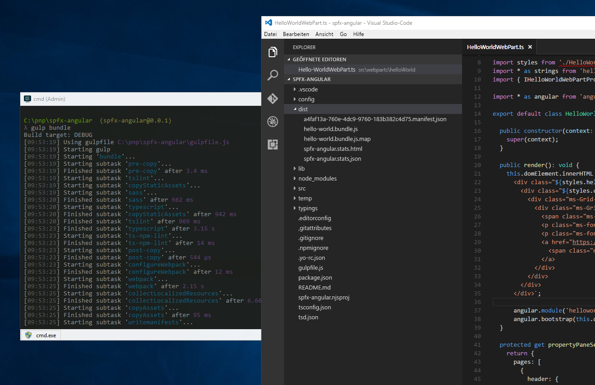
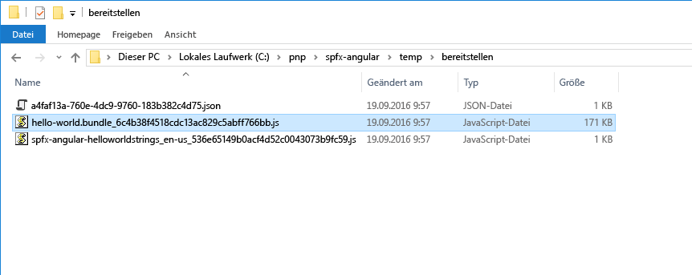
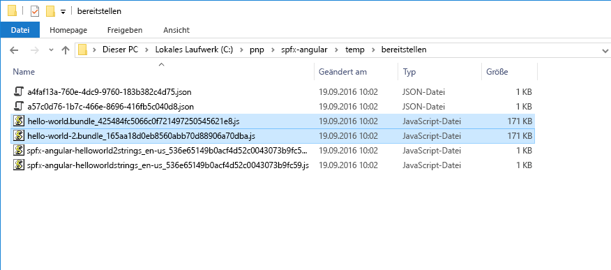
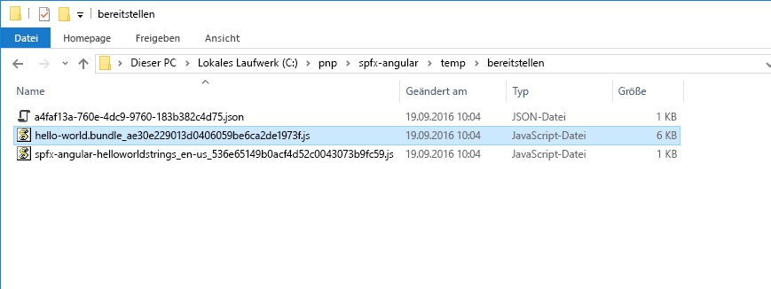
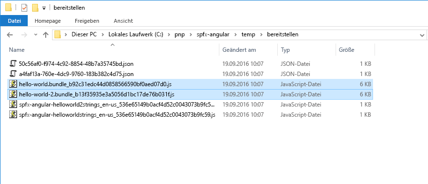

# <a name="use-existing-javascript-libraries-in-sharepoint-framework-client-side-web-parts"></a><span data-ttu-id="39fd0-102">Verwenden von vorhandenen JavaScript-Bibliotheken in clientseitigen SharePoint Framework-Webparts</span><span class="sxs-lookup"><span data-stu-id="39fd0-102">Use existing JavaScript libraries in SharePoint Framework client-side web parts</span></span>

<span data-ttu-id="39fd0-p101">Bei der Erstellung clientseitiger Webparts in SharePoint Framework können Sie bereits vorhandene JavaScript-Bibliotheken nutzen, um leistungsstarke Lösungen zu programmieren. Sie sollten jedoch einige Aspekte berücksichtigen, damit Ihre Webparts die Leistung der SharePoint-Seiten, auf denen sie eingesetzt werden, nicht beeinträchtigen.</span><span class="sxs-lookup"><span data-stu-id="39fd0-p101">When building client-side web parts on the SharePoint Framework you can benefit from using existing JavaScript libraries to build powerful solutions. There are however some considerations that you should take into account to ensure that your web parts won't negatively impact the performance of SharePoint pages that they are being used on.</span></span>

## <a name="reference-existing-libraries-as-packages"></a><span data-ttu-id="39fd0-105">Referenzieren vorhandener Bibliotheken als Pakete</span><span class="sxs-lookup"><span data-stu-id="39fd0-105">Reference existing libraries as packages</span></span>

<span data-ttu-id="39fd0-p102">Am häufigsten werden bereits vorhandene JavaScript-Bibliotheken in clientseitigen SharePoint Framework-Webparts referenziert, indem sie als Paket im Projekt installiert werden. Nehmen wir das Beispiel Angular. Um dieses Framework in einem clientseitigen Webpart zu verwenden, würden Sie Angular zunächst mithilfe von **npm** installieren:</span><span class="sxs-lookup"><span data-stu-id="39fd0-p102">The most common way of referencing existing JavaScript libraries in SharePoint Framework client-side web parts is by installing them as a package in the project. Taking Angular as an example, to use it in a client-side web part, you would first install Angular using **npm**:</span></span>

```sh
npm install angular --save
```

<span data-ttu-id="39fd0-108">Als Nächstes würden Sie mittels **Npm**Typisierungen mit installieren, damit Sie Angular mit TypeScript verwenden können:</span><span class="sxs-lookup"><span data-stu-id="39fd0-108">Next, to use Angular with TypeScript, you would install typings using **npm**:</span></span>

```sh
npm install @types/angular --save
```

<span data-ttu-id="39fd0-109">Schließlich würden Sie Angular in Ihrem Webpart über die Anweisung `import` referenzieren:</span><span class="sxs-lookup"><span data-stu-id="39fd0-109">Finally, you would reference Angular in your web part using the `import` statement:</span></span>

```ts
import { Version } from '@microsoft/sp-core-library';
import {
  BaseClientSideWebPart,
  IPropertyPaneConfiguration,
  PropertyPaneTextField
} from '@microsoft/sp-webpart-base';
import { escape } from '@microsoft/sp-lodash-subset';

import styles from './HelloWorld.module.scss';
import * as strings from 'helloWorldStrings';
import { IHelloWorldWebPartProps } from './IHelloWorldWebPartProps';

import * as angular from 'angular';

export default class HelloWorldWebPart extends BaseClientSideWebPart<IHelloWorldWebPartProps> {
  public render(): void {
    this.domElement.innerHTML = `
      <div class="${styles.helloWorld}">
        <!-- omitted for brevity -->
      </div>`;

      angular.module('helloworld', []);

      angular.bootstrap(this.domElement, ['helloworld']);
  }

  // omitted for brevity
}
```

## <a name="bundle-web-part-resources"></a><span data-ttu-id="39fd0-110">Bundling von Webpart-Ressourcen</span><span class="sxs-lookup"><span data-stu-id="39fd0-110">Bundle web part resources</span></span>

<span data-ttu-id="39fd0-p103">SharePoint Framework arbeitet mit einer Build-Toolkette auf Basis von Open Source-Tools wie gulp und webpack. Beim Erstellen von SharePoint Framework-Projekten fassen diese Buildtools automatisch alle referenzierten Ressourcen in einer einzigen JavaScript-Datei zusammen. Dieser Prozess wird Bundling (Bündelung) genannt.</span><span class="sxs-lookup"><span data-stu-id="39fd0-p103">SharePoint Framework uses a build toolchain based on open-source tooling such as gulp and Webpack. When building SharePoint Framework projects, these build tools automatically combine all referenced resources into a single JavaScript file in the process called bundling.</span></span>



<span data-ttu-id="39fd0-p104">Bundling hat verschiedene Vorteile. Zunächst einmal sind alle erforderlichen Ressourcen für Ihr Webpart in einer einzigen JavaScript-Datei verfügbar. Das vereinfacht die Bereitstellung, da das Webpart nur aus einer einzigen Datei besteht und es unmöglich ist, während des Bereitstellungsprozesses eine Abhängigkeit zu übersehen. Zudem verwendet ihr Webpart unterschiedliche Ressourcen, und es ist wichtig, dass diese Ressourcen in der richtigen Reihenfolge geladen werden. Das während der Erstellung von webpack generierte Webpart-Bundle übernimmt das Laden der unterschiedlichen Ressourcen für Sie. Unter anderem löst es auch sämtliche Abhängigkeiten zwischen diesen Ressourcen auf. Auch für Endbenutzer hat Webpart-Bundling Vorteile: Im Allgemeinen lässt sich eine einzelne, größere Datei schneller herunterladen als viele kleine Dateien. Durch die Zusammenfassung mehrerer kleinerer Dateien in einem größeren Bundle lädt das Webpart schneller auf der Seite. Ein Bundling von vorhandenen JavaScript-Bibliotheken mit clientseitigen SharePoint Framework-Webparts hat allerdings auch Nachteile.</span><span class="sxs-lookup"><span data-stu-id="39fd0-p104">Bundling offers you a number of benefits. First of all, all resources required by your web part are available in one single JavaScript file. This simplifies the deployment as the web part consists of a single file and it's impossible to miss a dependency in the deployment process. As your web part uses different resources, it's important that they are loaded in the right order. The web part bundle, generated by Webpack during the build, manages loading the different resources for you including resolving any dependencies between these resources. Bundling web parts has also its benefits for the end-users: generally speaking it's faster to download a single, bigger file, than a number of small files. By combining a number of smaller files into one bigger bundle, your web part will load faster on the page. Bundling existing JavaScript libraries with SharePoint Framework client-side web parts isn't however without drawbacks.</span></span>

<span data-ttu-id="39fd0-p105">Beim Bundling vorhandener JavaScript-Frameworks im SharePoint Framework werden alle referenzierten Skripts in der generierten Bundle-Datei zusammengefasst. Um noch einmal das Angular-Beispiel zu bemühen: Ein optimiertes Webpart-Bundle mit Angular ist über 170 KB groß.</span><span class="sxs-lookup"><span data-stu-id="39fd0-p105">When bundling existing JavaScript frameworks in the SharePoint Framework, all referenced scripts are included in the generated bundle file. Following the Angular example, an optimized web part bundle including Angular is over 170KB.</span></span>



<span data-ttu-id="39fd0-125">Wenn Sie ein weiteres Webpart zu Ihrem Projekt hinzufügen, das ebenfalls Angular verwendet, und das Projekt erstellen, erhalten Sie zwei Bundle-Dateien: eine pro Webpart. Jede Datei ist dabei größer als 170 KB.</span><span class="sxs-lookup"><span data-stu-id="39fd0-125">If you add another web part to your project, that also uses Angular, and you build the project, you get two bundle files - one for each web part, each of them being over 170KB.</span></span>



<span data-ttu-id="39fd0-p106">Angenommen, Sie fügen diese Webparts zu einer Seite hinzu. Jeder Benutzer würde Angular dann mehrere Male herunterladen, und zwar einmal mit jedem Webpart auf der Seite. Dieser Ansatz ist ineffizient und verlangsamt das Laden der Seite.</span><span class="sxs-lookup"><span data-stu-id="39fd0-p106">If you would add these web parts to a page, each user would be downloading Angular multiple times - once with each web part on the page. This approach is inefficient and slows down loading the page.</span></span>

## <a name="reference-existing-libraries-as-external-resources"></a><span data-ttu-id="39fd0-129">Referenzieren vorhandener Bibliotheken als externe Ressourcen</span><span class="sxs-lookup"><span data-stu-id="39fd0-129">Reference existing libraries as external resources</span></span>

<span data-ttu-id="39fd0-p107">Eine bessere Strategie ist es, vorhandene Bibliotheken als externe Ressourcen zu referenzieren und so in Ihr clientseitiges SharePoint Framework-Webpart einzubinden. Auf diese Weise sind im Webpart nur die Skript-URLs vermerkt, jedoch keine weiteren Skriptinformationen. Wenn das Webpart zur Seite hinzugefügt wird, versucht es automatisch, alle erforderlichen Ressourcen über die angegebenen URLs zu laden.</span><span class="sxs-lookup"><span data-stu-id="39fd0-p107">A better approach, to leverage existing libraries in SharePoint Framework client-side web part, is by referencing them as external resources. That way, the only information about the particular script, that is included in the web part, is the script's URL. When added to the page, web part will automatically try to load all required resources from the specified URLs.</span></span>

<span data-ttu-id="39fd0-p108">Die Referenzierung vorhandener JavaScript-Bibliotheken im SharePoint Framework ist einfach und erfordert keine besonderen Codeänderungen. Da die Bibliothek zur Laufzeit von den angegebenen URLs geladen wird, muss sie nicht als Paket im Projekt installiert werden.</span><span class="sxs-lookup"><span data-stu-id="39fd0-p108">Referencing existing JavaScript libraries in the SharePoint Framework is easy and doesn't require any specific changes in the code. Because the library is loaded on runtime from the specified URL, it doesn't need to be installed as a package in the project.</span></span>

<span data-ttu-id="39fd0-135">Nehmen wir wieder Angular als Beispiel: Um es als externe Ressource in Ihrem clientseitigen Webpart zu referenzieren, installieren Sie zunächst seine TypeScript-Typisierungen mithilfe von **Npm**:</span><span class="sxs-lookup"><span data-stu-id="39fd0-135">Using Angular as an example, in order to reference it as an external resource in your client-side web part, you start by installing its TypeScript typings using **npm**:</span></span>

```sh
npm install @types/angular --save
```

<span data-ttu-id="39fd0-136">Anschließend fügen Sie in der Datei **config/config.json** in der Eigenschaft **externals** den folgenden Eintrag hinzu:</span><span class="sxs-lookup"><span data-stu-id="39fd0-136">Next, in the **config/config.json** file, to the **externals** property you add the following entry:</span></span>

```json
"angular": {
  "path": "https://cdnjs.cloudflare.com/ajax/libs/angular.js/1.5.8/angular.min.js",
  "globalName": "angular"
}
```

<span data-ttu-id="39fd0-137">Die vollständige Datei **config/config.json** würde dann in etwa so aussehen:</span><span class="sxs-lookup"><span data-stu-id="39fd0-137">The complete **config/config.json** file would then look similar to:</span></span>

```json
{
  "entries": [
    {
      "entry": "./lib/webparts/helloWorld/HelloWorldWebPart.js",
      "manifest": "./src/webparts/helloWorld/HelloWorldWebPart.manifest.json",
      "outputPath": "./dist/hello-world.bundle.js"
    }
  ],
  "externals": {
    "angular": {
      "path": "https://cdnjs.cloudflare.com/ajax/libs/angular.js/1.5.8/angular.min.js",
      "globalName": "angular"
    }
  },
  "localizedResources": {
    "helloWorldStrings": "webparts/helloWorld/loc/{locale}.js"
  }
}
```

<span data-ttu-id="39fd0-138">Als letzten Schritt referenzieren Sie Angular in Ihrem Webpart, genau wie sie es zuvor schon getan haben:</span><span class="sxs-lookup"><span data-stu-id="39fd0-138">Finally, you reference Angular in your web part, just like you did previously:</span></span>

```ts
import { Version } from '@microsoft/sp-core-library';
import {
  BaseClientSideWebPart,
  IPropertyPaneConfiguration,
  PropertyPaneTextField
} from '@microsoft/sp-webpart-base';
import { escape } from '@microsoft/sp-lodash-subset';

import styles from './HelloWorld.module.scss';
import * as strings from 'helloWorldStrings';
import { IHelloWorldWebPartProps } from './IHelloWorldWebPartProps';

import * as angular from 'angular';

export default class HelloWorldWebPart extends BaseClientSideWebPart<IHelloWorldWebPartProps> {
  public render(): void {
    this.domElement.innerHTML = `
      <div class="${styles.helloWorld}">
        <!-- omitted for brevity -->
      </div>`;

      angular.module('helloworld', []);

      angular.bootstrap(this.domElement, ['helloworld']);
  }

  // omitted for brevity
}
```

<span data-ttu-id="39fd0-139">Wenn Sie Ihr Projekt jetzt erstellen, sehen Sie, dass die generierte Bundle-Datei nur noch 6 KB groß ist.</span><span class="sxs-lookup"><span data-stu-id="39fd0-139">If you build your project now and take a look at the size of the generated bundle file, you will notice that it's only 6KB.</span></span>



<span data-ttu-id="39fd0-141">Wenn Sie ein weiteres Webpart zu Ihrem Projekt hinzufügen, das ebenfalls Angular verwendet, und das Projekt erneut erstellen, ist jedes Bundle 6 KB groß.</span><span class="sxs-lookup"><span data-stu-id="39fd0-141">If you add another web part to your project, that also uses Angular, and you build the project again, both bundles would be 6KB each.</span></span>



<span data-ttu-id="39fd0-p109">Die Annahme, dass Sie damit 300 KB eingespart haben, ist jedoch falsch. Beide Webparts benötigen Angular noch immer und laden es, sobald zum ersten Mal ein Benutzer die Seite besucht, auf der eines von ihnen platziert ist.</span><span class="sxs-lookup"><span data-stu-id="39fd0-p109">It isn't correct to assume that you have just saved over 300KB. Both web parts still need Angular and will load it the first time the user visits the page where one of the web parts is placed.</span></span>


<span data-ttu-id="39fd0-146">Auch wenn Sie beide Angular-Webparts zu der Seite hinzufügen, lädt SharePoint Framework Angular nur ein einziges Mal herunter.</span><span class="sxs-lookup"><span data-stu-id="39fd0-146">Even if you add both Angular web parts to the page, SharePoint Framework still downloads Angular only once.</span></span>


<span data-ttu-id="39fd0-p110">Der wirkliche Vorteil einer Referenzierung vorhandener JavaScript-Bibliotheken als externe Ressourcen zeigt sich dann, wenn Ihre Organisation einen zentralen Speicherort für alle häufig verwendeten Skripts hat oder Sie ein CDN nutzen. In solchen Fällen besteht die Möglichkeit, dass die betreffende JavaScript-Bibliothek bereits im Browsercache des Benutzers liegt. Dann müsste nur noch das Webpart-Bundle geladen werden, und die Ladezeit der Seite wäre signifikant kürzer.</span><span class="sxs-lookup"><span data-stu-id="39fd0-p110">The real benefit of referencing existing JavaScript libraries as external resources is if your organization has a centralized location for all commonly-used scripts or you use a CDN. In such cases there is a chance that the particular JavaScript library is already present in the user's browser cache. As a result, the only thing that needs to be loaded is the web part bundle which makes the page load significantly faster.</span></span>


<span data-ttu-id="39fd0-p111">Das Beispiel oben zeigt, wie Sie Angular aus einem CDN laden. Ein öffentliches CDN ist jedoch nicht erforderlich. In der Konfiguration können Sie auf jeden Speicherort verweisen: ob öffentliches CDN, privat gehostetes Repository oder SharePoint-Dokumentbibliothek. Solange die Benutzer Ihrer Webparts auf die angegebenen URLs zugreifen können, werden die Webparts wie erwartet funktionieren.</span><span class="sxs-lookup"><span data-stu-id="39fd0-p111">The example above shows how to load Angular from a CDN, but using a public CDN is not required. In the configuration you can point any location: from a public CDN, a privately-hosted repository to a SharePoint Document Library. As long as users working with your web parts are able to access the specified URLs, your web parts will work as expected.</span></span>

<span data-ttu-id="39fd0-p112">CDNs sind für schnelle Ressourcenbereitstellung auf der ganzen Welt optimiert. Ein weiterer Vorteil beim Referenzieren von Skripts aus CDNs besteht daher darin, dass ein bestimmtes Skript möglicherweise bereits auf einer anderen Website verwendet wurde, die der Benutzer in der Vergangenheit besucht hat. Da das Skript dann bereits im Cache des lokalen Browsers liegen würde, müsste es nicht noch einmal speziell für Ihr Webpart heruntergeladen werden. Dadurch würde die Seite mit dem Webpart noch schneller laden.</span><span class="sxs-lookup"><span data-stu-id="39fd0-p112">CDNs are optimized for fast resource delivery across the globe. The additional advantage of referencing scripts from public CDNs is, that there is a chance that the same script has been used on some other website that user has visited in the past. Because the script is already present in the local browser's cache it wouldn't need to be downloaded specifically for your web part which would make the page with the web part on it load even faster.</span></span>

<span data-ttu-id="39fd0-p113">Einige Organisationen verbieten den Zugriff auf öffentlichen CDNs über das Firmennetzwerk. Dann ist ein privat gehosteter Speicherort für häufig verwendete JavaScript-Frameworks eine exzellente Alternative. Da Ihre Organisation in einem solchen Fall selbst die Bibliotheken hostet, kann sie auch die Cache-Header kontrollieren und die Ressourcenleistung eventuell noch weiter optimieren.</span><span class="sxs-lookup"><span data-stu-id="39fd0-p113">Some organizations don't allow access to public CDNs from the corporate network. In such cases using a privately-hosted storage location for commonly-used JavaScript frameworks is a great alternative. Because your organization hosts the libraries, it could also control the cache headers which could help you optimize your resources for performance even further.</span></span> 

## <a name="javascript-libraries-formats"></a><span data-ttu-id="39fd0-161">Formate von JavaScript-Bibliotheken</span><span class="sxs-lookup"><span data-stu-id="39fd0-161">JavaScript libraries formats</span></span>

<span data-ttu-id="39fd0-p114">Die verschiedenen JavaScript-Bibliotheken werden jeweils unterschiedlich erstellt und gepackt. Einige werden als Module gepackt, andere bestehen aus einfachen Skripts, die im globalen Bereich ausgeführt werden. (Solche Skripts werden häufig auch als Nicht-Modul-Skripts bezeichnet.) Wenn Sie JavaScript-Bibliotheken über eine URs laden, hängt es vom Format des jeweiligen externen Skripts ab, wie Sie es in Ihrem SharePoint Framework-Projekt registrieren müssen. Es gibt verschiedene Modulformate, beispielsweise AMD, UMD oder CommonJS; Sie müssen aber lediglich wissen, ob das betreffende Skript ein Modul ist oder nicht.</span><span class="sxs-lookup"><span data-stu-id="39fd0-p114">Different JavaScript libraries are built and packaged in a different way. Some are packaged as modules while others are plain scripts that run in the global scope (these scripts are often referred to as non-module scripts). When loading JavaScript libraries from a URL, how you register an external script in a SharePoint Framework project depends on the format of the script. There are multiple module formats, such as AMD, UMD or CommonJS but the only thing that you have to know is if the particular script is a module or not.</span></span>

<span data-ttu-id="39fd0-p115">Bei der Registrierung von als Modul gepackten Skripts müssen Sie nur die URL angeben, von der das Skript heruntergeladen werden soll. Abhängigkeiten von anderen Skripts werden bereits im Moduldesign des Skripts abgearbeitet.</span><span class="sxs-lookup"><span data-stu-id="39fd0-p115">When registering scripts packaged as modules the only thing that you have to specify, is the URL where the particular script should be downloaded from. Dependencies to other scripts are handled already inside the script's module construct.</span></span>

<span data-ttu-id="39fd0-p116">Bei Nicht-Modul-Skripts andererseits müssen Sie mindestens die URL angeben, von der das Skript heruntergeladen werden soll, und den Namen der Variable, mit der das Skript im globalen Bereich registriert wird. Hängt das Nicht-Modul-Skript von anderen Skripts ab, können diese als Abhängigkeiten aufgeführt werden. Schauen wir uns dazu einige Beispiele an.</span><span class="sxs-lookup"><span data-stu-id="39fd0-p116">Non-module scripts on the other hand require at minimum the URL from where the script should be downloaded and the name of the variable with which the script will be registered in the global scope. If the non-module script depends on other scripts, they can be listed as dependencies. To illustrate this, let's have a look at a few examples.</span></span>

<span data-ttu-id="39fd0-p117">Angular v1.x ist ein Nicht-Modul-Skript. Wenn Sie es als externe Ressource in einem SharePoint Framework-Projekt angeben möchten, spezifizieren Sie seine URL und den Namen der globalen Variable, mit der es registriert werden soll:</span><span class="sxs-lookup"><span data-stu-id="39fd0-p117">Angular v1.x is a non-module script. You register it as an external resource in a SharePoint Framework project by specifying its URL and the name of the global variable it should register with:</span></span>

```json
"angular": {
  "path": "https://cdnjs.cloudflare.com/ajax/libs/angular.js/1.5.8/angular.min.js",
  "globalName": "angular"
}
```

<span data-ttu-id="39fd0-p118">Es ist wichtig, dass der in der Eigenschaft **globalName** angegebene Name exakt dem Namen entspricht, den das Skript verwendet. So kann es sich korrekt für andere Skripts verfügbar machen, die eventuell von ihm abhängen.</span><span class="sxs-lookup"><span data-stu-id="39fd0-p118">It's important that the name specified in the **globalName** property corresponds to the name used by the script. That way it can correctly expose itself to other scripts that might depend on it.</span></span>

<span data-ttu-id="39fd0-p119">[ngOfficeUIFabric](http://ngofficeuifabric.com) ist ein UMD-Modul, das von Angular abhängt, und enthält die Angular-Richtlinien für Office UI Fabric. Die Abhängigkeit von Angular wird bereits im Modul abgearbeitet. Zur Registrierung müssen Sie also nur die Modul-URL angeben:</span><span class="sxs-lookup"><span data-stu-id="39fd0-p119">[ngOfficeUIFabric](http://ngofficeuifabric.com) - the Angular directives for Office UI Fabric, is a UMD module that depends on Angular. The dependency on Angular is already handled inside the module, so to register it all you need to specify is its URL:</span></span>

```json
"ng-office-ui-fabric": "https://cdnjs.cloudflare.com/ajax/libs/ngOfficeUiFabric/0.12.3/ngOfficeUiFabric.js"
```

<span data-ttu-id="39fd0-p120">jQuery ist ein AMD-Skript. Zur Registrierung reicht daher diese einfache Codezeile:</span><span class="sxs-lookup"><span data-stu-id="39fd0-p120">jQuery is an AMD script. To register it you could simply use:</span></span>

```json
"jquery": "https://code.jquery.com/jquery-2.2.4.js"
```

<span data-ttu-id="39fd0-p121">Angenommen, Sie möchten jQuery mit einem jQuery-Plug-In verwenden, das als Nicht-Modul-Skript verteilt wird, und verwenden zur Registrierung beider Skripts folgenden Code:</span><span class="sxs-lookup"><span data-stu-id="39fd0-p121">Imagine now, that you wanted to use jQuery with a jQuery plugin that itself is distributed as a non-module script. If you registered both scripts using:</span></span>

```json
"jquery": "https://code.jquery.com/jquery-2.2.4.js",
"simpleWeather": {
  "path": "https://cdnjs.cloudflare.com/ajax/libs/jquery.simpleWeather/3.1.0/jquery.simpleWeather.min.js",
  "globalName": "jQuery"
}
```

<span data-ttu-id="39fd0-181">Das Laden des Webparts würde sehr wahrscheinlich fehlschlagen: Beide Skripts würden wahrscheinlich parallel geladen werden, und das Plug-In könnte sich nicht bei jQuery registrieren.</span><span class="sxs-lookup"><span data-stu-id="39fd0-181">loading the web part would very likely result in an error: there is a chance that both scripts would be loaded in parallel and the plugin wouldn't be able to register itself with jQuery.</span></span>


<span data-ttu-id="39fd0-p122">Wie bereits erwähnt, können Sie in SharePoint Framework Abhängigkeiten für Nicht-Modul-Plug-Ins spezifizieren. Diese Abhängigkeiten werden in der Eigenschaft **globalDependencies** angegeben:</span><span class="sxs-lookup"><span data-stu-id="39fd0-p122">As mentioned before, SharePoint Framework allows you to specify dependencies for non-module plugins. These dependencies are specified using the **globalDependencies** property:</span></span>

```json
"jquery": "https://code.jquery.com/jquery-2.2.4.js",
"simpleWeather": {
  "path": "https://cdnjs.cloudflare.com/ajax/libs/jquery.simpleWeather/3.1.0/jquery.simpleWeather.min.js",
  "globalName": "jQuery",
  "globalDependencies": [ "jquery" ]
}
```

<span data-ttu-id="39fd0-185">Jede in der Eigenschaft **globalDependencies** angegebene Abhängigkeit muss auf eine andere Abhängigkeit im Abschnitt **externals** in der Datei **config/config.json** verweisen.</span><span class="sxs-lookup"><span data-stu-id="39fd0-185">Each dependency specified in the **globalDependencies** property must point to another dependency in the **externals** section of the **config/config.json** file.</span></span>

<span data-ttu-id="39fd0-186">Wenn Sie jetzt versuchen würden, das Projekt zu erstellen, würde wieder ein Fehler gemeldet. Dieses Mal würde moniert,dass Sie keine Abhängigkeit zu einem Nicht-Modul-Skript angeben dürfen.</span><span class="sxs-lookup"><span data-stu-id="39fd0-186">If you would try to build the project now, you would get another error, this time stating that you can't specify a dependency to a non-module script.</span></span>


<span data-ttu-id="39fd0-188">Um dieses Problem zu lösen, müssen Sie jQuery lediglich als Nicht-Modul-Skript registrieren:</span><span class="sxs-lookup"><span data-stu-id="39fd0-188">To solve this problem, all you need to do is to register jQuery as a non-module script:</span></span>

```json
"jquery": {
  "path": "https://code.jquery.com/jquery-2.1.1.min.js",
  "globalName": "jQuery"
},
"simpleWeather": {
  "path": "https://cdnjs.cloudflare.com/ajax/libs/jquery.simpleWeather/3.1.0/jquery.simpleWeather.min.js",
  "globalName": "jQuery",
  "globalDependencies": [ "jquery" ]
}
```

<span data-ttu-id="39fd0-189">So legen Sie fest, dass das Skript **simpleWeather** nach jQuery geladen werden soll und dass jQuery unter einer global verfügbaren Variable `jQuery` verfügbar sein soll, die das jQuery-Plug-In **simpleWeather** benötigt, um sich selbst zu registrieren.</span><span class="sxs-lookup"><span data-stu-id="39fd0-189">This way you specify that the **simpleWeather** script should be loaded after jQuery and that jQuery should be available under a globally available variable `jQuery` which is required by the **simpleWeather** jQuery plugin to register itself.</span></span>

> <span data-ttu-id="39fd0-p123">Der Eintrag zur Registrierung von jQuery verwendet **jquery** als Namen für die externe Ressource, aber **jQuery** als Namen für die globale Variable. Der Namen der externen Ressource ist der Name, den Sie in den Anweisungen des Typs `import` in Ihrem Code verwenden. Dies ist auch der Name, der den TypeScript-Typisierungen entsprechen muss. Der Name der globalen Variable, spezifiziert über die Eigenschaft **globalName**, ist der Name, den andere Skripts kennen, beispielsweise Plug-Ins, die auf der Bibliothek aufsetzen. Bei einigen Bibliotheken können diese Namen identisch sein. Das ist aber nicht zwingend der Fall, und Sie sollten zur Vermeidung von Problemen sorgfältig prüfen, ob Sie die richtigen Namen verwenden.</span><span class="sxs-lookup"><span data-stu-id="39fd0-p123">Note how the entry for registering jQuery uses **jquery** for the external resource name but **jQuery** as the global variable name. The name of the external resource is the name that you use in the `import` statements in your code. This is also the name that must match TypeScript typings. The global variable name, specified using the **globalName** property, is the name known to other scripts like plugins built on top of the library. While for some libraries these names might be the same, it's not required and you should carefully check that you are using correct names to avoid any problems.</span></span>

<span data-ttu-id="39fd0-p124">Es ist schwierig, manuell zu ermitteln, ob das Skript, das Sie versuchen zu laden, ein Modul- oder ein Nicht-Modul-Skript ist. Dies trifft insbesondere dann zu, wenn das Skript, das Sie laden möchten, minimiert ist. Wenn das Skript auf einer öffentlich zugänglichen URL gehostet wird, können Sie das kostenlose Tool [Rencore SharePoint Framework Script Check](https://rencore.com/sharepoint-framework/script-check/) verwenden, um den Skripttyp zu ermitteln. Außerdem stellt das Tool fest, ob der Hostingspeicherort, von dem Sie das Skript laden, ordnungsgemäß konfiguriert ist.</span><span class="sxs-lookup"><span data-stu-id="39fd0-p124">It's hard to determine manually whether the script that you're trying to load is a module or a non-module script. This is especially the case if the script that you're trying to load is minified. If your script is hosted on a publicly accessible URL, you can use the free [Rencore SharePoint Framework Script Check](https://rencore.com/sharepoint-framework/script-check/) tool to determine the type of script for you. Additionally, this tool will let you know whether the hosting location from which you're loading the script is properly configured.</span></span>

## <a name="non-module-scripts-considerations"></a><span data-ttu-id="39fd0-199">Zu bedenkende Aspekte bei Nicht-Modul-Skripts</span><span class="sxs-lookup"><span data-stu-id="39fd0-199">Non-module scripts considerations</span></span>

<span data-ttu-id="39fd0-p125">Viele JavaScript-Bibliotheken und -Skripts, die in der Vergangenheit entwickelt wurden, werden als Nicht-Modul-Skripts verteilt. Das SharePoint Framework unterstützt zwar das Laden von Nicht-Modul-Skripts, Sie sollten von deren Verwendung aber dennoch wann immer möglich absehen.</span><span class="sxs-lookup"><span data-stu-id="39fd0-p125">Many JavaScript libraries and scripts developed in the past are distributed as non-module scripts. While the SharePoint Framework supports loading non-module scripts, you should strive to avoid using them whenever possible.</span></span>

<span data-ttu-id="39fd0-p126">Nicht-Modul-Skripts werden im globalen Bereich der Seite registriert: Ein Skript, das von einem Webpart geladen wird, ist auch für alle anderen Webparts auf der Seite verfügbar. Wenn Sie zwei Webparts haben, die jeweils eine unterschiedliche Version von jQuery verwenden, und beide als Nicht-Modul-Skripts geladen werden, würde das zuletzt geladene Webpart alle zuvor registrierten jQuery-Versionen überschreiben. Wie Sie sich vorstellen können, könnte das zu unvorhersehbaren Ergebnissen und Problemen führen, die sich nur schwer debuggen lassen und nur in bestimmten Szenarien auftreten würden: nur, wenn auf der Seite andere Webparts eingesetzt werden, die eine andere jQuery-Version verwenden, und nur, wenn diese Webparts in einer bestimmten Reihenfolge geladen werden. Die Modularchitektur löst dieses Problem durch Isolierung der Skripts. Das verhindert, dass sie sich gegenseitig beeinflussen.</span><span class="sxs-lookup"><span data-stu-id="39fd0-p126">Non-module scripts are registered in the global scope of the page: script loaded by one web part is available to all other web parts on the page. If you had two web parts using different versions of jQuery, both loaded as non-module scripts, the web part that loaded the last would overwrite all previously registered versions of jQuery. As you can imagine, this could lead to unpredictable results and very hard to debug issues that would occur only in certain scenarios - only with other web parts using a different version of jQuery on the page and only when they load in particular order. The module architecture solves this problem by isolating scripts and preventing them from affecting each other.</span></span>

## <a name="when-you-should-consider-bundling"></a><span data-ttu-id="39fd0-206">Wann Bundling sinnvoll ist</span><span class="sxs-lookup"><span data-stu-id="39fd0-206">When you should consider bundling</span></span>

<span data-ttu-id="39fd0-p127">Das Bundling von vorhandenen JavaScript-Bibliotheken in Ihr Webpart kann zu großen Webpart-Dateien führen und die Leistung von Seiten mit diesem Webpart drastisch verschlechtern. Generell sollten Sie das Bundling von JavaScript-Bibliotheken mit Ihren Webparts also vermeiden. Es gibt jedoch verschiedene Szenarien, in denen Bundling von Vorteil sein kann.</span><span class="sxs-lookup"><span data-stu-id="39fd0-p127">Bundling existing JavaScript libraries into your web part can lead to big web part files and can cause poor performance of pages using that web part. While you should generally avoid bundling JavaScript libraries with your web parts, there are scenarios where bundling could work to your advantage.</span></span>

<span data-ttu-id="39fd0-p128">Wenn Sie eine Standardlösung erstellen, die in jedem Intranet funktionieren soll, kann das Bundling aller Ressourcen mit Ihrem Webpart sicherstellen, dass Ihr Webpart wie erwartet arbeitet. Schließlich wissen Sie vorab nicht, wo Ihre Lösung installiert werden wird. Wenn alle Abhängigkeiten in der Bundle-Datei Ihres Webparts enthalten sind, kann es ordnungsgemäß arbeiten, auch dann, wenn eine Organisation Ressourcendownloads aus CDNs oder von anderen externen Speicherorten nicht erlaubt.</span><span class="sxs-lookup"><span data-stu-id="39fd0-p128">If you are building a standard solution that should work on every intranet, bundling all your resources with your web part can help you ensure that your web part will work as expected. Because you don't know upfront where your solution will be installed, including all dependencies in your web part's bundle file will allow it to work correctly - even if the organization doesn't allow downloading resources from a CDN or other external location.</span></span>

<span data-ttu-id="39fd0-p129">Wenn Ihre Lösung aus mehreren Webparts besteht, die alle eine bestimmte Funktionalität nutzen, wäre es besser, diese gemeinsam genutzte Funktionalität als separate Bibliothek zu erstellen und in allen Webparts als externe Ressource zu referenzieren. Benutzer müssten die gemeinsam genutzte Bibliothek dann nur ein einziges Mal herunterladen und könnten sie mit allen Webparts wiederverwenden.</span><span class="sxs-lookup"><span data-stu-id="39fd0-p129">If your solution consists of a number of web parts, that share some functionality with each other, then it would be better to build the shared functionality as a separate library and reference it as an external resource in all web parts. That way users would need to download the common library only once and reuse it with all web parts.</span></span>

## <a name="summary"></a><span data-ttu-id="39fd0-213">Zusammenfassung</span><span class="sxs-lookup"><span data-stu-id="39fd0-213">Summary</span></span>

<span data-ttu-id="39fd0-p130">Bei der Erstellung clientseitiger Webparts in SharePoint Framework können Sie bereits vorhandene JavaScript-Bibliotheken nutzen, um leistungsstarke Lösungen zu programmieren. SharePoint Framework lässt Ihnen die Wahl, ob Sie diese Bibliotheken mit Ihren Webparts in einem Bundle zusammenfassen oder als externe Ressourcen laden. Die allgemein empfohlene Strategie ist es, vorhandene Bibliotheken von einer URL zu laden. In manchen Szenarien hat aber auch Bundling Vorteile. Es ist daher essenziell, dass Sie Ihre Anforderungen sorgfältig analysieren und den Ansatz wählen, der diese Anforderungen am besten erfüllt.</span><span class="sxs-lookup"><span data-stu-id="39fd0-p130">When building client-side web parts on the SharePoint Framework you can benefit of existing JavaScript libraries to build powerful solutions. SharePoint Framework allows you to either bundle these libraries together with your web parts or load them as an external resource. While loading existing libraries from a URL is generally the recommended approach, there are scenarios where bundling might be beneficial and it's essential that you evaluate your requirements carefully to choose the approach that meets your needs the best.</span></span>