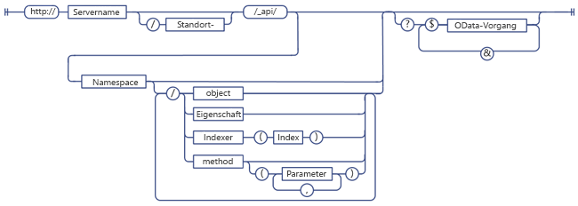
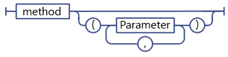
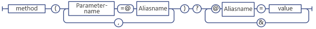
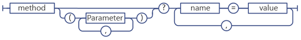
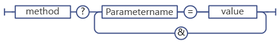

# <a name="determine-sharepoint-rest-service-endpoint-uris"></a>Ermitteln von URIs von SharePoint-REST-Dienstendpunkten
Informieren Sie sich über allgemeine Richtlinien zur Ermittlung von URIs von SharePoint-REST-Endpunkten mithilfe der Signatur der entsprechenden Clientobjektmodell-APIs.
 
 **Bevor Sie beginnen**

-  [Grundlegendes zum SharePoint REST-Dienst](get-to-know-the-sharepoint-rest-service.md)
-  [Navigieren in der im REST-Dienst dargestellten SharePoint-Datenstruktur](navigate-the-sharepoint-data-structure-represented-in-the-rest-service.md)
    
 **Nächste Schritte**

-  [Verwenden von OData-Abfragevorgängen in SharePoint REST-Anforderungen](use-odata-query-operations-in-sharepoint-rest-requests.md)

## <a name="sharepoint-rest-endpoint-uri-structure"></a>Struktur der URIs von SharePoint-REST-Endpunkten
Bevor Sie mithilfe des REST-Diensts auf eine SharePoint-Ressource zugreifen können, müssen Sie zuerst den URI-Endpunkt ermitteln, der auf diese Ressource zeigt. Wann immer möglich, bildet die URI für diese REST-Endpunkte die API-Signatur der Ressource im SharePoint-Clientobjektmodell streng nach. Beispiel:
 
 *Clientobjektmodell-Methode:* 

```
List.GetByTitle(listname).GetItems()
```
 
 *REST-Endpunkt:* 
```
 http://server/site/_api/lists/getbytitle('listname')/items
```
 
In einigen Fällen unterscheidet sich die Endpunkt-URI aber von der entsprechenden Clientobjektmodell-Signatur, um REST- oder OData-Konventionen zu erfüllen.
 
Die folgende Abbildung zeigt die allgemeine Syntaxstruktur von SharePoint-REST-URIs. 

**Syntaxstruktur von SharePoint-REST-URIs**

 
Einige Endpunkte für SharePoint-Ressourcen weichen von dieser Syntaxstruktur ab:

- Methoden, die komplexe Typen als Parameter erfordern. 
    
    Wenn die entsprechende Clientobjektmodell-Methode erfordert, dass komplexe Typen als Parameter übergeben werden, kann der REST-Endpunkt wegen REST-Einschränkungen von dieser Syntaxstruktur abweichen.
    
 
- Statische Methoden und Eigenschaften. 
    
    REST-Endpunkte weichen von dieser Syntaxstruktur bei URIs ab, die statische Methoden und Eigenschaften darstellen.
    

## <a name="determine-sharepoint-rest-service-endpoints"></a>Ermitteln von SharePoint-REST-Dienstendpunkten
Befolgen Sie diese Schritte, um einen REST-Endpunkt für eine SharePoint-Ressource zu erstellen: 

1. Starten Sie mit der REST-Dienstreferenz:
    
     `http://server/site/_api`
    
 
2. Geben Sie den entsprechenden Einstiegspunkt an. Beispiel:
    
     `http://server/site/_api/web`
    
 
3. Navigieren Sie vom Einstiegspunkt zu den spezifischen Ressourcen, auf die Sie zugreifen möchten. Dabei müssen Sie auch Parameter für Endpunkte angeben, die Methoden im Clientobjektmodell entsprechen. Beispiel:
    
     `http://server/site/_api/web/lists/getbytitle('listname')`
    
### <a name="reference-the-sharepoint-rest-service-in-your-endpoint-uri"></a>Referenzieren Sie den SharePoint REST-Dienst in Ihrem Endpunkt-URI
Verwenden Sie `_api`, um den SharePoint REST-Dienst in Ihren Endpunkt-URIs zu kennzeichnen. Der REST-Dienst ist Teil des Webdiensts „client.svc“. Um die Erstellung von REST-URIs zu erleichtern und den REST URI-Basispfad zu kürzen, verwendet der REST-Dienst `_api`, wodurch der explizite Verweis auf den Webdienst „client.svc“ nicht mehr erforderlich ist. URIs, die auf den Webdienst „client.svc“ verweisen, werden vom REST-Dienst jedoch weiterhin erkannt und akzeptiert. Sie können z. B. `http://server/site/_vti_bin/client.svc/web/lists` anstelle von `http://server/site/_api/web/lists` verwenden. Allerdings ist `_api` die bevorzugte Konvention. URLs haben maximal 256 Zeichen. Mit `_api` wird der Basis-URI verkürzt und es bleiben mehr Zeichen für die Erstellung der verbleibenden URL übrig.
 

### <a name="specify-entry-points-for-the-sharepoint-rest-service"></a>Angeben von Einstiegspunkten für den SharePoint REST-Dienst
Die wichtigsten Einstiegspunkte für den REST-Dienst sind die Websitesammlung und die Website des angegebenen Kontexts. Damit entsprechen diese Einstiegspunkte den Eigenschaften **ClientContext.Site** und **ClientContext.Web** in den Clientobjektmodellen.
 
Gehen Sie folgendermaßen vor, um auf eine bestimmte Websitesammlung zuzugreifen:
 
 `http://server/site/_api/site`
 
Gehen Sie folgendermaßen vor, um auf eine bestimmte Website zuzugreifen:
 
 `http://server/site/_api/web`
  
Wobei  *server*  den Namen des Servers darstellt und  *site*  für den Namen der oder den Pfad zur entsprechenden Website steht.
 
Zusätzlich zu  `/site` und `/web` enthält der REST-Dienst mehrere Zugriffspunkte, die Entwicklern erlauben, zu spezifischen Funktionen zu navigieren. In der folgenden Tabelle sind einige dieser Zugriffspunkte aufgeführt.

|**Funktionsbereich**|**Zugriffspunkt**|
|:-----|:-----|
|Website|http:// _server/site_/_api/site|
|Web|http:// _server/site_/_api/web|
|Benutzerprofil|http:// _server/site_/_api/SP.UserProfiles.PeopleManager|
|Suche|http:// _server/site_/_api/search|

### <a name="navigate-to-the-specific-resources-you-want-to-access"></a>Navigieren Sie zu den entsprechenden Ressourcen, auf die Sie zugreifen möchten
Erstellen Sie von hier aus spezifischere REST-Endpunkte, indem Sie das Objektmodell durchlaufen. Verwenden Sie dazu die Namen der APIs aus dem Clientobjektmodell, getrennt durch einen Schrägstrich (/). Die nachfolgende Tabelle zeigt Beispiele für Clientobjektmodell-Aufrufe und den entsprechenden REST-Endpunkt. 
 
|**Clientobjektmodell-API**|**REST-Endpunkt**|
|:-----|:-----|
|ClientContext.Web.Lists|http:// _server_/ _site_/_api/web/lists|
|ClientContext.Web.Lists[guid]|http:// _server_/ _site_/_api/web/lists(' _guid_')|
|ClientContext.Web.Lists.GetByTitle("Title")|http:// _server_/ _site_/_api/web/lists/getbytitle(' _Title_')|
Bei Endpunkt-URIs wird die Groß- und Kleinschreibung nicht beachtet. Verwenden Sie in der vorhergehenden Tabelle z. B. `/getbytitle`, um das REST-Äquivalent der **GetByTitle()**-Methode anzugeben.
 

## <a name="specify-parameters-in-rest-endpoint-uris"></a>Angeben von Parametern in REST-Endpunkt-URIs
SharePoint erweitert die OData-Spezifikation, um es Ihnen zu ermöglichen, für die Angabe von Methodenparametern und Indexwerten Klammern zu verwenden. Dadurch werden Fehler durch Mehrdeutigkeiten in URIs vermieden, die mehrere Parameter mit dem gleichen Namen enthalten. Die folgenden beiden URIs enthalten beispielsweise Parameter, die den gleichen Namen aufweisen:
 
 `http://server/site/_api/web/lists/getByTitle('Announcements')/fields/getByTitle('Description')`
 
 `http://server/site/_api/web/lists('<guid>')/fields/getById('<guid>')`
 
Um mehrere Parameter anzugeben, schließen Sie den Parameter als ein Namen-Wert-Paar ein, und trennen Sie die Parameter mit Kommas. Beispiel:
  
 `http://server/site/_api/web/getAvailableWebTemplates(lcid=1033, includeCrossLanguage=true)`
  
Die folgende Abbildung zeigt die Syntax von SharePoint REST-Parametern.
 
**SharePoint REST-Parametersyntax**


### <a name="complex-types-as-parameters-for-the-rest-service"></a>Komplexe Typen als Parameter für den REST-Dienst
Einige Methoden im Clientobjektmodell erfordern eine große Nutzlast als Parameter. Damit die Funktionsparität der REST-Endpunkte mit den entsprechenden Clientobjektmodell-APIs erhalten bleibt, müssen die Endpunkte einen komplexen Typ als Parameter akzeptieren. In diesen Fällen wird das vorhandene OData-Protokoll durch den REST-Dienst erweitert. Dadurch wird ermöglicht, dass diese REST-Endpunkte einen einzigen komplexen Typ als Parameter akzeptieren. Dies gilt nur für **POST**-Vorgänge. Sie müssen den komplexen Typ entsprechend der OData-Standards im [Atom](http://www.odata.org/developers/protocols/atom-format#RepresentingComplexTypesProperties)- oder [JSON](http://www.odata.org/developers/protocols/json-format#RepresentingComplexTypeProperties)-Format übergeben.
 
So verwendet beispielsweise die Methode **ListCollection.Add** ein **Microsoft.SharePoint.Client.ListCreationInformation**-Objekt als Parameter. Um eine Liste zu einer bestimmten Website hinzuzufügen, erstellen Sie den entsprechenden REST-Endpunkt wie folgt:
 
 `http://server/site/_api/web/lists/add`
 
Übergeben Sie dann den komplexen Typ im Textkörper der Anforderung im JSON-Format.

```javascript
{ "d" : {
   "results": {
     "__metadata": {
       "type": "SP.ListCreationInformation"
     }, 
     "CustomSchemaXml": "…large payload…/", 
     "Description": "desc", 
     "DocumentTemplateType": "1", 
     "TemplateType": "101", 
     "Title": "Announcements"
   }
} 
}
```
### <a name="using-parameter-aliases-in-rest-service-calls"></a>Verwenden von Parameter-Aliasen in REST-Dienstaufrufen
Sie können die "Parameteraliasing"-Semantik in OData verwenden, um Parameter an einen SharePoint-REST-Endpunkt zu übergeben. Beim Parameteraliasing wird der Parameterwert mit einem Alias im Parameteraufruf identifiziert, und der tatsächliche Wert wird in der Abfragezeichenfolge der URI angegeben. So können Sie mehr Zeichentypen und eine einheitliche Formatierung mithilfe der Abfragezeichenfolge unterstützen.
 
Die folgenden zwei REST-URIs sind z. B. äquivalent: 
 
 *Geben Sie den Parameterwert direkt an:* 
 
 `http://server/site/_api/web/applyWebTemplate("STS#0")`
 
 *Verwenden Sie einen Parameteralias, und geben Sie den tatsächlichen Parameterwert in der Abfragezeichenfolge der URI an:* 
 
 `http://server/site/_api/web/applyWebTemplate(title=@template)?@template="STS#0"`
 
Das Übergeben von komplexen Typen per Parameteraliasing wird vom SharePoint-REST-Dienst allerdings nicht unterstützt. So wird z. B. die folgende URI nicht unterstützt, die einen komplexen Typ im Parameteralias enthält:
 
 ```
 http://server/site/_api/userProfiles/People(7)/GetWorkplace(@address)?@address={"__metadata":{"type: "ODataDemo.Address"},"Street":"NE 228th", "City":"Sammamish","State":"WA","ZipCode":"98074","Country": "USA"}
 ```
 
**Syntax für Parameteraliasing im SharePoint REST-Dienst**


### <a name="specifying-dictionaries-as-parameter-values"></a>Angeben von Wörterbüchern als Parameterwerte
Bei REST-Endpunkten, die Methoden entsprechen, die `Dictionary<String, String>`-Wörterbücher als Parameter verwenden, übergeben Sie das Wörterbuch als Serie von durch Kommas getrennten Namen-Wert-Paaren in der Abfragezeichenfolge.

**Syntax für Wörterbuchparameter im REST-Dienst**

 
Ein `Dictionary<String, object>` wird als Mehrfachwertobjekt namens "KeyedPropertyValue" mit den folgenden Zeichenfolgeneigenschaften dargestellt:

-  **Key** Der Schlüssel des Mehrfachwertobjekts.

-  **Value** Der Wert des Objekts

-  **ValueType** Der Werttyp des Objekts Für einfache Werttypen, die vorhandenen Entity Data Model(EDM)-Typen zugeordnet sind, gibt der REST-Dienst die entsprechende EDM-Zeichenfolge zurück, z. B. "Edm.String." Anderenfalls gibt der REST-Dienst den von der Funktion **Type.ToString** zurückgegebenen Werttyp zurück.

### <a name="specifying-parameter-values-in-the-query-string"></a>Angeben von Parameterwerten in der Abfragezeichenfolge
Wenn Ihre REST-URI in einem Methodenaufruf endet, können Sie Abfragezeichenfolgensyntax verwenden, um die Parameterwerte der Methode anzugeben. Beispiel:
 
 `http://<server>/<site>/_api/web/applyWebTemplate?template="STS#0"`
 
Die unten stehende Abbildung zeigt die REST-Dienstsyntax für Parameter in Abfragezeichenfolgen. 

**Syntax des REST-Diensts für Parameter in Abfragezeichenfolgen**

 
## <a name="specifying-static-methods-and-properties-as-rest-service-uris"></a>Angeben von statischen Methoden und Eigenschaften als REST-Dienst-URIs
Verwenden Sie zum Erstellen von URIs, die statischen Methoden oder Eigenschaften entsprechen, den entsprechenden API-Namen aus dem Objektmodell „ECMAScript“, beginnend mit der Namespace-Deklaration und dargestellt mit Punkt. Zum Beispiel würde das REST-Äquivalent von [SP.Utilities.Utility.getImageUrl(imageName)](http://msdn.microsoft.com/en-us/library/ee658947.aspx) im Clientobjektmodell ECMAScript wie folgt lauten:
 
 `http://server/site/_api/SP.Utilities.Utility.getImageUrl('imageName')`
 
Statische Methoden können allerdings nur direkt aufgerufen werden und sind als Teil einer größeren URI-Komposition nicht zulässig. Das direkte Aufrufen der Methode **SP.Utility.AssetsLibrary** in REST ist z. B. wie folgt zulässig:
  
 `http://server/site/_api/SP.Utility.assetsLibrary/id`
 
Die Verwendung des Ressourcenspeicherorts als Parameter für eine komplexere URI, wie im folgenden Beispiel gezeigt, ist allerdings nicht zulässig:
  
 `http://server/site/_api/getList(~SP.Utility/assetsLibrary/id)`
 
Die unten stehende Abbildung zeigt die Syntax von statischen Membern des SharePoint REST-Dienstes.

**Syntax von statischen Membern des SharePoint REST-Dienstes**


## <a name="next-steps"></a>Nächste Schritte
Wenn Sie die von einem Endpunkt angeforderten Daten auswählen, filtern oder sortieren möchten, unterstützt der SharePoint-REST-Dienst eine breite Palette von OData-Abfragezeichenfolgen-Operatoren. 
 

## <a name="additional-resources"></a>Zusätzliche Ressourcen
<a name="bk_addresources"> </a>

-  [Grundlegendes zum SharePoint REST-Dienst](get-to-know-the-sharepoint-rest-service.md)
-  [Ausführen grundlegender Vorgänge unter Verwendung von SharePoint REST-Endpunkten](complete-basic-operations-using-sharepoint-rest-endpoints.md)
-  [Arbeiten mit Listen und Listenelementen unter Verwendung von REST](working-with-lists-and-list-items-with-rest.md)
-  [Arbeiten mit Ordnern und Dateien unter Verwendung von REST](working-with-folders-and-files-with-rest.md)
-  [Navigieren in der im REST-Dienst dargestellten SharePoint-Datenstruktur](navigate-the-sharepoint-data-structure-represented-in-the-rest-service.md)
-  [Verwenden von OData-Abfragevorgängen in SharePoint REST-Anforderungen](use-odata-query-operations-in-sharepoint-rest-requests.md)
-  [REST-API-Referenz und Beispiele](http://msdn.microsoft.com/library/02128c70-9d27-4388-9374-a11bce68fdb8%28Office.15%29.aspx)
-  [Synchronisieren von SharePoint-Elementen mit dem REST-Dienst](synchronize-sharepoint-items-using-the-rest-service.md)
-  [Verwenden von ETag-Werten zum Bestimmen der Version von Dokument- und Listenelementen über den REST-Dienst](http://msdn.microsoft.com/library/use-etag-values-through-the-rest-service-to-get-document-list-item-versioning%28Office.15%29.aspx)