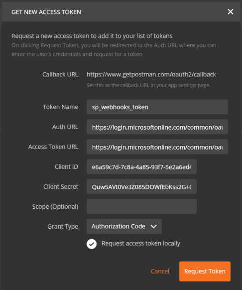
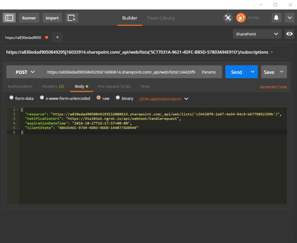

# <a name="get-started-with-sharepoint-webhooks"></a>Erste Schritte mit SharePoint-Webhooks

In diesem Artikel wird beschrieben, wie Sie eine Anwendung zum Hinzufügen und Bearbeiten von SharePoint-Webhook-Anforderungen erstellen. Sie erfahren, wie Sie SharePoint-Webhook-Anforderungen mit dem [Postman-Client](https://www.getpostman.com/) schnell erstellen und ausführen können, unter Verwendung einer einfachen ASP.NET-Web-API als Webhook-Empfänger.

Für das Beispiel in diesem Artikel werden Sie mit einfachen HTTP-Anforderungen arbeiten. Sie eignen sich ideal, um Ihnen einen ersten Einblick in die Funktionsweise von Webhooks zu geben.  

## <a name="prerequisites"></a>Voraussetzungen

Damit Sie die Schritt-für-Schritt-Anleitungen in diesem Artikel nachvollziehen können, müssen Sie die folgenden Tools herunterladen und installieren:

* [Google Chrome-Browser](http://google.com/chrome)
* [Postman](https://www.getpostman.com/)
* [Visual Studio Community Edition](https://go.microsoft.com/fwlink/?LinkId=691978&clcid=0x409)
* [ngrok](https://ngrok.com/) - Informationen zur Installation von ngrok finden Sie in Englisch unter [Download and Installation](https://ngrok.com/download) auf der ngrok-Website.
* Ein Office 365-Abonnement mit SharePoint Online. Wenn Sie neu bei Office 365 sind, können Sie sich auch [für ein Office 365-Entwicklerkonto registrieren](http://dev.office.com/devprogram).

## <a name="step-1-register-a-microsoft-azure-active-directory-ad-application-for-postman-client"></a>Schritt 1: Registrieren einer Microsoft Azure Active Directory (AD)-Anwendung für den Postman-Client

Damit der Postman-Client mit SharePoint kommunizieren kann, müssen Sie eine Azure AD-App in dem Azure AD-Mandanten registrieren, der mit Ihrem Office 365-Mandanten verknüpft ist. 

Registrieren Sie die Anwendung unbedingt als „Webanwendung“.

Für den Zugriff auf SharePoint Online ist es wichtig, der Azure AD-App Berechtigungen für die **Office 365 SharePoint Online**-Anwendung zu gewähren und die Berechtigung **read and write items and lists in all site collections** auszuwählen.

> Weitere Informationen dazu, wie Sie Azure AD-Anwendungen hinzufügen und Anwendungen Berechtigungen gewähren können, finden Sie unter [Hinzufügen einer Anwendung](https://azure.microsoft.com/en-us/documentation/articles/active-directory-integrating-applications/#adding-an-application). 

Geben Sie den folgenden Endpunkt als Antwort (Umleitungs)-URL für die App ein. An diesen Endpunkt wird Azure AD die Authentifizierungsantwort senden. Bei erfolgreicher Authentifizierung enthält diese das Zugriffstoken.

```html
https://www.getpostman.com/oauth2/callback
```

Generieren Sie auch einen „Schlüssel“, der als geheimer Clientschlüssel fungiert.

Die folgenden Eigenschaften werden in späteren Schritten benötigt. Kopieren Sie sie also an einen sicheren Ort:

* Client-ID
* Client Secret 

## <a name="step-2-build-a-webhook-receiver"></a>Schritt 2: Erstellen eines Webhook-Empfängers

In diesem Beispiel erstellen Sie den Webhook-Empfänger mit einem Visual Studio-Web-API-Projekt.

### <a name="create-a-new-aspnet-web-api-project"></a>Erstellen eines neuen ASP.NET-Web-API-Projekts

* Öffnen Sie Visual Studio.
* Wählen Sie **Datei > Neu > Projekt** aus.
* Wählen Sie im Bereich **Vorlagen** die Option **Installed Templates** aus, und erweitern Sie den Knoten **Visual C#**. 
* Wählen Sie unter **Visual C#** die Option **Web** aus. Wählen Sie aus der Liste der Projektvorlagen die Option **ASP.NET-Webanwendung** aus. 
* Nennen Sie das Projekt **SPWebhooksReceiver**, und klicken Sie auf **OK**.
* Wählen Sie im Dialogfeld **Neues ASP.NET-Projekt** die Vorlage **Web API** aus der Gruppe **ASP.NET 4.5.\*** aus. 
* Ändern Sie die Authentifizierungsoption in **Keine Authentifizierung**. Klicken Sie dazu auf die Schaltfläche **Authentifizierung ändern**.
* Klicken Sie auf **OK**, um das Web-API-Projekt zu erstellen.

> **Hinweis:** Sie können die Option **Host in the cloud** deaktivieren, da Sie dieses Projekt nicht in der Cloud bereitstellen werden.

Visual Studio erstellt nun Ihr Projekt.

### <a name="webhook-receiver"></a>Webhook-Empfänger

#### <a name="install-nuget-packages"></a>Installieren der NuGet-Pakete

Verwenden Sie die ASP.NET-Web-API-Ablaufverfolgung zur Protokollierung der eingehenden SharePoint-Anforderungen. Gehen Sie wie folgt vor, um das Paket für die Ablaufverfolgung zu installieren:

* Wechseln Sie in Visual Studio zum **Projektmappen-Explorer**.
* Öffnen Sie per Rechtsklick das Kontextmenü des Projekts, und wählen Sie **NuGet-Pakete verwalten...** aus.
* Geben Sie **Microsoft.AspNet.WebApi.Tracing** in das Suchfeld ein. 
* Wählen Sie aus den Suchergebnissen das Paket **Microsoft.AspNet.WebApi.Tracing** aus, und klicken Sie auf **Installieren**, um das Paket zu installieren.

#### <a name="spwebhooknotification-model"></a>SPWebhookNotification-Modell

Jede vom Dienst generierte Benachrichtigung wird in eine **WebhookNotification**-Instanz serialisiert. Sie müssen ein einfaches Modell erstellen, das diese Benachrichtigungsinstanz abbildet.

* Wechseln Sie in Visual Studio zum **Projektmappen-Explorer**.
* Öffnen Sie per Rechtsklick das Kontextmenü des Ordners **Models**, und wählen Sie **Hinzufügen -> Klasse** aus.
* Geben Sie **SPWebhookNotification** als Name für die Klasse ein, und klicken Sie auf **Hinzufügen**, um die Klasse zu Ihrem Projekt hinzuzufügen.
* Tragen Sie den folgenden Code in den Body der Klasse **SPWebhookNotification** ein:

    ```cs
    public string SubscriptionId { get; set; }

    public string ClientState { get; set; }

    public string ExpirationDateTime { get; set; }

    public string Resource { get; set; }

    public string TenantId { get; set; }

    public string SiteUrl { get; set; }

    public string WebId { get; set; }
    ```

#### <a name="spwebhookcontent-model"></a>SPWebhookContent-Modell

Da in einer einzigen Anforderung mehrere Benachrichtigungen an einen Webhook-Empfänger gesendet werden können, werden alle Anforderungen in einem Objekt mit einem einzigen Arraywert zusammengefasst. Erstellen Sie ein einfaches Modell, das dieses Array abbildet.

* Wechseln Sie in Visual Studio zum **Projektmappen-Explorer**.
* Öffnen Sie per Rechtsklick das Kontextmenü des Ordners **Models**, und wählen Sie **Hinzufügen -> Klasse** aus.
* Geben Sie **SPWebhookContent** als Name für die Klasse ein, und klicken Sie auf **Hinzufügen**, um die Klasse zu Ihrem Projekt hinzuzufügen.
* Tragen Sie den folgenden Code in den Body der Klasse **SPWebhookContent**ein:

    ```cs
     public List<SPWebhookNotification> Value { get; set; }
    ```

#### <a name="sharepoint-webhook-client-state"></a>SharePoint-Webhook-Clientstatus

Webhooks erlauben die Verwendung eines optionalen Zeichenfolgenwerts, der in der Benachrichtigungsmitteilung für Ihr Abonnement zurückgegeben wird. Anhand dieses Werts lässt sich verifizieren, dass die Anforderung wirklich von einer vertrauenswürdigen Quelle stammt, in diesem Fall von SharePoint. 

Fügen Sie einen Clientzustandswert hinzu, mit dem die Anwendung die eingehenden Anforderungen verifizieren kann.

* Wechseln Sie in Visual Studio zum **Projektmappen-Explorer**.
* Öffnen Sie die Datei **web.config**, und fügen Sie den folgenden Schlüssel als Clientzustand im Abschnitt `<appSettings>` hinzu:

    ```xml
    <add key="webhookclientstate" value="A0A354EC-97D4-4D83-9DDB-144077ADB449"/>
    ```

#### <a name="enable-tracing"></a>Aktivieren der Ablaufverfolgung

Aktivieren Sie in der Datei **web.config** die Ablaufverfolgung, indem Sie den folgenden Schlüssel im Element `<system.web>` im Abschnitt `<configuration>` hinzufügen:

```xml
<trace enabled="true"/>
```

Da ein Ablauf-Writer erforderlich ist, müssen Sie einen Ablauf-Writer zur Controllerkonfiguration hinzufügen. (Verwenden Sie für dieses Beispiel den Writer unter **System.Diagnostics**.)

* Wechseln Sie in Visual Studio zum **Projektmappen-Explorer**.
* Öffnen Sie **WebApiConfig.cs** im Ordner **App_Start**.
* Fügen Sie die folgende Zeile in die Methode **Register** ein:

    ```cs
    config.EnableSystemDiagnosticsTracing();
    ```

#### <a name="sharepoint-webhook-controller"></a>SharePoint-Webhook-Controller

Jetzt erstellen Sie den Webhook-Empfänger-Controller, der die eingehenden Anforderungen von SharePoint bearbeiten und die entsprechenden Aktionen einleiten wird.

* Wechseln Sie in Visual Studio zum **Projektmappen-Explorer**.
* Öffnen Sie per Rechtsklick das Kontextmenü des Ordners **Controllers**, und wählen Sie **Hinzufügen -> Controller** aus.
* Wählen Sie im Dialogfeld **Gerüst hinzufügen** die Option **Web API 2-Controller – Leer** aus.
* Klicken Sie auf **Hinzufügen**.
* Nennen Sie den Controller **SPWebhookController**, und klicken Sie auf **Hinzufügen**, um den API-Controller zu Ihrem Projekt hinzuzufügen.
* Ersetzen Sie die Anweisungen des Typs `using` durch den folgenden Code:

    ```cs
    using Newtonsoft.Json;
    using SPWebhooksReceiver.Models;
    using System.Collections.Generic;
    using System.Configuration;
    using System.Linq;
    using System.Net;
    using System.Net.Http;
    using System.Threading.Tasks;
    using System.Web;
    using System.Web.Http;
    using System.Web.Http.Tracing;
    ```

* Ersetzen Sie den Code in der Klasse **SPWebhookController** durch den folgenden Code:

    ```cs
    [HttpPost]
    public HttpResponseMessage HandleRequest()
    {
        HttpResponseMessage httpResponse = new HttpResponseMessage(HttpStatusCode.BadRequest);
        var traceWriter = Configuration.Services.GetTraceWriter();
        string validationToken = string.Empty;
        IEnumerable<string> clientStateHeader = new List<string>();
        string webhookClientState = ConfigurationManager.AppSettings["webhookclientstate"].ToString();

        if (Request.Headers.TryGetValues("ClientState", out clientStateHeader))
        {
            string clientStateHeaderValue = clientStateHeader.FirstOrDefault() ?? string.Empty;

            if (!string.IsNullOrEmpty(clientStateHeaderValue) && clientStateHeaderValue.Equals(webhookClientState))
            {
                traceWriter.Trace(Request, "SPWebhooks", 
                    TraceLevel.Info, 
                    string.Format("Received client state: {0}", clientStateHeaderValue));

                var queryStringParams = HttpUtility.ParseQueryString(Request.RequestUri.Query);

                if (queryStringParams.AllKeys.Contains("validationtoken"))
                {
                    httpResponse = new HttpResponseMessage(HttpStatusCode.OK);
                    validationToken = queryStringParams.GetValues("validationtoken")[0].ToString();
                    httpResponse.Content = new StringContent(validationToken);

                    traceWriter.Trace(Request, "SPWebhooks", 
                        TraceLevel.Info, 
                        string.Format("Received validation token: {0}", validationToken));                        
                    return httpResponse;
                }
                else
                {
                    var requestContent = Request.Content.ReadAsStringAsync().Result;

                    if (!string.IsNullOrEmpty(requestContent))
                    {
                        SPWebhookNotification notification = null;

                        try
                        {
                            var objNotification = JsonConvert.DeserializeObject<SPWebhookContent>(requestContent);
                            notification = objNotification.Value[0];
                        }
                        catch (JsonException ex)
                        {
                            traceWriter.Trace(Request, "SPWebhooks", 
                                TraceLevel.Error, 
                                string.Format("JSON deserialization error: {0}", ex.InnerException));
                            return httpResponse;
                        }

                        if (notification != null)
                        {
                            Task.Factory.StartNew(() =>
                            {
                                 //handle the notification here
                                 //you can send this to an Azure queue to be processed later
                                //for this sample, we just log to the trace

                                traceWriter.Trace(Request, "SPWebhook Notification", 
                                    TraceLevel.Info, string.Format("Resource: {0}", notification.Resource));
                                traceWriter.Trace(Request, "SPWebhook Notification", 
                                    TraceLevel.Info, string.Format("SubscriptionId: {0}", notification.SubscriptionId));
                                traceWriter.Trace(Request, "SPWebhook Notification", 
                                    TraceLevel.Info, string.Format("TenantId: {0}", notification.TenantId));
                                traceWriter.Trace(Request, "SPWebhook Notification", 
                                    TraceLevel.Info, string.Format("SiteUrl: {0}", notification.SiteUrl));
                                traceWriter.Trace(Request, "SPWebhook Notification", 
                                    TraceLevel.Info, string.Format("WebId: {0}", notification.WebId));
                                traceWriter.Trace(Request, "SPWebhook Notification", 
                                    TraceLevel.Info, string.Format("ExpirationDateTime: {0}", notification.ExpirationDateTime));

                            });

                            httpResponse = new HttpResponseMessage(HttpStatusCode.OK);
                        }
                    }
                }
            }
            else
            {
                httpResponse = new HttpResponseMessage(HttpStatusCode.Forbidden);
            }
        }

        return httpResponse;
    }
    ```

* Speichern Sie die Datei.

## <a name="step-3-debug-the-webhook-receiver"></a>Schritt 3: Debuggen des Webhook-Empfängers

* Drücken Sie **F5**, um den Webhook-Empfänger zu debuggen.
* Kopieren Sie die Portnummer aus der Adressleiste, sobald sich der Browser öffnet. Beispiel: **http://localhost:<_Portnummer_>**.

## <a name="step-4-run-ngrok-proxy"></a>Schritt 4: Ausführen des ngrok-Proxys

* Öffnen Sie ein Konsolenterminal.
* Wechseln Sie zum extrahierten ngrok-Ordner.
* Geben Sie Folgendes mit der Portnummern-URL aus dem vorherigen Schritt ein, um ngrok zu starten:

    ```
    ./ngrok http port-number --host-header=localhost:port-number
    ```

* ngrok sollte jetzt ausgeführt werden.
* Kopieren Sie die HTTPS-Adresse unter **Forwarding**. Diese Adresse wird der Dienstproxy, an den SharePoint Anforderungen sendet. 

## <a name="step-5-add-webhook-subscription-using-postman"></a>Schritt 5: Hinzufügen eines Webhook-Abonnements mit Postman

### <a name="get-new-access-token"></a>Abrufen eines neuen Zugriffstokens

Postman macht die Arbeit mit APIs sehr einfach. Im ersten Schritt konfigurieren Sie Postman für die Azure AD-Authentifizierung, damit Sie API-Anforderungen an SharePoint senden können. Dazu verwenden Sie die Azure AD-App, die Sie in Schritt 1 registriert haben.

* Öffnen Sie Postman.
* Sie sehen die **Sidebar** und den **Request Editor**.
* Gehen Sie zur Registerkarte **Authorization** im **Request Editor**.
* Wählen Sie **OAuth 2.0** aus der Dropdownliste **Type** aus.
* Klicken Sie auf die Schaltfläche **Get New Access Token**.
* Geben Sie im Dialogfenster Folgendes ein: 
    * Auth URL: 
       * **https://login.microsoftonline.com/common/oauth2/authorize?resource=https%3A%2F%2F<_your-sharepoint-tenant-url-without-https_>**
       * Tragen Sie für _your-sharepoint-site-collection-url-without-https_ Ihre Websitesammlung ohne das Präfix **https** ein.
    * Zugriffstoken-URL:
        * **https://login.microsoftonline.com/common/oauth2/token**
    * Client Id: 
        * Client-ID der App, die Sie zuvor in Schritt 1 registriert haben
    * Client Secret: 
        * Geheimer Clientschlüssel der App, die Sie zuvor in Schritt 1 registriert haben
    * Token name:
        * sp_webhooks_token
    * Grant type:
        * Authorization Code
* Wählen Sie **Request Token** aus, um sich anzumelden, zuzustimmen und das Token für die Sitzung abzurufen.
* Sobald das Token abgerufen wurde, sollte die Variable **access\_token** auf der Registerkarte **Authorization** angezeigt werden.
* Wählen Sie die Option **Add token to header** aus.
* Doppelklicken Sie auf die Variable **access\_token**, um das Token zum Header der Anforderung hinzuzufügen.



### <a name="get-documents-list-id"></a>Abrufen der ID der Liste „Dokumente“

Sie müssen die Webhooks für die Standarddokumentbibliothek verwalten, die in Ihrer Standardwebsitesammlung unter dem Namen **Dokumente** bereitgestellt wird. Senden Sie zum Abrufen der ID dieser Liste eine **GET**-Anforderung:

* Geben Sie die folgende Anforderungs-URL ein:

    ```
    https://site-collection/_api/web/lists/getbytitle('Documents')?$select=Title,Id
    ```

> Tragen Sie für _site-collection_ Ihre Websitesammlung ein.
    
Postman führt nun Ihre Anforderung aus. Ist die Ausführung erfolgreich, wird das Ergebnis angezeigt.

Kopieren Sie aus den Ergebnissen den Wert für **Id**. Den Wert **Id** verwenden Sie später zur Erstellung von Webhook-Anforderungen.   

### <a name="add-webhook-subscription"></a>Hinzufügen eines Webhook-Abonnements

Da Sie nun alle erforderlichen Informationen haben, können Sie die Abfrage und die Anforderung zum Hinzufügen eines Webhook-Abonnements erstellen. Führen Sie im Request Editor die folgenden Schritte durch:

* Ändern Sie die Anforderung in **POST** statt **GET**.
* Geben Sie die folgende Anforderungs-URL ein:

    ```
    https://site-collection/_api/web/lists('list-id')/subscriptions
    ```

> Tragen Sie für _site-collection_ Ihre Websitesammlung ein.

* Wechseln Sie zur Registerkarte **Headers**.
* Vergewissern Sie sich, dass der **Authorization**-Header übernommen wurde. Ist das nicht der Fall, müssen Sie ein neues Zugriffstoken anfordern.
* Fügen Sie die folgenden Paare des Typs **key -> value** für den Header hinzu:
    * Accept -> application/json;odata=nometadata
    * Content-Type -> application/json

* Wechseln Sie zur Registerkarte **Body**, und wählen Sie als Format **raw** aus.
* Fügen Sie den folgenden JSON-Text als Body ein:

    ```json
    {
      "resource": "https://site-collection/_api/web/lists('list-id')",
      "notificationUrl": "https://ngrok-forwarding-address/api/spwebhook/handlerequest",
      "expirationDateTime": "2016-10-27T16:17:57+00:00",
      "clientState": "A0A354EC-97D4-4D83-9DDB-144077ADB449"
    }
    ```

    

> Stellen Sie sicher, dass der Wert **expirationDateTime** höchstens 6 Monate in der Zukunft liegt, gerechnet vom aktuellen Datum. 

* Stellen Sie sicher, dass Sie den Webhook-Empfänger wie in Schritt 4 beschrieben debuggen.
* Klicken Sie auf **Send**, um die Anforderung auszuführen.
* Kann die Anforderung ausgeführt werden, sollten Sie eine Antwort von SharePoint mit den Abonnementdetails sehen. Hier ein Beispiel einer Antwort für ein neu erstelltes Abonnement:

    ```json
    {
      "clientState": "A0A354EC-97D4-4D83-9DDB-144077ADB449",
      "expirationDateTime": "2016-10-27T16:17:57Z",
      "id": "32b95d9-4d20-4a17-bfa3-2957cb38ead8",
      "notificationUrl": "https://85557d4b.ngrok.io/api/spwebhook/handlerequest",
      "resource": "c34420f9-2ad7-4e54-94c9-b67798d2299b"
    }
    ```

* Kopieren Sie den Wert **id** des Abonnements. Sie benötigen ihn für die nächsten Anforderungen.
* Gehen Sie zum Webhook-Empfänger-Projekt in Visual Studio, und schauen Sie ins Fenster **Ausgabe**. Hier sollten die Ablaufprotokolle und andere Nachrichten angezeigt werden. Die Ablaufprotokolle sollten in etwa wie diese Ablaufverfolgung aussehen:

    ```
    iisexpress.exe Information: 0 : Message='Received client state: A0A354EC-97D4-4D83-9DDB-144077ADB449'
    iisexpress.exe Information: 0 : Message='Received validation token: daf2803c-43cf-44c7-8dff-7066eaa40f13'
    ```

Die Ablaufverfolgung meldet, dass der anfänglich empfangene Webhook eine Prüfungsanforderung empfangen hat. Sie sehen im Code, dass das Prüfungstoken sofort zurückgegeben wird, so dass SharePoint die Anforderungen überprüfen kann:

```cs
if (queryStringParams.AllKeys.Contains("validationtoken"))
{
    httpResponse = new HttpResponseMessage(HttpStatusCode.OK);
    validationToken = queryStringParams.GetValues("validationtoken")[0].ToString();
    httpResponse.Content = new StringContent(validationToken);

    traceWriter.Trace(Request, "SPWebhooks", 
        TraceLevel.Info, 
        string.Format("Received validation token: {0}", validationToken));                        
    return httpResponse;
}
```

## <a name="step-6-get-subscription-details"></a>Schritt 6: Abrufen der Abonnementdetails

Jetzt führen Sie Abfragen in Postman aus, um die Abonnementdetails abzurufen.

* Öffnen Sie den Postman-Client.
* Ändern Sie die Anforderung in **GET** statt **POST**.
* Geben Sie Folgendes als Anforderung ein:

    ```
    https://site-collection/_api/web/lists('list-id')/subscriptions
    ```

> Tragen Sie für _site-collection_ Ihre Websitesammlung ein.

* Klicken Sie auf **Send**, um die Anforderung auszuführen.

Kann die Anforderung ausgeführt werden, gibt SharePoint die Abonnements für diese Listenressource zurück. Da Sie gerade eins hinzugefügt haben, sollte mindestens ein Abonnement zurückgegeben werden. Hier ein Beispiel für eine Antwort mit einem Abonnement:

    ```json
    {
      "value": [
        {
          "clientState": "A0A354EC-97D4-4D83-9DDB-144077ADB449",
          "expirationDateTime": "2016-10-27T16:17:57Z",
          "id": "32b95add-4d20-4a17-bfa3-2957cb38ead8",
          "notificationUrl": "https://85557d4b.ngrok.io/api/spwebhook/handlerequest",
          "resource": "c34420f9-2a67-4e54-94c9-b67798229f9b"
        }
      ]
    }
    ```

Mit der folgenden Abfrage können Sie die Details dieses Abonnements abrufen:

    ```
    https://site-collection/_api/web/lists('list-id')/subscriptions('subscription-id')
    ```

> Tragen Sie für „subscription-id“ Ihre Abonnement-ID ein. 

## <a name="step-7-test-webhook-notification"></a>Schritt 7: Testen der Webhook-Benachrichtigungen

Nun fügen Sie eine Datei zur Bibliothek „Dokumente“ hinzu und testen, ob Sie im Webhook-Empfänger eine Benachrichtigung von SharePoint erhalten.

* Wechseln Sie zu Visual Studio.
* Platzieren Sie im **SPWebhookController** einen Breakpoint in der folgenden Codezeile:

    ```cs
    var requestContent = Request.Content.ReadAsStringAsync().Result;
    ```

* Gehen Sie zur Bibliothek **Dokumente**. In Ihrer Standardwebsitesammlung ist dies die Bibliothek **Freigegebene Dokumente**.
* Fügen Sie eine neue Datei hinzu.
* Gehen Sie zu Visual Studio, und warten Sie, bis der Breakpoint erreicht wird.
   * Die Wartezeit kann zwischen einigen Sekunden und 5 Minuten betragen. In dem Moment, in dem der Breakpoint erreicht ist, hat der Webhook-Empfänger eine Benachrichtigung von SharePoint erhalten.
* Drücken Sie auf **F5**, um fortzufahren.
* Die Benachrichtigungsdaten finden Sie im Fenster **Ausgabe** in den folgenden Einträgen, da Sie sie zum Ablaufprotokoll hinzugefügt haben:

    ```
    iisexpress.exe Information: 0 : Message='Resource: c34420f9-2a67-4e54-94c9-b6770892299b'
    iisexpress.exe Information: 0 : Message='SubscriptionId: 32b95ad9-4d20-4a17-bfa3-2957cb38ead8'
    iisexpress.exe Information: 0 : Message='TenantId: 7a17cb7d-6898-423f-8839-45f363076f06'
    iisexpress.exe Information: 0 : Message='SiteUrl: /'
    iisexpress.exe Information: 0 : Message='WebId: 62b80e0b-f889-4974-a519-cc138413be40'
    iisexpress.exe Information: 0 : Message='ExpirationDateTime: 2016-10-27T16:17:57.0000000Z'
    ```

Dieses Projekt schreibt die Informationen nur ins Ablaufprotokoll. Im Empfänger werden die Informationen jedoch an eine Tabelle oder eine Warteschlange gesendet, die die empfangenen Daten verarbeiten und die von SharePoint gesendeten Informationen auswerten kann. 

Mit diesen Daten können Sie die URL erstellen und über die [GetChanges](https://msdn.microsoft.com/de-de/library/office/dn531433.aspx#bk_ListGetChanges)-API die neuesten Änderungen abrufen.

## <a name="next-steps"></a>Nächste Schritte

In diesem Artikel haben Sie mithilfe des Postman-Clients und einer einfachen Web-API Webhook-Benachrichtigungen von SharePoint abonniert und empfangen.

Sehen Sie sich als nächstes die [Beispielreferenzimplementierung für SharePoint-Webhooks](./webhooks-reference-implementation) an. Sie gibt ein End-to-End-Beispiel, das Azure-Speicherwarteschlangen verwendet, um die Informationen zu verarbeiten, Änderungen von SharePoint abzurufen und diese Änderungen an eine SharePoint-Liste zurückzusenden.
