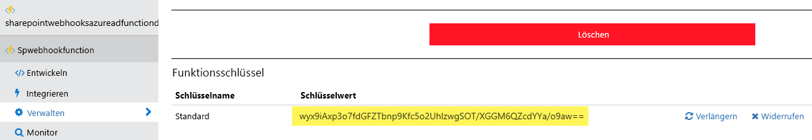

Zur Vermeidung der unbefugten Verwendung Ihrer Azure-Funktion muss der Anrufer einen Code eingeben, wenn er die Funktion aufruft. Dieser Code kann über den Bildschirm **Verwalten** abgerufen werden:To avoid unathorized usage of your Azure Function the caller will need to specify a code when calling your function. This code can be retreived via the **Manage** screen:](../../../images/webhook-azure-function8.png)

Zur Vermeidung der unbefugten Verwendung Ihrer Azure-Funktion muss der Anrufer einen Code eingeben, wenn er die Funktion aufruft. Dieser Code kann über den Bildschirm **Verwalten** abgerufen werden:

In unserem Fall lautet die zu verwendende Webhook-URL also wie folgt: `https://pnp-functions.azurewebsites.net/api/spwebhookfunction?code=wyx9iAxp3o7fdGFZTbnp9Kfc5o2UhlzwgSOT/XGGM6QZcdYYa/o9aw==`So in our case the webhook URL to use is the following: `https://pnp-functions.azurewebsites.net/api/spwebhookfunction?code=wyx9iAxp3o7fdGFZTbnp9Kfc5o2UhlzwgSOT/XGGM6QZcdYYa/o9aw==`

