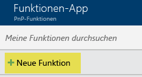
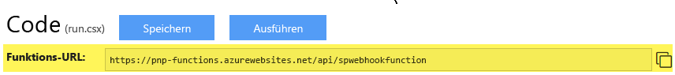

# <a name="using-azure-functions-with-sharepoint-webhooks"></a><span data-ttu-id="630cd-102">Verwenden von Azure-Funktionen für SharePoint-Webhooks</span><span class="sxs-lookup"><span data-stu-id="630cd-102">Using Azure Functions with SharePoint webhooks</span></span>
<span data-ttu-id="630cd-103">[Azure-Funktionen](https://docs.microsoft.com/de-DE/azure/azure-functions/functions-overview) bieten eine einfache Möglichkeit zum Hosten Ihrer SharePoint-Webhooks: Sie können einfach den C#- oder Javascript-Code Ihres Webhooks über den Browser hinzufügen und Azure kümmert sich um das Hosting und die Skalierung Ihrer Funktion.</span><span class="sxs-lookup"><span data-stu-id="630cd-103">[Azure functions](https://docs.microsoft.com/de-DE/azure/azure-functions/functions-overview) offer an easy way to host your SharePoint webhooks: you can simply add your webhook C# or Javascript code via the browser and Azure will take care of the hosting and scaling of your function!</span></span> <span data-ttu-id="630cd-104">Dieses Handbuch zeigt die Einrichtung und Verwendung von Azure-Funktionen für Webhooks.</span><span class="sxs-lookup"><span data-stu-id="630cd-104">This guide shows how to setup and use Azure Functions for your webhooks.</span></span>

## <a name="create-a-an-azure-function-app"></a><span data-ttu-id="630cd-105">Erstellen einer Azure-Funktionsapp</span><span class="sxs-lookup"><span data-stu-id="630cd-105">Create a an Azure Function App</span></span>
<span data-ttu-id="630cd-106">Im ersten Schritt müssen Sie eine Azure-Funktionsapp erstellen. Dies ist eine besondere Art von Azure-Webapp, die auf das Hosten von Azure-Funktionen ausgerichtet ist.</span><span class="sxs-lookup"><span data-stu-id="630cd-106">The first step you'll need to do is creating an Azure Function App, which is a special kind of Azure Web App focused on hosting Azure Functions.</span></span> <span data-ttu-id="630cd-107">Navigieren Sie zu [https://portal.azure.com](https://portal.azure.com), klicken Sie auf „Neu“ und suchen Sie nach „Funktionsapp“:</span><span class="sxs-lookup"><span data-stu-id="630cd-107">Navigate to [https://portal.azure.com](https://portal.azure.com), click on the "New" and search for "Function app":</span></span>


<span data-ttu-id="630cd-109">Wählen Sie „Funktionsapp“ und geben Sie die erforderlichen Informationen zum Erstellen der Funktionsapp ein:</span><span class="sxs-lookup"><span data-stu-id="630cd-109">Select "Function App" and complete the information needed to create the Function App:</span></span>


## <a name="create-an-azure-function"></a><span data-ttu-id="630cd-111">Erstellen einer Azure-Funktion</span><span class="sxs-lookup"><span data-stu-id="630cd-111">Create an Azure Function</span></span>
<span data-ttu-id="630cd-112">Nun ist die App zum Hosten der Funktionen fertiggestellt. Fahren Sie mit dem Erstellen der ersten Azure-Funktion fort, indem Sie auf den Link „Neue Funktion“ klicken.</span><span class="sxs-lookup"><span data-stu-id="630cd-112">Now that the app to host the functions is ready you can continue with creating your first Azure Function by clicking on the "New Function" link:</span></span>



<span data-ttu-id="630cd-114">Damit können Sie die Funktion von einer Vorlage aus starten. Bei SharePoint-Webhooks benötigen wir eine durch HTTP ausgelöste Funktion, und da wir in unserem Beispiel C#-Code schreiben, verwenden wir die Funktionsvorlage **HttpTrigger-CSharp**.</span><span class="sxs-lookup"><span data-stu-id="630cd-114">This will offer you to start your function from a template, in the case of SharePoint webhooks we will need a HTTP triggered function and since we'll be writing C# code in our sample this means we're using the **HttpTrigger-CSharp** function template.</span></span> <span data-ttu-id="630cd-115">Da SharePoint-Webhookdienste anonym aufrufbar sein müssen, müssen Sie die **Berechtigungsstufe** in **Anonym** ändern.</span><span class="sxs-lookup"><span data-stu-id="630cd-115">Given that SharePoint webhook services need to be anonymously callable it's important to switch the **Authorization level** to **Anonymous**.</span></span>


> [!NOTE]
> - <span data-ttu-id="630cd-117">Die Vorlage **GenericWebHook** funktioniert derzeit noch nicht für SharePoint-Webhooks, dieses Problem wird vom SharePoint-Produktteam jedoch demnächst behoben.</span><span class="sxs-lookup"><span data-stu-id="630cd-117">Using the **GenericWebHook** template currently does not yet work for SharePoint webhooks but the SharePoint product team is aware of this problem and will address it.</span></span>
> - <span data-ttu-id="630cd-118">Wenn Fehlermeldungen vom Typ „Fehler beim Validieren der Benachrichtigungs-URL“ beim Verwenden des Webhooks der Azure-Funktion, können Sie dieses Problem möglicherweise lösen, indem Sie die Berechtigungsstufe auf **Funktion** festlegen und die Funktion für den anonymen Zugriff definieren.</span><span class="sxs-lookup"><span data-stu-id="630cd-118">If you get "Failed to validate the notification URL" errors when using your Azure function based webhook you might be able to resolve this by setting the Authorization level to **Function** and define your function for anonymous access</span></span>

<span data-ttu-id="630cd-119">Das Ergebnis ist eine in C# geschriebene „standardmäßige“ Azure-Funktion </span><span class="sxs-lookup"><span data-stu-id="630cd-119">The result will be a "default" Azure Function written in C# </span></span>

<span data-ttu-id="630cd-120">In unserem Fall soll sich diese Azure-Funktion wie ein SharePoint-Webhookdienst verhalten. Daher müssen wir Folgendes in C# implementieren:</span><span class="sxs-lookup"><span data-stu-id="630cd-120">In our case we want this Azure Function to behave as a SharePoint webhook service, so we'll need to implement the following in C#:</span></span>
- <span data-ttu-id="630cd-121">Rückgabe des Validationtoken an den Aufruf, falls als URL-Parameter angegeben.</span><span class="sxs-lookup"><span data-stu-id="630cd-121">Return the validationtoken if specified as URL parameter to the call.</span></span> <span data-ttu-id="630cd-122">Dies ist erforderlich, wie [hier](./lists/create-subscription.md) beschrieben. SharePoint erwartet, dass die Antwort innerhalb von 5 Sekunden erfolgt.</span><span class="sxs-lookup"><span data-stu-id="630cd-122">This is needed as described [here](./lists/create-subscription.md) and SharePoint expects the reply to happen within 5 seconds.</span></span> 
- <span data-ttu-id="630cd-p105">Verarbeiten der JSON-Webhook-Benachrichtigung. Im nachfolgenden Beispiel haben wir uns entschieden, die JSON-Benachrichtigung in einer Speicherwarteschlange zu speichern, sodass sie von einem Azure-Webauftrag aufgenommen und asynchron verarbeitet werden kann. Je nach Ihren Anforderungen können Sie die Benachrichtigung auch direkt im Webhook-Dienst verarbeiten. Alle Aufrufe des Webhook-Diensts müssen jedoch innerhalb von 5 Sekunden ausgeführt werden, deshalb sollte ein asynchrones Modell verwendet werden.</span><span class="sxs-lookup"><span data-stu-id="630cd-p105">Process the JSON webhook notification. In below sample we've opted to store the JSON in a storage queue so that an Azure Web Job can pick it up and process it asynchronously. Depending on your needs you could also process the notification directly in your webhook service, but keep in mind that all webhook service calls need to complete in 5 seconds, hence using an asynchronous model is recommended</span></span>

<span data-ttu-id="630cd-126">Dies erzielen Sie, indem Sie den Standardcode durch den nachstehenden Code ersetzen. Geben Sie die Verbindungszeichenfolge für das Speicherkonto ein und aktualisieren Sie den Namen der Warteschlange, wenn Sie eine andere verwenden:</span><span class="sxs-lookup"><span data-stu-id="630cd-126">You can achieve above by replacing the default code by below code (please enter your storage account connection string and update the queue name if you're using a different one):</span></span>

```
#r "Newtonsoft.Json"
#r "Microsoft.WindowsAzure.Storage"

using System;
using System.Net;
using Newtonsoft.Json;
using Microsoft.WindowsAzure;
using Microsoft.WindowsAzure.Storage;
using Microsoft.WindowsAzure.Storage.Queue;

public static async Task<object> Run(HttpRequestMessage req, TraceWriter log)
{
    log.Info($"Webhook was triggered!");

    // Grab the validationToken URL parameter
    string validationToken = req.GetQueryNameValuePairs()
        .FirstOrDefault(q => string.Compare(q.Key, "validationtoken", true) == 0)
        .Value;
    
    // If a validation token is present, we need to respond within 5 seconds by  
    // returning the given validation token. This only happens when a new 
    // web hook is being added
    if (validationToken != null)
    {
      log.Info($"Validation token {validationToken} received");
      var response = req.CreateResponse(HttpStatusCode.OK);
      response.Content = new StringContent(validationToken);
      return response;
    }

    log.Info($"SharePoint triggered our webhook...great :-)");
    var content = await req.Content.ReadAsStringAsync();
    log.Info($"Received following payload: {content}");

    var notifications = JsonConvert.DeserializeObject<ResponseModel<NotificationModel>>(content).Value;
    log.Info($"Found {notifications.Count} notifications");

    if (notifications.Count > 0)
    {
        log.Info($"Processing notifications...");
        foreach(var notification in notifications)
        {
            CloudStorageAccount storageAccount = CloudStorageAccount.Parse("<YOUR STORAGE ACCOUNT>");
            // Get queue... create if does not exist.
            CloudQueueClient queueClient = storageAccount.CreateCloudQueueClient();
            CloudQueue queue = queueClient.GetQueueReference("sharepointlistwebhookeventazuread");
            queue.CreateIfNotExists();

            // add message to the queue
            string message = JsonConvert.SerializeObject(notification);
            log.Info($"Before adding a message to the queue. Message content: {message}");
            queue.AddMessage(new CloudQueueMessage(message));
            log.Info($"Message added :-)");
        }
    }

    // if we get here we assume the request was well received
    return new HttpResponseMessage(HttpStatusCode.OK);
}


// supporting classes
public class ResponseModel<T>
{
    [JsonProperty(PropertyName = "value")]
    public List<T> Value { get; set; }
}

public class NotificationModel
{
    [JsonProperty(PropertyName = "subscriptionId")]
    public string SubscriptionId { get; set; }

    [JsonProperty(PropertyName = "clientState")]
    public string ClientState { get; set; }

    [JsonProperty(PropertyName = "expirationDateTime")]
    public DateTime ExpirationDateTime { get; set; }

    [JsonProperty(PropertyName = "resource")]
    public string Resource { get; set; }

    [JsonProperty(PropertyName = "tenantId")]
    public string TenantId { get; set; }

    [JsonProperty(PropertyName = "siteUrl")]
    public string SiteUrl { get; set; }

    [JsonProperty(PropertyName = "webId")]
    public string WebId { get; set; }
}

public class SubscriptionModel
{
    [JsonProperty(NullValueHandling = NullValueHandling.Ignore)]
    public string Id { get; set; }

    [JsonProperty(PropertyName = "clientState", NullValueHandling = NullValueHandling.Ignore)]
    public string ClientState { get; set; }

    [JsonProperty(PropertyName = "expirationDateTime")]
    public DateTime ExpirationDateTime { get; set; }

    [JsonProperty(PropertyName = "notificationUrl")]
    public string NotificationUrl {get;set;}

    [JsonProperty(PropertyName = "resource", NullValueHandling = NullValueHandling.Ignore)]
    public string Resource { get; set; }
}
```

## <a name="configure-your-azure-function"></a><span data-ttu-id="630cd-127">Konfigurieren der Azure-Funktion</span><span class="sxs-lookup"><span data-stu-id="630cd-127">Configure your Azure Function</span></span>
<span data-ttu-id="630cd-128">Da wir mit der richtigen Vorlage begonnen haben, ist die  Konfiguration nahezu abgeschlossen. Jetzt müssen Sie nur noch die **Zulässigen HTTP-Methoden** in **Ausgewählte Methoden** ändern und nur die HTTP-Methode **POST** zulassen.</span><span class="sxs-lookup"><span data-stu-id="630cd-128">Since we've chosen the correct template to start from our configuration is almost complete, the only thing you need to still do is to switch the **Allowed HTTP methods** to **Selected methods** and then only allow the **POST** HTTP method.</span></span> <span data-ttu-id="630cd-129">Prüfen Sie auch noch einmal, ob der **Modus** **Standard** lautet und die **Berechtigungsstufe** auf **Anonym** festgelegt ist.</span><span class="sxs-lookup"><span data-stu-id="630cd-129">Also cross check that **Mode** is equal to **Standard** and **Authorization level** is set to **Anonymous**.</span></span>


## <a name="test-your-azure-function"></a><span data-ttu-id="630cd-131">Testen der Azure-Funktion</span><span class="sxs-lookup"><span data-stu-id="630cd-131">Test your Azure Function</span></span>
<span data-ttu-id="630cd-132">Nun können Sie den ersten Test Ihrer Azure-Funktion durchführen: Navigieren Sie zum Bildschirm **Entwicklung**.</span><span class="sxs-lookup"><span data-stu-id="630cd-132">You're now all set for your first Azure Function test: navigate to the **Develop** screen.</span></span> <span data-ttu-id="630cd-133">Klicken Sie auf das Symbol **Test**, um den Testbereich auf der rechten Seite zu öffnen. Fügen Sie den URL-Parameter „validationtoken“ mit einer beliebigen Zeichenfolge als Wert hinzu.</span><span class="sxs-lookup"><span data-stu-id="630cd-133">Click on the **Test** icon to pop-up the test pane at the right side, add a URL parameter "validationtoken" with a random string as value.</span></span> <span data-ttu-id="630cd-134">Mit diesem Setup imitieren wir das Verhalten von SharePoint, das bei der Überprüfung einer neuen Webhook-Ergänzung den Webhook-Dienst aufruft.</span><span class="sxs-lookup"><span data-stu-id="630cd-134">Using this setup we're mimicking the behavior of SharePoint calling your web hook service when validating a new webhook addition.</span></span> <span data-ttu-id="630cd-135">Klicken Sie zum Testen auf **Ausführen**. Bei erfolgreicher Ausführung sehen Sie im Protokollbereich, dass der Dienst aufgerufen wurde und den übergebenen Wert mit einer HTTP 200-Antwort zurückgegeben hat.</span><span class="sxs-lookup"><span data-stu-id="630cd-135">Click on **Run** to test...if everything goes well you'll see in the logs section that your service was called and that it returned the passed value with a HTTP 200 response:</span></span>


## <a name="grab-the-webhook-url-to-use-in-your-implementation"></a><span data-ttu-id="630cd-137">Verwenden Sie die Webhook-URL für Ihre Implementierung.</span><span class="sxs-lookup"><span data-stu-id="630cd-137">Grab the webhook URL to use in your implementation</span></span>
<span data-ttu-id="630cd-p108">SharePoint muss die Webhook-URL kennen, die wir verwenden. Dazu kopieren wir die URL der Azure-Funktion:</span><span class="sxs-lookup"><span data-stu-id="630cd-p108">We'll need to let SharePoint now what webhook URL we're using. To so let's start by copying the Azure Function URL:</span></span>



<span data-ttu-id="630cd-141">Zur Vermeidung der unbefugten Verwendung Ihrer Azure-Funktion muss der Anrufer einen Code eingeben, wenn er die Funktion aufruft.</span><span class="sxs-lookup"><span data-stu-id="630cd-141">To avoid unathorized usage of your Azure Function the caller will need to specify a code when calling your function.</span></span> <span data-ttu-id="630cd-142">Dieser Code kann über den Bildschirm **Verwalten** abgerufen werden:</span><span class="sxs-lookup"><span data-stu-id="630cd-142">This code can be retreived via the **Manage** screen:</span></span>


<span data-ttu-id="630cd-144">In unserem Fall lautet die zu verwendende Webhook-URL also wie folgt: `https://pnp-functions.azurewebsites.net/api/spwebhookfunction?code=wyx9iAxp3o7fdGFZTbnp9Kfc5o2UhlzwgSOT/XGGM6QZcdYYa/o9aw==`</span><span class="sxs-lookup"><span data-stu-id="630cd-144">So in our case the webhook URL to use is the following: `https://pnp-functions.azurewebsites.net/api/spwebhookfunction?code=wyx9iAxp3o7fdGFZTbnp9Kfc5o2UhlzwgSOT/XGGM6QZcdYYa/o9aw==`</span></span>


