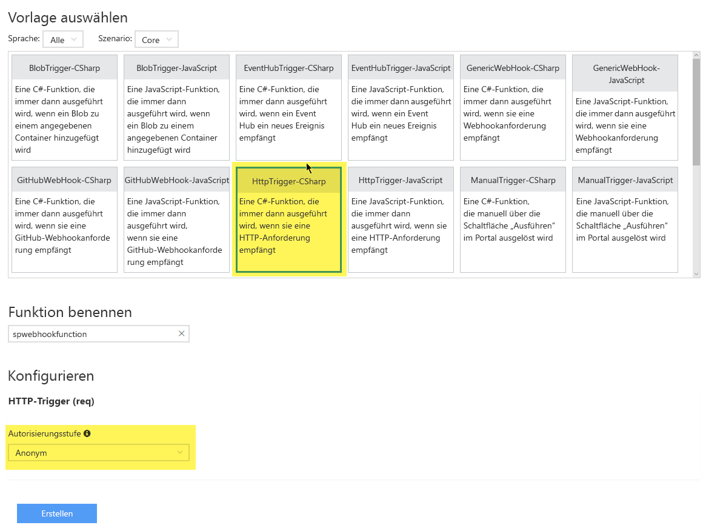
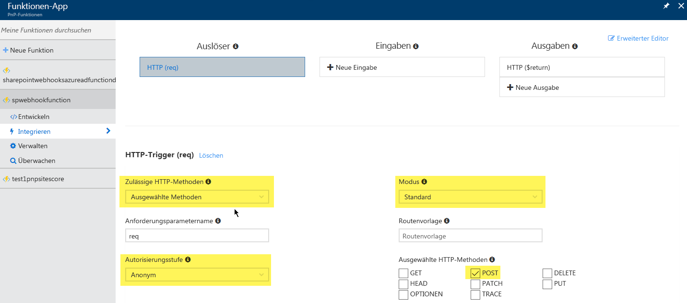

# <a name="using-azure-functions-with-sharepoint-webhooks"></a>Verwenden von Azure-Funktionen für SharePoint-Webhooks
[Azure-Funktionen](https://docs.microsoft.com/en-us/azure/azure-functions/functions-overview) bieten eine einfache Möglichkeit zum Hosten Ihrer SharePoint-Webhooks: Sie können einfach den C#- oder Javascript-Code Ihres Webhooks über den Browser hinzufügen und Azure kümmert sich um das Hosting und die Skalierung Ihrer Funktion. Dieses Handbuch zeigt die Einrichtung und Verwendung von Azure-Funktionen für Webhooks.

## <a name="create-a-an-azure-function-app"></a>Erstellen einer Azure-Funktionsapp
Im ersten Schritt müssen Sie eine Azure-Funktionsapp erstellen. Dies ist eine besondere Art von Azure-Webapp, die auf das Hosten von Azure-Funktionen ausgerichtet ist. Navigieren Sie zu [https://portal.azure.com](https://portal.azure.com), klicken Sie auf „Neu“ und suchen Sie nach „Funktionsapp“:


Wählen Sie „Funktionsapp“ und geben Sie die erforderlichen Informationen zum Erstellen der Funktionsapp ein:


## <a name="create-an-azure-function"></a>Erstellen einer Azure-Funktion
Nun ist die App zum Hosten der Funktionen fertiggestellt. Fahren Sie mit dem Erstellen der ersten Azure-Funktion fort, indem Sie auf den Link „Neue Funktion“ klicken.


Damit können Sie die Funktion von einer Vorlage aus starten. Bei SharePoint-Webhooks benötigen wir eine durch HTTP ausgelöste Funktion, und da wir in unserem Beispiel C#-Code schreiben, verwenden wir die Funktionsvorlage **HttpTrigger-CSharp**. Da SharePoint-Webhookdienste anonym aufrufbar sein müssen, müssen Sie die **Berechtigungsstufe** in **Anonym** ändern.



>**Hinweis:**
> - Die Vorlage **GenericWebHook** funktioniert derzeit noch nicht für SharePoint-Webhooks, dieses Problem wird vom SharePoint-Produktteam jedoch demnächst behoben.
> - Wenn Fehlermeldungen vom Typ „Fehler beim Validieren der Benachrichtigungs-URL“ beim Verwenden des Webhooks der Azure-Funktion, können Sie dieses Problem möglicherweise lösen, indem Sie die Berechtigungsstufe auf **Funktion** festlegen und die Funktion für den anonymen Zugriff definieren.

Das Ergebnis ist eine in C# geschriebene „standardmäßige“ Azure-Funktion 

In unserem Fall soll sich diese Azure-Funktion wie ein SharePoint-Webhookdienst verhalten. Daher müssen wir Folgendes in C# implementieren:
- Rückgabe des Validationtoken an den Aufruf, falls als URL-Parameter angegeben. Dies ist erforderlich, wie [hier](./lists/create-subscription.md) beschrieben. SharePoint erwartet, dass die Antwort innerhalb von 5 Sekunden erfolgt. 
- Verarbeiten der JSON-Webhook-Benachrichtigung. Im nachfolgenden Beispiel haben wir uns entschieden, die JSON-Benachrichtigung in einer Speicherwarteschlange zu speichern, sodass sie von einem Azure-Webauftrag aufgenommen und asynchron verarbeitet werden kann. Je nach Ihren Anforderungen können Sie die Benachrichtigung auch direkt im Webhook-Dienst verarbeiten. Alle Aufrufe des Webhook-Diensts müssen jedoch innerhalb von 5 Sekunden ausgeführt werden, deshalb sollte ein asynchrones Modell verwendet werden.

Dies erzielen Sie, indem Sie den Standardcode durch den nachstehenden Code ersetzen. Geben Sie die Verbindungszeichenfolge für das Speicherkonto ein und aktualisieren Sie den Namen der Warteschlange, wenn Sie eine andere verwenden:

```
#r "Newtonsoft.Json"
#r "Microsoft.WindowsAzure.Storage"

using System;
using System.Net;
using Newtonsoft.Json;
using Microsoft.WindowsAzure;
using Microsoft.WindowsAzure.Storage;
using Microsoft.WindowsAzure.Storage.Queue;

public static async Task<object> Run(HttpRequestMessage req, TraceWriter log)
{
    log.Info($"Webhook was triggered!");

    // Grab the validationToken URL parameter
    string validationToken = req.GetQueryNameValuePairs()
        .FirstOrDefault(q => string.Compare(q.Key, "validationtoken", true) == 0)
        .Value;
    
    // If a validation token is present, we need to respond within 5 seconds by  
    // returning the given validation token. This only happens when a new 
    // web hook is being added
    if (validationToken != null)
    {
      log.Info($"Validation token {validationToken} received");
      var response = req.CreateResponse(HttpStatusCode.OK);
      response.Content = new StringContent(validationToken);
      return response;
    }

    log.Info($"SharePoint triggered our webhook...great :-)");
    var content = await req.Content.ReadAsStringAsync();
    log.Info($"Received following payload: {content}");

    var notifications = JsonConvert.DeserializeObject<ResponseModel<NotificationModel>>(content).Value;
    log.Info($"Found {notifications.Count} notifications");

    if (notifications.Count > 0)
    {
        log.Info($"Processing notifications...");
        foreach(var notification in notifications)
        {
            CloudStorageAccount storageAccount = CloudStorageAccount.Parse("<YOUR STORAGE ACCOUNT>");
            // Get queue... create if does not exist.
            CloudQueueClient queueClient = storageAccount.CreateCloudQueueClient();
            CloudQueue queue = queueClient.GetQueueReference("sharepointlistwebhookeventazuread");
            queue.CreateIfNotExists();

            // add message to the queue
            string message = JsonConvert.SerializeObject(notification);
            log.Info($"Before adding a message to the queue. Message content: {message}");
            queue.AddMessage(new CloudQueueMessage(message));
            log.Info($"Message added :-)");
        }
    }

    // if we get here we assume the request was well received
    return new HttpResponseMessage(HttpStatusCode.OK);
}


// supporting classes
public class ResponseModel<T>
{
    [JsonProperty(PropertyName = "value")]
    public List<T> Value { get; set; }
}

public class NotificationModel
{
    [JsonProperty(PropertyName = "subscriptionId")]
    public string SubscriptionId { get; set; }

    [JsonProperty(PropertyName = "clientState")]
    public string ClientState { get; set; }

    [JsonProperty(PropertyName = "expirationDateTime")]
    public DateTime ExpirationDateTime { get; set; }

    [JsonProperty(PropertyName = "resource")]
    public string Resource { get; set; }

    [JsonProperty(PropertyName = "tenantId")]
    public string TenantId { get; set; }

    [JsonProperty(PropertyName = "siteUrl")]
    public string SiteUrl { get; set; }

    [JsonProperty(PropertyName = "webId")]
    public string WebId { get; set; }
}

public class SubscriptionModel
{
    [JsonProperty(NullValueHandling = NullValueHandling.Ignore)]
    public string Id { get; set; }

    [JsonProperty(PropertyName = "clientState", NullValueHandling = NullValueHandling.Ignore)]
    public string ClientState { get; set; }

    [JsonProperty(PropertyName = "expirationDateTime")]
    public DateTime ExpirationDateTime { get; set; }

    [JsonProperty(PropertyName = "notificationUrl")]
    public string NotificationUrl {get;set;}

    [JsonProperty(PropertyName = "resource", NullValueHandling = NullValueHandling.Ignore)]
    public string Resource { get; set; }
}
```

## <a name="configure-your-azure-function"></a>Konfigurieren der Azure-Funktion
Da wir mit der richtigen Vorlage begonnen haben, ist die  Konfiguration nahezu abgeschlossen. Jetzt müssen Sie nur noch die **Zulässigen HTTP-Methoden** in **Ausgewählte Methoden** ändern und nur die HTTP-Methode **POST** zulassen. Prüfen Sie auch noch einmal, ob der **Modus** **Standard** lautet und die **Berechtigungsstufe** auf **Anonym** festgelegt ist.



## <a name="test-your-azure-function"></a>Testen der Azure-Funktion
Nun können Sie den ersten Test Ihrer Azure-Funktion durchführen: Navigieren Sie zum Bildschirm **Entwicklung**. Klicken Sie auf das Symbol **Test**, um den Testbereich auf der rechten Seite zu öffnen. Fügen Sie den URL-Parameter „validationtoken“ mit einer beliebigen Zeichenfolge als Wert hinzu. Mit diesem Setup imitieren wir das Verhalten von SharePoint, das bei der Überprüfung einer neuen Webhook-Ergänzung den Webhook-Dienst aufruft. Klicken Sie zum Testen auf **Ausführen**. Bei erfolgreicher Ausführung sehen Sie im Protokollbereich, dass der Dienst aufgerufen wurde und den übergebenen Wert mit einer HTTP 200-Antwort zurückgegeben hat.


## <a name="grab-the-webhook-url-to-use-in-your-implementation"></a>Verwenden Sie die Webhook-URL für Ihre Implementierung.
SharePoint muss die Webhook-URL kennen, die wir verwenden. Dazu kopieren wir die URL der Azure-Funktion:


Zur Vermeidung der unbefugten Verwendung Ihrer Azure-Funktion muss der Anrufer einen Code eingeben, wenn er die Funktion aufruft. Dieser Code kann über den Bildschirm **Verwalten** abgerufen werden:


In unserem Fall lautet die zu verwendende Webhook-URL also wie folgt: `https://pnp-functions.azurewebsites.net/api/spwebhookfunction?code=wyx9iAxp3o7fdGFZTbnp9Kfc5o2UhlzwgSOT/XGGM6QZcdYYa/o9aw==`


