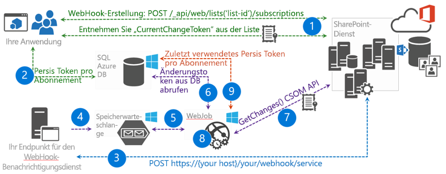

# <a name="sharepoint-webhooks-sample-reference-implementation"></a>SharePoint-Webhooks – Beispielreferenzimplementierung

**Mitwirkende(r)**: Bert Jansen (Microsoft), SharePoint PnP-Kernteam

Die Implementierung des SharePoint Patterns and Practices (PnP)-Referenz zeigt, wie Sie SharePoint-Webhooks in der Anwendung verwenden können. Die Webhooks werden auf sofort im Unternehmen einsetzbare Weise mit verschiedenen Microsoft Azure-Komponenten, wie z. B. Azure-Webaufträge, Azure SQL Server und Azure Storage-Warteschlangen, für die Verarbeitung asynchroner Webauftragsbenachrichtigung implementiert.

Die Referenzimplementierung funktioniert nur mit [SharePoint-Listenwebhooks](./lists/overview-sharepoint-list-webhooks.md). 

Sie finden diese Schritte auch im Video im [YouTube-Kanal „SharePoint Patterns & Practices“](https://www.youtube.com/watch?v=j3hWCAI9R20):

<a href="https://www.youtube.com/watch?v=j3hWCAI9R20">

</a>

## <a name="applies-to"></a>Gilt für

-  Office 365 mit mehreren Mandanten (MT).

## <a name="prerequisites"></a>Voraussetzungen

Microsoft Azure wird zum Hosten der verschiedenen Komponenten verwendet, die zum Implementieren von Azure-Webhooks erforderlich sind.

## <a name="source-code-for-this-reference-implementation"></a>Quellcode für diese Referenzimplementierung

Quellcode und andere Materialien, die für die Referenzimplementierung in zwei Varianten zur Verfügung stehen: Es gibt eine vom SharePoint-Anbieter gehostete Anwendungsversion und eine Office 365-Azure AD-Anwendung, die im [SharePoint Developer Beispiele GitHub Repository](https://aka.ms/sp-webhooks-sample-reference) gefunden werden kann. 

## <a name="deploying-the-reference-implementation"></a>Bereitstellen der Referenzimplementierung

Die Anwendung zeigt Ihnen das Verwalten von Webhooks, speziell für eine SharePoint-Liste. Darüber hinaus enthält sie eine Referenzimplementierung eines Webhook-Dienstendpunkts, die Sie in Ihren Webhook-Projekten wiederverwenden können. 


Im [Bereitstellungshandbuch zur SharePoint-Webhooks-Referenzimplementierung](https://github.com/SharePoint/sp-dev-samples/blob/master/Samples/WebHooks.List/Deployment%20guide.md) werden die Bereitstellungsschritte aufgelistet, die zum Bereitstellen der vom SharePoint-Anbieter gehosteten Referenzimplementierung verwendet werden. Verwenden Sie die [hier](https://github.com/SharePoint/sp-dev-samples/blob/master/Samples/WebHooks.List.AzureAD/Deployment%20guide.md) beschriebenen Schritte zur Bereitstellung der Office 365 Azure AD-Anwendung. Im Bereitstellungshandbuch wird gezeigt, wie Sie eine Web-API-Funktion als Webhook-Dienst verwenden. Wenn Sie darüber hinaus an Azure-Funktionen interessiert sind, sehen Sie sich den [Leitfaden zu Azure Functions](https://github.com/SharePoint/sp-dev-samples/blob/master/Samples/WebHooks.List.AzureAD/azure%20functions%20guide.md) an, in dem erläutert wird, wie Azure Functions in dieser Referenzimplementierung verwendet wird.

## <a name="introduction-to-webhooks"></a>Einführung in Webhooks

Webhooks benachrichtigen Ihre Anwendung über Änderungen in SharePoint, die die Anwendung überwachen muss. Ihre Anwendung muss nicht mehr regelmäßig Abfragen für Änderungen durchführen. Mit Webhooks wird Ihre Anwendung benachrichtigt (**Push**-Modell), wenn eine Änderung vorliegt. Webhooks sind nicht an Microsoft gebunden. Es gibt einen universellen Webstandard, der auch von anderen Herstellern (z. B. WordPress, GitHub, MailChimp und anderen) übernommen wird.

### <a name="adding-a-webhook-to-your-sharepoint-list"></a>Hinzufügen eines Webhooks zu Ihrer SharePoint-Liste

Die Referenzimplementierung funktioniert mit einer SharePoint-Liste. Zum Hinzufügen eines Webhooks zu einer SharePoint-Liste erstellt die Anwendung zunächst ein Webhook-Abonnement durch Senden einer [`POST /_api/web/lists('list-id')/subscriptions`](./lists/create-subscription.md)-Anforderung. Die Anforderung umfasst Folgendes:

* Eine Nutzlast, die die Liste identifiziert, für die Sie den Webhook hinzufügen.
* Die Position der Webhook-Dienst-URL zum Senden der Benachrichtigungen.
* Das Ablaufdatum des Webhooks. 

Nachdem Sie SharePoint zum Hinzufügen Ihres Webhook aufgefordert haben, überprüft SharePoint, ob Ihr Webhook-Dienstendpunkt vorhanden ist. Eine Zeichenfolge wird als Validierung an Ihren Dienstendpunkt gesendet. SharePoint erwartet, dass Ihr Dienstendpunkt die Zeichenfolge für die Validierung innerhalb von 5 Sekunden zurückgibt. Wenn dieser Vorgang fehlschlägt, wird die Webhook-Erstellung abgebrochen. Wenn Sie Ihren Dienst bereitgestellt haben, funktioniert dies, und SharePoint gibt einer HTTP 201-Nachricht auf die POST-Anforderung zurück, die die Anwendung ursprünglich gesendet hat. Die Nutzlast in der Antwort enthält die ID des neuen Webhook-Abonnements.


Sehen Sie sich die Referenzimplementierung an, und Sie sehen, dass alle Webhook-CRUD-Vorgänge in der [WebHookManager](https://github.com/SharePoint/sp-dev-samples/blob/master/Samples/WebHooks.List/SharePoint.WebHooks.Common/WebHookManager.cs)-Klasse des **SharePoint.WebHooks.Common**-Projekts konsolidiert sind. Das Hinzufügen eines Webhooks erfolgt mithilfe der **AddListWebHookAsync**-Methode:

```cs
/// <summary>
/// This method adds a webhook to a SharePoint list. Note that you need your webhook endpoint being passed into this method to be up and running and reachable from the internet
/// </summary>
/// <param name="siteUrl">Url of the site holding the list</param>
/// <param name="listId">Id of the list</param>
/// <param name="webHookEndPoint">Url of the webhook service endpoint (the one that will be called during an event)</param>
/// <param name="accessToken">Access token to authenticate against SharePoint</param>
/// <param name="validityInMonths">Optional webhook validity in months, defaults to 3 months, max is 6 months</param>
/// <returns>subscription ID of the new webhook</returns>
public async Task<SubscriptionModel> AddListWebHookAsync(string siteUrl, string listId, string webHookEndPoint, string accessToken, int validityInMonths = 3)
{
    // webhook add code...
}
```

Beim Ausführen eines SharePoint-Aufrufs müssen Sie Authentifizierungsinformationen bereitstellen, und in diesem Fall verwenden Sie eine **Bearer**-Authentifizierungskopfzeile mit einem **Zugriffstoken**. Um das Zugriffstoken abzurufen, fangen Sie das Token über einen **ExecutingWebRequest**-Ereignishandler ab:

```cs
ClientContext cc = null;

// Create SharePoint ClientContext object...

// Add ExecutingWebRequest event handler
cc.ExecutingWebRequest += Cc_ExecutingWebRequest;

// Capture the OAuth access token since we want to reuse that one in our REST requests
private void Cc_ExecutingWebRequest(object sender, WebRequestEventArgs e)
{
    this.accessToken = e.WebRequestExecutor.RequestHeaders.Get("Authorization").Replace("Bearer ", "");
}
```

### <a name="sharepoint-calls-out-to-your-webhook-service"></a>SharePoint ruft Ihren Webhook-Dienst auf

Wenn SharePoint eine Änderung in einer Liste, für die Sie ein Webhook-Abonnement erstellt haben, erkennt, wird Ihr Dienstendpunkt von SharePoint aufgerufen. Wenn Sie die Nutzlast von SharePoint betrachten, beachten Sie, dass die folgenden Eigenschaften wichtig sind:

Eigenschaft|Beschreibung
--------|-----------
**subscriptionId**|Die ID des Webhook-Abonnements. Wenn Sie das Webhook-Abonnement aktualisieren möchten, z. B. wenn Sie die Webhook-Ablaufdauer verlängern, benötigen Sie diese ID.
**resource**|Die ID der Liste für die die Änderung vorgenommen wurde.
**siteUrl**|Die Server-relative URL der Website mit der Ressource, für die die Änderung vorgenommen wurde.

> **Hinweis:** SharePoint sendet nur eine Benachrichtigung, dass eine Änderung stattgefunden hat, aber nicht, was tatsächlich geändert wurde. Da Sie Informationen über das geänderte Web und die geänderte Liste erhalten, bedeutet das, dass Sie den gleichen Dienstendpunkt verwenden können, um Webhook-Ereignisse aus mehreren Websites und Listen zu behandeln.

Wenn der Dienst aufgerufen wird, ist es wichtig, dass der Dienst mit einer HTTP 200-Nachricht in weniger als 5 Sekunden antwortet. Weiter unten in diesem Artikel erhalten Sie mehr Informationen zur Reaktionszeit, aber im Wesentlichen ist es erforderlich, dass Sie die Benachrichtigungen **asynchron** behandeln. In dieser Referenzimplementierung verwenden Sie dazu Azure-Webaufträge und Azure Storage-Warteschlangen.


### <a name="grab-the-changes-your-service-needs-to-act-upon"></a>Erfassen der Änderungen, auf die der Dienst reagieren muss

Im vorherigen Schritt wurde Ihr Dienstendpunkt aufgerufen, aber SharePoint hat nur Informationen dazu bereitgestellt, wo die Änderung vorgenommen wurde, nicht dazu, was tatsächlich geändert wurde. Um zu erfahren, was geändert wurde, müssen Sie die SharePoint-`GetChanges()`-API wie in der nachstehenden Abbildung gezeigt verwenden.


Weitere Informationen zur `GetChanges()`-Implementierung erhalten Sie in der **ProcessNotification**-Methode in der [ChangeManager](https://github.com/SharePoint/sp-dev-samples/blob/master/Samples/WebHooks.List/SharePoint.WebHooks.Common/ChangeManager.cs)-Klasse des **SharePoint.WebHooks.Common**-Projekts. 

Um zu verhindern, dass wiederholt dieselbe Änderung abgerufen wird, ist es wichtig, dass Sie SharePoint informieren, ab welchem Punkt die Änderungen abgerufen werden sollen. Dies geschieht durch Übergeben eines **changeToken**, was auch impliziert, dass Ihr Dienstendpunkt das zuletzt verwendete **changeToken** beibehalten muss, damit es beim nächsten Aufruf des Dienstendpunkts verwendet werden kann.

Im Folgenden werden einige der wichtigsten Punkte über Änderungen aufgeführt:

- SharePoint ruft Ihren Dienst nicht in Echtzeit auf: Wenn eine Änderung für eine Liste mit einem Webhook vorgenommen wird, reiht SharePoint einen Webhook-Aufruf in eine Warteschlange ein. Diese Warteschlange wird einmal pro Minute gelesen, und die entsprechenden Dienstendpunkte werden aufgerufen. Die Batchverarbeitung von Anforderungen ist wichtig. Wenn beispielsweise ein Massen-Upload von 1000 Datensätzen gleichzeitig aufgetreten ist, verhindert die Batchverarbeitung, dass SharePoint Ihre Endpunkte 1000 Mal aufruft. Ihr Endpunkt wird also nur einmal aufgerufen, aber wenn Sie die `GetChanges()`-Methode aufrufen, erhalten Sie 1000 Änderungsereignisse, die Sie verarbeiten müssen.
- Damit eine sofortige Antwort unabhängig von der Anzahl von Änderungen sichergestellt ist, ist es wichtig, dass die Arbeitslast Ihres Dienstendpunkts asynchron ausgeführt wird. In der Referenzimplementierung haben wir die Leistungsfähigkeit von Azure genutzt: Der Dienst serialisiert die eingehende Nutzlast und speichert sie in der Azure Storage-Warteschlange, während ein Azure-Webauftrag fortlaufend ausgeführt wird und nach Nachrichten in der Warteschlange sucht. Wenn Nachrichten in der Warteschlange vorhanden sind, verarbeitet sie der Webauftrag und führt auch Ihre Logik asynchron aus.

### <a name="complete-end-to-end-flow"></a>Vollständiger End-to-End-Fluss

Das folgende Diagramm beschreibt den vollständigen End-to-End-Webhook-Fluss:



1. Die Anwendung erstellt ein Webhook-Abonnement. Wenn dies der Fall ist, ruft sie das aktuelle **changeToken** aus der Liste ab, für die der Webhook erstellt wurde.
2. Die Anwendung behält das **changeToken** in einem permanenten Speicher bei, in diesem Fall z. B. in SQL Azure.
3. Eine Änderung in SharePoint tritt auf, und SharePoint ruft Ihren Dienstendpunkt auf.
4. Ihr Dienstendpunkt serialisiert die Benachrichtigungsanforderung und speichert sie in einer Speicherwarteschlange.
5. Ihre Webauftrag findet die Nachricht in der Warteschlange und startet Ihre Nachrichtenverarbeitungslogik.
6. Ihre Nachrichtenverarbeitungslogik ruft das zuletzt verwendete Änderungstoken aus dem permanenten Speicher ab.
7. Ihre Nachrichtenverarbeitungslogik verwendet die `GetChanges()`-API, um zu ermitteln, was geändert wurde.
8. Die zurückgegebenen Änderungen werden verarbeitet, und Ihre Anwendung führt jetzt basierend auf den Änderungen die erforderlichen Schritte aus.
9. Schließlich behält die Anwendung das zuletzt abgerufene **changeToken** bei, damit beim nächsten Mal keine Änderungen empfangen werden, die bereits verarbeitet wurden.

## <a name="how-to-work-with-webhook-renewal"></a>Funktionsweise der Webhook-Erneuerung

Webhook-Abonnements laufen standardmäßig nach sechs Monaten oder zum bei der Erstellung angegebenen Datum ab. Häufig muss der Webhook für eine längere Zeit verfügbar sein. Die nachstehend beschriebenen Muster eignen sich zum Verlängern der Lebensdauer eines Webhook-Abonnements. Das erste Muster ist einfach und das zweite etwas komplexer und erfordert das Hosten eines zusätzlichen Webauftrags.

### <a name="basic-model"></a>Grundlegendes Modell

Wenn der Dienst eine Benachrichtigung erhält, ruft er auch Informationen über die Lebensdauer des Abonnements ab. Wenn das Abonnement bald abläuft, erweitern Sie innerhalb Ihrer Benachrichtigungsverarbeitungslogik einfach die Lebensdauer des Abonnements. Dieses Modell ist in dieser Referenzimplementierung implementiert und funktioniert in den meisten Fällen. Falls es aber in der Liste, für die Sie ein Webhook-Abonnement erstellt haben, sechs Monate lang keine Änderung gibt, wird das Webhook-Abonnement nie verlängert und wird gelöscht.

### <a name="reliable-but-more-complex-model"></a>Zuverlässiges aber komplexeres Modell

Erstellen Sie einen Webauftrag, das wöchentlich alle Abonnement-IDs aus dem permanenten Speicher liest. Erweitern Sie nacheinander die gefundenen Abonnements. 

> **Hinweis:** Dieser Webauftrag ist nicht Teil dieser Referenzimplementierung.

Die tatsächliche Erneuerung eines SharePoint-Listen-Webhooks ist mithilfe eines [`PATCH /_api/web/lists('list-id')/subscriptions(‘subscriptionID’)`](./lists/update-subscription.md)-REST-Aufrufs möglich. In der Referenzimplementierung ist das Aktualisieren von Webhooks in der [WebHookManager](https://github.com/SharePoint/sp-dev-samples/blob/master/Samples/WebHooks.List/SharePoint.WebHooks.Common/WebHookManager.cs)-Klasse des **SharePoint.WebHooks.Common**-Projekts implementiert. Das Aktualisieren eines Webhooks erfolgt mithilfe der **UpdateListWebHookAsync**-Methode:

```csharp
/// <summary>
/// Updates the expiration datetime (and notification URL) of an existing SharePoint list webhook
/// </summary>
/// <param name="siteUrl">Url of the site holding the list</param>
/// <param name="listId">Id of the list</param>
/// <param name="subscriptionId">Id of the webhook subscription that we need to update</param>
/// <param name="webHookEndPoint">Url of the webhook service endpoint (the one that will be called during an event)</param>
/// <param name="expirationDateTime">New webhook expiration date</param>
/// <param name="accessToken">Access token to authenticate against SharePoint</param>
/// <returns>true if successful, exception in case something went wrong</returns>
public async Task<bool> UpdateListWebHookAsync(string siteUrl, string listId, string subscriptionId, string webHookEndPoint, DateTime expirationDateTime, string accessToken)
{
    // webhook update code...
}
```

## <a name="debugging-webhooks"></a>Debuggen von Webhooks

Da SharePoint Ihren Webhook-Dienstendpunkt aufruft, muss Ihr Endpunkt durch SharePoint erreichbar sein. Dadurch wird die Entwicklung und das Debuggen etwas komplexer. Im Folgenden finden Sie einige Strategien, die Sie verwenden können, um Ihr Leben zu vereinfachen:

* Stellen Sie während der anfänglichen Entwicklung Ihrer Dienstverarbeitungslogik Ihre eigene serialisierte Nutzlast zur Verfügung. Dadurch wird es möglich, die Verarbeitungslogik vollständig zu testen, ohne den Dienstendpunkt bereitzustellen (sogar ohne Konfigurieren eines Webhooks).
* Wenn Sie Zugriff auf Azure-Ressourcen haben, können Sie Ihren Endpunkt in Azure unter Verwendung eines Debug-Builds bereitstellen und den Azure-App-Dienst für das Debuggen konfigurieren. Dann können Sie einen Remotehaltepunkt festlegen und das Remotedebugging mit Visual Studio durchführen.
- Wenn Sie Ihren Dienst nicht während der Entwicklung bereitstellen möchten, müssen Sie einen sicheren Tunnel für den Dienst verwenden. Sie teilen SharePoint sozusagen mit, dass sich der Benachrichtigungsdienst auf einem gemeinsam genutzten öffentlichen Endpunkt befindet. Installieren Sie auf dem Client eine Komponente, die mit diesem freigegebenen öffentlichen Dienst eine Verbindung herstellt. Immer, wenn ein Aufruf des öffentlichen Endpunkts erfolgt, wird die Clientkomponente benachrichtigt, die dann die Nutzlast an den auf dem lokalen Host ausgeführten Dienst sendet. [ngrok](https://ngrok.com/) ist eine Implementierung eines solchen Tools für sichere Tunnel, das Sie verwenden können, um Ihren Webhook-Dienst lokal zu debuggen.
