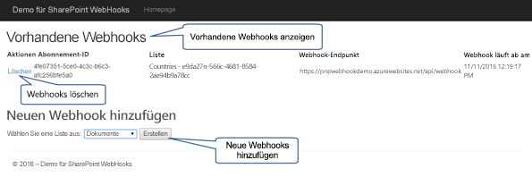

# <a name="sharepoint-webhooks-sample-reference-implementation"></a><span data-ttu-id="f7978-102">SharePoint-Webhooks – Beispielreferenzimplementierung</span><span class="sxs-lookup"><span data-stu-id="f7978-102">SharePoint webhooks sample reference implementation</span></span>

<span data-ttu-id="f7978-103">**Mitwirkende(r)**: Bert Jansen (Microsoft), SharePoint PnP-Kernteam</span><span class="sxs-lookup"><span data-stu-id="f7978-103">**Contributor(s)**: Bert Jansen (Microsoft), SharePoint PnP Core Team</span></span>

<span data-ttu-id="f7978-p101">Die Implementierung des SharePoint Patterns and Practices (PnP)-Referenz zeigt, wie Sie SharePoint-Webhooks in der Anwendung verwenden können. Die Webhooks werden auf sofort im Unternehmen einsetzbare Weise mit verschiedenen Microsoft Azure-Komponenten, wie z. B. Azure-Webaufträge, Azure SQL Server und Azure Storage-Warteschlangen, für die Verarbeitung asynchroner Webauftragsbenachrichtigung implementiert.</span><span class="sxs-lookup"><span data-stu-id="f7978-p101">The SharePoint Patterns and Practices (PnP) reference implementation shows how you can use SharePoint webhooks in your application. The webhooks are implemented in an enterprise ready manner using various Microsoft Azure components such as Azure Web Jobs, Azure SQL Server, and Azure Storage Queues for asynchronous web job notification handling.</span></span>

<span data-ttu-id="f7978-106">Die Referenzimplementierung funktioniert nur mit [SharePoint-Listenwebhooks](./lists/overview-sharepoint-list-webhooks.md).</span><span class="sxs-lookup"><span data-stu-id="f7978-106">The reference implementation only works with [SharePoint list webhooks](./lists/overview-sharepoint-list-webhooks.md).</span></span> 

<span data-ttu-id="f7978-107">Sie finden diese Schritte auch im Video im [YouTube-Kanal „SharePoint Patterns & Practices“](https://www.youtube.com/watch?v=j3hWCAI9R20):</span><span class="sxs-lookup"><span data-stu-id="f7978-107">You can also follow these steps by watching the video on the [SharePoint PnP YouTube Channel](https://www.youtube.com/watch?v=j3hWCAI9R20).</span></span>

<a href="https://www.youtube.com/watch?v=j3hWCAI9R20">

</a>

## <a name="applies-to"></a><span data-ttu-id="f7978-108">Gilt für</span><span class="sxs-lookup"><span data-stu-id="f7978-108">Applies to</span></span>

-  <span data-ttu-id="f7978-109">Office 365 mit mehreren Mandanten (MT).</span><span class="sxs-lookup"><span data-stu-id="f7978-109">Office 365 Multi Tenant (MT).</span></span>

## <a name="prerequisites"></a><span data-ttu-id="f7978-110">Voraussetzungen</span><span class="sxs-lookup"><span data-stu-id="f7978-110">Prerequisites</span></span>

<span data-ttu-id="f7978-111">Microsoft Azure wird zum Hosten der verschiedenen Komponenten verwendet, die zum Implementieren von Azure-Webhooks erforderlich sind.</span><span class="sxs-lookup"><span data-stu-id="f7978-111">Microsoft Azure is used to host the various components needed to implement Azure webhooks.</span></span>

## <a name="source-code-for-this-reference-implementation"></a><span data-ttu-id="f7978-112">Quellcode für diese Referenzimplementierung</span><span class="sxs-lookup"><span data-stu-id="f7978-112">Source code for this reference implementation</span></span>

<span data-ttu-id="f7978-113">Quellcode und andere Materialien, die für die Referenzimplementierung in zwei Varianten zur Verfügung stehen: Es gibt eine vom SharePoint-Anbieter gehostete Anwendungsversion und eine Office 365-Azure AD-Anwendung, die im [SharePoint Developer Beispiele GitHub Repository]((https://aka.ms/sp-webhooks-sample-reference)) gefunden werden kann.</span><span class="sxs-lookup"><span data-stu-id="f7978-113">Source code and other materials for the reference implementation are available in two flavors: we do have a SharePoint provider hosted application version and an Office 365 Azure AD application which can be found in the [SharePoint developer samples GitHub repository]((https://aka.ms/sp-webhooks-sample-reference)).</span></span> 

## <a name="deploying-the-reference-implementation"></a><span data-ttu-id="f7978-114">Bereitstellen der Referenzimplementierung</span><span class="sxs-lookup"><span data-stu-id="f7978-114">Deploying the reference implementation</span></span>

<span data-ttu-id="f7978-p102">Die Anwendung zeigt Ihnen das Verwalten von Webhooks, speziell für eine SharePoint-Liste. Darüber hinaus enthält sie eine Referenzimplementierung eines Webhook-Dienstendpunkts, die Sie in Ihren Webhook-Projekten wiederverwenden können.</span><span class="sxs-lookup"><span data-stu-id="f7978-p102">The application will show you how to manage webhooks, specifically for a SharePoint list. It also contains a reference implementation of a webhook service endpoint which you can reuse in your webhook projects.</span></span> 



<span data-ttu-id="f7978-118">Im [Bereitstellungshandbuch zur SharePoint-Webhooks-Referenzimplementierung]((https://github.com/SharePoint/sp-dev-samples/blob/master/Samples/WebHooks.List/Deployment%20guide.md)) werden die Bereitstellungsschritte aufgelistet, die zum Bereitstellen der vom SharePoint-Anbieter gehosteten Referenzimplementierung verwendet werden.</span><span class="sxs-lookup"><span data-stu-id="f7978-118">The [SharePoint web hooks reference implementation - Deployment guide]((https://github.com/SharePoint/sp-dev-samples/blob/master/Samples/WebHooks.List/Deployment%20guide.md)) lists the deployment steps used to deploy the SharePoint Provider hosted reference implementation.</span></span> <span data-ttu-id="f7978-119">Verwenden Sie die [hier]((https://github.com/SharePoint/sp-dev-samples/blob/master/Samples/WebHooks.List.AzureAD/Deployment%20guide.md)) beschriebenen Schritte zur Bereitstellung der Office 365 Azure AD-Anwendung.</span><span class="sxs-lookup"><span data-stu-id="f7978-119">To deploy the Office 365 Azure AD application use the steps described [here]((https://github.com/SharePoint/sp-dev-samples/blob/master/Samples/WebHooks.List.AzureAD/Deployment%20guide.md)).</span></span> <span data-ttu-id="f7978-120">Im Bereitstellungshandbuch wird gezeigt, wie Sie eine Web-API-Funktion als Webhook-Dienst verwenden. Wenn Sie darüber hinaus an Azure-Funktionen interessiert sind, sehen Sie sich den [Leitfaden zu Azure Functions]((https://github.com/SharePoint/sp-dev-samples/blob/master/Samples/WebHooks.List.AzureAD/azure%20functions%20guide.md)) an, in dem erläutert wird, wie Azure Functions in dieser Referenzimplementierung verwendet wird.</span><span class="sxs-lookup"><span data-stu-id="f7978-120">The deployment guide shows you how to use a Web API function as webhook service, but if you're more interested in use Azure functions then checkout the [Azure Functions guide]((https://github.com/SharePoint/sp-dev-samples/blob/master/Samples/WebHooks.List.AzureAD/azure%20functions%20guide.md)) for more details on how to use Azure Functions in this reference implementation.</span></span>

## <a name="introduction-to-webhooks"></a><span data-ttu-id="f7978-121">Einführung in Webhooks</span><span class="sxs-lookup"><span data-stu-id="f7978-121">Introduction to webhooks</span></span>

<span data-ttu-id="f7978-122">Webhooks benachrichtigen Ihre Anwendung über Änderungen in SharePoint, die die Anwendung überwachen muss.</span><span class="sxs-lookup"><span data-stu-id="f7978-122">Webhooks notify your application about changes in SharePoint that the application needs to monitor.</span></span> <span data-ttu-id="f7978-123">Ihre Anwendung muss nicht mehr regelmäßig Abfragen für Änderungen durchführen.</span><span class="sxs-lookup"><span data-stu-id="f7978-123">There's no need for your application to regularly poll for changes anymore.</span></span> <span data-ttu-id="f7978-124">Mit Webhooks wird Ihre Anwendung benachrichtigt (**Push**-Modell), wenn eine Änderung vorliegt.</span><span class="sxs-lookup"><span data-stu-id="f7978-124">With webhooks your application is notified (**push** model) whenever there's a change.</span></span> <span data-ttu-id="f7978-125">Webhooks sind nicht an Microsoft gebunden.</span><span class="sxs-lookup"><span data-stu-id="f7978-125">Webhooks are not specific to Microsoft.</span></span> <span data-ttu-id="f7978-126">Es gibt einen universellen Webstandard, der auch von anderen Herstellern (z. B. WordPress, GitHub, MailChimp und anderen) übernommen wird.</span><span class="sxs-lookup"><span data-stu-id="f7978-126">They are a universal web standard that's also being adopted by other vendors (e.g., WordPress, GitHub, MailChimp, and others).</span></span>

### <a name="adding-a-webhook-to-your-sharepoint-list"></a><span data-ttu-id="f7978-127">Hinzufügen eines Webhooks zu Ihrer SharePoint-Liste</span><span class="sxs-lookup"><span data-stu-id="f7978-127">Adding a webhook to your SharePoint list</span></span>

<span data-ttu-id="f7978-128">Die Referenzimplementierung funktioniert mit einer SharePoint-Liste.</span><span class="sxs-lookup"><span data-stu-id="f7978-128">The reference implementation works with a SharePoint list.</span></span> <span data-ttu-id="f7978-129">Zum Hinzufügen eines Webhooks zu einer SharePoint-Liste erstellt die Anwendung zunächst ein Webhook-Abonnement durch Senden einer [`POST /_api/web/lists('list-id')/subscriptions`](./lists/create-subscription.md)-Anforderung.</span><span class="sxs-lookup"><span data-stu-id="f7978-129">To add a webhook to a SharePoint list, your application first creates a webhook subscription by sending a [`POST /_api/web/lists('list-id')/subscriptions`](./lists/create-subscription.md) request.</span></span> <span data-ttu-id="f7978-130">Die Anforderung umfasst Folgendes:</span><span class="sxs-lookup"><span data-stu-id="f7978-130">The request includes the following items:</span></span>

* <span data-ttu-id="f7978-131">Eine Nutzlast, die die Liste identifiziert, für die Sie den Webhook hinzufügen.</span><span class="sxs-lookup"><span data-stu-id="f7978-131">A payload that identifies the list which you're adding the webhook for.</span></span>
* <span data-ttu-id="f7978-132">Die Position der Webhook-Dienst-URL zum Senden der Benachrichtigungen.</span><span class="sxs-lookup"><span data-stu-id="f7978-132">The location of your webhook service URL to send the notifications.</span></span>
* <span data-ttu-id="f7978-133">Das Ablaufdatum des Webhooks.</span><span class="sxs-lookup"><span data-stu-id="f7978-133">The expiration date of the webhook.</span></span> 

<span data-ttu-id="f7978-p106">Nachdem Sie SharePoint zum Hinzufügen Ihres Webhook aufgefordert haben, überprüft SharePoint, ob Ihr Webhook-Dienstendpunkt vorhanden ist. Eine Zeichenfolge wird als Validierung an Ihren Dienstendpunkt gesendet. SharePoint erwartet, dass Ihr Dienstendpunkt die Zeichenfolge für die Validierung innerhalb von 5 Sekunden zurückgibt. Wenn dieser Vorgang fehlschlägt, wird die Webhook-Erstellung abgebrochen. Wenn Sie Ihren Dienst bereitgestellt haben, funktioniert dies, und SharePoint gibt einer HTTP 201-Nachricht auf die POST-Anforderung zurück, die die Anwendung ursprünglich gesendet hat. Die Nutzlast in der Antwort enthält die ID des neuen Webhook-Abonnements.</span><span class="sxs-lookup"><span data-stu-id="f7978-p106">After you've requested SharePoint to add your webhook, SharePoint will validate that your webhook service endpoint exists. It sends a validation string to your service endpoint. SharePoint expects that your service endpoint returns the validation string within 5 seconds. If this process fails then the webhook creation is canceled. If you've deployed your service then this will work and SharePoint returns an HTTP 201 message on the POST request the application initially sent. The payload in the response contains the ID of the new webhook subscription.</span></span>


<span data-ttu-id="f7978-141">Sehen Sie sich die Referenzimplementierung an, und Sie sehen, dass alle Webhook-CRUD-Vorgänge in der [WebHookManager]((https://github.com/SharePoint/sp-dev-samples/blob/master/Samples/WebHooks.List/SharePoint.WebHooks.Common/WebHookManager.cs))-Klasse des **SharePoint.WebHooks.Common**-Projekts konsolidiert sind.</span><span class="sxs-lookup"><span data-stu-id="f7978-141">Take a look at the reference implementation, and you'll see that all webhook CRUD operations are consolidated in the [WebHookManager]((https://github.com/SharePoint/sp-dev-samples/blob/master/Samples/WebHooks.List/SharePoint.WebHooks.Common/WebHookManager.cs)) class of the **SharePoint.WebHooks.Common** project.</span></span> <span data-ttu-id="f7978-142">Das Hinzufügen eines Webhooks erfolgt mithilfe der **AddListWebHookAsync**-Methode:</span><span class="sxs-lookup"><span data-stu-id="f7978-142">Adding a webhook is done using the **AddListWebHookAsync** method:</span></span>

```cs
/// <summary>
/// This method adds a webhook to a SharePoint list. Note that you need your webhook endpoint being passed into this method to be up and running and reachable from the internet
/// </summary>
/// <param name="siteUrl">Url of the site holding the list</param>
/// <param name="listId">Id of the list</param>
/// <param name="webHookEndPoint">Url of the webhook service endpoint (the one that will be called during an event)</param>
/// <param name="accessToken">Access token to authenticate against SharePoint</param>
/// <param name="validityInMonths">Optional webhook validity in months, defaults to 3 months, max is 6 months</param>
/// <returns>subscription ID of the new webhook</returns>
public async Task<SubscriptionModel> AddListWebHookAsync(string siteUrl, string listId, string webHookEndPoint, string accessToken, int validityInMonths = 3)
{
    // webhook add code...
}
```

<span data-ttu-id="f7978-143">Beim Ausführen eines SharePoint-Aufrufs müssen Sie Authentifizierungsinformationen bereitstellen, und in diesem Fall verwenden Sie eine **Bearer**-Authentifizierungskopfzeile mit einem **Zugriffstoken**.</span><span class="sxs-lookup"><span data-stu-id="f7978-143">When making a call to SharePoint, you need to provide authentication information and in this case you're using a **Bearer** authentication header with an **access token**.</span></span> <span data-ttu-id="f7978-144">Um das Zugriffstoken abzurufen, fangen Sie das Token über einen **ExecutingWebRequest**-Ereignishandler ab:</span><span class="sxs-lookup"><span data-stu-id="f7978-144">To obtain the access token, intercept the token via an **ExecutingWebRequest** event handler:</span></span>

```cs
ClientContext cc = null;

// Create SharePoint ClientContext object...

// Add ExecutingWebRequest event handler
cc.ExecutingWebRequest += Cc_ExecutingWebRequest;

// Capture the OAuth access token since we want to reuse that one in our REST requests
private void Cc_ExecutingWebRequest(object sender, WebRequestEventArgs e)
{
    this.accessToken = e.WebRequestExecutor.RequestHeaders.Get("Authorization").Replace("Bearer ", "");
}
```

### <a name="sharepoint-calls-out-to-your-webhook-service"></a><span data-ttu-id="f7978-145">SharePoint ruft Ihren Webhook-Dienst auf</span><span class="sxs-lookup"><span data-stu-id="f7978-145">SharePoint calls out to your webhook service</span></span>

<span data-ttu-id="f7978-p109">Wenn SharePoint eine Änderung in einer Liste, für die Sie ein Webhook-Abonnement erstellt haben, erkennt, wird Ihr Dienstendpunkt von SharePoint aufgerufen. Wenn Sie die Nutzlast von SharePoint betrachten, beachten Sie, dass die folgenden Eigenschaften wichtig sind:</span><span class="sxs-lookup"><span data-stu-id="f7978-p109">When SharePoint detects a change in a list for which you've created a webhook subscription, your service endpoint will be called by SharePoint. When you look at the payload from SharePoint, notice that the following properties are important:</span></span>

<span data-ttu-id="f7978-148">Eigenschaft</span><span class="sxs-lookup"><span data-stu-id="f7978-148">Property</span></span>|<span data-ttu-id="f7978-149">Beschreibung</span><span class="sxs-lookup"><span data-stu-id="f7978-149">Description</span></span>
--------|-----------
<span data-ttu-id="f7978-150">**subscriptionId**</span><span class="sxs-lookup"><span data-stu-id="f7978-150">**subscriptionId**</span></span>|<span data-ttu-id="f7978-p110">Die ID des Webhook-Abonnements. Wenn Sie das Webhook-Abonnement aktualisieren möchten, z. B. wenn Sie die Webhook-Ablaufdauer verlängern, benötigen Sie diese ID.</span><span class="sxs-lookup"><span data-stu-id="f7978-p110">The ID of the webhook subscription. If you want to update the webhook subscription, for example you prolong the webhook expiration, then you need this ID.</span></span>
<span data-ttu-id="f7978-153">**resource**</span><span class="sxs-lookup"><span data-stu-id="f7978-153">**resource**</span></span>|<span data-ttu-id="f7978-154">Die ID der Liste für die die Änderung vorgenommen wurde.</span><span class="sxs-lookup"><span data-stu-id="f7978-154">The ID of the list for which the change happened.</span></span>
<span data-ttu-id="f7978-155">**siteUrl**</span><span class="sxs-lookup"><span data-stu-id="f7978-155">**siteUrl**</span></span>|<span data-ttu-id="f7978-156">Die Server-relative URL der Website mit der Ressource, für die die Änderung vorgenommen wurde.</span><span class="sxs-lookup"><span data-stu-id="f7978-156">The server relative URL of the site holding the resource for which the change happened.</span></span>

> [!NOTE]
> <span data-ttu-id="f7978-157">SharePoint sendet nur eine Benachrichtigung, dass eine Änderung stattgefunden hat, aber nicht, was tatsächlich geändert wurde.</span><span class="sxs-lookup"><span data-stu-id="f7978-157">Note: SharePoint only sends a notification that a change happened, but the notification does not include what actually changed.</span></span> <span data-ttu-id="f7978-158">Da Sie Informationen über das geänderte Web und die geänderte Liste erhalten, bedeutet das, dass Sie den gleichen Dienstendpunkt verwenden können, um Webhook-Ereignisse aus mehreren Websites und Listen zu behandeln.</span><span class="sxs-lookup"><span data-stu-id="f7978-158">Because you get information about the web and list that were changed, this means that you can use the same service endpoint to handle webhook events from multiple sites and lists.</span></span>

<span data-ttu-id="f7978-159">Wenn der Dienst aufgerufen wird, ist es wichtig, dass der Dienst mit einer HTTP 200-Nachricht in weniger als 5 Sekunden antwortet.</span><span class="sxs-lookup"><span data-stu-id="f7978-159">When your service is called, it's important that your service replies with an HTTP 200 message in under 5 seconds.</span></span> <span data-ttu-id="f7978-160">Weiter unten in diesem Artikel erhalten Sie mehr Informationen zur Reaktionszeit, aber im Wesentlichen ist es erforderlich, dass Sie die Benachrichtigungen **asynchron** behandeln.</span><span class="sxs-lookup"><span data-stu-id="f7978-160">Later in this article you'll learn more about the response time, but essentially this requires that you **asynchronously** handle the notifications.</span></span> <span data-ttu-id="f7978-161">In dieser Referenzimplementierung verwenden Sie dazu Azure-Webaufträge und Azure Storage-Warteschlangen.</span><span class="sxs-lookup"><span data-stu-id="f7978-161">In this reference implementation you'll do this by using Azure Web Jobs and Azure Storage Queues.</span></span>


### <a name="grab-the-changes-your-service-needs-to-act-upon"></a><span data-ttu-id="f7978-163">Erfassen der Änderungen, auf die der Dienst reagieren muss</span><span class="sxs-lookup"><span data-stu-id="f7978-163">Grab the changes your service needs to act upon</span></span>

<span data-ttu-id="f7978-164">Im vorherigen Schritt wurde Ihr Dienstendpunkt aufgerufen, aber SharePoint hat nur Informationen dazu bereitgestellt, wo die Änderung vorgenommen wurde, nicht dazu, was tatsächlich geändert wurde.</span><span class="sxs-lookup"><span data-stu-id="f7978-164">In the previous step your service endpoint was called but SharePoint only provided information about where the change happened, not what was actually changed.</span></span> <span data-ttu-id="f7978-165">Um zu erfahren, was geändert wurde, müssen Sie die SharePoint-`GetChanges()`-API wie in der nachstehenden Abbildung gezeigt verwenden.</span><span class="sxs-lookup"><span data-stu-id="f7978-165">To understand what was changed, you'll need to use the SharePoint `GetChanges()` API, as shown in the following image.</span></span>


<span data-ttu-id="f7978-167">Weitere Informationen zur `GetChanges()`-Implementierung erhalten Sie in der **ProcessNotification**-Methode in der [ChangeManager]((https://github.com/SharePoint/sp-dev-samples/blob/master/Samples/WebHooks.List/SharePoint.WebHooks.Common/ChangeManager.cs))-Klasse des **SharePoint.WebHooks.Common**-Projekts.</span><span class="sxs-lookup"><span data-stu-id="f7978-167">You can learn more about the `GetChanges()` implementation in the **ProcessNotification** method in the [ChangeManager]((https://github.com/SharePoint/sp-dev-samples/blob/master/Samples/WebHooks.List/SharePoint.WebHooks.Common/ChangeManager.cs)) class of the **SharePoint.WebHooks.Common** project.</span></span> 

<span data-ttu-id="f7978-168">Um zu verhindern, dass wiederholt dieselbe Änderung abgerufen wird, ist es wichtig, dass Sie SharePoint informieren, ab welchem Punkt die Änderungen abgerufen werden sollen.</span><span class="sxs-lookup"><span data-stu-id="f7978-168">To avoid getting the same change repeatedly, it's important that you inform SharePoint from which point you want the changes.</span></span> <span data-ttu-id="f7978-169">Dies geschieht durch Übergeben eines **changeToken**, was auch impliziert, dass Ihr Dienstendpunkt das zuletzt verwendete **changeToken** beibehalten muss, damit es beim nächsten Aufruf des Dienstendpunkts verwendet werden kann.</span><span class="sxs-lookup"><span data-stu-id="f7978-169">This is done by passing a **changeToken**, which also implies that your service endpoint needs to persist the last used **changeToken** so that it can be used the next time the service endpoint is called.</span></span>

<span data-ttu-id="f7978-170">Im Folgenden werden einige der wichtigsten Punkte über Änderungen aufgeführt:</span><span class="sxs-lookup"><span data-stu-id="f7978-170">The following are some key things to note about changes:</span></span>

- <span data-ttu-id="f7978-171">SharePoint ruft Ihren Dienst nicht in Echtzeit auf: Wenn eine Änderung für eine Liste mit einem Webhook vorgenommen wird, reiht SharePoint einen Webhook-Aufruf in eine Warteschlange ein. Diese Warteschlange wird einmal pro Minute gelesen, und die entsprechenden Dienstendpunkte werden aufgerufen.</span><span class="sxs-lookup"><span data-stu-id="f7978-171">SharePoint does not call your service in real-time: when a change happens on a list that has a webhook, SharePoint will queue a webhook call out. Once each minute this queue will be read and the appropriate service endpoints are called.</span></span> <span data-ttu-id="f7978-172">Die Batchverarbeitung von Anforderungen ist wichtig.</span><span class="sxs-lookup"><span data-stu-id="f7978-172">This batching of requests is important.</span></span> <span data-ttu-id="f7978-173">Wenn beispielsweise ein Massen-Upload von 1000 Datensätzen gleichzeitig aufgetreten ist, verhindert die Batchverarbeitung, dass SharePoint Ihre Endpunkte 1000 Mal aufruft.</span><span class="sxs-lookup"><span data-stu-id="f7978-173">For example, if a bulk upload of 1000 records occurred at once, batching prevents SharePoint from calling your endpoint 1000 times.</span></span> <span data-ttu-id="f7978-174">Ihr Endpunkt wird also nur einmal aufgerufen, aber wenn Sie die `GetChanges()`-Methode aufrufen, erhalten Sie 1000 Änderungsereignisse, die Sie verarbeiten müssen.</span><span class="sxs-lookup"><span data-stu-id="f7978-174">So your endpoint is only called once but when you call the `GetChanges()` method you'll get 1000 change events that you need to process.</span></span>
- <span data-ttu-id="f7978-p116">Damit eine sofortige Antwort unabhängig von der Anzahl von Änderungen sichergestellt ist, ist es wichtig, dass die Arbeitslast Ihres Dienstendpunkts asynchron ausgeführt wird. In der Referenzimplementierung haben wir die Leistungsfähigkeit von Azure genutzt: Der Dienst serialisiert die eingehende Nutzlast und speichert sie in der Azure Storage-Warteschlange, während ein Azure-Webauftrag fortlaufend ausgeführt wird und nach Nachrichten in der Warteschlange sucht. Wenn Nachrichten in der Warteschlange vorhanden sind, verarbeitet sie der Webauftrag und führt auch Ihre Logik asynchron aus.</span><span class="sxs-lookup"><span data-stu-id="f7978-p116">To guarantee an immediate response, regardless of the number of changes there, it's important that the workload of your service endpoint runs asynchronously. In the reference implementation we leveraged the power of Azure: the service will serialize the incoming payload and store it in an Azure Storage queue while there's an Azure web job that runs continuously and checks for messages in the queue. When there are messages in the queue the web job will process them and also execute your logic asynchronously.</span></span>

### <a name="complete-end-to-end-flow"></a><span data-ttu-id="f7978-178">Vollständiger End-to-End-Fluss</span><span class="sxs-lookup"><span data-stu-id="f7978-178">Complete end-to-end flow</span></span>

<span data-ttu-id="f7978-179">Das folgende Diagramm beschreibt den vollständigen End-to-End-Webhook-Fluss:</span><span class="sxs-lookup"><span data-stu-id="f7978-179">The following diagram describes the complete end-to-end webhook flow:</span></span>


1. <span data-ttu-id="f7978-181">Die Anwendung erstellt ein Webhook-Abonnement.</span><span class="sxs-lookup"><span data-stu-id="f7978-181">Your application creates a webhook subscription.</span></span> <span data-ttu-id="f7978-182">Wenn dies der Fall ist, ruft sie das aktuelle **changeToken** aus der Liste ab, für die der Webhook erstellt wurde.</span><span class="sxs-lookup"><span data-stu-id="f7978-182">When it does it gets the current **changeToken** from the list it created the webhook for.</span></span>
2. <span data-ttu-id="f7978-183">Die Anwendung behält das **changeToken** in einem permanenten Speicher bei, in diesem Fall z. B. in SQL Azure.</span><span class="sxs-lookup"><span data-stu-id="f7978-183">Your application persists the **changeToken** in a persistent storage, such as SQL Azure in this case.</span></span>
3. <span data-ttu-id="f7978-184">Eine Änderung in SharePoint tritt auf, und SharePoint ruft Ihren Dienstendpunkt auf.</span><span class="sxs-lookup"><span data-stu-id="f7978-184">A change in SharePoint occurs and SharePoint calls your service endpoint.</span></span>
4. <span data-ttu-id="f7978-185">Ihr Dienstendpunkt serialisiert die Benachrichtigungsanforderung und speichert sie in einer Speicherwarteschlange.</span><span class="sxs-lookup"><span data-stu-id="f7978-185">Your service endpoint serializes the notification request and stores it in a storage queue.</span></span>
5. <span data-ttu-id="f7978-186">Ihre Webauftrag findet die Nachricht in der Warteschlange und startet Ihre Nachrichtenverarbeitungslogik.</span><span class="sxs-lookup"><span data-stu-id="f7978-186">Your web job sees the message in the queue and starts your message processing logic.</span></span>
6. <span data-ttu-id="f7978-187">Ihre Nachrichtenverarbeitungslogik ruft das zuletzt verwendete Änderungstoken aus dem permanenten Speicher ab.</span><span class="sxs-lookup"><span data-stu-id="f7978-187">Your message processing logic retrieves the last used change token from the persistent storage.</span></span>
7. <span data-ttu-id="f7978-188">Ihre Nachrichtenverarbeitungslogik verwendet die `GetChanges()`-API, um zu ermitteln, was geändert wurde.</span><span class="sxs-lookup"><span data-stu-id="f7978-188">Your message processing logic uses the `GetChanges()`API to determine what changed.</span></span>
8. <span data-ttu-id="f7978-189">Die zurückgegebenen Änderungen werden verarbeitet, und Ihre Anwendung führt jetzt basierend auf den Änderungen die erforderlichen Schritte aus.</span><span class="sxs-lookup"><span data-stu-id="f7978-189">The returned changes are processed and now your application performs what it needs to do based on the changes.</span></span>
9. <span data-ttu-id="f7978-190">Schließlich behält die Anwendung das zuletzt abgerufene **changeToken** bei, damit beim nächsten Mal keine Änderungen empfangen werden, die bereits verarbeitet wurden.</span><span class="sxs-lookup"><span data-stu-id="f7978-190">Finally the application persists the last retrieved **changeToken** so that next time it does not receive changes that were already processed.</span></span>

## <a name="how-to-work-with-webhook-renewal"></a><span data-ttu-id="f7978-191">Funktionsweise der Webhook-Erneuerung</span><span class="sxs-lookup"><span data-stu-id="f7978-191">How to work with webhook renewal</span></span>

<span data-ttu-id="f7978-p118">Webhook-Abonnements laufen standardmäßig nach sechs Monaten oder zum bei der Erstellung angegebenen Datum ab. Häufig muss der Webhook für eine längere Zeit verfügbar sein. Die nachstehend beschriebenen Muster eignen sich zum Verlängern der Lebensdauer eines Webhook-Abonnements. Das erste Muster ist einfach und das zweite etwas komplexer und erfordert das Hosten eines zusätzlichen Webauftrags.</span><span class="sxs-lookup"><span data-stu-id="f7978-p118">Webhook subscriptions are set to expire 6 months by default or at the specified date when they are created. Often you need the webhook to be available for a longer time. The patterns described below are good for increasing the lifetime of a webhook subscription. The first pattern is lightweight and the second one is slightly more complex and requires an additional web job to be hosted.</span></span>

### <a name="basic-model"></a><span data-ttu-id="f7978-196">Grundlegendes Modell</span><span class="sxs-lookup"><span data-stu-id="f7978-196">Basic model</span></span>

<span data-ttu-id="f7978-p119">Wenn der Dienst eine Benachrichtigung erhält, ruft er auch Informationen über die Lebensdauer des Abonnements ab. Wenn das Abonnement bald abläuft, erweitern Sie innerhalb Ihrer Benachrichtigungsverarbeitungslogik einfach die Lebensdauer des Abonnements. Dieses Modell ist in dieser Referenzimplementierung implementiert und funktioniert in den meisten Fällen. Falls es aber in der Liste, für die Sie ein Webhook-Abonnement erstellt haben, sechs Monate lang keine Änderung gibt, wird das Webhook-Abonnement nie verlängert und wird gelöscht.</span><span class="sxs-lookup"><span data-stu-id="f7978-p119">When your service receives a notification it also gets information about the subscription lifetime. If the subscription is about to expire,  inside your notification processing logic you simply extend the lifetime of the subscription. This model is implemented in this reference implementation and works fine for most cases. However, in a case where there's no change for 6 months on the list you've created a webhook subscription for, the webhook subscription is never prolonged and will be deleted.</span></span>

### <a name="reliable-but-more-complex-model"></a><span data-ttu-id="f7978-201">Zuverlässiges aber komplexeres Modell</span><span class="sxs-lookup"><span data-stu-id="f7978-201">Reliable but more complex model</span></span>

<span data-ttu-id="f7978-p120">Erstellen Sie einen Webauftrag, das wöchentlich alle Abonnement-IDs aus dem permanenten Speicher liest. Erweitern Sie nacheinander die gefundenen Abonnements.</span><span class="sxs-lookup"><span data-stu-id="f7978-p120">Create a web job that on a weekly basis reads all the subscription IDs from the persistent storage. One-by-one extend the found subscriptions each time.</span></span> 

> [!NOTE]
> <span data-ttu-id="f7978-204">Dieser Webauftrag ist nicht Teil dieser Referenzimplementierung.</span><span class="sxs-lookup"><span data-stu-id="f7978-204">Note: This web job is not part of this reference implementation.</span></span>

<span data-ttu-id="f7978-205">Die tatsächliche Erneuerung eines SharePoint-Listen-Webhooks ist mithilfe eines [`PATCH /_api/web/lists('list-id')/subscriptions(‘subscriptionID’)`](./lists/update-subscription.md)-REST-Aufrufs möglich.</span><span class="sxs-lookup"><span data-stu-id="f7978-205">The actual renewal of a SharePoint list webhook can be done using a [`PATCH /_api/web/lists('list-id')/subscriptions(‘subscriptionID’)`](./lists/update-subscription.md) REST call.</span></span> <span data-ttu-id="f7978-206">In der Referenzimplementierung ist das Aktualisieren von Webhooks in der [WebHookManager]((https://github.com/SharePoint/sp-dev-samples/blob/master/Samples/WebHooks.List/SharePoint.WebHooks.Common/WebHookManager.cs))-Klasse des **SharePoint.WebHooks.Common**-Projekts implementiert.</span><span class="sxs-lookup"><span data-stu-id="f7978-206">In the reference implementation, updating of webhooks is implemented in the [WebHookManager]((https://github.com/SharePoint/sp-dev-samples/blob/master/Samples/WebHooks.List/SharePoint.WebHooks.Common/WebHookManager.cs)) class of the **SharePoint.WebHooks.Common** project.</span></span> <span data-ttu-id="f7978-207">Das Aktualisieren eines Webhooks erfolgt mithilfe der **UpdateListWebHookAsync**-Methode:</span><span class="sxs-lookup"><span data-stu-id="f7978-207">Updating a webhook is done using the **UpdateListWebHookAsync** method:</span></span>

```csharp
/// <summary>
/// Updates the expiration datetime (and notification URL) of an existing SharePoint list webhook
/// </summary>
/// <param name="siteUrl">Url of the site holding the list</param>
/// <param name="listId">Id of the list</param>
/// <param name="subscriptionId">Id of the webhook subscription that we need to update</param>
/// <param name="webHookEndPoint">Url of the webhook service endpoint (the one that will be called during an event)</param>
/// <param name="expirationDateTime">New webhook expiration date</param>
/// <param name="accessToken">Access token to authenticate against SharePoint</param>
/// <returns>true if successful, exception in case something went wrong</returns>
public async Task<bool> UpdateListWebHookAsync(string siteUrl, string listId, string subscriptionId, string webHookEndPoint, DateTime expirationDateTime, string accessToken)
{
    // webhook update code...
}
```

## <a name="debugging-webhooks"></a><span data-ttu-id="f7978-208">Debuggen von Webhooks</span><span class="sxs-lookup"><span data-stu-id="f7978-208">Debugging webhooks</span></span>

<span data-ttu-id="f7978-p122">Da SharePoint Ihren Webhook-Dienstendpunkt aufruft, muss Ihr Endpunkt durch SharePoint erreichbar sein. Dadurch wird die Entwicklung und das Debuggen etwas komplexer. Im Folgenden finden Sie einige Strategien, die Sie verwenden können, um Ihr Leben zu vereinfachen:</span><span class="sxs-lookup"><span data-stu-id="f7978-p122">Because SharePoint is calling out to your webhook service endpoint, your endpoint needs to be reachable by SharePoint. This makes development and debugging slightly more complex. The following are some strategies that you can use to make your life easier:</span></span>

* <span data-ttu-id="f7978-p123">Stellen Sie während der anfänglichen Entwicklung Ihrer Dienstverarbeitungslogik Ihre eigene serialisierte Nutzlast zur Verfügung. Dadurch wird es möglich, die Verarbeitungslogik vollständig zu testen, ohne den Dienstendpunkt bereitzustellen (sogar ohne Konfigurieren eines Webhooks).</span><span class="sxs-lookup"><span data-stu-id="f7978-p123">During initial development, you provide your own serialized payload to your service processing logic. This will make it possible to completely test your processing logic without deploying the service endpoint (and even without configuring a webhook).</span></span>
* <span data-ttu-id="f7978-p124">Wenn Sie Zugriff auf Azure-Ressourcen haben, können Sie Ihren Endpunkt in Azure unter Verwendung eines Debug-Builds bereitstellen und den Azure-App-Dienst für das Debuggen konfigurieren. Dann können Sie einen Remotehaltepunkt festlegen und das Remotedebugging mit Visual Studio durchführen.</span><span class="sxs-lookup"><span data-stu-id="f7978-p124">If you have access to Azure resources, you can deploy your endpoint to Azure using a debug build and configure the Azure App Service for debugging. This will then allow you to set a remote breakpoint and do remote debugging using Visual Studio.</span></span>
- <span data-ttu-id="f7978-216">Wenn Sie Ihren Dienst nicht während der Entwicklung bereitstellen möchten, müssen Sie einen sicheren Tunnel für den Dienst verwenden.</span><span class="sxs-lookup"><span data-stu-id="f7978-216">If you do not want to deploy your service during development time, you'll need to use a secure tunnel for your service.</span></span> <span data-ttu-id="f7978-217">Sie teilen SharePoint sozusagen mit, dass sich der Benachrichtigungsdienst auf einem gemeinsam genutzten öffentlichen Endpunkt befindet.</span><span class="sxs-lookup"><span data-stu-id="f7978-217">The idea is that you tell SharePoint that the notification service is located on a shared public endpoint.</span></span> <span data-ttu-id="f7978-218">Installieren Sie auf dem Client eine Komponente, die mit diesem freigegebenen öffentlichen Dienst eine Verbindung herstellt. Immer, wenn ein Aufruf des öffentlichen Endpunkts erfolgt, wird die Clientkomponente benachrichtigt, die dann die Nutzlast an den auf dem lokalen Host ausgeführten Dienst sendet.</span><span class="sxs-lookup"><span data-stu-id="f7978-218">In the client, you install a component that connects to that shared public service and whenever a call is made to the public endpoint, the client component is notified and it pushes the payload to your service running on localhost.</span></span> <span data-ttu-id="f7978-219">[ngrok]((https://ngrok.com/)) ist eine Implementierung eines solchen Tools für sichere Tunnel, das Sie verwenden können, um Ihren Webhook-Dienst lokal zu debuggen.</span><span class="sxs-lookup"><span data-stu-id="f7978-219">[ngrok]((https://ngrok.com/)) is an implementation of such a secure tunnel tool that you can use to debug your webhook service locally.</span></span>
