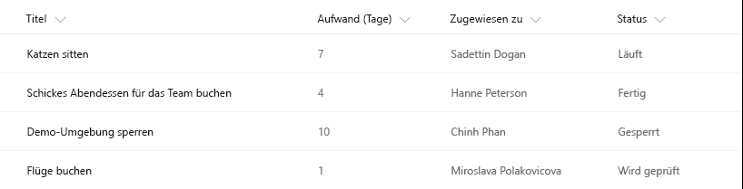
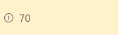
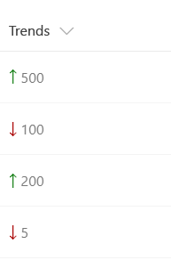

# <a name="use-column-formatting-to-customize-sharepoint"></a>Anpassen von SharePoint mithilfe von Spaltenformatierungen

Mithilfe von Spaltenformatierungen können Sie anpassen, wie Felder in SharePoint-Listen und SharePoint-Bibliotheken angezeigt werden. Dazu erstellen Sie ein JSON-Objekt. Es beschreibt die Elemente, die bei der Aufnahme eines Felds in eine Listenansicht angezeigt werden, sowie die Formatvorlagen, die auf diese Elemente angewendet werden sollen. Spaltenformatierungen haben keine Auswirkungen auf die Daten in einem Listenelement oder einer Datei. Sie ändern nur, wie das Element oder die Datei visuell dargestellt werden, wenn der Benutzer durch die Liste navigiert. Jeder Benutzer mit Berechtigungen zur Erstellung und Verwaltung von Listenansichten kann Spaltenformatierungen definieren, um die Darstellung von Ansichtsfeldern zu konfigurieren. 

Eine Liste mit den Feldern „Title“, „Effort“, „Assigned To“ und „Status“ ohne jegliche Anpassungen könnte beispielsweise so aussehen: 



Eine Liste, in der die Felder „Effort“, „Assigned To“ und „Status“ mithilfe von Spaltenformatierungen angepasst wurden, könnte so aussehen:


## <a name="how-is-column-formatting-different-than-the-field-customizer"></a>Was unterscheidet Spaltenformatierungen und den Field Customizer?
Sowohl mithilfe von Spaltenformatierungen als auch mithilfe der Erweiterung [SharePoint Framework Field Customizer](https://docs.microsoft.com/de-DE/sharepoint/dev/spfx/extensions/get-started/building-simple-field-customizer) können Sie anpassen, wie Felder in SharePoint-Listen visuell dargestellt werden. Der Field Customizer ist leistungsfähiger, da Sie mit seiner Hilfe beliebigen Code zur Steuerung der Felddarstellung programmieren können. Spaltenformatierungen lassen sich einfacher und großflächiger anwenden. Sie sind jedoch weniger flexibel, da sie statt benutzerdefiniertem Code nur einige vordefinierte Elemente und Attribute unterstützen. 

In der folgenden Tabelle haben wir Spaltenformatierungen und den Field Customizer verglichen.

| Feldtyp        | Spaltenformatierungen          | Field Customizer  |
| ------------- |:-------------| :-----|
| Bedingte Formatierungen auf Basis von Elementwerten und Wertebereichen      | Unterstützt | Unterstützt |
| Aktionslinks       | Unterstützung für statische Links, die keine Skripts starten      |  Unterstützung für alle Links, einschließlich Links, die benutzerdefinierte Skripts aufrufen   |
| Datenvisualisierungen | Unterstützung für einfache Visualisierungen, die in HTML und CSS ausgedrückt werden können      |   Unterstützung für zufällige Datenvisualisierungen  |

Falls Sie Ihr Szenario mithilfe von Spaltenformatierungen umsetzen können, sind sie die Option der Wahl, da ihr Einsatz schneller und unkomplizierter ist als die Arbeit mit dem Field Customizer. Jeder Benutzer mit Berechtigungen zur Erstellung und Verwaltung von Listenansichten kann Spaltenformatierungen nutzen, um Anpassungen zu erstellen und zu veröffentlichen. Der Field Customizer ist für komplexere Szenarien gedacht, für die keine Spaltenformatierungen unterstützt werden.

## <a name="get-started-with-column-formatting"></a>Erste Schritte mit Spaltenformatierungen
Öffnen Sie das Dropdownmenü unter einer Spalte, um den Bereich für die Spaltenformatierung zu öffnen. Klicken Sie unter **Spalteneinstellungen** auf **Format this column**.

Sofern noch kein anderer Benutzer Spaltenformatierungen auf die ausgewählte Spalte angewendet hat, sieht der Bereich wie der Screenshot unten aus.


Auf Felder ohne Formatierung werden die Standardeinstellungen für das Rendering angewendet. Geben Sie den JSON-Code für die Spaltenformatierung in das Feld ein, um die Spalte zu formatieren.

Eine Vorschau der Formatierung können Sie über **Vorschau** aufrufen. Zum Übernehmen der Änderungen klicken Sie auf **Speichern**. Sobald Sie gespeichert haben, ist die angewendete Anpassung für jeden Benutzer sichtbar, der die Liste aufruft.

Am einfachsten können Sie Spalten formatieren, wenn Sie ein Beispiel als Grundlage übernehmen und an Ihr spezifisches Feld anpassen. In den folgenden Abschnitten finden Sie Beispiele, die Sie kopieren, einfügen und gemäß Ihren Szenarien bearbeiten können. Es stehen auch verschiedene Beispiele im [SharePoint/sp-dev-column-formatting-Repository](https://github.com/SharePoint/sp-dev-column-formatting) zur Verfügung.

## <a name="display-field-values-basic"></a>Anzeigen von Feldwerten (einfach)

Die einfachste Spaltenformatierung ist eine Formatierung, die den Wert des Felds in einem Element des Typs `<div />` platziert. Dieses Beispiel lässt sich auf Zahlenfelder, Textfelder, Auswahlfelder und Datumsfelder anwenden.

```JSON
{
   "elmType": "div",
   "txtContent": "@currentField"
}
```
Bei einigen Feldtypen ist zum Abrufen der Werte etwas mehr Code erforderlich. Personenfelder werden im System als Objekte dargestellt. Dabei ist der Anzeigename der Person in der Eigenschaft **title** des Objekts enthalten. Hier sehen Sie dasselbe Beispiel wie oben, angepasst für Personenfelder:

```JSON
{
   "elmType": "div",
   "txtContent": "@currentField.title"
}
```
Nachschlagefelder werden ebenfalls als Objekte dargestellt. Der Anzeigetext wird in der Eigenschaft **lookupValue** gespeichert. Dieses Beispiel kann auf Nachschlagefelder angewendet werden:

```JSON
{
   "elmType": "div",
   "txtContent": "@currentField.lookupValue"
}
```

## <a name="apply-conditional-formatting"></a>Anwenden bedingter Formatierung
Mithilfe von Spaltenformatierungen können Sie Formatvorlagen, Klassen und Symbole auf Felder anwenden, basierend auf dem in den betreffenden Feldern jeweils enthaltenen Wert.

### <a name="conditional-formatting-based-on-a-number-range-basic"></a>Bedingte Formatierung auf Basis eines Zahlenbereichs (einfach)
Die Abbildung unten ist ein Beispiel für eine auf einen Zahlenbereich angewendete bedingte Formatierung.



In diesem Beispiel wird mithilfe des bedingten Operators `?` eine Klasse (`sp-field-severity--warning`) auf das übergeordnete Element des Typs `<div />` angewendet, sobald der Wert im aktuellen Feld kleiner oder gleich 70 ist. Das Feld wird also farblich hervorgehoben, sobald sein Wert kleiner oder gleich 70 ist, und normal dargestellt bei einem Wert größer als 70.

```JSON
{
    "$schema": "http://columnformatting.sharepointpnp.com/columnFormattingSchema.json",
    "debugMode": true,
    "elmType": "div",
    "attributes": {
       "class": {
          "operator": "?",
          "operands": [
             {
                "operator": "<=",
                "operands": [
                   "@currentField",
                   70
                ]
             },
             "sp-field-severity--warning",
             ""
          ]
       }
    },
    "children": [
        {
            "elmType": "span",
            "style": {
                "display": "inline-block",
                "padding": "0 4px"
            },
            "attributes": {
                "iconName": {
                    "operator": "?",
                    "operands": [
                        {
                            "operator": "<=",
                            "operands": [
                                "@currentField",                  
                                70
                            ]
                        },
                        "Error",
                        ""
                    ]
                }
            }
        },
        {
            "elmType": "span",
            "txtContent": "@currentField"
        }
    ]
}
```

### <a name="conditional-formatting-based-on-the-value-in-a-text-or-choice-field-advanced"></a>Bedingte Formatierung auf Basis eines Werts in einem Text- oder Auswahlfeld (komplex)

Die Abbildung unten ist ein Beispiel für eine auf ein Text- oder Auswahlfeld angewendete bedingte Formatierung.


Eine bedingte Formatierung lässt sich auf Text- oder Auswahlfelder mit einem festgelegten Satz von Werten anwenden. Im folgenden Beispiel werden unterschiedliche Klassen angewendet, je nachdem, ob das Feld den Wert „Done“, den Wert „In review“, den Wert „Blocked“ oder einen anderen Wert hat. Konkret wird hier basierend auf dem Feldwert eine CSS-Klasse (`sp-field-severity--low, sp-field-severity--good, sp-field-severity--warning, sp-field-severity--blocked`) auf das Element des Typs `<div />` angewendet. Anschließend wird ein Element des Typs `<span />` mit einem Attribut `IconName` ausgegeben. Dieses Attribut wendet eine weitere CSS-Klasse auf das Element des Typs `<span />` an, die innerhalb des Elements ein [Office UI Fabric](https://dev.office.com/fabric#/)-Symbol anzeigt. Abschließend wird ein weiteres Element des Typs `<span />` ausgegeben, das den Wert des Felds enthält.

Dieses Muster ist nützlich, wenn Sie unterschiedlichen Werten jeweils eine andere Dringlichkeitsstufe oder einen anderen Schweregrad zuordnen möchten. Sie können das Beispiel unten bearbeiten, indem Sie eigene Feldwerte angeben und die Formatvorlagen und Symbole definieren, die diesen Werten zugeordnet werden sollen.

```JSON
{
    "$schema": "http://columnformatting.sharepointpnp.com/columnFormattingSchema.json",
    "debugMode": true,
    "elmType": "div",
    "attributes": {
        "class": {
            "operator": "?",
            "operands": [
                {
                    "operator": "==",
                    "operands": [
                        {
                            "operator": "toString()",
                            "operands": [
                                "@currentField"
                            ]
                        },
                        "Done"
                    ]
                },
                "sp-field-severity--good",
                {
                    "operator": "?",
                    "operands": [
                        {
                            "operator": "==",
                            "operands": [
                                {
                                    "operator": "toString()",
                                    "operands": [
                                        "@currentField"
                                    ]
                                },
                                "In progress"
                            ]
                        },
                        "sp-field-severity--low",
                        {
                            "operator": "?",
                            "operands": [
                                {
                                    "operator": "==",
                                    "operands": [
                                        {
                                            "operator": "toString()",
                                            "operands": [
                                                "@currentField"
                                            ]
                                        },
                                        "In review"
                                    ]
                                },
                                "sp-field-severity--warning",
                                {
                                    "operator": "?",
                                    "operands": [
                                        {
                                            "operator": "==",
                                            "operands": [
                                                {
                                                    "operator": "toString()",
                                                    "operands": [
                                                        "@currentField"
                                                    ]
                                                },
                                                "Blocked"
                                            ]
                                        },
                                        "sp-field-severity--severeWarning",
                                        "sp-field-severity--blocked"
                                    ]
                                }
                            ]
                        }
                    ]
                }
            ]
        }
    },
    "children": [
        {
            "elmType": "span",
            "style": {
                "display": "inline-block",
                "padding": "0 4px"
            },
            "attributes": {
                "iconName": {
                    "operator": "?",
                    "operands": [
                        {
                            "operator": "==",
                            "operands": [
                                {
                                    "operator": "toString()",
                                    "operands": [
                                        "@currentField"
                                    ]
                                },
                                "Done"
                            ]
                        },
                        "CheckMark",
                        {
                            "operator": "?",
                            "operands": [
                                {
                                    "operator": "==",
                                    "operands": [
                                        {
                                            "operator": "toString()",
                                            "operands": [
                                                "@currentField"
                                            ]
                                        },
                                        "In progress"
                                    ]
                                },
                                "Forward",
                                {
                                    "operator": "?",
                                    "operands": [
                                        {
                                            "operator": "==",
                                            "operands": [
                                                {
                                                    "operator": "toString()",
                                                    "operands": [
                                                        "@currentField"
                                                    ]
                                                },
                                                "In review"
                                            ]
                                        },
                                        "Error",
                                        {
                                            "operator": "?",
                                            "operands": [
                                                {
                                                    "operator": "==",
                                                    "operands": [
                                                        {
                                                            "operator": "toString()",
                                                            "operands": [
                                                                "@currentField"
                                                            ]
                                                        },
                                                        "Has issues"
                                                    ]
                                                },
                                                "Warning",
                                                "ErrorBadge"
                                            ]
                                        }
                                    ]
                                }
                            ]
                        }
                    ]
                }
            }
        },
        {
            "elmType": "span",
            "txtContent": "@currentField"
        }
    ]
}

```

## <a name="apply-formatting-based-on-date-ranges"></a>Anwenden von Formatierungen auf Basis von Datumsbereichen
Termine und wichtige Projektzeitachsen werden häufig anhand von Datumsangaben nachverfolgt. Ein gängiges Szenario ist dabei die Anwendung von Formatierungen auf Basis des Werts in einem Datum/Uhrzeit-Feld. Nutzen Sie die unten beschriebenen Muster, um Formatierungen basierend auf dem Wert eines Datum/Uhrzeit-Felds anzuwenden.

### <a name="formatting-an-item-when-a-date-column-is-before-or-after-todays-date-advanced"></a>Formatieren eines Elements, sobald der Wert einer Datumsspalte ein Datum vor oder nach dem aktuellen Datum ist (komplex)

Die folgende Abbildung zeigt ein Feld, auf das eine bedingte Datumsformatierung angewendet wurde:


Bei diesem Beispiel wird das aktuelle Feld rot gefärbt, wenn der Wert des Felds „DueDate“ vor dem aktuellen Datum/der aktuellen Uhrzeit liegt. Im Gegensatz zu einigen der vorherigen Beispiele ist die Formatierung des Felds also abhängig vom Wert eines anderen Felds. Wie Sie sehen, wird zur Referenzierung des Felds „DueDate“ die Syntax `[$FieldName]` verwendet. Dabei ist „FieldName“ der interne Name des Feldes. Außerdem wird in diesem Beispiel ein besonderer Wert gesetzt, der speziell in Datum/Uhrzeit-Feldern verwendet werden kann: `@now`, der auf das aktuelle Datum/die aktuelle Uhrzeit auflöst und ausgewertet wird, sobald der Benutzer die Listenansicht lädt.

> [!NOTE]
> Wenn Leerzeichen im Feldnamen vorhanden sind, werden diese als `_x0020_` definiert. Beispielsweise sollte ein Feld mit dem Namen „DueDate“ als `$Due_x0020_Date` angegeben werden.

```JSON
{

   "elmType": "div",
   "txtContent": "@currentField",
   "style": {
      "color": {
         "operator": "?",
         "operands": [
            {
               "operator": "<=",
               "operands": [
                  "[$DueDate]",
                  "@now"
               ]
            },
            "#ff0000",
            ""
         ]
      }
   }
}
```

### <a name="formatting-items-based-on-arbitrary-dates-advanced"></a>Formatieren von Elementen auf Basis zufälliger Datumsangaben (komplex)
Mithilfe des Musters im folgenden Beispiel können Sie den Wert eines Datum/Uhrzeit-Felds mit einem anderen Datum als dem im Wert `@now` definierten Datum vergleichen. Das Beispiel unten färbt das aktuelle Feld rot, wenn der Wert für „DueDate“ kleiner oder gleich dem jeweils morgigen Datum ist. Dazu wird mit Datumsmathematik gearbeitet. Wenn zu einem Datum Millisekunden addiert werden, erhalten Sie als Ergebnis ein neues Datum. Soll zu einem Datum beispielsweise 1 Tag hinzuaddiert werden, würden Sie (24\*60\*60\*1000 = 86,400,000) hinzuaddieren. 
```JSON
{
   "elmType": "div",
   "txtContent": "@currentField",
   "style": {
      "color": {
         "operator": "?",
         "operands": [
            {
               "operator": "<=",
               "operands": [
                  "[$DueDate]",
                  {
                     "operator": "+",
                     "operands": [
                        "@now",
                        86400000
                     ]
                  }
               ]
            },
            "#ff0000",
            ""
         ]
      }
   }
}
```
Wenn Sie den Wert eines Datum/Uhrzeit-Felds mit einer anderen Datumskonstante abgleichen möchten, konvertieren Sie mithilfe der Methode `Date()` eine Zeichenfolge in ein Datum. Das Beispiel unten färbt das aktuelle Feld rot, wenn der Wert im Feld „DueDate“ ein früheres Datum ist als der 22.03.2017.
```JSON
{
   "elmType": "div",
   "txtContent": "@currentField",
   "style": {
      "color": {
         "operator": "?",
         "operands": [
            {
               "operator": "<=",
               "operands": [
                  "[$DueDate]",
                  {
                     "operator": "Date()",
                     "operands": [
                        "3/22/2017"
                     ]
                  }
               ]
            },
            "#ff0000",
            ""
         ]
      }
   }
}
```

## <a name="create-clickable-actions"></a>Erstellen klickbarer Aktionen

Mithilfe von Spaltenformatierungen können Sie Links implementieren, die auf andere Webseiten führen oder benutzerdefinierte Funktionen starten. Diese Funktionen sind auf statische Links beschränkt, die sich mit Werten aus Feldern in der Liste parametrisieren lassen. Eine Ausgabe von Links zu anderen Protokollen als `http://`, `https://` oder `mailto:` ist mithilfe von Spaltenformatierungen nicht möglich.

### <a name="turn-field-values-into-hyperlinks-basic"></a>Umwandeln von Feldwerten in Links (einfach)
In diesem Beispiel demonstrieren wir Ihnen, wie Sie ein Textfeld mit Börsenticker-Symbolen in einen Link umwandeln, der auf die Yahoo! Finanzen-Seite mit den Echtzeit-Kursen für den betreffenden Börsenticker verweist. Das Beispiel verwendet einen Operator des Typs `+` der den Wert des aktuellen Felds an den statischen Link <a>http://finance.yahoo.com/quote/</a> anfügt. Sie können dieses Muster an jedes Szenario anpassen, in dem Benutzer Kontextinformationen zu einem Element abrufen können sollen oder in dem ein Geschäftsprozess auf das jeweils aktuelle Element angewendet werden soll. Voraussetzung ist lediglich, dass die Informationen oder der Prozess über einen Link abgerufen werden können, der mit Werten aus dem Listenelement parametrisiert wurde.


```JSON
{
   "elmType": "a",
   "txtContent": "@currentField",
   "attributes": {
      "target": "_blank",
      "href": {
         "operator": "+",
         "operands": [
            "http://finance.yahoo.com/quote/",
            "@currentField"
         ]
      }
   }
}
```
### <a name="add-an-action-button-to-a-field-advanced"></a>Hinzufügen einer interaktiven Schaltfläche zu einem Feld (komplex)
Die folgende Abbildung zeigt Felder, denen jeweils eine interaktive Schaltfläche hinzugefügt wurde.


Mithilfe von Spaltenformatierungen können Sie Direktlinks zu Aktionen neben Feldern rendern. Das folgende Beispiel ist für Personenfelder gedacht und rendert zwei Elemente innerhalb des übergeordneten Elements des Typs `<div />`:

- Ein Element des Typs `<span />`, das den Anzeigenamen der Person enthält
- Ein Element des Typs `<a />`, das einen Mailto-Link öffnet. Der Link erstellt eine E-Mail, deren Betreff und Text dynamisch auf Basis von Elementmetadaten aufgefüllt werden. Das Element des Typs `<a />` wird mithilfe der [Fabric](https://developer.microsoft.com/de-DE/fabric)-Klassen `ms-Icon`, `ms-Icon—Mail` und `ms-QuickAction` so formatiert, dass es wie ein klickbares Briefsymbol aussieht. 

```JSON
{
    "elmType": "div",
    "children": [
        {
            "elmType": "span",
            "style": {
                "padding-right": "8px"
            },
            "txtContent": "@currentField.title"
        },
        {
            "elmType": "a",
            "attributes": {
                "iconName": "Mail",
                "class": "sp-field-quickAction",
                "href": {
                    "operator": "+",
                    "operands": [
                        "mailto:",
                        "@currentField.email",
                        "?subject=Task status&body=Hey, how is your task coming along?.\r\n---\r\n",
                        "@currentField.title",
                        "\r\nClick this link for more info. http://contoso.sharepoint.com/sites/ConferencePrep/Tasks/Prep/DispForm.aspx?ID=",
                        "[$ID]"
                    ]
                }
            }
        }
    ]
}
```
## <a name="create-simple-data-visualizations"></a>Erstellen von einfachen Datenvisualisierungen
Mithilfe von Spaltenformatierungen können Sie bedingte und arithmetische Operationen kombinieren und so grundlegende Datenvisualisierungen erstellen.

### <a name="format-a-number-column-as-a-data-bar-advanced"></a>Formatieren von Zahlenspalten als Datenbalken (komplex)
Die folgende Abbildung zeigt eine als Datenbalken formatierte Zahlenspalte:


In diesem Beispiel werden die Formatvorlagen `background-color` und `border-top` angewendet, um das Feld `@currentField` (ein Zahlenfeld) als Datenbalken zu visualisieren. Die Balken für die verschiedenen Werte haben jeweils eine andere Größe, basierend auf dem Attribut `width`. Es wird auf `100%` gesetzt, sobald der Wert größer als 20 ist, und auf `(@currentField * 5)%`, sobald der Wert kleiner ist als 10. Die Breite des Datenbalkens beträgt also 5 % bei einem Wert von 1, 10 % bei einem Wert von 2 usw. Um das Beispiel an eine spezifische Zahlenspalte anzupassen, können Sie die Randbedingung (`20`) auf den erwarteten Maximalwert des Felds setzen und über den Multiplikator (`5`) festlegen, um wie viel der Balken breiter werden soll, sobald sich der Wert des Felds ändert.
```JSON
{
  "debugMode": true,
  "elmType": "div",
  "txtContent": "@currentField",
  "attributes": {
   "class": "sp-field-dataBars"
  },
  "style": {
    "width": {
      "operator": "?",
      "operands": [
        {
          "operator": ">",
          "operands": [
            "@currentField",
            "20"
          ]
        },
        "100%",
        {
          "operator": "+",
          "operands": [
            {
              "operator": "toString()",
              "operands": [
                {
                  "operator": "*",
                  "operands": [
                    "@currentField",
                    5
                  ]
                }
              ]
            },
            "%"
          ]
        }
      ]
    }
  }
}
```

### <a name="show-trending-uptrending-down-icons-advanced"></a>Rendern von Aufwärtstrend- und Abwärtstrend-Symbolen (komplex)
Die folgende Abbildung zeigt eine Liste mit Aufwärtstrend- und Abwärtstrend-Symbolen:



Dieses Beispiel basiert auf zwei Zahlenfeldern (`Before` und `After`), deren Werte miteinander verglichen werden können. Neben dem Feld `After` wird jeweils das passende Trendsymbol angezeigt, basierend auf einem Vergleich zwischen dem Wert des Felds mit dem Wert des Felds `Before`.  `sp-field-trending--up` wird verwendet, wenn der Wert von `After` höher ist, `sp-field-trending--down` wird verwendet, wenn der Wert von `After` niedriger ist.

```JSON
{
    "debugMode": true,
    "elmType": "div",
    "children": [
        {
            "elmType": "span",
            "attributes": {
                "class": {
                    "operator": "?",
                    "operands": [
                        {
                            "operator": ">",
                            "operands": [
                                "[$After]",
                                "[$Before]"
                            ]
                        },
                        "sp-field-trending--up",
                        "sp-field-trending--down"
                    ]
                },
                "iconName": {
                    "operator": "?",
                    "operands": [
                        {
                            "operator": ">",
                            "operands": [
                                "[$After]",
                                "[$Before]"
                            ]
                        },
                        "SortUp",
                        {
                            "operator": "?",
                            "operands": [
                                {
                                    "operator": "<",
                                    "operands": [
                                        "[$After]",
                                        "[$Before]"
                                    ]
                                },
                                "SortDown",
                                ""
                            ]
                        }
                    ]
                }
            }
        },
        {
            "elmType": "span",
            "txtContent": "[$After]"
        }
    ]
}
```

## <a name="supported-column-types"></a>Unterstützte Spaltentypen
Spaltenformatierungen können auf folgende Spaltentypen angewendet werden:
* Eine Textzeile 
* Zahl
* Auswahl
* Person oder Gruppe
* Ja/Nein
* Hyperlink 
* Bild
* Datum/Uhrzeit
* Nachschlagen
* Titel (in Listen)

Folgende Spaltentypen werden derzeit nicht unterstützt:
* Verwaltete Metadaten
* Dateiname (in Dokumentbibliotheken)
* Berechnet
* Aufbewahrungsbezeichnung

## <a name="style-guidelines"></a>Richtlinien für Formatvorlagen

### <a name="predefined-classes"></a>Vordefinierte Klassen
Mit den nachfolgend aufgeführten vordefinierten Klassen lässt sich eine ganze Reihe gängiger Szenarien umsetzen.

| Name der Klasse | Screenshot |
| ------------- |:-------------|
| sp-field-customFormatBackground |Legt die Innen- und Außenabstände aller Klassen fest, die einen Hintergrund verwenden. |
| sp-field-severity--good | |
| sp-field-severity--low | |
| sp-field-severity--warning |  |
| sp-field-severity--severeWarning |  |
| sp-field-severity--blocked |  |
| sp-field-dataBars | |
| sp-field-trending--up | |
| sp-field-trending--down | |
| sp-field-quickAction | |

## <a name="predefined-icons"></a>Vordefinierte Symbole

Sie können vordefinierte Symbole aus Office UI Fabric verwenden. Einzelheiten hierzu finden Sie auf der [Fabric-Website](https://dev.office.com/fabric#/styles/icons). 

## <a name="creating-custom-json"></a>Erstellen von benutzerdefiniertem JSON-Code
Sobald Sie das Schema einmal verstanden haben, ist die Erstellung von benutzerdefiniertem JSON-Code zur Formatierung von Spalten ganz unkompliziert. Gehen Sie wie folgt vor, um eine benutzerdefinierte Spaltenformatierung zu erstellen:

1. [Laden Sie Visual Studio Code](https://code.visualstudio.com/Download) herunter. Der Download ist kostenlos und dauert nicht lange. 

2. Erstellen Sie in Visual Studio Code eine neue Datei, und speichern Sie sie ohne Inhalt mit der Dateiendung „.json“.

3. Fügen Sie die folgenden Codezeilen in die leere Datei ein:

    ```JSON
    {
    "$schema": "http://columnformatting.sharepointpnp.com/columnFormattingSchema.json"
    }
    ```
    Nun können Sie Ihren selbst erstellten JSON-Code prüfen und AutoVervollständigen nutzen. Fügen Sie Ihren eigenen JSON-Code nach der ersten Zeile ein. In ihr ist der Speicherort des Schemas festgelegt. 

>[!Tip]
>Über die Tastenkombination **STRG** + **Leertaste** können Sie in Visual Studio Code jederzeit Vorschläge für Eigenschaften und Werte aufrufen. Weitere Informationen zur Bearbeitung von JSON-Code in Visual Studio Code finden Sie unter <a>https://code.visualstudio.com/Docs/languages/json</a>.


## <a name="detailed-syntax-reference"></a>Detaillierte Syntaxreferenz

### <a name="elmtype"></a>elmType

Gibt an, welcher Typ von Element erstellt werden soll. Folgende Elemente sind gültige Elemente:

- div
- span
- a
- img
- svg
- path

Bei allen anderen Werten wird ein Fehler zurückgegeben.

### <a name="txtcontent"></a>txtContent

Eine optionale Eigenschaft, die den Textinhalt des in `elmType` definierten Elements festlegt. Der Wert dieser Eigenschaft kann entweder eine Zeichenfolge sein (auch eine Spezialzeichenfolge) oder ein Objekt des Typs „Expression“. 

### <a name="style"></a>style

Eine optionale Eigenschaft, die die Formatattribute des in `elmType` definierten Elements festlegt. Konkret handelt es sich um ein Objekt mit Name/Wert-Paaren, die CSS-Namen und -Werten entsprechen. Die Werte der einzelnen Eigenschaften in einem Objekt des Typs „style“ können entweder eine Zeichenfolge sein (auch eine Spezialzeichenfolge) oder ein Objekt des Typs „Expression“. Folgende Attribute sind für „style“ zulässig:

    'background-color'
    'fill'
    'background-image'
    'border'
    'border-bottom'
    'border-bottom-color'
    'border-bottom-style'
    'border-bottom-width'
    'border-color'
    'border-left'
    'border-left-color'
    'border-left-style'
    'border-left-width'
    'border-right'
    'border-right-color'
    'border-right-style'
    'border-right-width'
    'border-style'
    'border-top'
    'border-top-color'
    'border-top-style'
    'border-top-width'
    'border-width'
    'outline'
    'outline-color'
    'outline-style'
    'outline-width'
    'border-bottom-left-radius'
    'border-bottom-right-radius'
    'border-radius'
    'border-top-left-radius'
    'border-top-right-radius'
    'box-decoration-break'
    'box-shadow'
    'box-sizing'

    'overflow-x'
    'overflow-y'
    'overflow-style'
    'rotation'
    'rotation-point'

    'opacity'

    'height'
    'max-height'
    'max-width'
    'min-height'
    'min-width'
    'width'

    'align-items'
    'box-align'
    'box-direction'
    'box-flex'
    'box-flex-group'
    'box-lines'
    'box-ordinal-group'
    'box-orient'
    'box-pack'

    'font'
    'font-family'
    'font-size'
    'font-style'
    'font-variant'
    'font-weight'
    'font-size-adjust'
    'font-stretch'

    'grid-columns'
    'grid-rows'

    'margin'
    'margin-bottom'
    'margin-left'
    'margin-right'
    'margin-top'

    'column-count'
    'column-fill'
    'column-gap'
    'column-rule'
    'column-rule-color'
    'column-rule-style'
    'column-rule-width'
    'column-span'
    'column-width'
    'columns'

    'padding'
    'padding-bottom'
    'padding-left'
    'padding-right'
    'padding-top'

    'bottom'
    'clear'
    'clip'
    'display'
    'float'
    'left'
    'overflow'
    'position' 
    'right'
    'top'
    'visibility'
    'z-index'

    'border-collapse'
    'border-spacing'
    'caption-side'
    'empty-cells'
    'table-layout'

    'color'
    'direction'
    'letter-spacing'
    'line-height'
    'text-align'
    'text-decoration'
    'text-indent'
    'text-transform'
    'unicode-bidi'
    'vertical-align'
    'white-space'
    'word-spacing'
    'hanging-punctuation'
    'punctuation-trim'
    'text-align-last'
    'text-justify'
    'text-outline'
    'text-shadow'
    'text-wrap'
    'word-break'
    'word-wrap'

Das Beispiel unten zeigt den Wert eines Objekts des Typs „style“. Wie Sie sehen, werden zwei Formateigenschaften angewendet (`padding` und `background-color`). Der Wert für `padding` ist ein hartcodierter Zeichenfolgenwert. Der Wert für `background-color` ist ein Objekt des Typs „Expression“, das entweder in Rot (`#ff0000`) oder in Grün (`#00ff00`) ausgewertet wird, je nachdem, ob der Wert des aktuellen Felds (`@currentField`) kleiner als 40 ist. Weitere Informationen finden Sie im Abschnitt zu Objekten des Typs „Expression“. 

```JSON
{
   "padding": "4px",
   "background-color": {
      "operator": "?",
      "operands": [
         {
            "operator": "<",
            "operands": [
               "@currentField",
               40
            ]
         },
         "#ff0000",
         "#00ff00"
      ]
   }
}
```

### <a name="attributes"></a>attributes

Eine optionale Eigenschaft, die zusätzliche Attribute für das in `elmType` definierte Element festlegt. Konkret handelt es sich um ein Objekt mit Name/Wert-Paaren. Gültig sind die folgenden Attributnamen:

- href
- rel
- src
- class
- target
- title
- role
- iconName
- d
- aria

Bei allen anderen Attributnamen wird ein Fehler zurückgegeben. Attributwerte können entweder Objekte des Typs „Expression“ oder Zeichenfolgen sein. Das folgende Beispiel fügt dem in `elmType` definierten Element zwei Attribute hinzu (`target` und `href`). Das Attribut `target` ist eine hartcodierte Zeichenfolge. Das Attribut `href` ist ein Ausdruck, der zur Laufzeit ausgewertet wird in „http://finance.yahoo.com/quote/“, ergänzt um den Wert des aktuellen Felds (`@currentField`). 
```JSON
{
   "target": "_blank",
   "href": {
      "operator": "+",
      "operands": [
         "http://finance.yahoo.com/quote/",
         "@currentField"
      ]
   }
}
```

### <a name="children"></a>children

Eine optionale Eigenschaft, die die untergeordneten Elemente des in `elmType` definierten Elements festlegt. Der Wert wird als Array von Objekten des Typs `elm` angegeben. Er kann beliebig geschachtelt werden. Ist für ein Element die Eigenschaft `txtContent` festgelegt, werden die Eigenschaften der untergeordneten Elemente ignoriert. 

### <a name="debugmode"></a>debugMode

Eine optionale Eigenschaft, die zum Debuggen gedacht ist. Sie gibt Fehlermeldungen aus und protokolliert Warnungen in der Konsole. 

### <a name="expression-object"></a>Objekt „Expression“

Die Werte für `txtContent` sowie für Formateigenschaften und Attributeigenschaften können auch als Ausdrücke definiert werden, die zur Laufzeit auf Basis des Kontexts des aktuellen Feldes (oder der aktuellen Zeile) ausgewertet werden. Objekte des Typs „Expression“ können geschachtelt werden. Das heißt, sie dürfen andere Objekte des Typs „Expression“ enthalten. 

Das folgende Beispiel zeigt ein Objekt des Typs „Expression“, das den folgenden Ausdruck ausführt:

`(@currentField > 40) ? '100%' : (((@currentField * 2.5).toString() + '%')`

```JSON
{
   "operator": "?",
   "operands": [
      {
         "operator": ">",
         "operands": [
            "@currentField",
            "40"
         ]
      },
      "100%",
      {
         "operator": "+",
         "operands": [
            {
               "operator": "toString()",
               "operands": [
                  {
                     "operator": "*",
                     "operands": [
                        "@currentField",
                        2.5
                     ]
                  }
               ]
            },
            "%"
         ]
      }
   ]
}
```

### <a name="operators"></a>Operatoren

Operatoren legen fest, welcher Typ von Operation ausgeführt werden soll. Die folgenden Operatoren sind gültige Werte:

- \+
- \-
- /
- \*
- <
- \>
- ==
- !=
- <=
- \>=
- ||
- &&
- toString()
- Number()
- Date()
- cos
- sin
- ? 
- toLocaleString()
- toLocaleDateString()
- toLocaleTimeString()

**Binäre Operatoren:** Unten sehen Sie die standardmäßigen arithmetischen binären Operatoren. Diese erwarten zwei Operanden. 

- \+
- \-
- /
- \*
- <
- \>
- <=
- \>= 

**Unäre Operatoren:** Unten sehen Sie die standardmäßigen unären Operatoren. Diese erwarten nur einen einzigen Operanden. 

- toString()
- Number()
- Date()
- cos
- sin
- toLocaleString()
- toLocaleDateString()
- toLocaleTimeString()

**Bedingter Operator:** Unten sehen Sie den bedingten Operator.

- ?

Er wird zur Formulierung von Ausdrücken des Typs „a ? b : c“ verwendet. Ist der Ausdruck „a“ wahr, so lautet das Ergebnis „b“; ansonsten lautet das Ergebnis „c“.

### <a name="operands"></a>operands
Gibt die Parameter (Operanden) eines Ausdrucks an. Konkret handelt es sich um ein Array von Objekten des Typs „Expression“ oder von Basiswerten.

### <a name="special-string-values"></a>Spezialzeichenfolgenwerte
Die Werte für `txtContent`, Formatvorlagen und Attribute können entweder Zeichenfolgen oder Objekte des Typs „Expression“ sein. Daneben werden zum Abrufen von Werten aus Listenfeldern und dem Benutzerkontext einige spezielle Zeichenfolgenmuster unterstützt.

#### <a name="currentfield"></a>„@currentField“
Wird ausgewertet in den Wert des aktuellen Felds. 

Einige Feldtypen werden als Objekte dargestellt. Zum Abrufen eines Werts aus einem Objekt verweisen Sie auf eine Eigenschaft innerhalb des Objekts. Beispiel: Ist das aktuelle Feld ein Personen- oder Gruppenfeld, würden Sie `@currentField.title` angeben, um den Namen der Person abzurufen, wie er in der Regel in Listenansichten angezeigt wird. Nachfolgend sind die Feldtypen aufgeführt, die als Objekte dargestellt werden, inklusive einer Liste ihrer jeweiligen Eigenschaften.

> [!NOTE]
> `@currentField.title` gibt standardmäßig den Namen einer Person zurück. Wenn jedoch der Wert „Show Field“ des Personenfelds angepasst wurde, wird möglicherweise der Wert der Eigenschaft `title` geändert. Wird zum Beispiel der Wert „Show Field“ eines Personenfelds als „Abteilung“ konfiguriert, erhält die Eigenschaft `title` als Wert die Abteilung der Person.

**Personenfelder**

Das Objekte des Personenfelds verfügt über die folgenden Eigenschaften (es sind auch Beispiele aufgeführt):

```JSON
{
   "id": "122",
   "title": "Kalya Tucker",
   "email": "kaylat@contoso.com",
   "sip": "kaylat@contoso.com",
   "picture": "https://contoso.sharepoint.com/kaylat_contoso_com_MThumb.jpg?t=63576928822"
}
```

**Datum/Uhrzeit-Felder**

Es gibt mehrere Möglichkeiten, den Wert eines Datum/Uhrzeit-Felds abzurufen, je nachdem, welches Datumsformat angezeigt werden soll. Unterstützt werden die folgenden Methoden zur Konvertierung von Datumswerten in bestimmte Formate: 

* `toLocaleString()`: Gibt einen komplett erweiterten Datentyp mit Datum und Uhrzeit aus.
* `toLocaleDateString()`: Gibt einen Datentyp aus, der nur das Datum anzeigt.
* `toLocaleTimeString()`: Gibt einen Datentyp aus, der nur die Uhrzeit anzeigt.

Der folgende JSON-Code beispielsweise würde das aktuelle Feld als Datum/Uhrzeit-Zeichenfolge anzeigen (sofern es sich um ein Datumsfeld handelt).

```JSON
{
   "elmType": "div",
   "txtContent": {
        "operator": "toLocaleString()",
        "operands" : ["@currentField"]
    }
}
```

**Nachschlagefelder**

Das Objekte des Nachschlagefelds verfügt über die folgenden Eigenschaften (es sind auch Beispiele aufgeführt):

```JSON
{
   "lookupId": "100",
   "lookupValue": "North America",
}
```
Das folgende Beispiel demonstriert die Anwendung eines Nachschlagefelds auf ein aktuelles Feld.
```JSON
{
   "elmType": "a",
   "txtContent": "@currentField.lookupValue",
   "attributes": {
      "href": {
         "operator": "+",
         "operands": [
            "https://contoso.sharepoint.com/teams/Discovery/Lists/Regions/DispForm.aspx?ID=",
            "@currentField.lookupId"
         ]
      },
      "target": "_blank"
   }
}
``` 

#### <a name="fieldname"></a>„[$FieldName]“ 
Die Spalte wird im Kontext der gesamten Zeile formatiert. Sie können diesen Kontext verwenden, um auf andere Felder innerhalb der gleichen Zeile zu verweisen. Beispiel: Zum Abrufen des Werts eines Felds namens „MarchSales“ würden Sie `[$MarchSales]` verwenden.

Ist der Wert eines Felds ein Objekt, können Sie auf die Eigenschaften dieses Objekts zugreifen. Wenn Sie z. B. auf die Eigenschaft „Titel“ eines Personenfelds mit dem Namen „SalesLead“ zugreifen möchten, verwenden Sie „[$SalesLead.title]“.

#### <a name="me"></a>„@me“
Wird ausgewertet in die E-Mail-Adresse des aktuell angemeldeten Benutzers.

Dieses Feld kann verwendet werden, um die aktuelle E-Mail-Adresse des Benutzers anzuzeigen, aber viel wahrscheinlicher wird es unter Bedingungen verwendet. Nachfolgend finden Sie ein Beispiel für das Festlegen einer Farbe für ein Personenfeld auf Rot, wenn es dem aktuell angemeldeten Benutzer entspricht, und auf Blau, wenn dies nicht der Fall ist: 

```JSON
{
   "elmType": "div",
   "txtContent": "@currentField.title",
   "style": {
      "color": {
         "operator": "?",
         "operands": [
            {
               "operator": "==",
               "operands": [
                  "@me",
                  "@currentField.email"
               ]
            },
            "red",
            "blue"
         ]
      }
   }
}
```

#### <a name="now"></a>„@now“
Wird ausgewertet in das aktuelle Datum und die aktuelle Uhrzeit. 

## <a name="see-also"></a>Weitere Artikel

- [Formatieren einer Spalte](https://support.office.com/en-us/article/Column-formatting-1f927342-2bed-4745-b727-ff8b7ff96b22?ui=en-US&rs=en-US&ad=US)
