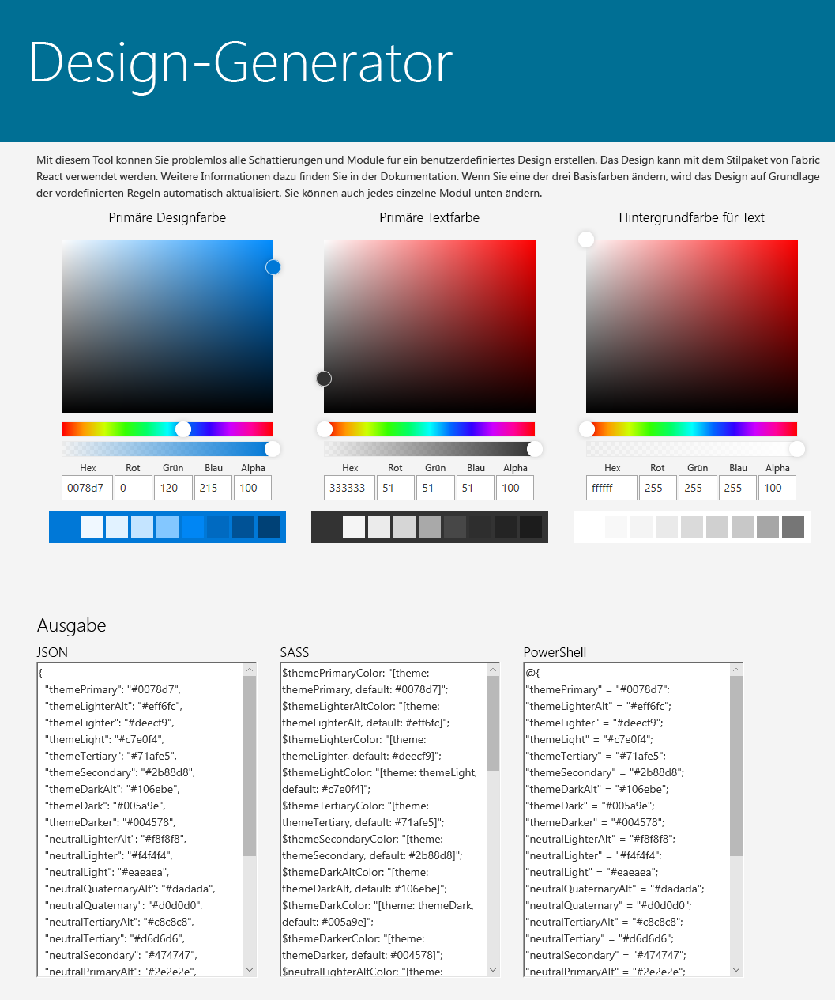

# <a name="sharepoint-site-theming-json-schema"></a><span data-ttu-id="039b7-101">SharePoint-Websitedesign: JSON-Schema</span><span class="sxs-lookup"><span data-stu-id="039b7-101">SharePoint site theming: JSON schema</span></span>

<span data-ttu-id="039b7-102">Die neuen Funktionen für das [SharePoint-Websitedesign](sharepoint-site-theming-overview.md) speichern Farbeinstellungen und sonstige Informationen zu einem Design in einem JSON-Schema.</span><span class="sxs-lookup"><span data-stu-id="039b7-102">The new [SharePoint site theming](sharepoint-site-theming-overview.md) features use a JSON schema to store color settings and other information about each theme.</span></span> <span data-ttu-id="039b7-103">Designeinstellungen werden in einem JSON-Objekt gespeichert, das die folgenden Schlüssel enthält:</span><span class="sxs-lookup"><span data-stu-id="039b7-103">Theme settings are stored in a JSON object that contains the following keys:</span></span>

* <span data-ttu-id="039b7-104">__name__ &mdash; Dieser Schlüssel repräsentiert den Namen des Designs. Er wird in der Benutzeroberfläche der Designauswahl angezeigt und außerdem von Administratoren und Entwicklern verwendet, um das Design in PowerShell-Cmdlets oder Aufrufen an die SharePoint-REST-API zu referenzieren.</span><span class="sxs-lookup"><span data-stu-id="039b7-104">__name__ &mdash; The name of the theme, which appears in the theme picker UI and is also used by administrators and developers to refer to the theme in PowerShell cmdlets or calls to the SharePoint REST API.</span></span>
* <span data-ttu-id="039b7-105">__isInverted__ &mdash; Dieser Wert sollte für helle Designs auf „false“ und für dunkle Designs auf „true“ gesetzt werden. Er steuert, ob SharePoint dunkle oder helle Designfarben für das Rendern von Text auf farbigem Hintergrund verwendet.</span><span class="sxs-lookup"><span data-stu-id="039b7-105">__isInverted__ &mdash; This value should be false for light themes and true for dark themes; it controls whether SharePoint will use dark or light theme colors to render text on colored backgrounds.</span></span>
* <span data-ttu-id="039b7-106">__backgroundImageUril__ &mdash;Der URI eines optionalen Hintergrundbildes für das Design. (Der Wert darf leer sein, wenn kein Hintergrundbild gewünscht ist.)</span><span class="sxs-lookup"><span data-stu-id="039b7-106">__backgroundImageUril__ &mdash; The URI of an optional background image for the theme (value can be blank if no background image).</span></span>
* <span data-ttu-id="039b7-107">__theme__ &mdash; Dieser Schlüssel repräsentiert die RGB-Farbeinstellungen für das Design, gespeichert als verschachteltes JSON-Objekt mit den folgenden Schlüsseln:</span><span class="sxs-lookup"><span data-stu-id="039b7-107">__theme__ &mdash; The RGB color settings for the theme, stored as a nested JSON object with the following keys:</span></span>
    * <span data-ttu-id="039b7-108">themePrimary</span><span class="sxs-lookup"><span data-stu-id="039b7-108">themePrimary</span></span>
    * <span data-ttu-id="039b7-109">themeLighterAlt</span><span class="sxs-lookup"><span data-stu-id="039b7-109">themeLighterAlt</span></span>
    * <span data-ttu-id="039b7-110">themeLighter</span><span class="sxs-lookup"><span data-stu-id="039b7-110">themeLighter</span></span>
    * <span data-ttu-id="039b7-111">themeLight</span><span class="sxs-lookup"><span data-stu-id="039b7-111">themeLight</span></span>
    * <span data-ttu-id="039b7-112">themeTertiary</span><span class="sxs-lookup"><span data-stu-id="039b7-112">themeTertiary</span></span>
    * <span data-ttu-id="039b7-113">themeSecondary</span><span class="sxs-lookup"><span data-stu-id="039b7-113">themeSecondary</span></span>
    * <span data-ttu-id="039b7-114">themeDarkAlt</span><span class="sxs-lookup"><span data-stu-id="039b7-114">themeDarkAlt</span></span>
    * <span data-ttu-id="039b7-115">themeDark</span><span class="sxs-lookup"><span data-stu-id="039b7-115">themeDark</span></span>
    * <span data-ttu-id="039b7-116">themeDarker</span><span class="sxs-lookup"><span data-stu-id="039b7-116">themeDarker</span></span>
    * <span data-ttu-id="039b7-117">neutralLighterAlt</span><span class="sxs-lookup"><span data-stu-id="039b7-117">neutralLighterAlt</span></span>
    * <span data-ttu-id="039b7-118">neutralLighter</span><span class="sxs-lookup"><span data-stu-id="039b7-118">neutralLighter</span></span>
    * <span data-ttu-id="039b7-119">neutralLight</span><span class="sxs-lookup"><span data-stu-id="039b7-119">neutralLight</span></span>
    * <span data-ttu-id="039b7-120">neutralQuaternaryAlt</span><span class="sxs-lookup"><span data-stu-id="039b7-120">neutralQuaternaryAlt</span></span>
    * <span data-ttu-id="039b7-121">neutralQuaternary</span><span class="sxs-lookup"><span data-stu-id="039b7-121">neutralQuaternary</span></span>
    * <span data-ttu-id="039b7-122">neutralTertiaryAlt</span><span class="sxs-lookup"><span data-stu-id="039b7-122">neutralTertiaryAlt</span></span>
    * <span data-ttu-id="039b7-123">neutralTertiary</span><span class="sxs-lookup"><span data-stu-id="039b7-123">neutralTertiary</span></span>
    * <span data-ttu-id="039b7-124">neutralSecondaryAlt</span><span class="sxs-lookup"><span data-stu-id="039b7-124">neutralSecondaryAlt</span></span>
    * <span data-ttu-id="039b7-125">neutralSecondary</span><span class="sxs-lookup"><span data-stu-id="039b7-125">neutralSecondary</span></span>
    * <span data-ttu-id="039b7-126">neutralPrimaryAlt</span><span class="sxs-lookup"><span data-stu-id="039b7-126">neutralPrimaryAlt</span></span>
    * <span data-ttu-id="039b7-127">neutralPrimary</span><span class="sxs-lookup"><span data-stu-id="039b7-127">neutralPrimary</span></span>
    * <span data-ttu-id="039b7-128">neutralDark</span><span class="sxs-lookup"><span data-stu-id="039b7-128">neutralDark</span></span>
    * <span data-ttu-id="039b7-129">black</span><span class="sxs-lookup"><span data-stu-id="039b7-129">black</span></span>
    * <span data-ttu-id="039b7-130">white</span><span class="sxs-lookup"><span data-stu-id="039b7-130">white</span></span>
    * <span data-ttu-id="039b7-131">primaryBackground</span><span class="sxs-lookup"><span data-stu-id="039b7-131">primaryBackground</span></span>
    * <span data-ttu-id="039b7-132">primaryText</span><span class="sxs-lookup"><span data-stu-id="039b7-132">primaryText</span></span>
    * <span data-ttu-id="039b7-133">error</span><span class="sxs-lookup"><span data-stu-id="039b7-133">error</span></span>

<span data-ttu-id="039b7-134">Die Farben im Element _theme_ werden als hexadezimale RGB-Zeichenfolgenwerte mit 6 oder 3 Ziffern angegeben.</span><span class="sxs-lookup"><span data-stu-id="039b7-134">The colors in the _theme_ element are specified as 6-digit or 3-digit hexadecimal RGB string values.</span></span>

<span data-ttu-id="039b7-135">Unten sehen Sie ein Beispiel für ein JSON-Objekt, das ein Design definiert:</span><span class="sxs-lookup"><span data-stu-id="039b7-135">The following is an example of a JSON object that defines a theme.</span></span>

```json
{ 
    name: 'Blue', 
    isInverted: true, 
    backgroundImageUri: '', 
    theme: { 
        themePrimary: "#00bcf2", 
        themeLighterAlt: "#00090c", 
        themeLighter: "#001318", 
        themeLight: "#002630", 
        themeTertiary: "#005066", 
        themeSecondary: "#00abda", 
        themeDarkAlt: "#0ecbff", 
        themeDark: "#44d6ff", 
        themeDarker: "#6cdfff", 
        neutralLighterAlt: "#2e3340", 
        neutralLighter: "#353a49", 
        neutralLight: "#404759", 
        neutralQuaternaryAlt: "#474e62", 
        neutralQuaternary: "#4c546a", 
        neutralTertiaryAlt: "#646e8a", 
        neutralTertiary: "#c8c8c8", 
        neutralSecondaryAlt: "#d0d0d0", 
        neutralSecondary: "#dadada", 
        neutralPrimaryAlt: "#eaeaea", 
        neutralPrimary: "#ffffff", 
        neutralDark: "#f4f4f4", 
        black: "#f8f8f8", 
        white: "#262a35", 
        primaryBackground: "#262a35", 
        primaryText: "#ffffff", 
        error: "#ff5f5f" 
    } 
} 
```

<br/>

<span data-ttu-id="039b7-136">Das SharePoint-Framework enthält acht integrierte Designs: sechs für helle Hintergründe und zwei für dunkle Hintergründe.</span><span class="sxs-lookup"><span data-stu-id="039b7-136">The SharePoint Framework includes eight built-in themes: six on light backgrounds, and two on dark backgrounds.</span></span> <span data-ttu-id="039b7-137">Sie haben auch die Möglichkeit, eines der integrierten Designs an Ihre Anforderungen anzupassen und so ein benutzerdefiniertes Design zu erstellen.</span><span class="sxs-lookup"><span data-stu-id="039b7-137">You might find it useful to create a custom theme by starting from one of the built-in themes and adjusting it to suit your needs.</span></span>

<span data-ttu-id="039b7-138">Eine weitere Option besteht darin, das [Design-Generator-Tool](https://developer.microsoft.com/de-DE/fabric#/styles/themegenerator) zum Erstellen eines benutzerdefinierten Designs zu verwenden.</span><span class="sxs-lookup"><span data-stu-id="039b7-138">Another option is to use the [Theme Generator tool](https://developer.microsoft.com/de-DE/fabric#/styles/themegenerator) to build a custom theme.</span></span> <span data-ttu-id="039b7-139">Dieses stellt eine interaktive Benutzeroberfläche zum Auswählen von Designfarben bereit und generiert automatisch die JSON-, SASS- und PowerShell-Definitionen für Ihr benutzerdefiniertes Design:</span><span class="sxs-lookup"><span data-stu-id="039b7-139">It provides an interactive UI for selecting theme colors, and automatically generates the JSON, SASS, and PowerShell definitions for your custom theme:</span></span>



<span data-ttu-id="039b7-141">Nachfolgend finden Sie eine Übersicht über die integrierten Designs, inklusive der JSON-Definitionen für die Farbdesigns, die Sie als Ausgangspunkt für Ihr individuelles Design verwenden können.</span><span class="sxs-lookup"><span data-stu-id="039b7-141">The following is a summary of the built-in themes, including JSON definitions for the theme colors that you can use as a starting point for customization.</span></span>

## <a name="red-theme"></a><span data-ttu-id="039b7-142">Rotes Design</span><span class="sxs-lookup"><span data-stu-id="039b7-142">Red theme</span></span>

<span data-ttu-id="039b7-143">In der folgenden Tabelle sehen Sie die Farbpalette, die im roten Design verwendet wird.</span><span class="sxs-lookup"><span data-stu-id="039b7-143">The following table shows the color palette used by the Red theme.</span></span>

<table>
<tr>
<td style="color:white; background-color:#751b1e"><span data-ttu-id="039b7-144">themeDarker: #751b1e</span><span class="sxs-lookup"><span data-stu-id="039b7-144">themeDarker: #751b1e</span></span></td>
<td style="color:white; background-color:#000000"><span data-ttu-id="039b7-145">black: #000000</span><span class="sxs-lookup"><span data-stu-id="039b7-145">black: #000000</span></span></td>
</tr>
<tr>
<td style="color:white; background-color:#952226"><span data-ttu-id="039b7-146">themeDark: #952226</span><span class="sxs-lookup"><span data-stu-id="039b7-146">themeDark: #952226</span></span></td>
<td style="color:white; background-color:#212121"><span data-ttu-id="039b7-147">neutralDark: #212121</span><span class="sxs-lookup"><span data-stu-id="039b7-147">neutralDark: #212121</span></span></td>
</tr>
<tr>
<td style="color:white; background-color:#c02b30"><span data-ttu-id="039b7-148">themeDarkAlt: #c02b30</span><span class="sxs-lookup"><span data-stu-id="039b7-148">themeDarkAlt: #c02b30</span></span></td>
<td style="color:white; background-color:#333"><span data-ttu-id="039b7-149">neutralPrimary: #333</span><span class="sxs-lookup"><span data-stu-id="039b7-149">neutralPrimary: #333</span></span></td>
</tr>
<tr>
<td rowspan="3" style="font-weight:bold; vertical-align:middle; color:white; background-color:#d13438"><span data-ttu-id="039b7-150">themePrimary: #d13438</span><span class="sxs-lookup"><span data-stu-id="039b7-150">themePrimary: #d13438</span></span></td>
<td style="color:white; background-color:#3c3c3c"><span data-ttu-id="039b7-151">neutralPrimaryAlt: #3c3c3c</span><span class="sxs-lookup"><span data-stu-id="039b7-151">neutralPrimaryAlt: #3c3c3c</span></span></td>
</tr>
<tr>
<td style="color:white; background-color:#666666"><span data-ttu-id="039b7-152">neutralSecondary: #666666</span><span class="sxs-lookup"><span data-stu-id="039b7-152">neutralSecondary: #666666</span></span></td>
</tr>
<tr>
<td style="color:black; background-color:#a6a6a6"><span data-ttu-id="039b7-153">neutralTertiary: #a6a6a6</span><span class="sxs-lookup"><span data-stu-id="039b7-153">neutralTertiary: #a6a6a6</span></span></td>
</tr>
<tr>
<td style="color:white; background-color:#d6494d"><span data-ttu-id="039b7-154">themeSecondary: #d6494d</span><span class="sxs-lookup"><span data-stu-id="039b7-154">themeSecondary: #d6494d</span></span></td>
<td style="color:black; background-color:#c8c8c8"><span data-ttu-id="039b7-155">neutralTertiaryAlt: #c8c8c8</span><span class="sxs-lookup"><span data-stu-id="039b7-155">neutralTertiaryAlt: #c8c8c8</span></span></td>
</tr>
<tr>
<td style="color:black; background-color:#ecaaac"><span data-ttu-id="039b7-156">themeTertiary: #ecaaac</span><span class="sxs-lookup"><span data-stu-id="039b7-156">themeTertiary: #ecaaac</span></span></td>
<td style="color:black; background-color:#eaeaea"><span data-ttu-id="039b7-157">neutralLight: #eaeaea</span><span class="sxs-lookup"><span data-stu-id="039b7-157">neutralLight: #eaeaea</span></span></td>
</tr>
<tr>
<td style="color:black; background-color:#f6d6d8"><span data-ttu-id="039b7-158">themeLight: #f6d6d8</span><span class="sxs-lookup"><span data-stu-id="039b7-158">themeLight: #f6d6d8</span></span></td>
<td style="color:black; background-color:#f4f4f4"><span data-ttu-id="039b7-159">neutralLighter: #f4f4f4</span><span class="sxs-lookup"><span data-stu-id="039b7-159">neutralLighter: #f4f4f4</span></span></td></tr>
<tr>
<td style="color:black; background-color:#faebeb"><span data-ttu-id="039b7-160">themeLighter: #faebeb</span><span class="sxs-lookup"><span data-stu-id="039b7-160">themeLighter: #faebeb</span></span></td>
<td style="color:black; background-color:#f8f8f8"><span data-ttu-id="039b7-161">neutralLighterAlt: #f8f8f8</span><span class="sxs-lookup"><span data-stu-id="039b7-161">neutralLighterAlt: #f8f8f8</span></span></td>
</tr>
<tr>
<td style="color:black; background-color:#fdf5f5"><span data-ttu-id="039b7-162">themeLighterAlt: #fdf5f5</span><span class="sxs-lookup"><span data-stu-id="039b7-162">themeLighterAlt: #fdf5f5</span></span></td>
<td style="color:black; background-color:#fff"><span data-ttu-id="039b7-163">white: #fff</span><span class="sxs-lookup"><span data-stu-id="039b7-163">white: #fff</span></span></td>
</tr>
</table>

<br/>

<span data-ttu-id="039b7-164">Das folgende Codebeispiel demonstriert, wie Sie in PowerShell ein Schlüsselverzeichnis für die Farbpalette des roten Designs definieren können:</span><span class="sxs-lookup"><span data-stu-id="039b7-164">The following code shows how to define a dictionary in PowerShell for the Red theme's color palette.</span></span>
```powershell
{ 
    themeDarker: '#751b1e', 
    themeDark: '#952226', 
    themeDarkAlt: '#c02b30', 
    themePrimary: '#d13438', 
    themeSecondary: '#d6494d', 
    themeTertiary: '#ecaaac', 
    themeLight: '#f6d6d8', 
    themeLighter: '#faebeb', 
    themeLighterAlt: '#fdf5f5', 
    black: '#000000', 
    neutralDark: '#212121', 
    neutralPrimary: '#333', 
    neutralPrimaryAlt: '#3c3c3c', 
    neutralSecondary: '#666666', 
    neutralTertiary: '#a6a6a6', 
    neutralTertiaryAlt: '#c8c8c8', 
    neutralLight: '#eaeaea', 
    neutralLighter: '#f4f4f4', 
    neutralLighterAlt: '#f8f8f8', 
    white: '#fff', 
    neutralQuaternaryAlt: '#dadada', 
    neutralQuaternary: '#d0d0d0', 
    neutralSecondaryAlt: '#767676', 
    primaryBackground: '#fff', 
    primaryText: '#333' 
}
```

<br/>

## <a name="orange-theme"></a><span data-ttu-id="039b7-165">Orangefarbenes Design</span><span class="sxs-lookup"><span data-stu-id="039b7-165">Orange theme</span></span>

<span data-ttu-id="039b7-166">In der folgenden Tabelle sehen Sie die Farbpalette, die im orangefarbenen Design verwendet wird.</span><span class="sxs-lookup"><span data-stu-id="039b7-166">The following table shows the color palette used by the Orange theme.</span></span>

<table>
<tr>
<td style="color:white; background-color:#6f2d09"><span data-ttu-id="039b7-167">themeDarker: #6f2d09</span><span class="sxs-lookup"><span data-stu-id="039b7-167">themeDarker: #6f2d09</span></span></td>
<td style="color:white; background-color:#000000"><span data-ttu-id="039b7-168">black: #000000</span><span class="sxs-lookup"><span data-stu-id="039b7-168">black: #000000</span></span></td>
</tr>
<tr>
<td style="color:white; background-color:#8d390b"><span data-ttu-id="039b7-169">themeDark: #8d390b</span><span class="sxs-lookup"><span data-stu-id="039b7-169">themeDark: #8d390b</span></span></td>
<td style="color:white; background-color:#212121"><span data-ttu-id="039b7-170">neutralDark: #212121</span><span class="sxs-lookup"><span data-stu-id="039b7-170">neutralDark: #212121</span></span></td>
</tr>
<tr>
<td style="color:white; background-color:#b5490f"><span data-ttu-id="039b7-171">themeDarkAlt: #b5490f</span><span class="sxs-lookup"><span data-stu-id="039b7-171">themeDarkAlt: #b5490f</span></span></td>
<td style="color:white; background-color:#333"><span data-ttu-id="039b7-172">neutralPrimary: #333</span><span class="sxs-lookup"><span data-stu-id="039b7-172">neutralPrimary: #333</span></span></td>
</tr>
<tr>
<td rowspan="3" style="font-weight:bold; vertical-align:middle; color:white; background-color:#ca5010"><span data-ttu-id="039b7-173">themePrimary: #ca5010</span><span class="sxs-lookup"><span data-stu-id="039b7-173">themePrimary: #ca5010</span></span></td>
<td style="color:white; background-color:#3c3c3c"><span data-ttu-id="039b7-174">neutralPrimaryAlt: #3c3c3c</span><span class="sxs-lookup"><span data-stu-id="039b7-174">neutralPrimaryAlt: #3c3c3c</span></span></td>
</tr>
<tr>
<td style="color:white; background-color:#666666"><span data-ttu-id="039b7-175">neutralSecondary: #666666</span><span class="sxs-lookup"><span data-stu-id="039b7-175">neutralSecondary: #666666</span></span></td>
</tr>
<tr>
<td style="color:black; background-color:#a6a6a6"><span data-ttu-id="039b7-176">neutralTertiary: #a6a6a6</span><span class="sxs-lookup"><span data-stu-id="039b7-176">neutralTertiary: #a6a6a6</span></span></td>
</tr>
<tr>
<td style="color:white; background-color:#e55c12"><span data-ttu-id="039b7-177">themeSecondary: #e55c12</span><span class="sxs-lookup"><span data-stu-id="039b7-177">themeSecondary: #e55c12</span></span></td>
<td style="color:black; background-color:#c8c8c8"><span data-ttu-id="039b7-178">neutralTertiaryAlt: #c8c8c8</span><span class="sxs-lookup"><span data-stu-id="039b7-178">neutralTertiaryAlt: #c8c8c8</span></span></td>
</tr>
<tr>
<td style="color:black; background-color:#f6b28d"><span data-ttu-id="039b7-179">themeTertiary: #f6b28d</span><span class="sxs-lookup"><span data-stu-id="039b7-179">themeTertiary: #f6b28d</span></span></td>
<td style="color:black; background-color:#eaeaea"><span data-ttu-id="039b7-180">neutralLight: #eaeaea</span><span class="sxs-lookup"><span data-stu-id="039b7-180">neutralLight: #eaeaea</span></span></td>
</tr>
<tr>
<td style="color:black; background-color:#fbdac9"><span data-ttu-id="039b7-181">themeLight: #fbdac9</span><span class="sxs-lookup"><span data-stu-id="039b7-181">themeLight: #fbdac9</span></span></td>
<td style="color:black; background-color:#f4f4f4"><span data-ttu-id="039b7-182">neutralLighter: #f4f4f4</span><span class="sxs-lookup"><span data-stu-id="039b7-182">neutralLighter: #f4f4f4</span></span></td>
</tr>
<tr>
<td style="color:black; background-color:#fdede4"><span data-ttu-id="039b7-183">themeLighter: #fdede4</span><span class="sxs-lookup"><span data-stu-id="039b7-183">themeLighter: #fdede4</span></span></td>
<td style="color:black; background-color:#f8f8f8"><span data-ttu-id="039b7-184">neutralLighterAlt: #f8f8f8</span><span class="sxs-lookup"><span data-stu-id="039b7-184">neutralLighterAlt: #f8f8f8</span></span></td>
</tr>
<tr>
<td style="color:black; background-color:#fef6f1"><span data-ttu-id="039b7-185">themeLighterAlt: #fef6f1</span><span class="sxs-lookup"><span data-stu-id="039b7-185">themeLighterAlt: #fef6f1</span></span></td>
<td style="color:black; background-color:#fff"><span data-ttu-id="039b7-186">white: #fff</span><span class="sxs-lookup"><span data-stu-id="039b7-186">white: #fff</span></span></td>
</tr>
</table>

<br/>

<span data-ttu-id="039b7-187">Das folgende Codebeispiel demonstriert, wie Sie in PowerShell ein Schlüsselverzeichnis für die Farbpalette des orangefarbenen Designs definieren können:</span><span class="sxs-lookup"><span data-stu-id="039b7-187">The following code shows how to define a dictionary in PowerShell for the Orange theme's color palette.</span></span>

```powershell
{ 
    themeDarker: '#6f2d09', 
    themeDark: '#8d390b', 
    themeDarkAlt: '#b5490f', 
    themePrimary: '#ca5010', 
    themeSecondary: '#e55c12', 
    themeTertiary: '#f6b28d', 
    themeLight: '#fbdac9', 
    themeLighter: '#fdede4', 
    themeLighterAlt: '#fef6f1', 
    black: '#000000', 
    neutralDark: '#212121', 
    neutralPrimary: '#333', 
    neutralPrimaryAlt: '#3c3c3c', 
    neutralSecondary: '#666666', 
    neutralTertiary: '#a6a6a6', 
    neutralTertiaryAlt: '#c8c8c8', 
    neutralLight: '#eaeaea', 
    neutralLighter: '#f4f4f4', 
    neutralLighterAlt: '#f8f8f8', 
    white: '#fff', 
    neutralQuaternaryAlt: '#dadada', 
    neutralQuaternary: '#d0d0d0', 
    neutralSecondaryAlt: '#767676', 
    primaryBackground: '#fff', 
    primaryText: '#333' 
}
```

<br/>

## <a name="green-theme"></a><span data-ttu-id="039b7-188">Grünes Design</span><span class="sxs-lookup"><span data-stu-id="039b7-188">Green theme</span></span>

<span data-ttu-id="039b7-189">In der folgenden Tabelle sehen Sie die Farbpalette, die im grünen Design verwendet wird.</span><span class="sxs-lookup"><span data-stu-id="039b7-189">The following table shows the color palette used by the Green theme.</span></span>

<table>
<tr>
<td style="color:white; background-color:#094c23"><span data-ttu-id="039b7-190">themeDarker: #094c23</span><span class="sxs-lookup"><span data-stu-id="039b7-190">themeDarker: #094c23</span></span></td>
<td style="color:white; background-color:#000000"><span data-ttu-id="039b7-191">black: #000000</span><span class="sxs-lookup"><span data-stu-id="039b7-191">black: #000000</span></span></td>
</tr>
<tr>
<td style="color:white; background-color:#0c602c"><span data-ttu-id="039b7-192">themeDark: #0c602c</span><span class="sxs-lookup"><span data-stu-id="039b7-192">themeDark: #0c602c</span></span></td>
<td style="color:white; background-color:#212121"><span data-ttu-id="039b7-193">neutralDark: #212121</span><span class="sxs-lookup"><span data-stu-id="039b7-193">neutralDark: #212121</span></span></td>
</tr>
<tr>
<td style="color:white; background-color:#0f7c39"><span data-ttu-id="039b7-194">themeDarkAlt: #0f7c39</span><span class="sxs-lookup"><span data-stu-id="039b7-194">themeDarkAlt: #0f7c39</span></span></td>
<td style="color:white; background-color:#333"><span data-ttu-id="039b7-195">neutralPrimary: #333</span><span class="sxs-lookup"><span data-stu-id="039b7-195">neutralPrimary: #333</span></span></td>
</tr>
<tr>
<td rowspan="3" style="font-weight:bold; vertical-align:middle; color:white; background-color:#10893e"><span data-ttu-id="039b7-196">themePrimary: #10893e</span><span class="sxs-lookup"><span data-stu-id="039b7-196">themePrimary: #10893e</span></span></td>
<td style="color:white; background-color:#3c3c3c"><span data-ttu-id="039b7-197">neutralPrimaryAlt: #3c3c3c</span><span class="sxs-lookup"><span data-stu-id="039b7-197">neutralPrimaryAlt: #3c3c3c</span></span></td>
</tr>
<tr>
<td style="color:white; background-color:#666666"><span data-ttu-id="039b7-198">neutralSecondary: #666666</span><span class="sxs-lookup"><span data-stu-id="039b7-198">neutralSecondary: #666666</span></span></td>
</tr>
<tr>
<td style="color:black; background-color:#a6a6a6"><span data-ttu-id="039b7-199">neutralTertiary: #a6a6a6</span><span class="sxs-lookup"><span data-stu-id="039b7-199">neutralTertiary: #a6a6a6</span></span></td>
</tr>
<tr>
<td style="color:white; background-color:#14a94e"><span data-ttu-id="039b7-200">themeSecondary: #14a94e</span><span class="sxs-lookup"><span data-stu-id="039b7-200">themeSecondary: #14a94e</span></span></td>
<td style="color:black; background-color:#c8c8c8"><span data-ttu-id="039b7-201">neutralTertiaryAlt: #c8c8c8</span><span class="sxs-lookup"><span data-stu-id="039b7-201">neutralTertiaryAlt: #c8c8c8</span></span></td>
</tr>
<tr>
<td style="color:black; background-color:#7aefa7"><span data-ttu-id="039b7-202">themeTertiary: #7aefa7</span><span class="sxs-lookup"><span data-stu-id="039b7-202">themeTertiary: #7aefa7</span></span></td>
<td style="color:black; background-color:#eaeaea"><span data-ttu-id="039b7-203">neutralLight: #eaeaea</span><span class="sxs-lookup"><span data-stu-id="039b7-203">neutralLight: #eaeaea</span></span></td>
</tr>
<tr>
<td style="color:black; background-color:#bff7d5"><span data-ttu-id="039b7-204">themeLight: #bff7d5</span><span class="sxs-lookup"><span data-stu-id="039b7-204">themeLight: #bff7d5</span></span></td>
<td style="color:black; background-color:#f4f4f4"><span data-ttu-id="039b7-205">neutralLighter: #f4f4f4</span><span class="sxs-lookup"><span data-stu-id="039b7-205">neutralLighter: #f4f4f4</span></span></td>
</tr>
<tr>
<td style="color:black; background-color:#dffbea"><span data-ttu-id="039b7-206">themeLighter: #dffbea</span><span class="sxs-lookup"><span data-stu-id="039b7-206">themeLighter: #dffbea</span></span></td>
<td style="color:black; background-color:#f8f8f8"><span data-ttu-id="039b7-207">neutralLighterAlt: #f8f8f8</span><span class="sxs-lookup"><span data-stu-id="039b7-207">neutralLighterAlt: #f8f8f8</span></span></td>
</tr>
<tr>
<td style="color:black; background-color:#effdf4"><span data-ttu-id="039b7-208">themeLighterAlt: #effdf4</span><span class="sxs-lookup"><span data-stu-id="039b7-208">themeLighterAlt: #effdf4</span></span></td>
<td style="color:black; background-color:#fff"><span data-ttu-id="039b7-209">white: #fff</span><span class="sxs-lookup"><span data-stu-id="039b7-209">white: #fff</span></span></td>
</tr>
</table>

<br/>

<span data-ttu-id="039b7-210">Das folgende Codebeispiel demonstriert, wie Sie in PowerShell ein Schlüsselverzeichnis für die Farbpalette des grünen Designs definieren können:</span><span class="sxs-lookup"><span data-stu-id="039b7-210">The following code shows how to define a dictionary in PowerShell for the Green theme's color palette.</span></span>

```powershell
{ 
    themePrimary: '#10893e', 
    themeLighterAlt: '#effdf4', 
    themeLighter: '#dffbea', 
    themeLight: '#bff7d5', 
    themeTertiary: '#7aefa7', 
    themeSecondary: '#14a94e', 
    themeDarkAlt: '#0f7c39', 
    themeDark: '#0c602c', 
    themeDarker: '#094c23', 
    neutralLighterAlt: '#f8f8f8', 
    neutralLighter: '#f4f4f4', 
    neutralLight: '#eaeaea', 
    neutralQuaternaryAlt: '#dadada', 
    neutralQuaternary: '#d0d0d0', 
    neutralTertiaryAlt: '#c8c8c8', 
    neutralTertiary: '#a6a6a6', 
    neutralSecondaryAlt: '#767676', 
    neutralSecondary: '#666666', 
    neutralPrimary: '#333', 
    neutralPrimaryAlt: '#3c3c3c', 
    neutralDark: '#212121', 
    black: '#000000', 
    white: '#fff', 
    primaryBackground: '#fff', 
    primaryText: '#333' 
}
```

<br/>

## <a name="blue-theme"></a><span data-ttu-id="039b7-211">Blaues Design</span><span class="sxs-lookup"><span data-stu-id="039b7-211">Blue theme</span></span>

<span data-ttu-id="039b7-212">In der folgenden Tabelle sehen Sie die Farbpalette, die im blauen Design verwendet wird.</span><span class="sxs-lookup"><span data-stu-id="039b7-212">The following table shows the color palette used by the Blue theme.</span></span>

<table>
<tr>
<td style="color:white; background-color:#004578"><span data-ttu-id="039b7-213">themeDarker: #004578</span><span class="sxs-lookup"><span data-stu-id="039b7-213">themeDarker: #004578</span></span></td>
<td style="color:white; background-color:#000000"><span data-ttu-id="039b7-214">black: #000000</span><span class="sxs-lookup"><span data-stu-id="039b7-214">black: #000000</span></span></td>
</tr>
<tr>
<td style="color:white; background-color:#005a9e"><span data-ttu-id="039b7-215">themeDark: #005a9e</span><span class="sxs-lookup"><span data-stu-id="039b7-215">themeDark: #005a9e</span></span></td>
<td style="color:white; background-color:#212121"><span data-ttu-id="039b7-216">neutralDark: #212121</span><span class="sxs-lookup"><span data-stu-id="039b7-216">neutralDark: #212121</span></span></td>
</tr>
<tr>
<td style="color:white; background-color:#106ebe"><span data-ttu-id="039b7-217">themeDarkAlt: #106ebe</span><span class="sxs-lookup"><span data-stu-id="039b7-217">themeDarkAlt: #106ebe</span></span></td>
<td style="color:white; background-color:#333"><span data-ttu-id="039b7-218">neutralPrimary: #333</span><span class="sxs-lookup"><span data-stu-id="039b7-218">neutralPrimary: #333</span></span></td>
</tr>
<tr>
<td rowspan="3" style="font-weight:bold; vertical-align:middle; color:white; background-color:#0078d7"><span data-ttu-id="039b7-219">themePrimary: #0078d7</span><span class="sxs-lookup"><span data-stu-id="039b7-219">themePrimary: #0078d7</span></span></td>
<td style="color:white; background-color:#3c3c3c"><span data-ttu-id="039b7-220">neutralPrimaryAlt: #3c3c3c</span><span class="sxs-lookup"><span data-stu-id="039b7-220">neutralPrimaryAlt: #3c3c3c</span></span></td>
</tr>
<tr>
<td style="color:white; background-color:#666666"><span data-ttu-id="039b7-221">neutralSecondary: #666666</span><span class="sxs-lookup"><span data-stu-id="039b7-221">neutralSecondary: #666666</span></span></td>
</tr>
<tr>
<td style="color:black; background-color:#a6a6a6"><span data-ttu-id="039b7-222">neutralTertiary: #a6a6a6</span><span class="sxs-lookup"><span data-stu-id="039b7-222">neutralTertiary: #a6a6a6</span></span></td>
</tr>
<tr>
<td style="color:white; background-color:#2b88d8"><span data-ttu-id="039b7-223">themeSecondary: #2b88d8</span><span class="sxs-lookup"><span data-stu-id="039b7-223">themeSecondary: #2b88d8</span></span></td>
<td style="color:black; background-color:#c8c8c8"><span data-ttu-id="039b7-224">neutralTertiaryAlt: #c8c8c8</span><span class="sxs-lookup"><span data-stu-id="039b7-224">neutralTertiaryAlt: #c8c8c8</span></span></td>
</tr>
<tr>
<td style="color:black; background-color:#71afe5"><span data-ttu-id="039b7-225">themeTertiary: #71afe5</span><span class="sxs-lookup"><span data-stu-id="039b7-225">themeTertiary: #71afe5</span></span></td>
<td style="color:black; background-color:#eaeaea"><span data-ttu-id="039b7-226">neutralLight: #eaeaea</span><span class="sxs-lookup"><span data-stu-id="039b7-226">neutralLight: #eaeaea</span></span></td>
</tr>
<tr>
<td style="color:black; background-color:#c7e0f4"><span data-ttu-id="039b7-227">themeLight: #c7e0f4</span><span class="sxs-lookup"><span data-stu-id="039b7-227">themeLight: #c7e0f4</span></span></td>
<td style="color:black; background-color:#f4f4f4"><span data-ttu-id="039b7-228">neutralLighter: #f4f4f4</span><span class="sxs-lookup"><span data-stu-id="039b7-228">neutralLighter: #f4f4f4</span></span></td>
</tr>
<tr>
<td style="color:black; background-color:#deecf9"><span data-ttu-id="039b7-229">themeLighter: #deecf9</span><span class="sxs-lookup"><span data-stu-id="039b7-229">themeLighter: #deecf9</span></span></td>
<td style="color:black; background-color:#f8f8f8"><span data-ttu-id="039b7-230">neutralLighterAlt: #f8f8f8</span><span class="sxs-lookup"><span data-stu-id="039b7-230">neutralLighterAlt: #f8f8f8</span></span></td>
</tr>
<tr>
<td style="color:black; background-color:#eff6fc"><span data-ttu-id="039b7-231">themeLighterAlt: #eff6fc</span><span class="sxs-lookup"><span data-stu-id="039b7-231">themeLighterAlt: #eff6fc</span></span></td>
<td style="color:black; background-color:#fff"><span data-ttu-id="039b7-232">white: #fff</span><span class="sxs-lookup"><span data-stu-id="039b7-232">white: #fff</span></span></td>
</tr>
</table>

<br/>

<span data-ttu-id="039b7-233">Das folgende Codebeispiel demonstriert, wie Sie in PowerShell ein Schlüsselverzeichnis für die Farbpalette des blauen Designs definieren können:</span><span class="sxs-lookup"><span data-stu-id="039b7-233">The following code shows how to define a dictionary in PowerShell for the Blue theme's color palette.</span></span>

```powershell
{ 
    themePrimary: '#0078d7', 
    themeLighterAlt: '#eff6fc', 
    themeLighter: '#deecf9', 
    themeLight: '#c7e0f4', 
    themeTertiary: '#71afe5', 
    themeSecondary: '#2b88d8', 
    themeDarkAlt: '#106ebe', 
    themeDark: '#005a9e', 
    themeDarker: '#004578', 
    neutralLighterAlt: '#f8f8f8', 
    neutralLighter: '#f4f4f4', 
    neutralLight: '#eaeaea', 
    neutralQuaternaryAlt: '#dadada', 
    neutralQuaternary: '#d0d0d0', 
    neutralTertiaryAlt: '#c8c8c8', 
    neutralTertiary: '#a6a6a6', 
    neutralSecondaryAlt: '#767676', 
    neutralSecondary: '#666666', 
    neutralPrimary: '#333', 
    neutralPrimaryAlt: '#3c3c3c', 
    neutralDark: '#212121', 
    black: '#000000', 
    white: '#fff', 
    primaryBackground: '#fff', 
    primaryText: '#333' 
}
```

<br/>

## <a name="purple-theme"></a><span data-ttu-id="039b7-234">Lilafarbenes Design</span><span class="sxs-lookup"><span data-stu-id="039b7-234">Purple theme</span></span>

<span data-ttu-id="039b7-235">In der folgenden Tabelle sehen Sie die Farbpalette, die im lilafarbenen Design verwendet wird.</span><span class="sxs-lookup"><span data-stu-id="039b7-235">The following table shows the color palette used by the Purple theme.</span></span>

<table>
<tr>
<td style="color:white; background-color:#27268a"><span data-ttu-id="039b7-236">themeDarker: #27268a</span><span class="sxs-lookup"><span data-stu-id="039b7-236">themeDarker: #27268a</span></span></td>
<td style="color:white; background-color:#000000"><span data-ttu-id="039b7-237">black: #000000</span><span class="sxs-lookup"><span data-stu-id="039b7-237">black: #000000</span></span></td>
</tr>
<tr>
<td style="color:white; background-color:#3230b0"><span data-ttu-id="039b7-238">themeDark: #3230b0</span><span class="sxs-lookup"><span data-stu-id="039b7-238">themeDark: #3230b0</span></span></td>
<td style="color:white; background-color:#212121"><span data-ttu-id="039b7-239">neutralDark: #212121</span><span class="sxs-lookup"><span data-stu-id="039b7-239">neutralDark: #212121</span></span></td>
</tr>
<tr>
<td style="color:white; background-color:#5250cf"><span data-ttu-id="039b7-240">themeDarkAlt: #5250cf</span><span class="sxs-lookup"><span data-stu-id="039b7-240">themeDarkAlt: #5250cf</span></span></td>
<td style="color:white; background-color:#333"><span data-ttu-id="039b7-241">neutralPrimary: #333</span><span class="sxs-lookup"><span data-stu-id="039b7-241">neutralPrimary: #333</span></span></td>
</tr>
<tr>
<td rowspan="3" style="font-weight:bold; vertical-align:middle; color:white; background-color:#6b69d6"><span data-ttu-id="039b7-242">themePrimary: #6b69d6</span><span class="sxs-lookup"><span data-stu-id="039b7-242">themePrimary: #6b69d6</span></span></td>
<td style="color:white; background-color:#3c3c3c"><span data-ttu-id="039b7-243">neutralPrimaryAlt: #3c3c3c</span><span class="sxs-lookup"><span data-stu-id="039b7-243">neutralPrimaryAlt: #3c3c3c</span></span></td>
</tr>
<tr>
<td style="color:white; background-color:#666666"><span data-ttu-id="039b7-244">neutralSecondary: #666666</span><span class="sxs-lookup"><span data-stu-id="039b7-244">neutralSecondary: #666666</span></span></td>
</tr>
<tr>
<td style="color:black; background-color:#a6a6a6"><span data-ttu-id="039b7-245">neutralTertiary: #a6a6a6</span><span class="sxs-lookup"><span data-stu-id="039b7-245">neutralTertiary: #a6a6a6</span></span></td>
</tr>
<tr>
<td style="color:white; background-color:#7a78da"><span data-ttu-id="039b7-246">themeSecondary: #7a78da</span><span class="sxs-lookup"><span data-stu-id="039b7-246">themeSecondary: #7a78da</span></span></td>
<td style="color:black; background-color:#c8c8c8"><span data-ttu-id="039b7-247">neutralTertiaryAlt: #c8c8c8</span><span class="sxs-lookup"><span data-stu-id="039b7-247">neutralTertiaryAlt: #c8c8c8</span></span></td>
</tr>
<tr>
<td style="color:black; background-color:#c1c0ee"><span data-ttu-id="039b7-248">themeTertiary: #c1c0ee</span><span class="sxs-lookup"><span data-stu-id="039b7-248">themeTertiary: #c1c0ee</span></span></td>
<td style="color:black; background-color:#eaeaea"><span data-ttu-id="039b7-249">neutralLight: #eaeaea</span><span class="sxs-lookup"><span data-stu-id="039b7-249">neutralLight: #eaeaea</span></span></td>
</tr>
<tr>
<td style="color:black; background-color:#e1e1f7"><span data-ttu-id="039b7-250">themeLight: #e1e1f7</span><span class="sxs-lookup"><span data-stu-id="039b7-250">themeLight: #e1e1f7</span></span></td>
<td style="color:black; background-color:#f4f4f4"><span data-ttu-id="039b7-251">neutralLighter: #f4f4f4</span><span class="sxs-lookup"><span data-stu-id="039b7-251">neutralLighter: #f4f4f4</span></span></td>
</tr>
<tr>
<td style="color:black; background-color:#f0f0fb"><span data-ttu-id="039b7-252">themeLighter: #f0f0fb</span><span class="sxs-lookup"><span data-stu-id="039b7-252">themeLighter: #f0f0fb</span></span></td>
<td style="color:black; background-color:#f8f8f8"><span data-ttu-id="039b7-253">neutralLighterAlt: #f8f8f8</span><span class="sxs-lookup"><span data-stu-id="039b7-253">neutralLighterAlt: #f8f8f8</span></span></td>
</tr>
<tr>
<td style="color:black; background-color:#f8f7fd"><span data-ttu-id="039b7-254">themeLighterAlt: #f8f7fd</span><span class="sxs-lookup"><span data-stu-id="039b7-254">themeLighterAlt: #f8f7fd</span></span></td>
<td style="color:black; background-color:#fff"><span data-ttu-id="039b7-255">white: #fff</span><span class="sxs-lookup"><span data-stu-id="039b7-255">white: #fff</span></span></td>
</tr>
</table>

<br/>

<span data-ttu-id="039b7-256">Das folgende Codebeispiel demonstriert, wie Sie in PowerShell ein Schlüsselverzeichnis für die Farbpalette des lilafarbenen Designs definieren können:</span><span class="sxs-lookup"><span data-stu-id="039b7-256">The following code shows how to define a dictionary in PowerShell for the Purple theme's color palette.</span></span>

```powershell
{ 
    themePrimary: '#6b69d6', 
    themeLighterAlt: '#f8f7fd', 
    themeLighter: '#f0f0fb', 
    themeLight: '#e1e1f7', 
    themeTertiary: '#c1c0ee', 
    themeSecondary: '#7a78da', 
    themeDarkAlt: '#5250cf', 
    themeDark: '#3230b0', 
    themeDarker: '#27268a', 
    neutralLighterAlt: '#f8f8f8', 
    neutralLighter: '#f4f4f4', 
    neutralLight: '#eaeaea', 
    neutralQuaternaryAlt: '#dadada', 
    neutralQuaternary: '#d0d0d0', 
    neutralTertiaryAlt: '#c8c8c8', 
    neutralTertiary: '#a6a6a6', 
    neutralSecondaryAlt: '#767676', 
    neutralSecondary: '#666666', 
    neutralPrimary: '#333', 
    neutralPrimaryAlt: '#3c3c3c', 
    neutralDark: '#212121', 
    black: '#000000', 
    white: '#fff', 
    primaryBackground: '#fff', 
    primaryText: '#333' 
}
```

<br/>

## <a name="gray-theme"></a><span data-ttu-id="039b7-257">Graues Design</span><span class="sxs-lookup"><span data-stu-id="039b7-257">Gray theme</span></span>

<span data-ttu-id="039b7-258">In der folgenden Tabelle sehen Sie die Farbpalette, die im grauen Design verwendet wird.</span><span class="sxs-lookup"><span data-stu-id="039b7-258">The following table shows the color palette used by the Gray theme.</span></span>

<table>
<tr>
<td style="color:white; background-color:#323130"><span data-ttu-id="039b7-259">themeDarker: #323130</span><span class="sxs-lookup"><span data-stu-id="039b7-259">themeDarker: #323130</span></span></td>
<td style="color:white; background-color:#000000"><span data-ttu-id="039b7-260">black: #000000</span><span class="sxs-lookup"><span data-stu-id="039b7-260">black: #000000</span></span></td>
</tr>
<tr>
<td style="color:white; background-color:#403e3d"><span data-ttu-id="039b7-261">themeDark: #403e3d</span><span class="sxs-lookup"><span data-stu-id="039b7-261">themeDark: #403e3d</span></span></td>
<td style="color:white; background-color:#212121"><span data-ttu-id="039b7-262">neutralDark: #212121</span><span class="sxs-lookup"><span data-stu-id="039b7-262">neutralDark: #212121</span></span></td>
</tr>
<tr>
<td style="color:white; background-color:#53504e"><span data-ttu-id="039b7-263">themeDarkAlt: #53504e</span><span class="sxs-lookup"><span data-stu-id="039b7-263">themeDarkAlt: #53504e</span></span></td>
<td style="color:white; background-color:#333"><span data-ttu-id="039b7-264">neutralPrimary: #333</span><span class="sxs-lookup"><span data-stu-id="039b7-264">neutralPrimary: #333</span></span></td>
</tr>
<tr>
<td rowspan="3" style="font-weight:bold; vertical-align:middle; color:white; background-color:#5d5a58"><span data-ttu-id="039b7-265">themePrimary: #5d5a58</span><span class="sxs-lookup"><span data-stu-id="039b7-265">themePrimary: #5d5a58</span></span></td>
<td style="color:white; background-color:#3c3c3c"><span data-ttu-id="039b7-266">neutralPrimaryAlt: #3c3c3c</span><span class="sxs-lookup"><span data-stu-id="039b7-266">neutralPrimaryAlt: #3c3c3c</span></span></td>
</tr>
<tr>
<td style="color:white; background-color:#666666"><span data-ttu-id="039b7-267">neutralSecondary: #666666</span><span class="sxs-lookup"><span data-stu-id="039b7-267">neutralSecondary: #666666</span></span></td>
</tr>
<tr>
<td style="color:black; background-color:#a6a6a6"><span data-ttu-id="039b7-268">neutralTertiary: #a6a6a6</span><span class="sxs-lookup"><span data-stu-id="039b7-268">neutralTertiary: #a6a6a6</span></span></td>
</tr>
<tr>
<td style="color:white; background-color:#6d6a67"><span data-ttu-id="039b7-269">themeSecondary: #6d6a67</span><span class="sxs-lookup"><span data-stu-id="039b7-269">themeSecondary: #6d6a67</span></span></td>
<td style="color:black; background-color:#c8c8c8"><span data-ttu-id="039b7-270">neutralTertiaryAlt: #c8c8c8</span><span class="sxs-lookup"><span data-stu-id="039b7-270">neutralTertiaryAlt: #c8c8c8</span></span></td>
</tr>
<tr>
<td style="color:black; background-color:#bbb9b8"><span data-ttu-id="039b7-271">themeTertiary: #bbb9b8</span><span class="sxs-lookup"><span data-stu-id="039b7-271">themeTertiary: #bbb9b8</span></span></td>
<td style="color:black; background-color:#eaeaea"><span data-ttu-id="039b7-272">neutralLight: #eaeaea</span><span class="sxs-lookup"><span data-stu-id="039b7-272">neutralLight: #eaeaea</span></span></td>
</tr>
<tr>
<td style="color:black; background-color:#dfdedd"><span data-ttu-id="039b7-273">themeLight: #dfdedd</span><span class="sxs-lookup"><span data-stu-id="039b7-273">themeLight: #dfdedd</span></span></td>
<td style="color:black; background-color:#f4f4f4"><span data-ttu-id="039b7-274">neutralLighter: #f4f4f4</span><span class="sxs-lookup"><span data-stu-id="039b7-274">neutralLighter: #f4f4f4</span></span></td>
</tr>
<tr>
<td style="color:black; background-color:#efeeee"><span data-ttu-id="039b7-275">themeLighter: #efeeee</span><span class="sxs-lookup"><span data-stu-id="039b7-275">themeLighter: #efeeee</span></span></td>
<td style="color:black; background-color:#f8f8f8"><span data-ttu-id="039b7-276">neutralLighterAlt: #f8f8f8</span><span class="sxs-lookup"><span data-stu-id="039b7-276">neutralLighterAlt: #f8f8f8</span></span></td>
</tr>
<tr>
<td style="color:black; background-color:#f7f7f7"><span data-ttu-id="039b7-277">themeLighterAlt: #f7f7f7</span><span class="sxs-lookup"><span data-stu-id="039b7-277">themeLighterAlt: #f7f7f7</span></span></td>
<td style="color:black; background-color:#fff"><span data-ttu-id="039b7-278">white: #fff</span><span class="sxs-lookup"><span data-stu-id="039b7-278">white: #fff</span></span></td>
</tr>
</table>

<br/>

<span data-ttu-id="039b7-279">Das folgende Codebeispiel demonstriert, wie Sie in PowerShell ein Schlüsselverzeichnis für die Farbpalette des grauen Designs definieren können:</span><span class="sxs-lookup"><span data-stu-id="039b7-279">The following code shows how to define a dictionary in PowerShell for the Gray theme's color palette.</span></span>

```powershell
{ 
    themePrimary: '#5d5a58', 
    themeLighterAlt: '#f7f7f7', 
    themeLighter: '#efeeee', 
    themeLight: '#dfdedd', 
    themeTertiary: '#bbb9b8', 
    themeSecondary: '#6d6a67', 
    themeDarkAlt: '#53504e', 
    themeDark: '#403e3d', 
    themeDarker: '#323130', 
    neutralLighterAlt: '#f8f8f8', 
    neutralLighter: '#f4f4f4', 
    neutralLight: '#eaeaea', 
    neutralQuaternaryAlt: '#dadada', 
    neutralQuaternary: '#d0d0d0', 
    neutralTertiaryAlt: '#c8c8c8', 
    neutralTertiary: '#a6a6a6', 
    neutralSecondaryAlt: '#767676', 
    neutralSecondary: '#666666', 
    neutralPrimary: '#333', 
    neutralPrimaryAlt: '#3c3c3c', 
    neutralDark: '#212121', 
    black: '#000000', 
    white: '#fff', 
    primaryBackground: '#fff', 
    primaryText: '#333' 
}
```

<br/>

## <a name="dark-yellow-theme"></a><span data-ttu-id="039b7-280">Dunkelgelbes Design</span><span class="sxs-lookup"><span data-stu-id="039b7-280">Dark Yellow theme</span></span>

<span data-ttu-id="039b7-281">In der folgenden Tabelle sehen Sie die Farbpalette, die im dunkelgelben Design verwendet wird.</span><span class="sxs-lookup"><span data-stu-id="039b7-281">The following table shows the color palette used by the Dark Yellow theme.</span></span>

<table>
<tr>
<td style="color:black; background-color:#fff171"><span data-ttu-id="039b7-282">themeDarker: #fff171</span><span class="sxs-lookup"><span data-stu-id="039b7-282">themeDarker: #fff171</span></span></td>
<td style="color:black; background-color:#f8f8f8"><span data-ttu-id="039b7-283">black: #f8f8f8</span><span class="sxs-lookup"><span data-stu-id="039b7-283">black: #f8f8f8</span></span></td>
</tr>
<tr>
<td style="color:black; background-color:#ffed4b"><span data-ttu-id="039b7-284">themeDark: #ffed4b</span><span class="sxs-lookup"><span data-stu-id="039b7-284">themeDark: #ffed4b</span></span></td>
<td style="color:black; background-color:#f4f4f4"><span data-ttu-id="039b7-285">neutralDark: #f4f4f4</span><span class="sxs-lookup"><span data-stu-id="039b7-285">neutralDark: #f4f4f4</span></span></td>
</tr>
<tr>
<td style="color:black; background-color:#ffe817"><span data-ttu-id="039b7-286">themeDarkAlt: #ffe817</span><span class="sxs-lookup"><span data-stu-id="039b7-286">themeDarkAlt: #ffe817</span></span></td>
<td style="color:black; background-color:#ffffff"><span data-ttu-id="039b7-287">neutralPrimary: #ffffff</span><span class="sxs-lookup"><span data-stu-id="039b7-287">neutralPrimary: #ffffff</span></span></td>
</tr>
<tr>
<td rowspan="3" style="font-weight:bold; vertical-align:middle; color:white; background-color:#fce100"><span data-ttu-id="039b7-288">themePrimary: #fce100</span><span class="sxs-lookup"><span data-stu-id="039b7-288">themePrimary: #fce100</span></span></td>
<td style="color:black; background-color:#eaeaea"><span data-ttu-id="039b7-289">neutralPrimaryAlt: #eaeaea</span><span class="sxs-lookup"><span data-stu-id="039b7-289">neutralPrimaryAlt: #eaeaea</span></span></td>
</tr>
<tr>
<td style="color:black; background-color:#dadada"><span data-ttu-id="039b7-290">neutralSecondary: #dadada</span><span class="sxs-lookup"><span data-stu-id="039b7-290">neutralSecondary: #dadada</span></span></td>
</tr>
<tr>
<td style="color:black; background-color:#c8c8c8"><span data-ttu-id="039b7-291">neutralTertiary: #c8c8c8</span><span class="sxs-lookup"><span data-stu-id="039b7-291">neutralTertiary: #c8c8c8</span></span></td>
</tr>
<tr>
<td style="color:white; background-color:#e3cc00"><span data-ttu-id="039b7-292">themeSecondary: #e3cc00</span><span class="sxs-lookup"><span data-stu-id="039b7-292">themeSecondary: #e3cc00</span></span></td>
<td style="color:white; background-color:#6d6d6d"><span data-ttu-id="039b7-293">neutralTertiaryAlt: #6d6d6d</span><span class="sxs-lookup"><span data-stu-id="039b7-293">neutralTertiaryAlt: #6d6d6d</span></span></td>
</tr>
<tr>
<td style="color:white; background-color:#6a5f00"><span data-ttu-id="039b7-294">themeTertiary: #6a5f00</span><span class="sxs-lookup"><span data-stu-id="039b7-294">themeTertiary: #6a5f00</span></span></td>
<td style="color:white; background-color:#3f3f3f"><span data-ttu-id="039b7-295">neutralLight: #3f3f3f</span><span class="sxs-lookup"><span data-stu-id="039b7-295">neutralLight: #3f3f3f</span></span></td>
</tr>
<tr>
<td style="color:white; background-color:#322d00"><span data-ttu-id="039b7-296">themeLight: #322d00</span><span class="sxs-lookup"><span data-stu-id="039b7-296">themeLight: #322d00</span></span></td>
<td style="color:white; background-color:#313131"><span data-ttu-id="039b7-297">neutralLighter: #313131</span><span class="sxs-lookup"><span data-stu-id="039b7-297">neutralLighter: #313131</span></span></td>
</tr>
<tr>
<td style="color:white; background-color:#191700"><span data-ttu-id="039b7-298">themeLighter: #191700</span><span class="sxs-lookup"><span data-stu-id="039b7-298">themeLighter: #191700</span></span></td>
<td style="color:white; background-color:#282828"><span data-ttu-id="039b7-299">neutralLighterAlt: #282828</span><span class="sxs-lookup"><span data-stu-id="039b7-299">neutralLighterAlt: #282828</span></span></td>
</tr>
<tr>
<td style="color:white; background-color:#0d0b00"><span data-ttu-id="039b7-300">themeLighterAlt: #0d0b00</span><span class="sxs-lookup"><span data-stu-id="039b7-300">themeLighterAlt: #0d0b00</span></span></td>
<td style="color:white; background-color:#1f1f1f"><span data-ttu-id="039b7-301">white: #1f1f1f</span><span class="sxs-lookup"><span data-stu-id="039b7-301">white: #1f1f1f</span></span></td>
</tr>
</table>

<br/>

<span data-ttu-id="039b7-302">Das folgende Codebeispiel demonstriert, wie Sie in PowerShell ein Schlüsselverzeichnis für die Farbpalette des dunkelgelben Designs definieren können:</span><span class="sxs-lookup"><span data-stu-id="039b7-302">The following code shows how to define a dictionary in PowerShell for the Dark Yellow theme's color palette.</span></span>

```powershell
{ 
    themePrimary: '#fce100', 
    themeLighterAlt: '#0d0b00', 
    themeLighter: '#191700', 
    themeLight: '#322d00', 
    themeTertiary: '#6a5f00', 
    themeSecondary: '#e3cc00', 
    themeDarkAlt: '#ffe817', 
    themeDark: '#ffed4b', 
    themeDarker: '#fff171', 
    neutralLighterAlt: '#282828', 
    neutralLighter: '#313131', 
    neutralLight: '#3f3f3f', 
    neutralQuaternaryAlt: '#484848', 
    neutralQuaternary: '#4f4f4f', 
    neutralTertiaryAlt: '#6d6d6d', 
    neutralTertiary: '#c8c8c8', 
    neutralSecondaryAlt: '#d0d0d0', 
    neutralSecondary: '#dadada', 
    neutralPrimaryAlt: '#eaeaea', 
    neutralPrimary: '#ffffff', 
    neutralDark: '#f4f4f4', 
    black: '#f8f8f8', 
    white: '#1f1f1f', 
    primaryBackground: '#1f1f1f', 
    primaryText: '#ffffff', 
    error: '#ff5f5f' 
}
```

<br/>

## <a name="dark-blue-theme"></a><span data-ttu-id="039b7-303">Dunkelblaues Design</span><span class="sxs-lookup"><span data-stu-id="039b7-303">Dark Blue theme</span></span>

<span data-ttu-id="039b7-304">In der folgenden Tabelle sehen Sie die Farbpalette, die im dunkelblauen Design verwendet wird.</span><span class="sxs-lookup"><span data-stu-id="039b7-304">The following table shows the color palette used by the Dark Blue theme.</span></span>

<table>
<tr>
<td style="color:black; background-color:#6cdfff"><span data-ttu-id="039b7-305">themeDarker: #6cdfff</span><span class="sxs-lookup"><span data-stu-id="039b7-305">themeDarker: #6cdfff</span></span></td>
<td style="color:black; background-color:#f8f8f8"><span data-ttu-id="039b7-306">black: #f8f8f8</span><span class="sxs-lookup"><span data-stu-id="039b7-306">black: #f8f8f8</span></span></td>
</tr>
<tr>
<td style="color:black; background-color:#44d6ff"><span data-ttu-id="039b7-307">themeDark: #44d6ff</span><span class="sxs-lookup"><span data-stu-id="039b7-307">themeDark: #44d6ff</span></span></td>
<td style="color:black; background-color:#f4f4f4"><span data-ttu-id="039b7-308">neutralDark: #f4f4f4</span><span class="sxs-lookup"><span data-stu-id="039b7-308">neutralDark: #f4f4f4</span></span></td>
</tr>
<tr>
<td style="color:black; background-color:#0ecbff"><span data-ttu-id="039b7-309">themeDarkAlt: #0ecbff</span><span class="sxs-lookup"><span data-stu-id="039b7-309">themeDarkAlt: #0ecbff</span></span></td>
<td style="color:black; background-color:#ffffff"><span data-ttu-id="039b7-310">neutralPrimary: #ffffff</span><span class="sxs-lookup"><span data-stu-id="039b7-310">neutralPrimary: #ffffff</span></span></td>
</tr>
<tr>
<td rowspan="3" style="font-weight:bold; vertical-align:middle; color:white; background-color:#00bcf2"><span data-ttu-id="039b7-311">themePrimary: #00bcf2</span><span class="sxs-lookup"><span data-stu-id="039b7-311">themePrimary: #00bcf2</span></span></td>
<td style="color:black; background-color:#eaeaea"><span data-ttu-id="039b7-312">neutralPrimaryAlt: #eaeaea</span><span class="sxs-lookup"><span data-stu-id="039b7-312">neutralPrimaryAlt: #eaeaea</span></span></td>
</tr>
<tr>
<td style="color:black; background-color:#dadada"><span data-ttu-id="039b7-313">neutralSecondary: #dadada</span><span class="sxs-lookup"><span data-stu-id="039b7-313">neutralSecondary: #dadada</span></span></td>
</tr>
<tr>
<td style="color:black; background-color:#c8c8c8"><span data-ttu-id="039b7-314">neutralTertiary: #c8c8c8</span><span class="sxs-lookup"><span data-stu-id="039b7-314">neutralTertiary: #c8c8c8</span></span></td>
</tr>
<tr>
<td style="color:white; background-color:#00abda"><span data-ttu-id="039b7-315">themeSecondary: #00abda</span><span class="sxs-lookup"><span data-stu-id="039b7-315">themeSecondary: #00abda</span></span></td>
<td style="color:white; background-color:#646e8a"><span data-ttu-id="039b7-316">neutralTertiaryAlt: #646e8a</span><span class="sxs-lookup"><span data-stu-id="039b7-316">neutralTertiaryAlt: #646e8a</span></span></td>
</tr>
<tr>
<td style="color:white; background-color:#005066"><span data-ttu-id="039b7-317">themeTertiary: #005066</span><span class="sxs-lookup"><span data-stu-id="039b7-317">themeTertiary: #005066</span></span></td>
<td style="color:white; background-color:#404759"><span data-ttu-id="039b7-318">neutralLight: #404759</span><span class="sxs-lookup"><span data-stu-id="039b7-318">neutralLight: #404759</span></span></td>
</tr>
<tr>
<td style="color:white; background-color:#002630"><span data-ttu-id="039b7-319">themeLight: #002630</span><span class="sxs-lookup"><span data-stu-id="039b7-319">themeLight: #002630</span></span></td>
<td style="color:white; background-color:#353a49"><span data-ttu-id="039b7-320">neutralLighter: #353a49</span><span class="sxs-lookup"><span data-stu-id="039b7-320">neutralLighter: #353a49</span></span></td>
</tr>
<tr>
<td style="color:white; background-color:#001318"><span data-ttu-id="039b7-321">themeLighter: #001318</span><span class="sxs-lookup"><span data-stu-id="039b7-321">themeLighter: #001318</span></span></td>
<td style="color:white; background-color:#2e3340"><span data-ttu-id="039b7-322">neutralLighterAlt: #2e3340</span><span class="sxs-lookup"><span data-stu-id="039b7-322">neutralLighterAlt: #2e3340</span></span></td>
</tr>
<tr>
<td style="color:white; background-color:#00090c"><span data-ttu-id="039b7-323">themeLighterAlt: #00090c</span><span class="sxs-lookup"><span data-stu-id="039b7-323">themeLighterAlt: #00090c</span></span></td>
<td style="color:white; background-color:#262a35"><span data-ttu-id="039b7-324">white: #262a35</span><span class="sxs-lookup"><span data-stu-id="039b7-324">white: #262a35</span></span></td>
</tr>
</table>

<br/>

<span data-ttu-id="039b7-325">Das folgende Codebeispiel demonstriert, wie Sie in PowerShell ein Schlüsselverzeichnis für die Farbpalette des dunkelblauen Designs definieren können:</span><span class="sxs-lookup"><span data-stu-id="039b7-325">The following code shows how to define a dictionary in PowerShell for the Dark Blue theme's color palette.</span></span>

```powershell
{ 
    themePrimary: '#00bcf2', 
    themeLighterAlt: '#00090c', 
    themeLighter: '#001318', 
    themeLight: '#002630', 
    themeTertiary: '#005066', 
    themeSecondary: '#00abda', 
    themeDarkAlt: '#0ecbff', 
    themeDark: '#44d6ff', 
    themeDarker: '#6cdfff', 
    neutralLighterAlt: '#2e3340', 
    neutralLighter: '#353a49', 
    neutralLight: '#404759', 
    neutralQuaternaryAlt: '#474e62', 
    neutralQuaternary: '#4c546a', 
    neutralTertiaryAlt: '#646e8a', 
    neutralTertiary: '#c8c8c8', 
    neutralSecondaryAlt: '#d0d0d0', 
    neutralSecondary: '#dadada', 
    neutralPrimaryAlt: '#eaeaea', 
    neutralPrimary: '#ffffff', 
    neutralDark: '#f4f4f4', 
    black: '#f8f8f8', 
    white: '#262a35', 
    primaryBackground: '#262a35', 
    primaryText: '#ffffff', 
    error: '#ff5f5f' 
}
```

<br/>

## <a name="see-also"></a><span data-ttu-id="039b7-326">Weitere Artikel</span><span class="sxs-lookup"><span data-stu-id="039b7-326">See also</span></span>

* [<span data-ttu-id="039b7-327">Überblick über das SharePoint-Websitedesign</span><span class="sxs-lookup"><span data-stu-id="039b7-327">SharePoint site theming overview</span></span>](sharepoint-site-theming-overview.md)
* [<span data-ttu-id="039b7-328">SharePoint site theming: PowerShell cmdlets</span><span class="sxs-lookup"><span data-stu-id="039b7-328">SharePoint site theming: PowerShell cmdlets</span></span>](sharepoint-site-theming-powershell.md)
* [<span data-ttu-id="039b7-329">SharePoint-Websitedesign: CSOM</span><span class="sxs-lookup"><span data-stu-id="039b7-329">SharePoint site theming: CSOM</span></span>](sharepoint-site-theming-csom.md)
* [<span data-ttu-id="039b7-330">SharePoint-Websitedesign: REST-API</span><span class="sxs-lookup"><span data-stu-id="039b7-330">SharePoint site theming: REST API</span></span>](sharepoint-site-theming-rest-api.md)
