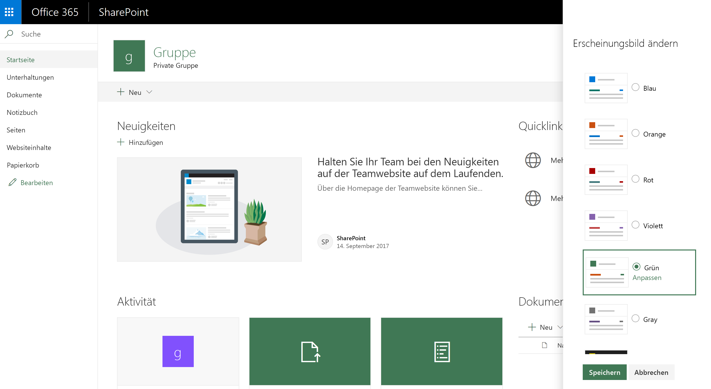

# SharePoint-Websitedesign

Besitzer von SharePoint-Websites stehen jetzt neue Optionen zum Anwenden benutzerdefinierter Formatvorlagen und Farben auf Websites zur Verfügung. Sie machen es einfacher, Designs in Websitesammlungen zu definieren und zu verwalten. Die neuen Features umfassen Folgendes:

* Die Möglichkeit, benutzerdefinierte Designs zu definieren und für Websitebesitzer verfügbar zu machen. Designs werden in einem [JSON-Schema](sharepoint-site-theming-json-schema.md) definiert, in dem die Farbeinstellungen und Metadaten des Designs gespeichert sind.
* Ein vereinfachter Satz von Standarddesigns mit sechs hellen Designs und zwei dunklen Designs
* Die Möglichkeit, zu steuern, welche Designs auf den Seiten Ihrer Website verfügbar sind. Sie können z. B. benutzerdefinierte Designs basierend auf dem Branding oder der Identität Ihrer Organisation definieren und festlegen, dass nur diese Designs auf Ihren Websites verfügbar sind.

Administratoren können diese Features über [PowerShell-Cmdlets](sharepoint-site-theming-powershell.md) nutzen, Entwickler über das [clientseitige Objektmodell (CSOM)](sharepoint-site-theming-csom.md) von SharePoint oder die [REST-API](sharepoint-site-theming-rest-api.md) von SharePoint.

Allgemeine Informationen zur Anpassung von Websites mithilfe von Designs finden Sie unter [Ändern des Aussehens Ihrer SharePoint-Website](https://support.office.com/de-DE/article/Change-the-look-of-your-SharePoint-site-06bbadc3-6b04-4a60-9d14-894f6a170818).

## Standarddesigns

Die folgenden vordefinierten Designs sind standardmäßig verfügbar:

* __Blau__
* __Orange__
* __Rot__
* __Lila__
* __Grün__
* __Grau__
* __Dunkelgelb__ (invertiertes Design)
* __Dunkelblau__ (invertiertes Design)

Diese Designs wurden für optimale Lesbarkeit entwickelt und sind eine gute Grundlage für die Erstellung benutzerdefinierter Designs. Weitere Informationen zu den Standarddesigns finden Sie unter [SharePoint-Websitedesign: JSON-Schema](sharepoint-site-theming-json-schema.md).

## Auswählen eines modernen Designs

<!-- Verify that it's okay to use the concept of "modern" themes/pages here? -->

Zur Auswahl eines der für eine SharePoint-Website verfügbaren Designs klicken Sie rechts oben auf dem Bildschirm auf das __Zahnradsymbol (⚙️)__ und anschließend auf __Change the look__. Ihnen wird dann eine Liste von Designs zur Auswahl präsentiert, die Standarddesigns und/oder benutzerdefinierte Designs enthalten kann, je nachdem, wie Ihre Website konfiguriert wurde.

Auf der Abbildung unten sehen Sie, wie die Standarddesigns im Designauswahl-Dialogfeld dargestellt werden.

Sobald Sie in der Liste ein Design auswählen, werden diese Farbeinstellungen sofort auf die Seite angewendet, damit Sie sich ein Bild von dem ausgewählten Design machen können. Die folgende Abbildung zeigt ein Beispiel mit dem Standarddesign __Grün__.

Sobald Sie ein Design gefunden haben, das Sie verwenden möchten, speichern Sie Ihre Auswahl mit einem Klick auf **Speichern**. Mit einem Klick auf **Abbrechen** können Sie die Seite auf das aktuelle Design zurücksetzen.

## Arbeiten mit klassischen Designs

Sie können weiterhin die klassischen Designs verwenden. Klicken Sie dazu auf den Link _Classic change the look options_ unter den im Dialogfeld _Change the look_ aufgeführten modernen Designs. Da sich die moderne SharePoint-Benutzeroberfläche von der klassischen Benutzeroberfläche unterscheidet, gelten jedoch einige Einschränkungen, wenn Sie klassische Designs auf modernen Seiten verwenden.

Wenn Sie ein klassisches Design auswählen, wird ein modernes Design aus den Einstellungen im klassischen Design generiert, einschließlich des Flag „isInverted“, des Hintergrundbilds und der Farbeinstellungen für „COntentAccent1“, „PageBackground“ und „BackgroundOverlay“. Wenn „isInverted“ auf „True“ gesetzt ist, werden neutrale Farben wie „NeutralDark“ und „NeutralLight“ umgekehrt.

Für optimale Benutzerfreundlichkeit empfehlen wir Ihnen, auf modernen Seiten auch moderne Designs zu verwenden. Wenn Sie klassische Designs auf modernen Seiten verwenden müssen, sollten Sie Ihre Website sorgfältig testen, um sicherzustellen, dass Ihre Inhalte lesbar und barrierefrei sind.

## Weitere Artikel

* [SharePoint-Websitedesign: JSON-Schema](sharepoint-site-theming-json-schema.md)
* [SharePoint-Websitedesign: PowerShell-Cmdlets](sharepoint-site-theming-powershell.md)
* [SharePoint-Websitedesign: CSOM](sharepoint-site-theming-csom.md)
* [SharePoint-Websitedesign: REST-API](sharepoint-site-theming-rest-api.md)
