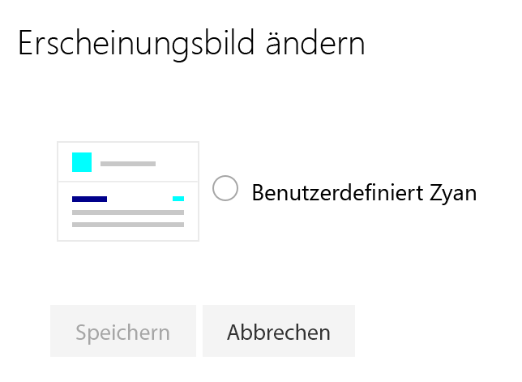

# <a name="sharepoint-site-theming-powershell-cmdlets"></a><span data-ttu-id="6d314-101">SharePoint-Websitedesign: PowerShell-Cmdlets</span><span class="sxs-lookup"><span data-stu-id="6d314-101">SharePoint site theming: PowerShell cmdlets</span></span>

<span data-ttu-id="6d314-102">Mithilfe von PowerShell-Cmdlets können SharePoint-Mandantenadministratoren Websitedesigns erstellen, abrufen und entfernen.</span><span class="sxs-lookup"><span data-stu-id="6d314-102">SharePoint tenant administrators can use PowerShell cmdlets to create, retrieve, and remove site themes.</span></span> <span data-ttu-id="6d314-103">Entwickler können zur Verwaltung von Designs außerdem die [REST-API](sharepoint-site-theming-rest-api.md) verwenden.</span><span class="sxs-lookup"><span data-stu-id="6d314-103">Developers can also use the SharePoint [REST API](sharepoint-site-theming-rest-api.md) to handle theme management tasks.</span></span>

<span data-ttu-id="6d314-104">Informationen zur Definition und Speicherung von Designs finden Sie in der [JSON-Schemareferenz](sharepoint-site-theming-json-schema.md).</span><span class="sxs-lookup"><span data-stu-id="6d314-104">For information about how themes are defined and stored, see [JSON schema reference](sharepoint-site-theming-json-schema.md).</span></span>

## <a name="getting-started"></a><span data-ttu-id="6d314-105">Erste Schritte</span><span class="sxs-lookup"><span data-stu-id="6d314-105">Getting started</span></span>

<span data-ttu-id="6d314-106">Bevor Sie die PowerShell-Cmdlets zur Verwaltung von Designs nutzen können, müssen Sie Folgendes tun:</span><span class="sxs-lookup"><span data-stu-id="6d314-106">To run the PowerShell cmdlets for theme management, you'll need to do the following:</span></span>

1. <span data-ttu-id="6d314-107">Sie müssen die [SharePoint Online-Verwaltungsshell](https://www.microsoft.com/en-us/download/details.aspx?id=35588) herunterladen und installieren.</span><span class="sxs-lookup"><span data-stu-id="6d314-107">Download and install the [SharePoint Online Management Shell](https://www.microsoft.com/en-us/download/details.aspx?id=35588).</span></span> <span data-ttu-id="6d314-108">Ist auf Ihrem System bereits eine frühere Version der Shell installiert, müssen Sie diese Version deinstallieren und anschließend die neueste Version installieren.</span><span class="sxs-lookup"><span data-stu-id="6d314-108">If you already have a previous version of the shell installed, uninstall it first and then install the latest version.</span></span>
2. <span data-ttu-id="6d314-109">Sie müssen eine Verbindung zu Ihrem SharePoint-Mandanten einrichten. Eine Anleitung finden Sie unter [Herstellen einer Verbindung mit SharePoint Online PowerShell](https://technet.microsoft.com/de-DE/library/fp161372.aspx).</span><span class="sxs-lookup"><span data-stu-id="6d314-109">Follow the instructions at [Connect to SharePoint Online PowerShell](https://technet.microsoft.com/de-DE/library/fp161372.aspx) to connect to your SharePoint tenant.</span></span>

<span data-ttu-id="6d314-110">Überprüfen Sie nun Ihr Setup. Rufen Sie dazu mithilfe des Cmdlets **Get-HideDefaultThemes** den Wert für die Einstellung „HideDefaultThemes“ ab.</span><span class="sxs-lookup"><span data-stu-id="6d314-110">To verify your setup, try using the **Get-HideDefaultThemes** cmdlet to read the HideDefaultThemes setting.</span></span> <span data-ttu-id="6d314-111">Wenn das Cmdlet fehlerfrei ausgeführt wird und den Wert „False“ zurückgibt (siehe Beispiel unten), können Sie fortfahren.</span><span class="sxs-lookup"><span data-stu-id="6d314-111">If the cmdlet runs and returns False with no errors, as shown in the following example, you're ready to proceed.</span></span>

```powershell
c:\> Get-HideDefaultThemes
False
```
## <a name="site-theme-cmdlets"></a><span data-ttu-id="6d314-112">Cmdlets für das Websitedesign</span><span class="sxs-lookup"><span data-stu-id="6d314-112">Site theme cmdlets</span></span>

<span data-ttu-id="6d314-113">Zur Verwaltung von Websitedesigns über die PowerShell stehen Ihnen die folgenden Cmdlets zur Verfügung:</span><span class="sxs-lookup"><span data-stu-id="6d314-113">The following cmdlets are available for managing site themes from PowerShell:</span></span>

* <span data-ttu-id="6d314-114">**Add-SPOTheme** &mdash; Erstellt ein neues benutzerdefiniertes Design oder überschreibt ein vorhandenes Design mit neuen Einstellungen.</span><span class="sxs-lookup"><span data-stu-id="6d314-114">**Add-SPOTheme** &mdash; Creates a new custom theme, or overwrites an existing theme to modify its settings.</span></span>
* <span data-ttu-id="6d314-115">**Get-SPOTheme** &mdash; Ruft die Einstellungen eines vorhandenen Designs ab.</span><span class="sxs-lookup"><span data-stu-id="6d314-115">**Get-SPOTheme** &mdash; Retrieves settings for an existing theme.</span></span>
* <span data-ttu-id="6d314-116">**Remove-SPOTheme** &mdash; Entfernt ein Design aus dem Designkatalog.</span><span class="sxs-lookup"><span data-stu-id="6d314-116">**Remove-SPOTheme** &mdash; Removes a theme from the theme gallery.</span></span>
* <span data-ttu-id="6d314-117">**Set-HideDefaultThemes** &mdash; Legt fest, ob die Standarddesigns verfügbar sein sollen.</span><span class="sxs-lookup"><span data-stu-id="6d314-117">**Set-HideDefaultThemes** &mdash; Specifies whether the default themes should be available.</span></span>
* <span data-ttu-id="6d314-118">**Get-HideDefaultThemes** &mdash; Fragt den aktuellen Wert der Einstellung „HideDefaultThemes“ ab.</span><span class="sxs-lookup"><span data-stu-id="6d314-118">**Get-HideDefaultThemes** &mdash; Queries the current HideDefaultThemes setting.</span></span>

## <a name="add-spotheme"></a><span data-ttu-id="6d314-119">Add-SPOTheme</span><span class="sxs-lookup"><span data-stu-id="6d314-119">Add-SPOTheme</span></span>

<span data-ttu-id="6d314-120">Das Cmdlet **Add-SPOTheme** erstellt ein neues Design oder aktualisiert ein vorhandenes Design.</span><span class="sxs-lookup"><span data-stu-id="6d314-120">The **Add-SPOTheme** cmdlet creates a new theme or updates an existing theme.</span></span> <span data-ttu-id="6d314-121">Dabei werden die Farbpaletteneinstellungen als Schlüsselverzeichnis übergeben.</span><span class="sxs-lookup"><span data-stu-id="6d314-121">The color pallette settings are passed as a dictionary.</span></span>

<span data-ttu-id="6d314-122">Im folgenden Beispiel wird ein neues Design namens „Custom Cyan“ erstellt, mit Farbpaletteneinstellungen, die verschiedene Zyanschattierungen definieren.</span><span class="sxs-lookup"><span data-stu-id="6d314-122">In the following example, a new theme named "Custom Cyan" is created, with color pallette settings that are various shades of cyan.</span></span> <span data-ttu-id="6d314-123">Wie Sie sehen, nutzen wir in diesem Beispiel eine Funktion des Typs ```HashToDictionary```, um eine mit der Notation ```@{}``` erstellte Hashtabelle in ein Schlüsselverzeichnis zu konvertieren, wie es für das Cmdlet **Add-SPOTheme** erforderlich ist.</span><span class="sxs-lookup"><span data-stu-id="6d314-123">Note that this example uses a ```HashToDictionary``` function to convert a hash table created with the ```@{}``` notation into a dictionary, as required by **Add-SPOTheme**.</span></span>

```powershell
function HashToDictionary {
  Param ([Hashtable]$ht)
  $dictionary = New-Object "System.Collections.Generic.Dictionary``2[System.String,System.String]"
  foreach ($entry in $ht.GetEnumerator()) {
    $dictionary.Add($entry.Name, $entry.Value)
  }
  return $dictionary
}

$themepallette = HashToDictionary(
 @{
  "themePrimary" = "#00ffff";
  "themeLighterAlt" = "#f3fcfc";
  "themeLighter" = "#daffff";
  "themeLight" = "#affefe";
  "themeTertiary" = "#76ffff";
  "themeSecondary" = "#39ffff";
  "themeDarkAlt" = "#00c4c4";
  "themeDark" = "#009090";
  "themeDarker" = "#005252";
  "neutralLighterAlt" = "#f8f8f8";
  "neutralLighter" = "#f4f4f4";
  "neutralLight" = "#eaeaea";
  "neutralQuaternaryAlt" = "#dadada";
  "neutralQuaternary" = "#d0d0d0";
  "neutralTertiaryAlt" = "#c8c8c8";
  "neutralTertiary" = "#a6a6a6";
  "neutralSecondaryAlt" = "#767676";
  "neutralSecondary" = "#666666";
  "neutralPrimary" = "#333";
  "neutralPrimaryAlt" = "#3c3c3c";
  "neutralDark" = "#212121";
  "black" = "#000000";
  "white" = "#fff";
  "primaryBackground" = "#fff";
  "primaryText" = "#333"
 }
)

Add-SPOTheme -Name "Custom Cyan" -Palette $themepallette -IsInverted $false
```
<span data-ttu-id="6d314-124">Wenn Sie ein vorhandenes Design aktualisieren möchten (beispielsweise mit neuen Farbeinstellungen), verwenden Sie dieselbe Syntax wie im vorherigen Beispiel, fügen jedoch das Flag *-Overwrite* zum Cmdlet **Add-SPOTheme** hinzu.</span><span class="sxs-lookup"><span data-stu-id="6d314-124">If you want to update an existing theme (to modify some of its color settings, for example), use the same syntax as shown previously but add the *-Overwrite* flag to the **Add-SPOTheme** cmdlet.</span></span>

```powershell
Add-SPOTheme -Name "Custom Cyan" -Palette $themepallette -IsInverted $false -Overwrite
```
<span data-ttu-id="6d314-125">Wenn Sie ein Design hinzufügen, wird es noch nicht auf Websites angewendet.</span><span class="sxs-lookup"><span data-stu-id="6d314-125">Adding a theme does not apply the theme to any sites.</span></span> <span data-ttu-id="6d314-126">Das Design wird lediglich zum Store Ihres Mandanten hinzugefügt und steht dann auf modernen Seiten in der Designliste unter **Change the look** zur Verfügung.</span><span class="sxs-lookup"><span data-stu-id="6d314-126">It adds the theme to your tenant store, and then the theme will be available in the list of themes under the **Change the look** option for modern pages.</span></span>

## <a name="get-spotheme"></a><span data-ttu-id="6d314-127">Get-SPOTheme</span><span class="sxs-lookup"><span data-stu-id="6d314-127">Get-SPOTheme</span></span>

<span data-ttu-id="6d314-128">Das Cmdlet **Get-SPOTheme** gibt die Einstellungen eines vorhandenen Designs zurück.</span><span class="sxs-lookup"><span data-stu-id="6d314-128">The **Get-SPOTheme** cmdlet returns the settings for an existing theme.</span></span> <span data-ttu-id="6d314-129">Mit dem folgenden Code beispielsweise können Sie über das Cmdlet **Get-SPOTheme** die Einstellungen des Designs „Custom Cyan“ abrufen, das Sie im vorherigen Beispiel erstellt haben.</span><span class="sxs-lookup"><span data-stu-id="6d314-129">For example, here's how to use the **Get-SPOTheme** cmdlet to return the settings for the "Custom Cyan" theme created in the previous example.</span></span>

```powershell
C:\> Get-SPOTheme -Name "Custom Cyan" | ConvertTo-Json
```
```json
{
    "Name":  "Custom Cyan",
    "Palette":  {
                    "themeLight":  "#affefe",
                    "themeTertiary":  "#76ffff",
                    "black":  "#000000",
                    "neutralSecondary":  "#666666",
                    "neutralTertiaryAlt":  "#c8c8c8",
                    "themeSecondary":  "#39ffff",
                    "themeDarker":  "#005252",
                    "primaryBackground":  "#fff",
                    "neutralQuaternary":  "#d0d0d0",
                    "neutralPrimaryAlt":  "#3c3c3c",
                    "neutralPrimary":  "#333",
                    "themeDark":  "#009090",
                    "themeLighter":  "#daffff",
                    "neutralTertiary":  "#a6a6a6",
                    "neutralQuaternaryAlt":  "#dadada",
                    "themeLighterAlt":  "#f3fcfc",
                    "white":  "#fff",
                    "neutralSecondaryAlt":  "#767676",
                    "neutralLighter":  "#f4f4f4",
                    "neutralLight":  "#eaeaea",
                    "neutralDark":  "#212121",
                    "themeDarkAlt":  "#00c4c4",
                    "neutralLighterAlt":  "#f8f8f8",
                    "primaryText":  "#333",
                    "themePrimary":  "#00ffff"
                },
    "IsInverted":  false
}
```
<span data-ttu-id="6d314-130">Wie Sie sehen, verwenden wir in diesem Beispiel den PowerShell-Filter _ConvertTo-Json_, um das Design im JSON-Format abzurufen.</span><span class="sxs-lookup"><span data-stu-id="6d314-130">Note that this example uses the PowerShell _ConvertTo-Json_ filter to display the theme in JSON format.</span></span>

## <a name="remove-spotheme"></a><span data-ttu-id="6d314-131">Remove-SPOTheme</span><span class="sxs-lookup"><span data-stu-id="6d314-131">Remove-SPOTheme</span></span>

<span data-ttu-id="6d314-132">Das Cmdlet **Remove-SPOTheme** entfernt ein Design aus dem Store Ihres Mandanten.</span><span class="sxs-lookup"><span data-stu-id="6d314-132">The **Remove-SPOTheme** cmdlet removes a theme from your tenant store.</span></span> <span data-ttu-id="6d314-133">Das Cmdlet unten beispielsweise entfernt das Design „Custom Cyan“, das wir in den vorherigen Beispielen verwendet haben.</span><span class="sxs-lookup"><span data-stu-id="6d314-133">For example, this cmdlet removes the "Custom Cyan" theme that was used in the previous examples.</span></span>

```powershell
c:\> Remove-SPOTheme -Name "Custom Cyan"
```
## <a name="set-hidedefaultthemes"></a><span data-ttu-id="6d314-134">Set-HideDefaultThemes</span><span class="sxs-lookup"><span data-stu-id="6d314-134">Set-HideDefaultThemes</span></span>

<span data-ttu-id="6d314-135">_Hinweis: Dieses Cmdlet wird in einer zukünftigen Version in ```Set-SPOHideDefaultThemes``` umbenannt, zwecks Konsistenz mit anderen SharePoint-PowerShell-Cmdlets._</span><span class="sxs-lookup"><span data-stu-id="6d314-135">_NOTE: this cmdlet will be renamed to ```Set-SPOHideDefaultThemes``` in a future release, for consistency with other SharePoint PowerShell cmdlet._</span></span>

<span data-ttu-id="6d314-136">Das Cmdlet **Set-HideDefaultThemes** gibt an, ob die in SharePoint integrierten Standarddesigns in der Liste aufgeführt werden sollen, die Ihnen in der Designauswahl zur Verfügung steht.</span><span class="sxs-lookup"><span data-stu-id="6d314-136">The **Set-HideDefaultThemes** cmdlet is used to specify whether the default themes that come with SharePoint should be included in the theme picker list.</span></span> <span data-ttu-id="6d314-137">Beispiel: Sie möchten benutzerdefinierte Designs für Ihre Websites erstellen und anschließend die Standarddesigns entfernen, damit auf alle Seiten Ihre benutzerdefinierten Designs angewendet werden.</span><span class="sxs-lookup"><span data-stu-id="6d314-137">For example, you might want to create custom themes for your sites and then remove the default themes, to ensure that all pages will use your custom themes.</span></span>

<span data-ttu-id="6d314-138">Wenn Sie die Einstellung auf _$true_ setzen, werden die Standarddesigns ausgeblendet, wenn Sie sie auf _$false_ setzen (Standardeinstellung) werden sie angezeigt.</span><span class="sxs-lookup"><span data-stu-id="6d314-138">Specify the setting as either _$true_ to hide the default themes, or _$false_ (the default setting) to allow use of the default themes.</span></span> <span data-ttu-id="6d314-139">Das Cmdlet unten blendet die Standarddesigns aus:</span><span class="sxs-lookup"><span data-stu-id="6d314-139">For example, this cmdlet hides the default themes.</span></span>

```powershell
Set-HideDefaultThemes $true
```
<span data-ttu-id="6d314-140">Wenn Sie das Design „Custom Cyan“ erstellen und anschließend die Standarddesigns ausblenden, wird in der Designliste unter **Change the look** nur noch dieses eine benutzerdefinierte Design angezeigt.</span><span class="sxs-lookup"><span data-stu-id="6d314-140">After creating the "Custom Cyan" theme, hiding the default themes will leave only the one custom theme in the themes list under **Change the look**.</span></span>



<span data-ttu-id="6d314-142">Sollen die Standarddesigns wieder in der Designauswahl angezeigt werden, können Sie das folgende Cmdlet verwenden.</span><span class="sxs-lookup"><span data-stu-id="6d314-142">To restore the default themes to the theme picker list, use the following cmdlet.</span></span>
```powershell
Set-HideDefaultThemes $false
```

## <a name="get-hidedefaultthemes"></a><span data-ttu-id="6d314-143">Get-HideDefaultThemes</span><span class="sxs-lookup"><span data-stu-id="6d314-143">Get-HideDefaultThemes</span></span>

<span data-ttu-id="6d314-144">_Hinweis: Dieses Cmdlet wird in einer zukünftigen Version in ```Get-SPOHideDefaultThemes``` umbenannt, zwecks Konsistenz mit anderen SharePoint-PowerShell-Cmdlets._</span><span class="sxs-lookup"><span data-stu-id="6d314-144">_NOTE: this cmdlet will be renamed to ```Get-SPOHideDefaultThemes``` in a future release, for consistency with other SharePoint PowerShell cmdlets._</span></span>

<span data-ttu-id="6d314-145">Das Cmdlet **Get-HideDefaultThemes** ruft den aktuellen Wert für die Einstellung **Set-HideDefaultThemes** ab.</span><span class="sxs-lookup"><span data-stu-id="6d314-145">The **Get-HideDefaultThemes** cmdlet retrieves the currrent **Set-HideDefaultThemes** setting.</span></span> <span data-ttu-id="6d314-146">Sie können dieses Cmdlet in ein PowerShell-Skript aufnehmen, um diese Einstellung auszulesen und eine bestimmte Aktion einzuleiten, je nachdem, ob die Standarddesigns angezeigt werden oder nicht.</span><span class="sxs-lookup"><span data-stu-id="6d314-146">You might want to use this cmdlet in a PowerShell script to read the setting and then take different actions based on whether the default themes are hidden.</span></span> <span data-ttu-id="6d314-147">Dieses Cmdlet hat keine Parameter.</span><span class="sxs-lookup"><span data-stu-id="6d314-147">This cmdlet does not have any parameters.</span></span>

```powershell
c:\> Get-HideDefaultThemes
False
```

## <a name="see-also"></a><span data-ttu-id="6d314-148">Weitere Artikel</span><span class="sxs-lookup"><span data-stu-id="6d314-148">See also</span></span>

* [<span data-ttu-id="6d314-149">Überblick über SharePoint-Websitedesign</span><span class="sxs-lookup"><span data-stu-id="6d314-149">SharePoint site theming overview</span></span>](sharepoint-site-theming-overview.md)
* [<span data-ttu-id="6d314-150">SharePoint-Websitedesign: JSON-Schema</span><span class="sxs-lookup"><span data-stu-id="6d314-150">SharePoint site theming: JSON schema</span></span>](sharepoint-site-theming-json-schema.md)
* [<span data-ttu-id="6d314-151">SharePoint-Websitedesign: CSOM</span><span class="sxs-lookup"><span data-stu-id="6d314-151">SharePoint site theming: CSOM</span></span>](sharepoint-site-theming-csom.md)
* [<span data-ttu-id="6d314-152">SharePoint-Websitedesign: REST-API</span><span class="sxs-lookup"><span data-stu-id="6d314-152">SharePoint site theming: REST API</span></span>](sharepoint-site-theming-rest-api.md)
* [<span data-ttu-id="6d314-153">SharePoint Online-Verwaltungsshell</span><span class="sxs-lookup"><span data-stu-id="6d314-153">SharePoint Online Management Shell</span></span>](https://www.microsoft.com/en-us/download/details.aspx?id=35588)
* [<span data-ttu-id="6d314-154">Herstellen einer Verbindung mit SharePoint Online PowerShell</span><span class="sxs-lookup"><span data-stu-id="6d314-154">Connect to your SharePoint Online tenant through PowerShell:</span></span>](https://technet.microsoft.com/de-DE/library/fp161372.aspx)
