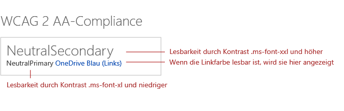

<!--Based on how rough this content is in it's current state, i'm going to pull it from this initial release so we can edit and better prepare. -->

# Barrierefreiheit im SharePoint-WebpartdesignAccessibility in SharePoint web part design

Die Entwicklung eines gleichbleibenden Erlebnisses, bei dem die visuellen, auditiven, körperlichen, kognitiven und sprachlichen Bedürfnisse aller Benutzer erfüllt werden, ist eine wichtige Komponente des SharePoint-Webpartdesigns.Developing an equal experience that meets all users' unique visual, hearing, dexterity, cognitive, and speech needs is an important component of SharePoint web part design. Ein barrierefreies Design bezieht sich nicht nur auf Menschen mit körperlichen Einschränkungen, sondern möglicherweise auch auf situationsbedingte Einschränkungen.Accessible design applies not only to people with disabilities, but also to potential situational impairments. Ein barrierefreies Design ist ein gutes Design.Accessible design is good design.

## Richtlinien für EingabehilfenAccessibility guidelines

<!-- Make sure that this is an external resource that folks can access. Original link was to a OneNote file. -->
Alle Microsoft-Produkte müssen die [Microsoft-Eingabehilfenstandards](https://microsoft.sharepoint.com/teams/msenable/Pages/MASDetails.aspx
"Link zu den Microsoft-Eingabehilfenstandards") erfüllen.All Microsoft products must meet the requirements listed in the [Microsoft Accessibility Standards](https://microsoft.sharepoint.com/teams/msenable/Pages/MASDetails.aspx
"Link to Microsoft Accesssibility Standards").  

<!-- Fabric components are not designed to be accessible already? And, shouldn't components that aren't based on Fabric also be accessible? -->

Wenn Sie ein Dialogfeld, eine Dateiauswahl oder eine beliebige andere [Office-UI-Fabric](https://dev.office.com/fabric#/components)-Komponente erstellen, befolgen Sie die Anleitungen in diesem Artikel, um sicherzustellen, dass Ihre Inhalte barrierefrei sind.If you're building a dialog box, file picker, or any other [Office UI Fabric](https://dev.office.com/fabric#/components) component, follow the guidance in this article to ensure that your content is accessible. 

<!-- Not sure why we have that link? It currently goes to the OneNote file. Where is the Common UI Controls content? Is that related to accessibility? [v-licapu] - I agree; we shouldn't be linking to this unless it's live to external audiences; even I can't access it. I moved it to within the comment: 
[Common UI Controls](https://microsoft.sharepoint.com/teams/STS/_layouts/OneNote.aspx?id=%2Fteams%2FSTS%2FShared%20Documents%2FSP%20Accessibility%2FAccessibility%20Guidance&wd=target%28Accessibility%20101.one%7C0005C142-938C-4411-B543-B9F4199E19B3%2FEverything%20you%20need%20to%20know%20about%20Accessibility%7CE099AFE3-8804-4E1F-BA50-99493AB8A3D0%2F%29 "Link to Common UI Controls") -->

## BarrierefreiheitsprüfungAccessibility testing

<!-- FYI, I added links. Can we assume that our target audience uses the Edge browser? -->

Testen Sie Ihr Webpart zunächst mit [Narrator](https://support.microsoft.com/de-DE/help/22798/windows-10-narrator-get-started) und Microsoft Edge, und überprüfen Sie dann das barrierefrei Erlebnis mit [JAWS](http://www.freedomscientific.com/Products/Blindness/JAWS).Test your web part first with [Narrator](https://support.microsoft.com/de-DE/help/22798/windows-10-narrator-get-started) and Microsoft Edge, and then verify the accessibility experience with [JAWS](http://www.freedomscientific.com/Products/Blindness/JAWS).

Narrator und Microsoft Edge entsprechen den Standards.Narrator and Microsoft Edge are standards compliant. Wenn Sie die Überprüfung auf diese Weise vornehmen, können Sie Probleme leichter aufdecken und feststellen, ob Ihre Seite die Eingabehilfenstandards erfüllt.When you test with that combination, you are more likely to find issues, and you can validate that your site meets accessibility standards. 

JAWS ist Marktführer auf dem Gebiet der Sprachausgabe.JAWS is the market leader in screen readers. JAWS enthält Features, mit denen Sie die Barrierefreiheit einiger Websites verbessern können, die bei anderen Sprachausgaben nicht so leicht zugänglich sind.JAWS includes features that can improve the accessibility of some websites that aren't as accessible in other screen readers. Daher garantiert ein Test in JAWS möglicherweise nicht, dass Ihre Website alle Barrierefreiheitsanforderungen erfüllt.Therefore testing in JAWS might not ensure that your site meets all accessibility requirements. 
 
Möglicherweise möchten Sie auch testen, welche Kombination von Browser und Sprachausgabe den größten Marktanteil für Ihre Website aufweist.You might also want to test for whatever combination of browser and screen reader has the greatest market share for your website.

<!-- Delete? This doesn't seem like text that should be in externally published docs? 
When suppliers test with JAWS, we ask them to repro identified bugs with Narrator and Edge. In the case a bug does not repro with Narrator/Edge it is sent to Mary Smith who works with VFO for a Jaws specific fix. 
-->

## TastaturnavigationKeyboard navigation

<!-- Is this section telling people how to navigate via a keyboard, or how to design to optimize for keyboard navigation? If the former, . -->

Für manche Benutzer ist die Navigation einer Website über die Tastatur leichter.For some users, navigating a site via keyboard is more accessible. Erfahrene Benutzer verwenden häufig die Tastaturnavigation.Power users also often rely on keyboard navigation. Verwenden Sie Tastaturkurzbefehle wie Tabs, um zu Steuerelementen der Seite zu wechseln, und verwenden Sie die Pfeiltasten zum Navigieren innerhalb der Steuerelemente.Use keyboard shortcuts such as tabs to go controls on the page, and use arrow keys to navigate inside controls.

### Navigation zwischen SteuerelementenNavigation between controls

Jedes Steuerelement ist ein Tabstopp.Each control is a tab stop. Innerhalb eines Steuerelements gelten die folgenden Regeln:Within a control, the following rules apply:

- Im Allgemeinen ist der erste Tabstopp der obere linke Bereich des Steuerelements.In general, the first tab stop is the top left area of the control. Der letzte Tabstopp ist das untere rechte Steuerelement.The last tab stop is the bottom right control.
- Bei modalen Oberflächen sollte der letzte Tabstopp die Commit-Aktionen umfassen.For modal surfaces, the last tab stop should be the commit actions.
- Bei Listen sollte der erste Tabstopp das erste Element in der Liste, der nächste Tabstopp die Befehle, der nächste die Navigation, der nächste die Einstellungen usw. umfassen.For lists, the first tab stop should be the first item in the list, the next should be the commands, and then the navigation, settings, and so on.

<!-- We should make sure the content in the accessibility topic is accessibible. ;) Please describe the information that the image conveys; something like this (also consider making the image an actual screen shot, that might be more clear):

In the following image:
The first tab is the list item.
The second tab is the command.
The third tab is the navigation.
-->

*Abbildung 1: Tabstopps einer SharePoint-Seite**Figure 1. The tab stops on a SharePoint page*

### Navigation innerhalb eines SteuerelementsNavigation within a control

Sie können die Pfeiltasten verwenden, um zu Objekten eines Steuerelements, z. B. den Optionen in einem Menü, Befehlen in einer Befehlsleiste oder Elementen in einer Liste zu wechseln.You can use arrow keys to move to items in a control, such as choices in a menu, commands in a command bar, or items in a list.

<!-- This image is not very clear. Do you need to have the "blank" list box on the left? -->

*Abbildung 2: Verwenden der Pfeiltasten zum Navigieren innerhalb eines Steuerelements**Figure 2. Using arrow keys to navigate within a control*

### Auswählen des aktuellen ElementsSelecting the current item

Verwenden Sie die Leertaste oder deaktivieren Sie das derzeit gewählte Element in einem Steuerelement.Use the space bar to select or deselect the item currently in focus in a control.

*Abbildung 3: Verwenden der Leertaste zum Auswählen eines Elements in einer Liste**Figure 3. Using the space bar to select an item in a list*

### Ausführen eines SteuerelementsRun a control

Drücken Sie die EINGABETASTE, um ein Steuerelement auszuführen.Select Enter or the return key to run a control.

*Abbildung 4: Drücken der EINGABETASTE zum Ausführen eines Steuerelements**Figure 4. Selecting Enter to run a control*

### Verlassen eines SteuerelementsLeave a control

Drücken Sie die **ESC-Taste**, um ein Steuerelement zu verlassen und zum Container zurückkehren.Select **Escape** to exit a control and return to the container.

*Abbildung 5: Drücken der ESC-Taste zum Verlassen eines Steuerelements und zum Zurückkehren zum Container**Figure 5. Selecting Escape to leave a control and return to the container*

### Wechseln zum ersten bzw. letzten ElementGo to the first or last item

Drücken Sie **POS1** oder **Ende**, um direkt zum ersten oder letzten Element einer Liste, eines Menüs usw. zu springen.Select **Home** or **End** to go directly to the first or last item in a list, menu, and so on.

*Abbildung 6: Drücken von POS1 oder Ende, um zum ersten oder letzten Element einer Liste zu springen**Figure 6. Selecting Home or End to go to the first or last item in a list*

## Navigation per SprachausgabeScreen reader navigation

Benutzer mit Sehschwächen navigieren die Benutzeroberfläche der Website per SprachausgabeUsers who have vision impairments rely on screen readers to navigate the site UI. 

<!-- Narrator isn't a third-party product. This image needs more text/explanation; please also clarify the alt text. Is this section important, or can it be removed, given the previous mention of testing with Narrator and JAWS? Again, the intent/target audience for this information isn't clear - is it for the user, or the designer? Can you explain why this information is important from the designer's POV? -->

*Abbildung 7: Navigation per Sprachausgabe einer SharePoint-Website**Figure 7. Screen reader navigation of a SharePoint page*

## Alternativtext und TranskriptionenAlt text and transcripts

Verwenden Sie Beschreibungen von Bildern, die von der Sprachausgabe verarbeitet werden können.Use alt text to provide descriptions of images that can be consumed by screen readers. Dies ist nützlich Benutzer mit Sehschwächen, die Informationen visuell nicht erfassen können.This is useful for vision-impaired users who cannot consume information visually. Stellen Sie sicher, dass Ihr Alternativtext eine ausführliche Beschreibung enthält, da einige Benutzer eine Sprachausgabe verwenden, um Zugriff auf die Informationen des Bildes zu erhalten.Make sure that your alt text is descriptive, keeping in mind that some readers are relying on a screen reader to access the information conveyed in the image. 

Verwenden Sie nicht nur Farben, um eine Bedeutung zu erklären, sondern auch Formen.Don't rely only on color to convey meaning; rely on both color and shape.

Um eine vollständige Konformität mit den Eingabehilfenstandards zu erreichen, beziehen Sie Alternativtext und eine vollständige Transkription der Audio- und Videoinhalte Ihrer Website mit ein.To be fully compliant with accessibility standards, include alt text and a complete transcript of audio and video content on your site.

## Lesbarkeit durch KontrastMinimum readable contrast

Ein minimaler Kontrast ist dringend erforderlich, damit Benutzer mit Sehschwächen die Inhalte der Seite erfassen können.A minimum level of contrast is essential to help users with vision impairments consume the content on the page. Dies ist ebenfalls wichtig, um eine Lesbarkeit bei schwacher Beleuchtung oder störenden Effekten wie Blendung zu gewährleisten.It is also important to aid readability in low light and glare situations. 

<!-- Convert this image into a table, for accessibility. ;) -->
<!-- -->

### Designfarben (Blau) und neutrale FarbenTheme colors (Blue) and neutral colors

<table>
<tr>
<td style="color:white; background-color:#004578">themeDarker: #004578themeDarker: #004578</td>
<td style="color:white; background-color:#000000">black: #000000black: #000000</td>
</tr>
<tr>
<td style="color:white; background-color:#005a9e">themeDark: #005a9ethemeDark: #005a9e</td>
<td style="color:white; background-color:#212121">neutralDark: #212121neutralDark: #212121</td>
</tr>
<tr>
<td style="color:white; background-color:#106ebe">themeDarkAlt: #106ebethemeDarkAlt: #106ebe</td>
<td style="color:white; background-color:#333">neutralPrimary: #333neutralPrimary: #333</td>
</tr>
<tr>
<td rowspan="3" style="font-weight:bold; vertical-align:middle; color:white; background-color:#0078d7">themePrimary: #0078d7themePrimary: #0078d7</td>
<td style="color:white; background-color:#3c3c3c">neutralPrimaryAlt: #3c3c3cneutralPrimaryAlt: #3c3c3c</td>
</tr>
<tr>
<td style="color:white; background-color:#666666">neutralSecondary: #666666neutralSecondary: #666666</td>
</tr>
<tr>
<td style="color:black; background-color:#a6a6a6">neutralTertiary: #a6a6a6neutralTertiary: #a6a6a6</td>
</tr>
<tr>
<td style="color:white; background-color:#2b88d8">themeSecondary: #2b88d8themeSecondary: #2b88d8</td>
<td style="color:black; background-color:#c8c8c8">neutralTertiaryAlt: #c8c8c8neutralTertiaryAlt: #c8c8c8</td>
</tr>
<tr>
<td style="color:black; background-color:#71afe5">themeTertiary: #71afe5themeTertiary: #71afe5</td>
<td style="color:black; background-color:#eaeaea">neutralLight: #eaeaeaneutralLight: #eaeaea</td>
</tr>
<tr>
<td style="color:black; background-color:#c7e0f4">themeLight: #c7e0f4themeLight: #c7e0f4</td>
<td style="color:black; background-color:#f4f4f4">neutralLighter: #f4f4f4neutralLighter: #f4f4f4</td>
</tr>
<tr>
<td style="color:black; background-color:#deecf9">themeLighter: #deecf9themeLighter: #deecf9</td>
<td style="color:black; background-color:#f8f8f8">neutralLighterAlt: #f8f8f8neutralLighterAlt: #f8f8f8</td>
</tr>
<tr>
<td style="color:black; background-color:#eff6fc">themeLighterAlt: #eff6fcthemeLighterAlt: #eff6fc</td>
<td style="color:black; background-color:#fff">white: #fffwhite: #fff</td>
</tr>
</table>

### Farben für WarnungenAlert colors

<table>
<tr>
<td style="color:white; background-color:#952226">themeDark: #952226themeDark: #952226</td>
</tr>
<tr>
<td style="color:black; background-color:#f6d6d8">themeLight: #f6d6d8themeLight: #f6d6d8</td>
</tr>
<tr>
<td style="color:white; background-color:#e55c12">themeSecondary: #e55c12themeSecondary: #e55c12</td>
</tr>
</table>

 

<table>
<tr>
<td style="color:white; background-color:#0f7c39">themeDarkAlt: #0f7c39themeDarkAlt: #0f7c39</td>
</tr>
<tr>
<td style="color:black; background-color:#bff7d5">themeLight: #bff7d5themeLight: #bff7d5</td>
</tr>
</table>

## Hoher KontrastHigh contrast

Verwenden Sie Farben mit hohem Kontrast für die Auswahl von Komponenten und Merkmalen im Internet.Use high contrast colors as a guide for color choices for components and states on the web. Windows-Computer können nur erkennen, ob ein PC mit der Einstellung „Hoher Kontrast“ oder „Hoher Kontrast Weiß“ ausgeführt wird.Windows computers only have the ability to detect whether a PC is running high contrast, or high contrast white. Verwenden Sie aus diesem Grund die standardmäßige Einstellung „Hoher Kontrast Schwarz“ für alle kontrastreichen, nicht weißen Designs.For this reason, use the default high contrast black setting for any high contrast, non-white theme.

<!-- In the left part of the image, I think the title should be "High Contrast Black". -->

*Abbildung 8: Einstellungen „Hoher Kontrast Schwarz“ und „Hoher Kontrast Weiß“**Figure 8. High contrast black and high contrast white settings*

