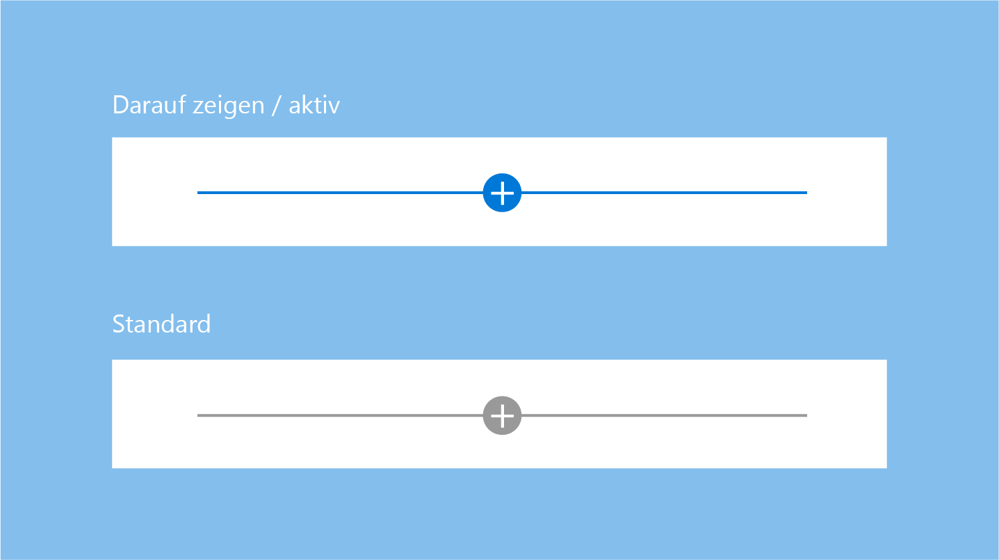
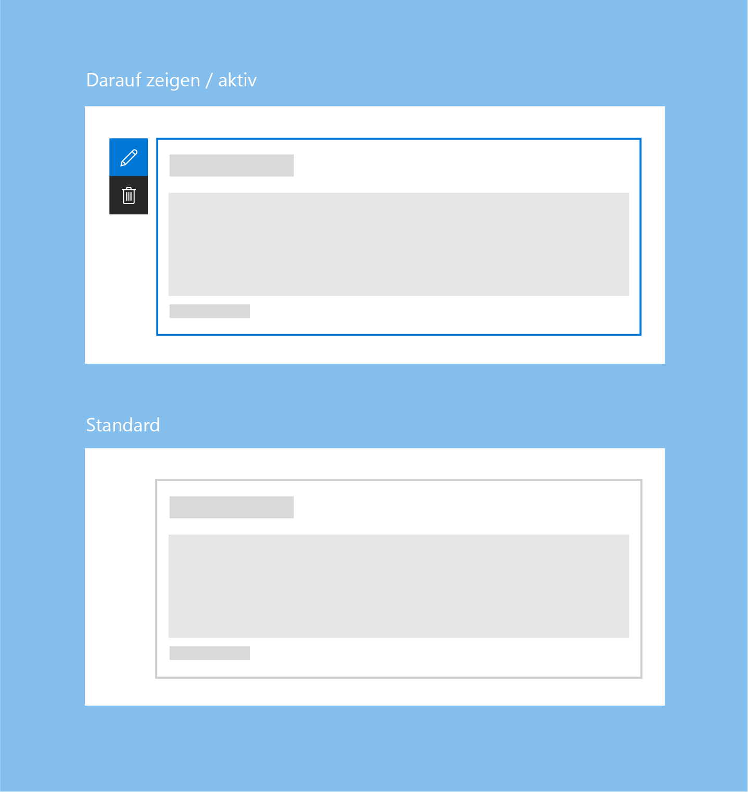

# Erstellen von Seiten auf einer SharePoint-WebsiteAuthoring pages in a SharePoint site

Das Erstellen von Seiten in SharePoint ist unkompliziert, erfordert jedoch einige Kenntnisse der SharePoint-Umgebung. Außerdem müssen Sie sich in grundlegenden Zügen bewusst sein, was Sie entwerfen und für wen.Authoring pages in SharePoint is a simple process, but it does require some familiarity with the SharePoint environment, as well as an understanding of what and who you are designing the page for. Ein paar Grundprinzipien – wie „Einfach beginnen“ und „Auf dem aufsetzen, was funktioniert“ – sind zu Beginn eines Projekts hilfreich.A few basic principles – like remembering to "Start simple" and "Build on what's working" - are valuable things to consider as you start authoring. Es ist auch sinnvoll, immer Ihre Zielgruppe und die Ziele im Hinterkopf zu behalten, bei deren Umsetzung Sie sie unterstützen möchten.It's also a good idea to consistently remind yourself of your audience, and the goals that you are trying to help them achieve.

<!-- Do we have content about the design principles that we can link to here? -->

Die Erstellungsumgebung für SharePoint Seiten hat zwei Modi:The SharePoint page authoring experience has two modes: 

- **Bearbeiten**Edit In diesem Modus können Seitenautoren Webparts hinzufügen und konfigurieren, um einer Seite Inhalte hinzuzufügen.Edit - Allows page authors to add and configure web parts to add content to a page.
- **Veröffentlicht**Published In diesem Modus kann Ihr Team oder Ihre Zielgruppe die Inhalte sehen und mit Webparts interagieren.Published - Allows your team or audience to view content and interact with web parts. 

## BearbeitungsmodusEdit mode

Beim Erstellen einer neuen Seite haben Benutzer Zugriff auf die Erstellungsbenutzeroberfläche, um Inhalte hinzuzufügen und den Seiteninhalt anzupassen.When creating a new page, users have access to the authoring UI to add content to and customize the page content. 

 

 

### Hinweis zum Hinzufügen und ToolboxAdd hint and Toolbox

Der Hinweis zum Hinzufügen besteht aus einer horizontalen Linie mit einem Pluszeichen, die angezeigt wird, wenn ein Webpart ausgewählt wird oder wenn auf ein Webpart gezeigt wird. Er markiert, wo Autoren neue Webparts zu ihrer Seite hinzufügen können.The add hint is a horizontal line with a plus icon that is visible when a web part is selected and on hover to indicate where page authors can add new web parts to their page. Die Toolbox wird geöffnet, wenn ein Benutzer auf das Pluszeichen klickt.The Toolbox opens when a user chooses the plus icon. Die Toolbox enthält alle Webparts, die einer Seite hinzugefügt werden können.The Toolbox contains all the web parts that can be added to a page.

 

### SymbolleisteToolbar

Eine vertikale Symbolleiste und ein umgebendes Feld sind Teil des Frameworks für jedes Webpart und werden von der Seite bereitgestellt.A vertical toolbar and bounding box is part of the framework for every web part and is provided by the page. Jedes Webpart stellt in der Symbolleiste eine Bearbeitungs- und eine Löschaktion bereit.Each web part has an edit and delete action in the toolbar. 

 

### Aktiver Zustand und Hover-ZustandActive and hover states

Im Hover-Zustand oder im aktiven Zustand haben die Hinweisleisten als Farbe das primäre Blau oder das primäre Farbdesign für die Website.On hover/active, the hint bars are primary blue or the primary theme color for the site.

 

Das umgebende Feld für ein Webpart ist standardmäßig Grau, wird aber in Primärblau oder dem primären Farbdesign der Website angezeigt, wenn der Mauszeiger auf ihm platziert wird oder wenn das Webpart ausgewählt wird.The bounding box for a web part is gray by default, but picks up the primary blue or primary theme color for the site on hover or when the web part is selected.

 

### Kontextbezogene BearbeitungenContextual edits

Entwerfen Sie eine WYSIWYG-Umgebung für Webparts, sodass Benutzer Informationen eingeben oder Inhalte hinzufügen können, die beim Veröffentlichen angezeigt werden.Design a WYSIWYG experience for web parts so that users can fill in information or add content that will be displayed when published. Diese Inhalte sollten auf der Seite eingegeben werden, sodass der Benutzer nachvollziehen kann, wie sie im Viewer gerendert werden.This content should be entered on the page so the user understands how the it will render in the viewer. Titel und Beschreibungen sollten beispielsweise dort eingegeben werden, wo der Text angezeigt werden soll; neue Aufgaben sollten im Kontext der Seite hinzugefügt und geändert werden.For example, titles and descriptions should be filled out where the text displays; new tasks should be added and modified in the context of the page.

 

### Bearbeitungen auf ElementebeneItem-level edits

Die Benutzeroberfläche kann sich innerhalb des Webpart ändern. Text wird zum Beispiel in ein Textfeld umgewandelt, oder auf der Benutzeroberfläche werden Elemente neu angeordnet oder Aufgaben als erledigt markiert.UI can change within the web part; for example, text can become a text field, or you can display UI to reorder items or to check off tasks in a web part. Sie können interaktive Funktionen für Webparts im Bearbeitungsmodus, im Lesemodus oder in beiden Modi aktivieren, je nach Designabsicht.You can enable interactive functionality for web parts in edit mode, in read mode, or in both, depending on your design intent.

 

### EigenschaftenbereicheProperty panes

Eigenschaftenbereiche werden über das **Bearbeiten**-Symbol auf der Symbolleiste aufgerufen.Property panes are invoked via the **Edit** icon on the toolbar. Eigenschaftenbereiche sollten in erster Linie Konfigurationseinstellungen zur Aktivierung oder Deaktivierung von Features enthalten, die entweder auf der Seite angezeigt werden oder Inhalte über den Aufruf eines Diensts rendern.Property panes should primarily contain configuration settings that enable or disable features that either show on page, or make a call to a service to display content. 

 

## Modus „Veröffentlicht“Published mode

Sobald die Seite veröffentlicht wurde, wird die gesamte Bearbeitungsoberfläche für den Betrachter oder Leser der Seite deaktiviert.After the page is published, all edit UI is disabled and for the viewer or reader of the page. Will der Benutzer die Seite weiter bearbeiten, muss er oben rechts auf der Befehlsleiste auf die Schaltfläche **Bearbeiten** klicken.To continue editing the page, the user selects the **Edit** button on the top right corner of the command bar.

 

## Mobile AnsichtMobile view

Alle SharePoint-Seiten sind [dynamisch](grid-and-responsive-design.md), damit die Seiteninhalte auf mobilen Geräten optimal dargestellt werden.All SharePoint pages are [responsive](grid-and-responsive-design.md) to allow the content of the page to be viewed on mobile devices. Beim Entwerfen eines Webparts müssen Sie immer vor Augen haben, wie die neuen Seiten Ihrer SharePoint-Website auf unterschiedlichen Geräten gerendert werden.While designing a web part, it is important to understand how the new SharePoint site pages render across different devices.

## Siehe auchSee also

- [Entwerfen von benutzerfreundlichen SharePoint-UmgebungenDesigning great SharePoint experiences](design-guidance-overview.md)