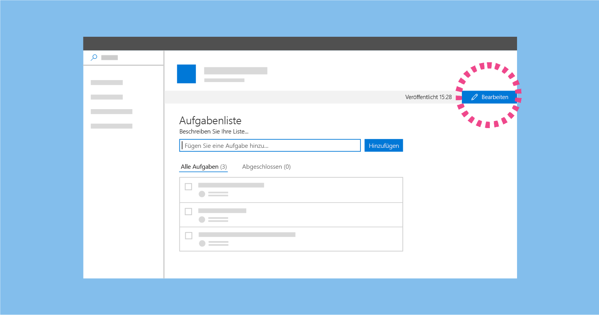
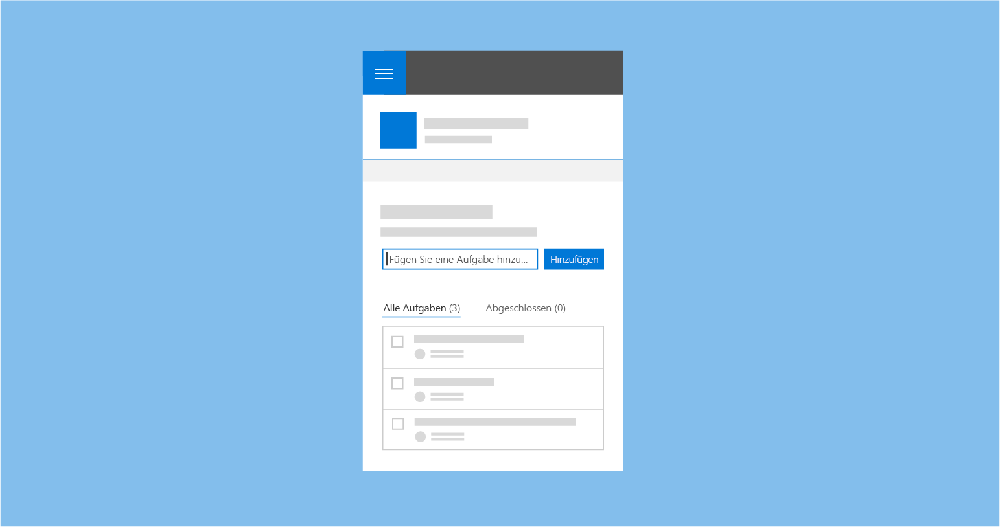

# Erstellen von Seiten auf einer SharePoint-Website

Das Erstellen von Seiten in SharePoint ist ein einfacher Vorgang, aber es erfordert einige Kenntnisse der SharePoint-Umgebung sowie ein grundlegendes Verständnis davon, was und für wen Sie die Seite entwerfen. Ein paar Grundprinzipien – wie „Einfach beginnen“ und „Auf dem aufsetzen, was funktioniert“ – sind zu Beginn der Erstellung hilfreich. Es ist auch sinnvoll, ständig Ihre Zielgruppe und die Ziele im Hinterkopf zu behalten, bei denen Sie sie unterstützen möchten.

<!-- Do we have content about the design principles that we can link to here? -->

Die Erstellungsumgebung für SharePoint- Seiten weist zwei Modi auf: 

- Bearbeitungsmodus: In diesem Modus können Seitenautoren Webparts hinzufügen und konfigurieren, um einer Seite Inhalte hinzuzufügen.
- Modus „Veröffentlicht“: In diesem Modus kann Ihr Team oder Ihre Zielgruppe den Inhalt anzeigen und mit Webparts interagieren. 

## Bearbeitungsmodus

Beim Erstellen einer neuen Seite haben Benutzer Zugriff auf die Erstellungsbenutzeroberfläche, um Inhalte hinzuzufügen und den Seiteninhalt anzupassen. 

### Hinweis zum Hinzufügen und Toolbox

Der Hinweis zum Hinzufügen besteht aus einer horizontalen Linie mit einem Pluszeichen, die angezeigt wird, wenn ein Webpart ausgewählt wird, und wenn darauf gezeigt wird, um anzugeben, wo Seitenautoren neue Webparts zu ihrer Seite hinzufügen können. Die Toolbox wird geöffnet, wenn ein Benutzer das Pluszeichen wählt. Die Toolbox enthält alle Webparts, die einer Seite hinzugefügt werden können.

### Symbolleiste

Eine vertikale Symbolleiste und das umgebende Feld sind Teil des Frameworks für jedes Webpart und werden von der Seite bereitgestellt. Jedes Webpart weist in der Symbolleiste eine Bearbeitungs- und Löschaktion auf. 

### Aktiver Zustand (Mauszeiger)

Im aktiven Zustand (Mauszeiger) sind die Hinweisleisten primär Blau oder die primäre Designfarbe für die Website.

Das umgebende Feld für ein Webpart ist standardmäßig Grau, wird aber primär Blau oder die primäre Designfarbe für die Website beim Zeigen mit der Maus oder wenn das Webpart ausgewählt wird.

### Kontextbezogene Bearbeitungen

Entwerfen Sie eine WYSIWYG-Umgebung für Webparts, sodass Benutzer Informationen eingeben oder Inhalte hinzufügen können, die beim Veröffentlichen angezeigt werden. Diese Inhalte sollten auf der Seite eingegeben werden, sodass der Benutzer versteht, wie sie im Viewer wiedergegeben werden. Titel und Beschreibungen sollten beispielsweise dort eingegeben werden, wo der Text angezeigt wird, oder neue Aufgaben sollten im Kontext der Seite hinzugefügt und geändert werden.

### Bearbeitungen auf Elementebene

Die Benutzeroberfläche kann sich innerhalb des Webpart ändern. Text wird zum Beispiel in ein Textfeld umgewandelt, oder Sie können die Benutzeroberfläche zur Neuanordnung von Elementen oder zum Überprüfen von Aufgaben in einem Webpart anzeigen. Sie können interaktive Funktionalität für Webparts im Bearbeitungsmodus, im schreibgeschützten Modus oder in beiden Modi aktivieren, je nach Designabsicht.

### Eigenschaftenbereiche

Eigenschaftenbereiche werden über das Symbol  **Bearbeiten** auf der Symbolleiste aufgerufen. Eigenschaftenbereiche sollten in erster Linie Konfigurationseinstellungen enthalten, die Features aktivieren oder deaktivieren, die entweder auf der Seite angezeigt werden oder die einen Aufruf eines Diensts vornehmen, um Inhalte anzuzeigen. 

## Modus „Veröffentlicht“

Nachdem die Seite veröffentlicht wurde, wird die gesamte Bearbeitungsoberfläche für den Viewer oder Leser der Seite deaktiviert. Um mit der Bearbeitung der Seite fortzufahren, wählt der Benutzer oben rechts in der Befehlsleiste die Schaltfläche **Bearbeiten** aus.

## Mobile Ansicht

Alle SharePoint-Seiten sind [reaktionsschnell](grid-and-responsive-design.md), damit der Inhalt der Seite auf mobilen Geräten angezeigt werden kann. Beim Entwerfen eines Webpart ist es wichtig, zu verstehen, wie die neuen SharePoint-Websiteseiten auf unterschiedlichen Geräten dargestellt werden.

