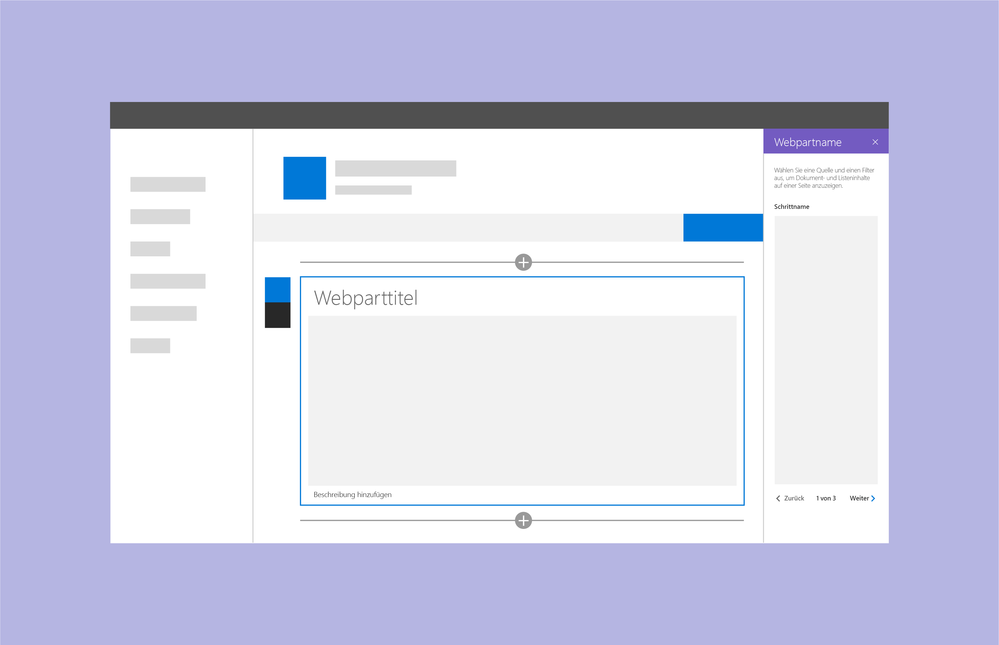
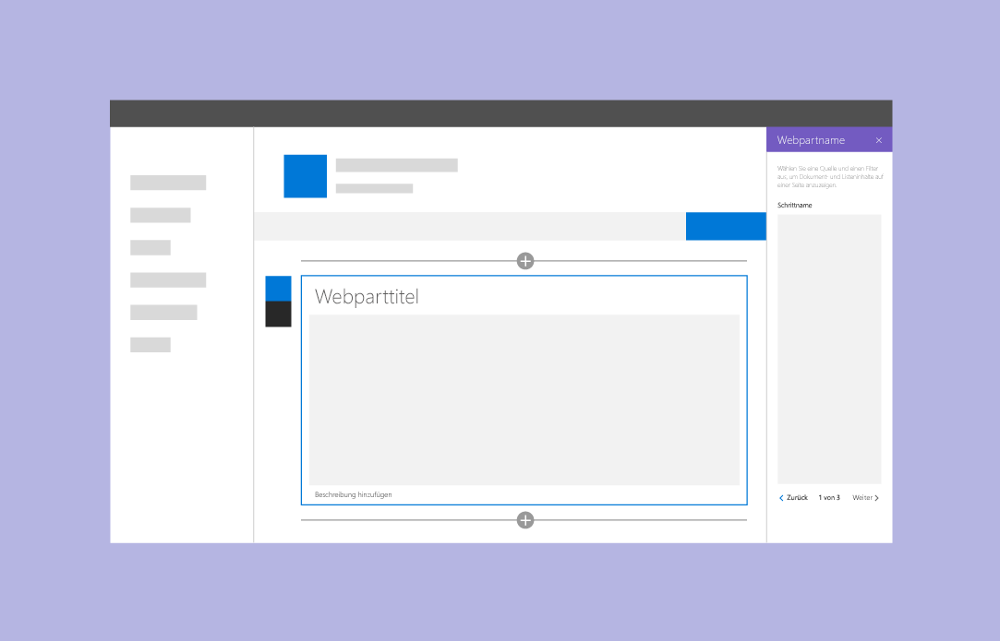

# Entwerfen eines SharePoint-Webparts

Bevor Sie mit der Arbeit an einem SharePoint-Webpart beginnen, sollten Sie wissen, wie [Seiten in SharePoint-Websites erstellt werden](authoring-pages.md). Erstellen Sie, falls noch nicht geschehen, eine Seite, und fügen Sie ihr Webparts verschiedenen Typs hinzu. Außerdem ist es wichtig, dass Sie den Umgang mit Office Fabric-Komponenten und -Formatvorlagen beherrschen, damit Sie Ihr neues Webpart schneller und einfacher implementieren können.

Wenn Sie Webparts entwerfen möchten, sollten Sie mit den folgenden Konzepten vertraut sein:

- [Eigenschaftenbereichstypen und deren Verwendung](#property-pane-types)
- [Reaktive und nicht-reaktive Webparts](reactive-and-nonreactive-web-parts.md)
- [Titel und Beschreibungen](web-part-titles-and-descriptions.md)
- [Platzhalter und Fallbacks](placeholders-and-fallbacks.md)

## Eigenschaftenbereichstypen

Ihnen stehen drei verschiedene Typen von Eigenschaftenbereichen zur Verfügung, mit denen Sie Webparts entwerfen und entwickeln können, die perfekt auf die Anforderungen Ihres Unternehmens oder Ihrer Kunden zugeschnitten sind.

Über einen Klick auf **Bearbeiten** lässt sich ein Bereich für die Konfiguration der Webparteinstellungen öffnen. In diesem Bereich können Features aktiviert und deaktiviert, eine Quelle und ein Layout ausgewählt und Optionen festgelegt werden. Webpartinhalte sollten innerhalb des Webparts bearbeitet werden, nicht im Eigenschaftenbereich.

Der Eigenschaftenbereich ist 320 Pixel groß. Sobald er geöffnet wird, wird die Seite dynamisch umgebrochen.

### Einzelner Bereich

Verwenden Sie einen einzelnen Bereich für einfache Webparts, bei denen nur wenige Eigenschaften konfiguriert werden können.

 

### Akkordeon-Bereich

Verwenden Sie einen Akkordeon-Bereich, wenn Sie eine oder mehrere Gruppen von Eigenschaften mit vielen Optionen implementieren möchten. Diese Variante ist auch empfehlenswert, wenn in den Gruppen lange, scrollbare Optionslisten angezeigt werden sollen. Ein Anwendungsbeispiel wäre ein Bereich mit drei Gruppen namens „Properties“, „Appearance“ und „Layout“, von denen jede über zehn Komponenten verfügt.

Sie sollten Akkordeon-Bereiche ebenfalls verwenden, wenn Sie Kategorisierung auf ein komplexes Webpart anwenden müssen.

 

**Beispiel für Akkordeon-Gruppen, mit geöffnetem letzten Bereich**

 

**Beispiel für Akkordeon-Gruppen mit zwei geöffneten Gruppen**

 

### Schrittbasierter Bereich

Ein schrittbasierter Bereich empfiehlt sich, wenn Sie Eigenschaften auf mehrere Schritte oder Seiten aufteilen möchten, beispielsweise wenn Ihr Webpart in linearer Reihenfolge konfiguriert werden muss oder wenn die im ersten Schritt getroffene Auswahl Auswirkungen darauf hat, welche Optionen im zweiten oder dritten Schritt angezeigt werden. 

**Schritt 1 im schrittbasierten Bereich**

In Schritt 1 ist die „Back“-Schaltfläche deaktiviert und die „Next“-Schaltfläche aktiviert.

 

**Schritt 2 im schrittbasierten Bereich** 

In Schritt 2 ist sowohl die „Back“-Schaltfläche als auch die „Next“-Schaltfläche aktiviert.

 

**Schritt 3 im schrittbasierten Bereich** 

In Schritt 3 ist die „Next“-Schaltfläche deaktiviert und die „Back“-Schaltfläche aktiviert.

## Siehe auch

- [Entwerfen von benutzerfreundlichen SharePoint-Umgebungen](design-guidance-overview.md)

