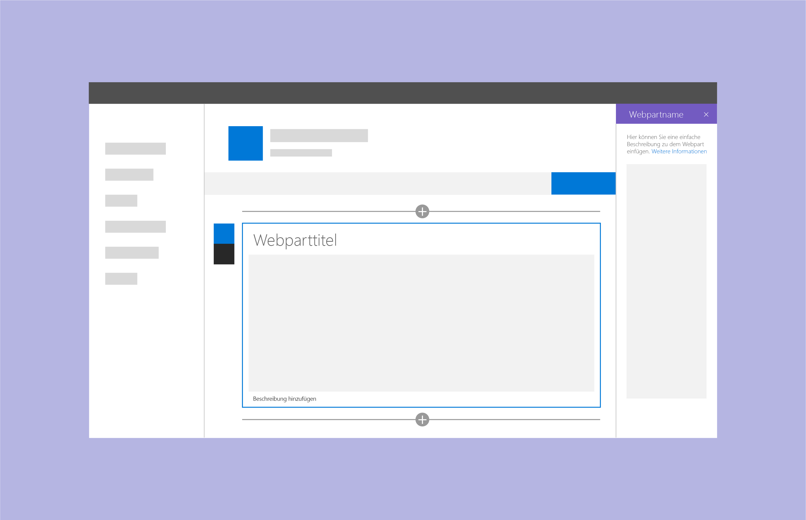
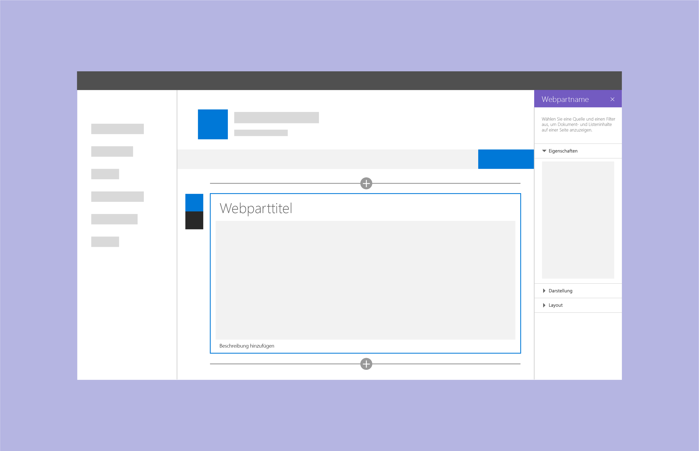
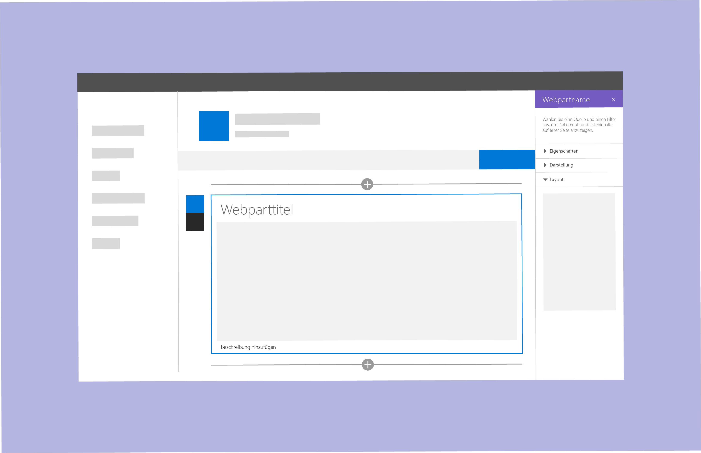

# Entwerfen eines SharePoint-Webparts

Bevor Sie ein SharePoint-Webpart entwerfen, sollten Sie verstehen, wie [Seiten in einer SharePoint-Website erstellt werden](authoring-pages.md). Wenn Sie noch nicht über diese Kenntnisse verfügen, nehmen Sie sich etwas Zeit,um eine Seite zu erstellen und mehrere Typen von Webparts hinzuzufügen. Es ist wichtig, dass Sie Office Fabric-Komponenten und -Formatvorlagen nutzen können, damit neue Webparts schneller und einfacher betriebsbereit sind.

Beim Entwerfen von Webparts ist es wichtig, dass Sie mit folgenden Konzepten vertraut sind:

- [Eigenschaftenbereichstypen und deren Verwendung](#property-pane-types)
- [Dynamische und nicht dynamische Webparts](reactive-and-nonreactive-web-parts.md)
- [Titel und Beschreibungen](web-part-titles-and-descriptions.md)
- [Fallbacks und Platzhalter](placeholders-and-fallbacks.md)

## Eigenschaftenbereichstypen

Sie können drei Arten von Eigenschaftenbereichen zum Entwerfen und Entwickeln von Webparts verwenden, die den Anforderungen Ihres Unternehmens oder Ihrer Kunden entsprechen.

Um einen Bereich zum Konfigurieren der Einstellungen für ein Webpart zu öffnen, wählen Sie **Bearbeiten**. Verwenden Sie den Bereich zum Aktivieren und Deaktivieren von Features, Auswählen einer Quelle, Auswählen eines Layouts und zum Festlegen von Optionen. Bearbeiten Sie Webpartinhalte innerhalb des Webparts, und nicht im Eigenschaftenbereich.

Der Eigenschaftenbereich ist 320 Pixel groß, und die Seite wird beim Öffnen dynamisch umgebrochen.

### Einzelner Bereich
Verwenden Sie einen einzelnen Bereich für einfache Webparts, bei denen nur eine kleine Anzahl von Eigenschaften konfiguriert werden kann.

### Accordion-Bereich
Verwenden Sie einen Accordion-Bereich für eine Gruppe bzw. Gruppen von Eigenschaften mit vielen Optionen und dann, wenn die Gruppen zu einer langen Liste mit Optionen zum Scrollen führen würden. Angenommen, Sie haben drei Gruppen mit dem Namen „Eigenschaften“, „Darstellung“ und „Layout“, von denen jede über zehn Komponenten verfügt.

Verwenden Sie Accordion-Bereiche, wenn Sie eine Kategorisierung für ein komplexes Webpart anwenden müssen.

**Beispiel für Accordion-Gruppen mit zuletzt verwendetem Bereich**

**Beispiel für Accordion-Gruppen mit zwei Gruppen**

### Bereich „Schritte“

Verwenden Sie den Bereich „Schritte“ zum Gruppieren von Eigenschaften in mehreren Schritten oder Seiten, wenn das Webpart in einer linearen Reihenfolge konfiguriert werden muss oder wenn die beim ersten Schritt getroffene Auswahl Auswirkungen auf Optionen hat, die im zweiten oder dritten Schritt angezeigt werden. 

**Schritt 1 im Bereich „Schritte“**

In Schritt 1 ist die Schaltfläche „Zurück“ deaktiviert und die Schaltfläche „Weiter“ aktiviert.

**Schritt 2 im Bereich „Schritte“** 

In Schritt 2 sind die Schaltflächen „Zurück“ und „Weiter“ aktiviert.

**Schritt 3 im Bereich „Schritte“** 

In Schritt 3 ist die Schaltfläche „Weiter“ deaktiviert und die Schaltfläche „Zurück“ aktiviert.

