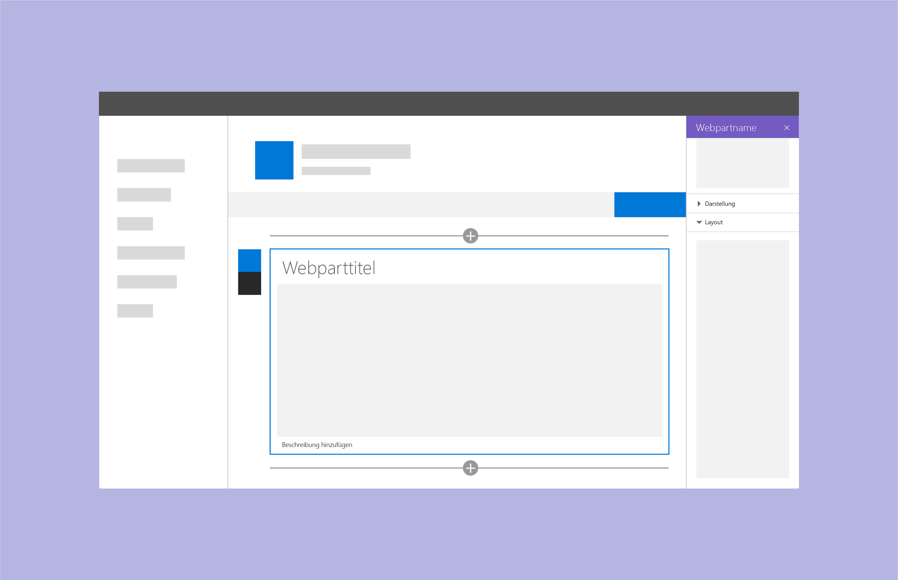

# Entwerfen eines SharePoint-WebpartsDesigning a SharePoint web part

Bevor Sie mit der Arbeit an einem SharePoint-Webpart beginnen, sollten Sie wissen, wie [Seiten in SharePoint-Websites erstellt werden](authoring-pages.md).Before you design a SharePoint web part, you should understand how to [author pages in a SharePoint site](authoring-pages.md). Erstellen Sie, falls noch nicht geschehen, eine Seite, und fügen Sie ihr Webparts verschiedenen Typs hinzu.If you haven't already, take some time to create a page and add multiple types of web parts. Außerdem ist es wichtig, dass Sie den Umgang mit Office Fabric-Komponenten und -Formatvorlagen beherrschen, damit Sie Ihr neues Webpart schneller und einfacher implementieren können.It is important know how to leverage Office Fabric components and styles to make it easier and quicker to get your new web part up and running.

Wenn Sie Webparts entwerfen möchten, sollten Sie mit den folgenden Konzepten vertraut sein:When you design web parts, it's important to be familiar with the following concepts:

- [Eigenschaftenbereichstypen und deren VerwendungProperty pane types and when to use each type](#property-pane-types)
- [Reaktive und nicht-reaktive WebpartsReactive and nonreactive web parts](reactive-and-nonreactive-web-parts.md)
- [Titel und BeschreibungenTitles and descriptions](web-part-titles-and-descriptions.md)
- [Fallbacks und PlatzhalterFallbacks and placeholders](placeholders-and-fallbacks.md)

## EigenschaftenbereichstypenProperty pane types

Ihnen stehen drei verschiedene Typen von Eigenschaftenbereichen zur Verfügung, mit denen Sie Webparts entwerfen und entwickeln können, die perfekt auf die Anforderungen Ihres Unternehmens oder Ihrer Kunden zugeschnitten sind.There are three types of property panes to enable you to design and develop web parts that fit your business or customer needs.

Über einen Klick auf **Bearbeiten** lässt sich ein Bereich für die Konfiguration der Webparteinstellungen öffnen.To open a pane to configure settings for a web part, choose **Edit**. In diesem Bereich können Features aktiviert und deaktiviert, eine Quelle und ein Layout ausgewählt und Optionen festgelegt werden.Use the pane to enable and disable features, select a source, choose a layout, and set options. Webpartinhalte sollten innerhalb des Webparts bearbeitet werden, nicht im Eigenschaftenbereich.Edit web part content within the web part rather than in the property pane.

Der Eigenschaftenbereich ist 320 Pixel groß; sobald er geöffnet wird, wird die Seite dynamisch umgebrochen.The property pane is 320px and when opened, the page will responsively reflow.

### Einzelner BereichSingle pane
Verwenden Sie einen einzelnen Bereich für einfache Webparts, bei denen nur wenige Eigenschaften konfiguriert werden können.A single pane is used for simple web parts that only have a small number of properties to configure.

### Akkordeon-BereichAccordion pane
Verwenden Sie einen Akkordeon-Bereich, wenn Sie eine oder mehrere Gruppen von Eigenschaften mit vielen Optionen implementieren möchten. Diese Variante ist auch empfehlenswert, wenn in den Gruppen lange, scrollbare Optionslisten angezeigt werden sollen.Use an accordion pane to contain a group or groups of properties with many options, and where the groups result in a long scrolling list of options. Ein Anwendungsbeispiel wäre ein Bereich mit drei Gruppen namens „Properties“, „Appearance“ und „Layout“, von denen jede über zehn Komponenten verfügt.For example, you might have three groups named Properties, Appearance, and Layout, each with ten components.

Sie sollten Akkordeon-Bereiche ebenfalls verwenden, wenn Sie Kategorisierung auf ein komplexes Webpart anwenden müssen.Use accordion panes when you need to apply categorization for a complex web part.

**Beispiel für Akkordeon-Gruppen, mit geöffnetem letzten Bereich****Accordian groups example with last pane open**

**Beispiel für Akkordeon-Gruppen mit zwei geöffneten Gruppen****Accordion groups example with two groups open**

### Schrittbasierter BereichSteps pane

Ein schrittbasierter Bereich empfiehlt sich, wenn Sie Eigenschaften auf mehrere Schritte oder Seiten aufteilen möchten, beispielsweise wenn Ihr Webpart in linearer Reihenfolge konfiguriert werden muss oder wenn die im ersten Schritt getroffene Auswahl Auswirkungen darauf hat, welche Optionen im zweiten oder dritten Schritt angezeigt werden.A steps pane is used for grouping properties in multiple steps or pages when you need the web part to be configured in a linear order or when choices made on the first step affect options that display on the second step. 

**Schritt 1 im schrittbasierten Bereich****Step 1 of the steps pane**

In Schritt 1 ist die „Back“-Schaltfläche deaktiviert und die „Next“-Schaltfläche aktiviert.In step 1, the back button is disabled and the next button is enabled.

**Schritt 2 im schrittbasierten Bereich****Step 2 of the steps pane** 

In Schritt 2 ist sowohl die „Back“-Schaltfläche als auch die „Next“-Schaltfläche aktiviert.In step 2, the back and next buttons are enabled.

**Schritt 3 im schrittbasierten Bereich****Step 3 of the steps pane** 

In Schritt 3 ist die „Next“-Schaltfläche deaktiviert und die „Back“-Schaltfläche aktiviert.In step 3, the next button is disabled and the back button is enabled.

