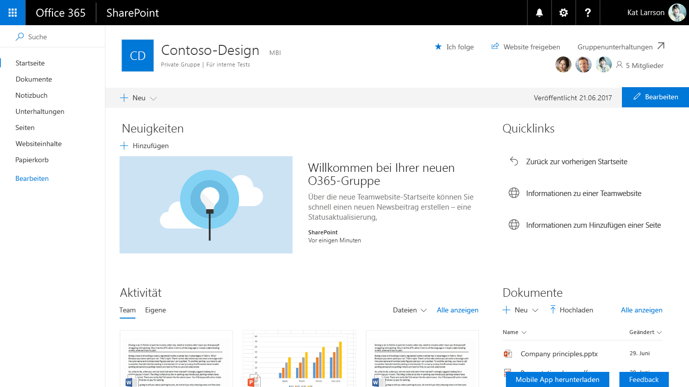
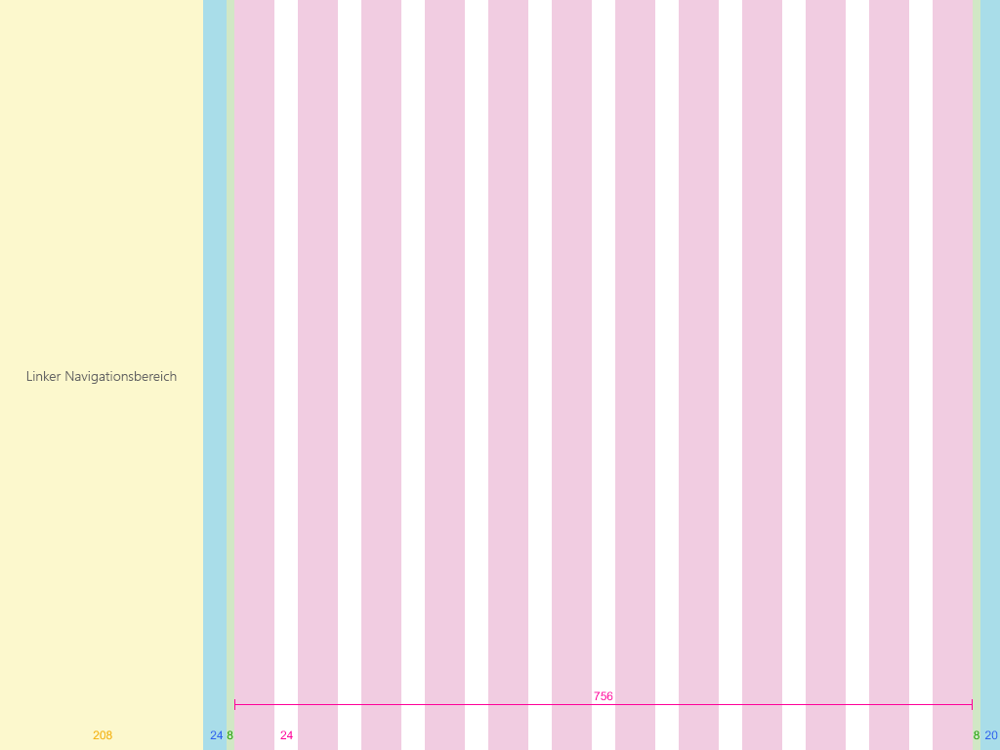
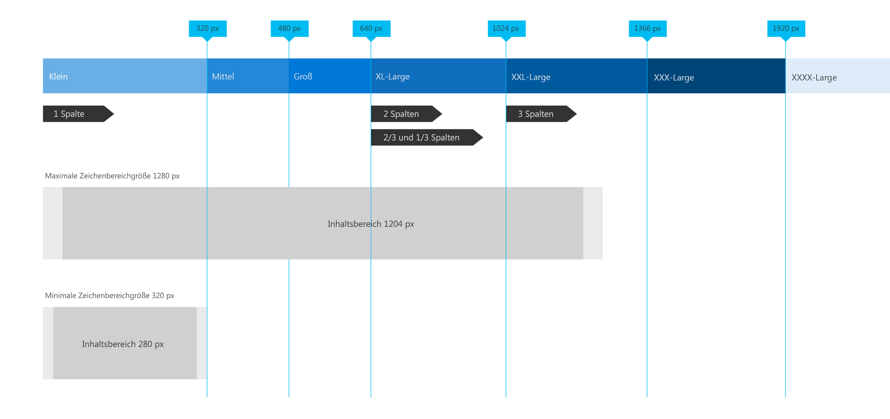

# Rasterdesigns und dynamische Designs in SharePointSharePoint grid and responsive design
 
Dynamische Benutzeroberflächen skalieren nahtlos für verschiedene Geräte, sodass Ihre Inhalte passend für die jeweilige Bildschirmgröße dargestellt werden.Responsive experiences seamlessly scale across devices, to better display your content on a range of different screen sizes. Dank dynamischer Designs entfällt zudem die Notwendigkeit, für unterschiedliche Geräte jeweils eigene Versionen der Seiten auf Ihrer Website zu erstellen.Responsive design also eliminates the need to build multiple versions of your site pages to support different devices.  

Die Designrichtlinien für dynamische Seiten in der SharePoint-Erstellungsumgebung beinhalten ein dynamisches Rastersystem, das auf [Office UI Fabric](https://dev.office.com/fabric) basiert.The design guidance for responsive pages in the SharePoint authoring environment incorporates a responsive grid system that is based on [Office UI Fabric](https://dev.office.com/fabric). In diesem Artikel werden das zugrunde liegende Seitenrastersystem und die Haltepunkte beschrieben, d. h. die Bildschirmgrößen, bei denen das Seitenlayout angepasst wird.This article describes the underlying page grid system and the breakpoints, or key screen sizes where the layout of the pages will change. 

## SeitentyprasterPage type grids 

Für jeden Seitentyp in der SharePoint-Erstellungsumgebung lassen sich eigene Regeln für die Anwendung des dynamischen Fabric-Rasters festlegen.Each page type in the SharePoint authoring experience can have its own rules for how it applies the Fabric responsive grid. Dadurch wird sichergestellt, dass jede Seite optimal dargestellt wird, unabhängig davon, für welches Gerät sie entworfen ist, und dass die Oberfläche für das jeweilige Gerät optimiert ist.This is to ensure that each page looks great, regardless of what device it's designed for, and that the experience is optimized for that environment. Das grundlegende Raster für SharePoint-Desktopoberflächen ist eine Struktur mit 12 Spalten.The basic grid in the SharePoint desktop experiences is a 12 column structure. Die Anzahl der Spalten und die Bundstegbreite werden basierend auf der Breite des Bildschirms angepasst.The number of columns and gutter width will adjust based on the screen width. 

In den folgenden Abschnitt zeigen wir Ihnen, wie die grundlegende Rasterstruktur auf verschiedene Typen von SharePoint-Seiten angewendet wird. So können Sie sich einen Überblick darüber verschaffen, wie sich das Raster an die jeweiligen Oberflächen- und Geräteanforderungen anpasst.The following sections show the basic grid structure applied across different types of SharePoint pages, to help you better understand how the grid adjusts to support the experience and device needs.

### TeamwebsitesTeam sites

Der Inhaltsbereich einer Teamwebsite ist linksbündig fixiert.The content area for a team site is locked to the left. Der Navigationsbereich befindet sich auf Teamwebsites links. Die Bereichswebparts belegen daher das Raster, und beim dynamischen Umbruch wird der für die Navigation reservierte Bereich berücksichtigt.Team sites have a left navigation, therefore the space web parts occupy on the gird and the reflow behavior respects the space given to the navigation. Die maximale Breite des Inhaltsbereichs einer Teamwebsite beträgt 1.204 Pixel, die minimale Größe 320 Pixel für eine optimale Darstellung auf Mobilgeräten.The max width of the content area of a Team site is 1204px and the minimum size is 320px for mobile support.

Die folgenden Beispiele demonstrieren, wie das Raster an den jeweiligen Haupthaltepunkten auf einer Teamwebsite angepasst wird.The following examples show how the grid adjusts between key breakpoints on a team site.

#### Klein (320 × 568)Small 320 x 568
Das kleine Raster besteht aus einem einzelnen zentrierten Spaltenbereich mit einem Rand von 20 Pixel links und rechts.The small size has a single centered column area, with 20px margins left and right.

#### Mittel (480 × 854)Medium 480 x 854
Das mittelgroße Raster besteht aus 12 Spalten mit Bundstegen von je 16 Pixel.The medium size has 12 columns, with 16px gutters.

#### Groß (640 × 1.024)Large 640 x 1024
Das große Raster besteht aus 12 Spalten mit Bundstegen von je 24 Pixel.The large size has 12 columns, with 24px gutters.

#### XL (1.024 × 768)XL 1024 x 768
Das XL-Raster besteht aus 12 Spalten mit Bundstegen von je 24 Pixel.The XL size has a twelve columns, with 24px gutters.

#### XXL (1.366 × 768)XXL 1366 x 768
Das XXL-Raster besteht aus 12 Spalten mit Bundstegen von je 32 Pixel.The XXL size has a twelve columns, with 32px gutters.

#### XXXL (1.920 × 1.080)XXXL 1920 x 1080
Das XXXL-Raster besteht aus 12 Spalten mit Bundstegen von je 32 Pixel.The XXXL size has a twelve columns, with 32px gutters.

#### Teamwebsite mit mehrspaltigen Seiten und WebpartsTeam site multicolumn pages and web parts
Webparts werden je nach Seitenlayout horizontal skaliert.Web parts will scale horizontally depending on the page layout. Das folgende Beispiel veranschaulicht, wie die Größe eines Webparts an die Größe des linken Navigationsbereichs angepasst wird.The following example shows how the size of a web part adjusts to accommodate the left navigation.

### KommunikationswebsitesCommunication sites

Kommunikationswebsites verfügen über eine Navigationsleiste oben auf der Seite sowie einen zentrierten Inhaltsbereich.Communication sites have a top navigation and a centered content area. Die maximale Breite des Inhaltsbereichs einer Kommunikationswebsite beträgt 1.204 Pixel, die Mindestgröße 320 Pixel für eine optimale Darstellung auf Mobilgeräten.The maximum width of the content area of a communication site is 1204px and the minimum size is 320px for mobile support.

Die folgenden Beispiele zeigen, wie das Raster an den jeweiligen Haupthaltepunkten auf einer Kommunikationswebsite angepasst wird.The following examples show how the grid adjusts between key breakpoints on a communication site.

#### Klein (320 × 568)Small 320 x 568
Das kleine Raster besteht aus einem einzelnen zentrierten Spaltenbereich mit einem Rand von 20 Pixel links und rechts.The small size has a single centered column area, with 20px margins left and right.

#### Mittel (480 × 854)Medium 480 x 854
Das mittelgroße Raster besteht aus 12 Spalten mit Bundstegen von je 16 Pixel.The medium size has 12 columns, with 16px gutters.

#### Groß (640 × 1.024)Large 640 x 1024
Das große Raster besteht aus 12 Spalten mit Bundstegen von je 24 Pixel.The large size has 12 columns, with 24px gutters.

#### XL (1.024 × 768)XL 1024 x 768
Das XL-Raster besteht aus 12 Spalten mit Bundstegen von je 24 Pixel.The XL size has a twelve columns, with 24px gutters.

#### XXL (1.366 × 768)XXL 1366 x 768
Das XXL-Raster besteht aus 12 Spalten mit Bundstegen von je 32 Pixel.The XXL size has a twelve columns, with 32px gutters.

#### XXXL (1.920 × 1.080)XXXL 1920 x 1080
Das XXXL-Raster besteht aus 12 Spalten mit Bundstegen von je 32 Pixel.The XXXL size has a twelve columns, with 32px gutters.

#### Kommunikationswebsite mit mehrspaltigen Seiten und WebpartsCommunication site multicolumn pages and web parts
Webparts werden je nach Seitenlayout horizontal skaliert.Web parts will scale horizontally depending on the page layout. Das Beispiel unten veranschaulicht eine Kommunikationswebsite und Webparts in einem Layout mit einer bis drei Spalten.This example shows a communcation site and web parts for single to three column layouts.

## HaltepunkteBreakpoints 

Damit die Oberfläche sich nahtlos an unterschiedliche Bildschirmgrößen anpasst, sollte die SharePoint-UI das Layout an den folgenden Haltepunktbreiten anpassen:To create a smooth flowing experience between screen sizes, the SharePoint UI should adapt layouts for the following breakpoint widths: 

- 320320
- 1.0241024
(&H400)
- 1.3661366
- 1.9201920
 
Dabei sollten Sie bedenken, wie Ihre Inhalte sich zwischen diesen Haltepunkten verändern, wenn die Größe des Darstellungsbereichs an den nächstgelegenen Haltepunkt angepasst wird.Within these breakpoints, you should take into consideration how your content will shift when the viewport size becomes optimized for the nearest breakpoint. Die Abbildung unten dient lediglich der Veranschaulichung und ist nicht pixelgenau.Note that this diagram is for illustration only and is not pixel accurate.

Das dynamische Raster für Teamwebsites und Kommunikationswebsites passt sich bei der Umstellung von einem der großen Haltepunkte an einen Mobilgeräte-Haltepunkt an.The responsive grid for both team sites and communication sites adjusts when going from large breakpoints to mobile breakpoints. Dadurch wird die Website optimal an das jeweilige Geräte und die jeweilige Bildschirmgröße angepasst.This optimizes the site for the device and screen size. In der folgenden Tabelle finden Sie einen Überblick über die Rastergrößen an verschiedenen Haltepunkten, basierend auf den Bildschirmgrößen gängiger Geräte.The following table describes the grid sizes at various breakpoints based on popular device sizes.

| FensterbreiteWindow width | GerätDevice                  | HaltepunktBreakpoint | SpaltenColumns | BundstegGutter | Maximale Anzahl von Spalten pro AbschnittMax columns per section |
|--------------|-------------------------|------------|---------|--------|-------------------------|
| 320320          | iPhone 5/SE (320 ×568)iPhone 5/SE,320x568     | SmallSmall      | 11       | -N/A    | 11                       |
| 480480          | 6-Zoll-Gerät6" device               | MediumMedium     | 11       | -N/A    | 11                       |
| 640640          | 8-Zoll-Gerät8" device               | LargeLarge      | 121.2      | 1616**     | 22                       |
| 768768          | iPad im Hochformat (768 × 1.024)iPad portrait 768x1024  | LargeLarge      | 121.2      | 242.4     | 22                       |
| 1.0241024
(&H400)         | iPad im Querformat (1.024 ×768)iPad landscape 1024x768 | X-LargeX-Large    | 121.2      | 242.4     | 33                       |
| 1.3681368         | Surface Pro 3 (1.368 × 912)Surface Pro 3 1368x912  | XX-LargeXX-Large   | 121.2      | 323.2     | 33                       |
| 1.4401440         | Surface Pro 4 (1.440 × 960)Surface Pro 4 1440x960  | XX-LargeXX-Large   | 121.2      | 323.2     | 33                       |
| 1.6001600         | Web (1.600 × 900)Web 1600x900            | XX-LargeXX-Large   | 121.2      | 323.2     | 33                       |
| 1.9201920         | Web (1.920 x 1.080)Web 1920x1080           | XXX-LargeXXX-Large  | 121.2      | 323.2     | 33                       |

## Weitere ArtikelSee also

- [Design Toolkit & AssetsDesign toolkit and assets](https://developer.microsoft.com/de-DE/fabric#/resources)

