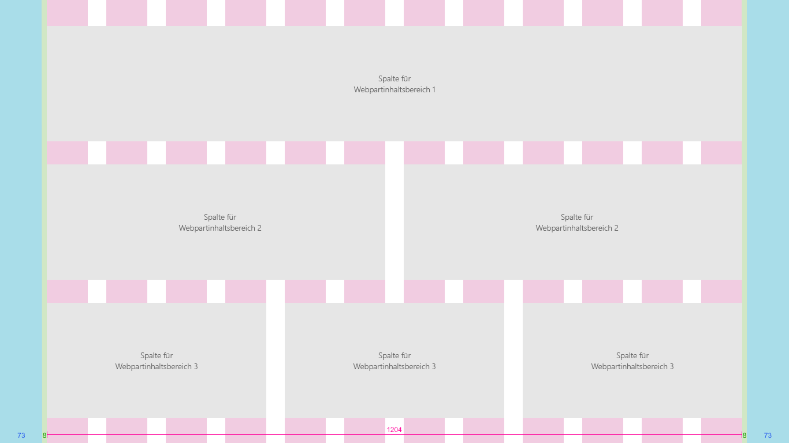

# Rasterdesigns und dynamische Designs in SharePoint
 
Dynamische Benutzeroberflächen skalieren nahtlos für verschiedene Geräte, sodass Ihre Inhalte passend für die jeweilige Bildschirmgröße dargestellt werden. Dank dynamischer Designs entfällt zudem die Notwendigkeit, für unterschiedliche Geräte jeweils eigene Versionen der Seiten auf Ihrer Website zu erstellen.  

Die Designrichtlinien für dynamische Seiten in der SharePoint-Erstellungsumgebung beinhalten ein dynamisches Rastersystem, das auf [Office UI Fabric](https://dev.office.com/fabric) basiert. In diesem Artikel werden das zugrunde liegende Seitenrastersystem und die Haltepunkte beschrieben, d. h. die Bildschirmgrößen, bei denen das Seitenlayout angepasst wird. 

## Seitentypraster 

Für jeden Seitentyp in der SharePoint-Erstellungsumgebung lassen sich eigene Regeln für die Anwendung des dynamischen Fabric-Rasters festlegen. Dadurch wird sichergestellt, dass jede Seite optimal dargestellt wird, unabhängig davon, für welches Gerät sie entworfen ist, und dass die Oberfläche für das jeweilige Gerät optimiert ist. Das grundlegende Raster für SharePoint-Desktopoberflächen ist eine Struktur mit 12 Spalten. Die Anzahl der Spalten und die Bundstegbreite werden basierend auf der Breite des Bildschirms angepasst. 

In den folgenden Abschnitt zeigen wir Ihnen, wie die grundlegende Rasterstruktur auf verschiedene Typen von SharePoint-Seiten angewendet wird. So können Sie sich einen Überblick darüber verschaffen, wie sich das Raster an die jeweiligen Oberflächen- und Geräteanforderungen anpasst.

### Teamwebsites

Der Inhaltsbereich einer Teamwebsite ist linksbündig fixiert. Der Navigationsbereich befindet sich auf Teamwebsites links. Die Bereichswebparts belegen daher das Raster, und beim dynamischen Umbruch wird der für die Navigation reservierte Bereich berücksichtigt. Die maximale Breite des Inhaltsbereichs einer Teamwebsite beträgt 1.204 Pixel, die minimale Größe 320 Pixel für eine optimale Darstellung auf Mobilgeräten.

Die folgenden Beispiele demonstrieren, wie das Raster an den jeweiligen Haupthaltepunkten auf einer Teamwebsite angepasst wird.

#### Klein (320 × 568)
Das kleine Raster besteht aus einem einzelnen zentrierten Spaltenbereich mit einem Rand von 20 Pixel links und rechts.

#### Mittel (480 × 854)
Das mittelgroße Raster besteht aus 12 Spalten mit Bundstegen von je 16 Pixel.

#### Groß (640 × 1.024)
Das große Raster besteht aus 12 Spalten mit Bundstegen von je 24 Pixel.

#### XL (1.024 × 768)
Das XL-Raster besteht aus 12 Spalten mit Bundstegen von je 24 Pixel.

#### XXL (1.366 × 768)
Das XXL-Raster besteht aus 12 Spalten mit Bundstegen von je 32 Pixel.

#### XXXL (1.920 × 1.080)
Das XXXL-Raster besteht aus 12 Spalten mit Bundstegen von je 32 Pixel.

#### Teamwebsite mit mehrspaltigen Seiten und Webparts
Webparts werden je nach Seitenlayout horizontal skaliert. Das folgende Beispiel veranschaulicht, wie die Größe eines Webparts an die Größe des linken Navigationsbereichs angepasst wird.

### Kommunikationswebsites

Kommunikationswebsites verfügen über eine Navigationsleiste oben auf der Seite sowie einen zentrierten Inhaltsbereich. Die maximale Breite des Inhaltsbereichs einer Kommunikationswebsite beträgt 1.204 Pixel, die Mindestgröße 320 Pixel für eine optimale Darstellung auf Mobilgeräten.

Die folgenden Beispiele zeigen, wie das Raster an den jeweiligen Haupthaltepunkten auf einer Kommunikationswebsite angepasst wird.

#### Klein (320 × 568)
Das kleine Raster besteht aus einem einzelnen zentrierten Spaltenbereich mit einem Rand von 20 Pixel links und rechts.

#### Mittel (480 × 854)
Das mittelgroße Raster besteht aus 12 Spalten mit Bundstegen von je 16 Pixel.

#### Groß (640 × 1.024)
Das große Raster besteht aus 12 Spalten mit Bundstegen von je 24 Pixel.

#### XL (1.024 × 768)
Das XL-Raster besteht aus 12 Spalten mit Bundstegen von je 24 Pixel.

#### XXL (1.366 × 768)
Das XXL-Raster besteht aus 12 Spalten mit Bundstegen von je 32 Pixel.

#### XXXL (1.920 × 1.080)
Das XXXL-Raster besteht aus 12 Spalten mit Bundstegen von je 32 Pixel.

#### Kommunikationswebsite mit mehrspaltigen Seiten und Webparts
Webparts werden je nach Seitenlayout horizontal skaliert. Das Beispiel unten veranschaulicht eine Kommunikationswebsite und Webparts in einem Layout mit einer bis drei Spalten.

## Haltepunkte 

Damit die Oberfläche sich nahtlos an unterschiedliche Bildschirmgrößen anpasst, sollte die SharePoint-UI das Layout an den folgenden Haltepunktbreiten anpassen: 

- 320
- 1.024
- 1.366
- 1.920
 
Dabei sollten Sie bedenken, wie Ihre Inhalte sich zwischen diesen Haltepunkten verändern, wenn die Größe des Darstellungsbereichs an den nächstgelegenen Haltepunkt angepasst wird. Die Abbildung unten dient lediglich der Veranschaulichung und ist nicht pixelgenau.

Das dynamische Raster für Teamwebsites und Kommunikationswebsites passt sich bei der Umstellung von einem der großen Haltepunkte an einen Mobilgeräte-Haltepunkt an. Dadurch wird die Website optimal an das jeweilige Geräte und die jeweilige Bildschirmgröße angepasst. In der folgenden Tabelle finden Sie einen Überblick über die Rastergrößen an verschiedenen Haltepunkten, basierend auf den Bildschirmgrößen gängiger Geräte.

| Fensterbreite | Gerät                  | Haltepunkt | Spalten | Bundsteg | Maximale Anzahl von Spalten pro Abschnitt |
|--------------|-------------------------|------------|---------|--------|-------------------------|
| 320          | iPhone 5/SE (320 ×568)     | Small      | 1       | -    | 1                       |
| 480          | 6-Zoll-Gerät               | Medium     | 1       | -    | 1                       |
| 640          | 8-Zoll-Gerät               | Large      | 12      | 16     | 2                       |
| 768          | iPad im Hochformat (768 × 1.024)  | Large      | 12      | 24     | 2                       |
| 1.024         | iPad im Querformat (1.024 ×768) | X-Large    | 12      | 24     | 3                       |
| 1.368         | Surface Pro 3 (1.368 × 912)  | XX-Large   | 12      | 32     | 3                       |
| 1.440         | Surface Pro 4 (1.440 × 960)  | XX-Large   | 12      | 32     | 3                       |
| 1.600         | Web (1.600 × 900)            | XX-Large   | 12      | 32     | 3                       |
| 1.920         | Web (1.920 x 1.080)           | XXX-Large  | 12      | 32     | 3                       |

## Weitere Artikel

- [Design Toolkit & Assets](https://developer.microsoft.com/de-DE/fabric#/resources)

