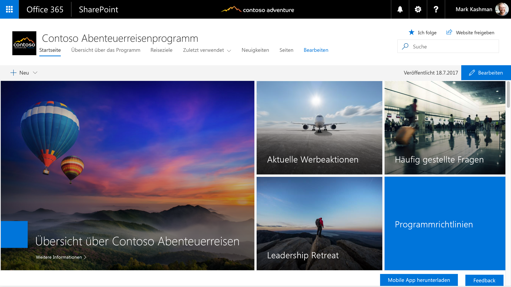

# SharePoint-Raster und reaktionsschnelles Design
 
Reaktionsschnelle Umgebungen werden nahtlos geräteübergreifend skaliert, damit Sie Ihre Inhalte auf einer Vielzahl an verschiedenen Bildschirmgrößen besser anzeigen können. Das reaktionsschnelle Design macht auch das Erstellen mehrerer Versionen Ihrer Websiteseiten überflüssig, um verschiedene Geräte zu unterstützen.  

Der Designleitfaden für reaktionsschnelle Seiten in der SharePoint-Erstellungsumgebung beinhaltet ein reaktionsschnelles Rastersystem, das auf [Office UI Fabric](https://dev.office.com/fabric) basiert. In diesem Artikel werden das zugrunde liegende Seitenrastersystem und die Haltepunkte oder die wichtigsten Bildschirmgrößen beschrieben, bei denen sich das Layout der Seiten ändert. 

## Seitentypraster 

Jeder Seitentyp in der SharePoint-Erstellungsumgebung kann eigene Regeln für das Anwenden des reaktionsschnellen Fabric-Rasters haben. Dadurch wird sichergestellt, dass jede Seite gut aussieht, unabhängig davon, für welches Gerät sie entworfen ist, und dass die Umgebung für dieses Gerät optimiert ist. Das grundlegende Raster in der SharePoint-Desktopumgebung ist eine Struktur mit 12 Spalten. Die Anzahl der Spalten und die Bundstegbreite werden basierend auf der Breite des Bildschirms angepasst. 

Die folgenden Abschnitte zeigen die grundlegende Rasterstruktur für verschiedene Arten von SharePoint-Seiten, damit Sie besser verstehen können, wie das Raster zur Unterstützung der Umgebung und Geräteanforderungen angepasst wird.

### Teamwebsites

Der Inhaltsbereich für eine Teamwebsite ist auf der linken Seite gesperrt. Teamwebsites weisen einen linken Navigationsbereich auf. Daher respektieren Webparts im Raster und das Reflow-Verhalten den Bereich für die Navigation. Die maximale Breite des Inhaltsbereichs einer Teamwebsite beträgt 1204px und die minimale Größe 320px für Mobilgeräte.

Die folgenden Beispiele zeigen, wie das Raster zwischen den Haupthaltepunkten auf einer Teamwebsite angepasst wird.

#### Klein 320 x 568
Die kleine Größe umfasst einen einzelnen Spaltenbereich in der Mitte, mit Rändern von 20px links und rechts.

#### Mittel 480 x 854
Die mittlere Größe umfasst 12 Spalten mit 16px-Bundstegen.

#### Groß 640 x 1024
Die große Größe umfasst 12 Spalten mit  24px-Bundstegen.

#### XL 1024 x 768
Die XL-Größe umfasst 12 Spalten mit 24px-Bundstegen.

#### XXL 1366 x 768
Die XXL-Größe umfasst 12 Spalten mit 32px-Bundstegen.

#### XXXL 1920 x 1080
Die XXXL-Größe umfasst 12 Spalten mit 32px-Bundstegen.

#### Mehrsprachige Seiten und Webparts auf Teamwebsites
Webparts werden je nach Seitenlayout horizontal skaliert. Das folgende Beispiel zeigt, wie die Größe eines Webparts an den linken Navigationsbereich angepasst wird.

### Kommunikationswebsites

Kommunikationswebsites haben eine obere Navigationsleiste und einen Inhaltsbereich in der Mitte. Die maximale Breite des Inhaltsbereichs einer Kommunikationswebsite beträgt 1204px und die minimale Größe 320px für Mobilgeräte.

Die folgenden Beispiele zeigen, wie das Raster zwischen den Haupthaltepunkten auf einer Kommunikationswebsite angepasst wird.

#### Klein 320 x 568
Die kleine Größe umfasst einen einzelnen Spaltenbereich in der Mitte, mit Rändern von 20px links und rechts.

#### Mittel 480 x 854
Die mittlere Größe umfasst 12 Spalten mit 16px-Bundstegen.

#### Groß 640 x 1024
Die große Größe umfasst 12 Spalten mit  24px-Bundstegen.

#### XL 1024 x 768
Die XL-Größe umfasst 12 Spalten mit 24px-Bundstegen.

#### XXL 1366 x 768
Die XXL-Größe umfasst 12 Spalten mit 32px-Bundstegen.

#### XXXL 1920 x 1080
Die XXXL-Größe umfasst 12 Spalten mit 32px-Bundstegen.

#### Mehrsprachige Seiten und Webparts auf Kommunikationswebsite
Webparts werden je nach Seitenlayout horizontal skaliert. Dieses Beispiel zeigt eine Kommunikationswebsite und Webparts für Layouts mit einer, zwei oder drei Spalten.

## Haltepunkte 

Um eine nahtlose Erfahrung zwischen Bildschirmgrößen sicherzustellen, sollte die SharePoint-Benutzeroberfläche Layouts für die folgenden Haltepunktbreiten anpassen: 

- 320
- 1024
- 1366
- 1920
 
Innerhalb dieser Haltepunkte sollten Sie berücksichtigen, wie Ihre Inhalte verschoben werden, wenn die Viewport-Größe für den nächsten Haltepunkt optimiert wird. Beachten Sie, dass dieses Diagramm nur zur Veranschaulichung dient und die Pixel nicht präzise zeigt.

Das reaktionsschnelle Raster für Teamwebsites und Kommunikationswebsites wird beim Wechsel von großen Haltepunkten zu mobilen Haltepunkten angepasst. Hierdurch wird die Website für das Gerät und die Bildschirmgröße optimiert. Die folgende Tabelle beschreibt die Rastergrößen an verschiedenen Haltepunkten basierend auf gängigen Gerätegrößen.

| Fensterbreite | Gerät                  | Haltepunkt | Spalten | Bundsteg | Maximale Anzahl von Spalten pro Bereich |
|--------------|-------------------------|------------|---------|--------|-------------------------|
| 320          | iPhone 5/SE, 320 x 568     | Klein      | 1       | Nicht zutreffend    | 1                       |
| 480          | 6-Zoll-Gerät               | Mittel     | 1       | Nicht zutreffend    | 1                       |
| 640          | 8-Zoll-Gerät               | Groß      | 12      | 16     | 2                       |
| 768          | iPad Hochformat 768x1024  | Groß      | 12      | 24     | 2                       |
| 1024         | iPad Querformat 1024x768 | X-Large    | 12      | 24     | 3                       |
| 1368         | Surface Pro 3 1368x912  | XX-Large   | 12      | 32     | 3                       |
| 1440         | Surface Pro 4 1440x960  | XX-Large   | 12      | 32     | 3                       |
| 1600         | Web 1600x900            | XX-Large   | 12      | 32     | 3                       |
| 1920         | Web 1920x1080           | XXX-Large  | 12      | 32     | 3                       |

## Siehe auch

- [Design – Toolkit und Ressourcen](https://developer.microsoft.com/en-us/fabric#/resources)

