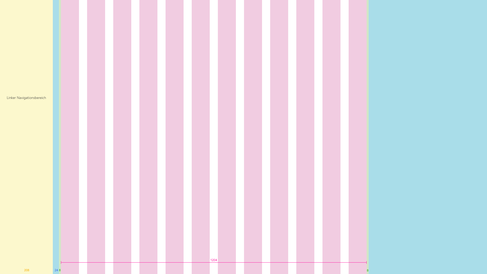
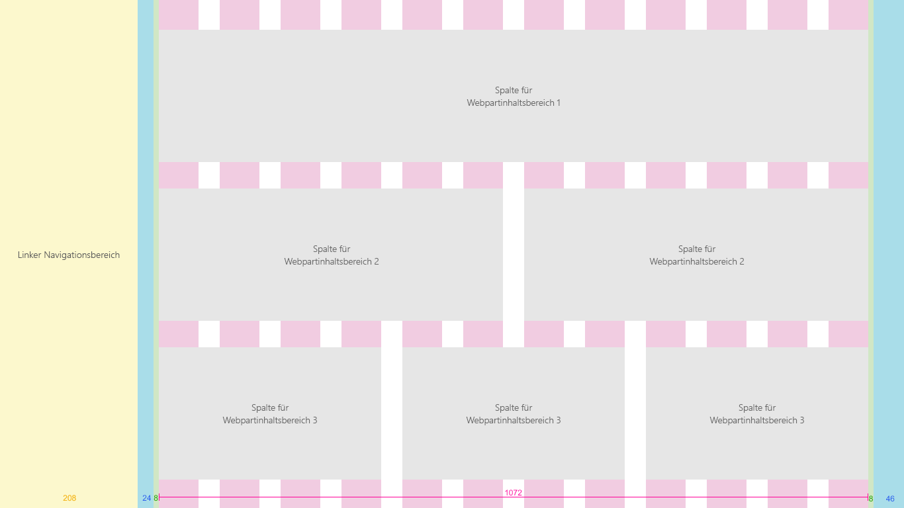

# SharePoint-Raster und reaktionsschnelles DesignSharePoint grid and responsive design
 
Reaktionsschnelle Umgebungen werden nahtlos geräteübergreifend skaliert, damit Sie Ihre Inhalte auf einer Vielzahl an verschiedenen Bildschirmgrößen besser anzeigen können.Responsive experiences seamlessly scale across devices, to better display your content on a range of different screen sizes. Das reaktionsschnelle Design macht auch das Erstellen mehrerer Versionen Ihrer Websiteseiten überflüssig, um verschiedene Geräte zu unterstützen.Responsive design also eliminates the need to build multiple versions of your site pages to support different devices.  

Der Designleitfaden für reaktionsschnelle Seiten in der SharePoint-Erstellungsumgebung beinhaltet ein reaktionsschnelles Rastersystem, das auf [Office UI Fabric](https://dev.office.com/fabric) basiert.The design guidance for responsive pages in the SharePoint authoring environment incorporates a responsive grid system that is based on [Office UI Fabric](https://dev.office.com/fabric). In diesem Artikel werden das zugrunde liegende Seitenrastersystem und die Haltepunkte oder die wichtigsten Bildschirmgrößen beschrieben, bei denen sich das Layout der Seiten ändert.This article describes the underlying page grid system and the breakpoints, or key screen sizes where the layout of the pages will change. 

## SeitentyprasterPage type grids 

Jeder Seitentyp in der SharePoint-Erstellungsumgebung kann eigene Regeln für das Anwenden des reaktionsschnellen Fabric-Rasters haben.Each page type in the SharePoint authoring experience can have its own rules for how it applies the Fabric responsive grid. Dadurch wird sichergestellt, dass jede Seite gut aussieht, unabhängig davon, für welches Gerät sie entworfen ist, und dass die Umgebung für dieses Gerät optimiert ist.This is to ensure that each page looks great, regardless of what device it's designed for, and that the experience is optimized for that environment. Das grundlegende Raster in der SharePoint-Desktopumgebung ist eine Struktur mit 12 Spalten.The basic grid in the SharePoint desktop experiences is a 12 column structure. Die Anzahl der Spalten und die Bundstegbreite werden basierend auf der Breite des Bildschirms angepasst.The number of columns and gutter width will adjust based on the screen width. 

Die folgenden Abschnitte zeigen die grundlegende Rasterstruktur für verschiedene Arten von SharePoint-Seiten, damit Sie besser verstehen können, wie das Raster zur Unterstützung der Umgebung und Geräteanforderungen angepasst wird.The following sections show the basic grid structure applied across different types of SharePoint pages, to help you better understand how the grid adjusts to support the experience and device needs.

### TeamwebsitesTeam sites

Der Inhaltsbereich für eine Teamwebsite ist auf der linken Seite gesperrt.The content area for a team site is locked to the left. Teamwebsites weisen einen linken Navigationsbereich auf. Daher respektieren Webparts im Raster und das Reflow-Verhalten den Bereich für die Navigation.Team sites have a left navigation, therefore the space web parts occupy on the gird and the reflow behavior respects the space given to the navigation. Die maximale Breite des Inhaltsbereichs einer Teamwebsite beträgt 1204px und die minimale Größe 320px für Mobilgeräte.The max width of the content area of a Team site is 1204px and the minimum size is 320px for mobile support.

Die folgenden Beispiele zeigen, wie das Raster zwischen den Haupthaltepunkten auf einer Teamwebsite angepasst wird.The following examples show how the grid adjusts between key breakpoints on a team site.

#### Klein 320 x 568Small 320 x 568
Die kleine Größe umfasst einen einzelnen Spaltenbereich in der Mitte, mit Rändern von 20px links und rechts.The small size has a single centered column area, with 20px margins left and right.

#### Mittel 480 x 854Medium 480 x 854
Die mittlere Größe umfasst 12 Spalten mit 16px-Bundstegen.The medium size has 12 columns, with 16px gutters.

#### Groß 640 x 1024Large 640 x 1024
Die große Größe umfasst 12 Spalten mit  24px-Bundstegen.The large size has 12 columns, with 24px gutters.

#### XL 1024 x 768XL 1024 x 768
Die XL-Größe umfasst 12 Spalten mit 24px-Bundstegen.The XL size has a twelve columns, with 24px gutters.

#### XXL 1366 x 768XXL 1366 x 768
Die XXL-Größe umfasst 12 Spalten mit 32px-Bundstegen.The XXL size has a twelve columns, with 32px gutters.

#### XXXL 1920 x 1080XXXL 1920 x 1080
Die XXXL-Größe umfasst 12 Spalten mit 32px-Bundstegen.The XXXL size has a twelve columns, with 32px gutters.

#### Mehrsprachige Seiten und Webparts auf TeamwebsitesTeam site multicolumn pages and web parts
Webparts werden je nach Seitenlayout horizontal skaliert.Web parts will scale horizontally depending on the page layout. Das folgende Beispiel zeigt, wie die Größe eines Webparts an den linken Navigationsbereich angepasst wird.The following example shows how the size of a web part adjusts to accommodate the left navigation.

### KommunikationswebsitesCommunication sites

Kommunikationswebsites haben eine obere Navigationsleiste und einen Inhaltsbereich in der Mitte.Communication sites have a top navigation and a centered content area. Die maximale Breite des Inhaltsbereichs einer Kommunikationswebsite beträgt 1204px und die minimale Größe 320px für Mobilgeräte.The maximum width of the content area of a communication site is 1204px and the minimum size is 320px for mobile support.

Die folgenden Beispiele zeigen, wie das Raster zwischen den Haupthaltepunkten auf einer Kommunikationswebsite angepasst wird.The following examples show how the grid adjusts between key breakpoints on a communication site.

#### Klein 320 x 568Small 320 x 568
Die kleine Größe umfasst einen einzelnen Spaltenbereich in der Mitte, mit Rändern von 20px links und rechts.The small size has a single centered column area, with 20px margins left and right.

#### Mittel 480 x 854Medium 480 x 854
Die mittlere Größe umfasst 12 Spalten mit 16px-Bundstegen.The medium size has 12 columns, with 16px gutters.

#### Groß 640 x 1024Large 640 x 1024
Die große Größe umfasst 12 Spalten mit  24px-Bundstegen.The large size has 12 columns, with 24px gutters.

#### XL 1024 x 768XL 1024 x 768
Die XL-Größe umfasst 12 Spalten mit 24px-Bundstegen.The XL size has a twelve columns, with 24px gutters.

#### XXL 1366 x 768XXL 1366 x 768
Die XXL-Größe umfasst 12 Spalten mit 32px-Bundstegen.The XXL size has a twelve columns, with 32px gutters.

#### XXXL 1920 x 1080XXXL 1920 x 1080
Die XXXL-Größe umfasst 12 Spalten mit 32px-Bundstegen.The XXXL size has a twelve columns, with 32px gutters.

#### Mehrsprachige Seiten und Webparts auf KommunikationswebsiteCommunication site multicolumn pages and web parts
Webparts werden je nach Seitenlayout horizontal skaliert.Web parts will scale horizontally depending on the page layout. Dieses Beispiel zeigt eine Kommunikationswebsite und Webparts für Layouts mit einer, zwei oder drei Spalten.This example shows a communcation site and web parts for single to three column layouts.

## HaltepunkteBreakpoints 

Um eine nahtlose Erfahrung zwischen Bildschirmgrößen sicherzustellen, sollte die SharePoint-Benutzeroberfläche Layouts für die folgenden Haltepunktbreiten anpassen:To create a smooth flowing experience between screen sizes, the SharePoint UI should adapt layouts for the following breakpoint widths: 

- 320320
- 10241024
(&H400)
- 13661366
- 19201920
 
Innerhalb dieser Haltepunkte sollten Sie berücksichtigen, wie Ihre Inhalte verschoben werden, wenn die Viewport-Größe für den nächsten Haltepunkt optimiert wird.Within these breakpoints, you should take into consideration how your content will shift when the viewport size becomes optimized for the nearest breakpoint. Beachten Sie, dass dieses Diagramm nur zur Veranschaulichung dient und die Pixel nicht präzise zeigt.Note that this diagram is for illustration only and is not pixel accurate.

Das reaktionsschnelle Raster für Teamwebsites und Kommunikationswebsites wird beim Wechsel von großen Haltepunkten zu mobilen Haltepunkten angepasst.The responsive grid for both team sites and communication sites adjusts when going from large breakpoints to mobile breakpoints. Hierdurch wird die Website für das Gerät und die Bildschirmgröße optimiert.This optimizes the site for the device and screen size. Die folgende Tabelle beschreibt die Rastergrößen an verschiedenen Haltepunkten basierend auf gängigen Gerätegrößen.The following table describes the grid sizes at various breakpoints based on popular device sizes.

| FensterbreiteWindow width | GerätDevice                  | HaltepunktBreakpoint | SpaltenColumns | BundstegGutter | Maximale Anzahl von Spalten pro BereichMax columns per section |
|--------------|-------------------------|------------|---------|--------|-------------------------|
| 320320          | iPhone 5/SE, 320 x 568iPhone 5/SE,320x568     | KleinSmall      | 11       | Nicht zutreffendN/A    | 11                       |
| 480480          | 6-Zoll-Gerät6" device               | MittelMedium     | 11       | Nicht zutreffendN/A    | 11                       |
| 640640          | 8-Zoll-Gerät8" device               | GroßLarge      | 121.2      | 1616**     | 22                       |
| 768768          | iPad Hochformat 768x1024iPad portrait 768x1024  | GroßLarge      | 121.2      | 242.4     | 22                       |
| 10241024
(&H400)         | iPad Querformat 1024x768iPad landscape 1024x768 | X-LargeX-Large    | 121.2      | 242.4     | 33                       |
| 13681368         | Surface Pro 3 1368x912Surface Pro 3 1368x912  | XX-LargeXX-Large   | 121.2      | 323.2     | 33                       |
| 14401440         | Surface Pro 4 1440x960Surface Pro 4 1440x960  | XX-LargeXX-Large   | 121.2      | 323.2     | 33                       |
| 16001600         | Web 1600x900Web 1600x900            | XX-LargeXX-Large   | 121.2      | 323.2     | 33                       |
| 19201920         | Web 1920x1080Web 1920x1080           | XXX-LargeXXX-Large  | 121.2      | 323.2     | 33                       |

## Siehe auchSee also

- [Design – Toolkit und RessourcenDesign toolkit and assets](https://developer.microsoft.com/de-de/fabric#/resources)

