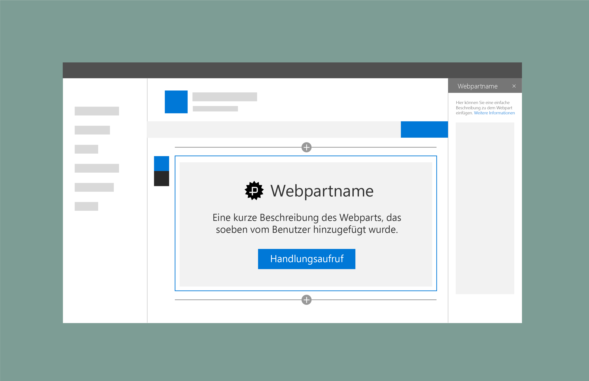

# Platzhalter und Fallbacks in SharePoint-Webparts

Sie können SharePoint-Webparts Platzhalter hinzufügen, die als Fallback verwendet werden können, wenn ein Problem beim Laden von Inhalten oder Daten für ein Webpart auftritt. Webpartname und -beschreibung werden automatisch aus den mit dem Webpart übermittelten Metadaten hinzugefügt. 

Sie können eine Schaltfläche hinzufügen, mit der Benutzer zu einem Zustand zurückzukehren können, in dem sie das Webpart konfigurieren können.

## Siehe auch

- [Entwerfen von benutzerfreundlichen SharePoint-Umgebungen](design-guidance-overview.md)