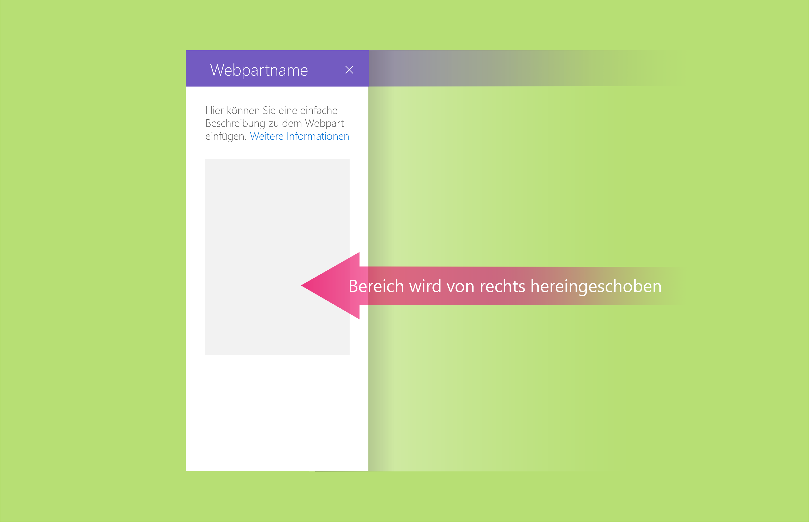

# Reaktive und nicht-reaktive SharePoint-Webparts

Reaktive Webparts sind vollständig clientseitige Webparts, während nicht-reaktive Webparts Elemente enthalten, die eine Interaktion mit einem Server erfordern. Wir empfehlen für SharePoint-Webparts ein reaktives Design, da ein solches Design dem UX-Modell und den WYSIWYG-Erstellungsprinzipien am besten gerecht wird. Es ist jedoch nicht immer möglich oder kosteneffizient, reaktive Webparts zu erstellen.

## Reaktive Webparts

Bei reaktiven Webparts handelt es sich um vollständig clientseitige Webparts. Das bedeutet: Jede im Eigenschaftenbereich konfigurierte Komponente wird angepasst, sobald der Benutzer auf der Seite Änderungen im Webpart vornimmt. Deaktiviert der Benutzer beispielsweise im Aufgabenlisten-Webpart die Option „Completed Tasks“, wird die zugehörige Ansicht im Webpart ausgeblendet.

## Nicht-reaktive Webparts
Nicht-reaktive Webparts sind nicht vollständig clientseitig. In der Regel müssen eine oder mehrere Eigenschaften Aufrufe senden, um Werte auf einem Server festzulegen oder von einem Server abzurufen oder Daten auf einem Server zu speichern. In nicht-reaktiven Webparts sollten Sie unten im Eigenschaftenbereich eine **Apply**-Schaltfläche einfügen.

Sie können diese **Apply**-Schaltfläche auch so anpassen, dass sie eine spezifischere Aktion ausführt. <!-- Is this a reference to an image? (design-wp-pp-non-reactive.png) -->

 

In den folgenden Beispielen sehen Sie nicht-reaktive Webparts im Kontext der [drei verfügbaren Strukturen für Eigenschaftenbereiche](design-a-web-part.md).

**Beispiel mit einem einzigen Bereich**

 

**Beispiel mit Akkordeon-Gruppen**

 

**Beispiel mit einem Bereich mit mehreren Schritten**

## Siehe auch

- [Entwerfen von benutzerfreundlichen SharePoint-Umgebungen](design-guidance-overview.md)