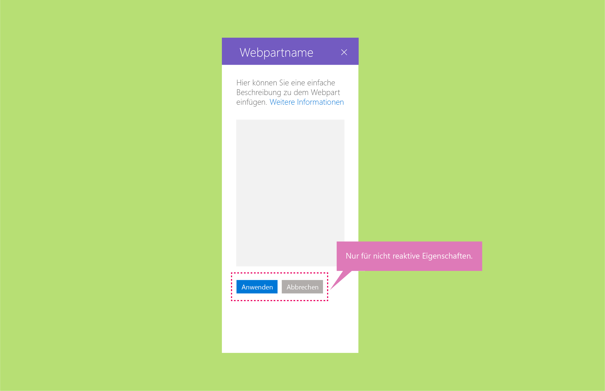

# Dynamische und nicht dynamische SharePoint-Webparts

Dynamische Webparts sind nur clientseitig; nicht dynamische Webparts enthalten Elemente, für die ein Server benötigt ist. Es wird empfohlen, dynamische SharePoint-Webparts erstellen, da diese am besten für das UX-Modell und die WYSIWYG-Prinzipien für die Erstellung geeignet sind. Es ist jedoch in manchen Fällen ggf. nicht möglich oder zu kostspielig, dynamische Webparts zu erstellen.

## Dynamische Webparts

Bei dynamischen Webparts handelt es sich vollständig um clientseitige Webparts. Dies bedeutet, dass für jede Komponente, die im Eigenschaftenbereich konfiguriert wird, die vorgenommene Änderung innerhalb des Webparts auf der Seite angepasst wird. Wenn Sie beispielsweise im Aufgabenlisten-Webpart die Option „Abgeschlossene Aufgaben“ deaktivieren, wird diese Ansicht im Webpart ausgeblendet.

## Nicht dynamische Webparts
Nicht dynamische Webparts sind nicht vollständig clientseitig, und in der Regel muss mindestens eine Eigenschaft einen Aufruf ausführen, um Daten auf einem Server festzulegen/abzurufen oder zu speichern. Sie sollten für nicht dynamische Webparts die Schaltfläche **Übernehmen** unten im Eigenschaftenbereich aktivieren.

Sie können auch die Schaltfläche **Übernehmen** anpassen, damit diese eine bestimmte Aktion aufweist. <!-- Is this a reference to an image? (design-wp-pp-non-reactive.png) -->

Die folgenden Beispiele zeigen nicht dynamische Webparts im Kontext der [drei Strukturen der Eigenschaftenbereiche](design-a-web-part.md).

**Beispiel für einen einzelnen Bereich**

**Beispiel für Accordion-Gruppen**

**Beispiel für Bereich „Gruppen“**

