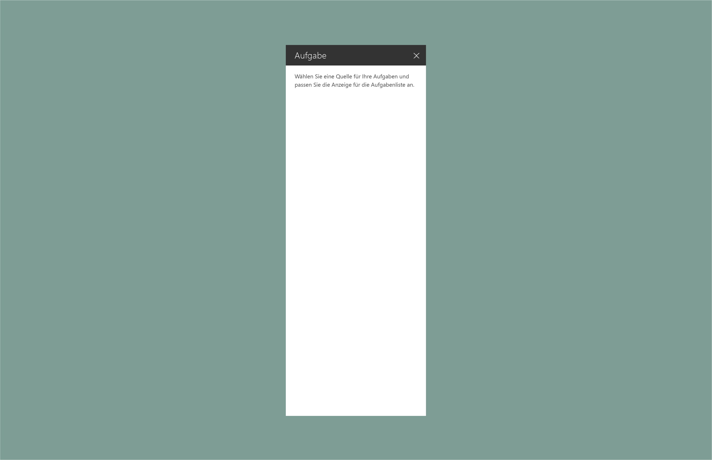
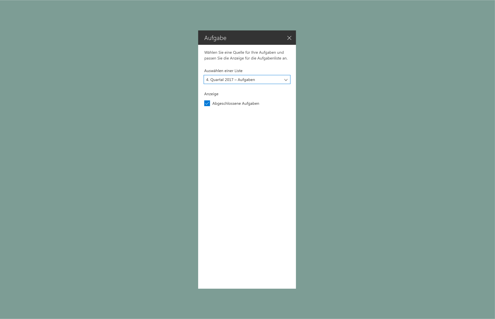
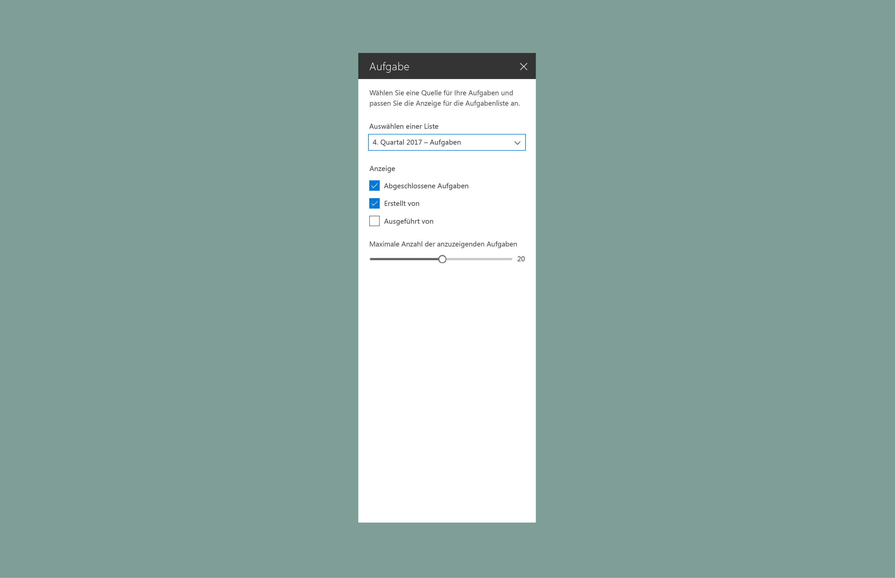
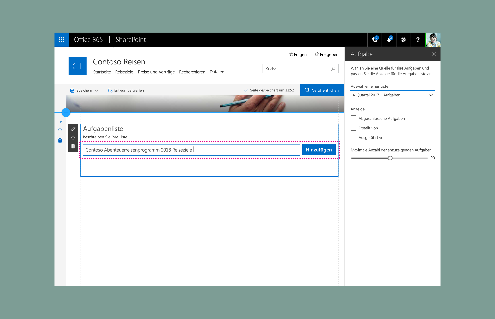
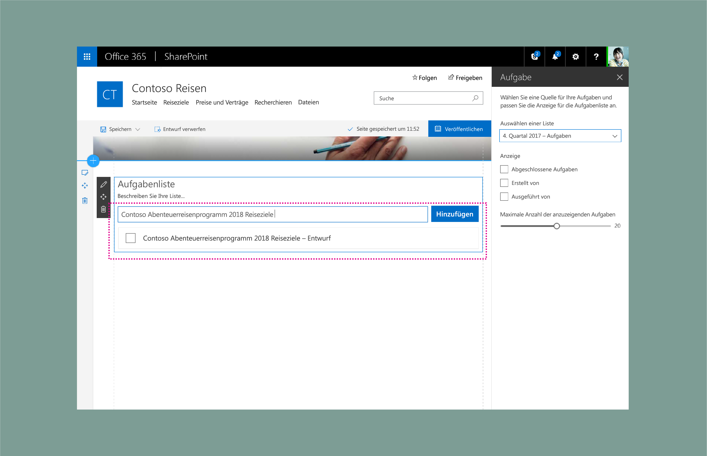
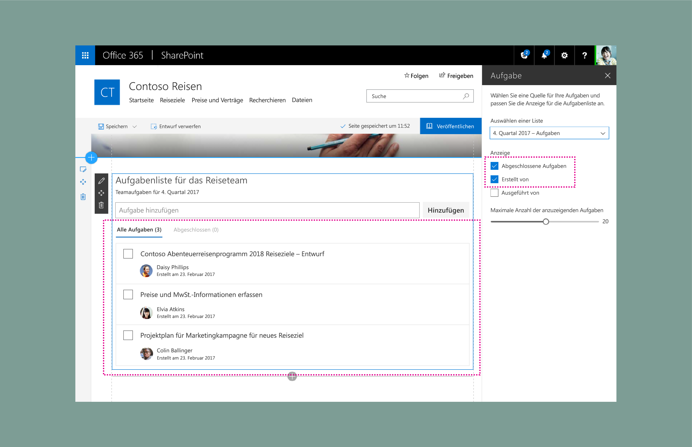
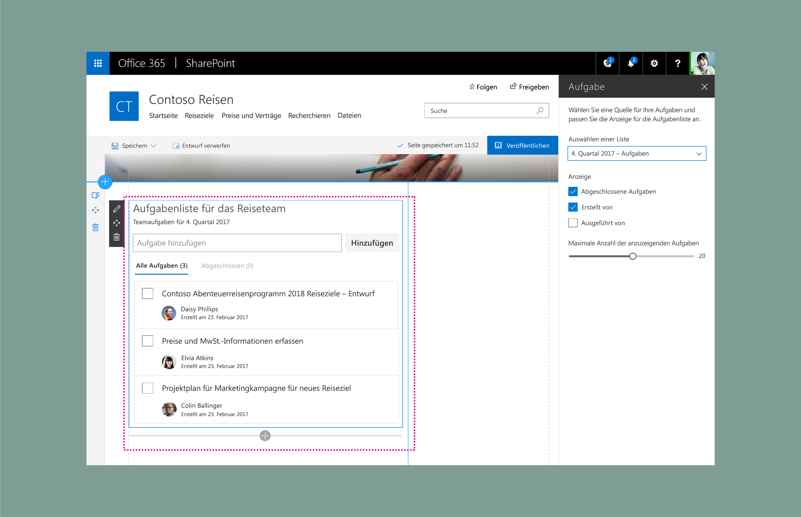
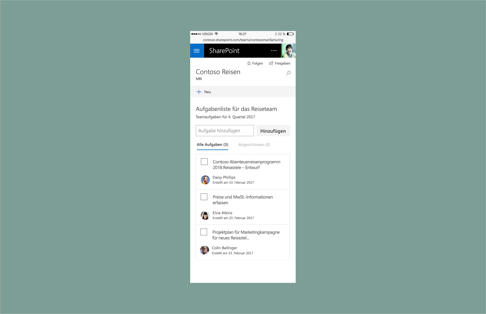

# Showcase Entwerfen von SharePoint-Webparts: Erstellen eines Eigenschaftenbereichs des Typs „Aufgabenliste“SharePoint web part design showcase: Create a To-Do list property pane

In diesem Artikel erfahren Sie, wie Sie ein Aufgabenlisten-Webpart erstellen.This article describes how to create a To-Do list web part. Unser Beispiel verwendet den [Eigenschaftenbereichstyp](design-a-web-part.md) mit einem einzigen Bereich, ist [reaktiv](reactive-and-nonreactive-web-parts.md) und basiert auf dem dynamischen Raster von [Office UI Fabric](https://developer.microsoft.com/de-DE/fabric).This example uses the single pane [property pane type](design-a-web-part.md) and is [reactive](reactive-and-nonreactive-web-parts.md) and based on the [Office UI Fabric](https://developer.microsoft.com/de-DE/fabric) responsive grid.

## Erstellen eines Aufgabenlisten-WebpartsCreate a To-Do list web part

1. Fügen Sie eine Beschreibung hinzu, die Benutzer über das Webpart und seine Eigenschaften informiert.Add a description to help users understand more about the web part and its properties.

    In diesem Beispiel haben wir als Wert für die Beschreibung „Select a source for your to-dos and customize the display for the list of tasks.“ angegeben.In this example, the description is "Select a source for your to-dos and customize the display for the list of tasks."
    
    

     

2. Fügen Sie eine Fabric-[Dropdownkomponente](https://developer.microsoft.com/de-DE/fabric#/components/dropdown) hinzu, die mit einer Liste verknüpft ist.Add a Fabric [drop-down component](https://developer.microsoft.com/de-DE/fabric#/components/dropdown) connected to a list.

    

     

3. Fügen Sie eine Fabric-[Kontrollkästchenkomponente](https://developer.microsoft.com/de-DE/fabric#/components/checkbox) hinzu, über die abgeschlossene Aufgaben angezeigt werden können.Add a Fabric [checkbox component](https://developer.microsoft.com/de-DE/fabric#/components/checkbox) to display completed tasks.

    

     

4. Fügen Sie zwei weitere Kontrollkästchen hinzu, mit denen der Benutzer die Anzeigeoptionen steuern kann.Add two more checkboxes to control display options.

    

     

5. Fügen Sie eine Fabric-[Schiebereglerkomponente](https://developer.microsoft.com/de-DE/fabric#/components/slider) hinzu, über die der Benutzer festlegen kann, wie viele Elemente maximal angezeigt werden sollen.Add a Fabric [slider](https://developer.microsoft.com/de-DE/fabric#/components/slider) for the maximum number of items to display.

    

     

6. Als Nächstes wählen Sie eine Liste aus, die automatisch im Aufgabenlisten-Webpart angezeigt werden soll. Sie können auch manuell Aufgaben hinzufügen, die automatisch angezeigt werden sollen.Next, the author of the page selects a list or manually adds tasks to prepopulate the To-Do list web part.

    

     

    

     

    

     

7. Das Webpart zeigt einen Indikator für Elemente an, die auf der Seite geladen werden.The web part shows an indicator of items loading onto the page.

    

     

8. Die Elemente aus der Liste werden geladen.Items from the list load.

    

     

    Sobald die neuen Aufgaben geladen wurden, werden sie mithilfe von Animationskomponenten aus Office UI Fabric eingeblendet.When the new tasks are loaded, they fade into view using animation components from Office UI Fabric.

    

     

9. Der Eigenschaftenbereich steuert die Benutzeroberfläche.The property pane controls the UI. Es werden alle Aufgaben mit aktivierter Navigationssteuerung angezeigt, basierend auf den unter „Display“ im Eigenschaftenbereich aktivierten Kontrollkästchen.Tasks with pivots enabled are displayed via the Display checkboxes in the property pane. 

    

     

## Dynamische AnsichtenResponsive views

Im Beispiel unten füllt das Webpart zwei Drittel der Spaltenbreite.The following example shows the 2/3 column view of the web part.

 

Im folgenden Beispiel füllt das Webpart ein Drittel der Spaltenbreite.The following example shows the 1/3 column view of the web part.

 

Unten sehen Sie schließlich, wie das Webpart auf Mobilgeräten angezeigt wird (schreibgeschützte Ansicht).The following example shows the mobile (read-only) view of the web part.

 

## Siehe auchSee also

- [Entwerfen von benutzerfreundlichen SharePoint-UmgebungenDesigning great SharePoint experiences](design-guidance-overview.md)