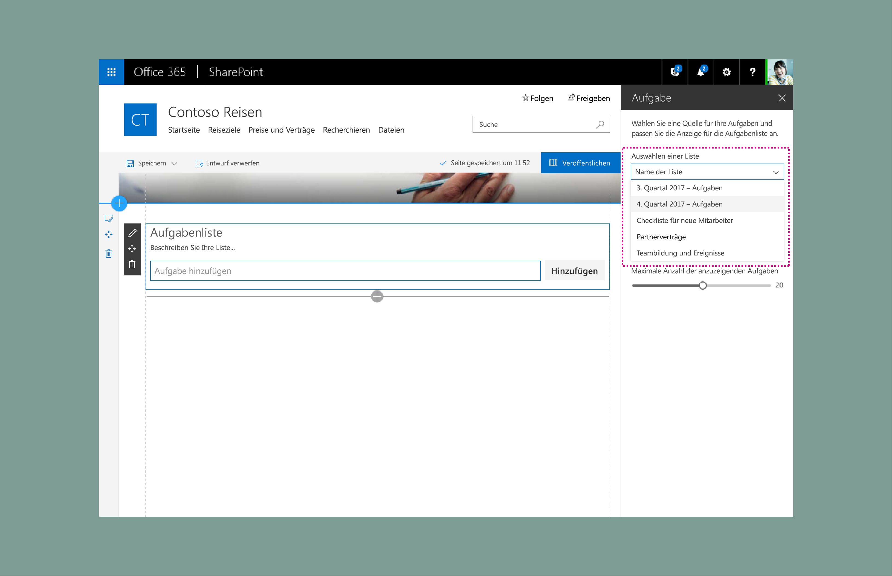

# Showcase Entwerfen von SharePoint-Webparts: Erstellen eines Eigenschaftenbereichs des Typs „Aufgabenliste“

In diesem Artikel erfahren Sie, wie Sie ein Aufgabenlisten-Webpart erstellen. Unser Beispiel verwendet den [Eigenschaftenbereichstyp](design-a-web-part.md) mit einem einzigen Bereich, ist [reaktiv](reactive-and-nonreactive-web-parts.md) und basiert auf dem dynamischen Raster von [Office UI Fabric](https://developer.microsoft.com/de-DE/fabric).

## Erstellen eines Aufgabenlisten-Webparts

1. Fügen Sie eine Beschreibung hinzu, die Benutzer über das Webpart und seine Eigenschaften informiert.

    In diesem Beispiel haben wir als Wert für die Beschreibung „Select a source for your to-dos and customize the display for the list of tasks.“ angegeben.
    
    

     

2. Fügen Sie eine Fabric-[Dropdownkomponente](https://developer.microsoft.com/de-DE/fabric#/components/dropdown) hinzu, die mit einer Liste verknüpft ist.

    

     

3. Fügen Sie eine Fabric-[Kontrollkästchenkomponente](https://developer.microsoft.com/de-DE/fabric#/components/checkbox) hinzu, über die abgeschlossene Aufgaben angezeigt werden können.

    

     

4. Fügen Sie zwei weitere Kontrollkästchen hinzu, mit denen der Benutzer die Anzeigeoptionen steuern kann.

    

     

5. Fügen Sie eine Fabric-[Schiebereglerkomponente](https://developer.microsoft.com/de-DE/fabric#/components/slider) hinzu, über die der Benutzer festlegen kann, wie viele Elemente maximal angezeigt werden sollen.

    

     

6. Als Nächstes wählen Sie eine Liste aus, die automatisch im Aufgabenlisten-Webpart angezeigt werden soll. Sie können auch manuell Aufgaben hinzufügen, die automatisch angezeigt werden sollen.

    

     

    

     

    

     

7. Das Webpart zeigt einen Indikator für Elemente an, die auf der Seite geladen werden.

    

     

8. Die Elemente aus der Liste werden geladen.

    

     

    Sobald die neuen Aufgaben geladen wurden, werden sie mithilfe von Animationskomponenten aus Office UI Fabric eingeblendet.

    

     

9. Der Eigenschaftenbereich steuert die Benutzeroberfläche. Es werden alle Aufgaben mit aktivierter Navigationssteuerung angezeigt, basierend auf den unter „Display“ im Eigenschaftenbereich aktivierten Kontrollkästchen. 

    

     

## Dynamische Ansichten

Im Beispiel unten füllt das Webpart zwei Drittel der Spaltenbreite.

 

Im folgenden Beispiel füllt das Webpart ein Drittel der Spaltenbreite.

 

Unten sehen Sie schließlich, wie das Webpart auf Mobilgeräten angezeigt wird (schreibgeschützte Ansicht).

 

## Siehe auch

- [Entwerfen von benutzerfreundlichen SharePoint-Umgebungen](design-guidance-overview.md)