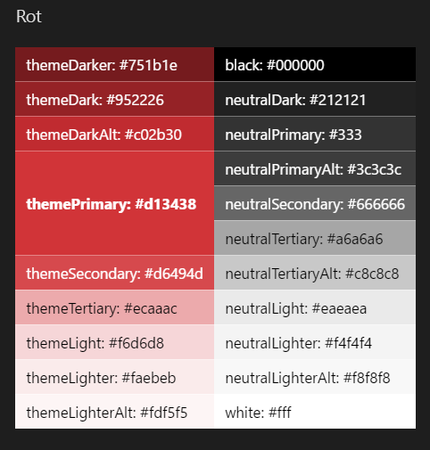
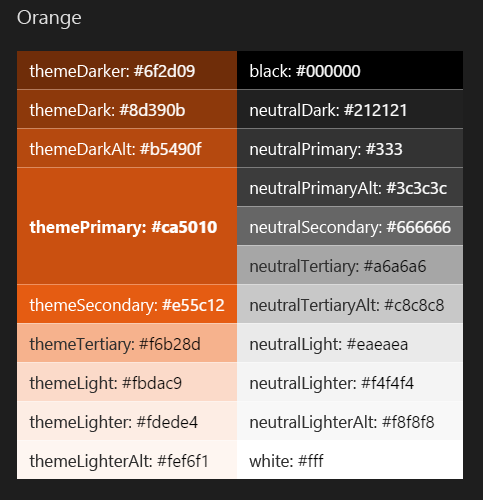
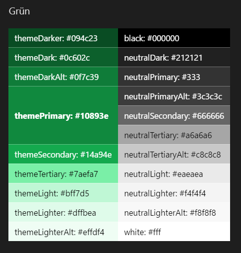
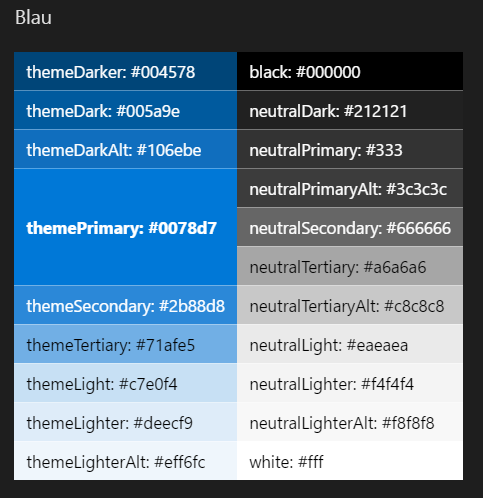
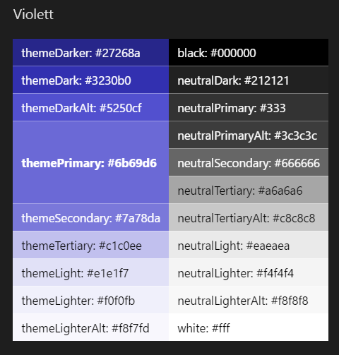
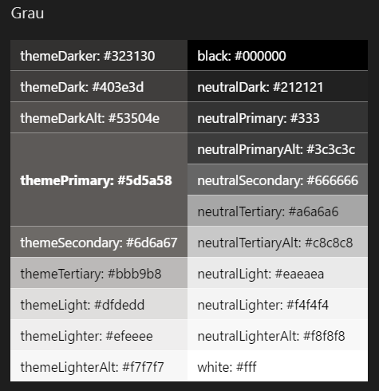

# Designs und Farben in SharePointSharePoint themes and colors

Ganz wie die Microsoft-Markenpalette orientieren sich die SharePoint-Designs am Microsoft-Markendesign. Gleichzeitig sind sie flexibel genug, um unseren Partnern eigene Anpassungen zu ermöglichen, ohne dass das Microsoft-Thema zu dominant wird.Like the Microsoft brand palette, the SharePoint themes are designed to build on the Microsoft brand, while at the same time allow for flexibility to enliven our partnerships without dominating them. So unterstreichen sie unsere gemeinsamen Ziele und Auffassungen ebenso wie unsere Unterschiede und erlauben eine Optimierung der SharePoint-Oberfläche.They reveal our shared goals and personality and reflect our diversity and ability to optimize the SharePoint experience.

 

## DesignsThemes

Die aktuell in SharePoint verfügbaren Designs und Farbpaletten wurden auf Grundlage der folgenden Designprinzipien entwickelt:The following design principles helped form the current SharePoint themes and color palette.

**Geführt****Guided** Unser Designsystem greift global. Aktualisierungen lassen sich konsistent auf sämtliche Websites anwenden. So können Benutzer Ihre Websites mühelos optimieren.Our theming system works at a global level so that updates can be made consistently across each site, allowing users to optimize their websites effortlessly. Unser Designsystem arbeitet innerhalb einer gesteuerten Umgebung, sodass sich Designs schnell und erfolgreich optimieren lassen.Our theming system operates in a controlled environment so that successful outcomes can be optimized quickly.

**Intelligent und effizient****Smart and efficient** Unser Designsystem erstellt anhand intelligenter Algorithmen Optionen für maximale Attraktivität. Das beschleunigt die Websiteerstellung.Our theming system expedites the site creation process by using smart algorithms to generate options that maximize aesthetic choices.

**Professionell**.**Professional** Unsere Designs stehen für professionelles Aussehen und Verhalten. Sie gewährleisten Konsistenz und ermöglichen es unseren Unternehmenskunden, ihre Markenidentität optimal zu kommunizieren.Our themes embody a professional look and feel that ensures coherency and conveys the brand of our enterprise audiences.

**Barrierefrei****Accessible** Unsere integrierte Barrierefreiheitsprüfung gewährleistet, dass unsere Standarddesigns in jeder Hinsicht einheitlich und universell einsetzbar sind.Our built-in accessibility checker ensures universal design at all levels of default themes. Für Benutzer, die Anpassungen vornehmen möchten, stellen wir hilfreiche Richtlinien bereit, mit denen sie Barrierefreiheit sicherstellen können.For users who decide to customize, we provide helpful guidelines to design for accessibility.

## FarbenColors

Die SharePoint-Farbpalette wurde für eine optimale Darstellung auf verschiedenen Geräten und Bildschirmgrößen optimiert. Gleichzeitig bietet sie genügend Flexibilität für eine optimale Anpassung an Ihre Marke.The SharePoint color palette has been optimized for screens and devices, and to provide enough flexibility to ensure continuity with your brand. Die von SharePoint bereitgestellten Farben gewährleisten zudem die Barrierefreiheit und gute Lesbarkeit Ihrer Oberflächen.The SharePoint-provided colors also guarantee accessible and legible experiences.

### RotRed

 

<table>
<tr>
<td style="color:white; background-color:#751b1e">themeDarker: #751b1ethemeDarker: #751b1e</td>
<td style="color:white; background-color:#000000">black: #000000black: #000000</td>
</tr>
<tr>
<td style="color:white; background-color:#952226">themeDark: #952226themeDark: #952226</td>
<td style="color:white; background-color:#212121">neutralDark: #212121neutralDark: #212121</td>
</tr>
<tr>
<td style="color:white; background-color:#c02b30">themeDarkAlt: #c02b30themeDarkAlt: #c02b30</td>
<td style="color:white; background-color:#333">neutralPrimary: #333neutralPrimary: #333</td>
</tr>
<tr>
<td rowspan="3" style="font-weight:bold; vertical-align:middle; color:white; background-color:#d13438">themePrimary: #d13438themePrimary: #d13438</td>
<td style="color:white; background-color:#3c3c3c">neutralPrimaryAlt: #3c3c3cneutralPrimaryAlt: #3c3c3c</td>
</tr>
<tr>
<td style="color:white; background-color:#666666">neutralSecondary: #666666neutralSecondary: #666666</td>
</tr>
<tr>
<td style="color:black; background-color:#a6a6a6">neutralTertiary: #a6a6a6neutralTertiary: #a6a6a6</td>
</tr>
<tr>
<td style="color:white; background-color:#d6494d">themeSecondary: #d6494dthemeSecondary: #d6494d</td>
<td style="color:black; background-color:#c8c8c8">neutralTertiaryAlt: #c8c8c8neutralTertiaryAlt: #c8c8c8</td>
</tr>
<tr>
<td style="color:black; background-color:#ecaaac">themeTertiary: #ecaaacthemeTertiary: #ecaaac</td>
<td style="color:black; background-color:#eaeaea">neutralLight: #eaeaeaneutralLight: #eaeaea</td>
</tr>
<tr>
<td style="color:black; background-color:#f6d6d8">themeLight: #f6d6d8themeLight: #f6d6d8</td>
<td style="color:black; background-color:#f4f4f4">neutralLighter: #f4f4f4neutralLighter: #f4f4f4</td></tr>
<tr>
<td style="color:black; background-color:#faebeb">themeLighter: #faebebthemeLighter: #faebeb</td>
<td style="color:black; background-color:#f8f8f8">neutralLighterAlt: #f8f8f8neutralLighterAlt: #f8f8f8</td>
</tr>
<tr>
<td style="color:black; background-color:#fdf5f5">themeLighterAlt: #fdf5f5themeLighterAlt: #fdf5f5</td>
<td style="color:black; background-color:#fff">white: #fffwhite: #fff</td>
</tr>
</table>

 

### OrangeOrange

 

<table>
<tr>
<td style="color:white; background-color:#6f2d09">themeDarker: #6f2d09themeDarker: #6f2d09</td>
<td style="color:white; background-color:#000000">black: #000000black: #000000</td>
</tr>
<tr>
<td style="color:white; background-color:#8d390b">themeDark: #8d390bthemeDark: #8d390b</td>
<td style="color:white; background-color:#212121">neutralDark: #212121neutralDark: #212121</td>
</tr>
<tr>
<td style="color:white; background-color:#b5490f">themeDarkAlt: #b5490fthemeDarkAlt: #b5490f</td>
<td style="color:white; background-color:#333">neutralPrimary: #333neutralPrimary: #333</td>
</tr>
<tr>
<td rowspan="3" style="font-weight:bold; vertical-align:middle; color:white; background-color:#ca5010">themePrimary: #ca5010themePrimary: #ca5010</td>
<td style="color:white; background-color:#3c3c3c">neutralPrimaryAlt: #3c3c3cneutralPrimaryAlt: #3c3c3c</td>
</tr>
<tr>
<td style="color:white; background-color:#666666">neutralSecondary: #666666neutralSecondary: #666666</td>
</tr>
<tr>
<td style="color:black; background-color:#a6a6a6">neutralTertiary: #a6a6a6neutralTertiary: #a6a6a6</td>
</tr>
<tr>
<td style="color:white; background-color:#e55c12">themeSecondary: #e55c12themeSecondary: #e55c12</td>
<td style="color:black; background-color:#c8c8c8">neutralTertiaryAlt: #c8c8c8neutralTertiaryAlt: #c8c8c8</td>
</tr>
<tr>
<td style="color:black; background-color:#f6b28d">themeTertiary: #f6b28dthemeTertiary: #f6b28d</td>
<td style="color:black; background-color:#eaeaea">neutralLight: #eaeaeaneutralLight: #eaeaea</td>
</tr>
<tr>
<td style="color:black; background-color:#fbdac9">themeLight: #fbdac9themeLight: #fbdac9</td>
<td style="color:black; background-color:#f4f4f4">neutralLighter: #f4f4f4neutralLighter: #f4f4f4</td>
</tr>
<tr>
<td style="color:black; background-color:#fdede4">themeLighter: #fdede4themeLighter: #fdede4</td>
<td style="color:black; background-color:#f8f8f8">neutralLighterAlt: #f8f8f8neutralLighterAlt: #f8f8f8</td>
</tr>
<tr>
<td style="color:black; background-color:#fef6f1">themeLighterAlt: #fef6f1themeLighterAlt: #fef6f1</td>
<td style="color:black; background-color:#fff">white: #fffwhite: #fff</td>
</tr>
</table>

 

### GrünGreen

 

<table>
<tr>
<td style="color:white; background-color:#094c23">themeDarker: #094c23themeDarker: #094c23</td>
<td style="color:white; background-color:#000000">black: #000000black: #000000</td>
</tr>
<tr>
<td style="color:white; background-color:#0c602c">themeDark: #0c602cthemeDark: #0c602c</td>
<td style="color:white; background-color:#212121">neutralDark: #212121neutralDark: #212121</td>
</tr>
<tr>
<td style="color:white; background-color:#0f7c39">themeDarkAlt: #0f7c39themeDarkAlt: #0f7c39</td>
<td style="color:white; background-color:#333">neutralPrimary: #333neutralPrimary: #333</td>
</tr>
<tr>
<td rowspan="3" style="font-weight:bold; vertical-align:middle; color:white; background-color:#10893e">themePrimary: #10893ethemePrimary: #10893e</td>
<td style="color:white; background-color:#3c3c3c">neutralPrimaryAlt: #3c3c3cneutralPrimaryAlt: #3c3c3c</td>
</tr>
<tr>
<td style="color:white; background-color:#666666">neutralSecondary: #666666neutralSecondary: #666666</td>
</tr>
<tr>
<td style="color:black; background-color:#a6a6a6">neutralTertiary: #a6a6a6neutralTertiary: #a6a6a6</td>
</tr>
<tr>
<td style="color:white; background-color:#14a94e">themeSecondary: #14a94ethemeSecondary: #14a94e</td>
<td style="color:black; background-color:#c8c8c8">neutralTertiaryAlt: #c8c8c8neutralTertiaryAlt: #c8c8c8</td>
</tr>
<tr>
<td style="color:black; background-color:#7aefa7">themeTertiary: #7aefa7themeTertiary: #7aefa7</td>
<td style="color:black; background-color:#eaeaea">neutralLight: #eaeaeaneutralLight: #eaeaea</td>
</tr>
<tr>
<td style="color:black; background-color:#bff7d5">themeLight: #bff7d5themeLight: #bff7d5</td>
<td style="color:black; background-color:#f4f4f4">neutralLighter: #f4f4f4neutralLighter: #f4f4f4</td>
</tr>
<tr>
<td style="color:black; background-color:#dffbea">themeLighter: #dffbeathemeLighter: #dffbea</td>
<td style="color:black; background-color:#f8f8f8">neutralLighterAlt: #f8f8f8neutralLighterAlt: #f8f8f8</td>
</tr>
<tr>
<td style="color:black; background-color:#effdf4">themeLighterAlt: #effdf4themeLighterAlt: #effdf4</td>
<td style="color:black; background-color:#fff">white: #fffwhite: #fff</td>
</tr>
</table>

 

### BlauBlue

 

<table>
<tr>
<td style="color:white; background-color:#004578">themeDarker: #004578themeDarker: #004578</td>
<td style="color:white; background-color:#000000">black: #000000black: #000000</td>
</tr>
<tr>
<td style="color:white; background-color:#005a9e">themeDark: #005a9ethemeDark: #005a9e</td>
<td style="color:white; background-color:#212121">neutralDark: #212121neutralDark: #212121</td>
</tr>
<tr>
<td style="color:white; background-color:#106ebe">themeDarkAlt: #106ebethemeDarkAlt: #106ebe</td>
<td style="color:white; background-color:#333">neutralPrimary: #333neutralPrimary: #333</td>
</tr>
<tr>
<td rowspan="3" style="font-weight:bold; vertical-align:middle; color:white; background-color:#0078d7">themePrimary: #0078d7themePrimary: #0078d7</td>
<td style="color:white; background-color:#3c3c3c">neutralPrimaryAlt: #3c3c3cneutralPrimaryAlt: #3c3c3c</td>
</tr>
<tr>
<td style="color:white; background-color:#666666">neutralSecondary: #666666neutralSecondary: #666666</td>
</tr>
<tr>
<td style="color:black; background-color:#a6a6a6">neutralTertiary: #a6a6a6neutralTertiary: #a6a6a6</td>
</tr>
<tr>
<td style="color:white; background-color:#2b88d8">themeSecondary: #2b88d8themeSecondary: #2b88d8</td>
<td style="color:black; background-color:#c8c8c8">neutralTertiaryAlt: #c8c8c8neutralTertiaryAlt: #c8c8c8</td>
</tr>
<tr>
<td style="color:black; background-color:#71afe5">themeTertiary: #71afe5themeTertiary: #71afe5</td>
<td style="color:black; background-color:#eaeaea">neutralLight: #eaeaeaneutralLight: #eaeaea</td>
</tr>
<tr>
<td style="color:black; background-color:#c7e0f4">themeLight: #c7e0f4themeLight: #c7e0f4</td>
<td style="color:black; background-color:#f4f4f4">neutralLighter: #f4f4f4neutralLighter: #f4f4f4</td>
</tr>
<tr>
<td style="color:black; background-color:#deecf9">themeLighter: #deecf9themeLighter: #deecf9</td>
<td style="color:black; background-color:#f8f8f8">neutralLighterAlt: #f8f8f8neutralLighterAlt: #f8f8f8</td>
</tr>
<tr>
<td style="color:black; background-color:#eff6fc">themeLighterAlt: #eff6fcthemeLighterAlt: #eff6fc</td>
<td style="color:black; background-color:#fff">white: #fffwhite: #fff</td>
</tr>
</table>

 

### ViolettPurple

 

<table>
<tr>
<td style="color:white; background-color:#27268a">themeDarker: #27268athemeDarker: #27268a</td>
<td style="color:white; background-color:#000000">black: #000000black: #000000</td>
</tr>
<tr>
<td style="color:white; background-color:#3230b0">themeDark: #3230b0themeDark: #3230b0</td>
<td style="color:white; background-color:#212121">neutralDark: #212121neutralDark: #212121</td>
</tr>
<tr>
<td style="color:white; background-color:#5250cf">themeDarkAlt: #5250cfthemeDarkAlt: #5250cf</td>
<td style="color:white; background-color:#333">neutralPrimary: #333neutralPrimary: #333</td>
</tr>
<tr>
<td rowspan="3" style="font-weight:bold; vertical-align:middle; color:white; background-color:#6b69d6">themePrimary: #6b69d6themePrimary: #6b69d6</td>
<td style="color:white; background-color:#3c3c3c">neutralPrimaryAlt: #3c3c3cneutralPrimaryAlt: #3c3c3c</td>
</tr>
<tr>
<td style="color:white; background-color:#666666">neutralSecondary: #666666neutralSecondary: #666666</td>
</tr>
<tr>
<td style="color:black; background-color:#a6a6a6">neutralTertiary: #a6a6a6neutralTertiary: #a6a6a6</td>
</tr>
<tr>
<td style="color:white; background-color:#7a78da">themeSecondary: #7a78dathemeSecondary: #7a78da</td>
<td style="color:black; background-color:#c8c8c8">neutralTertiaryAlt: #c8c8c8neutralTertiaryAlt: #c8c8c8</td>
</tr>
<tr>
<td style="color:black; background-color:#c1c0ee">themeTertiary: #c1c0eethemeTertiary: #c1c0ee</td>
<td style="color:black; background-color:#eaeaea">neutralLight: #eaeaeaneutralLight: #eaeaea</td>
</tr>
<tr>
<td style="color:black; background-color:#e1e1f7">themeLight: #e1e1f7themeLight: #e1e1f7</td>
<td style="color:black; background-color:#f4f4f4">neutralLighter: #f4f4f4neutralLighter: #f4f4f4</td>
</tr>
<tr>
<td style="color:black; background-color:#f0f0fb">themeLighter: #f0f0fbthemeLighter: #f0f0fb</td>
<td style="color:black; background-color:#f8f8f8">neutralLighterAlt: #f8f8f8neutralLighterAlt: #f8f8f8</td>
</tr>
<tr>
<td style="color:black; background-color:#f8f7fd">themeLighterAlt: #f8f7fdthemeLighterAlt: #f8f7fd</td>
<td style="color:black; background-color:#fff">white: #fffwhite: #fff</td>
</tr>
</table>

 

### GrauGray

 

<table>
<tr>
<td style="color:white; background-color:#323130">themeDarker: #323130themeDarker: #323130</td>
<td style="color:white; background-color:#000000">black: #000000black: #000000</td>
</tr>
<tr>
<td style="color:white; background-color:#403e3d">themeDark: #403e3dthemeDark: #403e3d</td>
<td style="color:white; background-color:#212121">neutralDark: #212121neutralDark: #212121</td>
</tr>
<tr>
<td style="color:white; background-color:#53504e">themeDarkAlt: #53504ethemeDarkAlt: #53504e</td>
<td style="color:white; background-color:#333">neutralPrimary: #333neutralPrimary: #333</td>
</tr>
<tr>
<td rowspan="3" style="font-weight:bold; vertical-align:middle; color:white; background-color:#5d5a58">themePrimary: #5d5a58themePrimary: #5d5a58</td>
<td style="color:white; background-color:#3c3c3c">neutralPrimaryAlt: #3c3c3cneutralPrimaryAlt: #3c3c3c</td>
</tr>
<tr>
<td style="color:white; background-color:#666666">neutralSecondary: #666666neutralSecondary: #666666</td>
</tr>
<tr>
<td style="color:black; background-color:#a6a6a6">neutralTertiary: #a6a6a6neutralTertiary: #a6a6a6</td>
</tr>
<tr>
<td style="color:white; background-color:#6d6a67">themeSecondary: #6d6a67themeSecondary: #6d6a67</td>
<td style="color:black; background-color:#c8c8c8">neutralTertiaryAlt: #c8c8c8neutralTertiaryAlt: #c8c8c8</td>
</tr>
<tr>
<td style="color:black; background-color:#bbb9b8">themeTertiary: #bbb9b8themeTertiary: #bbb9b8</td>
<td style="color:black; background-color:#eaeaea">neutralLight: #eaeaeaneutralLight: #eaeaea</td>
</tr>
<tr>
<td style="color:black; background-color:#dfdedd">themeLight: #dfdeddthemeLight: #dfdedd</td>
<td style="color:black; background-color:#f4f4f4">neutralLighter: #f4f4f4neutralLighter: #f4f4f4</td>
</tr>
<tr>
<td style="color:black; background-color:#efeeee">themeLighter: #efeeeethemeLighter: #efeeee</td>
<td style="color:black; background-color:#f8f8f8">neutralLighterAlt: #f8f8f8neutralLighterAlt: #f8f8f8</td>
</tr>
<tr>
<td style="color:black; background-color:#f7f7f7">themeLighterAlt: #f7f7f7themeLighterAlt: #f7f7f7</td>
<td style="color:black; background-color:#fff">white: #fffwhite: #fff</td>
</tr>
</table>

 

## Siehe auchSee also

- [BarrierefreiheitAccessibility](accessibility.md)
- [Entwerfen von benutzerfreundlichen SharePoint-UmgebungenDesigning great SharePoint experiences](design-guidance-overview.md)
