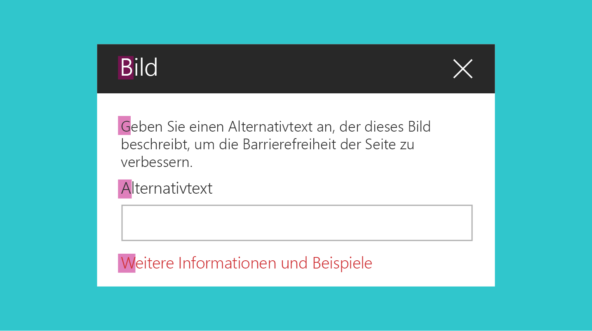
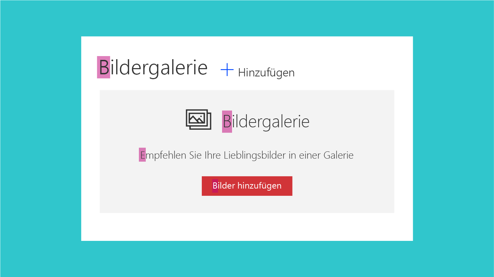
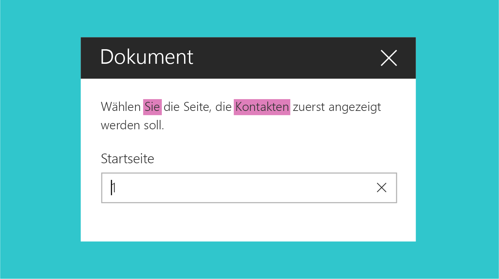

# Richtlinien für Benutzeroberflächentext in SharePoint-WebpartsUI text guidelines for SharePoint web parts
 
Eine wichtige Voraussetzung für die Erstellung effektiver Webparts in SharePoint ist die Verwendung von einfachem, verständlichem und präzisem Benutzeroberflächentext.One aspect of creating effective web parts in SharePoint is to use simple, understandable, and concise UI text. Klare und leicht nachvollziehbare Formulierungen stellen sicher, dass Kunden schnell in der Oberfläche des Webparts navigieren und unkompliziert die Inhalte finden können, die sie suchen.By keeping your message clear and easy to understand, you ensure that customers move through your experiences quickly and can identify the content they are looking for. In diesem Artikel finden Sie eine Anleitung für die Formulierung von Benutzeroberflächentext für wichtige Bereiche innerhalb von SharePoint-Webparts.This article provide guidance for writing UI text for key areas within SharePoint web parts.

## GroßschreibungCapitalization

Verwenden Sie den sogenannten „sentence case“ (Groß- und Kleinschreibung im Satz: erster Buchstabe des ersten Worts großgeschrieben, der Rest vollständig in Kleinbuchstaben) für alle Benutzeroberflächenelemente, einschließlich Schaltflächen, Seitentiteln und Steuerelementbeschriftungen.Use sentence casing (first letter of first word is capitalized, the rest all lowercase) for all UI elements, including buttons, page titles, and control labels. 

Schreiben Sie Folgendes immer groß:Always capitalize:

- Das erste Wort eines neuen SatzesThe first word of a new sentence.
- Das Wort nach einem Doppelpunkt in einem Titel oder einer ÜberschriftThe word following a colon in a title or heading. Beispiel: „Step 1: Begin by entering your account information.“For example, "Step 1: Begin by entering your account information".
- Eigennamen, zum Beispiel Namen von Personen und StädtenProper nouns, such as names of people, cities, and so on. 

 

## SatzzeichenPunctuation

Befolgen Sie die grundlegenden Zeichensetzungsregeln, um Grammatikfehler in Ihrer Oberfläche zu vermeiden.Follow the basic rules of punctuation to avoid grammatical errors in your experience. Die folgende Tabelle enthält einen kurzen Überblick darüber, welche Satzzeichen wann verwendet werden sollten und warum.The following table provides guidance and reminders about what punctuation to use to use when, and why.

|SatzzeichenPunctuation  |TippGuidance                                        |BeispielExample          |
|-------------|------------------------------------------------|-----------------|          
|Doppelpunkte (:)Colons (:)  | Verwenden Sie Doppelpunkte nach der Einleitung einer Liste in der Webpartbeschreibung.Use colons if you are introducing a list in the web part description. Verwenden Sie keine Doppelpunkte in Benutzeroberflächenbeschriftungen.Don't use colons in UI labels.| Choose one of the following: Cats, Dogs, QuokkasChoose one of the following: Cats, Dogs, Quokkas    |                        
|Kommas (,)Commas (,)  | Verwenden Sie Kommas in Aufzählungen (auch vor dem Wort „and“).Use serial commas (including before the word "and").  |I like cats, birds, and dogs.I like cats, birds, and dogs. |
|Auslassungspunkte (...)Ellipses (…)| Verwenden Sie Auslassungspunkte zur Kennzeichnung von abgeschnittenem Text sowie für Fortschrittsmeldungen.Use ellipses to show truncation and for progress indicator strings. Verwenden Sie Auslassungspunkte nicht als Hinweis darauf, dass der Benutzer eine weitere Auswahl treffen muss.Do not use ellipses to indicate that the user must make further choices.|Abgeschnittener Text: Last modified by John Armstr…Truncation: Last modified by John Armstr… Fortschrittsmeldung: Uploading…Progress indicator: Uploading… |  
|Punkte (.)Periods (.) | Verwenden Sie Punkte in Beschreibungen wie gewohnt.Use periods as you normally would for descriptions. Verwenden Sie keine Punkte in Titeln, Überschriften oder Beschriftungen.Don't use periods in titles, headings, or labels. Verwenden Sie keine Punkte für den Text von Optionsfeldern oder Kontrollkästchen.Don't use periods for radio button options or checkboxes. | Wählen Sie den Inhalt, den Sie hervorheben möchten, und wie er angezeigt werden soll.Select the content you want to highlight and how you want it displayed. Verwenden Sie einen Filter, um die Auswahl einzuschränken.Use a filter to narrow your selection. |

## Stil und UmgangstonVoice and tone

Innerhalb Ihres Produkts den richtigen Ton bei der Kommunikation mit dem Benutzer zu treffen, ist für den Aufbau einer stabilen, langfristigen Beziehung zu Ihrer Zielgruppe sehr wichtig.Crafting the right tone in your product communication is essential to building a strong, lasting relationship with your audience. Versuchen Sie, klare und deutliche Worte zu finden und herzlich, entspannt und zugänglich zu klingen.Try to keep your words crisp and clear, warm and relaxed, and approachable. Die Art und Weise, wie Sie mit Ihrer Zielgruppe sprechen, beeinflusst, wie sich diese auf Ihre Website und Ihre Inhalte einlässt und wie viel Nutzen sie daraus zieht.How you talk to your audience influences how they will engage with your site and content, and how much value they will derive from it.

**Dos:****Do:**

- Verwenden Sie in der Benutzeroberfläche einen zwanglosen Umgangston.Use a casual, conversational tone in the UI. 
- Verwenden Sie Schmelzworte.Use contractions. (Beispiel: „can‘t“ statt „cannot“)For example, use "can't" instead of "cannot".
- Lesen Sie Ihren Benutzeroberflächentext laut vor, um ein Gefühl dafür zu bekommen, wie er wirkt.Read your UI text out loud to test the tone. Klingt er wie Alltagssprache?Does it sound like everyday language?
- Verwenden Sie einfache Wörter.Use simple words. 
- Erwähnen Sie keine technischen Details, wenn sie für den Benutzer nicht relevant sind.Remove technical details if they're not relevant to the user experience. 
- Verwenden Sie „Please“ nur, wenn Sie dem Benutzer Unannehmlichkeiten bereiten.Use "Please" only if you are inconveniencing the user. Vermeiden Sie eine übermäßige Verwendung.Avoid overuse.
- Verwenden Sie „Sorry“ nur in Fehlermeldungen in SharePoint, die zu schwerwiegenden Problemen für den Kunden führen.Use "Sorry" only in error messages in SharePoint that result in serious problems for the customer. 

**Don’ts:****Don't:**

- Überladen Sie Benutzeroberflächentext nicht mit unnötigen Wiederholungen.Clutter the UI text with unnecessary repetition. Jedes Wort sollte aussagekräftig sein.Make every word meaningful. 

## PronomenPronouns

Vermeiden Sie nach Möglichkeit Pronomen in Benutzeroberflächenelementen.Avoid pronouns in UI elements if possible. Wenn Sie etwas genauso gut auch ohne ein Pronomen sagen können, dann verwenden Sie keins.If you can say something equally well without using a pronoun, don't use it.

Wenn Ihr Design den Einsatz von Pronomen rechtfertigt, sollten Sie die folgenden Richtlinien beherzigen, um sicherzustellen, dass Sie sie auch korrekt verwenden:If your design does warrant using pronouns, apply the following guidelines to make sure that you're using them correctly.

**Dos:****Do:**

- Verwenden Sie die zweite Person („you“ oder „your“), wenn Sie sich auf etwas beziehen, das dem Benutzer gehört.Use second person ("you" or "your") when you're presenting something that belongs to the user. (Beispiel: „Your drafts“ oder „Your images“)For example, "Your drafts" or "Your images".
- Verwenden Sie die erste Person („me“ oder „my“) für Benutzeroberflächenelemente, mit denen der Benutzer den Dienst anweist, etwas zu tun.Use first person ("me" or "my") for UI in which the user instructs the service to do something. (Beispiel: „Alert me when someone responds to my post.“)For example, "Alert me when someone responds to my post."
- Verwenden Sie „they“ oder „their“ als Possessivbestimmungswort im Singular, um umständliche „he/she“- bzw. „his/her“-Konstruktionen zu vermeiden.Use "they" or "their" as a singular possessive modifier to avoid awkward "he/she" or "his/her" constructs. Schreiben Sie den Satz im Idealfall in den Plural um.Ideally, rewrite the sentence as plural if possible.
- Vermeiden Sie die Verwendung von „them“; verwenden Sie stattdessen Wörter wie „someone“ oder „people“.Avoid using "them"; instead, use words like "someone" or "people". Beispiel: „Enter a user name and domain to give someone permission to use this PC.“For example, "Enter a user name and domain to give someone permission to use this PC."

 

**Don’ts:****Don't:**

- Verwenden Sie nicht die dritte Person. Das klingt unpersönlich und kann dazu führen, dass sich der Kunde kaum angesprochen fühlt.Use third person references, as they sound impersonal and can create a disconnected customer experience. Verwenden Sie statt „Users can change the layout“ eine Formulierung wie „You can change the layout“.Instead of saying "Users can change the layout", use a phrase like "You can change the layout".

## FehlermeldungenError messages

Fehler treten in jeder Software und jedem Dienst auf.Error conditions are inherent in any software or service. Ihre Fehlermeldungen können direkten Einfluss auf die Gesamtzufriedenheit der Benutzer mit Ihrem Produkt haben.Your error messages can affect the overall user satisfaction with the product. Eine gute Fehlermeldung sollte folgende Merkmale aufweisen:A good error message should do the following:

- Sie sollte eindeutig darüber informieren, was geschehen ist und warum.Clearly identify what happened and why.
- Sie sollte eine provisorische oder permanente Lösung vorschlagen.Provide a workaround or resolution suggestions.
- Sie sollte Mitgefühl ausdrücken.Show empathy.

<!-- You might need to explain how to show empathy in an error message, without using "sorry". -->

Unten sehen Sie ein Beispiel für eine Fehlermeldung, die angezeigt wird, wenn ein Benutzer versucht, eine Seite zu bearbeiten, die von einem anderen Benutzer ausgecheckt wurde.The following is an example of an error message that occurs when a user tries to edit a page that's checked out by another user.

| Keine Bearbeitung möglichYou can't edit right now                                                |
|-------------------------------------------------------------------------|
| Die Seite wird zurzeit von einem anderen Benutzer bearbeitet.User is currently editing this page. Versuchen Sie es in einigen Minuten erneut.Please try again in a few minutes. |

## Links zu HilfeartikelnLinks to help articles

Bemühen Sie sich darum, Links zu Hilfeartikeln strategisch zu setzen.Make an effort to link strategically to help articles. Versuchen Sie, vorherzusehen, wo der Benutzer Hilfe benötigen könnte, und platzieren Sie einen Link zu dem passenden Hilfeartikel nahe bei dem betreffenden Benutzeroberflächenelement.Try to anticipate where the user might need help, and then include a link to the help article close to that UI element. Unten haben wir einige wichtige Tipps zusammengestellt, die Sie beachten sollten, wenn Sie in Ihrer Benutzeroberfläche Links zu Hilfeartikeln platzieren:The following are some key things to remember when you place help article links in your UI.

**Dos:****Do:**

- Hilfelinks im Produkt sollten spezifisch sein.Keep the in-product help links specific. Stellen Sie sicher, dass der Zielartikel thematisch passt.Ensure that the target article is appropriate. Wenn Benutzer den Artikel öffnen, sollten sie die benötigten Informationen finden können.When the user opens the article, they should be able to locate the information they need. 
- Formulieren Sie den Linktext in natürlicher Sprache.Use natural language for your hyperlinks.  

<!-- You might want to provide an example of "natural" language. -->

**Don’ts:****Don’t:**

- Platzieren Sie nicht neben jedem Benutzeroberflächenelement einen Link zu einem Hilfeartikel.Put a help article link next to every UI element. Dies führt zu visuellem Rauschen.This will result in visual noise.
- Platzieren Sie nicht mehrere Links zum gleichen Ziel in ein und derselben Benutzeroberfläche.Include multiple links that go to the same target in the same UI.
- Verwenden Sie nicht „click here“ als Linktext.Use "click here" for the text for your hyperlink. 

## HinweistextHint text

Hinweistext oder Geistertext sind Textelemente, die in einem Benutzeroberflächenelement (in der Regel in Textfeldern) angezeigt werden, um dem Benutzer Tipps zur Interaktion mit dem Element zu geben.Hint text, or ghost text, is the text element you display in a UI element, typically a textbox, to help the user interact with the UI. Der Hinweistext informiert den Benutzer darüber, was er in das Feld eingeben soll.The hint text gives information about what the user should enter. So kann er über Einschränkungen für das Feld informieren oder ein Beispiel geben.For example, it might mention field restrictions or show an example.

**Dos:****Do:**

- Verwenden Sie Hinweistext sparsam und nur, wenn er den Benutzern hilft.Use hint text sparingly, and only if it will help the user. Nicht alle Benutzeroberflächenelemente erfordern einen Hinweistext.Not all UI elements require hint text. Bei einigen komplexen Feldern kann Hinweistext mehr Kontext und Klarheit bieten.For some complex fields, hint text can help provide more context and clarity. Beispiel: Bei einem Feld, in das der Benutzer eine sichere URL eingeben muss, ist der Hinweistext „https://www.example.com“ möglicherweise hilfreicher als der Text **Hier sichere URL eingeben.**For example, if you have a field that requires the user to enter a secured URL, the hint text https://www.example.com might be more helpful than the text **Enter secure URL here.**

**Don’ts****Don't**

- Wiederholen Sie nicht einfach nur die Beschriftung:Repeat the label. Bei einem Textfeld mit der Beschriftung **Name** beispielsweise ist der Hinweistext **Namen eingeben** redundant und eventuell sogar verwirrend.For example, if you have a text box with the label **Name**, the hint text **Enter name** is redundant and potentially confusing.

Der folgende Hinweistext ist für das Einbetten-Webpart gedacht.The following hint text is for the embed web part. In das Textfeld kann eine sichere Websiteadresse oder ein iFrame-Einbettungscode eingegeben werden.The text field can accept a secure website address or an iframe embed code. Der Text zeigt ein Beispiele für jede der beiden Varianten.The text shows an example of both. 

## Siehe auchSee also

- [Entwerfen von benutzerfreundlichen SharePoint-UmgebungenDesigning great SharePoint experiences](design-guidance-overview.md)