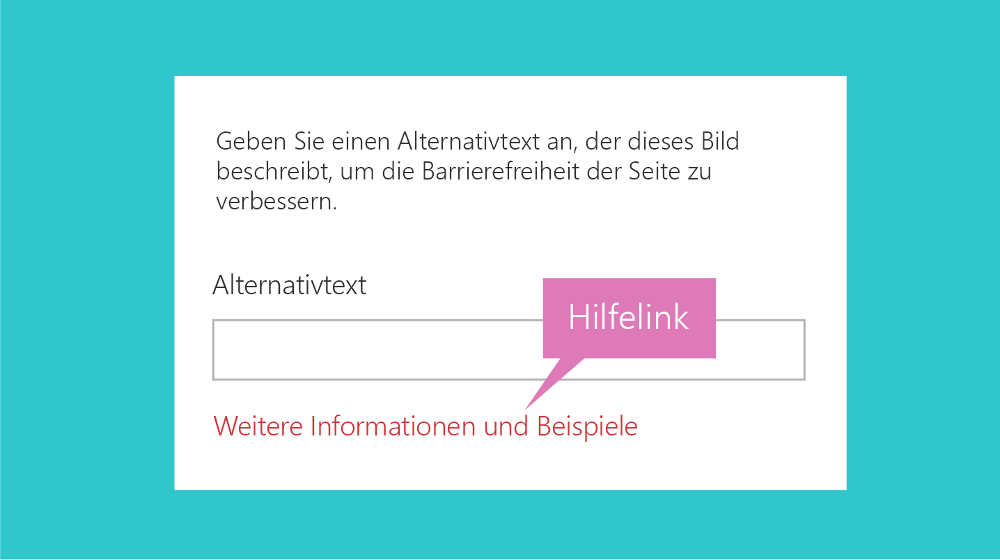
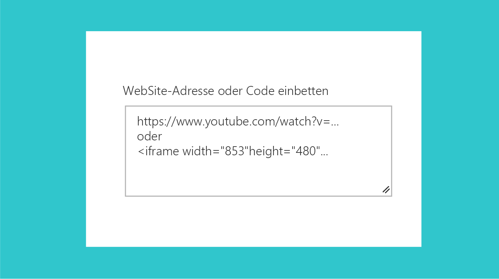

# Richtlinien für Benutzeroberflächentext für SharePoint-Webparts
 
Ein Aspekt bei der Erstellung effektiver Webparts in SharePoint ist die Verwendung von einfachem, verständlichem und präzisem Benutzeroberflächentext. Indem Sie Ihre Nachricht eindeutig und leicht verständlich halten, stellen Sie sicher, dass Kunden schnell durch Ihre Oberfläche navigieren und den Inhalt identifizieren können, nach dem sie suchen. In diesem Artikel finden Sie eine Anleitung zum Schreiben von Benutzeroberflächentext für wichtige Bereiche innerhalb von SharePoint-Webparts. (Die Anleitung bezieht sich auf englischsprachigen Text.)

## Großschreibung

Verwenden Sie Groß-/Kleinschreibung im Satz (erster Buchstaben des ersten Worts wird großgeschrieben, der Rest vollständig in Kleinbuchstaben) für alle Benutzeroberflächenelemente, einschließlich Schaltflächen, Seitentitel und Steuerelementbezeichnungen. 

Schreiben Sie Folgendes immer groß:

- Das erste Wort eines neuen Satzes.
- Das Wort nach einem Doppelpunkt in einem Titel oder einer Überschrift. Beispiel: „Step 1: Begin by entering your account information.“
- Nomen, z. B. Namen von Personen, Orten usw. 
 

## Interpunktion

Befolgen Sie die grundlegenden Interpunktionsregeln, um Grammatikfehler in Ihrer Oberfläche zu vermeiden. Die folgende Tabelle enthält eine Anleitung und Erinnerungen, wann welche Interpunktion zu verwenden ist, und aus welchem Grund.

| Interpunktion  | Anleitung                                                                                                                                                       | Beispiel                                                                                                        |
|--------------|----------------------------------------------------------------------------------------------------------------------------------------------------------------|----------------------------------------------------------------------------------------------------------------|
| Doppelpunkte (:)   | Verwenden Sie Doppelpunkte, wenn Sie eine Liste in der Beschreibung des Webparts einleiten. Verwenden Sie keine Doppelpunkte in Benutzeroberflächenbezeichnungen.                                                           | Choose one of the following: Cats, Dogs, Quokkas                                                                 |
| Kommas (,)   | Verwenden Sie Kommas in Aufzählungen (auch vor dem Wort „and“).                                                                                                           | I like cats, birds, and dogs.                                                                                  |
| Auslassungszeichen (...) | Verwenden Sie Auslassungszeichen zur Kennzeichnung abgeschnittener Daten und in Statusanzeige-Zeichenfolgen. Verwenden Sie Auslassungszeichen nicht, um darauf hinzuweisen, dass der Benutzer weitere Auswahlen treffen muss.          | Abgeschnittene Daten: Last modified by John Armstr… Statusanzeige: Uploading…                                       |
| Punkte (.)  | Verwenden Sie keine Punkte im Titeln, Überschriften oder Bezeichnungen. Verwenden Sie keine Punkte für Optionsfelder oder Kontrollkästchen. Verwenden Sie Punkte wie gewohnt für Beschreibungen. | Select the content you want to highlight and how you want it displayed. Use a filter to narrow your selection. |

## Sprache und Ton

Den richtigen Ton in der Produktkommunikation zu treffen, ist für den Aufbau einer stabilen, langfristigen Beziehung zu Ihrer Zielgruppe sehr wichtig. Versuchen Sie, klare und deutliche Worte zu finden und herzlich, entspannt und zugänglich zu klingen. Die Art und Weise, wie Sie zu Ihre Zielgruppe sprechen, beeinflusst, wie sich diese auf Ihre Website einlässt und wie viel Nutzen sie daraus zieht.

**Dos:**

- Verwenden Sie in der Benutzeroberfläche einen zwanglosen Gesprächston. 
- Verwenden Sie Schmelzworte. Verwenden Sie z. B. „can't“ anstelle von „cannot“.
- Lesen Sie Ihren Benutzeroberflächentext laut vor, um den Ton zu testen. Hört es sich wie Umgangssprache an?
- Verwenden Sie einfache Wörter. 
- Entfernen Sie technische Details, wenn sie für die Benutzeroberfläche nicht relevant sind. 
- Verwenden Sie „Please“ nur, wenn Sie dem Benutzer Unannehmlichkeiten bereiten. Vermeiden Sie übermäßige Verwendung.
- Verwenden Sie „Sorry“ nur in Fehlermeldungen in SharePoint, die zu schwerwiegenden Problemen für den Kunden führen. 

**Don’ts:**

- Überladen Sie Benutzeroberflächentext nicht mit unnötigen Wiederholungen. Jedes Wort sollte aussagekräftig sein. 

## Pronomen

Vermeiden Sie nach Möglichkeit Pronomen in Benutzeroberflächenelementen. Wenn Sie etwas genauso gut auch ohne ein Pronomen sagen können, verwenden sie keins.

Wenn Ihr Design die Verwendung von Pronomen rechtfertigt, wenden Sie die folgenden Richtlinien an, um sicherzustellen, dass Sie sie ordnungsgemäß verwenden.

**Dos:**

- Verwenden Sie die zweite Person („you“ oder „your“), wenn Sie sich auf etwas beziehen, das dem Benutzer gehört. Beispiel: „Your drafts“ oder „Your images“.
- Verwenden Sie die erste Person („me“ oder „my“) für Benutzeroberflächenelemente, in denen der Benutzer den Dienst anweist, etwas zu tun. Beispiel: „Alert me when someone responds to my post.“
- Verwenden Sie „they“ oder „their“ als Possessivbestimmungswort im Singular, um unpraktische „he/she“- bzw. „his/her“-Konstrukte zu vermeiden. Schreiben Sie den Satz im Idealfall im Plural um.
- Vermeiden Sie die Verwendung von „them“; verwenden Sie stattdessen Wörter wie „someone“ oder „people“. Beispiel: „Enter a user name and domain to give someone permission to use this PC.“

 

**Don’ts:**

- Verwenden Sie keine Verweise in der dritten Person, da diese unpersönlich klingen und eine zusammenhangloses Kundenerlebnis erzeugen können. Anstatt „Users can change the layout“ verwenden Sie einen Ausdruck wie „You can change the layout“.

## Fehlermeldungen

Fehlerzustände gibt es in jeder Software und jedem Dienst. Ihre Fehlermeldungen können die Gesamtzufriedenheit der Benutzer mit dem Produkt beeinflussen. Eine gute Fehlermeldung sollte folgende Merkmale aufweisen:

- Sie sollte eindeutig identifizieren, was geschehen ist und warum.
- Sie sollte eine provisorische oder permanente Lösung vorschlagen.
- Sie sollte Empathie zeigen.

<!-- You might need to explain how to show empathy in an error message, without using "sorry". -->

Nachfolgend finden Sie ein Beispiel für eine Fehlermeldung, die auftritt, wenn ein Benutzer versucht, eine Seite zu bearbeiten, die von einem anderen Benutzer ausgecheckt ist.

| Sie können derzeit keine Änderungen vornehmen.                                                |
|-------------------------------------------------------------------------|
| Die Seite wird zurzeit von einem anderen Benutzer bearbeitet. Versuchen Sie es in einigen Minuten erneut. |

## Links zu Hilfeartikeln

Bemühen Sie sich um strategische Links zu Hilfeartikeln. Versuchen Sie vorherzusehen, wo der Benutzer eventuell Hilfe benötigt, und schließen Sie einen Link zum Hilfeartikel nahe dieses Benutzeroberflächenelements ein. Im Folgenden werden einige wichtige Aspekte aufgeführt, die Sie beim Platzieren von Links zu Hilfeartikeln in der Benutzeroberfläche berücksichtigen sollten.

**Dos:**

- Hilfelinks im Produkt sollten spezifisch sein. Stellen Sie sicher, dass der Zielartikel geeignet ist. Wenn Benutzer den Artikel öffnen, sollten sie die benötigten Informationen finden können. 
- Verwenden Sie natürliche Sprache für Ihre Links.  

<!-- You might want to provide an example of "natural" language. -->

**Don’ts:**

- Platzieren Sie nicht neben jedem Benutzeroberflächenelement einen Link zu einem Hilfeartikel. Dies führt zu visuellem Rauschen.
- Schließen Sie nicht mehrere Links zum gleichen Ziel in eine bestimmte Benutzeroberfläche ein.
- Verwenden Sie nicht „hier klicken“ als Linktext. 

## Hinweistext

Hinweistext oder Geistertext ist das Textelement, das Sie in einem Benutzeroberflächenelement (in der Regel einem Textfeld) anzeigen, um dem Benutzer die Interaktion mit der Benutzeroberfläche zu erleichtern. Der Hinweistext enthält Informationen darüber, was der Benutzer eingeben muss. Er kann z. B. Feldeinschränkungen nennen oder ein Beispiel zeigen.

**Dos:**

- Verwenden Sie Hinweistext sparsam und nur, wenn er den Benutzern hilft. Nicht alle Benutzeroberflächenelemente erfordern Hinweistext. Bei einigen komplexen Feldern kann Hinweistext mehr Kontext und Klarheit bieten. Beispiel: Bei einem Feld, in das der Benutzer eine sichere URL eingeben muss, ist der Hinweistext „https://www.example.com“ möglicherweise besser geeignet als der Text **Hier sichere URL eingeben.**

**Don’ts**

- Wiederholen Sie nicht die Bezeichnung: Bei einem Textfeld mit der Bezeichnung **Name** beispielsweise ist der Hinweistext **Namen eingeben** redundant und eventuell sogar verwirrend.

Der folgende Hinweistext ist für das Einbetten-Webpart. In das Textfeld kann eine sichere Websiteadresse oder ein IFrame-Einbettungscode eingegeben werden. Der Text zeigt ein Beispiel für beide. 

